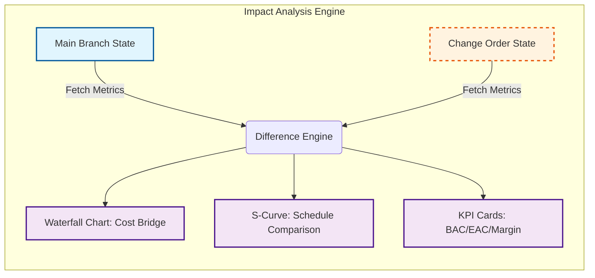

# Change Management User Stories & Workflow

**Last Updated:** 2026-01-11  
**Status:** Draft  
**Related:** [Functional Requirements](functional-requirements.md) | [Time Travel & Branching Architecture](../02-architecture/cross-cutting/temporal-query-reference.md) | [EVM Requirements](evm-requirements.md)

---

## 1. Overview

This document outlines the user experience and functional workflows for **Change Management** within the Backcast EVS system. It leverages the underlying **Branching Architecture** to provide a robust, isolated environment for managing Change Orders (COs) throughout their lifecycle—from drafting and scoping to impact analysis and final implementation.

## 2. Change Management Workflow

The lifecycle of a Change Order follows a strict workflow to ensure data integrity and proper authorization:

1. **Creation (Drafting):** A Project Manager creates a CO. The system spawns a dedicated **Change Order Branch**.
2. **Scoping (Work in Branch):** Users switch to the CO Branch to modify Project structures (WBEs), Cost Elements, Budgets, and Schedules. These changes are isolated from the Production (Main) environment.
3. **Impact Analysis:** Before submission, the CO Branch is compared against the Main Branch to visualize financial and schedule impacts.
4. **Submission:** The CO is submitted for review. The branch is **Locked** to prevent further changes.
5. **Review & Decision:** Approvers review the impact. Additional details may be requested (unlocking the branch), or the CO is Approved/Rejected.
6. **Implementation (Merge):** Upon approval, the CO Branch is **Merged** into the Main Branch, updating the live project baseline. Use of the CO Branch is concluded.

---

## 3. User Stories

### 3.1 Creation of a Change (and Branch Generation)

**Authorized Roles:** System Administrator, Project Manager

**User Story:**

> **As a** Project Manager  
> **I want to** create a new Change Order with a specific ID and description  
> **So that** I can start scoping a potential change to the project without affecting the current baseline.

**Functionality:**

- **Input:** User provides a Change Order ID (e.g., `CO-2026-001`), Title, Description, Justification, and Effective Date.
- **System Action:**
  - Creates a new **Change Order Record** in the database.
  - Automatically triggers the **Branch Creation** process, generating a new branch `BR-{change_order_id}` (e.g., `BR-CO-2026-001`).
  - **Source Selection:** The branch is a logical fork of the selected **Source Branch** (default: `main`). This allows chaining changes (e.g., Change B depends on Change A).
- **UX Experience:**
  - Upon success, the UI prompts the user: _"Change Order Created. Switch to branch 'BR-CO-2026-001' to begin editing?"_
  - Visual indicators (e.g., a "Draft" status badge) appear next to the CO in the list.

### 3.2 Performing Work on a Change

**Authorized Roles:** System Administrator, Project Manager

**User Story:**

> **As a** Project Manager  
> **I want to** modify WBEs, Cost Elements, and Budgets within the Change Order context  
> **So that** I can define the new scope and costs required by the change.

**Functionality:**

- **Branch Context:** The user selects the CO Branch from the **Branch Selector** in the application header.
- **Visual Cues:** The UI header changes color (e.g., to amber/orange) to clearly indicate a **Non-Production Environment**.
- **Operations:**
  - **Modify:** Update existing budget allocations, change delivery dates, or adjust revenue distributions.
  - **Create:** Add new WBEs or Cost Elements required for the change.
  - **Delete/Deactivate:** Mark scope that is being removed.
- **Isolation:** All actions affect **only** the data version tagged with the current branch (`BR-{change_order_id}`). The `main` branch remains untouched and viewable by others.

### 3.3 Updating the Change Metadata

**Authorized Roles:** System Administrator, Project Manager

**User Story:**

> **As a** Project Manager  
> **I want to** update the details of the Change Order itself (e.g., justification, target date)  
> **So that** the change record reflects the evolving reality of the negotiation.

**Functionality:**

- **Edit Change Order:** A dedicated form allows editing the administrative metadata of the CO (Description, Justification).
- **Branch Independence:** These updates apply to the Change Order entity itself, which wraps the branch, rather than the project data within the branch.

### 3.4 Reviewing Change Impacts (Impact Analysis)

**Authorized Roles:** System Administrator, Project Manager, Project Controller, Department Manager

**User Story:**

> **As a** Project Controller  
> **I want to** visually compare the proposed Change Order against the current Main Branch using interactive charts  
> **So that** I can instantly spot deviations in Cash Flow, Profitability, and Schedule before approval.

**Functionality (Visual Comparison):**

- **Comparison Engine:** User triggers an **"Analyze Impact"** action.
- **Impact Dashboard:** The system displays a comprehensive visual dashboard contrasting "As-Is" (Main) vs. "To-Be" (Change Order) states:
  - **KPI Scorecards:** Side-by-side metric cards for Total Budget (BAC), Estimate at Completion (EAC), Gross Margin, and CPI/SPI.
  - **Delta Waterfall Chart:** A graphical breakdown showing the bridge from current to proposed costs (e.g., `Current Margin` &rarr; `Labor Cost Increase` &rarr; `Material Savings` &rarr; `New Margin`).
  - **Time-Phased S-Curves:** A dual-line chart overlaying the **Main Branch PV** (Solid Line) vs. **Change Branch PV** (Dashed Line) to visualize schedule acceleration, delays, or cash flow spikes.
  - **Entity Impact Grid:** A detailed data grid listing specifically which WBEs or Cost Elements have been modified, added, or removed, using conditional formatting (Red/Green) to highlight significant variances.

**Visual Dataflow:**

### 3.5 Submitting the Change

**Authorized Roles:** System Administrator, Project Manager

**User Story:**

> **As a** Project Manager  
> **I want to** submit the Change Order for approval  
> **So that** the Change Control Board can review it and giving their sign-off.

**Functionality:**

- **State Transition:** User changes status from "Draft" to "Submitted" (or "Pending Approval").
- **Branch Locking:** The system **Locks** the branch `BR-{change_order_id}`.
  - **Read-Only:** No further edits to WBEs or Costs are allowed in this branch while in "Submitted" state.
  - **Unlock:** If rework is needed, the status must be moved back to "Draft" (potentially requiring special permissions).

### 3.6 Accepting the Change (Merge)

**Authorized Roles:** System Administrator, Project Manager

**User Story:**

> **As a** Project Manager or System Administrator
> **I want to** Approve and Implement the Change Order  
> **So that** the project baseline is officially updated to include the new scope.

**Functionality:**

- **Approval Action:** User clicks "Approve Change".
- **Merge Operation:** The system checks out the **Target Branch** (e.g., `main` or another active change branch) and **Merges** the `BR-{change_order_id}` branch into it.
  - **Resolution:** The logic typically follows a "Change Wins" strategy (overwriting Target with Source values), assuming the Target hasn't diverged significantly in a conflicting way (concurrency checks apply).
  - **History:** The versions in the Target branch are effectively superseded by the versions from the CO branch.
- **Closure:**
  - Change Order Status becomes "Implemented" or "Approved".
  - The CO branch is marked as **Merged** (archived).
  - Users are automatically switched back to the `main` branch.

### 3.7 Rejecting or Deleting the Change

**Authorized Roles:** System Administrator, Project Manager

**User Story:**

> **As a** Project Manager  
> **I want to** delete a Draft Change Order or discard a Rejected one  
> **So that** I can keep the system clean of abandoned scenarios.

**Functionality:**

- **Delete Draft:** If in "Draft", the user can "Delete" the Change Order.
  - **Action:** System performs a soft delete of the Change Order record and marks the associated branch as "Deleted".
- **Reject:** An approver can "Reject" a submitted CO.
  - **Action:** Status moves to "Rejected". The branch remains Locked but can be set back to Draft for rework, or eventually deleted.
- **Cleanup:** Deleted branches are hidden from the Branch Selector but retained in deep storage for audit/recovery purposes.

### 3.8 Toggling View Modes (Isolated vs. Merged)

**Authorized Roles:** System Administrator, Project Manager, Project Controller, Department Manager

**User Story:**

> **As a** User working in a Change Branch
> **I want to** toggle between seeing only my changes ("Isolated") and the full project context ("Merged")
> **So that** I can focus on my specific edits or verify how they fit into the overall project.

**Functionality:**

- **View Toggle Control:** A UI control (switch/button group) to select the active view mode when inside a specific branch.
- **Merged View (Default):**
  - Shows the **Composite State**: The base entities (from Source Branch) overlayed with the changes from the current Change Branch.
  - Represents the **"Future State"** of the project if the branch were to be merged immediately.
  - Unchanged entities appear normally; modified entities show their new state.
- **Isolated View ("Changes Only"):**
  - Filters all lists/trees to show **ONLY** entities that have been explicitly modified, created, or marked for deletion in the current branch.
  - Hides all "inherited" unchanged entities from the Source Branch.
  - Provides a clean workspace to verify the exact scope of the Change Order without distraction.

---

## 4. Change Workflow & Transitions

This section defines the rigorous state machine for a Change Order, including the allowed transitions and the specific roles authorized to perform them.

| State           | Description                                                                             | Allowed Actions                                                                                                              | Next State                          | Authorized Roles                                           |
| :-------------- | :-------------------------------------------------------------------------------------- | :--------------------------------------------------------------------------------------------------------------------------- | :---------------------------------- | :--------------------------------------------------------- |
| **Draft**       | Initial state. Scope definition and costing in progress. Branch is open for read/write. | **Submit**: Finalize scope and lock branch for review. **Delete**: Discard the draft and soft-delete the branch.          | `Submitted` `Deleted`            | **Project Manager** **System Admin**                    |
| **Submitted**   | Under review. Branch is **Locked** (Read-Only). Impact analysis is being performed.     | **Approve**: Accept the change and trigger merge. **Reject**: Deny the change. **Request Rework**: Send back to draft. | `Approved` `Rejected` `Draft` | **Project Controller** **Dept. Manager** (Reviewers) |
| **Approved**    | Change accepted. Waiting for system implementation (Merge).                             | **Implement**: Execute the merge to Target Branch.                                                                           | `Implemented`                       | **System Admin** **Project Manager**                    |
| **Rejected**    | Change denied. Branch remains locked.                                                   | **Reopen**: Send back to draft for modification. **Archive**: Finalize rejection.                                         | `Draft` `Archived`               | **Project Manager** **System Admin**                    |
| **Implemented** | Final state. Changes merged to Target. Branch archived.                                 | _None (Terminal State)_                                                                                                      | _None_                              | _System_ (Auto)                                            |

---

## 5. UI/UX & Design Guidelines

### 5.1 "Living" Impact Dashboard

The Impact Analysis screen (User Story 3.4) must be highly interactive and visual, avoiding "spreadsheet fatigue":

- **Delta Bridge (Waterfall):** Use a dynamic waterfall chart to visualize the financial bridge.
  - _Interaction:_ Hovering a bar (e.g., "Cost Increase") expands it to list the top 3 contributing Cost Elements.
- **Ghost Curves:** On Time-Phased charts, display the **Main Branch PV** as a solid line and the **Change Branch PV** as a "Ghost" line (dashed/lower opacity).
  - _Interaction:_ A slider allows scrubbing through time to see precise variance ($/%) at any specific date.

### 5.2 Smart Diffing & "Focus Mode"

To efficiently review large changes without noise:

- **Spotlight Mode (Isolated View):** When toggled, the background dims slightly and _only_ modified rows remain illuminated. Unchanged rows fade out or collapse.
- **Intelligent Badges:** In grid views, avoid side-by-side columns entrirely. Instead, show the **New Value** with an inline **Delta Badge**.
  - _Example:_ `Budget: €120,000` ▲ €20k
  - _Interaction:_ Hovering the badge reveals the "Old Value: €100,000" in a frosted glass tooltip.

### 5.3 Professional Color Palette

The UI should feel premium and distinct for each state:

- **Typography:** _Inter_ or _Outfit_ for text; _Space Mono_ or _Roboto Mono_ for currency/figures.
- **State Colors:**
  - **Draft (Work in Progress):** `Cosmic Amber` (#F59E0B) - Active, warm, mutable.
  - **Submitted (Locked):** `Royal Indigo` (#6366F1) - Formal, serious, awaiting judgment.
  - **Approved (Go):** `Emerald` (#10B981) - Safe, positive, final.
  - **Rejected (Stop):** `Rose` (#F43F5E) - Alert, critical.

### 5.4 General Requirements

1. **Header Branch Indicator:** Always visible. Distinct styling for Change Branches.
2. **Date Selector (Time Machine):** Independent of branch selection.
3. **Notifications:** Toaster confirmations for major state changes (Lock, Merge).

---

## 6. PMI Standards Alignment

This design complies with **PMI/PMBOK Change Management** principles as follows:

- **Integrated Change Control:** The centralized `Change Order` entity and strictly defined `Draft` -> `Review` -> `Approve` workflow ensure all changes are formally documented and authorized.
- **Configuration Management:** The **Branching Architecture** provides rigorous version control, ensuring the integrity of the project baselines (`main` branch) while allowing isolated testing of changes.
- **Impact Analysis:** The requirement for **visual comparison dashboards (Waterfall, S-Curves)** (Section 3.4) directly supports the PMBOK requirement to assess impacts on Scope, Schedule, and Cost _before_ approval.
- **Change Control Board (CCB):** The **RBAC** model (Section 4) enforces separation of duties, where Project Managers propose changes and specific Reviewers (Controllers/Managers) approve them, effectively digitizing the CCB function.
- **Communication:** Automated state transitions and notifications ensure all stakeholders are aware of approved changes and baseline updates.
