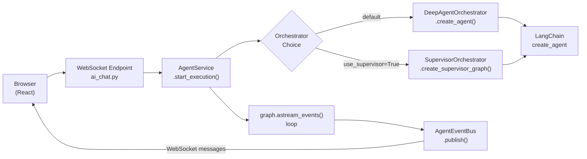
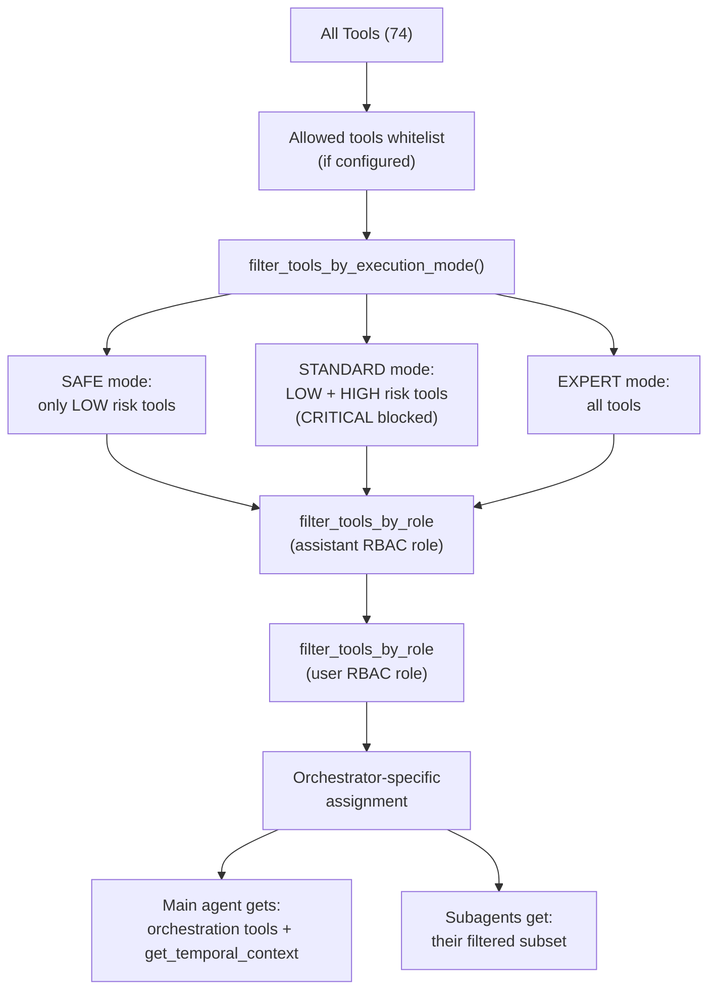
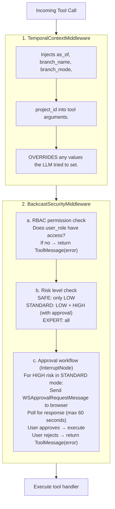
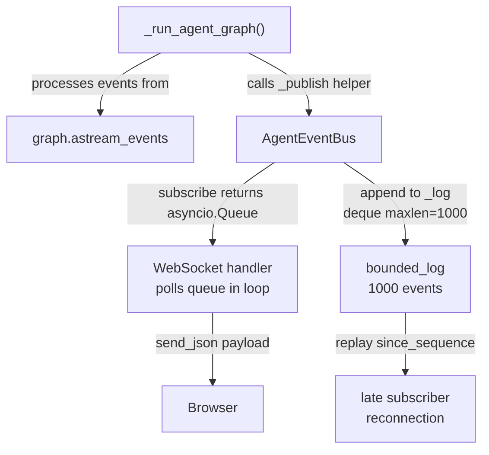

# Agent System: Common Concepts

How the Backcast AI agent system turns a user message into a response: prompt composition, tool filtering, security middleware, event streaming, and the shared subagent roster.

> **Related Documentation:**
> - [Deep Agent Orchestrator](./deep-agent-orchestrator.md) — Task-based delegation with isolated subagents
> - [Supervisor Orchestrator](./supervisor-orchestrator.md) — Handoff-based delegation with compiled briefing documents

---

## Table of Contents

1. [End-to-End Request Flow](#1-end-to-end-request-flow)
2. [System Prompt Composition](#2-system-prompt-composition)
3. [Context Management & LLM Calls](#3-context-management--llm-calls)
4. [Tool Registry & Filtering](#4-tool-registry--filtering)
5. [Subagent Roster](#5-subagent-roster)
6. [Security Middleware Stack](#6-security-middleware-stack)
7. [Event Bus & Streaming](#7-event-bus--streaming)
8. [AgentConfig](#8-agentconfig)
9. [Key Files Reference](#9-key-files-reference)

---

## 1. End-to-End Request Flow

When a user sends a message, the system follows this sequence:



### Step-by-step

1. **WebSocket connects** at `ws://host/api/v1/ai/chat/stream?token=<JWT>`.
   - `ai_chat.py` validates the JWT, checks RBAC for `ai-chat` permission.
   - Sends keepalive pings every 20 seconds.

2. **User sends a `WSChatRequest`** with `message`, `assistant_config_id`, `execution_mode`.

3. **Session is resolved or created** via `AIConfigService`. The session holds `project_id`, `branch_id`, and other temporal context.

4. **`AgentService.start_execution()`** is called:
   - Creates an `AgentEventBus` and registers it with the global `RunnerManager`.
   - Spawns an independent DB session.
   - Creates an `AIAgentExecution` row for tracking.
   - Calls `_run_agent_graph()`.

5. **`_run_agent_graph()`** orchestrates the agent:
   - Builds conversation history from DB messages.
   - Composes the system prompt (see Section 2).
   - Resolves LLM config (provider, model, API key) from the `AIAssistantConfig`.
   - Creates a `ToolContext` with user role, project scope, execution mode.
   - Creates the agent graph via `DeepAgentOrchestrator` (which may delegate to `SupervisorOrchestrator` when `config.use_supervisor=True`).
   - Runs `graph.astream_events()` and publishes events to the `AgentEventBus`.

   > **Orchestrator choice** is determined by `AgentConfig.use_supervisor` (set via `settings.AI_ORCHESTRATOR`). See [Deep Agent Orchestrator](./deep-agent-orchestrator.md) or [Supervisor Orchestrator](./supervisor-orchestrator.md) for their specific architectures.

6. **The WebSocket handler** subscribes to the event bus and forwards events to the browser.

---

## 2. System Prompt Composition

The system prompt is assembled in layers. Layers 1-2 are common to all orchestrator patterns. Layer 3 is orchestrator-specific and documented in the respective orchestrator file.

### Layer 1: Base Prompt

The `AIAssistantConfig.system_prompt` from the database, or the hardcoded `DEFAULT_SYSTEM_PROMPT`:

```
You are a helpful AI assistant for the Backcast project budget management system.
...
```

### Layer 2: Project & Temporal Context (added by `AgentService._build_system_prompt()`)

When a session is scoped to a context, a context section is appended. The system supports multiple context types:

- **General**: No specific context.
- **Project**: `"This conversation is about the project: {name}. Context is scoped to this project (ID: {id}). Project scope is locked for this session."`
- **WBE**: Scoped to a specific Work Breakdown Element.
- **Cost Element**: Scoped to a specific Cost Element.
- **Branch**: When operating on a non-main branch: `"You are operating in branch '{branch_name}' (mode: {branch_mode}). Changes are isolated from main until merged."`
- **Historical (as_of)**: `"You are viewing historical data as of {date}. Historical views are read-only."`

**Key security principle:** Temporal parameters (`as_of`, `branch_name`, `branch_mode`) and `project_id` are **never** enforced via the prompt. They are enforced at the tool level via `ToolContext` and injected by `TemporalContextMiddleware`. The prompt provides awareness only — the LLM cannot bypass tool-level constraints.

### Layer 3: Orchestrator-Specific

See [Deep Agent > System Prompt](./deep-agent-orchestrator.md#2-system-prompt-deep-agent) or [Supervisor > System Prompt](./supervisor-orchestrator.md#4-supervisor-system-prompt).

---

## 3. Context Management & LLM Calls

### AgentState

The LangGraph `StateGraph` operates on an `AgentState` TypedDict (defined in `ai/state.py`):

```python
class AgentState(TypedDict):
    messages: Annotated[list[BaseMessage], operator.add]  # append-only
    tool_call_count: Annotated[int, operator.add]         # accumulated via reducer
    max_tool_iterations: int                               # set once, no reducer
    next: Literal["agent", "tools", "end"]                 # routing control
```

The `Annotated[..., operator.add]` annotations mean `messages` and `tool_call_count` use **append/accumulate semantics**: each graph node returns new values that get merged with the existing state.

### Conversation History Loading

`AgentService._build_conversation_history(session_id)` loads prior messages from the database:

1. Calls `AIConfigService.list_messages(session_id)` → returns `AIConversationMessage` rows ordered by creation time.
2. Converts each row to a LangChain message:
   - `role == "user"` → `HumanMessage(content=msg.content)` (with multimodal support for attachments)
   - `role == "assistant"` → `AIMessage(content=msg.content)`
   - `role == "tool"` → **skipped** (tool messages from previous turns are not replayed)
3. For user messages with image attachments, content is formatted as content blocks (`[{"type": "text", ...}, {"type": "image_url", ...}]`) via `format_multimodal_messages()`.

There is **no token-based truncation or summarization** — the full conversation history is loaded every turn. Long sessions rely on the LLM's native context window.

### Graph Input Assembly

`_run_agent_graph()` assembles the initial state passed to the compiled graph:

```python
{
    "messages": history,               # from _build_conversation_history()
    "tool_call_count": 0,
    "max_tool_iterations": recursion_limit,  # default 25
    "next": "agent",
}
```

The **system prompt** is not part of the state. It is passed to `langchain_create_agent()` at graph compilation time and injected as a `SystemMessage` by the LangGraph framework at the start of every agent node invocation.

### What the LLM Receives

Each time the agent node fires, the LLM API call contains three things:

1. **System prompt** — The composed prompt from Section 2 (base + context + orchestrator-specific).
2. **Tool definitions** — The filtered tool list as JSON Schema function declarations.
3. **Message history** — The full `messages` list from state, which grows over the turn as tool calls and results are appended.

```
┌─ LLM API Call ───────────────────────────────────────────────────────────┐
│                                                                          │
│  system:    [SystemMessage] composed prompt (Section 2)                  │
│                                                                          │
│  messages:  [HumanMessage] "What's the EVM of PRJ-001?"                 │
│             [AIMessage] tool_calls=[{name:"task", args:{...}}]           │
│             [ToolMessage] "Subagent result: ..."                         │
│             ← growing list, each tool round adds messages                │
│                                                                          │
│  tools:     [task, get_temporal_context]  ← function schemas             │
│                                                                          │
└──────────────────────────────────────────────────────────────────────────┘
```

### BackcastRuntimeContext

Per-request security and scoping data is passed via LangGraph's **Runtime** mechanism — not through state or the prompt. This is set in `graph_cache.py`:

```python
@dataclass
class BackcastRuntimeContext:
    user_id: str                    # authenticated user ID
    user_role: str                  # RBAC role (e.g. "admin", "viewer")
    project_id: str | None = None   # project scope from session
    branch_id: str | None = None    # branch / change-order scope
    execution_mode: str = "standard" # SAFE / STANDARD / EXPERT
```

Passed to the graph via `context=BackcastRuntimeContext(...)` in the `astream_events()` call. Middleware reads this via `ContextVar` (see `set_request_context()`) rather than from state, so that cached compiled graphs can serve multiple requests with different security contexts.

### Context Flow Through the Agent Loop

```
_build_conversation_history()
        │
        ▼
   graph input state
   {messages: [...], tool_call_count: 0, max_tool_iterations: 25, next: "agent"}
        │
        ▼
┌─ Agent Node ────────────────────────────────────────┐
│  LLM receives: system prompt + messages + tools     │
│  LLM responds: AIMessage (text or tool_calls)       │
│  State update: messages += [AIMessage]               │
│  Routing: tool_calls? → tools : end                 │
└──────────────────────────┬──────────────────────────┘
                           │ tool_calls present
                           ▼
┌─ Tools Node ────────────────────────────────────────┐
│  Each tool call passes through middleware stack:     │
│    1. TemporalContextMiddleware injects params       │
│    2. BackcastSecurityMiddleware checks RBAC + risk  │
│  Tool executes → ToolMessage                        │
│  State update: messages += [ToolMessage, ...]        │
│  State update: tool_call_count += N                  │
│  Routing: count < max_tool_iterations? → agent : end│
└──────────────────────────┬──────────────────────────┘
                           │
                           └──► back to Agent Node
```

### Subagent Context Isolation

When subagents are spawned (by either orchestrator pattern), the subagent gets its own isolated context:

- **Own system prompt** — domain-specific prompt from the subagent configuration.
- **Own tool list** — filtered to the subagent's domain.
- **Own middleware stack** — same `TemporalContextMiddleware` + `BackcastSecurityMiddleware`.
- **Same `BackcastRuntimeContext`** — via `ContextVar`, so security context is preserved.

The exact state initialization differs between orchestrators. See [Deep Agent > Task Tool](./deep-agent-orchestrator.md#4-the-task-tool) for task-based isolation and [Supervisor > State Schema](./supervisor-orchestrator.md#3-state-schema) for shared-state handoff.

### Message Persistence

After execution, messages are saved back to the database:

1. **User message** — saved before execution starts (`role="user"`, `content=message`).
2. **Assistant segments** — saved during streaming. Each segment captures:
   - `role="assistant"`, `content` (text content)
   - `tool_calls` (JSONB — name, args, invocation IDs)
   - `tool_results` (JSONB — tool outputs)
   - `message_metadata` (JSONB — subagent type, segment index, etc.)
3. **Subagent messages** — saved with metadata linking them to the parent execution.
4. **Error persistence** — When graph execution fails, the exception is captured and persisted as an assistant message with metadata `{"error": true, "error_type": "..."}`. This ensures users see what went wrong when reopening the session.

On the next turn, `_build_conversation_history()` loads user and assistant messages. Tool messages are skipped because the LLM only needs the conversation flow, not the raw tool payloads.

---

## 4. Tool Registry & Filtering

### Tool Creation

All tools are created via `create_project_tools(tool_context)` in `tools/__init__.py`. This function:

1. Collects tools from 10 template packages:
   - `project_tools` (3): `list_projects`, `get_project`, `global_search`
   - `context_tools` + `temporal_tools` (3): `get_temporal_context`, `get_project_context`, `get_project_structure`
   - `crud_template` (6): Project and WBE CRUD operations
   - `analysis_template` (8): EVM and forecasting tools
   - `change_order_template` (8): Full change order workflow
   - `cost_element_template` (13): Cost elements, types, and schedule baselines
   - `user_management_template` (10): User and department CRUD
   - `advanced_analysis_template` (4): Health assessment and anomaly detection
   - `diagram_template` (1): Mermaid diagram generation
   - `forecast_cost_progress_template` (18): Forecasts, cost registrations, progress entries
2. Each tool is decorated with `@ai_tool` which attaches metadata: name, description, risk level (`LOW`, `HIGH`, `CRITICAL`).
3. Results are cached as a singleton — tools are created once.
4. **Total: 74 tools**.

### Filtering Chain

Tools go through four filtering stages before reaching the LLM:



### Role-Based Tool Filtering

`filter_tools_by_role()` checks each tool's `_tool_metadata.permissions` against the provided RBAC role. The filtering is applied twice — first for the assistant's configured role, then for the user's actual role. This ensures:

1. Assistants are restricted to their configured role capabilities.
2. Users can only use tools they have permissions for.

Tools without `_tool_metadata` or with empty permissions always pass through (e.g., `task`, `get_temporal_context`, handoff tools).

### Risk Levels

| Risk Level | Examples | SAFE | STANDARD | EXPERT |
|-----------|----------|------|----------|--------|
| LOW | `list_projects`, `get_project`, `calculate_evm_metrics` | Allowed | Allowed | Allowed |
| HIGH | `create_project`, `update_cost_element`, `approve_change_order` | Blocked | Allowed (requires approval) | Allowed |
| CRITICAL | `delete_project`, bulk operations | Blocked | Blocked | Allowed |

---

## 5. Subagent Roster

Seven specialized subagents, each mapped to a domain:

| Subagent | Domain | Allowed Tools | Structured Output |
|----------|--------|--------------|-------------------|
| `project_manager` | Projects, WBEs, cost elements, cost tracking, progress entries | 35 | None |
| `evm_analyst` | EVM metrics (CPI, SPI, CV, SV, EAC) and health analysis | 10 | `EVMMetricsRead` |
| `change_order_manager` | Change order CRUD, approval workflows, impact analysis | 10 | `ImpactAnalysisResponse` |
| `user_admin` | Users and departments CRUD | 12 | None |
| `visualization_specialist` | Mermaid diagram generation | 3 | None |
| `forecast_manager` | Forecasts, schedule baselines, trend analysis | 13 | `ForecastRead` |
| `general_purpose` | Fallback for tasks that don't fit a specialist | all | None |

### Structured Output Schemas

Subagents with `structured_output_schema` produce validated Pydantic model outputs. The `_summarize_structured_output()` function in `tools/subagent_task.py` generates human-readable summaries for:

- **`EVMMetricsRead`** — EVM metrics with CPI/SPI status indicators
- **`ImpactAnalysisResponse`** — Change order impact with KPIs
- **`ForecastRead`** — Forecast details with budget variance
- **`DashboardData`** — Project summaries and activity counts

### Subagent Compilation

All subagent configurations are defined in `ai/subagents/__init__.py` as dictionaries with keys: `name`, `description`, `system_prompt`, `allowed_tools`, `structured_output_schema`. The orchestrators compile these into runnable LangChain agents at graph creation time.

Both orchestrators apply the same compilation process:
1. Filter tools by subagent's `allowed_tools` list (or use all available tools when `None`).
2. Intersect with the main agent's tool whitelist (if configured).
3. Apply the middleware stack: `TemporalContextMiddleware` + `BackcastSecurityMiddleware`.
4. Compile via `langchain_create_agent()` with the subagent's domain-specific system prompt.

---

## 6. Security Middleware Stack

Both orchestrator patterns apply the same middleware stack to all agents (main, subagents, specialists):



### Bypass Rules

- Tools NOT in the Backcast tool list (e.g., `task`, `handoff_to_*`, `write_todos`) bypass the security middleware entirely.
- The `task` tool is allowed through because it's an orchestration tool — security is applied within the subagent it spawns.

### Context Variables

Both middleware classes use `ContextVar` to pass per-request context:
- `TemporalContextMiddleware` stores `ToolContext` in a context variable.
- `BackcastSecurityMiddleware` stores `InterruptNode` reference for approval handling.
- `set_request_context()` in `graph_cache.py` bridges the gap between cached graphs and per-request context.

---

## 7. Event Bus & Streaming

### Architecture



### Event Types

| Event | When Published | Frontend Effect |
|-------|---------------|-----------------|
| `thinking` | Agent starts processing | Shows spinner |
| `planning` | TodoListMiddleware generates steps | Shows step list |
| `subagent` | Main agent delegates to subagent | Shows "Delegating to X..." |
| `agent_transition` | Specialist enters/exits (supervisor pattern) | Shows transition indicator |
| `tool_call` | A tool starts executing | Shows tool name + args |
| `tool_result` | A tool finishes | Shows result summary |
| `subagent_result` | Subagent completes | Shows "X completed" |
| `token_batch` | Accumulated tokens flushed | Appends to streaming text |
| `content_reset` | Between subagent and main agent | Clears streaming area |
| `complete` | Execution finished | Finalizes response |
| `error` | Execution failed | Shows error |
| `execution_status` | Status change (running→error) | Updates UI state |
| `approval_request` | HIGH-risk tool needs approval | Shows approval dialog |

### AgentEventBus

`AgentEventBus` (in `execution/agent_event_bus.py`) is an in-memory pub/sub channel:

- **Bounded event log**: `collections.deque(maxlen=1000)` retains the last 1000 events for late-subscriber replay.
- **Subscriber queues**: Each subscriber gets its own `asyncio.Queue` — a slow consumer cannot block others.
- **Replay**: New subscribers can replay events from a given sequence number via `replay(since_sequence)`.
- **Completion tracking**: `is_completed` is set to `True` when a `"complete"` or `"error"` event is published.

### RunnerManager

The global `RunnerManager` singleton maps `execution_id` → `AgentEventBus`. This allows:
- **WebSocket reconnection**: If the browser reconnects, it can subscribe to the same bus via `execution_id`.
- **REST polling**: The `GET /ai/chat/executions/{id}/status` endpoint reads from the bus.
- **Cleanup**: Buses are removed from the manager when execution completes.

### Stream Retry: Transient Error Recovery

`graph.astream_events()` is wrapped in a retry loop to handle transient network errors:

- **Max retries**: 2 (up to 3 total attempts)
- **Retry delay**: 2 seconds between attempts
- **Retried errors**: `httpcore.ReadError`, `httpx.RemoteProtocolError`, `ConnectionResetError`, `OSError`
- **Error detection**: `ConnectionResetError` and `OSError` are caught directly; `httpcore.ReadError` and `httpx.RemoteProtocolError` are detected by inspecting the exception's `__name__` and `__module__`
- **On retry**: The stream restarts from the graph's current checkpoint state; `events_processed` is reset to 0
- **Timeout**: `stream_chunk_timeout` is set to 300 seconds on the `ChatOpenAI` client, preventing premature internal timeouts during long agent executions

### Token Streaming with Buffering

Tokens from the LLM are accumulated in a buffer and flushed in batches rather than sent individually. This reduces WebSocket message volume and improves rendering performance on the frontend. The flushing happens both periodically and on completion.

### LLM Client Caching

`LLMClientCache` (in `graph_cache.py`) is a thread-safe cache for `ChatOpenAI` instances:

- **Cache key**: `(model_name, temperature, max_tokens, base_url_hash)`
- **Pattern**: `get_or_create(key, factory)` — returns cached instance or creates a new one via the factory
- **Purpose**: Avoids re-instantiating LLM clients with identical configuration across requests

---

## 8. AgentConfig

`AgentConfig` is a frozen dataclass (in `ai/config.py`) that encapsulates agent creation parameters:

```python
@dataclass(frozen=True)
class AgentConfig:
    allowed_tools: list[str] | None = None      # Tool name whitelist
    subagents: list[dict[str, Any]] | None = None # Override default subagents
    checkpointer: Any | None = None               # Shared checkpointer
    context_schema: type | None = None             # StateGraph context schema
    assistant_role: str | None = None              # RBAC role for assistant
    user_role: str | None = None                   # Per-user RBAC role
    use_supervisor: bool = False                   # Delegate to SupervisorOrchestrator
```

When `use_supervisor=True`, `DeepAgentOrchestrator.create_agent()` delegates to `SupervisorOrchestrator.create_supervisor_graph()`. Otherwise it builds its own subagent-as-tool graph.

---

## 9. Key Files Reference

| File | Responsibility |
|------|---------------|
| `api/routes/ai_chat.py` | WebSocket endpoint, JWT auth, session creation, approval handling |
| `ai/agent_service.py` | Orchestration: `_run_agent_graph()`, `_build_system_prompt()`, `_build_conversation_history()`, `start_execution()` |
| `ai/deep_agent_orchestrator.py` | `DeepAgentOrchestrator`: subagent compilation, task-based delegation, prompt composition |
| `ai/supervisor_orchestrator.py` | `SupervisorOrchestrator`: handoff-based specialist delegation with compiled briefing documents |
| `ai/briefing.py` | `BriefingDocument`, `BriefingSection`: Pydantic models for the briefing artifact |
| `ai/briefing_compiler.py` | `initialize_briefing()`, `compile_specialist_output()`: zero-cost compilation |
| `ai/supervisor_state.py` | `BackcastSupervisorState`: shared state schema for supervisor graph |
| `ai/handoff_tools.py` | `create_handoff_tool()`, `create_all_handoff_tools()`: `Command(goto=...)` handoff mechanism |
| `ai/config.py` | `AgentConfig`: frozen dataclass for agent creation parameters |
| `ai/state.py` | `AgentState` TypedDict: `messages`, `tool_call_count`, `max_tool_iterations`, `next` |
| `ai/graph.py` | LangGraph `StateGraph` with `should_continue()` routing, graph creation factory |
| `ai/graph_cache.py` | `BackcastRuntimeContext`, `LLMClientCache`, `shared_checkpointer`, ContextVar helpers |
| `ai/subagents/__init__.py` | Seven subagent configurations (name, prompt, allowed_tools, structured_output_schema) |
| `ai/tools/__init__.py` | `create_project_tools()` (74 tools), `filter_tools_by_execution_mode()`, `filter_tools_by_role()` |
| `ai/tools/subagent_task.py` | `build_task_tool()`, `TASK_SYSTEM_PROMPT`, `TASK_TOOL_DESCRIPTION`, `_summarize_structured_output()` |
| `ai/middleware/temporal_context.py` | `TemporalContextMiddleware`: injects temporal params into tool args |
| `ai/middleware/backcast_security.py` | `BackcastSecurityMiddleware`: RBAC + risk checks + approval workflow |
| `ai/execution/agent_event_bus.py` | `AgentEventBus`: pub/sub with bounded log |
| `ai/execution/runner_manager.py` | `RunnerManager`: execution_id → event_bus registry |
| `ai/token_estimator.py` | Token usage estimation and accumulation |
| `ai/telemetry.py` | OpenTelemetry integration for tracing |
