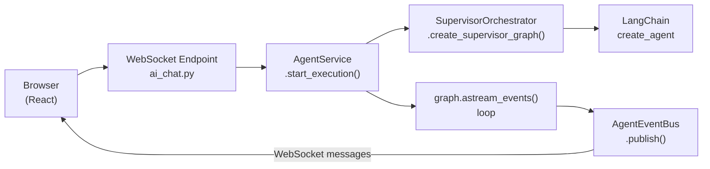
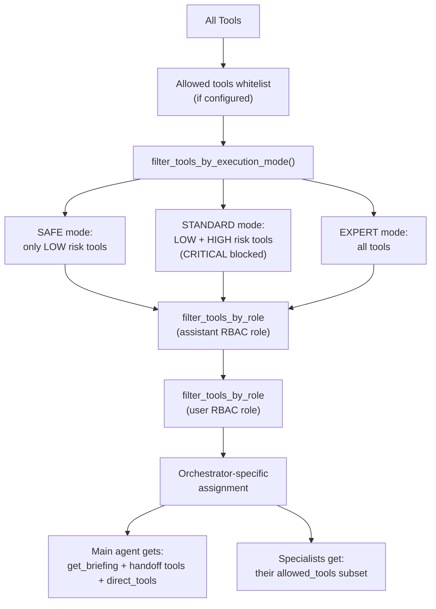
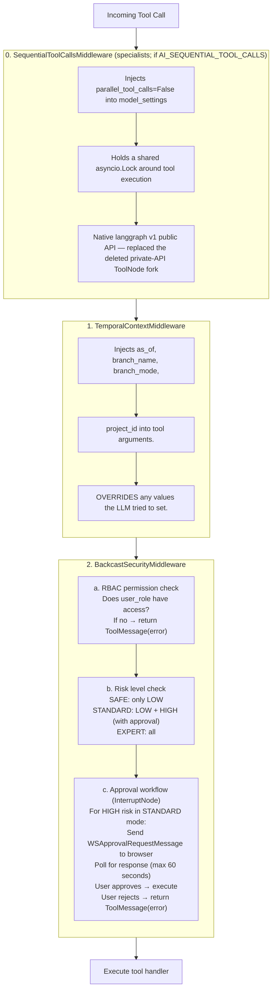
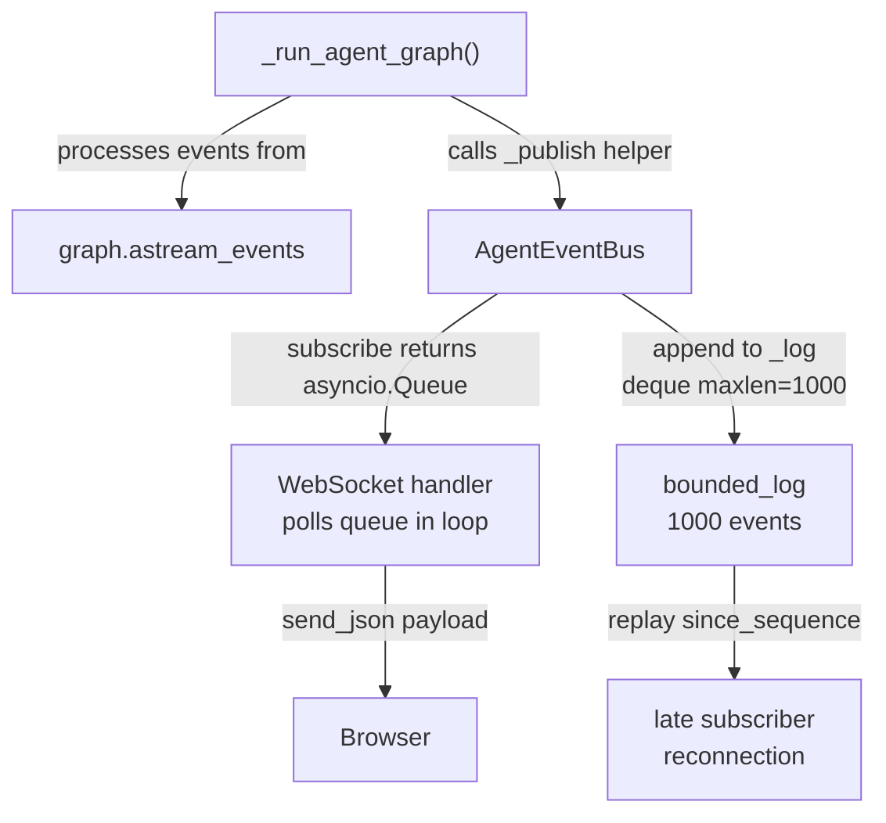

# Agent System: Common Concepts

How the Backcast AI agent system turns a user message into a response: prompt composition, the bounded plan-execute planner, tool filtering, security middleware, event streaming, and the DB-configurable specialist roster.

> **Related Documentation:**
> - [Supervisor Orchestrator](./supervisor-orchestrator.md) — Handoff-based delegation with compiled briefing documents, direct tool access, and the bounded planner
> - ~~[Deep Agent Orchestrator](./deep-agent-orchestrator.md)~~ — Removed. Supervisor is the sole orchestrator.

---

## Table of Contents

1. [End-to-End Request Flow](#1-end-to-end-request-flow)
2. [System Prompt Composition](#2-system-prompt-composition)
3. [Context Management & LLM Calls](#3-context-management--llm-calls)
4. [Tool Registry & Filtering](#4-tool-registry--filtering)
5. [Subagent Roster](#5-subagent-roster)
6. [Security Middleware Stack](#6-security-middleware-stack)
7. [Event Bus & Streaming](#7-event-bus--streaming)
8. [Data Model](#8-data-model)
9. [AgentConfig](#9-agentconfig)
10. [Key Files Reference](#10-key-files-reference)

---

## 1. End-to-End Request Flow

When a user sends a message, the system follows this sequence:



### Step-by-step

1. **WebSocket connects** at `ws://host/api/v1/ai/chat/stream?token=<JWT>`.
   - `ai_chat.py` validates the JWT, checks RBAC for `ai-chat` permission.
   - Sends keepalive pings every 20 seconds.

2. **User sends a `WSChatRequest`** with `message`, `assistant_config_id`, `execution_mode`.

3. **Session is resolved or created** via `AIConfigService`. The session holds `project_id`, `branch_id`, and other temporal context.

4. **`AgentService.start_execution()`** is called:
   - Creates an `AgentEventBus` and registers it with the global `RunnerManager`.
   - Spawns an independent DB session.
   - Creates an `AIAgentExecution` row for tracking.
   - Calls `_run_agent_graph()`.

5. **`_run_agent_graph()`** orchestrates the agent:
   - Builds conversation history from DB messages.
   - Composes the system prompt (see Section 2).
   - Resolves LLM config (provider, model, API key) from the `AIAssistantConfig`.
   - Creates a `ToolContext` with user role, project scope, execution mode.
   - Creates the supervisor agent graph via `SupervisorOrchestrator`, passing the main agent's DB config for specialist loading and direct tool injection.
   - Runs `graph.astream_events()` and publishes events to the `AgentEventBus`.

   > **Orchestrator** is always the `SupervisorOrchestrator`. It wires a bounded plan-execute pipeline (see [Supervisor Orchestrator > The Planner Node](./supervisor-orchestrator.md#4-the-planner-node)). See [Supervisor Orchestrator](./supervisor-orchestrator.md) for the architecture details.

6. **The WebSocket handler** subscribes to the event bus and forwards events to the browser.

---

## 2. System Prompt Composition

The system prompt is assembled in layers. Layers 1-2 are common to all orchestrator patterns. Layer 3 is orchestrator-specific and documented in the respective orchestrator file.

### Layer 1: Base Prompt

The `AIAssistantConfig.system_prompt` from the database, or the hardcoded `DEFAULT_SYSTEM_PROMPT`:

```
You are a helpful AI assistant for the Backcast project budget management system.
...
```

### Layer 2: Project & Temporal Context (added by `AgentService._build_system_prompt()`)

When a session is scoped to a context, a context section is appended. The system supports multiple context types:

- **General**: No specific context.
- **Project**: `"This conversation is about the project: {name}. Context is scoped to this project (ID: {id}). Project scope is locked for this session."`
- **WBE**: Scoped to a specific Work Breakdown Element.
- **Cost Element**: Scoped to a specific Cost Element.
- **Work Package**: Scoped to a specific Work Package (added in the QualityImpact/WorkPackage refactor; handled by `agent_service.py` alongside the other context types).
- **Branch**: When operating on a non-main branch: `"You are operating in branch '{branch_name}' (mode: {branch_mode}). Changes are isolated from main until merged."`
- **Historical (as_of)**: `"You are viewing historical data as of {date}. Historical views are read-only."`

**Key security principle:** Temporal parameters (`as_of`, `branch_name`, `branch_mode`) and `project_id` are **never** enforced via the prompt. They are enforced at the tool level via `ToolContext` and injected by `TemporalContextMiddleware`. The prompt provides awareness only — the LLM cannot bypass tool-level constraints.

### Layer 3: Orchestrator-Specific

See [Supervisor Node and System Prompt](./supervisor-orchestrator.md#5-the-supervisor-node-and-system-prompt).

---

## 3. Context Management & LLM Calls

### AgentState

The LangGraph `StateGraph` operates on an `AgentState` TypedDict (defined in `ai/state.py`):

```python
class AgentState(TypedDict):
    messages: Annotated[list[BaseMessage], operator.add]  # append-only
    tool_call_count: Annotated[int, operator.add]         # accumulated via reducer
    max_tool_iterations: int                               # set once, no reducer
    next: Literal["agent", "tools", "end"]                 # routing control
```

The `Annotated[..., operator.add]` annotations mean `messages` and `tool_call_count` use **append/accumulate semantics**: each graph node returns new values that get merged with the existing state.

### Conversation History Loading

`AgentService._build_conversation_history(session_id)` loads prior messages from the database:

1. Calls `AIConfigService.list_messages(session_id)` → returns `AIConversationMessage` rows ordered by creation time.
2. Converts each row to a LangChain message:
   - `role == "user"` → `HumanMessage(content=msg.content)` (with multimodal support for attachments)
   - `role == "assistant"` → `AIMessage(content=msg.content)`
   - `role == "tool"` → **skipped** (tool messages from previous turns are not replayed)
3. For user messages with image attachments, content is formatted as content blocks (`[{"type": "text", ...}, {"type": "image_url", ...}]`) via `format_multimodal_messages()`.

### Context Trimming & Summarization (ContextGuardMiddleware)

Conversation history is **not** loaded unbounded into every turn. `ContextGuardMiddleware` (`ai/middleware/context_guard.py`) runs before each supervisor model call and trims/summarizes the message list when it grows too large:

1. **Estimate** prompt tokens from message content lengths (`_estimate_tokens`, ~4 chars/token, system prompt excluded).
2. **Threshold check**: if the estimate exceeds `AI_CONTEXT_TOKEN_LIMIT * AI_CONTEXT_SUMMARY_THRESHOLD_PCT // 100`, the guard trims (`context_guard.py` ~226-293).
3. **Trim strategy** (no extra LLM call — deterministic):
   - Keep `messages[0]` (the system prompt).
   - Keep the last `AI_CONTEXT_KEEP_RECENT` messages for continuity (`_tool_aware_tail_start` keeps call/response pairs intact).
   - Replace everything in between with a single `HumanMessage` built from the already-compiled `BriefingDocument` (`_build_summary_message`, ~216-227). The briefing already serves as a structured summary of all specialist work, so no lossy secondary LLM summarization is needed.
4. **Repair** the message chain (`_repair_chain`) so tool-response / tool-call invariants still hold after trimming.

The three knobs (`AI_CONTEXT_TOKEN_LIMIT`, `AI_CONTEXT_SUMMARY_THRESHOLD_PCT`, `AI_CONTEXT_KEEP_RECENT`) flow from `Settings`/`.env` and are re-exported from `ai/config.py` (~51-57). A `_MIN_MESSAGES_TO_TRIM` floor (~8 messages) prevents false positives on early turns where tool schemas dominate the token estimate.

> Specialists do not accumulate long cross-turn history (each receives an isolated message list built fresh on every invocation), but they **do** run their own `ContextGuardMiddleware` with a specialist-specific cap. The supervisor's `AI_CONTEXT_TOKEN_LIMIT` (120k) sits far above the latency knee a specialist hits, so the specialist guard is calibrated separately: `AI_SPECIALIST_CONTEXT_TOKEN_LIMIT=24000` with `AI_SPECIALIST_CONTEXT_KEEP_RECENT=4` (`config.py:68,74`), mounted with `preserve_head=2` so the assignment survives the trim (`subagent_compiler.py:200-208`).

### Graph Input Assembly

`_run_agent_graph()` assembles the initial state passed to the compiled graph:

```python
{
    "messages": history,               # from _build_conversation_history()
    "tool_call_count": 0,
    "max_tool_iterations": recursion_limit,  # default 25
    "next": "agent",
}
```

The **system prompt** is not part of the state. It is passed to `langchain_create_agent()` at graph compilation time and injected as a `SystemMessage` by the LangGraph framework at the start of every agent node invocation.

### What the LLM Receives

Each time the agent node fires, the LLM API call contains three things:

1. **System prompt** — The composed prompt from Section 2 (base + context + orchestrator-specific).
2. **Tool definitions** — The filtered tool list as JSON Schema function declarations.
3. **Message history** — The `messages` list from state, which grows over the turn as tool calls and results are appended (and is trimmed by `ContextGuardMiddleware` when it approaches the token limit).

```
┌─ LLM API Call ───────────────────────────────────────────────────────────┐
│                                                                          │
│  system:    [SystemMessage] composed prompt (Section 2)                  │
│                                                                          │
│  messages:  [HumanMessage] "What's the EVM of PRJ-001?"                 │
│             [AIMessage] tool_calls=[{name:"task", args:{...}}]           │
│             [ToolMessage] "Subagent result: ..."                         │
│             ← growing list, each tool round adds messages                │
│                                                                          │
│  tools:     [task, get_temporal_context]  ← function schemas             │
│                                                                          │
└──────────────────────────────────────────────────────────────────────────┘
```

### BackcastRuntimeContext

Per-request security and scoping data is passed via LangGraph's **Runtime** mechanism — not through state or the prompt. This is set in `graph_cache.py`:

```python
@dataclass
class BackcastRuntimeContext:
    user_id: str                    # authenticated user ID
    user_role: str                  # RBAC role (e.g. "admin", "viewer")
    project_id: str | None = None   # project scope from session
    branch_id: str | None = None    # branch / change-order scope
    execution_mode: str = "standard" # SAFE / STANDARD / EXPERT
```

Passed to the graph via `context=BackcastRuntimeContext(...)` in the `astream_events()` call. Middleware reads this via `ContextVar` (see `set_request_context()`) rather than from state, so that cached compiled graphs can serve multiple requests with different security contexts.

### Context Flow Through the Agent Loop

```
_build_conversation_history()
        │
        ▼
   graph input state
   {messages: [...], tool_call_count: 0, max_tool_iterations: 25, next: "agent"}
        │
        ▼
┌─ Agent Node ────────────────────────────────────────┐
│  ContextGuardMiddleware trims if tokens > threshold │
│  LLM receives: system prompt + messages + tools     │
│  LLM responds: AIMessage (text or tool_calls)       │
│  State update: messages += [AIMessage]               │
│  Routing: tool_calls? → tools : end                 │
└──────────────────────────┬──────────────────────────┘
                           │ tool_calls present
                           ▼
┌─ Tools Node ────────────────────────────────────────┐
│  Each tool call passes through middleware stack:     │
│    1. TemporalContextMiddleware injects params       │
│    2. BackcastSecurityMiddleware checks RBAC + risk  │
│  Tool executes → ToolMessage                        │
│  State update: messages += [ToolMessage, ...]        │
│  State update: tool_call_count += N                  │
│  Routing: count < max_tool_iterations? → agent : end│
└──────────────────────────┬──────────────────────────┘
                           │
                           └──► back to Agent Node
```

### Subagent Context Isolation

When specialists are invoked (via handoff tools), each specialist gets its own isolated context:

- **Own system prompt** — domain-specific prompt from the specialist's `AIAssistantConfig` row.
- **Own tool list** — filtered to the specialist's `allowed_tools` whitelist.
- **Own middleware stack** — a specialist-specific `ContextGuardMiddleware` (much lower token cap, see below) followed by `SequentialToolCallsMiddleware` + `TemporalContextMiddleware` + `BackcastSecurityMiddleware` (see Section 6).
- **Same `BackcastRuntimeContext`** — via `ContextVar`, so security context is preserved.

The specialist receives the compiled briefing document as its only input (not raw message history). See [Supervisor > State Schema](./supervisor-orchestrator.md#3-state-schema) for the state layout.

### Message Persistence

After execution, messages are saved back to the database:

1. **User message** — saved before execution starts (`role="user"`, `content=message`).
2. **Assistant segments** — saved during streaming. Each segment captures:
   - `role="assistant"`, `content` (text content)
   - `tool_calls` (JSONB — name, args, invocation IDs)
   - `tool_results` (JSONB — tool outputs)
   - `message_metadata` (JSONB — subagent type, segment index, etc.)
3. **Subagent messages** — saved with metadata linking them to the parent execution.
4. **Error persistence** — When graph execution fails, the exception is captured and persisted as an assistant message with metadata `{"error": true, "error_type": "..."}`. This ensures users see what went wrong when reopening the session.

On the next turn, `_build_conversation_history()` loads user and assistant messages. Tool messages are skipped because the LLM only needs the conversation flow, not the raw tool payloads.

---

## 4. Tool Registry & Filtering

### Tool Creation

All runtime tools are built by `create_project_tools(tool_context)` in `tools/__init__.py` (~136-333). This is the list the agent actually executes. It collects tools from the template packages and standalone tool modules:

- `project_tools` (read/search: `list_projects`, `get_project`, `global_search`)
- `project_template` (Project + WBS Element CRUD)
- `cost_element_template` (Cost Element + Cost Element Type CRUD)
- `cost_event_template` (Cost Event CRUD + COQ)
- `cost_event_type_template` (Cost Event Type CRUD)
- `control_account_template` (Control Account CRUD + budget)
- `work_package_template` (Work Package CRUD + budget status)
- `forecast_cost_progress_template` (Forecasts, cost registrations, progress entries)
- `change_order_template` (full change order workflow)
- `analysis_template` + `advanced_analysis_template` (EVM, health, forecasting)
- `user_management_template` (Users + Organizational Units CRUD)
- `diagram_template` (Mermaid diagram generation)
- `context_tools` + `temporal_tools` (temporal/project context, branches)
- `briefing_tools` (`get_briefing`)
- `document_tools` (`search_documents`, `read_document`)
- `ask_user` (human-in-the-loop question)

Each tool is decorated with `@ai_tool` which attaches metadata: name, description, risk level (`LOW`, `HIGH`, `CRITICAL`). Results are cached as a singleton — tools are created once. At the tail, MCP tools discovered from configured external servers are appended (`MCPClientManager.get_all_tools()`).

### Two distinct tool counts

There are **two** distinct counts worth distinguishing — do not collapse them into one bare number:

1. **Runtime tools** built by `create_project_tools()` (`tools/__init__.py:136-333`): the list the agent executes. The count is **dynamic** — it depends on the current template set and is logged at tool-cache fill (`"Created and cached N tools for AI chat"`, `tools/__init__.py:342`); MCP-discovered tools are appended on top when MCP servers are configured.
2. **Registry-discovered tools** surfaced by the `GET /api/v1/ai/config/tools` endpoint (`ai_config.py` ~384-416). The endpoint calls `registry.discover_and_register(...)` across the same template modules (`registry.py` ~111) and returns `get_all_tools()` as `AIToolPublic` for the admin UI. The two counts are derived from the same template set, so they agree today; they are conceptually independent (one is the executable tool list, the other is the metadata catalog).

### Filtering Chain

Tools go through four filtering stages before reaching the LLM:



### Role-Based Tool Filtering

`filter_tools_by_role()` checks each tool's `_tool_metadata.permissions` against the provided RBAC role. The filtering is applied twice — first for the assistant's configured role, then for the user's actual role. This ensures:

1. Assistants are restricted to their configured role capabilities.
2. Users can only use tools they have permissions for.

Tools without `_tool_metadata` or with empty permissions always pass through (e.g., `task`, `get_temporal_context`, handoff tools).

### Risk Levels

| Risk Level | Examples | SAFE | STANDARD | EXPERT |
|-----------|----------|------|----------|--------|
| LOW | `list_projects`, `get_project`, `calculate_evm_metrics` | Allowed | Allowed | Allowed |
| HIGH | `create_project`, `update_cost_element`, `approve_change_order` | Blocked | Allowed (requires approval) | Allowed |
| CRITICAL | `delete_project`, bulk operations | Blocked | Blocked | Allowed |

---

## 5. Subagent Roster

Specialists are **DB-only**: they are stored in `ai_assistant_configs` with `agent_type='specialist'` and seeded from `backend/seed/seed_system_config.json`. Each is mapped to a domain. There is **no hardcoded specialist fallback** — `ai/subagents/__init__.py` only re-exports `load_specialists_from_db` and `invalidate_cache` from `db_loader.py`; if the DB returns no specialist rows, `load_specialists_from_db()` returns an empty list (`db_loader.py` ~74-105) and no specialists are compiled.

| Specialist | Domain | Structured Output |
|----------|--------|-------------------|
| `project_manager` | Projects, WBEs, cost elements, cost tracking, progress entries | None |
| `evm_analyst` | EVM metrics (CPI, SPI, CV, SV, EAC) and health analysis | `EVMMetricsRead` |
| `change_order_manager` | Change order CRUD, approval workflows, impact analysis | `ImpactAnalysisResponse` |
| `user_admin` | Users and departments CRUD | None |
| `visualization_specialist` | Mermaid diagram generation | None |
| `forecast_manager` | Forecasts, schedule baselines, trend analysis | `ForecastRead` |
| `general_purpose` | Fallback for tasks that don't fit a specialist | None |

Specialist `allowed_tools` whitelists are configured per row in the DB.

### Main Agents

Main agents are stored in `ai_assistant_configs` with `agent_type='main'`. Only main agents appear in the chat assistant selector.

| Main Agent | Default Role | Direct Tools |
|-----------|-------------|-------------|
| `Friendly Project Analyzer` | `ai-viewer` | `get_temporal_context`, `set_temporal_context`, `global_search` |
| `Senior Project Manager` | `ai-manager` | `get_temporal_context`, `set_temporal_context`, `global_search` |
| `System Manager` | `ai-admin` | `get_temporal_context`, `set_temporal_context`, `global_search` |

Direct tools are configured via the `delegation_config.direct_tools` field on each main agent and are fully admin-configurable.

### Structured Output Schemas

Subagents with `structured_output_schema` produce validated Pydantic model outputs. The `_summarize_structured_output()` function in `tools/subagent_task.py` generates human-readable summaries for:

- **`EVMMetricsRead`** — EVM metrics with CPI/SPI status indicators
- **`ImpactAnalysisResponse`** — Change order impact with KPIs
- **`ForecastRead`** — Forecast details with budget variance
- **`DashboardData`** — Project summaries and activity counts

### Specialist Compilation

Specialist configs are loaded from the database via `ai/subagents/db_loader.py` (`load_specialists_from_db()`) with a 5-minute TTL cache. The DB rows are converted to the dict schema (`name`, `description`, `system_prompt`, `allowed_tools`, `structured_output_schema`) expected by `compile_subagents()`.

Compilation applies the same process:
1. Filter tools by specialist's `allowed_tools` list (or use all available tools when `None`).
2. Intersect with the main agent's tool whitelist (if configured).
3. Apply the middleware stack: specialist-specific `ContextGuardMiddleware` (lower cap) + `build_backcast_middleware()` = `[SequentialToolCallsMiddleware?, TemporalContextMiddleware, BackcastSecurityMiddleware]`. `SequentialToolCallsMiddleware` is gated on `AI_SEQUENTIAL_TOOL_CALLS` (default true).
4. Compile via `langchain_create_agent()` with the specialist's domain-specific system prompt.

---

## 6. Security Middleware Stack

The supervisor orchestrator applies a shared base middleware stack to all agents (main, subagents, specialists) via `build_backcast_middleware()` (`subagent_compiler.py:86-108`):



> The supervisor node additionally runs `ContextGuardMiddleware` (history trimming, see Section 3) and `PlanAwareToolMiddleware` before the base stack. See [Supervisor > The Supervisor Node](./supervisor-orchestrator.md#5-the-supervisor-node-and-system-prompt).
>
> Specialists prepend their **own** `ContextGuardMiddleware` (specialist-specific token cap, see Section 3) ahead of the base stack (`subagent_compiler.py:200-208`). `SequentialToolCallsMiddleware` is part of the shared base stack but only appended when `AI_SEQUENTIAL_TOOL_CALLS` is true (default true); it is a native langgraph v1 public-API middleware — `parallel_tool_calls=False` (emission control) plus a shared `asyncio.Lock` (execution serialization) — that replaced the deleted private-API `ToolNode` fork.

### Bypass Rules

- Tools NOT in the Backcast tool list (e.g., `task`, `handoff_to_*`, `write_todos`, `request_replan`) bypass the security middleware entirely.
- The `task` tool is allowed through because it's an orchestration tool — security is applied within the subagent it spawns.

### Context Variables

Both middleware classes use `ContextVar` to pass per-request context:
- `TemporalContextMiddleware` stores `ToolContext` in a context variable.
- `BackcastSecurityMiddleware` stores `InterruptNode` reference for approval handling.
- `set_request_context()` in `graph_cache.py` bridges the gap between cached graphs and per-request context.

---

## 7. Event Bus & Streaming

### Architecture



### Event Types

Events are typed by the `AgentEventType` enum (`ai/event_types.py` ~11-27). These are the bus event types published via `AgentEventBus.publish()`:

| `AgentEventType` member | When Published | Frontend Effect |
|-------|---------------|-----------------|
| `THINKING` | Agent starts processing | Shows spinner |
| `PLANNING` | Published when the `write_todos` tool runs (deep-agents built-in plan tool) | Shows step list |
| `PLAN_UPDATE` | Planner produces/updates a `PlanDocument` (fresh, resume, or replan) | Updates the plan rail |
| `SUBAGENT` | Main agent delegates to subagent | Shows "Delegating to X..." |
| `AGENT_TRANSITION` | Specialist enters/exits (supervisor pattern) | Shows transition indicator |
| `TOOL_CALL` | A tool starts executing | Shows tool name + args |
| `TOOL_RESULT` | A tool finishes | Shows result summary |
| `SUBAGENT_RESULT` | Subagent completes | Shows "X completed" |
| `CONTENT_RESET` | Between subagent and main agent | Clears streaming area |
| `BRIEFING_UPDATE` | Specialist findings added to the briefing | Updates the briefing rail |
| `ASK_USER` | A specialist asks the user a question (`ask_user` tool) | Renders inline question UI |
| `AGENT_COMPLETE` | An agent (main or specialist) finishes | Segment finalization |
| `EXECUTION_STATUS` | Status change (running→error, etc.) | Updates UI state |
| `COMPLETE` | Execution finished | Finalizes response |
| `ERROR` | Execution failed | Shows error |

Two things are commonly mistaken for bus event types but are **not** members of `AgentEventType`:

- **`token_batch`** is a **WebSocket message type only** — it is the wire payload for accumulated streaming tokens (`WSTokenBatchMessage`), published to the socket directly, not an `AgentEventType` member.
- **`approval_request`** is not a bus event type either. Approvals flow through the `InterruptNode` (`tools/interrupt_node.py`), which sends a `WSApprovalRequestMessage` to the browser and publishes an `AgentEvent` carrying the literal string `event_type="approval_request"` for late-subscriber replay — but `"approval_request"` is not in the `AgentEventType` enum.

### AgentEventBus

`AgentEventBus` (in `execution/agent_event_bus.py`) is an in-memory pub/sub channel:

- **Bounded event log**: `collections.deque(maxlen=1000)` retains the last 1000 events for late-subscriber replay.
- **Subscriber queues**: Each subscriber gets its own `asyncio.Queue` — a slow consumer cannot block others.
- **Replay**: New subscribers can replay events from a given sequence number via `replay(since_sequence)`.
- **Completion tracking**: `is_completed` is set to `True` when a `"complete"` or `"error"` event is published.

### RunnerManager

The global `RunnerManager` singleton maps `execution_id` → `AgentEventBus`. This allows:
- **WebSocket reconnection**: If the browser reconnects, it can subscribe to the same bus via `execution_id`.
- **REST polling**: The `GET /ai/chat/executions/{id}/status` endpoint reads from the bus.
- **Cleanup**: Buses are removed from the manager when execution completes.

### Stream Retry: Transient Error Recovery

`graph.astream_events()` is wrapped in a retry loop to handle transient network errors:

- **Max retries**: 2 (up to 3 total attempts)
- **Retry delay**: 2 seconds between attempts
- **Retried errors**: `httpcore.ReadError`, `httpx.RemoteProtocolError`, `ConnectionResetError`, `OSError`
- **Error detection**: `ConnectionResetError` and `OSError` are caught directly; `httpcore.ReadError` and `httpx.RemoteProtocolError` are detected by inspecting the exception's `__name__` and `__module__`
- **On retry**: The stream restarts from the graph's current checkpoint state; `events_processed` is reset to 0
- **Timeout**: `stream_chunk_timeout` is set to 300 seconds on the `ChatOpenAI` client, preventing premature internal timeouts during long agent executions

### Token Streaming with Buffering

Tokens from the LLM are accumulated in a buffer and flushed in batches rather than sent individually. This reduces WebSocket message volume and improves rendering performance on the frontend. The flushing happens both periodically and on completion.

### LLM Client Caching

`LLMClientCache` (in `graph_cache.py`) is a thread-safe cache for `ChatOpenAI` instances:

- **Cache key**: `(model_name, temperature, max_tokens, base_url_hash)`
- **Pattern**: `get_or_create(key, factory)` — returns cached instance or creates a new one via the factory
- **Purpose**: Avoids re-instantiating LLM clients with identical configuration across requests

---

## 8. Data Model

AI entities use `SimpleEntityBase` (non-versioned, no EVCS). See `backend/app/models/domain/ai.py`.

| Entity | Table | Description |
|--------|-------|-------------|
| `AIProvider` | `ai_providers` | Provider definitions (OpenAI, Azure, Ollama, DeepSeek) |
| `AIProviderConfig` | `ai_provider_configs` | Key-value config for providers (API keys, base URLs, encrypted) |
| `AIModel` | `ai_models` | Available models per provider |
| `AIAssistantConfig` | `ai_assistant_configs` | Agent configuration: `agent_type` (main/specialist), model, system prompt, `delegation_config` (direct_tools, allowed_specialists), `allowed_tools`, `default_role`, `is_system` |
| `AIConversationSession` | `ai_conversation_sessions` | Session with context (project, branch), `briefing_data` + `plan_data` JSONB, active execution ref |
| `AIConversationMessage` | `ai_conversation_messages` | Messages with role (user/assistant/tool), token usage, metadata |
| `AIConversationAttachment` | `ai_conversation_attachments` | File attachments with inline content (base64 for images, text for docs) |
| `AIAgentExecution` | `ai_agent_executions` | Execution tracking (status, started_at, completed_at, execution_mode) |

The compiled briefing document is persisted in `AIConversationSession.briefing_data` (JSONB, `models/domain/ai.py` ~237) after each execution completes (including error paths). The bounded plan is persisted in the sibling `plan_data` column.

---

## 9. AgentConfig

`AgentConfig` is a frozen dataclass (in `ai/config.py`) that encapsulates agent creation parameters:

```python
@dataclass(frozen=True)
class AgentConfig:
    allowed_tools: list[str] | None = None      # Tool name whitelist
    subagents: list[dict[str, Any]] | None = None # Override default specialists (DB-loaded)
    checkpointer: Any | None = None               # Shared checkpointer
    context_schema: type | None = None             # StateGraph context schema
    assistant_role: str | None = None              # RBAC role for assistant
    user_role: str | None = None                   # Per-user RBAC role
```

The system always uses the supervisor orchestrator. The `OrchestratorMode` enum still exists (`StrEnum`, single member `SUPERVISOR`; `config.py` ~13-16); the deprecated `use_supervisor` *field* was removed, not the enum class.

---

## 10. Key Files Reference

| File | Responsibility |
|------|---------------|
| `api/routes/ai_chat.py` | WebSocket endpoint, JWT auth, session creation, approval handling |
| `ai/agent_service.py` | Orchestration: `_run_agent_graph()`, `_build_system_prompt()`, `_build_conversation_history()`, `start_execution()` |
| `ai/supervisor_orchestrator.py` | `SupervisorOrchestrator`: handoff-based specialist delegation with compiled briefing documents, direct tool support, bounded planner wiring, DB specialist loading |
| `ai/planner.py` | Bounded plan-execute planner node: single LLM call → `PlanDocument` (max 5 steps via `_MAX_PLAN_STEPS`); fresh/resume/replan paths |
| `ai/plan.py` | `PlanDocument`, `PlanStep`, `PlannerOutput`: plan data models |
| `ai/briefing.py` | `BriefingDocument`, `BriefingSection`: Pydantic models for the briefing artifact |
| `ai/briefing_compiler.py` | `initialize_briefing()`, `compile_specialist_output()`: zero-cost compilation |
| `ai/supervisor_state.py` | `BackcastSupervisorState`: shared state schema for supervisor graph |
| `ai/handoff_tools.py` | `create_handoff_tool()`, `create_all_handoff_tools()`, `create_replan_tool()`: `Command(goto=...)` handoff + replan mechanism |
| `ai/config.py` | `AgentConfig`, `OrchestratorMode`, context-guard knobs (`AI_CONTEXT_*`) sourced from `Settings` |
| `ai/event_types.py` | `AgentEventType`, `ExecutionStatus` enums |
| `ai/state.py` | `AgentState` TypedDict: `messages`, `tool_call_count`, `max_tool_iterations`, `next` |
| `ai/graph.py` | LangGraph `StateGraph` with `should_continue()` routing, graph creation factory |
| `ai/graph_cache.py` | `BackcastRuntimeContext`, `LLMClientCache`, `shared_checkpointer`, ContextVar helpers |
| `ai/subagents/__init__.py` | Re-exports `load_specialists_from_db`, `invalidate_cache` (DB-only; no hardcoded fallback) |
| `ai/subagents/db_loader.py` | `load_specialists_from_db()`, `assistant_config_to_specialist_dict()`: TTL-cached DB specialist loading (returns `[]` when DB is empty) |
| `ai/subagent_compiler.py` | `build_backcast_middleware()`, `compile_subagents()`: assembles the specialist middleware stack (specialist `ContextGuardMiddleware` + base `[SequentialToolCallsMiddleware?, Temporal..., Backcast...]`) |
| `ai/tools/__init__.py` | `create_project_tools()` (runtime tool list), `filter_tools_by_execution_mode()`, `filter_tools_by_role()` |
| `ai/tools/registry.py` | Tool registry + `discover_and_register()`, `get_all_tools()` (surfaces `GET /api/v1/ai/config/tools`) |
| `ai/tools/subagent_task.py` | `build_task_tool()`, `TASK_SYSTEM_PROMPT`, `TASK_TOOL_DESCRIPTION`, `_summarize_structured_output()` |
| `ai/middleware/context_guard.py` | `ContextGuardMiddleware`: deterministic history trimming via briefing summary |
| `ai/middleware/temporal_context.py` | `TemporalContextMiddleware`: injects temporal params into tool args |
| `ai/middleware/backcast_security.py` | `BackcastSecurityMiddleware`: RBAC + risk checks + approval workflow |
| `ai/middleware/sequential_tool_calls.py` | `SequentialToolCallsMiddleware`: native v1 public-API sequential tool execution (`parallel_tool_calls=False` + shared `asyncio.Lock`); replaced the deleted private-API `ToolNode` fork |
| `ai/execution/agent_event_bus.py` | `AgentEventBus`: pub/sub with bounded log |
| `ai/execution/runner_manager.py` | `RunnerManager`: execution_id → event_bus registry |
| `ai/token_estimator.py` | Token usage estimation and accumulation |
| `ai/telemetry.py` | OpenTelemetry integration for tracing |

**Last Updated:** 2026-07-01
