# Agent Orchestration & Prompting Guide

How the Backcast AI agent system turns a user message into a response: prompt composition, tool routing, subagent delegation, inter-agent communication, and the security middleware stack.

---

## Table of Contents

1. [End-to-End Request Flow](#1-end-to-end-request-flow)
2. [System Prompt Composition](#2-system-prompt-composition)
3. [Context Management & LLM Calls](#3-context-management--llm-calls)
4. [Tool Registry & Filtering](#4-tool-registry--filtering)
5. [Subagent Architecture](#5-subagent-architecture)
6. [The Task Tool: How Delegation Works](#6-the-task-tool-how-delegation-works)
7. [Supervisor Orchestration Pattern](#7-supervisor-orchestration-pattern)
8. [Inter-Agent Communication: Event Bus](#8-inter-agent-communication-event-bus)
9. [Routing Decisions](#9-routing-decisions)
10. [Security Middleware Stack](#10-security-middleware-stack)
11. [Simulated Conversation Walkthrough](#11-simulated-conversation-walkthrough)

---

## 1. End-to-End Request Flow

When a user sends a message, the system follows this sequence:

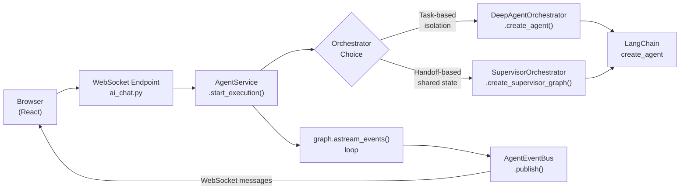

### Step-by-step

1. **WebSocket connects** at `ws://host/api/v1/ai/chat/stream?token=<JWT>`.
   - `ai_chat.py:chat_stream()` validates the JWT, checks RBAC for `ai-chat` permission.

2. **User sends a `WSChatRequest`** with `message`, `assistant_config_id`, `execution_mode`.

3. **Session is resolved or created** via `AIConfigService`. The session holds `project_id`, `branch_id`, and other temporal context.

4. **`AgentService.start_execution()`** is called:
   - Creates an `AgentEventBus` and registers it with the global `RunnerManager`.
   - Spawns an independent DB session.
   - Creates an `AIAgentExecution` row for tracking.
   - Calls `_run_agent_graph()`.

5. **`_run_agent_graph()`** orchestrates the agent:
   - Builds conversation history from DB messages.
   - Composes the system prompt (see Section 2).
   - Resolves LLM config (provider, model, API key) from the `AIAssistantConfig`.
   - Creates a `ToolContext` with user role, project scope, execution mode.
   - Calls `_create_deep_agent_graph()` which delegates to `DeepAgentOrchestrator.create_agent()`.
   - Runs `graph.astream_events()` and publishes events to the `AgentEventBus`.

   > **Note:** The system also has a `SupervisorOrchestrator` (see Section 7) that uses a handoff-based delegation pattern with shared state instead of task-based isolation. The orchestrator choice is determined at graph compilation time.

6. **The WebSocket handler** subscribes to the event bus and forwards events to the browser.

---

## 2. System Prompt Composition

The system prompt is assembled in three layers. The final prompt depends on whether subagents are enabled.

### Layer 1: Base Prompt

The `AIAssistantConfig.system_prompt` from the database, or the hardcoded `DEFAULT_SYSTEM_PROMPT`:

```
You are a helpful AI assistant for the Backcast project budget management system.
...
```

### Layer 2: Project Context (added by `AgentService._build_system_prompt()`)

When a session is scoped to a project, a context section is appended:

```
You are operating in the context of a specific project (ID: {project_id}).
Use project-scoped tools to query data within this project.
Project scope is locked for this session - you cannot switch to other projects.
```

**Key security principle:** Temporal parameters (`as_of`, `branch_name`, `branch_mode`) are **never** placed in the prompt. They are enforced at the tool level via `ToolContext` and injected by `TemporalContextMiddleware`. This prevents prompt injection from bypassing temporal constraints.

### Layer 3: Subagent Delegation Instructions (when `enable_subagents=True`)

Two sections are appended by `DeepAgentOrchestrator._build_system_prompt_suffix()`:

1. **`TASK_SYSTEM_PROMPT`** — The "task" tool usage guide:
   ```
   ## `task` (subagent spawner)
   You have access to a `task` tool to launch short-lived subagents...
   When to use the task tool:
   - When a task is complex and multi-step...
   - When a task is independent of other tasks and can run in parallel...
   ```

2. **Subagent listing suffix** — Dynamic list of available subagents:
   ```
   IMPORTANT: You do NOT have direct access to Backcast tools.
   ALL Backcast operations must be delegated to specialized subagents:

   Available Subagents:
   - project_manager: get_temporal_context, list_projects, get_project...
   - evm_analyst: get_temporal_context, calculate_evm_metrics...
   - change_order_manager: get_temporal_context, list_change_orders...
   - user_admin: get_temporal_context, list_users, get_user...
   - visualization_specialist: get_temporal_context, generate_mermaid_diagram
   - forecast_manager: get_temporal_context, get_forecast...

   Do NOT attempt to use Backcast tools directly - they will not work.
   Always delegate via the task tool.
   ```

### Final Prompt Structure (Subagents Enabled)

```
┌─────────────────────────────────────────────────┐
│ Base Prompt (from assistant config)             │
├─────────────────────────────────────────────────┤
│ Project Context (if project-scoped session)     │
├─────────────────────────────────────────────────┤
│ TASK_SYSTEM_PROMPT (when/how to use task tool)  │
├─────────────────────────────────────────────────┤
│ Subagent listing + delegation instructions      │
└─────────────────────────────────────────────────┘
```

### Final Prompt Structure (Subagents Disabled)

```
┌─────────────────────────────────────────────────┐
│ Base Prompt (from assistant config)             │
├─────────────────────────────────────────────────┤
│ Project Context (if project-scoped session)     │
└─────────────────────────────────────────────────┘
```

---

## 3. Context Management & LLM Calls

This section describes what the LLM actually receives at invocation time: how state is structured, how conversation history is loaded, and how runtime context flows through the agent graph.

### AgentState

The LangGraph `StateGraph` operates on a `AgentState` TypedDict (defined in `ai/state.py`):

```python
class AgentState(TypedDict):
    messages: Annotated[list[BaseMessage], operator.add]  # append-only via operator.add
    tool_call_count: int                                   # iteration guard
    next: Literal["agent", "tools", "end"]                 # routing control
```

The `Annotated[list[BaseMessage], operator.add]` annotation means `messages` uses **append-only semantics**: each graph node returns new messages that get appended to the list rather than replacing it.

### Conversation History Loading

`AgentService._build_conversation_history(session_id)` loads prior messages from the database:

1. Calls `AIConfigService.list_messages(session_id)` → returns `AIConversationMessage` rows ordered by creation time.
2. Converts each row to a LangChain message:
   - `role == "user"` → `HumanMessage(content=msg.content)`
   - `role == "assistant"` → `AIMessage(content=msg.content)`
   - `role == "tool"` → **skipped** (tool messages from previous turns are not replayed)
3. Returns a `list[BaseMessage]`.

There is **no token-based truncation or summarization** — the full conversation history is loaded every turn. Long sessions rely on the LLM's native context window.

### Graph Input Assembly

`_run_agent_graph()` assembles the initial state passed to the compiled graph:

```python
{
    "messages": history,        # from _build_conversation_history()
    "tool_call_count": 0,
    "next": "agent",
}
```

The **system prompt** is not part of the state. It is passed to `langchain_create_agent()` at graph compilation time and injected as a `SystemMessage` by the LangGraph framework at the start of every agent node invocation.

### What the LLM Receives

Each time the agent node fires, the LLM API call contains three things:

1. **System prompt** — The composed prompt from Section 2 (base + project context + subagent instructions).
2. **Tool definitions** — The filtered tool list as JSON Schema function declarations (e.g., `[task, get_temporal_context]` for the main agent, or `[list_projects, get_project, ...]` for a subagent).
3. **Message history** — The full `messages` list from state, which grows over the turn as tool calls and results are appended.

```
┌─ LLM API Call ───────────────────────────────────────────────────────────┐
│                                                                          │
│  system:    [SystemMessage] composed prompt (Section 2)                  │
│                                                                          │
│  messages:  [HumanMessage] "What's the EVM of PRJ-001?"                 │
│             [AIMessage] tool_calls=[{name:"task", args:{...}}]           │
│             [ToolMessage] "Subagent result: ..."                         │
│             [AIMessage] tool_calls=[{name:"task", args:{...}}]           │
│             [ToolMessage] "Subagent result: ..."                         │
│             ← growing list, each tool round adds 2 messages              │
│                                                                          │
│  tools:     [task, get_temporal_context]  ← function schemas             │
│                                                                          │
└──────────────────────────────────────────────────────────────────────────┘
```

### BackcastRuntimeContext

Per-request security and scoping data is passed via LangGraph's **Runtime** mechanism — not through state or the prompt. This is set in `graph_cache.py`:

```python
@dataclass
class BackcastRuntimeContext:
    user_id: str                    # authenticated user ID
    user_role: str                  # RBAC role (e.g. "admin", "viewer")
    project_id: str | None = None   # project scope from session
    branch_id: str | None = None    # branch / change-order scope
    execution_mode: str = "standard" # SAFE / STANDARD / EXPERT
```

Passed to the graph via `context=BackcastRuntimeContext(...)` in the `astream_events()` call. Middleware reads this via `ContextVar` (see `set_request_context()`) rather than from state, so that cached compiled graphs can serve multiple requests with different security contexts.

### Context Flow Through the Agent Loop

```
_build_conversation_history()
        │
        ▼
   graph input state
   {messages: [...], tool_call_count: 0, next: "agent"}
        │
        ▼
┌─ Agent Node ────────────────────────────────────────┐
│  LLM receives: system prompt + messages + tools     │
│  LLM responds: AIMessage (text or tool_calls)       │
│  State update: messages += [AIMessage]               │
│  Routing: tool_calls? → tools : end                 │
└──────────────────────────┬──────────────────────────┘
                           │ tool_calls present
                           ▼
┌─ Tools Node ────────────────────────────────────────┐
│  Each tool call passes through middleware stack:     │
│    1. TemporalContextMiddleware injects params       │
│    2. BackcastSecurityMiddleware checks RBAC + risk  │
│  Tool executes → ToolMessage                        │
│  State update: messages += [ToolMessage, ...]        │
│  State update: tool_call_count += N                  │
│  Routing: count < 5? → agent : end                  │
└──────────────────────────┬──────────────────────────┘
                           │
                           └──► back to Agent Node
```

### Subagent Context Isolation

When the `task` tool spawns a subagent, it constructs a new state from the parent:

1. **Copy parent state** but exclude keys that have no meaning for the subagent:
   ```
   _EXCLUDED_STATE_KEYS = {
       "messages",              # replaced with [HumanMessage(description)]
       "todos",                 # no reducer defined for subagent
       "structured_response",   # subagent has its own schema
       "skills_metadata",       # private state attr, would leak
       "memory_contents",       # private state attr, would leak
   }
   ```
2. **Replace messages** with `[HumanMessage(content=description)]` where `description` is the main agent's task instruction.
3. **Reset** `tool_call_count` to 0 and `next` to `"agent"`.

The subagent gets its own **system prompt** (domain-specific), **tool list** (filtered to its domain), and **middleware stack** (same `TemporalContextMiddleware` + `BackcastSecurityMiddleware`). It runs a fresh agent loop with no access to the parent conversation.

```
Main Agent state                     Subagent state
┌────────────────────────┐          ┌────────────────────────┐
│ messages: [             │          │ messages: [             │
│   HumanMessage(...),    │  ──►    │   HumanMessage(desc)    │  ← replaced
│   AIMessage(...),       │          │ ]                       │
│   ToolMessage(...),     │          │ tool_call_count: 0      │  ← reset
│   ...                   │          │ next: "agent"           │  ← reset
│ ]                       │          └────────────────────────┘
│ tool_call_count: 3      │
│ next: "tools"           │          Subagent gets:
└────────────────────────┘          - Own system prompt (domain-specific)
                                    - Own tool list (domain-filtered)
                                    - Same BackcastRuntimeContext (via ContextVar)
                                    - Same middleware stack
```

### Message Persistence

After execution, `_run_agent_graph()` saves messages back to the database:

1. **User message** — saved before execution starts (`role="user"`, `content=message`).
2. **Assistant segments** — saved during streaming. Each segment captures:
   - `role="assistant"`, `content` (text content)
   - `tool_calls` (JSONB — name, args, invocation IDs)
   - `tool_results` (JSONB — tool outputs)
   - `message_metadata` (JSONB — subagent type, segment index, etc.)
3. **Subagent messages** — saved with metadata linking them to the parent execution.

4. **Error persistence** — When graph execution fails, the exception is captured and persisted as an assistant message with metadata `{"error": true, "error_type": "..."}`. This ensures users see what went wrong when reopening the session. The error message includes a human-readable summary and the error type for diagnostics.

On the next turn, `_build_conversation_history()` loads user and assistant messages. Tool messages are skipped because the LLM only needs the conversation flow, not the raw tool payloads.

---

## 4. Tool Registry & Filtering

### Tool Creation

All tools are created via `create_project_tools(tool_context)` in `tools/__init__.py`. This function:

1. Collects tools from 8 template packages (CRUD, analysis, change order, cost element, user management, advanced analysis, diagram, forecast).
2. Each tool is decorated with `@ai_tool` which attaches metadata: name, description, risk level (`LOW`, `HIGH`, `CRITICAL`).
3. Results are cached as a singleton — tools are created once per `ToolContext`.

### Filtering Chain

Tools go through four filtering stages before reaching the LLM:

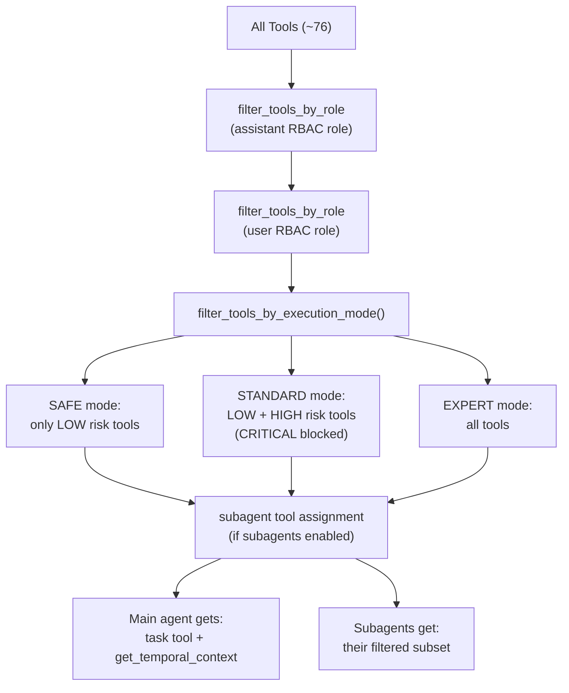

### Role-Based Tool Filtering

Each AI assistant has a `default_role` field (e.g., `ai-viewer`, `ai-manager`, `ai-admin`) stored in the `AIAssistantConfig` model. When an agent is created, `filter_tools_by_role()` checks each tool's `_tool_metadata.permissions` against the assistant's RBAC role:

- **ai-viewer**: 45/76 tools — read-only access (31 write tools removed)
- **ai-manager**: 61/76 tools — full project CRUD (15 admin tools removed)
- **ai-admin**: 13/76 tools — system configuration, user/dept management

Tools without `_tool_metadata` or with empty permissions always pass through (e.g., `task`, `get_temporal_context`, `write_todos`).

The assistant role is applied FIRST, followed by the user's RBAC role, then execution mode filtering. This ensures that:
1. Assistants are restricted to their configured role capabilities
2. Users can only use tools they have permissions for
3. Execution modes provide an additional safety layer on top of RBAC

Subagents inherit all filtering stages, so they also respect RBAC restrictions.

### Risk Levels

| Risk Level | Examples | SAFE | STANDARD | EXPERT |
|-----------|----------|------|----------|--------|
| LOW | `list_projects`, `get_project`, `calculate_evm_metrics` | Allowed | Allowed | Allowed |
| HIGH | `create_project`, `update_cost_element`, `approve_change_order` | Blocked | Allowed (requires approval) | Allowed |
| CRITICAL | `delete_project`, bulk operations | Blocked | Blocked | Allowed |

---

## 5. Subagent Architecture

Six specialized subagents, each mapped to a domain:

| Subagent | Domain | Tool Count | Structured Output |
|----------|--------|------------|-------------------|
| `project_manager` | Projects, WBEs, cost elements, cost tracking, progress entries | 36 | None |
| `evm_analyst` | EVM metrics (CPI, SPI, CV, SV, EAC) and health analysis | 9 | `EVMMetricsRead` |
| `change_order_manager` | Change order CRUD, approval workflows, impact analysis | 8 | `ImpactAnalysisResponse` |
| `user_admin` | Users and departments CRUD | 10 | None |
| `visualization_specialist` | Mermaid diagram generation | 2 | None |
| `forecast_manager` | Forecasts, schedule baselines, trend analysis | 11 | `ForecastRead` |

### Subagent Compilation

In `DeepAgentOrchestrator._build_subagent_dicts()`, each subagent is compiled into an independent LangChain agent:

1. Tool list filtered by assistant RBAC role (via `default_role`).
2. Tool list filtered by user RBAC role (user's permissions).
3. Tool list filtered by execution mode (safe/standard/expert).
4. Middleware stack applied: `TemporalContextMiddleware` + `BackcastSecurityMiddleware` (but **not** `TodoListMiddleware` — only the main agent plans).
5. Compiled via `langchain_create_agent()` with the subagent's domain-specific system prompt.
6. Stored as a dict: `{name, description, runnable, structured_output_schema}`.

Each subagent runs with its own isolated context window — it sees only the task description provided by the main agent, not the full conversation history.

---

## 6. The Task Tool: How Delegation Works

The `task` tool is the main agent's **only** mechanism for performing Backcast operations when subagents are enabled.

### Definition

Built by `build_task_tool()` in `tools/subagent_task.py`. It's a `StructuredTool` with two parameters:

- `subagent_type` — Which subagent to invoke (e.g., `"evm_analyst"`).
- `description` — Detailed task instructions for the subagent.

### Invocation Flow

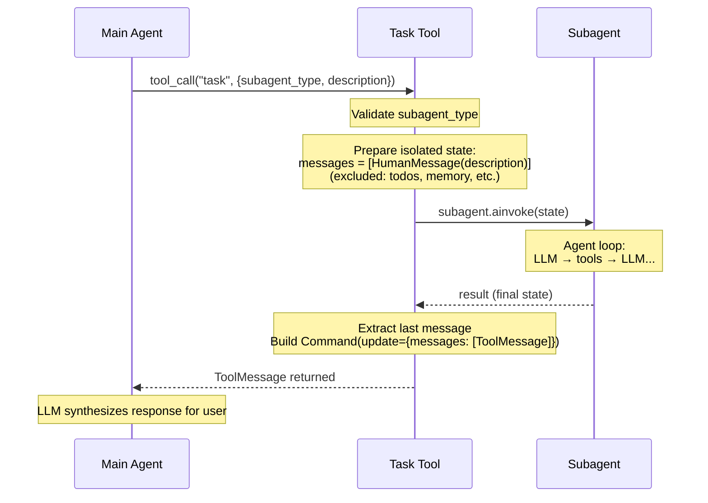

### Key Behaviors

- **State isolation**: The subagent receives all parent state **except** excluded keys (`messages`, `todos`, `structured_response`, `skills_metadata`, `memory_contents`). Messages are replaced with `[HumanMessage(description)]`.
- **Single return**: The subagent returns exactly one result via `Command(update={...})`. The main agent sees this as a `ToolMessage`.
- **Parallel execution**: The main agent can invoke multiple subagents in a single message (multiple `task` tool calls). They run concurrently.
- **Retry**: The async `atask()` retries transient HTTP errors (`ReadError`, `ConnectError`, `ConnectTimeout`, `ReadTimeout`) up to 3 times with exponential backoff.
- **Structured output**: If the subagent has a `structured_output_schema`, the result is serialized and summarized by `_summarize_structured_output()`.

---

## 7. Supervisor Orchestration Pattern

A second orchestrator, `SupervisorOrchestrator`, has been added alongside `DeepAgentOrchestrator`. It uses a **handoff-based delegation pattern** instead of the task-based subagent isolation described in Section 6.

### Key Files

| File | Responsibility |
|------|---------------|
| `ai/supervisor_orchestrator.py` | `SupervisorOrchestrator`: handoff-based agent delegation with shared state |
| `ai/supervisor_state.py` | `BackcastSupervisorState`: shared state schema for supervisor graph |
| `ai/handoff_tools.py` | `create_handoff_tool()`, `create_all_handoff_tools()`: Command(goto=...) handoff mechanism |

### Architecture

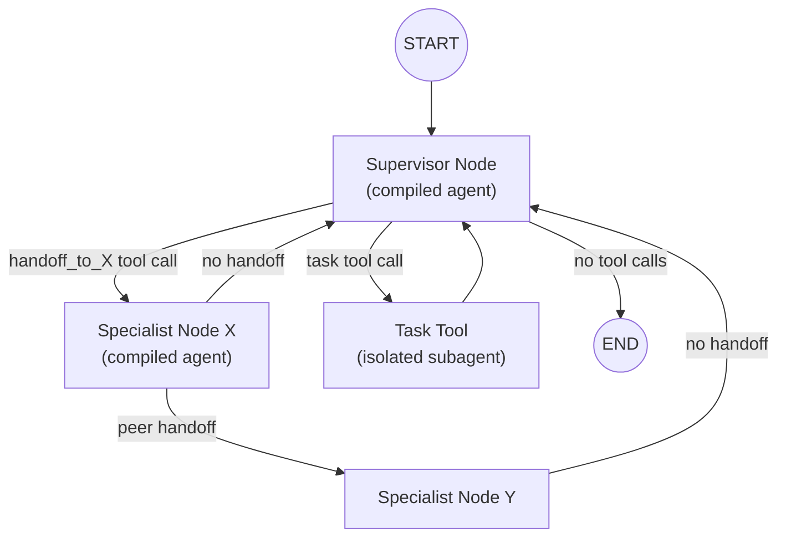

The supervisor is a parent `StateGraph` where the supervisor agent routes to specialist agents via handoff tools. Each specialist is a compiled `create_agent()` graph embedded as a subgraph node.

### State Schema

```python
class BackcastSupervisorState(TypedDict):
    messages: Annotated[list[BaseMessage], operator.add]
    active_agent: str
    structured_response: Any | None
    tool_call_count: Annotated[int, operator.add]
    max_tool_iterations: int
```

All specialists share the **full message history** through the parent graph's shared state. The `messages` field uses `operator.add` (append-only), so every agent sees the complete conversation.

### Handoff Mechanism

Handoff tools are created by `create_handoff_tool(agent_name, agent_description)`. Each returns:

```python
Command(
    goto=agent_name,
    graph=Command.PARENT,
    update={"messages": [tool_message], "active_agent": agent_name},
)
```

The `graph=Command.PARENT` flag tells LangGraph to route to the target agent's subgraph node in the **parent** graph, preserving shared state.

### Supervisor Routing Guidelines

| Request Domain | Route To |
|---------------|----------|
| Project CRUD, WBEs, cost elements, cost tracking, progress entries | `project_manager` |
| EVM calculations, performance analysis | `evm_analyst` |
| Change orders, impact analysis | `change_order_manager` |
| User/department management | `user_admin` |
| Diagrams, visualizations | `visualization_specialist` |
| Forecasts, schedule baselines | `forecast_manager` |
| Unclear or cross-cutting | `general_purpose` |

### Task-Based vs. Handoff-Based Delegation

| Aspect | Task Tool (Section 6) | Handoff (This Section) |
|--------|----------------------|----------------------|
| State | Isolated — subagent gets `[HumanMessage(description)]` | Shared — specialist sees full message history |
| Execution | Parallel — multiple subagents run concurrently | Sequential — one specialist at a time |
| Context | Passed via `description` parameter | Inherited from parent state |
| Use when | Parallel batch operations, context isolation acceptable | Multi-turn context preservation matters |

The supervisor retains the `task` tool for parallel batch operations. Handoff is the preferred mechanism for most requests.

### Specialist-to-Specialist Handoff

Specialists can hand off to other specialists (peer handoff) without returning to the supervisor. The `_make_specialist_router()` checks the last message for handoff tool calls and routes to the target specialist directly, or back to the supervisor if no handoff is detected.

### Fallback

If no specialists compile successfully (e.g., all filtered out by RBAC), `_build_fallback_graph()` creates a simple agent with direct tool access and no specialist routing.

---

## 8. Inter-Agent Communication: Event Bus

### Architecture

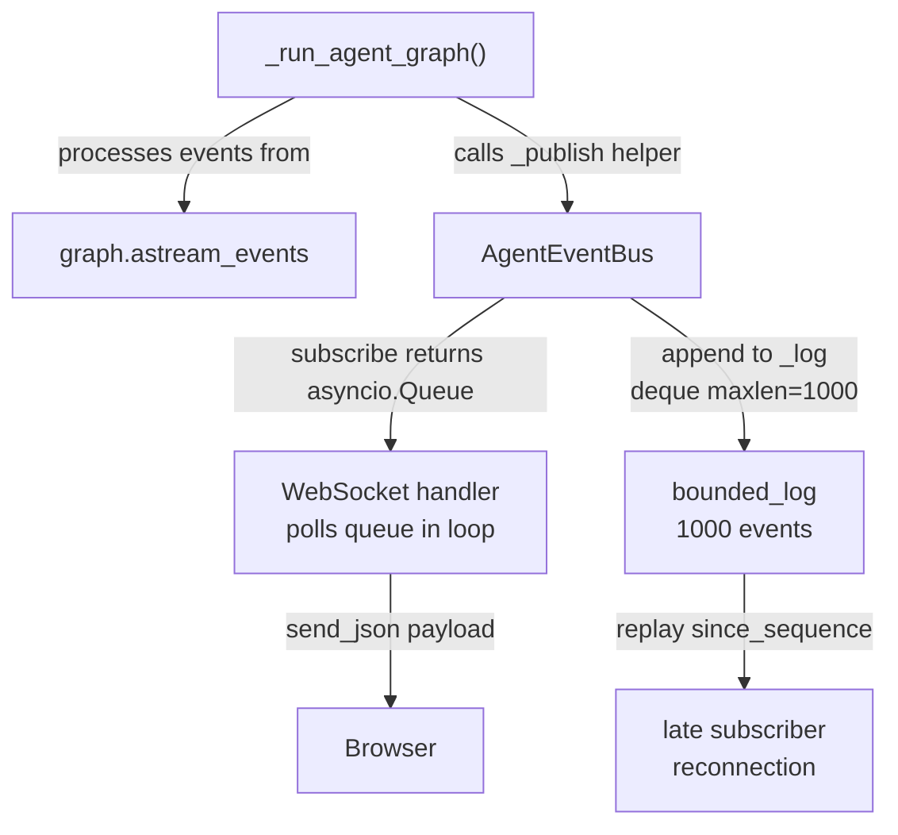

### Event Types

| Event | When Published | Frontend Effect |
|-------|---------------|-----------------|
| `thinking` | Agent starts processing | Shows spinner |
| `planning` | TodoListMiddleware generates steps | Shows step list |
| `subagent` | Main agent delegates to subagent | Shows "Delegating to X..." |
| `tool_call` | A tool starts executing | Shows tool name + args |
| `tool_result` | A tool finishes | Shows result summary |
| `subagent_result` | Subagent completes | Shows "X completed" |
| `token_batch` | Accumulated tokens flushed | Appends to streaming text |
| `content_reset` | Between subagent and main agent | Clears streaming area |
| `complete` | Execution finished | Finalizes response |
| `error` | Execution failed | Shows error |
| `execution_status` | Status change (running→error) | Updates UI state |

### Runner Manager

The global `RunnerManager` singleton maps `execution_id` → `AgentEventBus`. This allows:
- **WebSocket reconnection**: If the browser reconnects, it can subscribe to the same bus via `execution_id`.
- **REST polling**: The `GET /ai/chat/executions/{id}/status` endpoint reads from the bus.
- **Cleanup**: Buses are removed from the manager when execution completes.

### Stream Retry: Transient Error Recovery

`graph.astream_events()` is wrapped in a retry loop to handle transient network errors:

- **Max retries**: 2 (up to 3 total attempts)
- **Retry delay**: 2 seconds between attempts
- **Retried errors**: `httpcore.ReadError`, `httpx.RemoteProtocolError`, `ConnectionResetError`, `OSError`
- **Error detection**: `ConnectionResetError` and `OSError` are caught directly; `httpcore.ReadError` and `httpx.RemoteProtocolError` are detected by inspecting the exception's `__name__` and `__module__` (avoids hard imports of optional dependencies)
- **On retry**: The stream restarts from the graph's current checkpoint state; `events_processed` is reset to 0
- **Timeout**: `stream_chunk_timeout` is set to 300 seconds on the `ChatOpenAI` client, preventing premature internal timeouts during long agent executions
- **Final failure**: Propagates to the existing error handler which publishes an `error` event to the event bus and persists the error as an assistant message (see Section 3, Error persistence)

---

## 9. Routing Decisions

### Main Agent: "Should I delegate or respond directly?"

The routing is driven entirely by the **system prompt** and **available tools**:

**Subagents ENABLED:**
1. Main agent sees: `[task, get_temporal_context]`
2. System prompt: "You do NOT have direct access to Backcast tools. ALL operations must be delegated to subagents."
3. Main agent **always** delegates via task tool.

**Subagents DISABLED:**
1. Main agent sees: `[list_projects, get_project, create_wbe, ...]`
2. System prompt: (base prompt only)
3. Main agent calls tools directly.

The LLM decides which subagent to use based on the `task` tool description, which lists all available subagents with their capabilities:

```
Available agent types and the tools they have access to:
- project_manager: Specialist for project, WBE, cost element...
- evm_analyst: Specialist for earned value management...
- change_order_manager: Specialist for change order management...
- user_admin: Specialist for user and department management...
- visualization_specialist: Specialist for generating diagrams...
- forecast_manager: Specialist for forecasting and schedule baselines...
```

### Main Agent: "Should I call one or multiple subagents?"

The `TASK_SYSTEM_PROMPT` instructs the agent:

> When a user request spans multiple domains, launch ALL relevant subagents in parallel.

Examples from the prompt:
- "What's the performance of project X?" → `project_manager` + `evm_analyst` in parallel.
- "Analyze change order CO-001 impact" → `change_order_manager` + `forecast_manager` in parallel.
- "Show WBE hierarchy with cost breakdowns" → `project_manager` for both WBEs and costs.

### Subagent: "Should I call a tool or respond?"

Each subagent runs a standard LangGraph `StateGraph` with the routing function `should_continue()`:

```
Agent Node (LLM call)
    │
    ├── AIMessage has tool_calls?
    │       │
    │       ├── NO  → END
    │       │
    │       └── YES → tool_call_count < 5?
    │                       │
    │                       ├── YES → Tools Node (execute) → back to Agent Node
    │                       │
    │                       └── NO  → END
    │
    └── (no messages) → END
```

- **Max iterations**: 5 tool calls per agent loop.
- **Tool result**: Routes back to agent node for further reasoning.

---

## 10. Security Middleware Stack

When subagents are enabled, both the main agent and each subagent receive the same middleware stack (applied in `DeepAgentOrchestrator.create_agent()`):

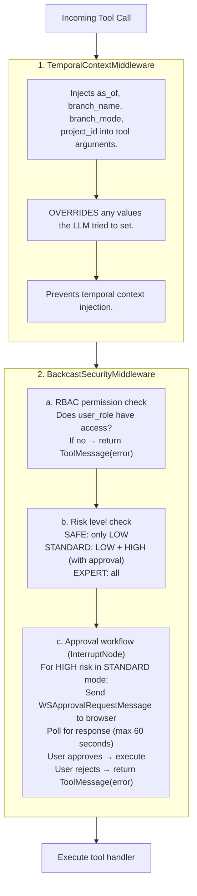

### Bypass Rules

- Tools NOT in the Backcast tool list (e.g., the `task` tool, `write_todos`) bypass the security middleware entirely.
- The `task` tool is allowed through because it's an orchestration tool — security is applied within the subagent it spawns.

### Context Variables

Both middleware classes use `ContextVar` to pass per-request context:
- `TemporalContextMiddleware` stores `ToolContext` in a context variable.
- `BackcastSecurityMiddleware` stores `InterruptNode` reference for approval handling.
- `set_request_context()` in `graph_cache.py` bridges the gap between cached graphs and per-request context.

---

## 11. Simulated Conversation Walkthrough

### Scenario: User asks "What's the EVM performance of project PRJ-001?"

#### Phase 1: Connection & Setup

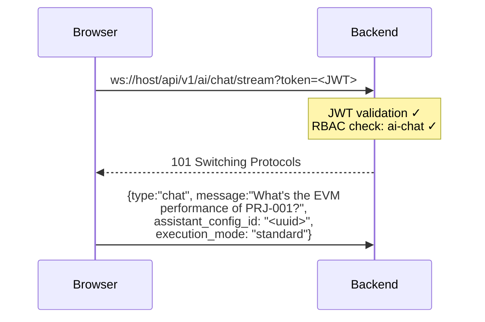

**What happens server-side:**

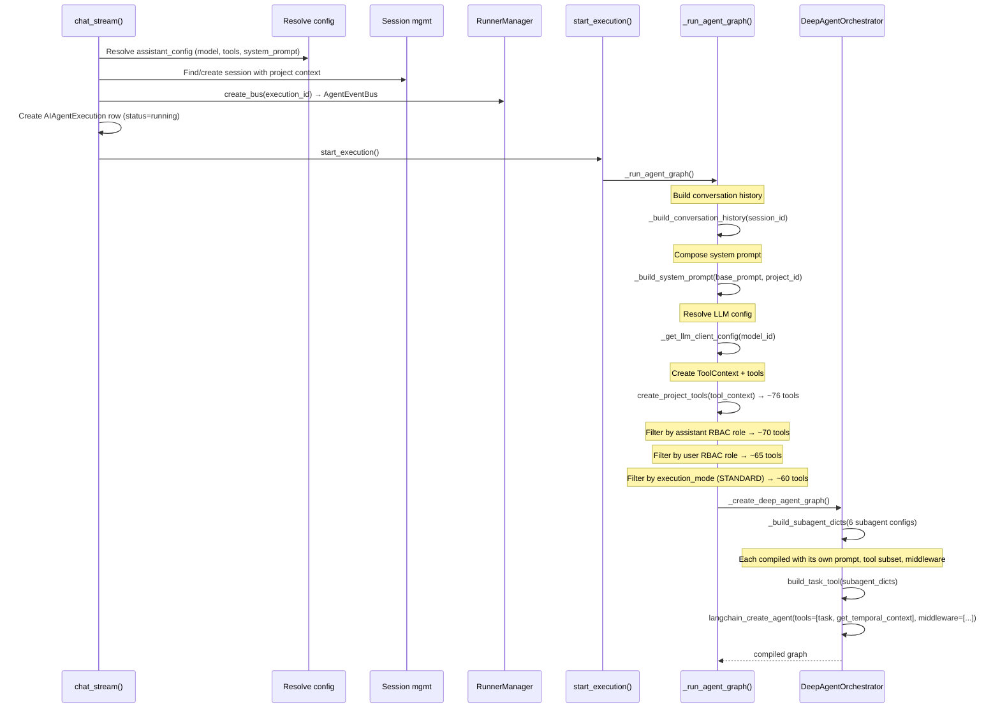

#### Phase 2: Agent Execution

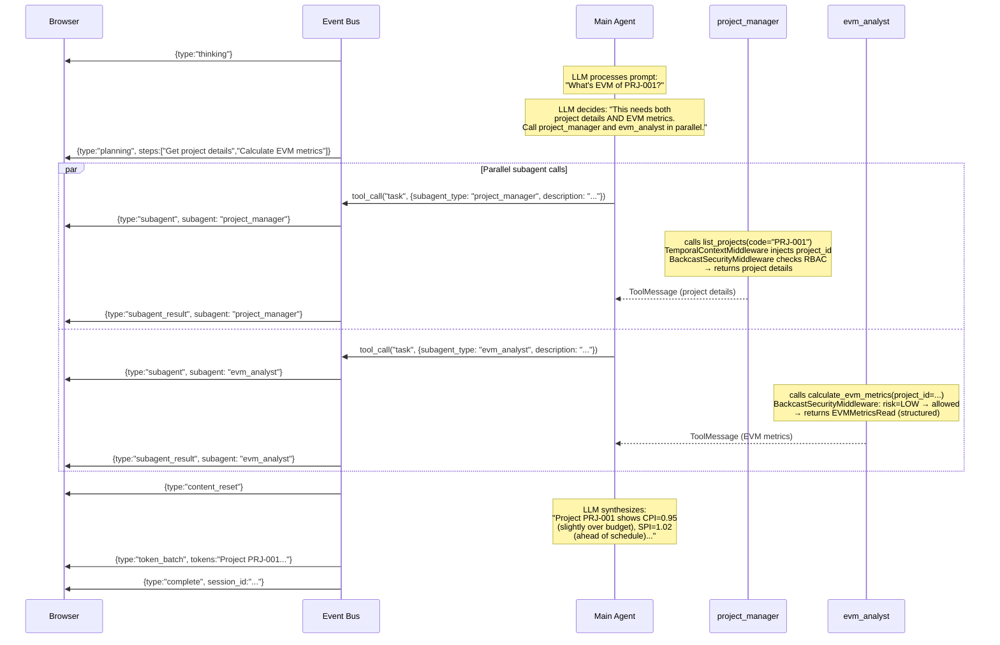

#### Phase 3: What the Agent "Saw"

The main agent's context window at the point of delegation:

```
┌─ Main Agent Context ──────────────────────────────────────────────────────┐
│ [SystemMessage]                                                           │
│   You are a helpful AI assistant for the Backcast project budget          │
│   management system.                                                      │
│   ...                                                                     │
│   You are operating in the context of a specific project (ID: abc-123).   │
│   ...                                                                     │
│   ## `task` (subagent spawner)                                            │
│   You have access to a `task` tool to launch short-lived subagents...     │
│   ...                                                                     │
│   IMPORTANT: You do NOT have direct access to Backcast tools.             │
│   ALL Backcast operations must be delegated to specialized subagents:     │
│   - project_manager: ...                                                  │
│   - evm_analyst: ...                                                      │
│   - change_order_manager: ...                                             │
│   ...                                                                     │
│                                                                           │
│ [HumanMessage] list projects                                              │
│ [AIMessage] Here are the available projects...                            │
│ [HumanMessage] ← new user message                                         │
│   What's the EVM performance of PRJ-001?                                  │
└───────────────────────────────────────────────────────────────────────────┘
```

The main agent's **available tools**: `task`, `get_temporal_context`. It has no other tools.

The `project_manager` subagent's context window:

```
┌─ project_manager Context ────────────────────────────────────────────────┐
│ [SystemMessage]                                                          │
│   You are a project management specialist.                               │
│   You help with:                                                         │
│   - Creating, updating, and retrieving projects                          │
│   ...                                                                    │
│                                                                          │
│ [HumanMessage] ← injected by task tool                                   │
│   Get project details for PRJ-001. Return the project name, status,      │
│   total budget, and WBE structure.                                       │
└──────────────────────────────────────────────────────────────────────────┘
```

The `evm_analyst` subagent's context window:

```
┌─ evm_analyst Context ───────────────────────────────────────────────────┐
│ [SystemMessage]                                                         │
│   You are an EVM analysis specialist.                                   │
│   You calculate and analyze earned value metrics including:             │
│   - CPI, SPI, CV, SV, EAC, ETC...                                      │
│   ...                                                                   │
│                                                                         │
│ [HumanMessage] ← injected by task tool                                  │
│   Calculate EVM metrics for all cost elements in project PRJ-001.       │
│   Return CPI, SPI, CV, SV, EAC, and a health assessment.               │
└─────────────────────────────────────────────────────────────────────────┘
```

---

### Scenario: HIGH-Risk Tool with Approval

User: "Create a new WBE called 'Assembly' under project PRJ-001"

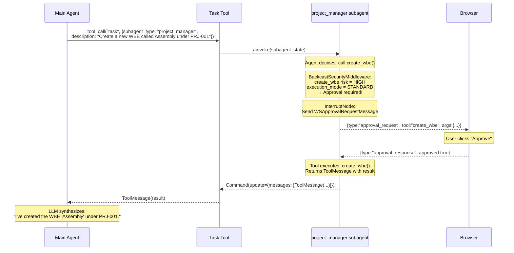

---

### Scenario: Supervisor Orchestrator — Project Health Check with Follow-up

This walkthrough demonstrates the **SupervisorOrchestrator** (Section 7) with shared state, handoff-based delegation, peer handoff between specialists, and a follow-up user message that benefits from preserved conversation context.

**User:** "What's the status and EVM performance of project PRJ-001?"
**Follow-up:** "How would change order CO-0042 affect this?"

#### Phase 2: Initial Request — Routing and Specialist Execution

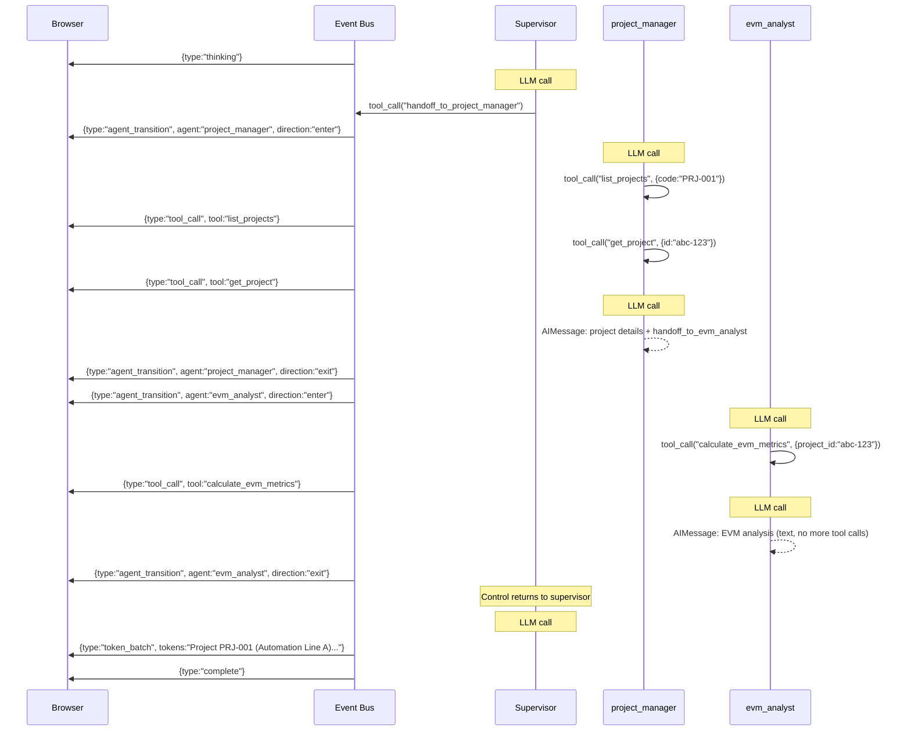

#### What Each LLM Call Received and Produced

**Supervisor — LLM Call #1** (initial routing):

```
┌─ LLM API Call #1 — Supervisor ──────────────────────────────────────────┐
│                                                                          │
│  system:   [SystemMessage]                                               │
│            You are a helpful AI assistant for the Backcast project       │
│            budget management system.                                     │
│            You act as a supervisor that routes user requests...          │
│            [... routing guidelines ...]                                  │
│            IMPORTANT: You do NOT have direct access to Backcast tools.   │
│            ALL Backcast operations must be delegated to specialists via  │
│            handoff tools or the task tool.                               │
│                                                                          │
│  messages: [HumanMessage] "What's the status and EVM performance of     │
│              project PRJ-001?"                                           │
│                                                                          │
│  tools:    [handoff_to_project_manager, handoff_to_evm_analyst,         │
│             handoff_to_change_order_manager, handoff_to_user_admin,     │
│             handoff_to_visualization_specialist,                         │
│             handoff_to_forecast_manager, handoff_to_general_purpose,    │
│             task, get_temporal_context]                                  │
│                                                                          │
│  output:   AIMessage(                                                   │
│              content="",                                                 │
│              tool_calls=[{                                               │
│                name: "handoff_to_project_manager",                       │
│                args: {}                                                  │
│              }]                                                          │
│            )                                                             │
└──────────────────────────────────────────────────────────────────────────┘
```

**project_manager — LLM Call #1** (fetch project data):

```
┌─ LLM API Call #2 — project_manager ─────────────────────────────────────┐
│                                                                          │
│  system:   [SystemMessage]                                               │
│            You are a project management specialist.                      │
│            You help with:                                                │
│            - Creating, updating, and retrieving projects                 │
│            - Managing WBEs, cost elements, cost tracking, progress       │
│            [...]                                                         │
│                                                                          │
│  messages: [HumanMessage] "What's the status and EVM performance of     │
│              project PRJ-001?"        ← shared state, user's message    │
│            [AIMessage] handoff_to_project_manager  ← supervisor handoff │
│            [ToolMessage] "Transferred to project_manager"               │
│                                                                          │
│  tools:    [list_projects, get_project, list_wbes, get_wbe,             │
│             create_wbe, update_wbe, list_cost_elements, ...]  ← ~36     │
│                                                                          │
│  output:   AIMessage(                                                   │
│              content="",                                                 │
│              tool_calls=[                                                │
│                {name: "list_projects", args: {code: "PRJ-001"}},         │
│                {name: "get_project", args: {id: "abc-123"}}              │
│              ]                                                           │
│            )                                                             │
└──────────────────────────────────────────────────────────────────────────┘
```

**project_manager — LLM Call #2** (synthesize + peer handoff):

```
┌─ LLM API Call #3 — project_manager ─────────────────────────────────────┐
│                                                                          │
│  system:   [SystemMessage]  (same domain-specific prompt)                │
│                                                                          │
│  messages: [HumanMessage] "What's the status and EVM performance..."    │
│            [AIMessage] handoff_to_project_manager                        │
│            [ToolMessage] list_projects → [{id:"abc-123", code:"PRJ-001",│
│                        name:"Automation Line A", status:"active", ...}]  │
│            [ToolMessage] get_project → {budget: 2500000, progress: 42%,│
│                        wbe_count: 8, ...}                                │
│                                                                          │
│  tools:    [list_projects, get_project, ...]  (same ~36 tools)           │
│                                                                          │
│  output:   AIMessage(                                                   │
│              content="Project PRJ-001 (Automation Line A) is active     │
│                       with a budget of $2.5M and 42% progress...",      │
│              tool_calls=[{                                               │
│                name: "handoff_to_evm_analyst",  ← peer handoff          │
│                args: {}                                                  │
│              }]                                                          │
│            )                                                             │
└──────────────────────────────────────────────────────────────────────────┘
```

> **Key difference from task-based delegation:** The `project_manager` specialist produced a text response *and* called a handoff tool. The `evm_analyst` will see the project_manager's text and tool results because all messages live in the shared `BackcastSupervisorState`.

**evm_analyst — LLM Call #1** (calculate metrics, with full context):

```
┌─ LLM API Call #4 — evm_analyst ─────────────────────────────────────────┐
│                                                                          │
│  system:   [SystemMessage]                                               │
│            You are an EVM analysis specialist.                           │
│            You calculate and analyze earned value metrics including:     │
│            - CPI, SPI, CV, SV, EAC, ETC...                              │
│                                                                          │
│  messages: [HumanMessage] "What's the status and EVM performance..."    │
│            [AIMessage] handoff_to_project_manager                        │
│            [ToolMessage] "Transferred to project_manager"               │
│            [AIMessage] tool_calls=[list_projects, get_project]           │
│            [ToolMessage] list_projects result                            │
│            [ToolMessage] get_project result                              │
│            [AIMessage] "Project PRJ-001... budget $2.5M, 42%..."        │
│            [AIMessage] handoff_to_evm_analyst                            │
│            [ToolMessage] "Transferred to evm_analyst"                   │
│                  ↑ ALL previous messages from shared state               │
│                                                                          │
│  tools:    [calculate_evm_metrics, get_evm_summary, ...]  ← ~9 tools   │
│                                                                          │
│  output:   AIMessage(                                                   │
│              content="",                                                 │
│              tool_calls=[{                                               │
│                name: "calculate_evm_metrics",                            │
│                args: {project_id: "abc-123"}                             │
│              }]                                                          │
│            )                                                             │
└──────────────────────────────────────────────────────────────────────────┘
```

**evm_analyst — LLM Call #2** (final analysis, no more tool calls → returns to supervisor):

```
┌─ LLM API Call #5 — evm_analyst ─────────────────────────────────────────┐
│                                                                          │
│  system:   [SystemMessage]  (same EVM specialist prompt)                 │
│                                                                          │
│  messages: [... all previous messages ...]                               │
│            [AIMessage] tool_calls=[calculate_evm_metrics]                │
│            [ToolMessage] {CPI: 0.95, SPI: 1.02, CV: -125000,            │
│                            SV: 50000, EAC: 2631578, ...}                │
│                                                                          │
│  tools:    [calculate_evm_metrics, ...]  (same ~9 tools)                 │
│                                                                          │
│  output:   AIMessage(                                                   │
│              content="EVM Analysis for PRJ-001:\n                        │
│                CPI: 0.95 (slightly over budget)\n                        │
│                SPI: 1.02 (ahead of schedule)\n                           │
│                Cost Variance: -$125K\n                                   │
│                Schedule Variance: +$50K\n                                │
│                Estimate at Completion: $2.63M\n                          │
│                Overall health: CAUTIONARY — budget overruns detected.")  │
│            (no tool_calls → specialist router returns to supervisor)     │
└──────────────────────────────────────────────────────────────────────────┘
```

**Supervisor — LLM Call #2** (synthesis):

```
┌─ LLM API Call #6 — Supervisor ──────────────────────────────────────────┐
│                                                                          │
│  system:   [SystemMessage]  (supervisor prompt + handoff suffix)         │
│                                                                          │
│  messages: [HumanMessage] "What's the status and EVM performance..."    │
│            [... entire specialist conversation ...]                      │
│            [AIMessage] "EVM Analysis for PRJ-001:\n                      │
│                         CPI: 0.95... SPI: 1.02..."                       │
│                                                                          │
│  tools:    [handoff_to_*, task, get_temporal_context]                    │
│                                                                          │
│  output:   AIMessage(                                                   │
│              content="Here's the overview for PRJ-001 (Automation Line  │
│                       A):\n\n**Project Status:** Active, 42% complete,  │
│                       $2.5M budget.\n\n**EVM Performance:**\n           │
│                       - CPI: 0.95 (slightly over budget)\n              │
│                       - SPI: 1.02 (ahead of schedule)\n                 │
│                       - EAC: $2.63M (projected $130K over budget)\n\n  │
│                       The project is progressing ahead of schedule but  │
│                       showing minor cost overruns.")                     │
│            (no tool_calls → supervisor router returns END)               │
└──────────────────────────────────────────────────────────────────────────┘
```

#### Shared State After Initial Request

```
┌─ BackcastSupervisorState (after Phase 2) ─────────────────────────────────┐
│                                                                            │
│  messages: [                                                               │
│    HumanMessage("What's the status and EVM performance of PRJ-001?"),     │
│    AIMessage(handoff_to_project_manager),                                  │
│    ToolMessage("Transferred to project_manager"),                          │
│    AIMessage(tool_calls=[list_projects, get_project]),                     │
│    ToolMessage(list_projects result),                                      │
│    ToolMessage(get_project result),                                        │
│    AIMessage("Project PRJ-001... budget $2.5M..."),                        │
│    AIMessage(handoff_to_evm_analyst),                                      │
│    ToolMessage("Transferred to evm_analyst"),                              │
│    AIMessage(tool_calls=[calculate_evm_metrics]),                          │
│    ToolMessage({CPI: 0.95, SPI: 1.02, ...}),                              │
│    AIMessage("EVM Analysis: CPI 0.95, SPI 1.02..."),                      │
│    AIMessage("Here's the overview for PRJ-001...")   ← supervisor synth  │
│  ]                                                                         │
│  active_agent: "supervisor"                                                │
│  structured_response: null                                                 │
│  tool_call_count: 3    ← list_projects + get_project + calculate_evm      │
│  max_tool_iterations: 20                                                   │
└────────────────────────────────────────────────────────────────────────────┘
```

#### Phase 3: Follow-up Message — Context Preservation Advantage

The user sends a follow-up. Because the supervisor uses **shared state**, the change_order_manager specialist will see the entire conversation history including the project details and EVM baseline — no re-fetching needed.

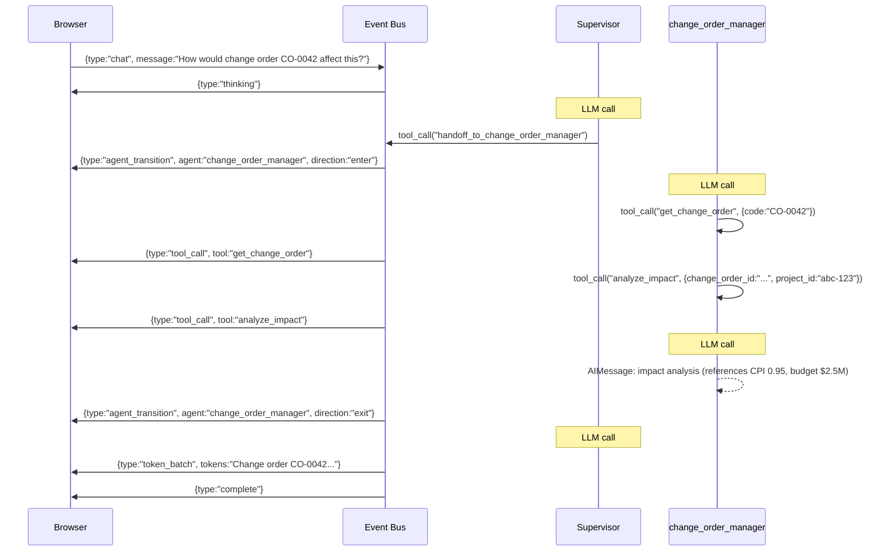

**Supervisor — LLM Call #3** (follow-up routing):

```
┌─ LLM API Call #7 — Supervisor ──────────────────────────────────────────┐
│                                                                          │
│  system:   [SystemMessage]  (supervisor prompt + handoff suffix)         │
│                                                                          │
│  messages: [... ALL messages from Phase 2 ...]   ← full history          │
│            [HumanMessage] "How would change order CO-0042 affect this?" │
│                                                                          │
│  tools:    [handoff_to_*, task, get_temporal_context]                    │
│                                                                          │
│  output:   AIMessage(                                                   │
│              content="",                                                 │
│              tool_calls=[{                                               │
│                name: "handoff_to_change_order_manager",                  │
│                args: {}                                                  │
│              }]                                                          │
│            )                                                             │
└──────────────────────────────────────────────────────────────────────────┘
```

**change_order_manager — LLM Call #1** (sees full context):

```
┌─ LLM API Call #8 — change_order_manager ────────────────────────────────┐
│                                                                          │
│  system:   [SystemMessage]                                               │
│            You are a change order management specialist.                 │
│            You handle: change order CRUD, approval workflows,            │
│            impact analysis...                                            │
│                                                                          │
│  messages: [HumanMessage] "What's the status and EVM performance..."    │
│            [... project_manager's tool calls and results ...]            │
│            [... evm_analyst's metrics (CPI: 0.95, SPI: 1.02) ...]      │
│            [... supervisor's synthesis ...]                              │
│            [HumanMessage] "How would change order CO-0042 affect this?"│
│            [AIMessage] handoff_to_change_order_manager                   │
│            [ToolMessage] "Transferred to change_order_manager"          │
│                  ↑ The specialist ALREADY KNOWS the project_id, budget, │
│                    EVM baseline — no need to re-fetch project data       │
│                                                                          │
│  tools:    [list_change_orders, get_change_order, analyze_impact,       │
│             approve_change_order, ...]  ← ~8 tools                      │
│                                                                          │
│  output:   AIMessage(                                                   │
│              content="",                                                 │
│              tool_calls=[                                                │
│                {name: "get_change_order", args: {code: "CO-0042"}},      │
│                {name: "analyze_impact", args: {                          │
│                  change_order_id: "def-456", project_id: "abc-123"}}     │
│              ]                                                           │
│            )                                                             │
└──────────────────────────────────────────────────────────────────────────┘
```

**change_order_manager — LLM Call #2** (impact analysis with context):

```
┌─ LLM API Call #9 — change_order_manager ────────────────────────────────┐
│                                                                          │
│  system:   [SystemMessage]  (same change order specialist prompt)        │
│                                                                          │
│  messages: [... all previous ...]                                        │
│            [AIMessage] tool_calls=[get_change_order, analyze_impact]     │
│            [ToolMessage] get_change_order → {title:"Add Safety Sensor", │
│              type:"scope_addition", cost_impact: +$175000, ...}          │
│            [ToolMessage] analyze_impact → {                              │
│              budget_impact: "+$175K (7% increase)",                      │
│              schedule_impact: "+2 weeks",                                │
│              new_eac: "$2.81M",                                          │
│              risk_level: "MODERATE"}                                      │
│                                                                          │
│  tools:    [list_change_orders, ...]  (same ~8 tools)                    │
│                                                                          │
│  output:   AIMessage(                                                   │
│              content="Impact Analysis for CO-0042 (Add Safety Sensor):\n│
│                \nBudget: +$175K — would increase total from $2.5M to    │
│                $2.81M. Given the current CPI of 0.95, this would widen  │
│                the overrun. New EAC: ~$2.95M.\nSchedule: +2 weeks. With │
│                SPI at 1.02, the schedule buffer can absorb this.\n       │
│                Risk: MODERATE. Recommend approval with revised budget   │
│                allocation.")                                             │
│            (no tool_calls → specialist router returns to supervisor)     │
│                                                                          │
│  Note: The response REFERENCES "CPI of 0.95" and "SPI at 1.02" from    │
│  the evm_analyst's earlier work — possible only because of shared state. │
└──────────────────────────────────────────────────────────────────────────┘
```

#### Phase 4: Shared State vs. Task-Based Isolation

The follow-up message demonstrates the key advantage of the supervisor pattern. Here's what the `change_order_manager` specialist saw in each approach:

```
┌─ Supervisor (Handoff) ──────────────────────────────────────────────────┐
│                                                                          │
│  messages: 15 messages                                                   │
│  - User's original question                                              │
│  - project_manager: list_projects result, get_project result             │
│  - project_manager: project summary text                                 │
│  - evm_analyst: calculate_evm_metrics result (CPI, SPI, EAC)            │
│  - evm_analyst: EVM analysis text                                        │
│  - Supervisor synthesis                                                  │
│  - User's follow-up question                                             │
│                                                                          │
│  → Specialist can reference earlier results directly                     │
│    ("Given the current CPI of 0.95...")                                  │
│  → No redundant API calls to re-fetch project or EVM data                │
│  → Response is contextually richer                                      │
└──────────────────────────────────────────────────────────────────────────┘

┌─ Task-Based (Isolated) ────────────────────────────────────────────────┐
│                                                                          │
│  messages: 1 message                                                     │
│  - [HumanMessage] "Analyze the impact of change order CO-0042 on       │
│     project PRJ-001"                                                     │
│                                                                          │
│  → Specialist has NO knowledge of previous conversation                  │
│  → Must re-fetch project data, re-calculate EVM baseline                 │
│  → Multiple extra tool calls (list_projects, calculate_evm_metrics)      │
│  → Response cannot reference specific earlier findings                   │
└──────────────────────────────────────────────────────────────────────────┘
```

---

## Key Files Reference

| File | Responsibility |
|------|---------------|
| `api/routes/ai_chat.py` | WebSocket endpoint, JWT auth, session creation |
| `ai/agent_service.py` | Orchestration: `_run_agent_graph()`, `_build_system_prompt()`, `start_execution()` |
| `ai/deep_agent_orchestrator.py` | `DeepAgentOrchestrator`: subagent compilation, tool filtering (execution mode + role), prompt composition |
| `ai/supervisor_orchestrator.py` | `SupervisorOrchestrator`: handoff-based agent delegation with shared state |
| `ai/supervisor_state.py` | `BackcastSupervisorState`: shared state schema for supervisor graph |
| `ai/handoff_tools.py` | `create_handoff_tool()`, `create_all_handoff_tools()`: Command(goto=...) handoff mechanism |
| `ai/state.py` | `AgentState` TypedDict: `messages`, `tool_call_count`, `next` |
| `ai/graph.py` | LangGraph `StateGraph` with `should_continue()` routing |
| `ai/graph_cache.py` | `BackcastRuntimeContext`, `CompiledGraphCache`, `set_request_context()` |
| `ai/subagents/__init__.py` | Seven subagent configurations (name, prompt, system_prompt) |
| `ai/tools/__init__.py` | `create_project_tools()`, `filter_tools_by_execution_mode()`, `filter_tools_by_role()` |
| `ai/tools/subagent_task.py` | `build_task_tool()`, `TASK_SYSTEM_PROMPT`, `TASK_TOOL_DESCRIPTION` |
| `ai/middleware/temporal_context.py` | `TemporalContextMiddleware`: injects temporal params into tool args |
| `ai/middleware/backcast_security.py` | `BackcastSecurityMiddleware`: RBAC + risk checks + approval workflow |
| `ai/execution/agent_event_bus.py` | `AgentEventBus`: pub/sub with bounded log |
| `ai/execution/runner_manager.py` | `RunnerManager`: execution_id → event_bus registry |
