# Agent Orchestration & Prompting Guide

How the Backcast AI agent system turns a user message into a response: prompt composition, tool routing, subagent delegation, inter-agent communication, and the security middleware stack.

---

## Table of Contents

1. [End-to-End Request Flow](#1-end-to-end-request-flow)
2. [System Prompt Composition](#2-system-prompt-composition)
3. [Tool Registry & Filtering](#3-tool-registry--filtering)
4. [Subagent Architecture](#4-subagent-architecture)
5. [The Task Tool: How Delegation Works](#5-the-task-tool-how-delegation-works)
6. [Inter-Agent Communication: Event Bus](#6-inter-agent-communication-event-bus)
7. [Routing Decisions](#7-routing-decisions)
8. [Security Middleware Stack](#8-security-middleware-stack)
9. [Simulated Conversation Walkthrough](#9-simulated-conversation-walkthrough)

---

## 1. End-to-End Request Flow

When a user sends a message, the system follows this sequence:

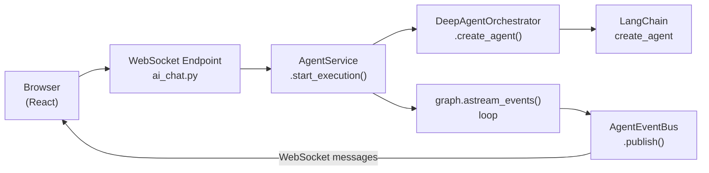

### Step-by-step

1. **WebSocket connects** at `ws://host/api/v1/ai/chat/stream?token=<JWT>`.
   - `ai_chat.py:chat_stream()` validates the JWT, checks RBAC for `ai-chat` permission.

2. **User sends a `WSChatRequest`** with `message`, `assistant_config_id`, `execution_mode`.

3. **Session is resolved or created** via `AIConfigService`. The session holds `project_id`, `branch_id`, and other temporal context.

4. **`AgentService.start_execution()`** is called:
   - Creates an `AgentEventBus` and registers it with the global `RunnerManager`.
   - Spawns an independent DB session.
   - Creates an `AIAgentExecution` row for tracking.
   - Calls `_run_agent_graph()`.

5. **`_run_agent_graph()`** orchestrates the agent:
   - Builds conversation history from DB messages.
   - Composes the system prompt (see Section 2).
   - Resolves LLM config (provider, model, API key) from the `AIAssistantConfig`.
   - Creates a `ToolContext` with user role, project scope, execution mode.
   - Calls `_create_deep_agent_graph()` which delegates to `DeepAgentOrchestrator.create_agent()`.
   - Runs `graph.astream_events()` and publishes events to the `AgentEventBus`.

6. **The WebSocket handler** subscribes to the event bus and forwards events to the browser.

---

## 2. System Prompt Composition

The system prompt is assembled in three layers. The final prompt depends on whether subagents are enabled.

### Layer 1: Base Prompt

The `AIAssistantConfig.system_prompt` from the database, or the hardcoded `DEFAULT_SYSTEM_PROMPT`:

```
You are a helpful AI assistant for the Backcast project budget management system.
...
```

### Layer 2: Project Context (added by `AgentService._build_system_prompt()`)

When a session is scoped to a project, a context section is appended:

```
You are operating in the context of a specific project (ID: {project_id}).
Use project-scoped tools to query data within this project.
Project scope is locked for this session - you cannot switch to other projects.
```

**Key security principle:** Temporal parameters (`as_of`, `branch_name`, `branch_mode`) are **never** placed in the prompt. They are enforced at the tool level via `ToolContext` and injected by `TemporalContextMiddleware`. This prevents prompt injection from bypassing temporal constraints.

### Layer 3: Subagent Delegation Instructions (when `enable_subagents=True`)

Two sections are appended by `DeepAgentOrchestrator._build_system_prompt_suffix()`:

1. **`TASK_SYSTEM_PROMPT`** — The "task" tool usage guide:
   ```
   ## `task` (subagent spawner)
   You have access to a `task` tool to launch short-lived subagents...
   When to use the task tool:
   - When a task is complex and multi-step...
   - When a task is independent of other tasks and can run in parallel...
   ```

2. **Subagent listing suffix** — Dynamic list of available subagents:
   ```
   IMPORTANT: You do NOT have direct access to Backcast tools.
   ALL Backcast operations must be delegated to specialized subagents:

   Available Subagents:
   - project_manager: get_temporal_context, list_projects, get_project...
   - evm_analyst: get_temporal_context, calculate_evm_metrics...
   - change_order_manager: get_temporal_context, list_change_orders...
   - user_admin: get_temporal_context, list_users, get_user...
   - visualization_specialist: get_temporal_context, generate_mermaid_diagram
   - forecast_manager: get_temporal_context, get_forecast...

   Do NOT attempt to use Backcast tools directly - they will not work.
   Always delegate via the task tool.
   ```

### Final Prompt Structure (Subagents Enabled)

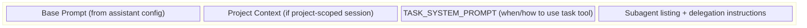

### Final Prompt Structure (Subagents Disabled)

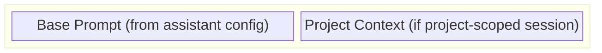

---

## 3. Tool Registry & Filtering

### Tool Creation

All tools are created via `create_project_tools(tool_context)` in `tools/__init__.py`. This function:

1. Collects tools from 8 template packages (CRUD, analysis, change order, cost element, user management, advanced analysis, diagram, forecast).
2. Each tool is decorated with `@ai_tool` which attaches metadata: name, description, risk level (`LOW`, `HIGH`, `CRITICAL`).
3. Results are cached as a singleton — tools are created once per `ToolContext`.

### Filtering Chain

Tools go through three filtering stages before reaching the LLM:

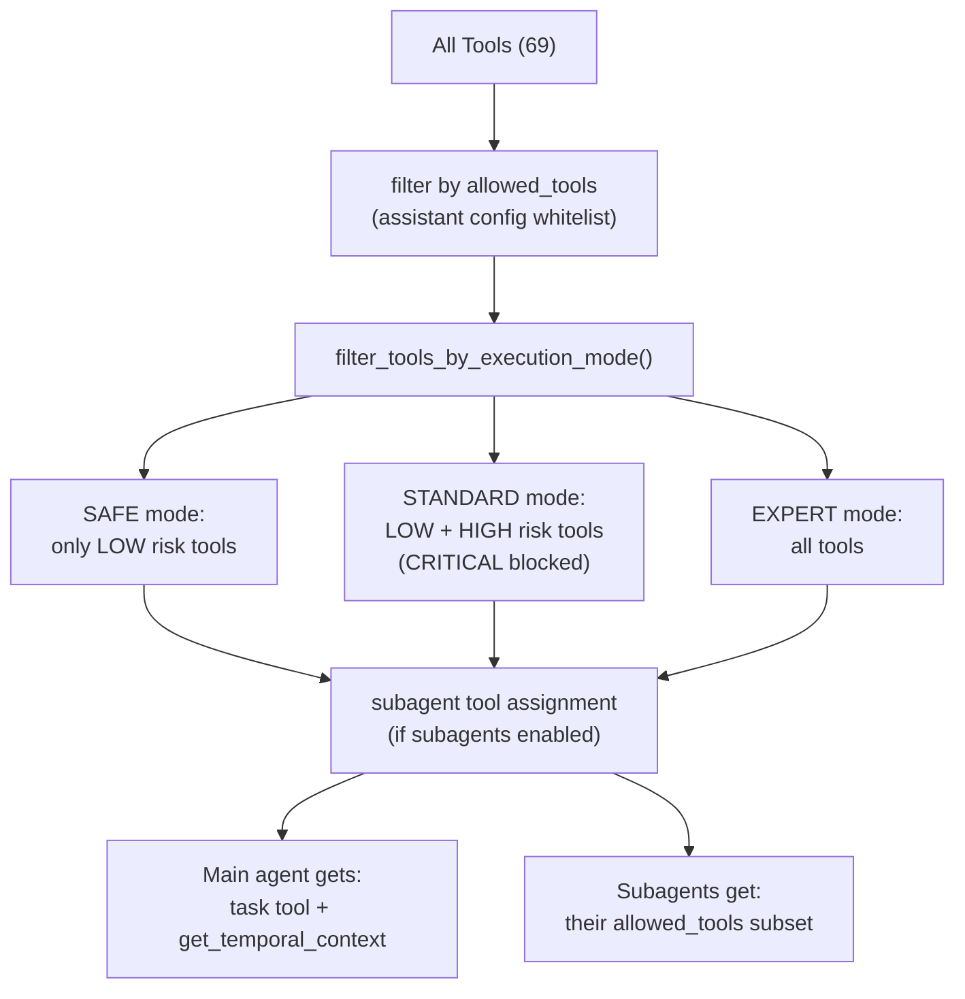

### Risk Levels

| Risk Level | Examples | SAFE | STANDARD | EXPERT |
|-----------|----------|------|----------|--------|
| LOW | `list_projects`, `get_project`, `calculate_evm_metrics` | Allowed | Allowed | Allowed |
| HIGH | `create_project`, `update_cost_element`, `approve_change_order` | Blocked | Allowed (requires approval) | Allowed |
| CRITICAL | `delete_project`, bulk operations | Blocked | Blocked | Allowed |

---

## 4. Subagent Architecture

Six specialized subagents, each mapped to a domain:

| Subagent | Domain | Tool Count | Structured Output |
|----------|--------|------------|-------------------|
| `project_manager` | Projects, WBEs, cost elements, cost tracking, progress entries | 29 | None |
| `evm_analyst` | EVM metrics (CPI, SPI, CV, SV, EAC) and health analysis | 9 | `EVMMetricsRead` |
| `change_order_manager` | Change order CRUD, approval workflows, impact analysis | 9 | `ImpactAnalysisResponse` |
| `user_admin` | Users and departments CRUD | 10 | None |
| `visualization_specialist` | Mermaid diagram generation | 1 | None |
| `forecast_manager` | Forecasts, schedule baselines, trend analysis | 11 | `ForecastRead` |

### Subagent Compilation

In `DeepAgentOrchestrator._build_subagent_dicts()`, each subagent is compiled into an independent LangChain agent:

1. Tool list filtered by `allowed_tools` from the subagent config AND the assistant's whitelist.
2. Middleware stack applied: `TemporalContextMiddleware` + `BackcastSecurityMiddleware` (but **not** `TodoListMiddleware` — only the main agent plans).
3. Compiled via `langchain_create_agent()` with the subagent's domain-specific system prompt.
4. Stored as a dict: `{name, description, runnable, structured_output_schema}`.

Each subagent runs with its own isolated context window — it sees only the task description provided by the main agent, not the full conversation history.

---

## 5. The Task Tool: How Delegation Works

The `task` tool is the main agent's **only** mechanism for performing Backcast operations when subagents are enabled.

### Definition

Built by `build_task_tool()` in `tools/subagent_task.py`. It's a `StructuredTool` with two parameters:

- `subagent_type` — Which subagent to invoke (e.g., `"evm_analyst"`).
- `description` — Detailed task instructions for the subagent.

### Invocation Flow

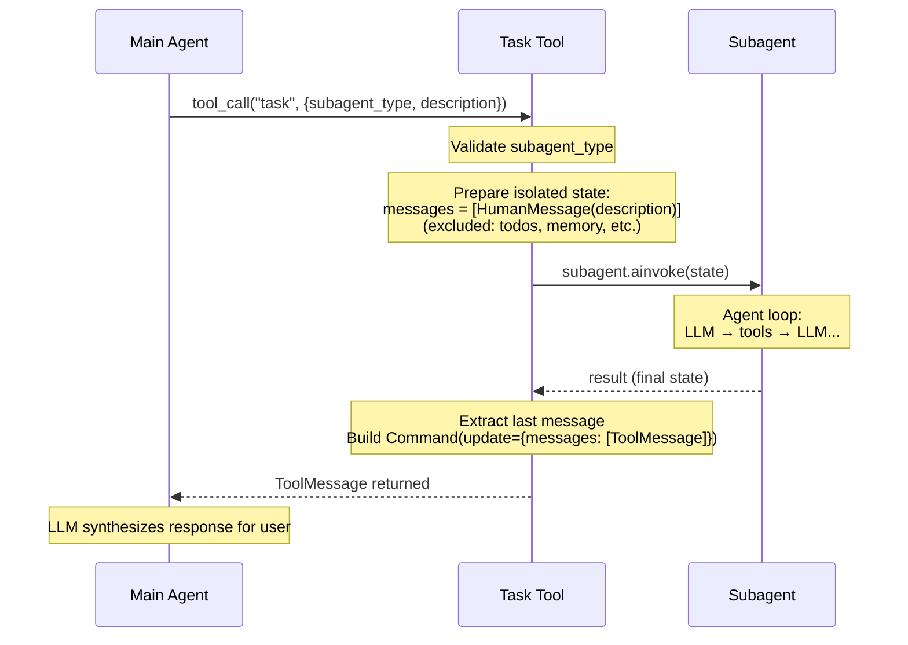

### Key Behaviors

- **State isolation**: The subagent receives only `messages = [HumanMessage(description)]` — no conversation history, no parent state.
- **Single return**: The subagent returns exactly one result via `Command(update={...})`. The main agent sees this as a `ToolMessage`.
- **Parallel execution**: The main agent can invoke multiple subagents in a single message (multiple `task` tool calls). They run concurrently.
- **Retry**: The async `atask()` retries transient HTTP errors (ReadError, ConnectError) up to 3 times with exponential backoff.
- **Structured output**: If the subagent has a `structured_output_schema`, the result is serialized and summarized by `_summarize_structured_output()`.

---

## 6. Inter-Agent Communication: Event Bus

### Architecture

```mermaid
flowchart TD
    RAG["_run_agent_graph()"]
    RAG -->|graph.astream_events()| AEB["AgentEventBus"]
    AEB -->|subscribe()| WSH["WebSocket handler"]
    WSH --> Browser["Browser"]
    AEB -->|publish(AgentEvent)| WSH
    AEB --> BL["bounded_log\n(1000 events)"]
    BL -->|replay()| LS["late subscriber\n(reconnection)"]
```

### Event Types

| Event | When Published | Frontend Effect |
|-------|---------------|-----------------|
| `thinking` | Agent starts processing | Shows spinner |
| `planning` | TodoListMiddleware generates steps | Shows step list |
| `subagent` | Main agent delegates to subagent | Shows "Delegating to X..." |
| `tool_call` | A tool starts executing | Shows tool name + args |
| `tool_result` | A tool finishes | Shows result summary |
| `subagent_result` | Subagent completes | Shows "X completed" |
| `token_batch` | Accumulated tokens flushed | Appends to streaming text |
| `content_reset` | Between subagent and main agent | Clears streaming area |
| `complete` | Execution finished | Finalizes response |
| `error` | Execution failed | Shows error |
| `execution_status` | Status change (running→error) | Updates UI state |

### Runner Manager

The global `RunnerManager` singleton maps `execution_id` → `AgentEventBus`. This allows:
- **WebSocket reconnection**: If the browser reconnects, it can subscribe to the same bus via `execution_id`.
- **REST polling**: The `GET /ai/chat/executions/{id}/status` endpoint reads from the bus.
- **Cleanup**: Buses are removed from the manager when execution completes.

---

## 7. Routing Decisions

### Main Agent: "Should I delegate or respond directly?"

The routing is driven entirely by the **system prompt** and **available tools**:

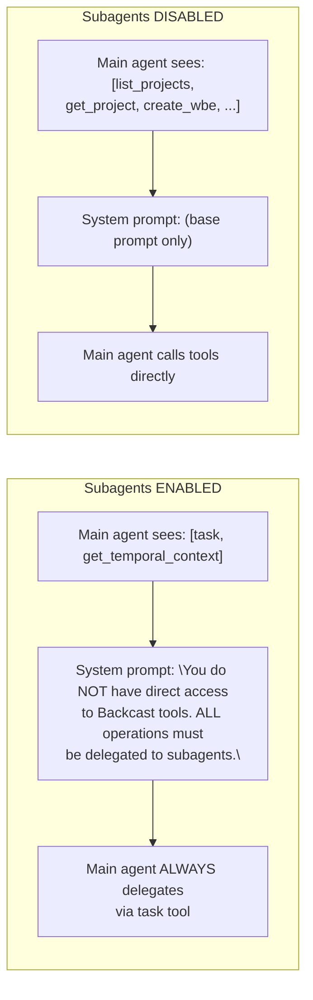

The LLM decides which subagent to use based on the `task` tool description, which lists all available subagents with their capabilities:

```
Available agent types and the tools they have access to:
- project_manager: Specialist for project, WBE, cost element...
- evm_analyst: Specialist for earned value management...
- change_order_manager: Specialist for change order management...
- user_admin: Specialist for user and department management...
- visualization_specialist: Specialist for generating diagrams...
- forecast_manager: Specialist for forecasting and schedule baselines...
```

### Main Agent: "Should I call one or multiple subagents?"

The `TASK_SYSTEM_PROMPT` instructs the agent:

> When a user request spans multiple domains, launch ALL relevant subagents in parallel.

Examples from the prompt:
- "What's the performance of project X?" → `project_manager` + `evm_analyst` in parallel.
- "Analyze change order CO-001 impact" → `change_order_manager` + `forecast_manager` in parallel.
- "Show WBE hierarchy with cost breakdowns" → `project_manager` for both WBEs and costs.

### Subagent: "Should I call a tool or respond?"

Each subagent runs a standard LangGraph `StateGraph` with the routing function `should_continue()`:

```mermaid
flowchart TD
    AN["Agent Node\n(LLM call)"]
    AN --> HT{AIMessage has\ntool_calls?}
    HT -->|YES| CM{count < MAX (5)?}
    HT -->|NO| END1((END))
    CM -->|YES| TN["Tools Node\n(execute)"]
    CM -->|NO| END2((END))
    TN -->|"ToolMessage"| AN
```

- **Max iterations**: 5 tool calls per agent loop.
- **Tool result**: Routes back to agent node for further reasoning.

---

## 8. Security Middleware Stack

When subagents are enabled, both the main agent and each subagent receive the same middleware stack (applied in `DeepAgentOrchestrator.create_agent()`):

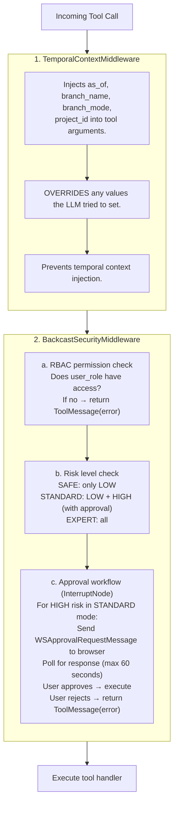

### Bypass Rules

- Tools NOT in the Backcast tool list (e.g., the `task` tool, `write_todos`) bypass the security middleware entirely.
- The `task` tool is allowed through because it's an orchestration tool — security is applied within the subagent it spawns.

### Context Variables

Both middleware classes use `ContextVar` to pass per-request context:
- `TemporalContextMiddleware` stores `ToolContext` in a context variable.
- `BackcastSecurityMiddleware` stores `InterruptNode` reference for approval handling.
- `set_request_context()` in `graph_cache.py` bridges the gap between cached graphs and per-request context.

---

## 9. Simulated Conversation Walkthrough

### Scenario: User asks "What's the EVM performance of project PRJ-001?"

#### Phase 1: Connection & Setup

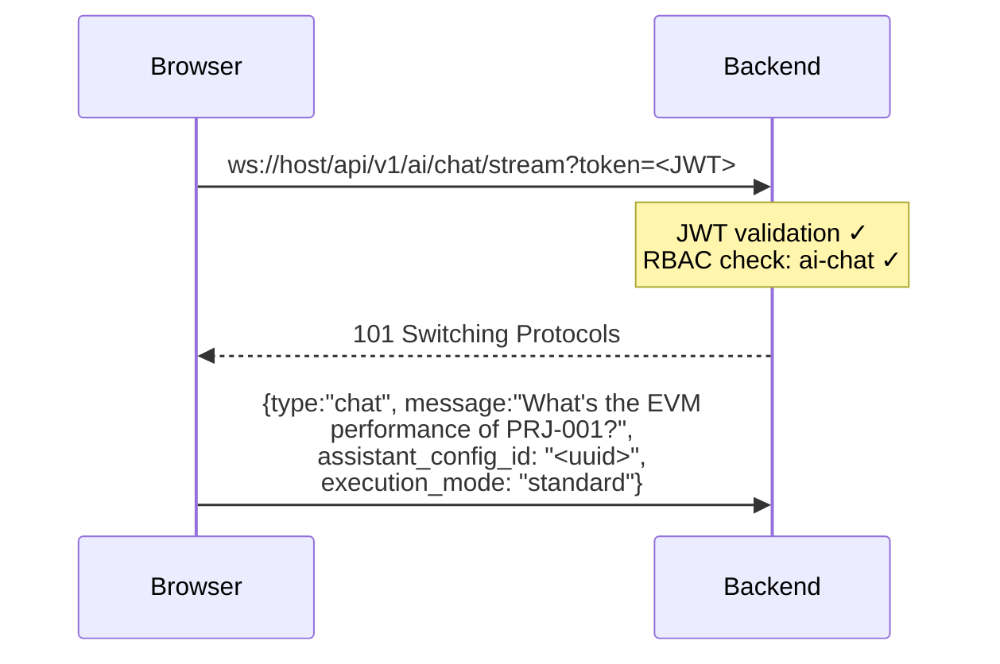

**What happens server-side:**

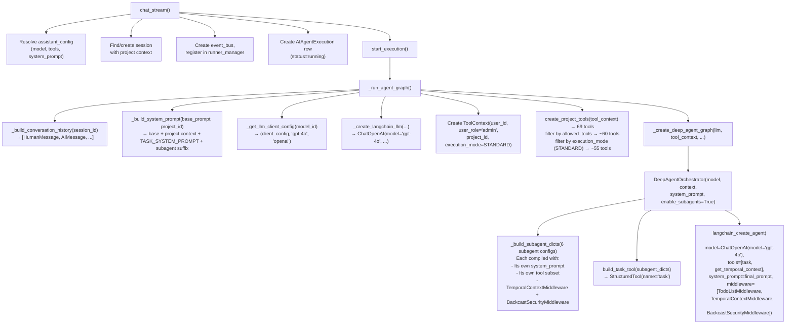

#### Phase 2: Agent Execution

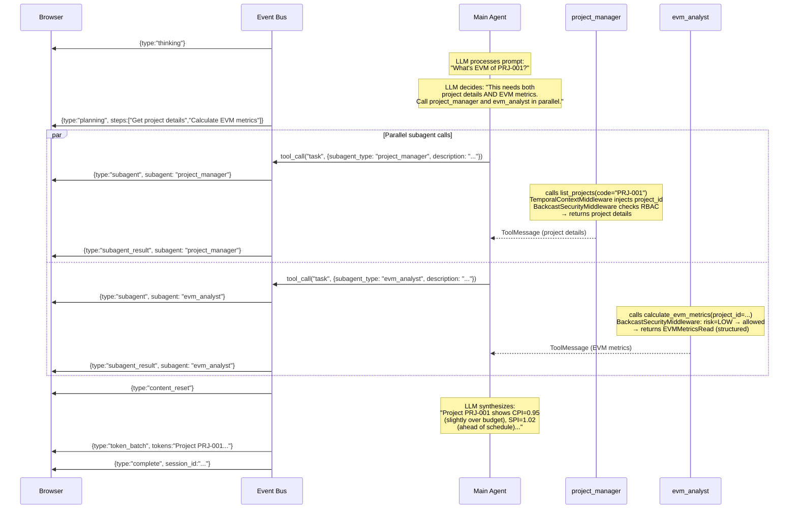

#### Phase 3: What the Agent "Saw"

The main agent's context window at the point of delegation:

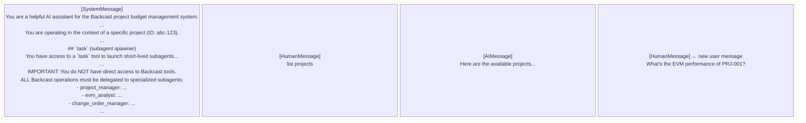

The main agent's **available tools**: `task`, `get_temporal_context`. It has no other tools.

The `project_manager` subagent's context window:

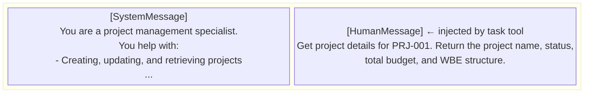

The `evm_analyst` subagent's context window:

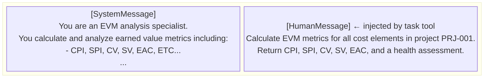

---

### Scenario: HIGH-Risk Tool with Approval

User: "Create a new WBE called 'Assembly' under project PRJ-001"

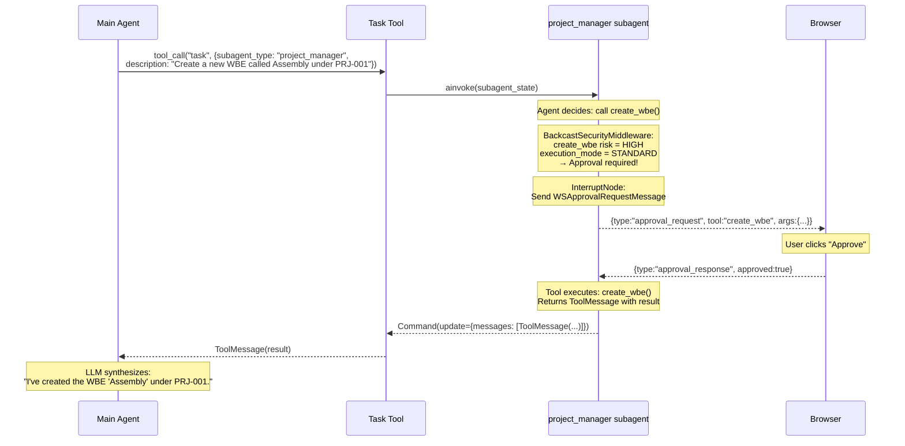

---

## Key Files Reference

| File | Responsibility |
|------|---------------|
| `api/routes/ai_chat.py` | WebSocket endpoint, JWT auth, session creation |
| `ai/agent_service.py` | Orchestration: `_run_agent_graph()`, `_build_system_prompt()`, `start_execution()` |
| `ai/deep_agent_orchestrator.py` | `DeepAgentOrchestrator`: subagent compilation, tool filtering, prompt composition |
| `ai/graph.py` | LangGraph `StateGraph` with `should_continue()` routing |
| `ai/subagents/__init__.py` | Six subagent configurations (name, prompt, allowed_tools) |
| `ai/tools/__init__.py` | `create_project_tools()`, `filter_tools_by_execution_mode()` |
| `ai/tools/subagent_task.py` | `build_task_tool()`, `TASK_SYSTEM_PROMPT`, `TASK_TOOL_DESCRIPTION` |
| `ai/middleware/temporal_context.py` | `TemporalContextMiddleware`: injects temporal params into tool args |
| `ai/middleware/backcast_security.py` | `BackcastSecurityMiddleware`: RBAC + risk checks + approval workflow |
| `ai/execution/agent_event_bus.py` | `AgentEventBus`: pub/sub with bounded log |
| `ai/execution/runner_manager.py` | `RunnerManager`: execution_id → event_bus registry |
| `ai/graph_cache.py` | `LLMClientCache`, `CompiledGraphCache`, `set_request_context()` |
