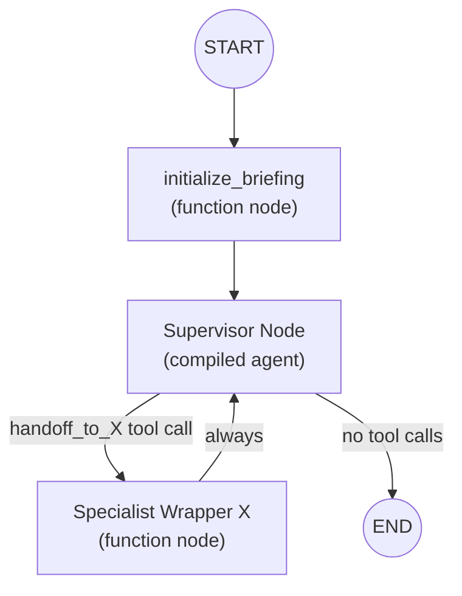
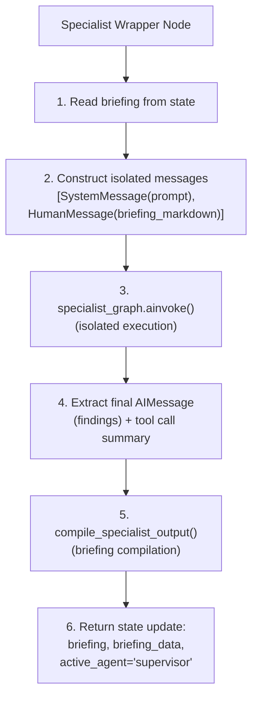
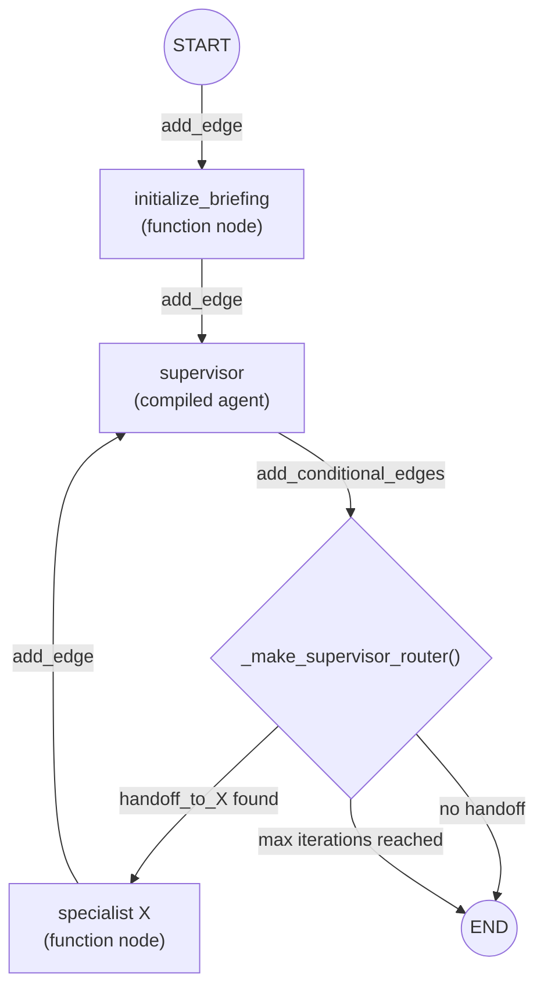
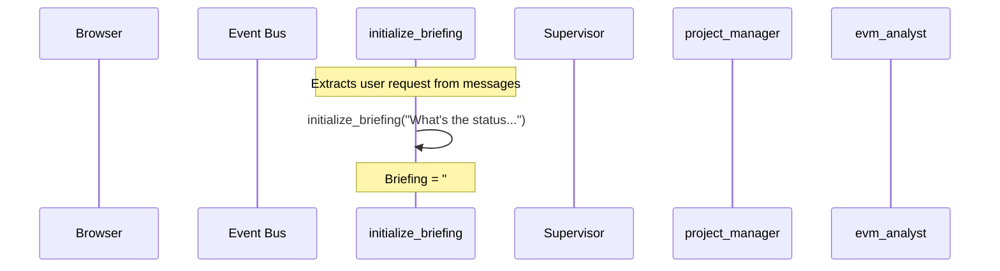
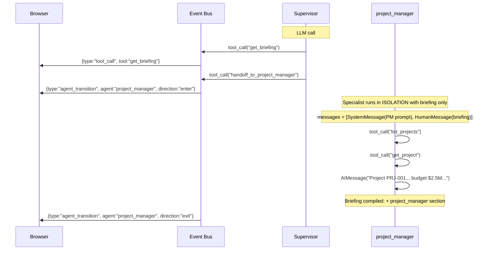
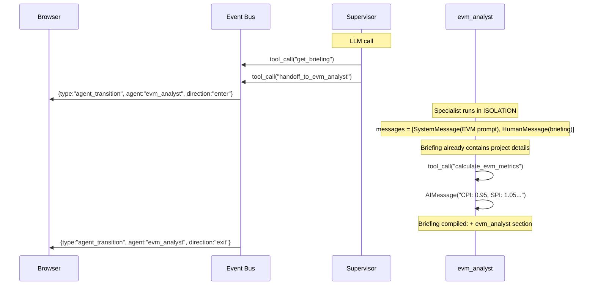
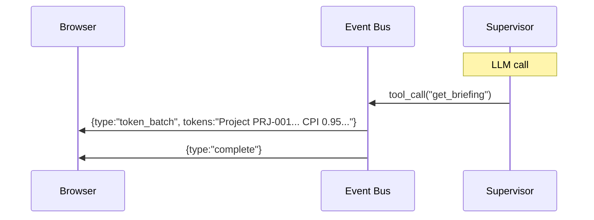

# Briefing Room Orchestrator: Compiled-Briefing Delegation

A handoff-based orchestration pattern where a supervisor agent routes user requests to specialist agents via handoff tools, but unlike the Supervisor Orchestrator, specialists do **not** share raw message history. Instead, each specialist reads from and writes to a compiled briefing document — a structured markdown artifact that accumulates findings across iterations.

> **Prerequisite:** This document assumes familiarity with [Agent System: Common Concepts](./agent-common-concepts.md).
>
> **Related Documentation:**
> - [Agent System: Common Concepts](./agent-common-concepts.md) — shared infrastructure, tools, middleware, event bus
> - [Supervisor Orchestrator](./supervisor-orchestrator.md) — handoff delegation with shared message history
> - [Deep Agent Orchestrator](./deep-agent-orchestrator.md) — task-based delegation with isolated subagents

---

## Table of Contents

1. [Architecture Overview](#1-architecture-overview)
2. [Key Files](#2-key-files)
3. [State Schema](#3-state-schema)
4. [Briefing Document Model](#4-briefing-document-model)
5. [Briefing Compilation](#5-briefing-compilation)
6. [Supervisor Tools](#6-supervisor-tools)
7. [Specialist Wrapper Nodes](#7-specialist-wrapper-nodes)
8. [Graph Wiring](#8-graph-wiring)
9. [Routing Decisions](#9-routing-decisions)
10. [Walkthrough: Project Health Check](#10-walkthrough-project-health-check)
11. [Comparison with Supervisor Orchestrator](#11-comparison-with-supervisor-orchestrator)
12. [Key Files Reference](#12-key-files-reference)

---

## 1. Architecture Overview

### BriefingRoomOrchestrator

```python
class BriefingRoomOrchestrator:
    def __init__(
        self,
        model: str | BaseChatModel,
        context: ToolContext,
        system_prompt: str | None = None,
        enable_subagents: bool = True,
        interrupt_node: Any = None,
    ) -> None:
```

The briefing room orchestrator builds a parent `StateGraph` where the supervisor routes to specialist agents via handoff tools. Unlike the Supervisor Orchestrator, specialists are **function nodes** (not subgraph nodes) that run in isolation with a compiled briefing document as their only context.

### Invocation Path

The briefing room is invoked via `DeepAgentOrchestrator.create_agent()` when `config.use_briefing_room=True` (controlled by `settings.AI_ORCHESTRATOR="briefing_room"`):

```python
# In DeepAgentOrchestrator.create_agent()
if config.use_briefing_room:
    briefing_room = BriefingRoomOrchestrator(...)
    return briefing_room.create_briefing_room_graph(config)
```

### Architecture Diagram



The key architectural difference from the Supervisor Orchestrator: specialist nodes are **function nodes** that invoke compiled specialist graphs internally via `ainvoke()`. Specialists never see each other's raw messages — only the compiled briefing.

---

## 2. Key Files

| File | Responsibility |
|------|---------------|
| `ai/briefing_room_orchestrator.py` | `BriefingRoomOrchestrator`: briefing-based agent delegation with compiled context |
| `ai/briefing_state.py` | `BriefingRoomState`: state schema with `briefing` + `briefing_data` fields |
| `ai/briefing.py` | `BriefingDocument`, `BriefingSection`: Pydantic models for the briefing artifact |
| `ai/briefing_compiler.py` | `initialize_briefing()`, `compile_specialist_output()`: briefing compilation logic |
| `ai/briefing_specialist.py` | `create_briefing_specialist_node()`: wrapper node factory for isolated specialist execution |
| `ai/handoff_tools.py` | Shared with Supervisor Orchestrator — `create_all_handoff_tools()` |

---

## 3. State Schema

### BriefingRoomState

```python
class BriefingRoomState(TypedDict):
    messages: Annotated[list[BaseMessage], operator.add]  # user msg + supervisor response only
    briefing: str                          # compiled markdown briefing
    briefing_data: dict[str, Any]          # serialized BriefingDocument
    active_agent: str                      # currently active specialist
    tool_call_count: Annotated[int, operator.add]
    max_tool_iterations: int
    supervisor_iterations: Annotated[int, operator.add]  # incremented per specialist cycle
    max_supervisor_iterations: int                       # hard cap (default 5)
```

**Key differences from `BackcastSupervisorState`:**

| Field | Supervisor Orchestrator | Briefing Room |
|-------|------------------------|---------------|
| `messages` | Full conversation (shared with specialists) | User msg + supervisor response only |
| Knowledge carrier | `messages` (raw, ~3000-8000 tokens) | `briefing` (compiled, ~300-700 tokens) |
| Specialist isolation | None — shared state | Full — specialists see only briefing |
| Loop prevention | None | `supervisor_iterations` + `max_supervisor_iterations` |

The `briefing` field is the compiled markdown string. The `briefing_data` field is the serialized `BriefingDocument` dict for programmatic access. Together they replace raw message history as the knowledge carrier.

---

## 4. Briefing Document Model

### BriefingSection

```python
class BriefingSection(BaseModel):
    specialist_name: str
    task_description: str
    findings: str                              # distilled markdown
    timestamp: datetime                        # auto-set to UTC now
    tool_calls_summary: list[str]              # ["list_projects()", "get_evm_metrics()"]
    structured_data: dict[str, Any] | None     # serialized Pydantic (EVMMetricsRead, etc.)
```

### BriefingDocument

```python
class BriefingDocument(BaseModel):
    original_request: str
    sections: list[BriefingSection] = []
    metadata: dict[str, Any] = {}              # project_id, branch_name, etc.
    iteration: int = 0

    def add_section(self, section: BriefingSection) -> None: ...
    def to_markdown(self) -> str: ...
```

### Markdown Output

The `to_markdown()` method produces zero-cost string compilation (no LLM call):

```markdown
# Briefing Document

## Request
What's the status of PRJ-001?

## Scope
- project_id: PRJ-001

## Specialist Findings

### project_manager (Iteration 1)
Task: Get project info
Tools used: list_projects(), get_project()

Project PRJ-001 is 45% complete with a $2.5M budget.

---

### evm_analyst (Iteration 2)
Task: Calculate EVM metrics
Tools used: calculate_evm_metrics()

CPI: 0.95 (over budget), SPI: 1.05 (ahead of schedule), EAC: $2.63M

---
```

---

## 5. Briefing Compilation

### initialize_briefing()

```python
def initialize_briefing(
    user_request: str,
    metadata: dict[str, Any] | None = None,
) -> tuple[str, dict[str, Any]]:
```

Creates the initial briefing from the user's request. Called by the `initialize_briefing_node` function node at graph start. Returns `(markdown_string, serialized_dict)`.

### compile_specialist_output()

```python
def compile_specialist_output(
    briefing_data: dict[str, Any],
    specialist_name: str,
    task_description: str,
    specialist_output: str,
    tool_calls_summary: list[str],
    structured_data: dict[str, Any] | None = None,
) -> tuple[str, dict[str, Any]]:
```

After each specialist completes, this function:
1. Reconstructs the `BriefingDocument` from `briefing_data`
2. Creates a `BriefingSection` with the specialist's findings
3. Appends the section and increments the iteration counter
4. Re-serializes to markdown and dict

Pure string manipulation — zero LLM cost, ~0ms latency.

---

## 6. Supervisor Tools

The briefing room supervisor has three categories of tools:

### get_briefing

```python
@tool("get_briefing", description="Get the current compiled briefing document...")
def get_briefing(
    state: Annotated[dict[str, Any], InjectedState()],
) -> str:
    return state.get("briefing", "No briefing available yet.")
```

Reads the current briefing markdown from parent state via `InjectedState`. The supervisor calls this to review compiled findings before deciding next steps.

### Handoff Tools

Reuses `create_all_handoff_tools()` from the Supervisor Orchestrator. The same `Command(goto=..., graph=Command.PARENT)` mechanism routes from the supervisor subgraph to specialist nodes in the parent graph.

### get_temporal_context

Same temporal context tool as other orchestrators (LOW risk, read-only).

### Notable Absence: task tool

The briefing room does **not** include the `task` tool. All delegation is via handoff to ensure every specialist contributes to the shared briefing.

---

## 7. Specialist Wrapper Nodes

The most novel component. Each specialist is wrapped in a function node created by `create_briefing_specialist_node()`:

```python
def create_briefing_specialist_node(
    specialist_name: str,
    specialist_graph: Any,         # compiled graph from compile_subagents()
    specialist_system_prompt: str,
) -> Callable[[BriefingRoomState], Awaitable[dict[str, Any]]]:
```

### Execution Flow



### Key Design Decisions

**Why `ainvoke()` instead of subgraph nodes?**

Subgraph nodes in LangGraph share the parent state (including `messages`). To prevent specialists from seeing raw messages, the wrapper invokes the specialist graph via `ainvoke()` with an isolated message list. This trades per-specialist token streaming (not available with `ainvoke`) for clean context isolation.

The user sees:
- `agent_transition(enter)` event when the specialist starts
- `agent_transition(exit)` event when the specialist finishes
- No intermediate tool calls or token batches (specialist works in isolation)

### State Update

Each specialist wrapper returns:

```python
{
    "briefing": updated_briefing,        # compiled markdown with new section
    "briefing_data": updated_data,       # serialized BriefingDocument
    "active_agent": "supervisor",        # always routes back to supervisor
    "tool_call_count": result_count,     # accumulated from specialist execution
    "supervisor_iterations": 1,          # incremented per specialist cycle
}
```

---

## 8. Graph Wiring

### Parent StateGraph Structure



### Edge Layout

```python
# Fixed path: START → initialize_briefing → supervisor
parent.add_edge(START, "initialize_briefing")
parent.add_edge("initialize_briefing", "supervisor")

# Supervisor: conditional → specialist or END
parent.add_conditional_edges(
    "supervisor",
    _make_supervisor_router(specialist_names),
    specialist_names + [END],
)

# Each specialist: always returns to supervisor
for name in specialist_names:
    parent.add_edge(name, "supervisor")
```

### initialize_briefing_node

A function node that:
1. Extracts the last `HumanMessage` from state (the user's request)
2. Calls `initialize_briefing(user_request, {"project_id": context.project_id})`
3. Returns `{briefing, briefing_data, supervisor_iterations: 0, max_supervisor_iterations: 5}`

### Fallback

If no specialists compile successfully, `_build_fallback_graph()` creates a simple agent with direct tool access — identical to the Supervisor Orchestrator's fallback pattern.

---

## 9. Routing Decisions

### _make_supervisor_router()

After the supervisor produces output, checks three conditions:

1. **Max iterations reached**: If `supervisor_iterations >= max_supervisor_iterations` (default 5), force `END` to prevent infinite handoff loops.
2. **Handoff tool found**: If the last `AIMessage` contains a `handoff_to_{name}` tool call → route to that specialist.
3. **No handoff**: Supervisor produced a text response → `END`.

### Loop Prevention

The `supervisor_iterations` counter increments by 1 each time a specialist completes (via `operator.add` in the state update). Combined with `max_supervisor_iterations`, this prevents the supervisor from endlessly handing off between specialists.

### No Peer Handoffs

Unlike the Supervisor Orchestrator, specialists in the briefing room **cannot** hand off to other specialists directly. They always return to the supervisor, which reads the updated briefing and decides the next action. This simplifies the graph and ensures every specialist contribution passes through the compilation step.

---

## 10. Walkthrough: Project Health Check

**User:** "What's the status and EVM performance of project PRJ-001?"

### Phase 1: Briefing Initialization



### Phase 2: Supervisor Routes to project_manager



### Phase 3: Supervisor Routes to evm_analyst



### Phase 4: Supervisor Synthesizes



### What Each LLM Call Received

**Supervisor — LLM Call #1** (initial routing):

```
┌─ LLM API Call #1 — Supervisor ──────────────────────────────────────────┐
│                                                                          │
│  system:   [SystemMessage] BRIEFING_ROOM_SUPERVISOR_PROMPT              │
│            + _BRIEFING_HANDOFF_SUFFIX                                    │
│                                                                          │
│  messages: [HumanMessage] "What's the status and EVM performance..."    │
│                                                                          │
│  tools:    [get_briefing, handoff_to_project_manager,                   │
│             handoff_to_evm_analyst, ..., get_temporal_context]           │
│                                                                          │
│  output:   AIMessage(tool_calls=[{name: "get_briefing", ...}])          │
│            → reads initial briefing                                      │
│            → then: AIMessage(tool_calls=[{name: "handoff_to_..."}])     │
└──────────────────────────────────────────────────────────────────────────┘
```

**project_manager — Specialist Wrapper** (isolated execution):

```
┌─ Specialist Isolated Context ────────────────────────────────────────────┐
│                                                                          │
│  system:   [SystemMessage] "You are a project management specialist..." │
│                                                                          │
│  messages: [HumanMessage] "## Briefing\n\n# Briefing Document\n        │
│             ## Request\nWhat's the status...\n"                          │
│             (~300 tokens of compiled briefing)                           │
│                                                                          │
│  tools:    [list_projects, get_project, list_wbes, ...]  ← 37           │
│                                                                          │
│  output:   AIMessage("Project PRJ-001 is 45% complete, budget $2.5M")  │
└──────────────────────────────────────────────────────────────────────────┘
```

**evm_analyst — Specialist Wrapper** (sees updated briefing):

```
┌─ Specialist Isolated Context ────────────────────────────────────────────┐
│                                                                          │
│  system:   [SystemMessage] "You are an EVM analysis specialist..."      │
│                                                                          │
│  messages: [HumanMessage] "## Briefing\n\n# Briefing Document\n        │
│             ## Request\nWhat's the status...\n                           │
│             ## Specialist Findings\n                                     │
│             ### project_manager (Iteration 1)\n                          │
│             Project PRJ-001 is 45% complete...\n"                        │
│             (~500 tokens — previous findings included)                   │
│                                                                          │
│  → evm_analyst already knows project details from briefing              │
│  → Does NOT re-fetch project data                                        │
│  → Directly calculates EVM metrics                                       │
└──────────────────────────────────────────────────────────────────────────┘
```

### Briefing State After Execution

```
┌─ BriefingRoomState (after walkthrough) ──────────────────────────────────┐
│                                                                           │
│  briefing: "# Briefing Document\n## Request\nWhat's the status...\n      │
│            ## Specialist Findings\n                                       │
│            ### project_manager (Iteration 1)\n...                        │
│            ### evm_analyst (Iteration 2)\n..."  (~700 tokens)            │
│                                                                           │
│  briefing_data: {original_request: "...", sections: [...],               │
│                  iteration: 2, metadata: {project_id: "PRJ-001"}}       │
│                                                                           │
│  messages: [HumanMessage("What's the status..."),                        │
│             AIMessage("Here's the overview for PRJ-001...")]             │
│             (only user msg + supervisor response)                         │
│                                                                           │
│  active_agent: "supervisor"                                               │
│  tool_call_count: 5  (list_projects, get_project, calculate_evm, ...)   │
│  supervisor_iterations: 2                                                 │
│  max_supervisor_iterations: 5                                             │
└───────────────────────────────────────────────────────────────────────────┘
```

---

## 11. Comparison with Supervisor Orchestrator

### When to Use Each

| Use Case | Recommended | Why |
|----------|------------|-----|
| Single-turn queries, 2-3 specialists | Supervisor Orchestrator | Simpler, adequate context size |
| Multi-turn conversations (3+ turns) | Briefing Room | Briefing compression prevents exponential growth |
| Complex cross-domain analysis | Briefing Room | Structured briefing aids synthesis |
| Debugging specialist behavior | Supervisor Orchestrator | Full message transcript available |
| Token-constrained deployments | Briefing Room | 5-10x context reduction |

### Technical Comparison

| Aspect | Supervisor Orchestrator | Briefing Room |
|--------|------------------------|---------------|
| Knowledge sharing | Full message transcript | Compiled briefing document |
| Context per specialist | ~3000-5000 tokens | ~300-700 tokens |
| Specialist execution | Subgraph nodes (shared state) | Function nodes (isolated) |
| Peer handoffs | Supported | Not supported (always via supervisor) |
| Multi-turn growth | Linear (~2x per turn) | Capped (briefing compresses) |
| Per-specialist token streaming | Yes (live tool calls) | No (specialist runs in isolation) |
| Loop prevention | None | `max_supervisor_iterations` cap |
| Debuggability | High (full transcript) | Medium (briefing + events) |
| Task tool | Available | Not available |

---

## 12. Key Files Reference

| File | Responsibility |
|------|---------------|
| `ai/briefing_room_orchestrator.py` | `BriefingRoomOrchestrator`: briefing-based agent delegation |
| `ai/briefing_state.py` | `BriefingRoomState`: state schema with `briefing` + `briefing_data` |
| `ai/briefing.py` | `BriefingDocument`, `BriefingSection`: Pydantic models for the briefing artifact |
| `ai/briefing_compiler.py` | `initialize_briefing()`, `compile_specialist_output()`: zero-cost compilation |
| `ai/briefing_specialist.py` | `create_briefing_specialist_node()`: isolated specialist wrapper factory |
| `ai/handoff_tools.py` | Shared with Supervisor Orchestrator — `create_all_handoff_tools()` |
| `ai/config.py` | `AgentConfig` dataclass with `use_briefing_room` field |
| `ai/subagents/__init__.py` | Seven subagent configurations (shared across all orchestrators) |
