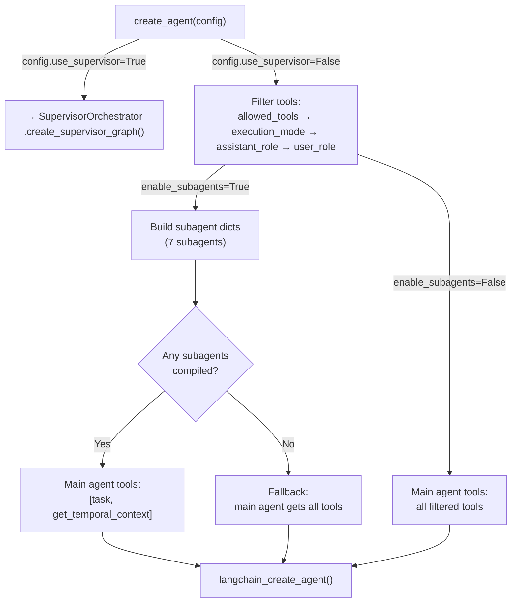
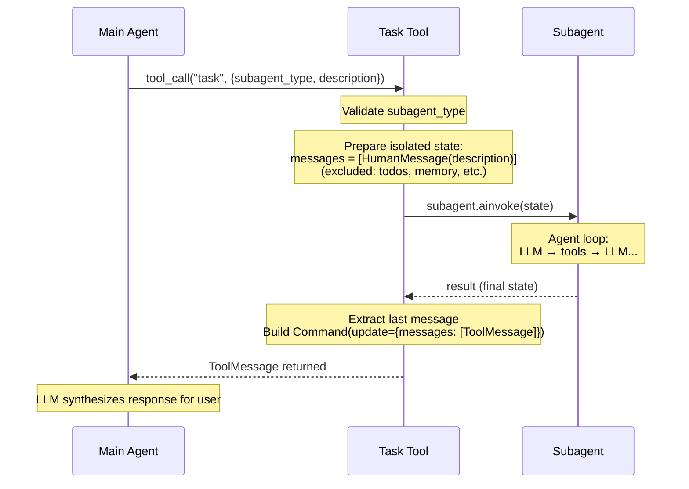
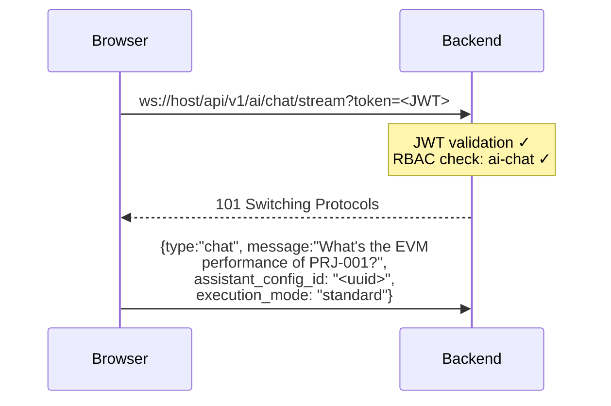
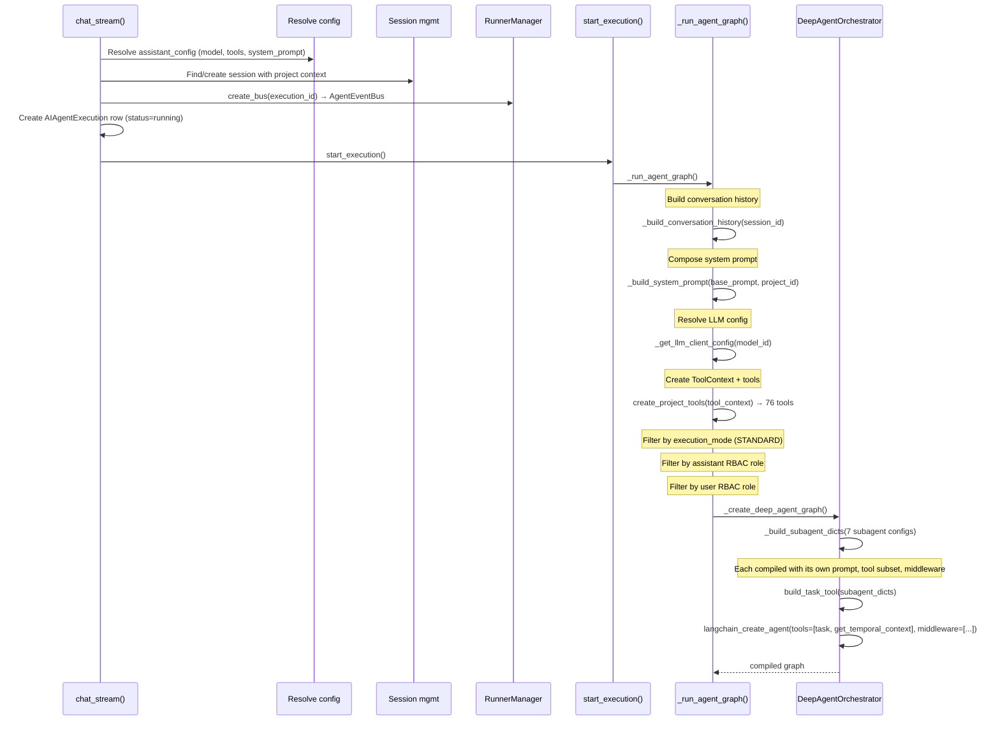
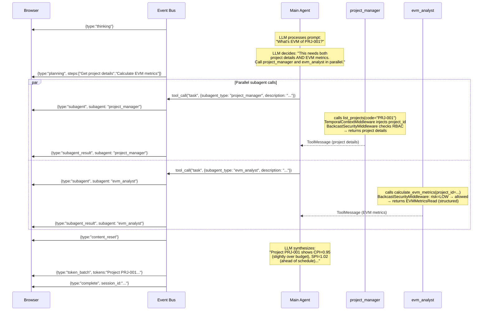
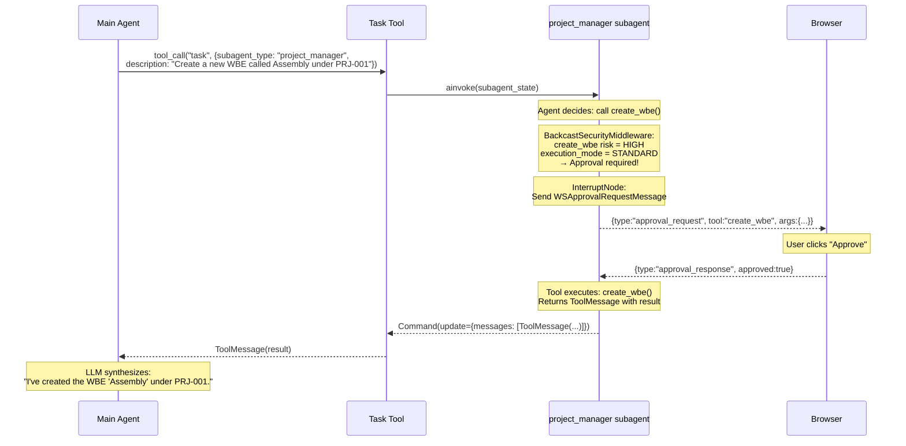

# Deep Agent Orchestrator: Task-Based Delegation

The task-based orchestration pattern where a main agent delegates Backcast operations to isolated subagents via a `task` tool. Each subagent runs in its own context window with no access to the parent conversation.

> **Prerequisite:** This document assumes familiarity with [Agent System: Common Concepts](./agent-common-concepts.md).
>
> **Related Documentation:**
> - [Agent System: Common Concepts](./agent-common-concepts.md) — shared infrastructure, tools, middleware, event bus
> - [Supervisor Orchestrator](./supervisor-orchestrator.md) — handoff-based delegation with shared state

---

## Table of Contents

1. [Architecture Overview](#1-architecture-overview)
2. [System Prompt (Deep Agent)](#2-system-prompt-deep-agent)
3. [Subagent Compilation](#3-subagent-compilation)
4. [The Task Tool](#4-the-task-tool)
5. [Routing Decisions](#5-routing-decisions)
6. [Walkthrough: EVM Performance Query](#6-walkthrough-evm-performance-query)
7. [Walkthrough: HIGH-Risk Tool with Approval](#7-walkthrough-high-risk-tool-with-approval)
8. [Key Files Reference](#8-key-files-reference)

---

## 1. Architecture Overview

### DeepAgentOrchestrator

```python
class DeepAgentOrchestrator:
    def __init__(
        self,
        model: str | BaseChatModel,
        context: ToolContext,
        system_prompt: str | None = None,
        enable_subagents: bool = True,
        interrupt_node: Any = None,
    ) -> None:
```

The orchestrator wraps `langchain.agents.create_agent()` with Backcast-specific configuration: temporal context injection, RBAC security, and subagent delegation.

### create_agent() Flow



When `config.use_supervisor=True`, the orchestrator delegates entirely to `SupervisorOrchestrator`. See [Supervisor Orchestrator](./supervisor-orchestrator.md) for that pattern.

When subagents are disabled or no subagents compile after filtering, the main agent gets direct tool access instead of the `task` tool.

---

## 2. System Prompt (Deep Agent)

When subagents are enabled, two additional prompt sections are appended by `DeepAgentOrchestrator`:

### Layer 3a: TASK_SYSTEM_PROMPT

The "task" tool usage guide:

```
## `task` (subagent spawner)
You have access to a `task` tool to launch short-lived subagents...
When to use the task tool:
- When a task is complex and multi-step...
- When a task is independent of other tasks and can run in parallel...
```

### Layer 3b: Subagent Listing Suffix

A dynamic list generated by `_build_system_prompt_suffix()` from the compiled subagents:

```
IMPORTANT: You do NOT have direct access to Backcast tools.
ALL Backcast operations must be delegated to specialized subagents:

Available Subagents:
- project_manager: get_temporal_context, global_search, get_project_structure...
- evm_analyst: get_temporal_context, global_search, calculate_evm_metrics...
- change_order_manager: get_temporal_context, global_search, list_change_orders...
- user_admin: get_temporal_context, global_search, list_users...
- visualization_specialist: get_temporal_context, global_search, generate_mermaid_diagram
- forecast_manager: get_temporal_context, global_search, get_forecast...
- general_purpose: get_temporal_context, global_search, list_projects...

Do NOT attempt to use Backcast tools directly - they will not work.
Always delegate via the task tool.
```

Each subagent line shows the first 5 tools followed by `...` if there are more.

### Final Prompt Structure (Subagents Enabled)

```
┌─────────────────────────────────────────────────┐
│ Layer 1: Base Prompt (from assistant config)    │
├─────────────────────────────────────────────────┤
│ Layer 2: Project Context (if project-scoped)    │
├─────────────────────────────────────────────────┤
│ Layer 3a: TASK_SYSTEM_PROMPT (when/how to use)  │
├─────────────────────────────────────────────────┤
│ Layer 3b: Subagent listing + delegation rules   │
└─────────────────────────────────────────────────┘
```

### Final Prompt Structure (Subagents Disabled)

```
┌─────────────────────────────────────────────────┐
│ Layer 1: Base Prompt (from assistant config)    │
├─────────────────────────────────────────────────┤
│ Layer 2: Project Context (if project-scoped)    │
└─────────────────────────────────────────────────┘
```

---

## 3. Subagent Compilation

`_build_subagent_dicts()` compiles each subagent configuration into a runnable LangChain agent.

### Compilation Steps

For each subagent in the configuration list:

1. **Tool filtering** — Intersect the subagent's `allowed_tools` with the main agent's tool whitelist:
   - If `allowed_tools is None` (e.g., `general_purpose`): use all available tools (intersected with whitelist).
   - If `allowed_tools` is a list: intersect each tool name with the whitelist.
   - Skip subagents with zero tools after filtering.
2. **Middleware stack** — `TemporalContextMiddleware` + `BackcastSecurityMiddleware` (but **not** `TodoListMiddleware` — only the main agent plans).
3. **Compilation** — `langchain_create_agent()` with the subagent's domain-specific system prompt.
4. **Structured output** — If `structured_output_schema` is defined, it's passed as `response_format`.

### Compiled Subagent Dict

```python
{
    "name": "evm_analyst",
    "description": "Specialist for earned value management...",
    "runnable": <CompiledStateGraph>,
    "structured_output_schema": EVMMetricsRead,
    "tools": [calculate_evm_metrics, get_evm_performance_summary, ...],
}
```

Subagents are compiled **once** during agent creation and reused for both the prompt suffix and the task tool. No recompilation occurs.

---

## 4. The Task Tool

The `task` tool is the main agent's **only** mechanism for performing Backcast operations when subagents are enabled.

### Definition

Built by `build_task_tool()` in `tools/subagent_task.py`. It's a `StructuredTool` with two parameters:

- `subagent_type` — Which subagent to invoke (e.g., `"evm_analyst"`, `"general_purpose"`).
- `description` — Detailed task instructions for the subagent.

### Invocation Flow



### State Isolation

When the task tool spawns a subagent, it constructs a new state from the parent:

```python
_EXCLUDED_STATE_KEYS = frozenset({
    "messages",              # replaced with [HumanMessage(description)]
    "todos",                 # no reducer defined for subagent
    "structured_response",   # subagent has its own schema
    "skills_metadata",       # private state attr, would leak
    "memory_contents",       # private state attr, would leak
})
```

1. **Copy parent state** but exclude the keys above.
2. **Replace messages** with `[HumanMessage(content=description)]` where `description` is the main agent's task instruction.
3. **Reset** `tool_call_count` to 0 and `next` to `"agent"`.

```
Main Agent state                     Subagent state
┌────────────────────────┐          ┌────────────────────────┐
│ messages: [             │          │ messages: [             │
│   HumanMessage(...),    │  ──►    │   HumanMessage(desc)    │  ← replaced
│   AIMessage(...),       │          │ ]                       │
│   ToolMessage(...),     │          │ tool_call_count: 0      │  ← reset
│   ...                   │          │ next: "agent"           │  ← reset
│ ]                       │          └────────────────────────┘
│ tool_call_count: 3      │
│ next: "tools"           │          Subagent gets:
└────────────────────────┘          - Own system prompt (domain-specific)
                                    - Own tool list (domain-filtered)
                                    - Same BackcastRuntimeContext (via ContextVar)
                                    - Same middleware stack
```

### Parallel Execution

The main agent can invoke multiple subagents in a single message (multiple `task` tool calls). They run concurrently.

### Retry

The async `atask()` retries transient HTTP errors (`ReadError`, `ConnectError`, `ConnectTimeout`, `ReadTimeout`) up to 3 times with exponential backoff.

### Structured Output Summarization

If the subagent has a `structured_output_schema`, the result is serialized and summarized by `_summarize_structured_output()`. This function handles:

- **`EVMMetricsRead`** — EVM metrics with CPI/SPI status indicators (on track / behind).
- **`DashboardData`** — Project summaries and activity counts.
- **`ImpactAnalysisResponse`** — Change order impact with KPIs.
- **`ForecastRead`** — Forecast details with budget variance.
- **Fallback** — Generic JSON summary for unknown types.

---

## 5. Routing Decisions

### Main Agent: "Should I delegate or respond directly?"

The routing is driven entirely by the **system prompt** and **available tools**:

**Subagents ENABLED:**
1. Main agent sees: `[task, get_temporal_context]`
2. System prompt: "You do NOT have direct access to Backcast tools. ALL operations must be delegated to subagents."
3. Main agent **always** delegates via task tool.

**Subagents DISABLED:**
1. Main agent sees: `[list_projects, get_project, create_wbe, ...]`
2. System prompt: (base prompt only)
3. Main agent calls tools directly.

The LLM decides which subagent to use based on the `task` tool description, which lists all available subagents with their capabilities.

### Main Agent: "Should I call one or multiple subagents?"

The `TASK_SYSTEM_PROMPT` instructs the agent:

> When a user request spans multiple domains, launch ALL relevant subagents in parallel.

Examples from the prompt:
- "What's the performance of project X?" → `project_manager` + `evm_analyst` in parallel.
- "Analyze change order CO-001 impact" → `change_order_manager` + `forecast_manager` in parallel.
- "Show WBE hierarchy with cost breakdowns" → `project_manager` for both WBEs and costs.

### Subagent: "Should I call a tool or respond?"

Each subagent runs a standard LangGraph `StateGraph` with the routing function `should_continue()`:

```
Agent Node (LLM call)
    │
    ├── AIMessage has tool_calls?
    │       │
    │       ├── NO  → END
    │       │
    │       └── YES → tool_call_count < max_tool_iterations?
    │                       │
    │                       ├── YES → Tools Node (execute) → back to Agent Node
    │                       │
    │                       └── NO  → END
    │
    └── (no messages) → END
```

- **Max iterations**: Controlled by `max_tool_iterations` from state (default 25).
- **Tool result**: Routes back to agent node for further reasoning.

---

## 6. Walkthrough: EVM Performance Query

### Scenario: User asks "What's the EVM performance of project PRJ-001?"

#### Phase 1: Connection & Setup



**What happens server-side:**



#### Phase 2: Agent Execution



#### Phase 3: What the Agent "Saw"

The main agent's context window at the point of delegation:

```
┌─ Main Agent Context ──────────────────────────────────────────────────────┐
│ [SystemMessage]                                                           │
│   You are a helpful AI assistant for the Backcast project budget          │
│   management system.                                                      │
│   ...                                                                     │
│   You are operating in the context of a specific project (ID: abc-123).   │
│   ...                                                                     │
│   ## `task` (subagent spawner)                                            │
│   You have access to a `task` tool to launch short-lived subagents...     │
│   ...                                                                     │
│   IMPORTANT: You do NOT have direct access to Backcast tools.             │
│   ALL Backcast operations must be delegated to specialized subagents:     │
│   - project_manager: ...                                                  │
│   - evm_analyst: ...                                                      │
│   - general_purpose: ...                                                  │
│   ...                                                                     │
│                                                                           │
│ [HumanMessage] "What's the EVM performance of PRJ-001?"                  │
└───────────────────────────────────────────────────────────────────────────┘
```

The main agent's **available tools**: `task`, `get_temporal_context`. It has no other tools.

The `project_manager` subagent's context window:

```
┌─ project_manager Context ────────────────────────────────────────────────┐
│ [SystemMessage]                                                          │
│   You are a project management specialist.                               │
│   You help with:                                                         │
│   - Creating, updating, and retrieving projects                          │
│   ...                                                                    │
│                                                                          │
│ [HumanMessage] ← injected by task tool                                   │
│   Get project details for PRJ-001. Return the project name, status,      │
│   total budget, and WBE structure.                                       │
└──────────────────────────────────────────────────────────────────────────┘
```

The `evm_analyst` subagent's context window:

```
┌─ evm_analyst Context ───────────────────────────────────────────────────┐
│ [SystemMessage]                                                         │
│   You are an EVM analysis specialist.                                   │
│   You calculate and analyze earned value metrics including:             │
│   - CPI, SPI, CV, SV, EAC, ETC...                                      │
│   ...                                                                   │
│                                                                         │
│ [HumanMessage] ← injected by task tool                                  │
│   Calculate EVM metrics for all cost elements in project PRJ-001.       │
│   Return CPI, SPI, CV, SV, EAC, and a health assessment.               │
└─────────────────────────────────────────────────────────────────────────┘
```

---

## 7. Walkthrough: HIGH-Risk Tool with Approval

**User:** "Create a new WBE called 'Assembly' under project PRJ-001"



---

## 8. Key Files Reference

| File | Responsibility |
|------|---------------|
| `ai/deep_agent_orchestrator.py` | `DeepAgentOrchestrator`: subagent compilation, task-based delegation, prompt composition |
| `ai/tools/subagent_task.py` | `build_task_tool()`, `TASK_SYSTEM_PROMPT`, `TASK_TOOL_DESCRIPTION`, `_summarize_structured_output()` |
| `ai/state.py` | `AgentState` TypedDict for subagent state |
| `ai/subagents/__init__.py` | Seven subagent configurations |
| `ai/config.py` | `AgentConfig` dataclass with `use_supervisor` field |
