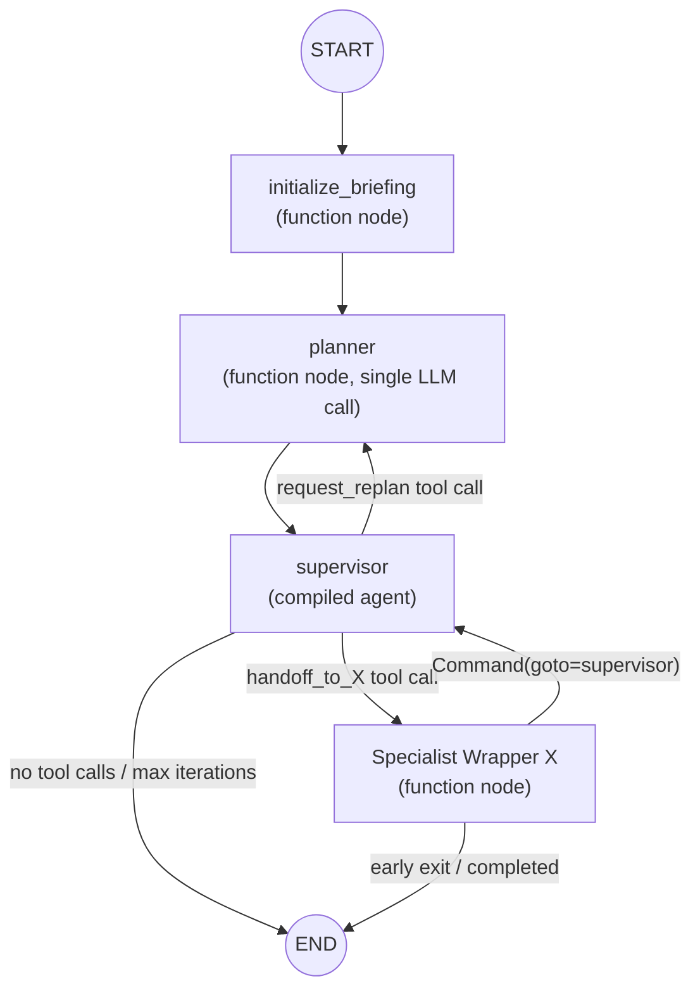
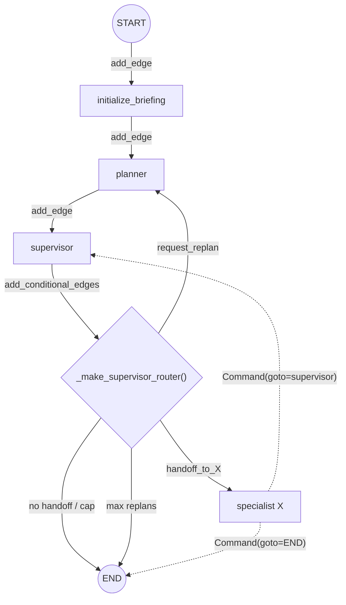
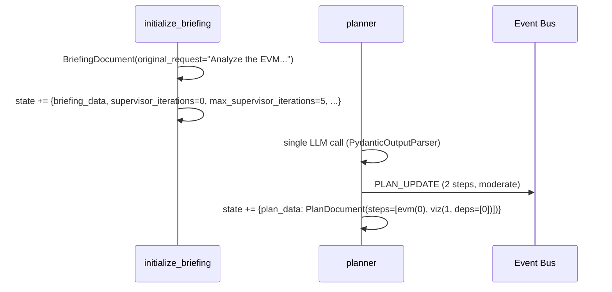
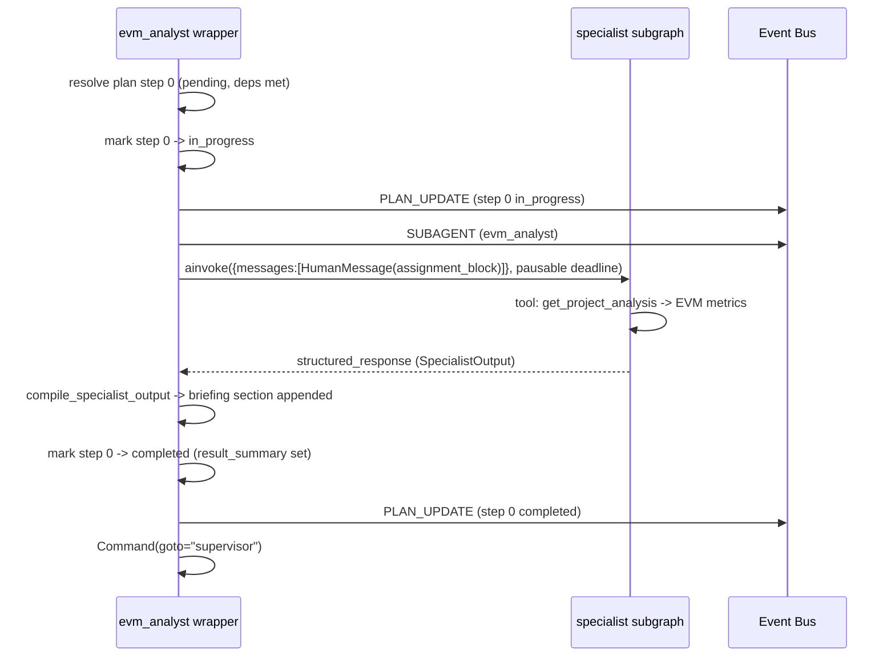

# Supervisor + Planner Orchestrator: Briefing-Based Delegation

A two-node orchestration pattern where a **planner** decomposes a request into ordered steps, then a **supervisor** agent delegates those steps to specialist agents via handoff tools. Specialists do NOT share message history -- instead, each receives a compiled briefing document as context and contributes findings back to the accumulating document. The briefing is the primary knowledge carrier between supervisor turns.

The supervisor also has **direct tool access** (e.g. `ask_user`, temporal context, search) configured via the main agent's `delegation_config.direct_tools`, so trivial operations skip delegation overhead.

> **Prerequisite:** This document assumes familiarity with [Agent System: Common Concepts](./agent-common-concepts.md).
>
> **Related Documentation:**
> - [Agent System: Common Concepts](./agent-common-concepts.md) -- shared infrastructure, tools, middleware, event bus
> - [`backend/app/ai/supervisor_orchestrator_DEV_GUIDE.md`](../../../backend/app/ai/supervisor_orchestrator_DEV_GUIDE.md) -- code-adjacent developer reference with line-level detail and improvement notes
>
> **Last Updated:** 2026-07-01

---

## Table of Contents

1. [Architecture Overview](#1-architecture-overview)
2. [Key Files](#2-key-files)
3. [State Schema](#3-state-schema)
4. [The Planner Node](#4-the-planner-node)
5. [The Supervisor Node and System Prompt](#5-the-supervisor-node-and-system-prompt)
6. [Handoff and Replan Tools](#6-handoff-and-replan-tools)
7. [Specialist Compilation and Wrapper Nodes](#7-specialist-compilation-and-wrapper-nodes)
8. [Graph Wiring](#8-graph-wiring)
9. [Routing and Re-dispatch](#9-routing-and-re-dispatch)
10. [Iteration Safety](#10-iteration-safety)
11. [Reducer Merge Arithmetic](#11-reducer-merge-arithmetic)
12. [Walkthrough: Multi-Step Plan Execution](#12-walkthrough-multi-step-plan-execution)
13. [Key Files Reference](#13-key-files-reference)

---

## 1. Architecture Overview

### SupervisorOrchestrator

```python
class SupervisorOrchestrator:
    def __init__(
        self,
        model: str | BaseChatModel,
        context: ToolContext,
        system_prompt: str | None = None,
        main_assistant_config: Any | None = None,
        specialist_models: dict[str, BaseChatModel] | None = None,
    ) -> None:
```

The orchestrator builds a parent `StateGraph` whose fixed prefix is `START -> initialize_briefing -> planner -> supervisor`. The supervisor then routes to specialist agents via handoff tools. Each specialist is a **function node** (a wrapper, not a subgraph node) that runs in isolation, receives the compiled briefing document (and plan-step context when applicable) as its only input, and contributes findings back into the accumulating `briefing_data`.

The `main_assistant_config` parameter carries the DB-loaded `AIAssistantConfig` row, which includes `delegation_config` (`direct_tools` + `allowed_specialists`), `planner_prompt`, `supervisor_prompt`, and `max_supervisor_iterations`. `specialist_models` optionally overrides the model per specialist.

### Invocation Path

The supervisor is the sole orchestrator. It is constructed from `agent_service.py` in a method still named `_create_deep_agent_graph` (a naming artifact -- the "deep agent" path was removed; the method name was not updated):

```python
# In agent_service.py:_create_deep_agent_graph
supervisor_orchestrator = SupervisorOrchestrator(
    model=llm,
    context=tool_context,
    system_prompt=system_prompt,
    main_assistant_config=assistant_config,
    specialist_models=params.specialist_models,
)
graph = await supervisor_orchestrator.create_supervisor_graph(agent_config)
```

### Architecture Diagram



The two nodes between START and supervisor are the key difference from a plain handoff supervisor:

- **`initialize_briefing`** seeds the `BriefingDocument` from the user request and resets the iteration/replan counters.
- **`planner`** makes a single LLM call to produce a `PlanDocument` (simple single-step, or multi-step with dependencies). The plan drives supervisor delegation order.

Specialist nodes are **function nodes** that invoke compiled specialist graphs internally via `ainvoke()` with isolated messages. Specialists never see each other's raw messages or the parent graph's message history -- only the compiled briefing (plus, in plan mode, a focused assignment block).

---

## 2. Key Files

| File | Responsibility |
|------|----------------|
| `ai/supervisor_orchestrator.py` | `SupervisorOrchestrator`: graph builder, supervisor node, specialist wrappers, router, fallback graph |
| `ai/supervisor_state.py` | `BackcastSupervisorState`: 14-field state schema with reducer annotations |
| `ai/planner.py` | `planner_node`: fresh-plan, resume, and replan paths; `_MAX_PLAN_STEPS` cap (5) |
| `ai/plan.py` | `PlanDocument`, `PlanStep`, `PlannerOutput`: structured plan models |
| `ai/briefing.py` | `BriefingDocument`, `BriefingSection`, `TaskAssignment`: Pydantic models for the briefing artifact |
| `ai/briefing_compiler.py` | `initialize_briefing()`, `parse_and_clean()`, `compile_specialist_output()` |
| `ai/handoff_tools.py` | `create_handoff_tool()`, `create_all_handoff_tools()`, `create_replan_tool()`, `_slugify()` |
| `ai/subagent_compiler.py` | `compile_subagents()`, `filter_tools_for_context()`, `build_backcast_middleware()` |

---

## 3. State Schema

### BackcastSupervisorState

Defined in `supervisor_state.py`. The state has **14 fields**. Each field with a reducer receives *deltas* that get merged into the parent state; fields without a reducer use last-writer-wins semantics.

| # | Field | Type / Reducer | Purpose |
|---|-------|----------------|---------|
| 1 | `messages` | `list[BaseMessage]` -- `operator.add` | Outer conversation only (user + supervisor). NOT shared with specialists. |
| 2 | `active_agent` | `str` -- last-writer-wins | Currently active specialist name (for event routing). |
| 3 | `tool_call_count` | `int` -- `operator.add` | Accumulated tool-call count across all agents. |
| 4 | `max_tool_iterations` | `int` -- last-writer-wins | Hard cap on tool calls per agent invocation (set by the caller). |
| 5 | `briefing_data` | `dict[str, Any]` -- last-writer-wins | Serialized `BriefingDocument` -- single source of truth. |
| 6 | `supervisor_iterations` | `int` -- `operator.add` | Completed supervisor->specialist cycles. |
| 7 | `max_supervisor_iterations` | `int` -- last-writer-wins | Hard cap on supervisor loops (default **5**; raised dynamically when a plan is active). |
| 8 | `completed_specialists` | `set[str]` -- `operator.or_` | Union-accumulated set of finished specialist names. |
| 9 | `plan_data` | `dict[str, Any]` -- last-writer-wins | Serialized `PlanDocument`; `None`/empty when no plan. |
| 10 | `completed_steps` | `set[int]` -- `operator.or_` | Indices of completed plan steps (union-accumulated). |
| 11 | `current_step_index` | `int` -- last-writer-wins | Zero-based index of the step being executed; `-1` when between steps / no plan. |
| 12 | `current_invocation_id` | `str` -- last-writer-wins | UUID for the current specialist invocation, set by the handoff tool so SUBAGENT/token_batch/AGENT_COMPLETE events share one ID. |
| 13 | `replan_count` | `int` -- last-writer-wins (NOT a reducer) | Replan cycles completed. Set explicitly by the replan tool (`current + 1`). Deliberately NOT a reducer to avoid spurious increments on every graph transition. |
| 14 | `max_replan_count` | `int` -- last-writer-wins | Hard cap on replans (default **2**). |
| (15) | `replan_context` | `str` -- last-writer-wins | Supervisor's reason string consumed by the planner on replan; cleared after the planner processes it. |

(Two design notes worth flagging: `completed_steps` uses `operator.or_` exactly like `completed_specialists`, so plan-step progress is set-unioned across cycles; and `replan_count` is intentionally a plain field, not a reducer -- a reducer would increment it on every transition that touches state, so the value is written explicitly by the replan tool.)

**Knowledge carrier:** the `messages` field carries only the outer conversation. The `briefing_data` dict is the single source of truth -- a serialized `BriefingDocument` that accumulates findings from all specialists. Markdown is rendered from `briefing_data` on demand via `BriefingDocument.from_state(data).to_markdown()` wherever needed (the `get_briefing` tool, specialist wrapper, event bus publishing).

---

## 4. The Planner Node

The planner is a function node (`planner_node_fn`) between `initialize_briefing` and `supervisor` that makes a single LLM call to produce a `PlanDocument`. It delegates to `planner_node()` in `planner.py`.

### Three Execution Paths (checked in order)

1. **Replan** -- When `replan_context` is non-empty AND a `plan_data` already exists, the planner revises the pending steps while preserving completed ones (uses `_REPLANNER_PROMPT_TEMPLATE` and `_merge_replanned_steps()`). Clears `replan_context` on return.
2. **Resume** -- When `plan_data` already exists with incomplete steps, returns it unchanged WITHOUT an LLM call (supports stop/resume).
3. **Fresh plan** -- Analyzes the user request from scratch.

### Planner Output

The planner uses `PydanticOutputParser(PlannerOutput)` (NOT `with_structured_output` / function calling) because `function_calling`/`tool_choice` conflicts with the DeepSeek thinking-mode monkey-patch and z.ai/GLM parsing. The LLM's raw output is recovered via `_extract_json()` (handles fenced blocks and reasoning prose before the JSON).

`_convert_planner_output()` validates specialist names against the catalog (unknown -> `general_purpose`) and truncates to `_MAX_PLAN_STEPS` (5). On any error (LLM call failure or parse failure), it falls back to a single-step `general_purpose` plan -- the graph never crashes here.

### PlanDocument Structure (`plan.py`)

```
PlanDocument
├── original_request: str
├── steps: list[PlanStep]
├── estimated_complexity: "simple" | "moderate" | "complex"
├── requires_planning: bool
└── specialist_catalog: list[dict] | None

PlanStep
├── step_index: int
├── specialist: str
├── task_description: str
├── dependencies: list[int]            # step indices that must complete first
├── input_from_dependencies: str | None
├── expected_output: str
├── status: "pending" | "in_progress" | "completed" | "failed" | "skipped"
└── result_summary: str | None
```

After producing the plan, the planner node emits a `PLAN_UPDATE` event so the frontend can render the plan rail. It returns `{"plan_data": plan.model_dump()}` (plus `"replan_context": ""` on the replan path).

---

## 5. The Supervisor Node and System Prompt

The supervisor is a **compiled agent** (created via `langchain_create_agent()`), not a plain function node. It has its own internal agent<->tools loop. Its middleware is `[ContextGuardMiddleware, PlanAwareToolMiddleware, ...base_middleware]` (see [Common Concepts](./agent-common-concepts.md)). The briefing markdown is injected as a `SystemMessage` by the `initialize_briefing` node, and `ContextGuardMiddleware` re-injects a compact summary when the message history grows large.

### Supervisor Tools

The supervisor's tool list is assembled in `create_supervisor_graph`:

```python
get_briefing_tool = _create_get_briefing_tool()
handoff_tools = create_all_handoff_tools(specialist_graphs)
replan_tool = create_replan_tool()
supervisor_tools = [get_briefing_tool, replan_tool] + list(handoff_tools)
# + optional direct_tools from delegation_config['direct_tools']
```

So the supervisor has **three tool categories**:

1. **`get_briefing`** -- reads the current compiled findings from `briefing_data`.
2. **`request_replan`** -- routes back to the planner to revise remaining steps (see [Section 6](#6-handoff-and-replan-tools)).
3. **`handoff_to_{specialist}`** -- one per successfully-compiled specialist, routes to the specialist wrapper via `Command(goto=specialist)`.
4. **Optional direct tools** -- from `delegation_config.direct_tools` (DB-configurable, no hardcoded defaults). `ask_user` is granted to every main agent via migration `2db3a62769df_grant_ask_user_to_all_assistant_configs.py`. `ask_user` carries a hard per-execution cap, `AI_MAX_ASK_USER_PER_EXECUTION` (default 8, in `tools/ask_user.py`), enforced INSIDE the tool before it publishes an event or marks the execution awaiting-user. A capped call returns a synthetic `{"answer": "Clarification limit reached...", "capped": True}` so the model proceeds with gathered information instead of asking again (39 asks were observed in a single runaway session before this bound).

### System Prompt Assembly

The base prompt is `_BASE_SUPERVISOR_PROMPT` (or a DB-configured override from `AIAssistantConfig.system_prompt` / `supervisor_prompt`). The assembly is:

1. **Base prompt** -- `self.system_prompt or _BASE_SUPERVISOR_PROMPT`.
2. **Specialist section** -- `_build_supervisor_specialist_section(specialist_graphs)` is appended (or substituted into a `{specialist_section}` placeholder if the custom prompt contains one). This is **dynamic** -- it reflects the actually-compiled specialists, never a hardcoded list.
3. **Delegation enforcement** -- `_DELEGATION_ENFORCED_SECTION` is appended when `AI_DELEGATION_ENFORCED` is true (default).
4. **Tool-access suffix** -- a direct-tools suffix (listing the direct tool names) when direct tools exist, otherwise `_BRIEFING_HANDOFF_SUFFIX`.

The real `_BASE_SUPERVISOR_PROMPT` (summarized -- see the file for the exact text) describes a **plan-driven** supervisor:

- The briefing is injected as a system message before every turn (NOT fetched via `get_briefing` first -- the supervisor reads it from context).
- "Follow the plan strictly: Delegate ONE step at a time in order."
- After each specialist completes, check whether the next step's dependencies are met; if findings make remaining steps redundant/contradictory, call `request_replan`.
- A **Replanning** section describing `request_replan` and the 2-replan cap.
- "Only respond if you need to ask the user a clarification question" (the user reads the briefing directly).

> Note: the older "BRIEFING_ROOM_SUPERVISOR_PROMPT" with a `call get_briefing first` instruction and a hardcoded 7-specialist list no longer exists. The specialist catalog is always built dynamically, and the briefing is injected rather than fetched at turn start.

### RESOLVED FACTS Grounding (anti-confabulation)

Weaker reasoning models would confabulate in the final answer: report entities the specialists never created, re-disambiguate identities already resolved, or claim work was missing/impossible after it had been performed. The supervisor's anti-confabulation grounding is a single **RESOLVED FACTS** block built from completed plan steps and surfaced both in the prompt and in the plan-completion nudge.

- **System prompt** (`_BASE_SUPERVISOR_PROMPT`): instructs the supervisor to give a CONCISE GROUNDED summary citing the RESOLVED FACTS the specialists established, to never re-derive or re-disambiguate identities the specialists already resolved, and to validate specialist results by FORMAT/completeness only (never re-derive the domain answer).
- **Completion nudge** (`_build_completion_nudge`): when all plan steps are done, the wrapper injects a `SystemMessage` whose `## RESOLVED FACTS` block is assembled from each completed step's `delegation_notes` (created-entity code/name + resolved project) first, falling back to `result_summary`. Each entry is truncated to `_COMPLETION_NUDGE_SUMMARY_LIMIT` (800 chars). The nudge explicitly forbids re-searching, re-disambiguation, or questioning an identity the specialists already resolved. `delegation_notes` is sourced from the specialist's `SpecialistOutput.delegation_notes` and stored on the `PlanStep` via `PlanDocument.mark_step_completed(..., delegation_notes=...)` (`plan.py`).
- **Failure nudge** (`_build_failure_nudge`): mirrors the completion shape for the failure path -- it always forces the supervisor to inform the user of the failure (state the error, report partial progress from the `Completed before the failure` block) rather than answer with a stale "awaiting results".

---

## 6. Handoff and Replan Tools

### create_handoff_tool()

Each handoff tool is created by `create_handoff_tool(agent_name, agent_description)` and performs a **deterministic briefing update** before routing. The tool signature has **five** parameters:

```python
def handoff_tool(
    task_description: Annotated[str, "..."],
    state: Annotated[dict, InjectedState()],
    tool_call_id: Annotated[str, InjectedToolCallId],
    rationale: Annotated[str | None, "Why this specialist..."] = None,
    analysis: Annotated[str | None, "Overall analysis / delegation strategy"] = None,
    step_index: Annotated[int | None, "Plan step index if delegating from a plan"] = None,
) -> Command:
```

Behavior:

1. Builds the AIMessage + ToolMessage pair (with `reasoning_content` propagation for DeepSeek).
2. Recovers the `BriefingDocument` from `state["briefing_data"]`.
3. If `analysis` is provided, sets `doc.supervisor_analysis = analysis`.
4. Appends a `TaskAssignment(specialist, description=task_description, rationale)` to `doc.task_history` via `doc.add_task_assignment(...)`.
5. Returns `Command(goto=agent_name, graph=Command.PARENT, update={...})`. The update includes `messages`, `active_agent`, `briefing_data`, `current_invocation_id` (a fresh UUID), and `current_step_index` (only when `step_index` is provided).

> Note: `BriefingDocument` has **no `metadata` field**. Task assignment is tracked in `task_history` (a `list[TaskAssignment]`), not in a `metadata["current_task"]` dict. The specialist wrapper reads its assignment from `doc.task_history[-1]` (non-plan mode) or from the active plan step (plan mode).

### create_replan_tool()

The `request_replan` tool lets the supervisor ask the planner to revise remaining steps. It returns `Command(goto="planner", graph=Command.PARENT, update={...})` with:

```python
update = {
    "messages": [ai_message, tool_message],
    "active_agent": "planner",
    "replan_count": current_count + 1,   # explicit increment, NOT a reducer
    "replan_context": reason,
}
```

The router's `request_replan -> planner` branch (see [Section 9](#9-routing-and-re-dispatch)) enforces the `max_replan_count` cap (default 2) and forces END when it is reached.

### create_all_handoff_tools()

Creates one handoff tool per **successfully compiled** specialist. Specialists that failed RBAC/tool filtering were already dropped by `compile_subagents`, so they get no handoff tool.

---

## 7. Specialist Compilation and Wrapper Nodes

### compile_subagents() (`subagent_compiler.py`)

Specialist compilation is shared logic in `ai/subagent_compiler.py` (NOT `ai/subagents/`). For each specialist config dict:

1. Resolves the per-specialist model from `specialist_models` if present, else the shared model.
2. Filters tools by `allowed_tools` convention:
   - `allowed_tools = None` -> **no tools** (the specialist gets nothing from the regular pool).
   - `allowed_tools = ["*"]` -> all available tools (used by `general_purpose`).
   - `allowed_tools = ["t1", ...]` -> only the listed tools.
3. **Skips** any specialist whose filtered tool set is empty (`if not subagent_tools: continue`). This means a specialist with `allowed_tools=None` and no other tool injection gets NO tools and is dropped from the graph entirely.
4. Compiles via `langchain_create_agent()` with `name=agent_name`, the specialist's `system_prompt` (passed as-is), `response_format=schema` (defaults to `SpecialistOutput`), and a fresh `build_backcast_middleware()` stack (TemporalContextMiddleware + BackcastSecurityMiddleware; plus SequentialToolCallsMiddleware when enabled).
5. When `AI_SEQUENTIAL_TOOL_CALLS` is true, replaces the tools node's `afunc` at the instance level with `SequentialToolNode._afunc` (belt-and-suspenders beyond the class-level monkey-patch).

Specialists get their OWN `ContextGuardMiddleware` (mounted in `compile_subagents` with `preserve_head=2`, so the system prompt AND the assignment `HumanMessage` survive the trim), calibrated SEPARATELY from the supervisor's because a specialist hits the provider's latency knee far below the supervisor's 120k threshold. They do NOT receive `PlanAwareToolMiddleware` (they don't delegate).

### Specialist Context / Tool Caps (latency fix)

A specialist does a focused 2-4 tool calls/step, but inheriting the supervisor's flat tool-iteration default (25) and 120k context threshold let its ReAct loop accumulate tool CALL+RESULT mass that drove provider latency super-linearly into the 120s active-time timeout. Three specialist-specific bounds (defined in `core/config.py`, re-exported from `app/ai/config.py`) cap this:

| Setting | Default | Effect |
|---------|---------|--------|
| `AI_SPECIALIST_MAX_TOOL_ITERATIONS` | 8 | Hard cap on tool calls WITHIN a single specialist invocation (lower than the supervisor's budget, which inherits the graph recursion limit). Applied as `max_tool_iterations` in the isolated `ainvoke` payload. |
| `AI_SPECIALIST_CONTEXT_TOKEN_LIMIT` | 24000 | Specialist-specific `ContextGuard` threshold (vs the supervisor's 120k). Trimming kicks in at ~80% (~19k). Mounted in `compile_subagents`. |
| `AI_SPECIALIST_CONTEXT_KEEP_RECENT` | 4 | Recent tool CALL/RESULT pairs kept verbatim by the specialist `ContextGuard` (older results summarized); lower than the supervisor's 8. |

The supervisor's own budget (`max_tool_iterations` 25, `AI_CONTEXT_TOKEN_LIMIT` 120k, `AI_CONTEXT_KEEP_RECENT` 8) is unaffected.

### Specialist Loading (DB-first with fallback)

Specialists are loaded via `ai/subagents/db_loader.py:load_specialists_from_db()`:

- Queries `ai_assistant_configs WHERE agent_type='specialist' AND is_active=true`.
- 5-minute TTL module-level cache; `invalidate_cache()` called after specialist CRUD.
- Falls back to hardcoded configs from `subagents/__init__.py` if the DB returns empty.
- Filtered by `delegation_config.allowed_specialists` when the main agent sets it.
- `assistant_config_to_specialist_dict()` maps DB rows to the dict schema.

### Specialist Wrapper Nodes (`_create_specialist_wrapper`)

Each compiled specialist is wrapped in a function node. The wrapper:

1. **Resolves the plan step** -- finds the first pending `PlanStep` matching this specialist whose dependencies are met (`active_plan.are_dependencies_met`).
2. **Re-dispatch guard** -- if the specialist is already in `completed_specialists` AND there is no matching pending step, returns `Command(goto=END)` (early exit). In plan mode the same specialist can run multiple times for different steps.
3. **Builds the assignment block** (plan-step aware: `## Your Assignment (Plan Step N/M)` with expected output and dependency result summaries; non-plan mode uses `## Your Assignment` plus the latest `task_history` entry).
4. **Constructs isolated messages**: `[HumanMessage(assignment_block)]` ONLY. There is **no SystemMessage** -- the system prompt is baked into the compiled agent. There is no `_SCOPE_BOUNDARY` suffix.
5. Exposes the briefing to the specialist's `get_briefing` tool via `set_briefing()` (a module-level ContextVar side channel). When `doc.sections` exist, the assignment block ALSO includes the full briefing markdown inline (so the specialist sees prior findings directly).
6. Marks the step `in_progress` and emits a `PLAN_UPDATE` before invoking.
7. Publishes a `SUBAGENT` event so the frontend creates the specialist bubble.
8. **Invokes the specialist** via `_invoke_specialist_with_retry`, a pausable-deadline wrapper around `invoke_with_retry`. The deadline is `settings.AI_SPECIALIST_STEP_TIMEOUT` of ACTIVE time -- it PAUSES while the specialist is blocked on `ask_user` (human-in-the-loop wait). Retries transient stream/timeout errors with exponential backoff.
9. Prefers `result["structured_response"]` (the parsed `SpecialistOutput`) when available; otherwise falls back to `extract_final_ai_response` + `parse_and_clean`.
10. Calls `compile_specialist_output()` to append a `BriefingSection` to `briefing_data`.
11. Marks the step `completed`, emits `PLAN_UPDATE`, and injects a plan-completion `SystemMessage` telling the supervisor what to do next.
12. On error: marks the step `failed`, compiles the error into the briefing, publishes events, and returns `Command(goto="supervisor")`. Failed specialists are NOT added to `completed_specialists`, so the supervisor can retry them.

Each wrapper returns `Command(update={...}, goto="supervisor")` (or `goto=END` on early exit).

---

## 8. Graph Wiring



### Edge Layout (from `create_supervisor_graph`)

```python
# Fixed prefix
parent.add_edge(START, "initialize_briefing")
parent.add_edge("initialize_briefing", "planner")
parent.add_edge("planner", "supervisor")

# Supervisor: conditional -> specialist, planner (replan), or END
parent.add_conditional_edges(
    "supervisor",
    self._make_supervisor_router(specialist_names),
    specialist_names + ["planner", END],
)
# NOTE: specialist nodes return Command(goto="supervisor") or
# Command(goto=END) explicitly -- no static edge back to supervisor.
```

### initialize_briefing_node

1. Scans `messages` in reverse for the latest `HumanMessage`.
2. Reads `max_supervisor_iterations` from `main_assistant_config` if present; **defaults to 5**.
3. If `briefing_data` already exists, reuses it (appends the request to `follow_up_requests`) and preserves `plan_data`; otherwise calls `initialize_briefing(user_request)`.
4. Returns `_briefing_update(doc, ...)`, which sets `briefing_data`, `supervisor_iterations=0`, `max_supervisor_iterations`, `completed_specialists=set()`, `messages=[SystemMessage(briefing markdown)]`, `completed_steps=set()`, `current_step_index=-1`, `replan_count=0`, `max_replan_count=2`, `replan_context=""`.

### Fallback

If no specialists compile successfully (e.g. all filtered out by RBAC), `_build_fallback_graph()` creates a simple agent with direct tool access and no specialist routing (similar to a plain `create_agent` graph).

---

## 9. Routing and Re-dispatch

`_make_supervisor_router()` returns a closure that routes from the supervisor node. The decision tree:

```
1. Iteration cap:
   iterations = supervisor_iterations (default 0)
   max_iterations = max_supervisor_iterations (default 5)
   If a multi-step plan is active (requires_planning AND steps exist):
       plan_max = min(len(plan.steps) + 1, _MAX_PLAN_STEPS + 1)
       if plan_max > max_iterations: max_iterations = plan_max
   if iterations >= max_iterations -> "bounded_terminate"

2. Parse last message:
   - No messages -> END
   - Last msg is AIMessage with tool_calls:
     for each tool_call:
       a) "request_replan":
            replan_count = state.replan_count
            if replan_count >= max_replan_count -> "bounded_terminate"
            else -> "planner"
       b) "handoff_to_{slug}":
            resolve slug -> specialist name via slug_map
            if spec_name in completed_specialists AND NOT has_plan -> END
            elif spec_name in specialist_set -> spec_name
   - Otherwise -> END
```

The two `bounded_terminate` targets are the **bounded-termination node** (`_bounded_terminate_node`), NOT a silent END. When either the iteration cap or the replan cap fires, the router routes to `bounded_terminate`, which builds a grounded, user-facing notice from plan state via `_build_bounded_termination_notice()` and then returns `Command(goto=END)`. `agent_service` persists the notice (read from `state["termination_notice"]`) as the final assistant message. The notice is built from plan **state** -- never an extra supervisor LLM turn (the supervisor may be the thing misbehaving) -- and renders Completed / Failed / Not-started sections so the user always sees what happened when a run is force-bounded.

### Termination Guarantee (END branch)

Termination does not depend on a premature-completion guard. The router's final `return END` (the "Otherwise -> END" / "no messages -> END" paths) is what fires when the supervisor emits an `AIMessage` **without** `tool_calls` -- i.e. the model has produced its final answer. The earlier F1 premature-completion guard was **removed** because it fought the model's correct "done" answer against a stale plan (a completed-step shadow kept re-dispatching). Termination is now guaranteed by three independent bounds:

1. The explicit `END` branch on any `AIMessage` without `tool_calls`.
2. The iteration cap (`supervisor_iterations` vs `max_supervisor_iterations`) and replan cap (`replan_count` vs `max_replan_count`), both routing to `bounded_terminate` instead of a silent END.
3. The `_bounded_terminate_node`, which converts a silent force-END into a grounded notice + `Command(goto=END)`.

A specialist-side loop is separately bounded by the per-(specialist, step) re-dispatch cap (`_MAX_DISPATCHES_PER_SPECIALIST = 1`) in the wrapper node.

### Conditional Re-dispatch (the key behavior)

Re-dispatch to an already-completed specialist is **conditional**, not unconditional:

- **Non-plan mode:** if `spec_name in completed_specialists`, the router forces END.
- **Plan mode:** the same specialist CAN be re-dispatched for multiple plan steps. The router does not block it; the specialist wrapper handles the "no pending step" early exit instead.

This is why the old "completed specialist -> END" unconditional rule is wrong: in plan-driven mode, a plan can legitimately assign steps 0 and 2 to the same specialist.

### Slug Resolution

Specialist names are slugified (`_slugify`) to produce valid tool names (`handoff_to_{slug}`). The router maintains a `slug_map` to reverse the slug back to the original name. Slug collisions are logged as warnings (the second overwrites the first, making one specialist unreachable).

### Plan-Aware Iteration Cap

When a multi-step plan is active, `max_iterations` is raised to `min(len(plan.steps) + 1, _MAX_PLAN_STEPS + 1)` so the supervisor can delegate all steps. Without this, the default cap of 5 would prematurely terminate a 4-step plan after the third delegation.

---

## 10. Iteration Safety

Independent guards bound execution:

| Guard | Mechanism | Default | Effect |
|-------|-----------|---------|--------|
| Tool-call limit (intra-agent) | `max_tool_iterations` per agent | 25 (supervisor); **8** for specialists (`AI_SPECIALIST_MAX_TOOL_ITERATIONS`) | Prevents infinite tool loops within one agent. |
| Supervisor cycle limit (inter-agent) | `supervisor_iterations` (`operator.add`) vs `max_supervisor_iterations` | 5 (raised to `min(steps+1, _MAX_PLAN_STEPS+1)` when a plan is active) | Caps supervisor<->specialist round trips. |
| Re-dispatch guard | `completed_specialists` set (`operator.or_`) | empty | Blocks re-dispatch to a completed specialist IN NON-PLAN MODE; plan mode allows re-dispatch. |
| Per-(specialist, step) re-dispatch cap | `specialist_dispatch_counts` vs `_MAX_DISPATCHES_PER_SPECIALIST` | 1 | Blocks a Swarm-style re-dispatch loop on the same step in plan mode; routes to supervisor with a replan nudge. |
| Replan cap | `replan_count` (explicit increment, not a reducer) vs `max_replan_count` | 2 | Caps planner revisions; routes to `bounded_terminate` when exceeded. |
| Final-answer END branch | Router `return END` on `AIMessage` without `tool_calls` | -- | The supervisor's "done" answer terminates the graph (no premature-completion guard). |
| ask_user cap | `AI_MAX_ASK_USER_PER_EXECUTION` | 8 | Hard cap on user-facing clarifications per execution; capped calls return a synthetic answer. |

The router checks the iteration cap BEFORE inspecting tool calls, so a multi-step plan that would exceed the cap is terminated cleanly (via `bounded_terminate`, which emits a grounded notice rather than a silent END).

---

## 11. Reducer Merge Arithmetic

Because several fields use `operator.add` or `operator.or_` reducers, nodes return **deltas** that get merged into the parent state at each transition. This section traces the merge arithmetic (corrected from the older per-transition trace).

| Field | Reducer | Merge at each transition |
|-------|---------|--------------------------|
| `messages` | `operator.add` | Appends new messages to the existing list. |
| `tool_call_count` | `operator.add` | Sums: `existing + returned` (specialists return their own tool-call count). |
| `supervisor_iterations` | `operator.add` | Sums: `existing + returned`. Each specialist wrapper returns `existing + 1` on completion. |
| `completed_specialists` | `operator.or_` | Set union: `existing \| returned`. Each specialist wrapper returns `{specialist_name}`. |
| `completed_steps` | `operator.or_` | Set union: `existing \| returned`. The wrapper returns `{active_step.step_index}` on step completion. |
| `replan_count` | **none (plain field)** | Last-writer-wins. The replan tool writes `current + 1` explicitly. (A reducer here would increment on every transition that returns a state delta -- deliberately avoided.) |
| `active_agent`, `briefing_data`, `plan_data`, `current_step_index`, `current_invocation_id`, `replan_context`, `max_*` | last-writer-wins | Direct replacement by the most recent writer. |

Consequence: `completed_specialists` and `completed_steps` only ever grow (union), and `supervisor_iterations` only ever increases (sum). The router reads these to decide termination. `replan_count` is the deliberate exception -- it advances only when the replan tool fires, which is why it is a plain field rather than a reducer.

---

## 12. Walkthrough: Multi-Step Plan Execution

**User:** "Analyze the EVM performance for the project and create a visualization of the results"

This request triggers a 2-step plan: `evm_analyst` (step 0) then `visualization_specialist` (step 1, depends on 0).

### Phase 1: initialize_briefing -> planner



The planner emits a `PLAN_UPDATE` event so the frontend renders "Plan 0/2 moderate" in the plan rail.

### Phase 2: supervisor delegates step 0 -> evm_analyst

The supervisor (compiled agent) runs its internal agent<->tools loop. With a multi-step plan active and `AI_DELEGATION_ENFORCED=true`, `PlanAwareToolMiddleware` strips the supervisor's tool list down to `get_briefing`, `request_replan`, and the `handoff_to_*` tools. The supervisor calls:

```python
handoff_to_evm_analyst(
    task_description="Calculate EVM metrics (CPI, SPI, CV, SV, ...) for the project",
    rationale="First step of the execution plan",
    analysis="User requested EVM analysis followed by visualization",
    step_index=0,
)
```

The handoff tool appends a `TaskAssignment` to `task_history`, sets `current_invocation_id` and `current_step_index=0`, and returns `Command(goto="evm_analyst")`.

### Phase 3: evm_analyst wrapper runs in isolation



The specialist receives ONLY `[HumanMessage(assignment_block)]`. The assignment block for step 0 includes `## Your Assignment (Plan Step 1/2)`, the task description, expected output, the user's original request, and (when sections exist) the briefing context. The system prompt is baked into the compiled agent -- no SystemMessage is sent.

### Phase 4: supervisor delegates step 1 -> visualization_specialist

Control returns to the supervisor. The wrapper injected a plan-completion `SystemMessage`:

```
Plan step 1/2 completed by evm_analyst.
Result: <result_preview>
Next pending step: step 2 (visualization_specialist): ...
1 step(s) remaining.

If the result above makes the next step unnecessary or contradictory, call request_replan.
Otherwise delegate the next step.
```

The supervisor calls `handoff_to_visualization_specialist(task_description=..., step_index=1, ...)`. Since step 0 is now completed, `are_dependencies_met(1)` returns true, so the wrapper resolves step 1 and runs the visualization specialist. Its assignment block includes step 0's `result_summary` as dependency context.

### Phase 5: all steps complete -> supervisor wraps up

After step 1 completes, the wrapper injects:

```
All 2 plan steps completed. Respond to the user with the briefing findings.
Do NOT delegate further.
```

The supervisor has no pending handoff. The router sees no handoff tool call -> END. The final `briefing_data` contains sections from both specialists; the frontend renders the complete briefing to the user.

### What could go differently

- If the supervisor judged the visualization step redundant after seeing the EVM findings, it could call `request_replan(reason=...)` instead. The router routes to `planner`, which runs the replan path: it preserves completed step 0, revises pending step 1, and clears `replan_context`. `replan_count` increments to 1.
- If the EVM specialist errored, the wrapper marks step 0 `failed`, compiles the error into the briefing, and returns to the supervisor. The specialist is NOT added to `completed_specialists`, so the supervisor can retry it.

---

## 13. Key Files Reference

| File | Responsibility |
|------|----------------|
| `ai/supervisor_orchestrator.py` | `SupervisorOrchestrator`: graph builder, supervisor node, specialist wrappers, router, fallback graph |
| `ai/supervisor_state.py` | `BackcastSupervisorState`: 14-field state schema with reducers |
| `ai/planner.py` | `planner_node`: fresh/resume/replan paths; `_MAX_PLAN_STEPS` cap |
| `ai/plan.py` | `PlanDocument`, `PlanStep`, `PlannerOutput`, `PlannerStepOutput` |
| `ai/briefing.py` | `BriefingDocument`, `BriefingSection`, `TaskAssignment` |
| `ai/briefing_compiler.py` | `initialize_briefing()`, `parse_and_clean()`, `compile_specialist_output()` |
| `ai/handoff_tools.py` | `create_handoff_tool()`, `create_all_handoff_tools()`, `create_replan_tool()`, `_slugify()` |
| `ai/subagent_compiler.py` | `compile_subagents()`, `filter_tools_for_context()`, `build_backcast_middleware()` |
| `ai/subagents/__init__.py` | Hardcoded specialist configs (DB fallback) |
| `ai/subagents/db_loader.py` | `load_specialists_from_db()`: TTL-cached DB specialist loading |
| `ai/agent_service.py` | `_create_deep_agent_graph()`: constructs `SupervisorOrchestrator` (naming artifact -- no deep-agent path) |
| `backend/app/ai/supervisor_orchestrator_DEV_GUIDE.md` | Code-adjacent developer reference with line-level detail and improvement notes |

For line-level detail (exact line numbers, middleware internals, retry/backoff constants, and a catalog of non-standard patterns with improvement suggestions), see the [`supervisor_orchestrator_DEV_GUIDE.md`](../../../backend/app/ai/supervisor_orchestrator_DEV_GUIDE.md).
