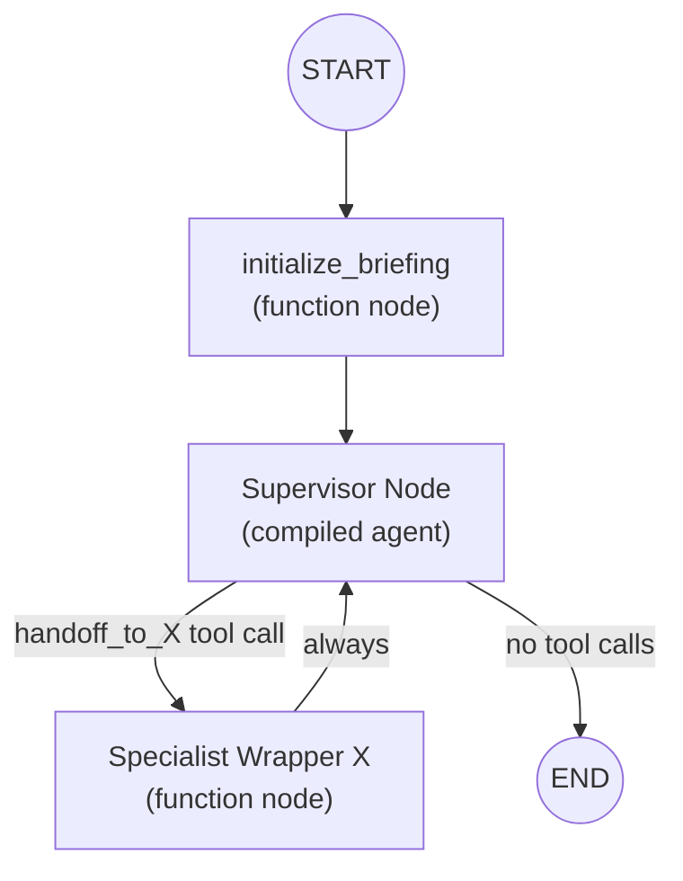
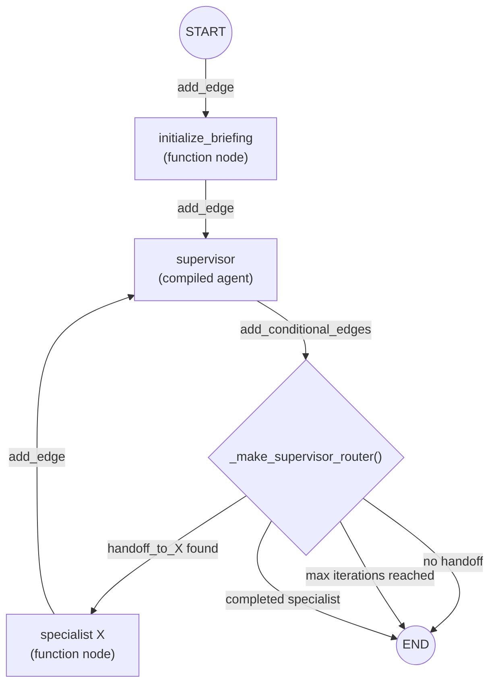
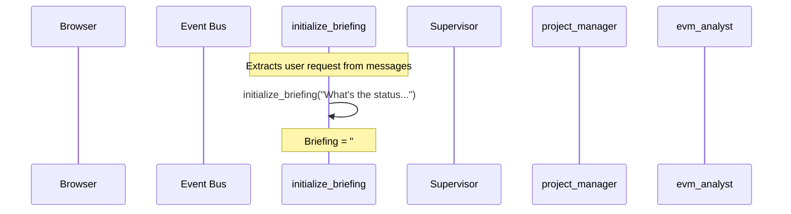
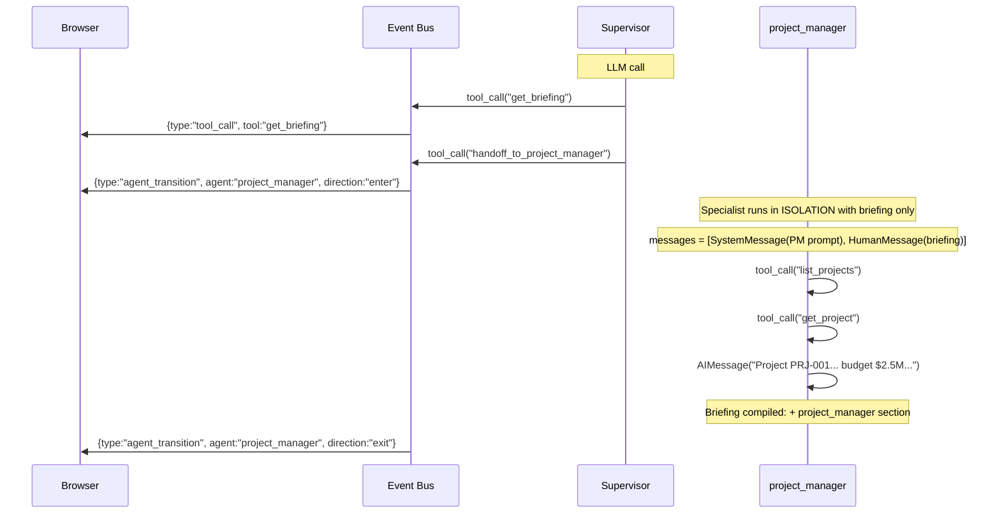
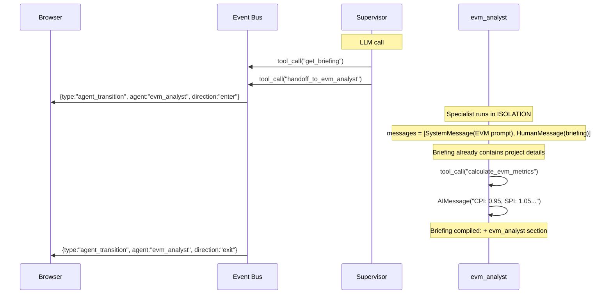
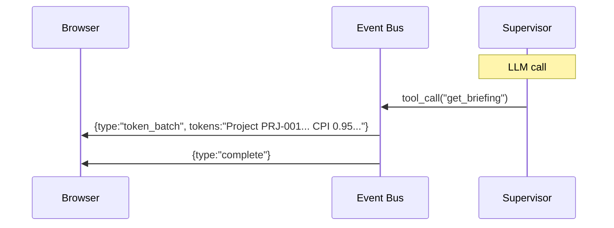

# Supervisor Orchestrator: Briefing-Based Delegation

A handoff-based orchestration pattern where a supervisor agent routes user requests to specialist agents via handoff tools. Specialists do NOT share message history -- instead, each receives a compiled briefing document as context and contributes findings back to the accumulating document. The briefing acts as the primary knowledge carrier between supervisor turns.

> **Prerequisite:** This document assumes familiarity with [Agent System: Common Concepts](./agent-common-concepts.md).
>
> **Related Documentation:**
> - [Agent System: Common Concepts](./agent-common-concepts.md) -- shared infrastructure, tools, middleware, event bus
> - [Deep Agent Orchestrator](./deep-agent-orchestrator.md) -- task-based delegation with isolated subagents

---

## Table of Contents

1. [Architecture Overview](#1-architecture-overview)
2. [Key Files](#2-key-files)
3. [State Schema](#3-state-schema)
4. [Supervisor System Prompt](#4-supervisor-system-prompt)
5. [Handoff Mechanism](#5-handoff-mechanism)
6. [Specialist Compilation](#6-specialist-compilation)
7. [Graph Wiring](#7-graph-wiring)
8. [Routing Decisions](#8-routing-decisions)
9. [Iteration Safety](#9-iteration-safety)
10. [Walkthrough: Project Health Check](#10-walkthrough-project-health-check)
11. [Key Files Reference](#11-key-files-reference)

---

## 1. Architecture Overview

### SupervisorOrchestrator

```python
class SupervisorOrchestrator:
    def __init__(
        self,
        model: str | BaseChatModel,
        context: ToolContext,
        system_prompt: str | None = None,
    ) -> None:
```

The supervisor orchestrator builds a parent `StateGraph` where the supervisor routes to specialist agents via handoff tools. Each specialist is a **function node** (not a subgraph node) that runs in isolation with the compiled briefing document as its only context. The briefing accumulates specialist findings across iterations, replacing raw message history as the knowledge carrier.

### Invocation Path

The supervisor is invoked via `DeepAgentOrchestrator.create_agent()` when `config.use_supervisor=True` (controlled by `settings.AI_ORCHESTRATOR`). The Deep Agent orchestrator transparently delegates:

```python
# In DeepAgentOrchestrator.create_agent()
# Routing priority: supervisor -> default
if config.use_supervisor:
    supervisor = SupervisorOrchestrator(...)
    return supervisor.create_supervisor_graph(config)
```

### Architecture Diagram



The key architectural difference from a shared-state supervisor: specialist nodes are **function nodes** that invoke compiled specialist graphs internally via `ainvoke()` with isolated messages. Specialists never see each other's raw messages or the parent graph's message history -- only the compiled briefing.

---

## 2. Key Files

| File | Responsibility |
|------|---------------|
| `ai/supervisor_orchestrator.py` | `SupervisorOrchestrator`: briefing-based agent delegation with compiled context |
| `ai/supervisor_state.py` | `BackcastSupervisorState`: state schema with briefing fields and iteration counters |
| `ai/briefing.py` | `BriefingDocument`, `BriefingSection`: Pydantic models for the briefing artifact |
| `ai/briefing_compiler.py` | `initialize_briefing()`, `compile_specialist_output()`: zero-cost compilation logic |
| `ai/handoff_tools.py` | `create_handoff_tool()`, `create_all_handoff_tools()`: handoff tools with deterministic briefing update |
| `ai/subagent_compiler.py` | Shared compilation logic for specialist graphs |

---

## 3. State Schema

### BackcastSupervisorState

```python
class BackcastSupervisorState(TypedDict):
    messages: Annotated[list[BaseMessage], operator.add]  # user msg + supervisor response only
    active_agent: str                                     # currently active specialist
    structured_response: Any | None                       # structured output from specialists
    tool_call_count: Annotated[int, operator.add]         # accumulated across all agents
    max_tool_iterations: int                              # global iteration limit
    briefing_data: dict[str, Any]                         # serialized BriefingDocument (single source of truth)
    supervisor_iterations: Annotated[int, operator.add]   # completed supervisor cycles
    max_supervisor_iterations: int                        # hard cap (default 3)
    completed_specialists: Annotated[set[str], operator.or_]  # specialists that have finished
```

The `messages` field carries only the outer conversation (user message + supervisor final response). The `briefing_data` field is the single source of truth -- a serialized `BriefingDocument` dict that accumulates findings from all specialists. Markdown is rendered from `briefing_data` on demand via `BriefingDocument.model_validate(data).to_markdown()` wherever needed (get_briefing tool, specialist wrapper, agent_service publishing).

The `completed_specialists` field uses `operator.or_` (set union) as its reducer, so each specialist wrapper adds its name to the growing set. The router checks this set to prevent re-dispatch.

The `supervisor_iterations` counter uses `operator.add` and increments by 1 each time a specialist completes. Combined with `max_supervisor_iterations`, this enforces a hard cap on supervisor-specialist cycles.

**Key difference from task-based delegation:** In the task-based pattern, each subagent gets an isolated `messages` list containing only the task description. Here, specialists see the compiled briefing (~300-700 tokens) instead of raw messages (~3000-8000 tokens), achieving 5-10x context reduction.

---

## 4. Supervisor System Prompt

### BRIEFING_ROOM_SUPERVISOR_PROMPT

The supervisor's system prompt describes the briefing-based delegation workflow:

```
You are a supervisor in the Briefing Room for the Backcast project budget management system.

You coordinate specialist agents who analyze data and report back through a compiled briefing document.

## How It Works
1. Use the `get_briefing` tool to read the current compiled findings from all specialists
2. Based on the briefing, decide which specialist to hand off to next
3. After each specialist contributes, review the updated briefing
4. When you have enough information, synthesize the findings into a response

## Available Specialists
- project_manager -> Project CRUD, WBEs, cost elements, cost tracking, progress entries
- evm_analyst -> EVM calculations, performance analysis
- change_order_manager -> Change orders, impact analysis
- user_admin -> User and department management
- visualization_specialist -> Diagrams, visualizations
- forecast_manager -> Forecasts, schedule baselines
- general_purpose -> Unclear or cross-cutting requests

## Guidelines
- Always call get_briefing first to see what's already been analyzed
- CRITICAL: Before handing off to a specialist, check if the briefing already
  contains findings that address the user's request. If the task is complete,
  respond directly instead of handing off again.
- Do NOT hand off to the same specialist more than once for the same task.
- Hand off to the most relevant specialist for each aspect of the request
- After receiving specialist findings, synthesize a clear, concise response
- Do NOT repeat detailed findings -- highlight key insights and actionable information

## CRITICAL COMPLETION RULES
1. Maximum 2 specialist cycles for simple requests. Do NOT over-delegate.
2. Always call get_briefing before deciding to hand off -- check what's already there.
3. If a specialist has completed the requested work, acknowledge completion and summarize.

## MANDATORY PRE-HANDOFF CHECKLIST
Before calling ANY handoff_to_X tool, you MUST:
1. Call get_briefing and check the current findings
2. Check Specialist Contributions section -- if specialist X already has findings, DO NOT handoff to X again
3. Verify the user's request hasn't already been addressed

Failure to check will result in redundant work, wasted API costs, and poor user experience.
```

### _BRIEFING_HANDOFF_SUFFIX

Appended when specialists are available:

```
IMPORTANT: You do NOT have direct access to Backcast tools.
ALL Backcast operations must be delegated to specialists via handoff tools.

Always start by calling get_briefing to review the current state of knowledge.
```

### Routing Guidelines

The supervisor has three tool categories: `get_briefing` (read compiled findings), `handoff_to_X` (delegate to specialist), and `get_temporal_context` (temporal context). There is no `task` tool -- all delegation is via handoff to ensure every specialist contribution passes through briefing compilation.

---

## 5. Handoff Mechanism

### create_handoff_tool()

Each handoff tool is created by `create_handoff_tool(agent_name, agent_description)`. Unlike the previous pattern, the handoff tool now performs a **deterministic briefing update** before routing:

```python
@tool(f"handoff_to_{agent_name}", description=agent_description)
def handoff_tool(
    task_description: Annotated[str, "A brief description of the task to hand off."],
    state: Annotated[dict, InjectedState()],
    tool_call_id: Annotated[str, InjectedToolCallId],
) -> Command:
    tool_message = ToolMessage(
        content=f"Transferring to {agent_name}: {task_description}",
        tool_call_id=tool_call_id,
    )

    # Propagate reasoning_content from the last AIMessage (DeepSeek thinking
    # mode requires it on ALL assistant messages when enabled).
    rc_kwargs: dict[str, Any] = {}
    for msg in reversed(state.get("messages", [])):
        if isinstance(msg, AIMessage):
            rc = msg.additional_kwargs.get("reasoning_content")
            if rc:
                rc_kwargs["additional_kwargs"] = {"reasoning_content": rc}
            break

    ai_message = AIMessage(
        content="",
        tool_calls=[{
            "name": tool_name, "args": {"task_description": task_description},
            "id": tool_call_id, "type": "tool_call",
        }],
        **rc_kwargs,
    )

    # Deterministic briefing update with task assignment
    briefing_data = state.get("briefing_data", {})
    try:
        doc = BriefingDocument.model_validate(briefing_data)
    except Exception:
        doc = BriefingDocument(original_request="(recovered)")
    doc.metadata["current_task"] = {
        "specialist": agent_name,
        "description": task_description,
    }
    updated_data = doc.model_dump()

    return Command(
        goto=agent_name,
        graph=Command.PARENT,
        update={
            "messages": [ai_message, tool_message],
            "active_agent": agent_name,
            "briefing_data": updated_data,
        },
    )

handoff_tool.metadata = {METADATA_KEY_HANDOFF_DESTINATION: agent_name}
```

The `graph=Command.PARENT` flag tells LangGraph to route to the target agent's node in the **parent** graph. The handoff tool:

- Takes a `task_description` parameter describing what to hand off.
- Updates `BriefingDocument.metadata["current_task"]` with `{specialist, description}` so the specialist wrapper knows its assigned task.
- Injects the current state and tool call ID via LangGraph's dependency injection.
- Updates `active_agent` for event bus tracking.
- Sets `METADATA_KEY_HANDOFF_DESTINATION` on tool metadata for routing detection.

### create_all_handoff_tools()

Creates one handoff tool per **successfully compiled** specialist graph. Only specialists that passed tool filtering and RBAC checks get handoff tools.

---

## 6. Specialist Compilation

### compile_subagents()

Specialist compilation is handled by the shared `compile_subagents()` function in `ai/subagent_compiler.py`. Key specifics:

1. Each specialist is compiled via `langchain_create_agent()` with `name=agent_name` (so the graph node is properly identified).
2. **Fresh middleware per specialist** -- each gets its own `TemporalContextMiddleware` and `BackcastSecurityMiddleware` instances to prevent mutable state leakage.
3. Middleware stack: `TemporalContextMiddleware` + `BackcastSecurityMiddleware` (no `TodoListMiddleware` for specialists).
4. Tool filtering follows the same intersection logic as Deep Agent subagents.
5. Specialists with zero tools after filtering are skipped.

### Specialist Wrapper Nodes

Each compiled specialist is wrapped in a function node via `_create_specialist_wrapper()`. The wrapper:

1. Checks `completed_specialists` for early exit -- returns `Command(goto=END)` if already completed.
2. Reads the briefing markdown from state.
3. Constructs isolated messages: `[SystemMessage(prompt), HumanMessage(briefing + scope boundary)]`.
4. Invokes the specialist graph via `ainvoke()` with `recursion_limit=max_tool_iterations`.
5. Extracts the final `AIMessage` (findings) with reasoning_content propagation for DeepSeek models.
6. Extracts tool call summary across all messages in the result.
7. Calls `compile_specialist_output()` to append findings to the briefing.
8. On error, still compiles the error message into the briefing (graceful degradation).
9. Returns a state update with updated briefing, incremented iteration counter, and the specialist added to `completed_specialists`.

The specialist's system prompt includes a `_SCOPE_BOUNDARY` suffix instructing it to stay within its domain and add a "Delegation Notes" section if the briefing requests work outside its specialty.

### State Update

Each specialist wrapper returns:

```python
{
    "messages": [AIMessage(content=findings or "Specialist task completed.", **findings_rc_kwargs)],
    "briefing_data": updated_data,          # serialized BriefingDocument (single source of truth)
    "active_agent": "supervisor",           # always routes back to supervisor
    "tool_call_count": result_count,        # accumulated from specialist execution
    "supervisor_iterations": 1,             # incremented per specialist cycle
    "completed_specialists": {specialist_name},  # added to set via union reducer
}
```

---

## 7. Graph Wiring

### Parent StateGraph Structure



### Edge Layout

```python
# Fixed path: START -> initialize_briefing -> supervisor
parent.add_edge(START, "initialize_briefing")
parent.add_edge("initialize_briefing", "supervisor")

# Supervisor: conditional -> specialist or END
parent.add_conditional_edges(
    "supervisor",
    _make_supervisor_router(specialist_names),
    specialist_names + [END],
)

# Each specialist: always returns to supervisor
for name in specialist_names:
    parent.add_edge(name, "supervisor")
```

### initialize_briefing_node

A function node that:
1. Extracts the last `HumanMessage` from state (the user's request).
2. Calls `initialize_briefing(user_request, {"project_id": context.project_id})`.
3. Returns `{briefing_data, supervisor_iterations: 0, max_supervisor_iterations: 3, completed_specialists: set()}`.

### _make_supervisor_router()

A routing function for the supervisor node that enforces three guards:

```python
def router(state: BackcastSupervisorState) -> str:
    # Check 1: iteration cap
    iterations = state.get("supervisor_iterations", 0)
    max_iterations = state.get("max_supervisor_iterations", 3)
    if iterations >= max_iterations:
        return END

    # Check 2: handoff tool call
    messages = state.get("messages", [])
    last_msg = messages[-1]
    if isinstance(last_msg, AIMessage) and last_msg.tool_calls:
        for tc in last_msg.tool_calls:
            for spec_name in specialist_names:
                if tc.get("name") == f"handoff_to_{spec_name}":
                    # Check 3: prevent redispatch to completed specialists
                    completed = state.get("completed_specialists", set())
                    if spec_name in completed:
                        return END
                    return spec_name

    # No handoff -- supervisor is done
    return END
```

### Fallback

If no specialists compile successfully (e.g., all filtered out by RBAC), `_build_fallback_graph()` creates a simple agent with direct tool access and no specialist routing.

---

## 8. Routing Decisions

### Supervisor: "Which specialist to hand off to?"

The LLM decides based on the `get_briefing` output and the handoff tool descriptions. The supervisor calls `get_briefing` to review compiled findings, then selects the most relevant specialist via a handoff tool.

### No Peer Handoffs

Specialists **cannot** hand off to other specialists directly. They always return to the supervisor, which reads the updated briefing and decides the next action. This simplifies the graph topology and ensures every specialist contribution passes through the compilation step.

### Completed-Specialist Check

The router prevents re-dispatch to specialists that already appear in `completed_specialists`. If the supervisor attempts to hand off to an already-completed specialist, the router forces `END`. This prevents redundant cycles when the supervisor re-dispatches after receiving a successful result.

### Specialist: "Return to supervisor"

After a specialist finishes its work, it produces an `AIMessage` with no tool calls. Control returns to the supervisor via the fixed `add_edge(name, "supervisor")`. The supervisor then reads the updated briefing and either dispatches another specialist or synthesizes a final response.

---

## 9. Iteration Safety

### Tool Call Limit (Intra-Agent)

Each compiled agent (supervisor and specialists) has an internal `should_continue` check that enforces `max_tool_iterations` (default: 25). This prevents individual agents from entering infinite tool-call loops. The `tool_call_count` accumulates across all tool calls within that agent's execution.

### Supervisor Cycle Limit (Inter-Agent)

The supervisor graph enforces a **hard cap** on supervisor-specialist cycles via `supervisor_iterations` + `max_supervisor_iterations` (default: 3). The `_make_supervisor_router` checks this counter before routing to any specialist:

```python
iterations = state.get("supervisor_iterations", 0)
max_iterations = state.get("max_supervisor_iterations", 3)
if iterations >= max_iterations:
    return END
```

This prevents the path `supervisor -> specialist -> supervisor -> specialist -> ...` from running indefinitely. Combined with the `completed_specialists` set (which prevents re-dispatch to already-run specialists), the iteration budget is naturally bounded.

### Triple Guard Summary

| Guard | Mechanism | Default | Effect |
|-------|-----------|---------|--------|
| Tool call limit | `max_tool_iterations` per agent | 25 | Prevents infinite tool loops within one agent |
| Supervisor cycle limit | `max_supervisor_iterations` | 3 | Caps supervisor-specialist round trips |
| Completed specialist check | `completed_specialists` set | empty | Prevents re-dispatch to same specialist |

---

## 10. Walkthrough: Project Health Check

**User:** "What's the status and EVM performance of project PRJ-001?"

### Phase 1: Briefing Initialization



### Phase 2: Supervisor Routes to project_manager



### Phase 3: Supervisor Routes to evm_analyst



### Phase 4: Supervisor Synthesizes



### What Each LLM Call Received

**Supervisor -- LLM Call #1** (initial routing):

```
+-- LLM API Call #1 -- Supervisor -------------------------------------------+
|                                                                             |
|  system:   [SystemMessage] BRIEFING_ROOM_SUPERVISOR_PROMPT                 |
|            + _BRIEFING_HANDOFF_SUFFIX                                       |
|                                                                             |
|  messages: [HumanMessage] "What's the status and EVM performance..."       |
|                                                                             |
|  tools:    [get_briefing, handoff_to_project_manager,                      |
|             handoff_to_evm_analyst, ..., get_temporal_context]              |
|                                                                             |
|  output:   AIMessage(tool_calls=[{name: "get_briefing", ...}])             |
|            -> reads initial briefing                                        |
|            -> then: AIMessage(tool_calls=[{name: "handoff_to_..."}])       |
+-----------------------------------------------------------------------------+
```

**project_manager -- Specialist Wrapper** (isolated execution):

```
+-- Specialist Isolated Context ----------------------------------------------+
|                                                                             |
|  system:   [SystemMessage] "You are a project management specialist..."    |
|                                                                             |
|  messages: [HumanMessage] "## Briefing\n\n# Briefing Document\n            |
|             ## Request\nWhat's the status...\n"                             |
|             (~300 tokens of compiled briefing)                              |
|                                                                             |
|  tools:    [list_projects, get_project, list_wbes, ...]  <- 37             |
|                                                                             |
|  output:   AIMessage("Project PRJ-001 is 45% complete, budget $2.5M")     |
+-----------------------------------------------------------------------------+
```

**evm_analyst -- Specialist Wrapper** (sees updated briefing):

```
+-- Specialist Isolated Context ----------------------------------------------+
|                                                                             |
|  system:   [SystemMessage] "You are an EVM analysis specialist..."         |
|                                                                             |
|  messages: [HumanMessage] "## Briefing\n\n# Briefing Document\n            |
|             ## Request\nWhat's the status...\n                              |
|             ## Specialist Findings\n                                        |
|             ### project_manager (Iteration 1)\n                             |
|             Project PRJ-001 is 45% complete...\n"                           |
|             (~500 tokens -- previous findings included)                     |
|                                                                             |
|  -> evm_analyst already knows project details from briefing               |
|  -> Does NOT re-fetch project data                                         |
|  -> Directly calculates EVM metrics                                        |
+-----------------------------------------------------------------------------+
```

### Briefing State After Execution

```
+-- BackcastSupervisorState (after walkthrough) ------------------------------+
|                                                                             |
|  briefing_data: {original_request: "...", sections: [...],                 |
|                  iteration: 2, metadata: {project_id: "PRJ-001"}}          |
|  (Markdown is rendered on demand from briefing_data via                    |
|   BriefingDocument.model_validate(data).to_markdown())                     |
|                                                                             |
|  messages: [HumanMessage("What's the status..."),                           |
|             AIMessage("Here's the overview for PRJ-001...")]                |
|             (only user msg + supervisor response)                           |
|                                                                             |
|  active_agent: "supervisor"                                                 |
|  tool_call_count: 5  (list_projects, get_project, calculate_evm, ...)      |
|  supervisor_iterations: 2                                                   |
|  max_supervisor_iterations: 3                                               |
|  completed_specialists: {"project_manager", "evm_analyst"}                 |
+-----------------------------------------------------------------------------+
```

---

## 11. Key Files Reference

| File | Responsibility |
|------|---------------|
| `ai/supervisor_orchestrator.py` | `SupervisorOrchestrator`: briefing-based agent delegation with compiled context |
| `ai/supervisor_state.py` | `BackcastSupervisorState`: state schema with briefing fields and iteration counters |
| `ai/briefing.py` | `BriefingDocument`, `BriefingSection`: Pydantic models for the briefing artifact |
| `ai/briefing_compiler.py` | `initialize_briefing()`, `compile_specialist_output()`: zero-cost compilation |
| `ai/handoff_tools.py` | `create_handoff_tool()`, `create_all_handoff_tools()`: handoff tools with deterministic briefing update |
| `ai/subagent_compiler.py` | Shared compilation logic for specialist graphs |
| `ai/subagents/__init__.py` | Seven subagent configurations used by the orchestrator |
| `ai/config.py` | `AgentConfig` dataclass with `use_supervisor` field |
