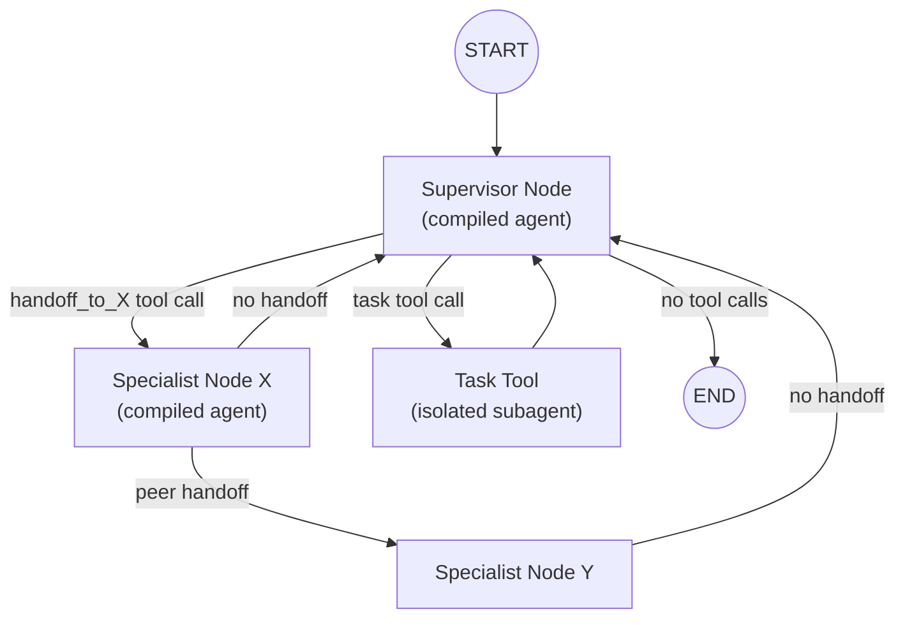
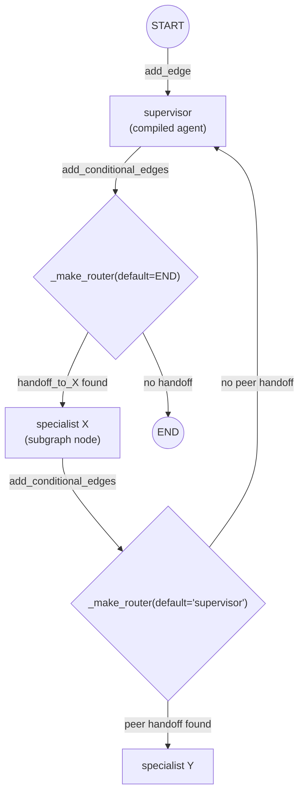
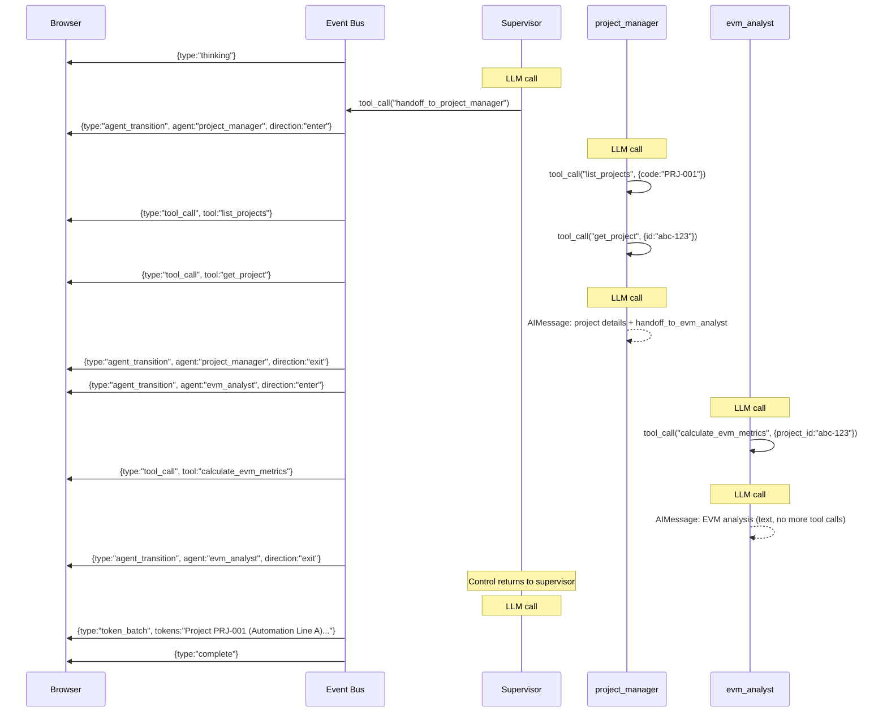
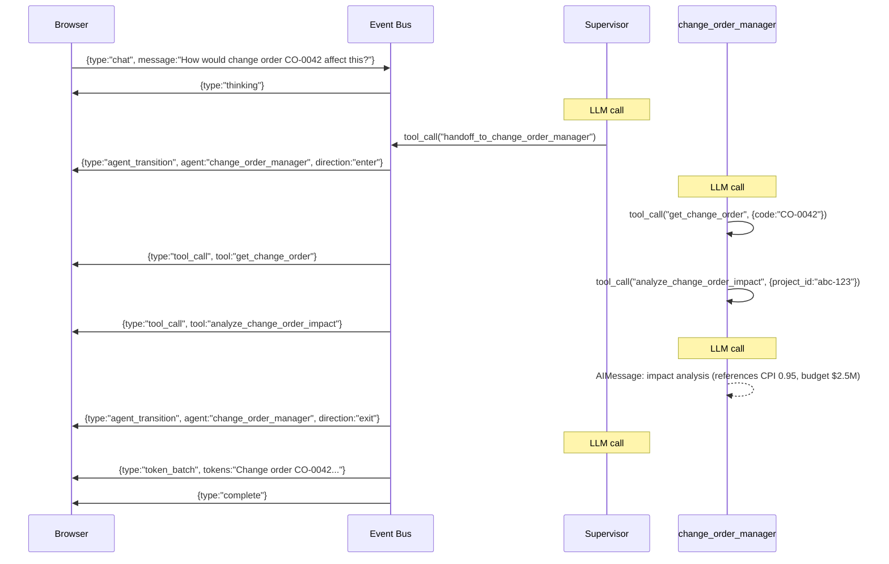

# Supervisor Orchestrator: Handoff-Based Delegation

The handoff-based orchestration pattern where a supervisor agent routes user requests to specialist agents via handoff tools. All specialists share the full message history through the parent graph's shared state, enabling context-rich multi-turn conversations.

> **Prerequisite:** This document assumes familiarity with [Agent System: Common Concepts](./agent-common-concepts.md).
>
> **Related Documentation:**
> - [Agent System: Common Concepts](./agent-common-concepts.md) — shared infrastructure, tools, middleware, event bus
> - [Deep Agent Orchestrator](./deep-agent-orchestrator.md) — task-based delegation with isolated subagents

---

## Table of Contents

1. [Architecture Overview](#1-architecture-overview)
2. [Key Files](#2-key-files)
3. [State Schema](#3-state-schema)
4. [Supervisor System Prompt](#4-supervisor-system-prompt)
5. [Handoff Mechanism](#5-handoff-mechanism)
6. [Specialist Compilation](#6-specialist-compilation)
7. [Graph Wiring](#7-graph-wiring)
8. [Routing Decisions](#8-routing-decisions)
9. [Iteration Safety](#9-iteration-safety)
10. [Walkthrough: Project Health Check with Follow-up](#10-walkthrough-project-health-check-with-follow-up)
11. [Key Files Reference](#11-key-files-reference)

---

## 1. Architecture Overview

### SupervisorOrchestrator

```python
class SupervisorOrchestrator:
    def __init__(
        self,
        model: str | BaseChatModel,
        context: ToolContext,
        system_prompt: str | None = None,
    ) -> None:
```

The supervisor orchestrator builds a parent `StateGraph` where the supervisor agent routes to specialist agents via handoff tools. Each specialist is a compiled `create_agent()` graph embedded as a subgraph node.

### Invocation Path

The supervisor is invoked via `DeepAgentOrchestrator.create_agent()` when `config.use_supervisor=True` (controlled by `settings.AI_ORCHESTRATOR`). The Deep Agent orchestrator transparently delegates:

```python
# In DeepAgentOrchestrator.create_agent()
# Routing priority: briefing_room → supervisor → default
if config.use_supervisor:
    supervisor = SupervisorOrchestrator(...)
    return supervisor.create_supervisor_graph(config)
```

### Architecture Diagram



The supervisor retains the `task` tool for parallel batch operations where context isolation is acceptable. Handoff is the preferred mechanism for most requests.

---

## 2. Key Files

| File | Responsibility |
|------|---------------|
| `ai/supervisor_orchestrator.py` | `SupervisorOrchestrator`: handoff-based agent delegation with shared state |
| `ai/supervisor_state.py` | `BackcastSupervisorState`: shared state schema for supervisor graph |
| `ai/handoff_tools.py` | `create_handoff_tool()`, `create_all_handoff_tools()`: `Command(goto=...)` handoff mechanism |
| `ai/subagent_compiler.py` | Shared compilation logic for both specialists and subagents |

---

## 3. State Schema

### BackcastSupervisorState

```python
class BackcastSupervisorState(TypedDict):
    messages: Annotated[list[BaseMessage], operator.add]  # append-only, shared
    active_agent: str                                     # currently active specialist
    structured_response: Any | None                       # structured output from specialists
    tool_call_count: Annotated[int, operator.add]         # accumulated across all agents
    max_tool_iterations: int                              # global iteration limit
```

All specialists share the **full message history** through the parent graph's shared state. The `messages` field uses `operator.add` (append-only), so every agent sees the complete conversation. The `tool_call_count` also accumulates across all specialist executions.

**Key difference from Deep Agent:** In the task-based pattern, each subagent gets an isolated `messages` list containing only the task description. Here, specialists see the entire conversation including previous specialists' work.

---

## 4. Supervisor System Prompt

### SUPERVISOR_SYSTEM_PROMPT

The supervisor's default system prompt describes the dual-delegation mechanism:

```
You act as a supervisor that routes user requests to the appropriate specialist agent.
You have two mechanisms for delegation:

## 1. Handoff Tools (Preferred)
Use handoff tools to transfer control to a specialist. The specialist will see
the full conversation history and can respond directly to the user.

## 2. Task Tool (Secondary)
Use the task tool when you need to launch parallel batch operations with isolated context.
```

### _HANDOFF_SUFFIX

Appended when handoff specialists are available:

```
IMPORTANT: You do NOT have direct access to Backcast tools.
ALL Backcast operations must be delegated to specialists via handoff tools or the task tool.

Prefer handoff tools over the task tool for most requests — handoff preserves
full conversation context.
```

### Routing Guidelines

| Request Domain | Route To |
|---------------|----------|
| Project CRUD, WBEs, cost elements, cost tracking, progress entries | `project_manager` |
| EVM calculations, performance analysis | `evm_analyst` |
| Change orders, impact analysis | `change_order_manager` |
| User/department management | `user_admin` |
| Diagrams, visualizations | `visualization_specialist` |
| Forecasts, schedule baselines | `forecast_manager` |
| Unclear or cross-cutting | `general_purpose` |

---

## 5. Handoff Mechanism

### create_handoff_tool()

Each handoff tool is created by `create_handoff_tool(agent_name, agent_description)`. It returns:

```python
@tool(f"handoff_to_{agent_name}", description=agent_description)
def handoff_tool(
    task_description: Annotated[str, "A brief description of the task to hand off."],
    state: Annotated[dict, InjectedState()],
    tool_call_id: Annotated[str, InjectedToolCallId],
) -> Command:
    tool_message = ToolMessage(
        content=f"Transferring to {agent_name}: {task_description}",
        tool_call_id=tool_call_id,
    )
    return Command(
        goto=agent_name,
        graph=Command.PARENT,
        update={
            "messages": [tool_message],
            "active_agent": agent_name,
        },
    )

handoff_tool.metadata = {METADATA_KEY_HANDOFF_DESTINATION: agent_name}
```

The `graph=Command.PARENT` flag tells LangGraph to route to the target agent's subgraph node in the **parent** graph, preserving shared state. The handoff tool:

- Takes a `task_description` parameter (brief description of what to hand off).
- Injects the current state and tool call ID via LangGraph's dependency injection.
- Updates `active_agent` for event bus tracking.
- Sets `METADATA_KEY_HANDOFF_DESTINATION` on tool metadata for routing detection without parsing tool names.

### create_all_handoff_tools()

Creates one handoff tool per **successfully compiled** specialist graph. Only specialists that passed tool filtering and RBAC checks get handoff tools — this prevents routing to non-existent graph nodes.

```python
# Correct: pass compiled specialist_graphs, not raw subagent_configs
handoff_tools = create_all_handoff_tools(specialist_graphs)
```

### METADATA_KEY_HANDOFF_DESTINATION

The constant `METADATA_KEY_HANDOFF_DESTINATION = "__handoff_destination__"` is attached to each handoff tool's metadata. This enables downstream consumers (logging, analytics, alternative routing strategies) to detect the target agent without parsing the tool name string.

---

## 6. Specialist Compilation

### compile_subagents()

Specialist compilation is handled by the shared `compile_subagents()` function in `ai/subagent_compiler.py` (same as Deep Agent subagents). Key specifics:

1. Each specialist is compiled via `langchain_create_agent()` with `name=agent_name` (so the subgraph node is properly identified in the parent graph).
2. **Fresh middleware per specialist** — each gets its own `TemporalContextMiddleware` and `BackcastSecurityMiddleware` instances to prevent mutable state leakage between agents.
3. Middleware stack: `TemporalContextMiddleware` + `BackcastSecurityMiddleware` (no `TodoListMiddleware` for specialists — that's supervisor-only).
4. Tool filtering follows the same intersection logic as Deep Agent subagents.
5. Specialists with zero tools after filtering are skipped.

### Compiled Specialist Dict

```python
{
    "name": "evm_analyst",
    "description": "Specialist for earned value management...",
    "runnable": <CompiledStateGraph>,
    "structured_output_schema": EVMMetricsRead,
    "tools": [calculate_evm_metrics, get_evm_performance_summary, ...],
}
```

---

## 7. Graph Wiring

### Parent StateGraph Structure



### Edge Layout

```python
# Supervisor: START → supervisor
parent.add_edge(START, "supervisor")

# Supervisor: conditional → specialist or END
parent.add_conditional_edges(
    "supervisor",
    _make_router(specialist_names, default=END),
    specialist_names + [END],
)

# Each specialist: conditional → peer specialist or supervisor
for sg in specialist_graphs:
    parent.add_conditional_edges(
        sg["name"],
        _make_router(specialist_names, default="supervisor"),
        specialist_names + ["supervisor"],
    )
```

### _make_router()

A unified routing function that serves both supervisor and specialist edges. Pre-computes a `handoff_map` dict at closure time for O(1) lookup instead of O(n*m) nested loops:

```python
@staticmethod
def _make_router(
    specialist_names: list[str],
    *,
    default: str,
) -> Callable[[BackcastSupervisorState], str]:
    handoff_map = {f"handoff_to_{name}": name for name in specialist_names}

    def router(state: BackcastSupervisorState) -> str:
        messages = state.get("messages", [])
        if not messages:
            return default
        last_msg = messages[-1]
        if isinstance(last_msg, AIMessage) and last_msg.tool_calls:
            for tc in last_msg.tool_calls:
                target = handoff_map.get(tc.get("name", ""))
                if target is not None:
                    return target
        return default

    return router
```

**Supervisor router** (`default=END`): After the supervisor produces output, checks the last `AIMessage` for handoff tool calls. If found → route to that specialist. Otherwise → `END`.

**Specialist router** (`default="supervisor"`): After a specialist finishes, checks for peer handoff. If found → route directly to that specialist (peer handoff). Otherwise → return to supervisor.

### _build_middleware()

Extracted factory for the middleware stack, used by both the main supervisor and the fallback graph:

```python
def _build_middleware(self, tools: list[BaseTool]) -> list[Any]:
    return [
        TodoListMiddleware(),
        TemporalContextMiddleware(self.context),
        BackcastSecurityMiddleware(
            self.context,
            tools=tools,
            interrupt_node=None,
        ),
    ]
```

### Fallback

If no specialists compile successfully (e.g., all filtered out by RBAC), `_build_fallback_graph()` creates a simple agent with direct tool access and no specialist routing.

---

## 8. Routing Decisions

### Supervisor: "Which specialist to hand off to?"

The LLM decides based on the handoff tool descriptions and the routing guidelines in its system prompt. Each handoff tool's description includes the specialist's domain (e.g., `"Transfer to the evm_analyst specialist. Specializes in: earned value management calculations and performance analysis"`).

### Specialist: "Tool call, peer handoff, or return?"

After a specialist finishes its work:
- It can call tools (via the standard agent loop).
- It can hand off to another specialist via a handoff tool (peer handoff).
- If it produces a text response with no tool calls, control returns to the supervisor.

### Task-Based vs. Handoff-Based Delegation

| Aspect | Task Tool (Deep Agent) | Handoff (Supervisor) |
|--------|----------------------|----------------------|
| State | Isolated — subagent gets `[HumanMessage(description)]` | Shared — specialist sees full message history |
| Execution | Parallel — multiple subagents run concurrently | Sequential — one specialist at a time |
| Context | Passed via `description` parameter | Inherited from parent state |
| Use when | Parallel batch operations, context isolation acceptable | Multi-turn context preservation matters |

The supervisor retains the `task` tool for cases where parallel execution is more important than shared context.

---

## 9. Iteration Safety

### Tool Call Limit (Intra-Agent)

Each compiled agent (supervisor and specialists) has an internal `should_continue` check that enforces `max_tool_iterations` (default: 25). This prevents individual agents from entering infinite tool-call loops. The `tool_call_count` accumulates across all tool calls within that agent's execution.

### Specialist Cycle Limit (Inter-Agent)

The supervisor graph currently has **no hard limit** on specialist handoff cycles. The path `supervisor → specialist → supervisor → specialist → ...` is bounded only by:

1. **LLM judgment** — the supervisor's system prompt instructs it to synthesize after receiving specialist responses, not to re-dispatch indefinitely.
2. **Token limits** — the growing message history eventually exceeds the context window.
3. **Tool call budget** — each cycle consumes tool calls, approaching `max_tool_iterations`.

### Recommendations for Production

Based on E2E testing findings, these additional guards should be considered:

1. **Specialist early exit**: Before executing a specialist, check if that specialist type already completed successfully in this execution. If so, return immediately instead of re-running. This prevents redundant cycles when the supervisor re-dispatches after receiving a successful result.

2. **Hard cycle limit**: Add `max_specialist_cycles` to `BackcastSupervisorState` (e.g., 3) and check in the router before routing to any specialist. This provides a safety net beyond LLM judgment.

3. **Context caching**: Cache `get_temporal_context` results within a single execution to avoid redundant reads before each specialist dispatch.

---

## 10. Walkthrough: Project Health Check with Follow-up

**User:** "What's the status and EVM performance of project PRJ-001?"
**Follow-up:** "How would change order CO-0042 affect this?"

This walkthrough demonstrates the shared-state advantage: the `change_order_manager` specialist sees the entire conversation including project details and EVM baseline from earlier specialists — no re-fetching needed.

### Phase 1: Initial Request — Routing and Specialist Execution



### What Each LLM Call Received

**Supervisor — LLM Call #1** (initial routing):

```
┌─ LLM API Call #1 — Supervisor ──────────────────────────────────────────┐
│                                                                          │
│  system:   [SystemMessage]                                               │
│            You are a helpful AI assistant...                             │
│            You act as a supervisor that routes user requests...          │
│            IMPORTANT: You do NOT have direct access to Backcast tools.   │
│                                                                          │
│  messages: [HumanMessage] "What's the status and EVM performance of     │
│              project PRJ-001?"                                           │
│                                                                          │
│  tools:    [handoff_to_project_manager, handoff_to_evm_analyst,         │
│             handoff_to_change_order_manager, handoff_to_user_admin,     │
│             handoff_to_visualization_specialist,                         │
│             handoff_to_forecast_manager, handoff_to_general_purpose,    │
│             task, get_temporal_context]                                  │
│                                                                          │
│  output:   AIMessage(                                                   │
│              content="",                                                 │
│              tool_calls=[{name: "handoff_to_project_manager",            │
│                           args: {task_description: "..."}}]              │
│            )                                                             │
└──────────────────────────────────────────────────────────────────────────┘
```

**project_manager — LLM Call #1** (fetch project data):

```
┌─ LLM API Call #2 — project_manager ─────────────────────────────────────┐
│                                                                          │
│  system:   [SystemMessage]                                               │
│            You are a project management specialist.                      │
│            You help with: Creating, updating, retrieving projects...     │
│                                                                          │
│  messages: [HumanMessage] "What's the status and EVM performance..."    │
│            [AIMessage] handoff_to_project_manager (supervisor handoff)   │
│            [ToolMessage] "Transferring to project_manager: ..."         │
│                                                                          │
│  tools:    [list_projects, get_project, list_wbes, get_wbe,             │
│             create_wbe, update_wbe, list_cost_elements, ...]  ← 37      │
│                                                                          │
│  output:   AIMessage(                                                   │
│              tool_calls=[                                                │
│                {name: "list_projects", args: {code: "PRJ-001"}},         │
│                {name: "get_project", args: {id: "abc-123"}}              │
│              ]                                                           │
│            )                                                             │
└──────────────────────────────────────────────────────────────────────────┘
```

**project_manager — LLM Call #2** (synthesize + peer handoff):

```
┌─ LLM API Call #3 — project_manager ─────────────────────────────────────┐
│                                                                          │
│  messages: [... previous messages ...]                                   │
│            [ToolMessage] list_projects → [{PRJ-001, "Automation Line A"}│
│            [ToolMessage] get_project → {budget: $2.5M, progress: 42%}  │
│                                                                          │
│  output:   AIMessage(                                                   │
│              content="Project PRJ-001 (Automation Line A) is active...", │
│              tool_calls=[{name: "handoff_to_evm_analyst",  ← peer       │
│                           args: {task_description: "..."}}]              │
│            )                                                             │
└──────────────────────────────────────────────────────────────────────────┘
```

> **Key difference from task-based delegation:** The `project_manager` produced a text response *and* called a handoff tool. The `evm_analyst` will see the project_manager's text and tool results because all messages live in the shared `BackcastSupervisorState`.

**evm_analyst — LLM Calls #1-2** (calculate metrics, produce analysis):

The evm_analyst sees ALL previous messages — the user's question, the supervisor's handoff, the project_manager's tool calls and results, and the project_manager's text summary. It uses `calculate_evm_metrics` and produces an EVM analysis, then returns control to the supervisor (no more tool calls).

**Supervisor — LLM Call #2** (synthesis):

The supervisor sees the full conversation including both specialists' work and synthesizes a final response for the user.

### Shared State After Initial Request

```
┌─ BackcastSupervisorState (after Phase 1) ────────────────────────────────┐
│                                                                           │
│  messages: [                                                              │
│    HumanMessage("What's the status and EVM performance of PRJ-001?"),    │
│    AIMessage(handoff_to_project_manager),                                 │
│    ToolMessage("Transferring to project_manager: ..."),                   │
│    AIMessage(tool_calls=[list_projects, get_project]),                    │
│    ToolMessage(list_projects result),                                     │
│    ToolMessage(get_project result),                                       │
│    AIMessage("Project PRJ-001... budget $2.5M..."),                       │
│    AIMessage(handoff_to_evm_analyst),                                     │
│    ToolMessage("Transferring to evm_analyst: ..."),                       │
│    AIMessage(tool_calls=[calculate_evm_metrics]),                         │
│    ToolMessage({CPI: 0.95, SPI: 1.02, ...}),                             │
│    AIMessage("EVM Analysis: CPI 0.95, SPI 1.02..."),                     │
│    AIMessage("Here's the overview for PRJ-001...")  ← supervisor synth  │
│  ]                                                                        │
│  active_agent: "supervisor"                                               │
│  structured_response: null                                                │
│  tool_call_count: 3    ← list_projects + get_project + calculate_evm     │
│  max_tool_iterations: 25                                                  │
└───────────────────────────────────────────────────────────────────────────┘
```

### Phase 2: Follow-up Message — Context Preservation Advantage

The user sends a follow-up. Because the supervisor uses **shared state**, the `change_order_manager` specialist will see the entire conversation history including the project details and EVM baseline — no re-fetching needed.



### Shared State vs. Task-Based Isolation

```
┌─ Supervisor (Handoff) ──────────────────────────────────────────────────┐
│                                                                          │
│  messages: 15 messages                                                   │
│  - User's original question                                              │
│  - project_manager: list_projects result, get_project result             │
│  - project_manager: project summary text                                 │
│  - evm_analyst: calculate_evm_metrics result (CPI, SPI, EAC)            │
│  - evm_analyst: EVM analysis text                                        │
│  - Supervisor synthesis                                                  │
│  - User's follow-up question                                             │
│                                                                          │
│  → Specialist can reference earlier results directly                     │
│    ("Given the current CPI of 0.95...")                                  │
│  → No redundant API calls to re-fetch project or EVM data                │
│  → Response is contextually richer                                      │
└──────────────────────────────────────────────────────────────────────────┘

┌─ Task-Based (Isolated) ────────────────────────────────────────────────┐
│                                                                          │
│  messages: 1 message                                                     │
│  - [HumanMessage] "Analyze the impact of change order CO-0042 on       │
│     project PRJ-001"                                                     │
│                                                                          │
│  → Specialist has NO knowledge of previous conversation                  │
│  → Must re-fetch project data, re-calculate EVM baseline                 │
│  → Multiple extra tool calls (list_projects, calculate_evm_metrics)      │
│  → Response cannot reference specific earlier findings                   │
└──────────────────────────────────────────────────────────────────────────┘
```

---

## 11. Key Files Reference

| File | Responsibility |
|------|---------------|
| `ai/supervisor_orchestrator.py` | `SupervisorOrchestrator`: handoff-based agent delegation with shared state |
| `ai/supervisor_state.py` | `BackcastSupervisorState`: shared state schema for supervisor graph |
| `ai/handoff_tools.py` | `create_handoff_tool()`, `create_all_handoff_tools()`: `Command(goto=...)` handoff mechanism |
| `ai/subagent_compiler.py` | Shared compilation logic for both specialists and subagents |
| `ai/subagents/__init__.py` | Seven subagent configurations used by both orchestrators |
| `ai/config.py` | `AgentConfig` dataclass with `use_supervisor` field |
