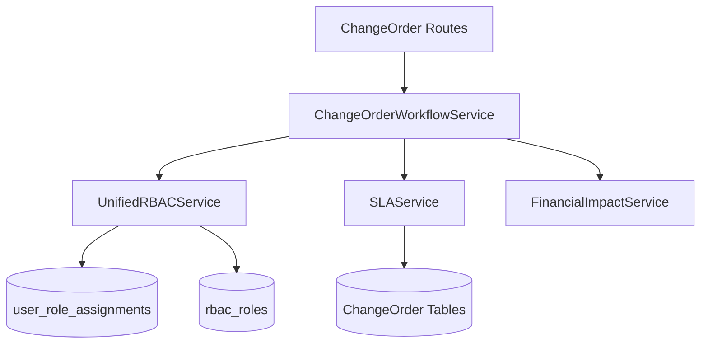
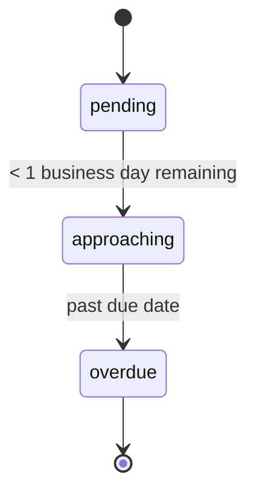
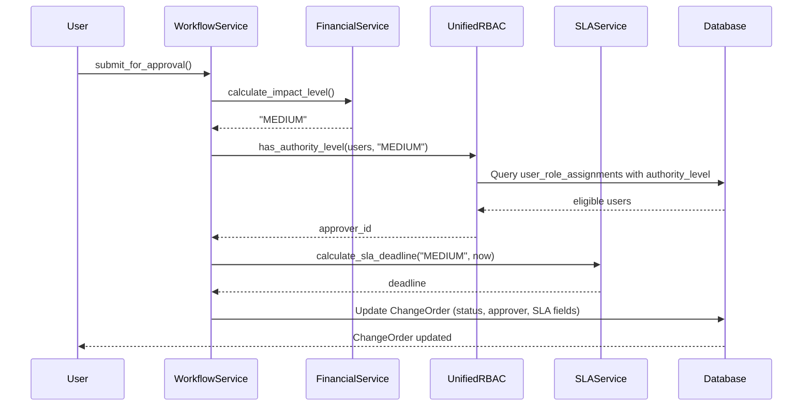
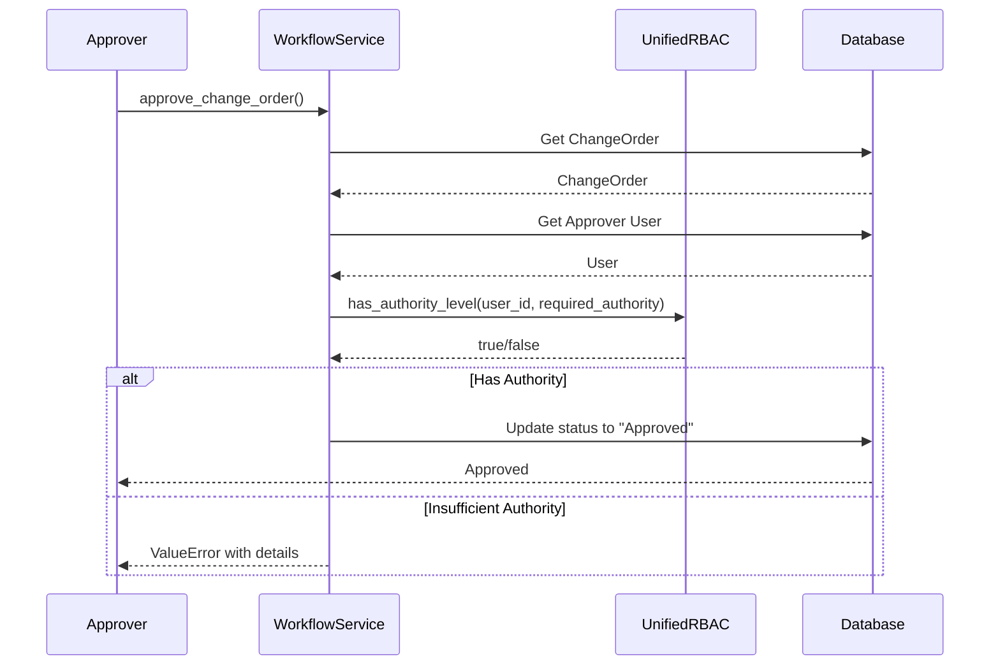

# Approval & SLA Services

**Last Updated:** 2026-05-16
**Owner:** Backend Team
**Related ADRs:** [ADR-014: Unified RBAC System](../../decisions/ADR-014-unified-rbac.md)

## Responsibility

Manages the approval workflow for Change Orders by enforcing approval authority based on financial impact levels and tracking Service Level Agreement (SLA) deadlines for approvals. Provides the governance layer for change management workflow.

> **Note:** The `ApprovalMatrixService` was deleted in the 2026-05-16 unified RBAC cleanup. Approval authority validation is now handled directly by `UnifiedRBACService.has_authority_level()` and `UnifiedRBACService.has_permission()`.

---

## Architecture

### Components



### Layers

**Workflow Service** (`app/services/change_order_workflow_service.py`)

- `submit_for_approval()` - Orchestrates approval submission workflow
- `approve_change_order()` - Validates authority and approves
- `reject_change_order()` - Rejects change orders

**UnifiedRBACService** (`app/core/rbac_unified.py`) — Approval Authority

- `has_authority_level(user_id, required_authority, scope_id)` - Validate approval authority
- `has_permission(user_id, permission, scope_type, scope_id)` - Check change-order-scoped permissions
- `get_user_roles(user_id, scope_type, scope_id)` - Get user's roles for approval eligibility

**SLA Service** (`app/services/sla_service.py`)

- `calculate_sla_deadline(impact_level, start_date)` - Calculate approval deadline
- `calculate_sla_status(due_date, current_date)` - Get current SLA status
- `calculate_business_days_remaining(due_date, current_date)` - Business days until deadline
- `update_sla_status_for_change_order(change_order_id)` - Update SLA status (background job)

---

## Impact Level Classification

Change Orders are classified by financial impact to determine approval requirements:

| Impact Level | Financial Threshold | Approval Authority | SLA (Business Days) |
|-------------|---------------------|-------------------|---------------------|
| LOW | < €10,000 | Project Manager | 2 days |
| MEDIUM | €10,000 - €50,000 | Department Head | 5 days |
| HIGH | €50,000 - €100,000 | Director | 10 days |
| CRITICAL | > €100,000 | Executive Committee | 15 days |

**Note:** Financial impact is automatically calculated by `FinancialImpactService` based on affected Work Breakdown Elements and cost changes.

---

## Approval Authority

### Role to Authority Mapping

Authority levels are stored as metadata on `UserRoleAssignment` records with `scope_type='change_order'`:

| User Role | Approval Authority | Can Approve |
|-----------|-------------------|-------------|
| admin | CRITICAL | LOW, MEDIUM, HIGH, CRITICAL |
| manager | HIGH | LOW, MEDIUM, HIGH |
| viewer | LOW | LOW only |

**Note:** Only active users (`is_active=True`) can approve. Inactive users are blocked regardless of role. Authority is resolved via `UnifiedRBACService.has_authority_level()` which checks the `authority_level` in the `UserRoleAssignment.metadata_` JSONB field.

### Authority Hierarchy

```
CRITICAL (4)
    ↑
HIGH (3)
    ↑
MEDIUM (2)
    ↑
LOW (1)
```

**Rule:** User's authority level must be **greater than or equal to** the required authority level for the change order's impact level.

### Approval Assignment Logic

When a change order is submitted for approval:

1. **Impact Calculation:** `FinancialImpactService` calculates financial impact
2. **Impact Level:** Impact level is determined (LOW/MEDIUM/HIGH/CRITICAL)
3. **Approver Selection:** `ChangeOrderWorkflowService` queries users with sufficient authority via `UnifiedRBACService.has_authority_level()`
   - Queries active users with sufficient authority
   - Prefers higher authority roles (ordered by role desc)
   - Returns first eligible user (can be enhanced for project-specific assignment)
4. **SLA Assignment:** `SLAService` calculates deadline based on impact level

---

## SLA Calculation & Tracking

### SLA Deadlines by Impact Level

| Impact Level | Business Days | Calendar Days (approx) |
|-------------|---------------|------------------------|
| LOW | 2 days | ~2-4 days |
| MEDIUM | 5 days | ~7 days |
| HIGH | 10 days | ~14 days |
| CRITICAL | 15 days | ~21 days |

**Note:** SLAs are measured in **business days** (Monday-Friday, excluding weekends). Holidays are not yet supported but can be added in a future iteration.

### SLA Status Progression



| Status | Description | Trigger |
|--------|-------------|---------|
| pending | Normal SLA tracking | Default status on submission |
| approaching | Deadline imminent | Less than 1 business day remaining |
| overdue | Deadline missed | Past `sla_due_date` |

### Business Day Calculations

**Business Day Definition:** Monday-Friday (weekday() < 5 in Python)

**Current Implementation:**
- Weekends are excluded (Saturday, Sunday)
- Holidays are **not** yet supported
- Timezone-aware datetimes are required (defaults to UTC)

**Future Enhancement:**
- Add holiday calendar table
- Check against holiday dates in `_is_business_day()`

---

## Integration with Change Order Workflow

### Submission Workflow



### Approval Workflow



### Change Order Fields Used

| Field | Type | Description |
|-------|------|-------------|
| `impact_level` | String | LOW/MEDIUM/HIGH/CRITICAL |
| `assigned_approver_id` | UUID | User ID responsible for approval |
| `sla_assigned_at` | Timestamp | When SLA timer started (submission time) |
| `sla_due_date` | Timestamp | SLA deadline for approval |
| `sla_status` | String | pending/approaching/overdue |

**Note:** No FK constraint on `assigned_approver_id` because `users.user_id` is a business key, not PK or UNIQUE. Application-level validation ensures referential integrity. See ADR-005: "Foreign Key Constraints in Temporal Entities".

---

## Data Model

### ChangeOrder (Relevant Fields)

```python
class ChangeOrder(EntityBase, VersionableMixin, BranchableMixin):
    # Approval & SLA Fields
    impact_level: Mapped[str | None]          # LOW/MEDIUM/HIGH/CRITICAL
    assigned_approver_id: Mapped[UUID | None] # Approver user_id
    sla_assigned_at: Mapped[datetime | None]  # SLA start time
    sla_due_date: Mapped[datetime | None]     # SLA deadline (indexed)
    sla_status: Mapped[str | None]           # pending/approaching/overdue
```

### Enums

```python
class ImpactLevel:
    LOW = "LOW"
    MEDIUM = "MEDIUM"
    HIGH = "HIGH"
    CRITICAL = "CRITICAL"

class SLAStatus:
    PENDING = "pending"
    APPROACHING = "approaching"
    OVERDUE = "overdue"
```

---

## Service Method Details

### UnifiedRBACService — Approval Authority Methods

> **Note:** The former `ApprovalMatrixService` methods have been replaced by `UnifiedRBACService` methods that work with the `UserRoleAssignment` entity and `metadata_` JSONB for authority levels.

#### `has_authority_level(user_id: UUID, required_authority: str, scope_id: UUID | None) -> bool`

Checks if user has sufficient authority level for approval.

**Example:**
```python
has_auth = await unified_service.has_authority_level(
    user_id=admin_user.user_id,
    required_authority="HIGH",
    scope_id=change_order_id,
)
# Returns: True
```

#### `has_permission(user_id: UUID, permission: str, scope_type: ScopeType, scope_id: UUID | None) -> bool`

Checks if user has a specific permission (e.g., `change-order-approve`).

**Example:**
```python
has_perm = await unified_service.has_permission(
    user_id=user_id,
    required_permission="change-order-approve",
    scope_type=ScopeType.CHANGE_ORDER,
    scope_id=change_order_id,
)
```

#### `get_user_roles(user_id: UUID, scope_type: ScopeType, scope_id: UUID | None) -> list[str]`

Get user's roles for a scope, useful for determining approval eligibility.

**Example:**
```python
roles = await unified_service.get_user_roles(
    user_id, ScopeType.CHANGE_ORDER, change_order_id
)
# Returns: ["change_order_approver"]
```

### SLAService Methods

#### `calculate_sla_deadline(impact_level: str, start_date: datetime) -> datetime`

Calculates SLA deadline by adding business days to start date.

**Algorithm:**
1. Validate impact level
2. Get business days for impact level (e.g., MEDIUM = 5 days)
3. Add business days, skipping weekends
4. Return deadline datetime

**Example:**
```python
deadline = service.calculate_sla_deadline("MEDIUM", datetime(2026, 4, 11))
# Returns: datetime(2026, 4, 18, ...) assuming no weekends
```

#### `calculate_sla_status(due_date: datetime, current_date: datetime | None) -> str`

Calculates current SLA status.

**Logic:**
- If `current_date > due_date`: **overdue**
- If `due_date - current_date < 1 business day`: **approaching**
- Otherwise: **pending**

**Example:**
```python
status = service.calculate_sla_status(deadline)
# Returns: "approaching"
```

#### `calculate_business_days_remaining(due_date: datetime, current_date: datetime | None) -> int`

Calculates business days remaining until deadline.

**Returns:** Integer (can be negative if overdue)

**Example:**
```python
days = service.calculate_business_days_remaining(deadline, now)
# Returns: 3 (3 business days remaining)
```

#### `update_sla_status_for_change_order(change_order_id: str) -> str`

Background job method to update SLA status for a single change order.

**Use Case:** Periodic background job that updates SLA statuses for pending change orders.

**Example:**
```python
new_status = await service.update_sla_status_for_change_order(co_id)
# Returns: "approaching" or "overdue"
```

---

## Authorization Rules

### Approval Authority

| User Role | Can Approve LOW | Can Approve MEDIUM | Can Approve HIGH | Can Approve CRITICAL |
|-----------|----------------|-------------------|------------------|---------------------|
| admin | ✓ | ✓ | ✓ | ✓ |
| manager | ✓ | ✓ | ✓ | ✗ |
| viewer | ✓ | ✗ | ✗ | ✗ |

**Additional Rules:**
- Only active users can approve
- Users cannot approve their own change orders (implicit, not enforced in code)
- Authority is checked at approval time (not pre-assigned)

---

## Error Handling

### Common Error Scenarios

**Invalid Impact Level:**
```python
ValueError: Invalid impact_level: INVALID. Must be one of: ['LOW', 'MEDIUM', 'HIGH', 'CRITICAL']
```

**No Eligible Approver:**
```python
ValueError: No eligible approver found for impact level 'CRITICAL'. Please ensure users with appropriate roles exist.
```

**Insufficient Authority:**
```python
ValueError: User {user_id} does not have sufficient authority to approve change order with impact level 'CRITICAL'. Required authority: CRITICAL, User authority: HIGH
```

**Invalid Status Transition:**
```python
ValueError: Cannot submit change order in status 'Approved'. Only Draft change orders can be submitted for approval.
```

---

## Testing

### Unit Tests

**Approval Matrix:** `backend/tests/unit/services/test_approval_matrix_service.py`
- User authority level mapping
- Impact level to authority mapping
- Approval authority validation
- Approver selection
- Approval info retrieval

**Test Coverage:**
- Authority hierarchy validation
- Inactive user blocking
- Role-based permissions
- Edge cases (no eligible approvers, invalid impact levels)

**SLA Service:** No dedicated test file yet (as of 2026-04-11)

**Integration Tests:**
- `backend/tests/integration/ai/test_approval_workflow.py` - AI-driven approval workflow
- `backend/tests/integration/ai/test_agent_service_approval_integration.py` - Agent service integration

---

## Background Jobs

### SLA Status Update Job

**Purpose:** Periodically update SLA statuses for pending change orders.

**Implementation:** Not yet implemented (as of 2026-04-11)

**Proposed Design:**
```python
async def update_sla_statuses_job(db_session: AsyncSession) -> None:
    """Background job to update SLA statuses for pending change orders."""
    sla_service = SLAService(db_session)

    # Get all pending/approaching change orders
    pending_cos = await get_pending_change_orders(db_session)

    for co in pending_cos:
        await sla_service.update_sla_status_for_change_order(str(co.change_order_id))
```

**Scheduling:** Can use Celery Beat, APScheduler, or PostgreSQL pg_cron.

---

## Future Enhancements

### Short-Term

1. **SLA Unit Tests:** Add comprehensive unit tests for `SLAService`
2. **Holiday Calendar:** Support company holidays in business day calculations
3. **Project-Specific Approvers:** Assign approvers based on project team membership
4. **Delegation:** Allow approvers to delegate approval to another user
5. **SLA Dashboard:** UI showing SLA compliance metrics and overdue items

### Long-Term

1. **Escalation Workflow:** Auto-escalate overdue approvals to higher authority
2. **Approval Chains:** Require multiple approvals for high-impact changes
3. **SLA Configuration:** Make SLA business days configurable per impact level
4. **Approval Comments:** Require mandatory comments for approvals/rejections
5. **Audit Trail:** Enhanced audit logging for approval decisions
6. **Notification System:** Email/in-app notifications for approaching/overdue SLAs

---

## Code Locations

### Services

- **Unified RBAC:** [`backend/app/core/rbac_unified.py`](file:///home/nicola/dev/backcast/backend/app/core/rbac_unified.py) — Authority level checks, permission resolution
- **SLA:** [`backend/app/services/sla_service.py`](file:///home/nicola/dev/backcast/backend/app/services/sla_service.py)
- **Workflow:** [`backend/app/services/change_order_workflow_service.py`](file:///home/nicola/dev/backcast/backend/app/services/change_order_workflow_service.py)
- **Financial Impact:** [`backend/app/services/financial_impact_service.py`](file:///home/nicola/dev/backcast/backend/app/services/financial_impact_service.py)
- ~~**Approval Matrix:**~~ `backend/app/services/approval_matrix_service.py` (deleted — functionality moved to UnifiedRBACService)

### Models

- **ChangeOrder:** [`backend/app/models/domain/change_order.py`](file:///home/nicola/dev/backcast/backend/app/models/domain/change_order.py)
- **User:** [`backend/app/models/domain/user.py`](file:///home/nicola/dev/backcast/backend/app/models/domain/user.py)
- **ChangeOrderAuditLog:** [`backend/app/models/domain/change_order_audit_log.py`](file:///home/nicola/dev/backcast/backend/app/models/domain/change_order_audit_log.py)

### Schemas

- **ChangeOrder:** [`backend/app/models/schemas/change_order.py`](file:///home/nicola/dev/backcast/backend/app/models/schemas/change_order.py)

### Tests

- **Unified RBAC:** [`backend/tests/core/test_rbac_unified.py`](file:///home/nicola/dev/backcast/backend/tests/core/test_rbac_unified.py)
- **Approval Workflow:** [`backend/tests/integration/ai/test_approval_workflow.py`](file:///home/nicola/dev/backcast/backend/tests/integration/ai/test_approval_workflow.py)
- **Agent Integration:** [`backend/tests/integration/ai/test_agent_service_approval_integration.py`](file:///home/nicola/dev/backcast/backend/tests/integration/ai/test_agent_service_approval_integration.py)
- ~~**Approval Matrix:**~~ `backend/tests/unit/services/test_approval_matrix_service.py` (deleted with service)

---

## Related Documentation

- **Unified RBAC:** `docs/02-architecture/backend/contexts/auth/unified-rbac-implementation.md` - UnifiedRBACService details
- **Auth Architecture:** `docs/02-architecture/backend/contexts/auth/architecture.md` - Authentication & Authorization
- **ADR-014:** `docs/02-architecture/decisions/ADR-014-unified-rbac.md` - Unified RBAC system
- **EVCS Core:** `docs/02-architecture/backend/contexts/evcs-core/architecture.md` - Bitemporal versioning patterns
- **ADR-005:** `docs/02-architecture/decisions/ADR-005-foreign-keys-temporal-entities.md` - FK constraint design

---

## Summary

The **Approval & SLA Services** provide the governance layer for Change Order approvals by:

1. **Enforcing Authority Rules:** Validating that only users with sufficient authority can approve changes based on financial impact, using `UnifiedRBACService` for authority resolution
2. **Automating Approver Assignment:** Selecting eligible approvers based on impact level
3. **Tracking SLA Compliance:** Calculating deadlines and monitoring approval timing
4. **Integrating with Workflow:** Orchestrating submission and approval workflows

The services follow the **Service Layer Pattern** and integrate with EVCS (Entity Versioning Control System) for complete audit trails. Approval authority is resolved through the unified RBAC system's `UserRoleAssignment` entity with authority levels stored in the `metadata_` JSONB field.
