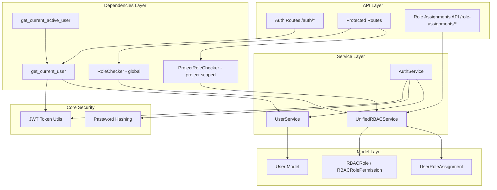
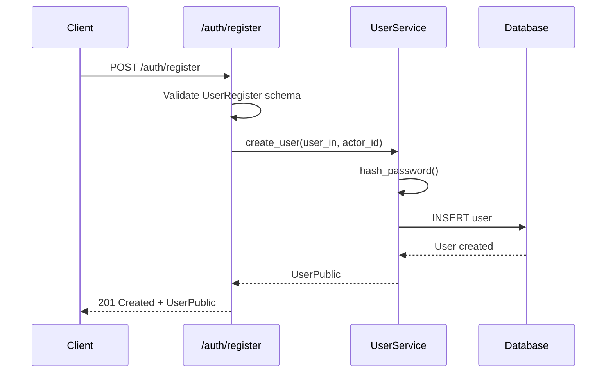
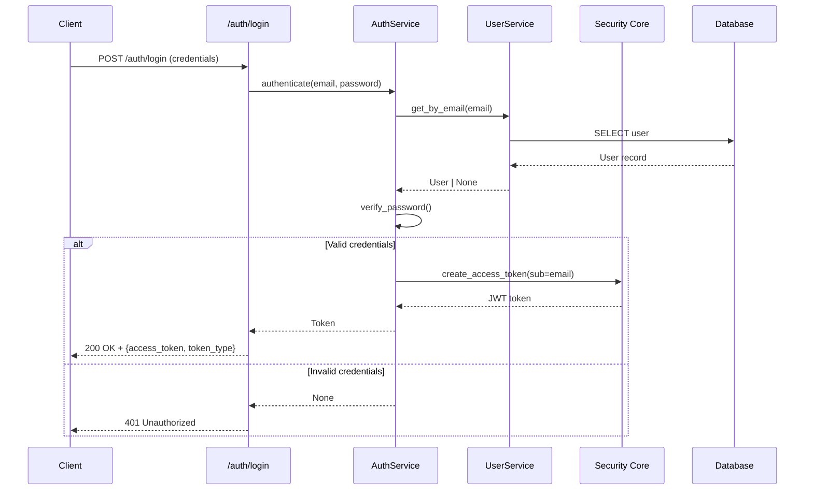
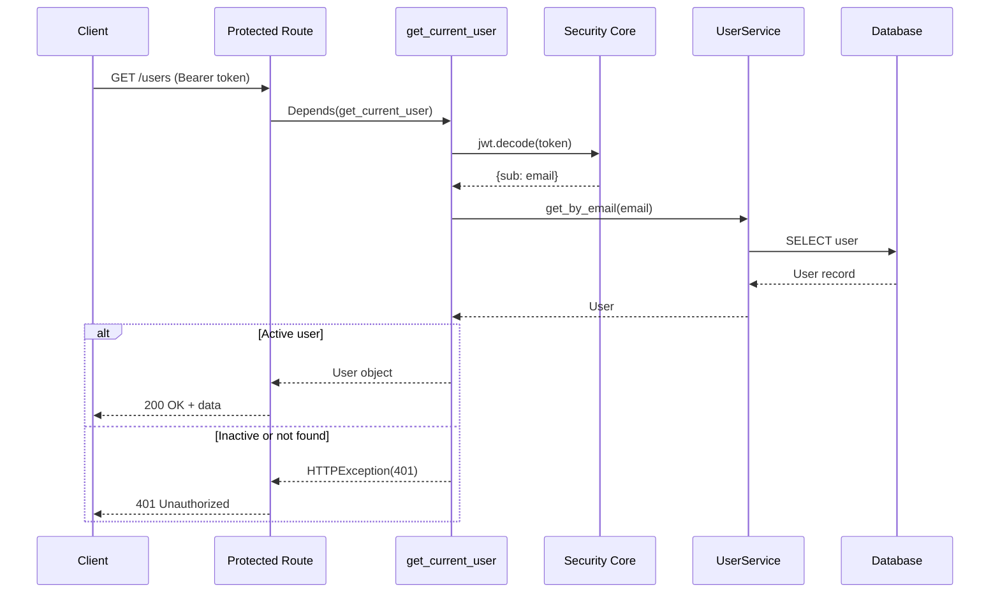
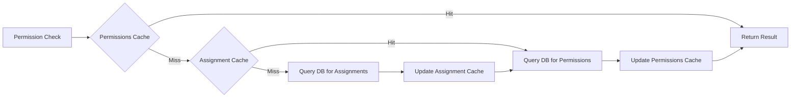
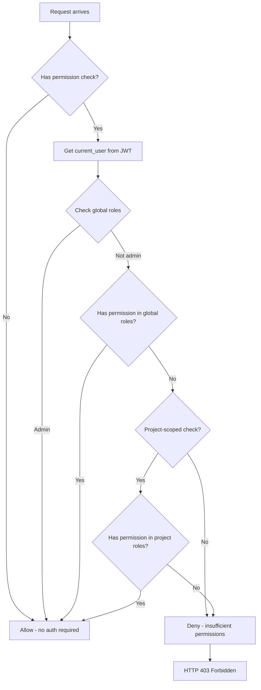

# Authentication & Authorization Architecture

**Last Updated:** 2026-05-11
**Owner:** Backend Team
**ADRs:**
- [ADR-014: Unified RBAC System](../../decisions/ADR-014-unified-rbac.md) (current implementation)
- [ADR-007: RBAC Service Design](../../decisions/ADR-007-rbac-service.md) (historical context)

---

## Responsibility

The Authentication & Authorization (Auth) context provides secure user identity verification and fine-grained access control for the Backcast system. It enables:

- **User Authentication:** JWT-based token generation and validation
- **Unified RBAC:** Single coherent authorization system with scoped role assignments
- **Declarative Authorization:** FastAPI dependency injection for route protection
- **Scoped Permissions:** Global, project, and change_order level access control

---

## Architecture

### Component Overview



### Layer Responsibilities

| Layer            | Responsibility                            | Key Components                                            |
| ---------------- | ----------------------------------------- | --------------------------------------------------------- |
| **API**          | HTTP endpoints for auth operations        | `/auth/register`, `/auth/login`, `/auth/me`, `/role-assignments/*` |
| **Dependencies** | Reusable auth/authz checks                | `get_current_user`, `RoleChecker`, `ProjectRoleChecker`   |
| **Service**      | Business logic for auth & RBAC             | `AuthService`, `UserService`, `UnifiedRBACService`         |
| **Core**         | Cryptographic operations                  | `create_access_token`, `verify_password`, `hash_password` |
| **Model**        | Data structures                           | `User`, `UserRoleAssignment`, `RBACRole`, `RBACRolePermission` |

---

## Authentication Flow

### 1. User Registration



**Key Points:**

- Password hashing performed in `UserService` layer
- Default role: `viewer` (via global UserRoleAssignment)
- Actor ID for registration: system UUID (`00000000-0000-0000-0000-000000000000`)

### 2. User Login



**JWT Payload:**

```json
{
  "sub": "user@example.com",
  "exp": "<expiration_timestamp>"
}
```

### 3. Protected Route Access



---

## Authorization (Unified RBAC) Flow

### Architecture

The RBAC system follows a **unified service pattern with scoped role assignments**:

```mermaid
classDiagram
    class UnifiedRBACService {
        <<service>>
        -_permissions_cache: dict
        -_assignment_cache: dict
        +has_permission(user_id, permission, scope_type, scope_id) bool
        +get_user_roles(user_id, scope_type, scope_id) list[str]
        +assign_role(user_id, role_id, scope_type, scope_id, ...) UserRoleAssignment
        +revoke_role(user_id, scope_type, scope_id) bool
        +has_authority_level(user_id, required_authority, scope_id) bool
        +refresh_permissions_cache() None
    }

    class UserRoleAssignment {
        <<entity>>
        +id: UUID
        +user_id: UUID
        +role_id: UUID
        +scope_type: ScopeType
        +scope_id: UUID | None
        +metadata_: JSONB
        +granted_by: UUID
        +granted_at: datetime
        +expires_at: datetime | None
    }

    class RBACRole {
        <<entity>>
        +id: UUID
        +name: str
        +description: str
        +is_system: bool
    }

    class RBACRolePermission {
        <<entity>>
        +id: UUID
        +role_id: UUID
        +permission: str
    }

    class RoleChecker {
        <<dependency>>
        -allowed_roles: list[str] | None
        -required_permission: str | None
        +__call__(current_user, session) User
    }

    class ProjectRoleChecker {
        <<dependency>>
        -required_permission: str
        +__call__(project_id, current_user, session) User
    }

    UnifiedRBACService --> UserRoleAssignment : queries
    UnifiedRBACService --> RBACRole : queries
    UnifiedRBACService --> RBACRolePermission : queries
    RoleChecker --> UnifiedRBACService : delegates
    ProjectRoleChecker --> UnifiedRBACService : delegates
    UserRoleAssignment --> RBACRole : FK
    RBACRole --> RBACRolePermission : 1:N
```

### Scope Types

**Three Scope Levels:**

1. **GLOBAL** (`ScopeType.GLOBAL`): System-wide roles
   - Replaces the old `User.role` field
   - Admin users have global access to all resources
   - `scope_id` is NULL

2. **PROJECT** (`ScopeType.PROJECT`): Project-scoped roles
   - Replaces the old `ProjectMember` entity
   - Users can have different roles on different projects
   - `scope_id` is the project UUID

3. **CHANGE_ORDER** (`ScopeType.CHANGE_ORDER`): Change order scoped roles
   - Replaces the old `ApprovalMatrixService`
   - Approvers can have authority levels per change order
   - `scope_id` is the change order UUID
   - Authority levels stored in `metadata_`: `{"authority_level": "HIGH"}`

### Permission Model

**Resource-Specific Permissions** - Format: `{resource}-{action}`

**Example Permissions:**
```json
{
  "admin": {
    "permissions": [
      "user-read", "user-create", "user-update", "user-delete",
      "project-read", "project-create", "project-update", "project-delete",
      "change-order-approve", "change-order-escalate",
      "ai-config-read", "ai-config-write", "ai-chat",
      "mcp-tool-execute", "dashboard-template-update"
      // ... 76 total permissions
    ]
  },
  "manager": {
    "permissions": [
      "user-read", "user-update",
      "project-read", "project-create", "project-update",
      "change-order-read", "change-order-create", "change-order-approve",
      "ai-chat", "evm-create", "evm-update"
      // ... 46 total permissions
    ]
  },
  "viewer": {
    "permissions": [
      "project-read", "change-order-read", "evm-read"
      // ... 11 total permissions
    ]
  }
}
```

**Specialized Roles:**
- **ai-viewer**: Read-only AI assistant access (14 permissions)
- **ai-manager**: Full AI CRUD access (37 permissions)
- **ai-admin**: AI system management (13 permissions)
- **change_order_approver**: Change order approval with authority levels (7 permissions)

### Permission Resolution

**Resolution Order:**

1. Check global roles (always checked first)
2. Admin role bypasses all checks
3. Check scoped roles if not global scope
4. Return True if any role has the permission

**Example:**
```python
# User has:
# - Global: "viewer" role
# - Project A: "manager" role
# - Change Order 123: "change_order_approver" with authority="HIGH"

# Checks:
await service.has_permission(user_id, "project-update", ScopeType.PROJECT, project_a_id)
# → True (manager role on Project A has project-update)

await service.has_permission(user_id, "user-delete", ScopeType.GLOBAL, None)
# → False (viewer role doesn't have user-delete, admin not present)
```

### Two-Tier Cache

**Cache Architecture:**



**Cache TTL:**
- Permissions cache: 1 hour (role → permissions mapping)
- Assignment cache: 5 minutes (user + scope → roles mapping)

**Performance Target:** <5ms for cached permission checks

### Authorization Dependencies

**1. RoleChecker - Global Authorization**

```python
@router.get("/admin",
    dependencies=[Depends(RoleChecker(required_permission="user-delete"))]
)
async def admin_only_route():
    return {"message": "Admin access"}
```

**Logic:**
- Get current user from JWT
- Check global roles via `UnifiedRBACService.get_user_roles(user_id, GLOBAL, None)`
- Check permissions via `UnifiedRBACService.has_permission(user_id, permission, GLOBAL, None)`
- Return user if authorized, raise HTTPException(403) if not

**2. ProjectRoleChecker - Project-Scoped Authorization**

```python
@router.put("/projects/{project_id}",
    dependencies=[Depends(ProjectRoleChecker(required_permission="project-update"))]
)
async def update_project(project_id: UUID):
    return {"updated": project_id}
```

**Logic:**
- Get current user from JWT
- Extract `project_id` from path parameters
- Check project-scoped permissions via `UnifiedRBACService.has_permission(user_id, permission, PROJECT, project_id)`
- Return user if authorized, raise HTTPException(403) if not

### Authorization Decision Flow



---

## Security Components

### JWT Configuration

**Algorithm:** HS256 (HMAC with SHA-256)

**Token Expiration:** 30 minutes (configurable via `settings.ACCESS_TOKEN_EXPIRE_MINUTES`)

**Payload:**

```python
{
    "sub": str,  # Subject (user email)
    "exp": int   # Expiration timestamp
}
```

**Secret Key:** Environment variable `SECRET_KEY` (must be 32+ characters)

### Password Hashing

**Library:** `passlib` with `bcrypt` scheme

**Configuration:**

```python
pwd_context = CryptContext(schemes=["bcrypt"], deprecated="auto")
```

**Functions:**

- `hash_password(password: str) -> str`: Create bcrypt hash
- `verify_password(plain: str, hashed: str) -> bool`: Verify password

---

## Database Schema

### RBAC Tables

**rbac_roles**
```sql
id              UUID PRIMARY KEY
name            VARCHAR(100) UNIQUE NOT NULL
description     TEXT
is_system       BOOLEAN DEFAULT FALSE
created_at      TIMESTAMPTZ DEFAULT NOW()
updated_at      TIMESTAMPTZ DEFAULT NOW()
```

**rbac_role_permissions**
```sql
id              UUID PRIMARY KEY
role_id         UUID REFERENCES rbac_roles(id) ON DELETE CASCADE
permission      VARCHAR(100) NOT NULL
UNIQUE(role_id, permission)
```

**user_role_assignments**
```sql
id              UUID PRIMARY KEY
user_id         UUID NOT NULL              -- REFERENCES users(user_id)
role_id         UUID REFERENCES rbac_roles(id) ON DELETE CASCADE
scope_type      VARCHAR(50) NOT NULL       -- 'global', 'project', 'change_order'
scope_id        UUID NULL                  -- NULL for global scope
metadata_       JSONB NULL                 -- Stores authority_level, etc.
granted_by      UUID NULL                  -- REFERENCES users(user_id)
granted_at      TIMESTAMPTZ DEFAULT NOW()
expires_at      TIMESTAMPTZ NULL
UNIQUE(user_id, scope_type, scope_id)
INDEX(user_id)
INDEX(role_id)
INDEX(scope_type, scope_id)
```

**Migration History:**
- `7fc133112eef`: Initial RBAC roles tables
- `20260510`: User role assignments table for unified RBAC
- `20260511`: Project-scoped RBAC roles migration

---

## Code Locations

### Core Files

```
backend/app/
├── api/
│   ├── dependencies/
│   │   └── auth.py                    # Auth dependencies (get_current_user, RoleChecker, ProjectRoleChecker)
│   └── routes/
│       ├── auth.py                    # Auth endpoints (/register, /login, /me)
│       ├── users.py                   # User management with RBAC
│       └── user_role_assignments.py   # Role assignment CRUD API
├── core/
│   ├── rbac_unified.py                # UnifiedRBACService (primary RBAC system)
│   ├── security.py                    # JWT & password utilities
│   └── config.py                      # Settings (SECRET_KEY, JWT expiry)
├── models/
│   └── domain/
│       ├── user.py                    # User ORM model
│       ├── user_role_assignment.py    # UserRoleAssignment entity
│       └── rbac.py                    # RBACRole, RBACRolePermission entities
├── schemas/
│   └── user_role_assignment.py        # Pydantic schemas for role assignments
└── services/
    ├── auth.py                        # AuthService (login logic)
    └── user.py                        # UserService (CRUD operations)

config/
└── rbac.json                          # RBAC permission configuration (seed data)
```

### Tests

```
backend/tests/
├── core/
│   └── test_rbac_unified.py           # Unit tests for UnifiedRBACService
├── api/
│   └── test_role_checker.py           # Integration tests for RoleChecker
└── models/
    └── domain/
        └── test_user_role_assignment.py  # Unit tests for UserRoleAssignment entity
```

---

## Thread Safety

### ContextVar Session Injection

**Problem:** FastAPI `Depends(get_db)` creates a new session for each route, but `UnifiedRBACService` needs access to the session for database queries.

**Solution:** ContextVar pattern for request-scoped session injection

```python
_unified_rbac_session: ContextVar[AsyncSession | None] = ContextVar(
    "_unified_rbac_session", default=None
)

def get_unified_rbac_session() -> AsyncSession | None:
    return _unified_rbac_session.get()

def set_unified_rbac_session(session: AsyncSession | None) -> None:
    _unified_rbac_session.set(session)
```

**Usage in Dependencies:**

```python
async def __call__(self, current_user, session):
    try:
        set_unified_rbac_session(session)
        unified_service = get_unified_rbac_service()
        # ... permission checks
    finally:
        set_unified_rbac_session(None)  # Cleanup
```

**Benefits:**
- Thread-safe for concurrent requests
- Safe for WebSocket connections
- No singleton state mutation

---

## Testing Strategy

**Coverage:** 90%+ for `UnifiedRBACService`

**Test Categories:**

1. **Unit Tests**
   - Permission cache (hit/miss, TTL expiration)
   - Assignment cache (hit/miss, invalidation)
   - Permission checking (global, project, change_order scopes)
   - Authority level checking (hierarchy comparison)
   - CRUD operations (assign_role, revoke_role, get_user_roles)

2. **Integration Tests**
   - RoleChecker dependency (authorized/unauthorized access)
   - ProjectRoleChecker dependency (project-scoped authorization)
   - UserRoleAssignment API (CRUD endpoints, RBAC protection)

3. **Migration Tests**
   - Data integrity (all users migrated)
   - Audit trail preservation (granted_by, granted_at)
   - Rollback verification

4. **Performance Tests**
   - Cached permission checks (<5ms target)
   - Uncached permission checks (acceptable threshold)
   - Concurrent requests (100 rps target)

5. **Security Tests**
   - Privilege escalation attempts
   - Expired role denial
   - Cache poisoning attempts
   - Audit trail integrity

---

## Related Documentation

- [ADR-014: Unified RBAC System](../../decisions/ADR-014-unified-rbac.md) - Current RBAC implementation
- [ADR-007: RBAC Service Design](../../decisions/ADR-007-rbac-service.md) - Original RBAC system (historical)
- [Unified RBAC Implementation](./unified-rbac-implementation.md) - Implementation details and links
- [Frontend Authentication](../../../frontend/contexts/06-authentication.md) - Frontend auth patterns
- [Cross-Cutting: Security](../../cross-cutting/security.md)

---

## Changelog

| Date       | Change                                              | Author       |
| ---------- | --------------------------------------------------- | ------------ |
| 2026-05-11 | Major update - Unified RBAC system, scoped permissions, UserRoleAssignment entity | Architecture Team |
| 2026-01-04 | Initial documentation - JSON RBAC, RoleChecker      | Backend Team |
| 2025-12-29 | Initial authentication documentation                | Backend Team |
