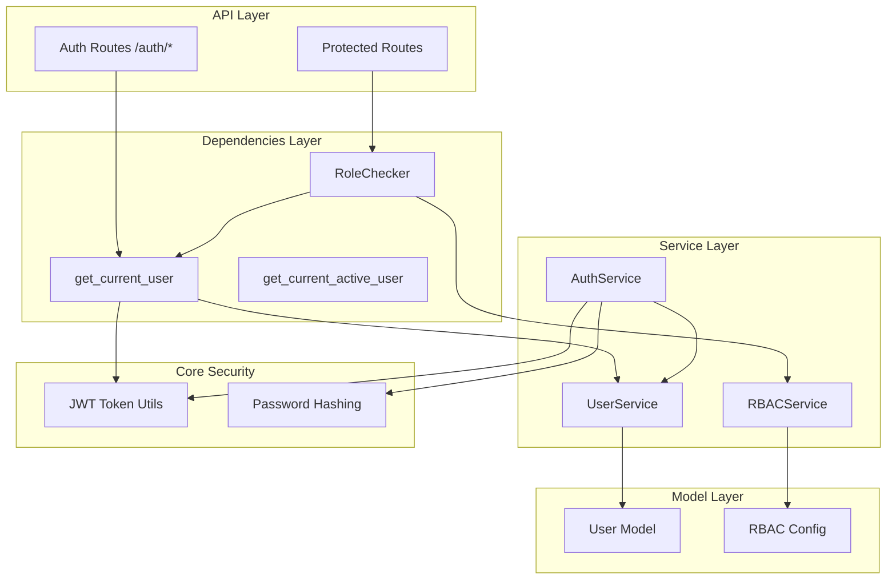
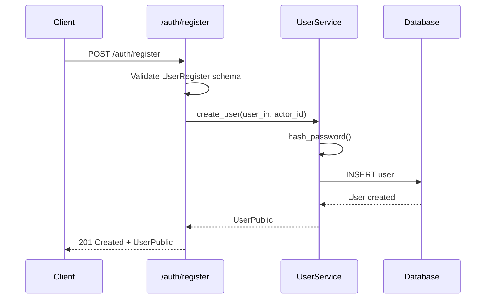
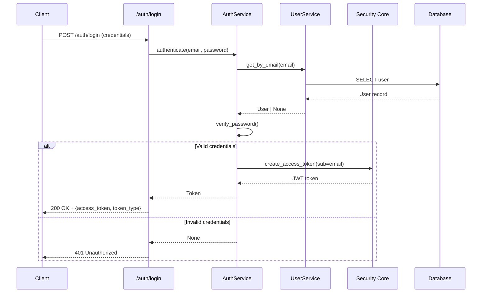
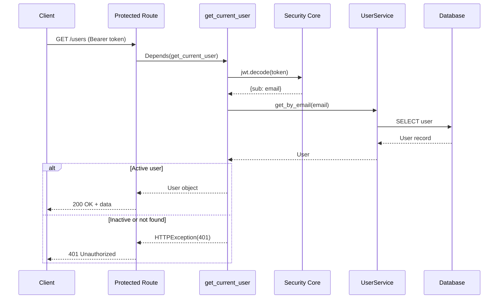
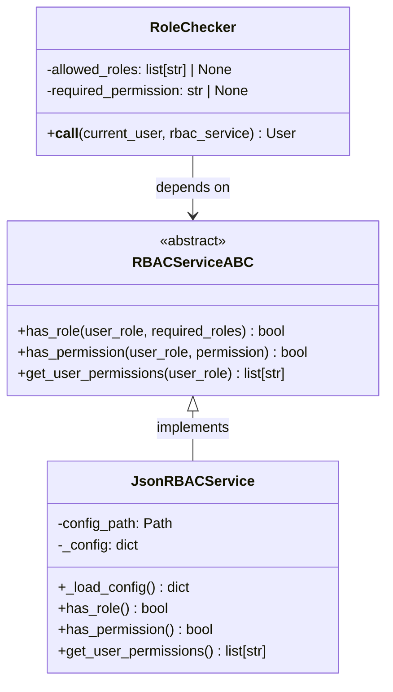
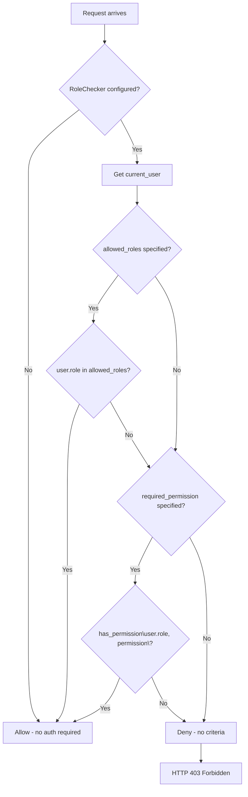

# Authentication & Authorization Architecture

**Last Updated:** 2026-01-04  
**Owner:** Backend Team  
**ADRs:**

- [ADR-007: RBAC Service Design](../../decisions/ADR-007-rbac-service.md)

---

## Responsibility

The Authentication & Authorization (Auth) context provides secure user identity verification and fine-grained access control for the Backcast  system. It enables:

- **User Authentication:** JWT-based token generation and validation
- **Role-Based Access Control (RBAC):** Permission management with resource-specific granularity
- **Declarative Authorization:** FastAPI dependency injection for route protection
- **Extensible Design:** Abstract interface allowing multiple RBAC backends (JSON, database, external services)

---

## Architecture

### Component Overview



### Layer Responsibilities

| Layer            | Responsibility                            | Key Components                                            |
| ---------------- | ----------------------------------------- | --------------------------------------------------------- |
| **API**          | HTTP endpoints for auth operations        | `/auth/register`, `/auth/login`, `/auth/me`               |
| **Dependencies** | Reusable auth/authz checks                | `get_current_user`, `RoleChecker`                         |
| **Service**      | Business logic for auth & user management | `AuthService`, `UserService`, `RBACServiceABC`            |
| **Core**         | Cryptographic operations                  | `create_access_token`, `verify_password`, `hash_password` |
| **Model**        | Data structures                           | `User`, `Token`, `rbac.json`                              |

---

## Authentication Flow

### 1. User Registration



**Key Points:**

- Password hashing performed in `UserService` layer
- Default role: `viewer`
- Actor ID for registration: system UUID (`00000000-0000-0000-0000-000000000000`)

### 2. User Login



**JWT Payload:**

```json
{
  "sub": "user@example.com",
  "exp": "<expiration_timestamp>"
}
```

### 3. Protected Route Access



---

## Authorization (RBAC) Flow

### Architecture

The RBAC system follows an **abstract interface + concrete implementation** pattern:



### Permission Model

**Resource-Specific Permissions** - Format: `{resource}-{action}`

```json
{
  "roles": {
    "admin": {
      "permissions": [
        "user-read",
        "user-create",
        "user-update",
        "user-delete",
        "department-read",
        "department-create",
        "department-update",
        "department-delete"
      ]
    },
    "manager": {
      "permissions": [
        "user-read",
        "user-update",
        "department-read",
        "department-create",
        "department-update"
      ]
    },
    "viewer": {
      "permissions": ["user-read", "department-read"]
    }
  }
}
```

**Benefits:**

- **Granular Control:** Separate read/write access per resource
- **Resource Isolation:** Can grant user access without department access
- **Scalability:** Easy to add new resources with independent permissions
- **Audit Clarity:** Clear understanding of what each permission grants

### RoleChecker Dependency

The `RoleChecker` provides **three authorization modes**:

#### 1. Role-Only Authorization

```python
@router.get("/admin", dependencies=[Depends(RoleChecker(["admin"]))])
async def admin_only_route():
    return {"message": "Admin access"}
```

**Logic:** User's role must be in `allowed_roles` list

#### 2. Permission-Only Authorization

```python
@router.get("/users", dependencies=[Depends(RoleChecker(required_permission="user-read"))])
async def list_users():
    return {"users": [...]}
```

**Logic:** User's role must have the `required_permission`

#### 3. Combined Authorization (OR Logic)

```python
@router.delete(
    "/users/{id}",
    dependencies=[Depends(RoleChecker(["admin"], "user-delete"))]
)
async def delete_user(id: UUID):
    return {"deleted": id}
```

**Logic:** User passes if **either** they have admin role **OR** user-delete permission

### Authorization Decision Flow



---

## Security Components

### JWT Configuration

**Algorithm:** HS256 (HMAC with SHA-256)

**Token Expiration:** 30 minutes (configurable via `settings.ACCESS_TOKEN_EXPIRE_MINUTES`)

**Payload:**

```python
{
    "sub": str,  # Subject (user email)
    "exp": int   # Expiration timestamp
}
```

**Secret Key:** Environment variable `SECRET_KEY` (must be 32+ characters)

### Password Hashing

**Library:** `passlib` with `bcrypt` scheme

**Configuration:**

```python
pwd_context = CryptContext(schemes=["bcrypt"], deprecated="auto")
```

**Functions:**

- `hash_password(password: str) -> str`: Create bcrypt hash
- `verify_password(plain: str, hashed: str) -> bool`: Verify password

---

## Code Locations

### Core Files

```
backend/app/
├── api/
│   ├── dependencies/
│   │   └── auth.py                    # Auth dependencies (get_current_user, RoleChecker)
│   └── routes/
│       ├── auth.py                    # Auth endpoints (/register, /login, /me)
│       ├── users.py                   # User management with RBAC
│       └── departments.py             # Department management with RBAC
├── core/
│   ├── rbac.py                        # RBAC service (RBACServiceABC, JsonRBACService)
│   ├── security.py                    # JWT & password utilities
│   └── config.py                      # Settings (SECRET_KEY, JWT expiry)
├── models/
│   ├── domain/
│   │   └── user.py                    # User ORM model
│   └── schemas/
│       └── user.py                    # Pydantic schemas
└── services/
    ├── auth.py                        # AuthService (login logic)
    └── user.py                        # UserService (CRUD operations)

config/
└── rbac.json                          # RBAC permission configuration
```

### Tests

```
backend/tests/
├── core/
│   └── test_rbac.py                   # Unit tests for RBAC service (18 tests)
└── api/
    └── test_role_checker.py           # Integration tests for RoleChecker (7 tests)
```

---

## Testing Strategy

**Coverage:** 95.56% of `app/core/rbac.py`

**Total Tests:** 18 RBAC tests passing

---

## Related Documentation

- [ADR-007: RBAC Service Design](../../decisions/ADR-007-rbac-service.md)
- [User Management Context](../user-management/architecture.md)
- [Cross-Cutting: Security](../../cross-cutting/security.md)
- [System Map](../../00-system-map.md)

---

## Changelog

| Date       | Change                                              | Author       |
| ---------- | --------------------------------------------------- | ------------ |
| 2026-01-04 | Added RBAC implementation, fine-grained permissions | Backend Team |
| 2025-12-29 | Initial authentication documentation                | Backend Team |
