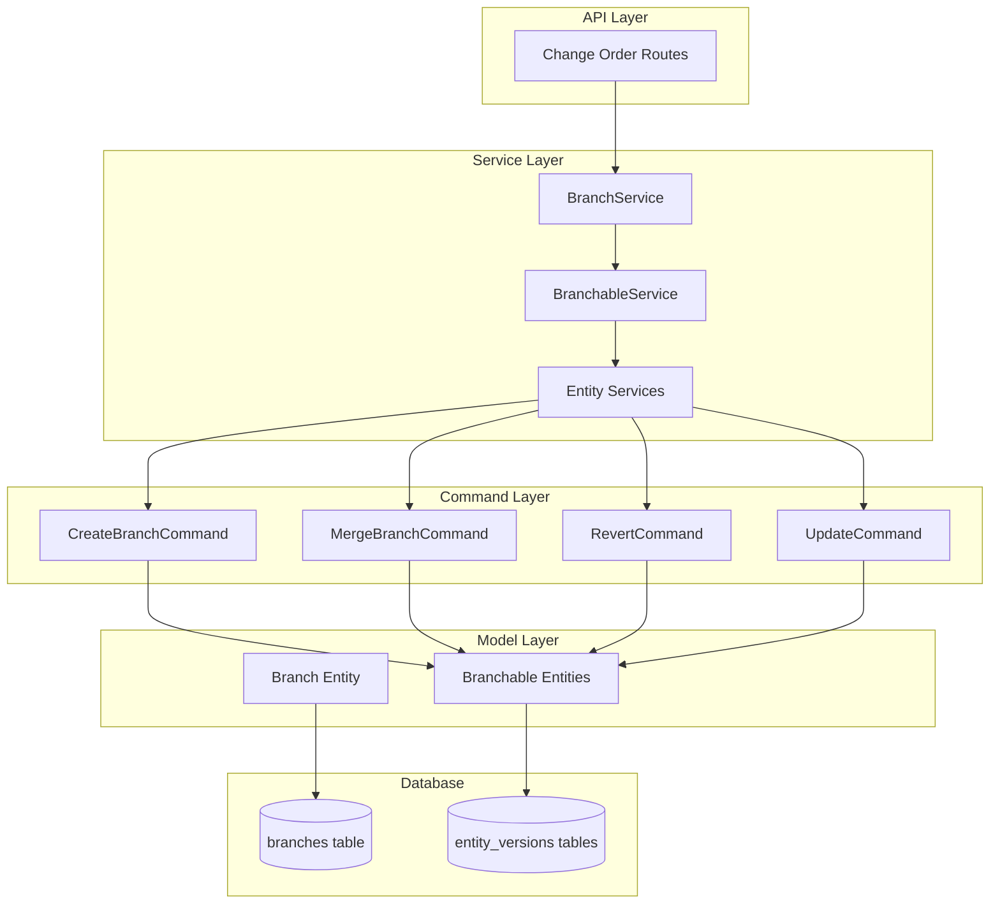
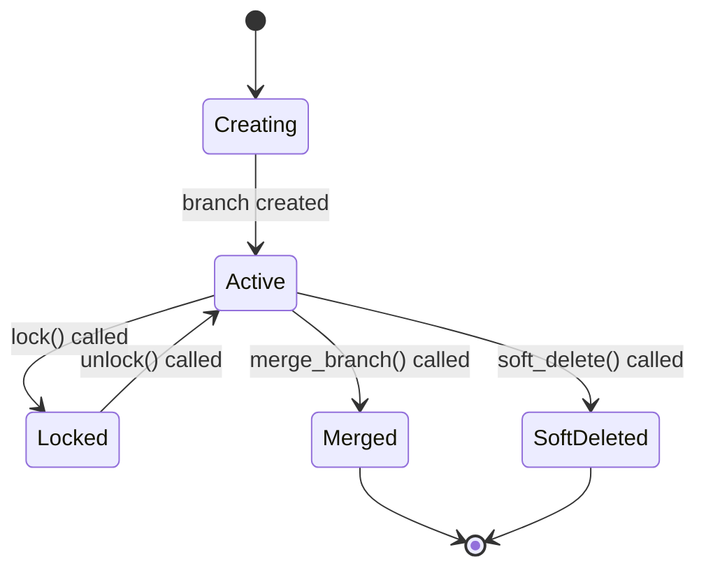
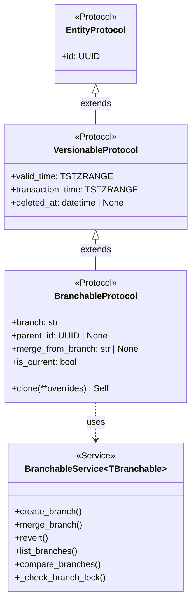
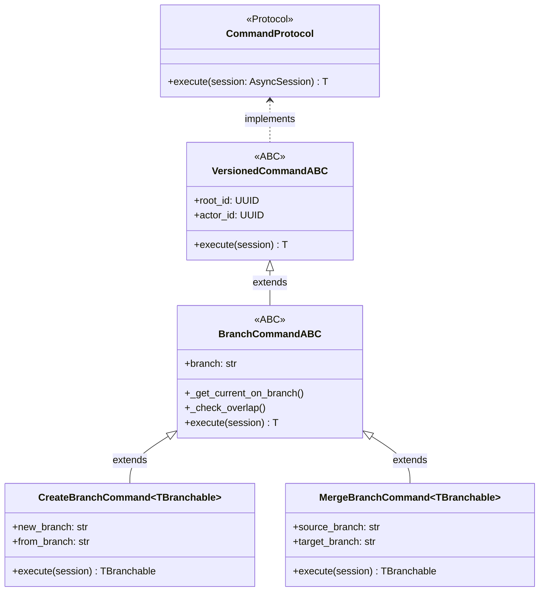

# Branch Management Architecture

**Last Updated:** 2026-04-11
**Owner:** Backend Team
**Related ADRs:** [ADR-005: Bitemporal Versioning](../../../decisions/ADR-005-bitemporal-versioning.md), [ADR-006: Protocol-Based Type System](../../../decisions/ADR-006-protocol-based-type-system.md)

---

## Responsibility

The Branch Management system provides **Git-like branching capabilities** for all branchable entities in the EVCS (Entity Versioning Control System). It enables:

- **Branch Isolation:** Develop changes in isolation without affecting live data
- **Change Orders:** Support formal change order workflows with branch locking
- **Merge Operations:** Combine changes from branches back to main
- **Lock Enforcement:** Prevent modifications during review/approval cycles
- **Lazy Branching:** Entities only branch when modified, reducing storage overhead

**Document Scope:**

This document covers the **Branch Management system architecture**:
- Branch entity model and data structure
- Branch lifecycle (create, lock, unlock, merge)
- Integration with EVCS Core
- Branch-aware service patterns
- Lock enforcement mechanism
- Relationship to change orders

**For implementation details and code examples:**
- Branch operations and service usage → [EVCS Implementation Guide](../evcs-core/evcs-implementation-guide.md)
- Query semantics and time travel → [Temporal Query Reference](../../../cross-cutting/temporal-query-reference.md)
- Choosing entity types → [Entity Classification Guide](../evcs-core/entity-classification.md)

---

## Architecture

### Component Overview



### Layer Responsibilities

| Layer        | Responsibility                            | Key Classes                                                      |
| ------------ | ----------------------------------------- | ---------------------------------------------------------------- |
| **API**      | HTTP endpoints, request/response handling | Change order routes                                              |
| **Service**  | Business logic orchestration              | `BranchService`, `BranchableService[TBranchable]`                 |
| **Command**  | Atomic branching operations               | `CreateBranchCommand`, `MergeBranchCommand`, `RevertCommand`      |
| **Model**    | Data structures, ORM mapping              | `Branch`, branchable entity models                               |
| **Database** | Persistence, indexing, constraints        | PostgreSQL with GIST indexes                                     |

---

## Data Model

### Branch Entity

The `Branch` entity tracks branch metadata and locking state for each project.

**Table:** `branches`

| Field            | Type       | Description                                                      |
| ---------------- | ---------- | ---------------------------------------------------------------- |
| `id`             | UUID       | Primary key (version identifier)                                 |
| `name`           | VARCHAR(80)| Branch name (e.g., 'main' or 'BR-CO-2026-001')                    |
| `project_id`     | UUID       | Project this branch belongs to (composite key with name)         |
| `branch_id`      | UUID       | Stable branch identifier (independent of name/project)           |
| `type`           | VARCHAR(20)| Branch type ('main' or 'change_order')                           |
| `locked`         | BOOLEAN    | Whether branch is locked (prevents writes)                       |
| `branch_metadata`| JSONB      | Additional branch information (optional)                         |
| `valid_time`     | TSTZRANGE  | Business validity period (inherited from VersionableMixin)       |
| `transaction_time`| TSTZRANGE | System transaction time (inherited from VersionableMixin)        |
| `deleted_at`     | TIMESTAMPTZ| Soft delete timestamp (inherited from VersionableMixin)        |
| `created_by`     | UUID       | User who created the branch (inherited from VersionableMixin)    |

**Key Constraints:**

- **Composite Unique Key:** `(name, project_id)` - Same branch name can exist in different projects
- **Project-Scoped:** Branches are isolated per project
- **Main Branch:** Always exists, never locked
- **Change Order Branches:** Can be locked during review/approval

### Branchable Entities

All entities implementing `BranchableProtocol` support branching:

| Entity    | Table              | Root Field     |
| --------- | ------------------ | ------------- |
| Project   | `project_versions` | `project_id`  |
| WBE       | `wbe_versions`     | `wbe_id`      |
| CostElement | `cost_element_versions` | `cost_element_id` |

**Additional Branch Fields:**

| Field             | Type    | Description                                            |
| ----------------- | ------- | ------------------------------------------------------ |
| `branch`          | VARCHAR | Branch name (default: "main")                          |
| `parent_id`       | UUID    | Previous version ID (for version chain)                 |
| `merge_from_branch`| VARCHAR| Source branch if this version resulted from a merge    |

---

## Branch Lifecycle

### Branch States



### State Descriptions

| State      | Description                                                                 |
| ---------- | ------------------------------------------------------------------------- |
| **Creating** | Branch is being initialized, entity versions are being cloned             |
| **Active**  | Branch is open for modifications (default state after creation)            |
| **Locked**  | Branch is locked, all modifications prevented                              |
| **Merged**  | Branch has been merged into target (typically main)                        |
| **SoftDeleted** | Branch has been soft-deleted (reversible)                                 |

### Branch Operations

#### 1. Create Branch

Creates a new branch by cloning the current version from a source branch.

**Command:** `CreateBranchCommand`

**Process:**

1. Check for overlaps on new branch
2. Get current version from source branch
3. Clone to new branch with modified `branch` field
4. Set `parent_id` to source version ID
5. Set `valid_time` and `transaction_time` ranges

**Example:**

```python
await branchable_service.create_branch(
    root_id=project_id,
    actor_id=user_id,
    new_branch="BR-CO-2026-001",
    from_branch="main"
)
```

**Lazy Branching:** Entities are only copied to the new branch when they are modified. This reduces storage overhead by avoiding copying unchanged entities.

#### 2. Lock Branch

Locks a branch to prevent modifications during review/approval.

**Service:** `BranchService.lock()`

**Process:**

1. Get branch by name and project_id
2. Create new version with `locked=True`
3. Use `UpdateVersionCommand` for temporal correctness

**Example:**

```python
await branch_service.lock(
    name="BR-CO-2026-001",
    project_id=project_id,
    actor_id=user_id
)
```

**Enforcement:** All modification operations (create, update, delete) check branch lock status before proceeding. Main branch is never locked.

#### 3. Unlock Branch

Unlocks a branch to allow modifications.

**Service:** `BranchService.unlock()`

**Process:**

1. Get branch by name and project_id
2. Create new version with `locked=False`
3. Use `UpdateVersionCommand` for temporal correctness

**Example:**

```python
await branch_service.unlock(
    name="BR-CO-2026-001",
    project_id=project_id,
    actor_id=user_id
)
```

#### 4. Merge Branch

Merges source branch into target branch using overwrite strategy.

**Command:** `MergeBranchCommand`

**Process:**

1. Get current version from source branch
2. Get current version from target branch
3. Clone source to target with modified `branch` field
4. Set `parent_id` to target version ID
5. Set `merge_from_branch` to source branch name
6. Close target version
7. Set temporal ranges on merged version

**Example:**

```python
await branchable_service.merge_branch(
    root_id=project_id,
    actor_id=user_id,
    source_branch="BR-CO-2026-001",
    target_branch="main"
)
```

**Conflict Detection:** The system can detect merge conflicts by comparing parent chains and field values between source and target branches.

#### 5. Revert

Reverts a branch to a previous version state.

**Command:** `RevertCommand`

**Process:**

1. Get current version on branch
2. Get target version (specified or parent)
3. Clone target to new version
4. Set `parent_id` to current version ID (linear history)
5. Close current version
6. Set temporal ranges on reverted version

**Example:**

```python
await branchable_service.revert(
    root_id=project_id,
    actor_id=user_id,
    branch="main",
    to_version_id=previous_version_id
)
```

---

## Lock Enforcement

### Mechanism

Branch locks are enforced at the **service layer** by `BranchableService` before any modification operation.

**Check Methods:**

1. **`_check_branch_lock()`** - For update/delete operations on existing entities
2. **`_check_branch_lock_for_create()`** - For create operations on new entities

**Process:**

1. Skip check if branch is "main" (never locked)
2. Get entity to extract `project_id`
3. Query `branches` table for branch lock status
4. Raise `BranchLockedException` if locked

**Exception Details:**

```python
class BranchLockedException(Exception):
    """Raised when attempting to modify an entity on a locked branch."""
    
    def __init__(
        self,
        branch: str,
        entity_type: str = "entity",
        entity_id: str | None = None,
    ) -> None:
        # Message includes branch, entity type, and entity_id
```

### Enforced Operations

| Operation  | Checked | Exception Raised      |
| ---------- | ------- | --------------------- |
| `create_root()` | ✅ Yes   | `BranchLockedException` |
| `update()`     | ✅ Yes   | `BranchLockedException` |
| `soft_delete()`| ✅ Yes   | `BranchLockedException` |
| `get_as_of()`  | ❌ No    | N/A (read operations) |

### Use Case: Change Order Workflow

1. **Create Change Order** → Create branch `BR-CO-2026-001`
2. **Make Changes** → Modify entities on branch
3. **Submit for Review** → Lock branch
4. **Review Period** → All modifications blocked
5. **Approve/Reject** → Unlock branch
6. **If Approved** → Merge to main
7. **If Rejected** → Delete or continue working

---

## Integration with EVCS Core

### Type System

The Branch Management system extends the EVCS Core type hierarchy:



### Command Hierarchy

Branch commands extend the EVCS command pattern:



### Service Integration

**BranchService:**

- Extends `TemporalService[Branch]`
- Provides lock/unlock operations
- Retrieves branches by composite key (name, project_id)
- Supports time travel queries for branch state

**BranchableService[TBranchable]:**

- Generic service for all branchable entities
- Provides branch-aware CRUD operations
- Enforces branch locks before modifications
- Supports branch mode filtering (STRICT vs MERGE)

---

## Branch Modes

### STRICT Mode

**Behavior:** Only query the specified branch.

```python
result = await service.get_as_of(
    entity_id=project_id,
    as_of=some_date,
    branch="feature-branch-123",
    branch_mode=BranchMode.STRICT
)
```

**Use Case:** Change order preview - see only what's changed in this CO.

### MERGE Mode

**Behavior:** Falls back to `main` branch if not found in specified branch. Uses `DISTINCT ON` to merge results with branch precedence.

```python
result = await service.get_as_of(
    entity_id=project_id,
    as_of=some_date,
    branch="feature-branch-123",
    branch_mode=BranchMode.MERGE
)
```

**Use Case:** "What-if" analysis - show base project with CO changes overlaid.

**Exclusion Logic:** Main branch entities are excluded if they were soft-deleted on the current branch.

---

## Relationship to Change Orders

### Change Order Branching Pattern

Change Orders (COs) use the Branch Management system for isolation:

1. **CO Creation:** Create branch `BR-CO-{year}-{sequence}`
2. **CO Branch Type:** Set `type='change_order'` in Branch entity
3. **CO Isolation:** All modifications happen on CO branch
4. **CO Lock:** Lock branch during review/approval
5. **CO Merge:** Merge approved changes to main
6. **CO Archive:** Soft-delete or archive branch after completion

### Branch Naming Convention

**Format:** `BR-CO-{year}-{sequence}`

**Examples:**

- `BR-CO-2026-001` - First change order of 2026
- `BR-CO-2026-042` - Forty-second change order of 2026

**Main Branch:** Always named `"main"` and has `type='main'`

---

## Code Locations

### Core Branching Module

- **Exceptions:** `app/core/branching/exceptions.py` - Branch-specific exceptions
- **Commands:** `app/core/branching/commands.py` - Branch command implementations
- **Service:** `app/core/branching/service.py` - `BranchableService[TBranchable]`

### Branch Entity

- **Model:** `app/models/domain/branch.py` - Branch entity definition
- **Service:** `app/services/branch_service.py` - Branch-specific operations

### Related EVCS Core

- **Protocols:** `app/models/protocols.py` - `BranchableProtocol`
- **Mixins:** `app/models/mixins.py` - `BranchableMixin`
- **Base Commands:** `app/core/versioning/commands.py` - Base command ABCs
- **Base Services:** `app/core/versioning/service.py` - `TemporalService[TVersionable]`

### Tests

- **Unit:** `backend/tests/unit/core/branching/` - Branch command tests
- **Unit:** `backend/tests/unit/services/test_branch_service.py` - Branch service tests
- **Unit:** `backend/tests/unit/core/branching/test_branch_lock_enforcement.py` - Lock enforcement tests
- **Integration:** `backend/tests/integration/test_integration_branch_service.py` - Integration tests
- **API:** `backend/tests/api/routes/change_orders/test_branch_creation.py` - API-level tests

---

## Performance Considerations

### Indexing Strategy

**Branches Table:**

| Index           | Fields                    | Purpose                      |
| --------------- | ------------------------- | ---------------------------- |
| Primary Key     | `id`                      | Version identifier lookup    |
| Composite Index | `(name, project_id)`      | Branch retrieval by composite key |
| Index           | `project_id`              | List all branches for project |
| Index           | `branch_id`               | Stable identifier lookup     |

**Entity Version Tables:**

| Index           | Fields                                    | Purpose                      |
| --------------- | ----------------------------------------- | ---------------------------- |
| GIST Index      | `valid_time`                              | Temporal range queries       |
| GIST Index      | `transaction_time`                        | Transaction time queries     |
| B-Tree Index    | `(root_id, branch)`                       | Branch-specific queries      |
| Partial Index   | `(root_id, branch) WHERE upper(valid_time) IS NULL` | Current version queries   |

### Query Optimization

1. **Lazy Branching:** Only create entity versions when modified
2. **Partial Indexes:** Current versions indexed separately for faster queries
3. **DISTINCT ON:** Used in MERGE mode for efficient branch merging
4. **Overlap Checking:** Performed before inserts to prevent constraint violations

---

## Common Pitfalls

### 1. Using `root_id` Instead of `branch_id`

```python
# ❌ Wrong: Using root_id for branch operations
await branch_service.lock(
    name="BR-CO-2026-001",
    project_id=project_id,  # This is correct
    actor_id=user_id
)

# ❌ Wrong: Using branch_id as entity root_id
wbe = await wbe_service.get_by_id(branch.branch_id)  # Incorrect!

# ✅ Correct: branch_id is only for Branch entity operations
# Use root_id (e.g., wbe_id) for entity operations
```

**Why:** `branch_id` is the stable identifier for the Branch entity itself, not for entities on that branch.

### 2. Forgetting Branch Lock Check

```python
# ❌ Wrong: Bypassing branch lock check
async def custom_update(entity_id, data):
    # Direct update without checking lock
    return await session.execute(update_stmt)

# ✅ Correct: Using BranchableService which checks locks
async def custom_update(entity_id, data, branch):
    return await branchable_service.update(
        root_id=entity_id,
        actor_id=user_id,
        branch=branch,
        **data
    )
```

**Why:** Branch locks must be enforced at the service layer to prevent unauthorized modifications.

### 3. Not Respecting MERGE Mode Deletions

```python
# ❌ Wrong: Not checking for deletions on current branch
if not result_on_branch:
    result = await get_from_main()

# ✅ Correct: Check if entity was deleted on current branch
result_on_branch = await get_from_branch()
if not result_on_branch:
    is_deleted = await check_deleted_on_branch()
    if is_deleted:
        return None  # Don't fall back to main
    result = await get_from_main()
```

**Why:** Soft-deleted entities on a branch should not fall back to main in MERGE mode.

---

## See Also

### Related Guides

- [EVCS Core Architecture](../evcs-core/architecture.md) - Complete EVCS system architecture
- [EVCS Implementation Guide](../evcs-core/evcs-implementation-guide.md) - Code patterns and recipes
- [Temporal Query Reference](../../../cross-cutting/temporal-query-reference.md) - Bitemporal queries and time travel
- [Entity Classification Guide](../evcs-core/entity-classification.md) - Choosing entity types

### Architecture Decisions

- [ADR-005: Bitemporal Versioning](../../../decisions/ADR-005-bitemporal-versioning.md) - Bitemporal pattern decision
- [ADR-006: Protocol-Based Type System](../../../decisions/ADR-006-protocol-based-type-system.md) - Type system design

### Cross-Cutting

- [Database Strategy](../../../cross-cutting/database-strategy.md) - TSTZRANGE usage and indexing
- [API Conventions](../../../cross-cutting/api-conventions.md) - Branch-aware API patterns
