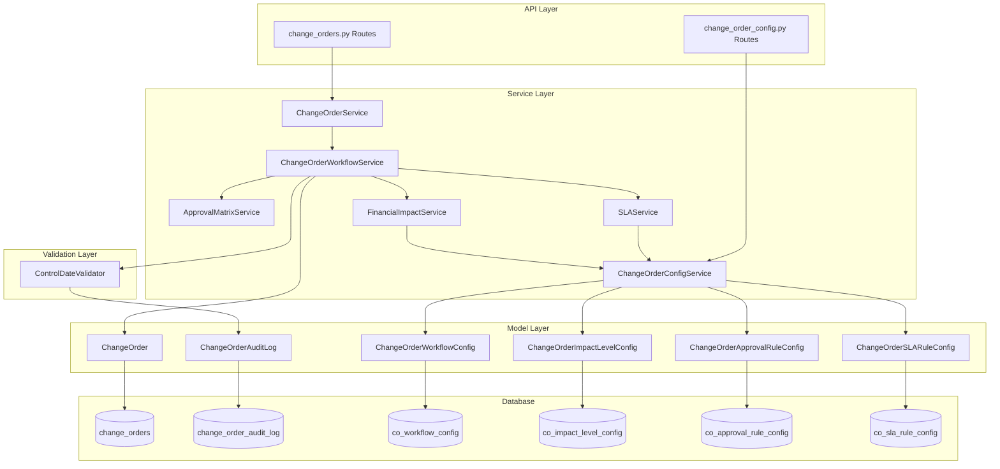
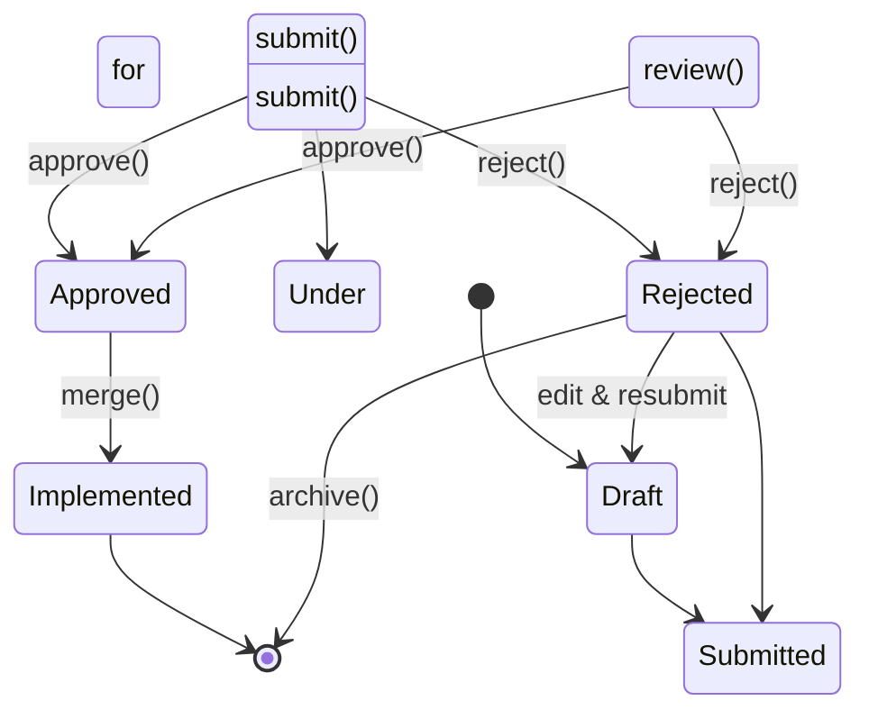

# Change Order Workflow Validation Architecture

**Last Updated:** 2026-05-09
**Owner:** Backend Team
**Related ADRs:** [ADR-007: RBAC Service](../../decisions/ADR-007-rbac-service.md)

---

## Responsibility

The Change Order Workflow Validation system manages state transitions for Change Orders through their approval lifecycle. It provides:

- **State Machine Validation:** Enforces valid status transitions between workflow states
- **Transition Authorization:** Validates user authority to approve/reject based on impact levels
- **Audit Trail:** Records all status transitions with timestamps, actors, and comments
- **Branch Locking:** Locks branches on submission to prevent modifications during approval
- **SLA Tracking:** Calculates and tracks approval deadlines based on financial impact (configurable)
- **Control Date Validation:** Ensures workflow operations occur in chronological order
- **Configurable Workflow:** All thresholds, SLA deadlines, approval rules, and impact weights are stored in the database and can be updated without code changes

**Document Scope:**

This document covers the workflow validation architecture:
- Workflow states and valid transitions
- State machine implementation
- Validation rules and business logic
- Integration with approval matrix and SLA services
- Audit logging and control date sequence validation
- API endpoints and service layer organization

---

## Architecture

### Component Overview



### Layer Responsibilities

| Layer | Responsibility | Key Classes |
|-------|---------------|-------------|
| **API** | HTTP endpoints, request/response handling | `change_orders.py`, `change_order_config.py` routers |
| **Service** | Business logic orchestration, state transitions | `ChangeOrderWorkflowService`, `ChangeOrderService`, `ChangeOrderConfigService` |
| **Validation** | Control date sequence validation | `ControlDateValidator` |
| **Model** | Data structures, ORM mapping | `ChangeOrder`, `ChangeOrderAuditLog`, config models |
| **Database** | Persistence, indexing, constraints | PostgreSQL with audit log, config tables |

---

## Workflow States

### State Definition

Change Orders progress through the following workflow states (from FR-8.3):



### State Descriptions

| State | Description | Editable | Branch Locked |
|-------|-------------|----------|---------------|
| **Draft** | Initial state, change order being prepared | Yes | No |
| **Submitted for Approval** | Pending approver review, SLA tracking active | No | Yes |
| **Under Review** | Approvers actively reviewing | No | Yes |
| **Approved** | Approved, ready for implementation | No | Yes |
| **Rejected** | Rejected, can be edited and resubmitted | Yes | No |
| **Implemented** | Merged to main branch, terminal state | No | Yes |

### Valid Transitions

The workflow service enforces these valid state transitions:

| From State | Valid To States | Transition Type |
|------------|-----------------|----------------|
| `Draft` | `Submitted for Approval` | Linear, locks branch |
| `Submitted for Approval` | `Under Review`, `Approved`, `Rejected` | Branching |
| `Under Review` | `Approved`, `Rejected` | Branching |
| `Rejected` | `Draft`, `Submitted for Approval` | Branching, unlocks branch |
| `Approved` | `Implemented` | Linear, terminal |
| `Implemented` | *(Terminal)* | None |

---

## State Machine Implementation

### Transition Rules

The state machine is implemented in `ChangeOrderWorkflowService` with these transition rules:

```python
_TRANSITIONS: dict[str, list[str]] = {
    "Draft": ["Submitted for Approval"],
    "Submitted for Approval": ["Under Review", "Approved", "Rejected"],
    "Under Review": ["Approved", "Rejected"],
    "Rejected": ["Draft", "Submitted for Approval"],
    "Approved": ["Implemented"],
    "Implemented": [],  # Terminal state
}
```

### Branch Locking Rules

Certain transitions trigger branch locking/unlocking to prevent concurrent modifications:

```python
_LOCK_TRANSITIONS: set[tuple[str, str]] = {
    ("Draft", "Submitted for Approval"),  # Lock on submission
}

_UNLOCK_TRANSITIONS: set[tuple[str, str]] = {
    ("Under Review", "Rejected"),  # Unlock on rejection
}
```

### Editable Status Rules

Change Orders can only be edited in specific states:

```python
_EDITABLE_STATUSES: set[str] = {"Draft", "Rejected"}
```

---

## Validation Rules

### 1. Transition Validation

**Rule:** All state transitions must be defined in the `_TRANSITIONS` mapping.

**Implementation:**
```python
async def is_valid_transition(self, from_status: str, to_status: str) -> bool:
    valid_options = self._TRANSITIONS.get(from_status, [])
    return to_status in valid_options
```

**Enforcement:** All workflow operations check `is_valid_transition()` before applying changes.

### 2. Approver Authority Validation

**Rule:** Users can only approve/reject change orders if their authority level meets or exceeds the required authority for the impact level, AND they are the assigned approver for that specific change order.

**Authority Hierarchy:**
```
CRITICAL (4) > HIGH (3) > MEDIUM (2) > LOW (1)
```

**Role to Authority Mapping:**
- `admin` role → CRITICAL authority
- `manager` role → HIGH authority
- `viewer` role → LOW authority

**Assigned Approver Check:** The approver must match the `assigned_approver_id` on the change order. This prevents unauthorized users from approving even if they have sufficient authority level.

**Implementation:** `ApprovalMatrixService.can_approve(actor, change_order)` + `ChangeOrderService` validates `co.assigned_approver_id == approver_id`

### 3. Control Date Sequence Validation

**Rule:** Workflow operations must occur in chronological order based on `control_date`. Each operation's `control_date` must be >= the previous operation's `control_date`.

**Purpose:** Prevents temporal inconsistencies when working with historical data or performing bulk operations.

**Implementation:** `ControlDateValidator.validate_control_date_sequence()`

**Exception:** `ControlDateSequenceViolationError` raised with details:
```python
Cannot perform workflow operation at control_date 2026-04-10:
previous operation was recorded at 2026-04-11.
Operations must be performed in chronological order.
```

### 4. Impact Level-Based Validation

**Impact Levels (default configuration):**
- `LOW`: < €10,000 (Project Manager approval)
- `MEDIUM`: €10,000 - €50,000 (Department Head approval)
- `HIGH`: €50,000 - €100,000 (Director approval)
- `CRITICAL`: > €100,000 (Executive Committee approval)

> **Configurable:** All thresholds, score boundaries, and approval rules are stored in `ChangeOrderWorkflowConfig` and can be updated at runtime without code changes. Per-project overrides are supported via `project_id` on the config record.

**Validation:** Impact level is calculated at submission time (not creation time) via `FinancialImpactService.calculate_impact_level()`, which reads thresholds and score boundaries from `ChangeOrderConfigService`. The impact analysis compares the isolation branch against the main branch to determine actual financial deltas.

### 5. SLA Deadline Validation

**SLA Deadlines (default configuration):**
- `LOW`: 2 business days
- `MEDIUM`: 5 business days
- `HIGH`: 10 business days
- `CRITICAL`: 15 business days

> **Configurable:** SLA deadlines are stored in `ChangeOrderSLARuleConfig` and read at runtime by `SLAService` via `ChangeOrderConfigService`.

**Implementation:** `SLAService.calculate_sla_deadline()` calculates deadlines based on impact level and submission time using config-driven SLA rules.

**SLA Status Tracking:**
- `pending`: More than 50% of SLA time remaining
- `approaching`: Less than 50% of SLA time remaining
- `escalated`: Manually escalated by authorized user via `/escalate` endpoint
- `overdue`: Past SLA due date

---

## Audit Logging

### Audit Log Model

All status transitions are recorded in `ChangeOrderAuditLog`:

| Field | Type | Description |
|-------|------|-------------|
| `id` | UUID (PK) | Unique audit log entry identifier |
| `change_order_id` | UUID (FK, Index) | Root UUID of the Change Order |
| `old_status` | VARCHAR(50) | Previous status value |
| `new_status` | VARCHAR(50) | New status value |
| `comment` | TEXT | Optional comment explaining the transition |
| `changed_by` | UUID (FK, Index) | User who made the change |
| `changed_at` | TIMESTAMPTZ | When the change was made (system time) |
| `control_date` | TIMESTAMPTZ | Control date for workflow sequence validation |

### Audit Log Creation

Audit entries are created automatically by workflow operations:

```python
audit_entry = ChangeOrderAuditLog(
    change_order_id=change_order_id,
    old_status="Draft",
    new_status="Submitted for Approval",
    comment=f"Submitted for approval. Impact level: {impact_level}",
    changed_by=actor_id,
)
db_session.add(audit_entry)
```

### Control Date Sequence Validation

The `control_date` field ensures workflow operations occur in chronological order:

1. **Query Last Operation:** Get the most recent `control_date` from audit log
2. **Validate Sequence:** Check new `control_date` >= last `control_date`
3. **Raise Exception:** If sequence violated, raise `ControlDateSequenceViolationError`

**Use Cases:**
- Preventing accidental out-of-order operations
- Ensuring data consistency in bulk imports
- Supporting time-travel scenarios with proper sequencing

---

## Service Layer Organization

### ChangeOrderWorkflowService

**Purpose:** State machine and workflow orchestration.

**Key Methods:**

| Method | Purpose |
|--------|---------|
| `submit_for_approval()` | Calculate impact, assign approver, set SLA, lock branch |
| `approve_change_order()` | Validate authority, approve, create audit entry |
| `reject_change_order()` | Validate authority, reject, clear SLA, unlock branch |
| `is_valid_transition()` | Check if transition is allowed |
| `get_available_transitions()` | Get all valid next states |
| `should_lock_on_transition()` | Check if branch should be locked |
| `should_unlock_on_transition()` | Check if branch should be unlocked |
| `can_edit_on_status()` | Check if CO is editable in current status |

### ChangeOrderService

**Purpose:** CRUD operations and workflow integration.

**Key Workflow Methods:**

| Method | Purpose |
|--------|---------|
| `submit_for_approval()` | Orchestrates submission via workflow service |
| `approve_change_order()` | Orchestrates approval via workflow service |
| `reject_change_order()` | Orchestrates rejection via workflow service |
| `recover_change_order()` | Admin recovery for stuck workflows |
| `archive_change_order_branch()` | Archive implemented/rejected COs |

### ApprovalMatrixService

**Purpose:** Approver authority validation and assignment.

**Key Methods:**

| Method | Purpose |
|--------|---------|
| `get_approver_for_impact()` | Find eligible approver for impact level |
| `can_approve()` | Validate user authority for specific CO |
| `get_user_authority_level()` | Get user's authority level from role |
| `get_authority_for_impact()` | Get required authority for impact level |

### SLAService

**Purpose:** SLA deadline calculation.

**Key Methods:**

| Method | Purpose |
|--------|---------|
| `calculate_sla_deadline()` | Calculate deadline from impact level and start date |
| `escalate_change_order()` | Manually escalate SLA status for a change order |

### FinancialImpactService

**Purpose:** Calculate financial impact level.

**Key Methods:**

| Method | Purpose |
|--------|---------|
| `calculate_impact_level()` | Determine impact level from CO changes |

### ChangeOrderConfigService

**Purpose:** Manage and retrieve configurable workflow parameters.

**Key Methods:**

| Method | Purpose |
|--------|---------|
| `get_active_config()` | Get effective config (project override or global) |
| `get_global_config()` | Retrieve global workflow configuration |
| `get_project_config()` | Retrieve project-specific override |
| `get_thresholds()` | Get financial impact thresholds |
| `get_sla_days()` | Get SLA deadlines per impact level |
| `get_approval_matrix()` | Get approval authority mapping |
| `get_score_boundaries()` | Get impact score classification boundaries |
| `get_impact_weights()` | Get weights for impact score formula |
| `classify_impact_by_score()` | Classify impact level from numeric score |
| `generate_snapshot()` | Create config snapshot for submission |
| `update_config()` | Update global configuration (optimistic locking) |
| `create_project_override()` | Create per-project configuration override |
| `delete_project_override()` | Remove project override, revert to global |
| `get_workflow_transitions()` | Get configurable workflow transition rules for a project |

---

## API Endpoints

### Workflow Operations

| Endpoint | Method | Purpose | Permission |
|----------|--------|---------|------------|
| `/change-orders/{id}/submit-for-approval` | PUT | Submit CO for approval | `change-order-update` |
| `/change-orders/{id}/approve` | PUT | Approve CO | `change-order-approve` |
| `/change-orders/{id}/reject` | PUT | Reject CO | `change-order-approve` |
| `/change-orders/{id}/recover` | POST | Recover stuck workflow (admin) | `change-order-recover` |
| `/change-orders/{id}/archive` | POST | Archive CO branch | `change-order-update` |
| `/change-orders/{id}/escalate` | POST | Manually escalate SLA status | `change-order-escalate` |

### Query Endpoints

| Endpoint | Method | Purpose | Permission |
|----------|--------|---------|------------|
| `/change-orders/pending-approvals` | GET | Get pending approvals for user | `change-order-read` |
| `/change-orders/{id}/approval-info` | GET | Get approval details and authority | `change-order-read` |

### Configuration Endpoints

| Endpoint | Method | Purpose | Permission |
|----------|--------|---------|------------|
| `/change-order-config/global` | GET | Get global workflow configuration | `change-order-read` |
| `/change-order-config/global` | PUT | Upsert global workflow configuration | `change-order-workflow-config-manage` |
| `/change-order-config/projects/{id}` | GET | Get project-specific configuration | `change-order-read` |
| `/change-order-config/projects/{id}` | PUT | Upsert project configuration override | `change-order-workflow-config-override` |
| `/change-order-config/projects/{id}` | DELETE | Delete project override (revert to global) | `change-order-workflow-config-override` |

---

## Integration Points

### Used By

- **Change Order API Routes** (`change_orders.py`) - Workflow endpoint handlers
- **Change Order Service** (`change_order_service.py`) - Workflow method delegation
- **Frontend Dashboard** - Workflow status display and action buttons
- **Reporting Service** - Workflow analytics and SLA tracking

### Provides

- **State Machine:** Valid transitions, branch locking rules
- **Validation:** Transition validation, authority checks, control date sequence
- **Audit Trail:** Complete history of all status changes
- **SLA Tracking:** Deadline calculation and status tracking

### External Dependencies

| Service | Purpose |
|---------|---------|
| `ApprovalMatrixService` | Approver assignment and authority validation |
| `SLAService` | SLA deadline calculation (reads from config) |
| `FinancialImpactService` | Impact level calculation (reads from config) |
| `ChangeOrderService` | CRUD operations and version management |
| `ChangeOrderConfigService` | Configurable workflow parameters |

---

## Error Handling

### Common Exceptions

| Exception | When Raised | HTTP Status |
|-----------|-------------|-------------|
| `ControlDateSequenceViolationError` | Workflow operation violates chronological order | 400 Bad Request |
| `ValueError` | Invalid transition, insufficient authority, CO not found | 400 Bad Request |
| `HTTPException` | CO not found, validation errors | 404/400 |

### Error Response Format

```json
{
  "detail": "Cannot perform workflow operation at control_date 2026-04-10: "
            "previous operation was recorded at 2026-04-11. "
            "Operations must be performed in chronological order."
}
```

---

## Code Locations

### Services
- **Workflow Service:** `app/services/change_order_workflow_service.py`
- **Workflow Validation:** `app/services/change_order_workflow_validation.py`
- **Change Order Service:** `app/services/change_order_service.py`
- **Config Service:** `app/services/change_order_config_service.py`
- **Approval Matrix Service:** `app/services/approval_matrix_service.py`
- **SLA Service:** `app/services/sla_service.py`
- **Reporting Service:** `app/services/change_order_reporting_service.py`
- **Financial Impact Service:** `app/services/financial_impact_service.py`

### Models
- **Change Order:** `app/models/domain/change_order.py`
- **Change Order Audit Log:** `app/models/domain/change_order_audit_log.py`
- **Workflow Config:** `app/models/domain/change_order_config.py`
- **User:** `app/models/domain/user.py`

### API Routes
- **Change Orders:** `app/api/routes/change_orders.py`
- **Config:** `app/api/routes/change_order_config.py`

### Tests
- **Workflow Service Unit Tests:** `tests/unit/services/test_change_order_workflow_service.py`
- **Workflow Validation Unit Tests:** `tests/unit/services/test_change_order_workflow_validation.py`
- **Config Service Unit Tests:** `tests/unit/services/test_change_order_config_service.py`
- **Config Integration Tests:** `tests/integration/services/test_change_order_config_lifecycle.py`
- **SLA Service Unit Tests:** `tests/unit/services/test_sla_service.py`
- **Workflow Integration Tests:** `tests/integration/test_change_order_workflow_full_temporal.py`
- **Approval Workflow Tests:** `tests/integration/ai/test_approval_workflow.py`

---

## See Also

### Related Architecture

- [EVCS Core Architecture](../evcs-core/architecture.md) - Versioning and branching system
- [Project Management Architecture](../project-management/architecture.md) - Project entity structure
- [Branching Architecture](../branching/architecture.md) - Branch management

### Architecture Decisions

- [ADR-007: RBAC Service](../../decisions/ADR-007-rbac-service.md) - Role-based access control

### Cross-Cutting

- [API Conventions](../../cross-cutting/api-conventions.md) - API design patterns
- [API Response Patterns](../../cross-cutting/api-response-patterns.md) - Response formatting
- [Temporal Query Reference](../../cross-cutting/temporal-query-reference.md) - Time travel queries
