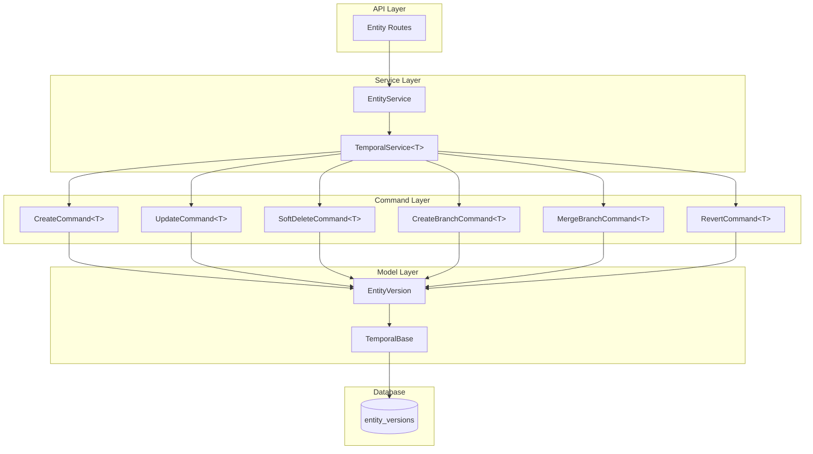
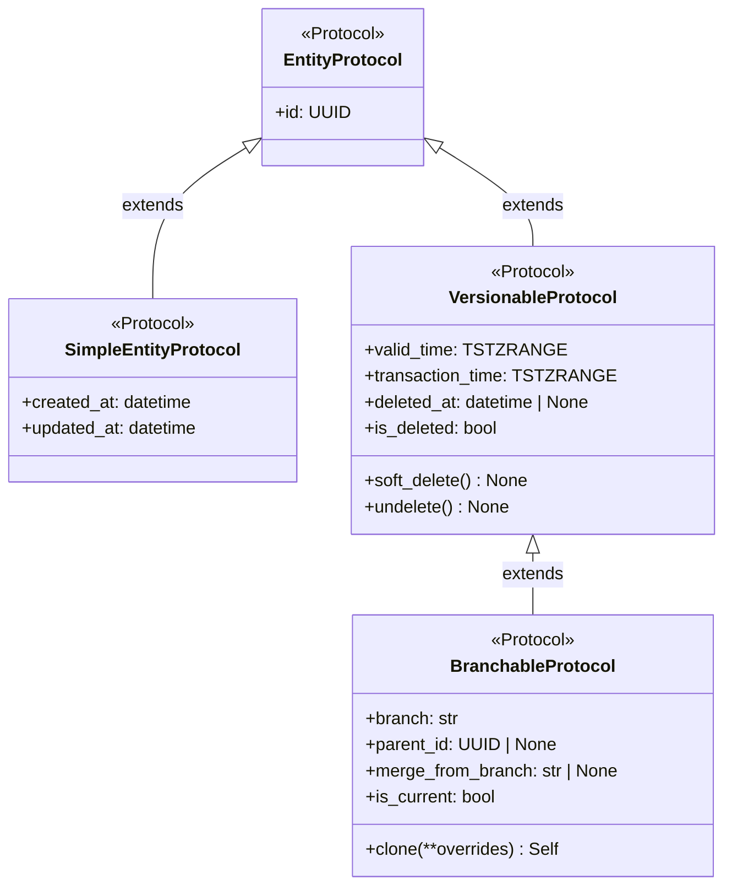
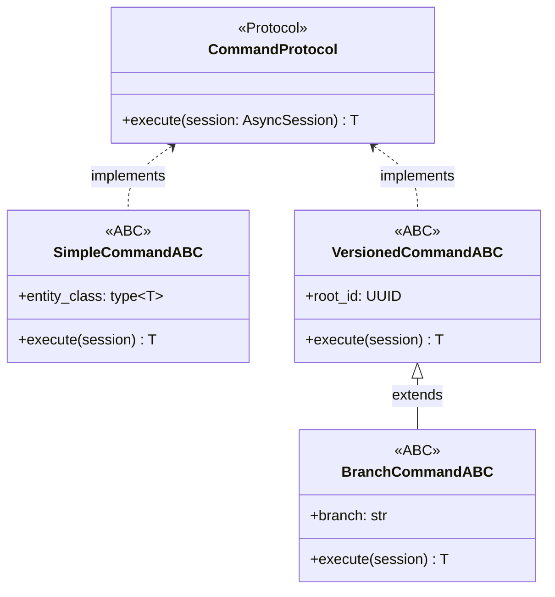

# EVCS Core Architecture

**Last Updated:** 2026-01-02  
**Owner:** Backend Team  
**ADR:** [ADR-005: Bitemporal Versioning](../../decisions/ADR-005-bitemporal-versioning.md)

---

## Responsibility

The Entity Versioning Control System (EVCS) Core provides Git-like versioning capabilities for all database entities. It enables:

- **Complete History:** Every change creates a new immutable version
- **Time Travel:** Query entity state at any past point in time
- **Branch Isolation:** Develop changes in isolation before merging
- **Bitemporal Tracking:** Track both valid time (business) and transaction time (system)
- **Soft Delete:** Reversible deletion with recovery capability

---

## Architecture

### Component Overview



### Layer Responsibilities

| Layer        | Responsibility                            | Key Classes                                                      |
| ------------ | ----------------------------------------- | ---------------------------------------------------------------- |
| **API**      | HTTP endpoints, request/response handling | FastAPI routers                                                  |
| **Service**  | Business logic orchestration              | `TemporalService[TVersionable]`, entity-specific services        |
| **Command**  | Atomic versioning operations              | `CreateCommand[TBranchable]`, `UpdateCommand[TBranchable]`, etc. |
| **Model**    | Data structures, ORM mapping              | `TemporalBase`, entity models                                    |
| **Database** | Persistence, indexing, constraints        | PostgreSQL with GIST indexes                                     |

---

## Type System

EVCS uses **Python Protocols** for structural type checking and **Abstract Base Classes (ABCs)** for implementation. This enables compile-time verification via MyPy while maintaining flexibility.

### Protocol Hierarchy

Protocols define the **shape** of entities at different capability levels:



#### EntityProtocol

Base protocol for all database entities:

```python
from typing import Protocol, runtime_checkable
from uuid import UUID

@runtime_checkable
class EntityProtocol(Protocol):
    """Base protocol - all entities have an ID."""
    id: UUID
```

#### SimpleEntityProtocol

For non-versioned entities with mutable timestamps:

```python
from datetime import datetime

@runtime_checkable
class SimpleEntityProtocol(EntityProtocol, Protocol):
    """Non-versioned entities track creation and modification times."""
    created_at: datetime
    updated_at: datetime
```

**Use for:** User preferences, system configuration, transient data, reference data.

#### VersionableProtocol

For versioned entities using temporal ranges:

```python
@runtime_checkable
class VersionableProtocol(EntityProtocol, Protocol):
    """Versioned entities use bitemporal ranges instead of mutable timestamps."""
    valid_time: TSTZRANGE
    transaction_time: TSTZRANGE
    deleted_at: datetime | None
    created_by: UUID
    deleted_by: UUID | None

    @property
    def is_deleted(self) -> bool: ...

    def soft_delete(self) -> None: ...
    def undelete(self) -> None: ...
    def clone(self, **overrides: Any) -> Self: ...
```

**Use for:** Audit logs, immutable records without branching needs.

#### BranchableProtocol

For full EVCS entities with branching support:

```python
from typing import Self, Any

@runtime_checkable
class BranchableProtocol(VersionableProtocol, Protocol):
    """Full EVCS - versioning + branching."""
    branch: str
    parent_id: UUID | None
    merge_from_branch: str | None

    @property
    def is_current(self) -> bool: ...
```

**Use for:** Business entities requiring change orders, drafts, or parallel development (Projects, WBEs, Cost Elements).

---

## ABC Implementations

Abstract Base Classes provide default implementations for Protocols:

### EntityBase

Foundation for all entities (ID only):

```python
from abc import ABC
from sqlalchemy.orm import Mapped, mapped_column
from sqlalchemy.dialects.postgresql import UUID as PG_UUID
from uuid import uuid4

class EntityBase(Base, ABC):
    """ABC for all entities - provides ID."""
    __abstract__ = True

    id: Mapped[UUID] = mapped_column(PG_UUID, primary_key=True, default=uuid4)
```

### SimpleEntityBase

Non-versioned entities with mutable timestamps:

```python
from sqlalchemy import func

class SimpleEntityBase(EntityBase):
    """Non-versioned entities with created_at/updated_at."""
    __abstract__ = True

    created_at: Mapped[datetime] = mapped_column(
        nullable=False,
        server_default=func.now()
    )
    updated_at: Mapped[datetime] = mapped_column(
        nullable=False,
        server_default=func.now(),
        onupdate=func.now()
    )
```

**Satisfies:** `SimpleEntityProtocol`

### VersionableMixin

Adds temporal versioning (no mutable timestamps):

```python
from sqlalchemy.dialects.postgresql import TSTZRANGE

class VersionableMixin(ABC):
    """Mixin for temporal versioning - compose with EntityBase."""

    valid_time: Mapped[TSTZRANGE] = mapped_column(
        TSTZRANGE,
        nullable=False,
        server_default=func.tstzrange(func.now(), None, "[]")
    )

    transaction_time: Mapped[TSTZRANGE] = mapped_column(
        TSTZRANGE,
        nullable=False,
        server_default=func.tstzrange(func.now(), func.now(), "[]")
    )

    deleted_at: Mapped[datetime | None] = mapped_column(nullable=True)

    @property
    def is_deleted(self) -> bool:
        """Check if this version is soft-deleted."""
        return self.deleted_at is not None

    def soft_delete(self) -> None:
        """Mark this version as deleted (reversible)."""
        from datetime import datetime, UTC
        self.deleted_at = datetime.now(UTC)

    def undelete(self) -> None:
        """Restore a soft-deleted version."""
        self.deleted_at = None
```

**When composed with EntityBase, satisfies:** `VersionableProtocol`

### BranchableMixin

Adds branching capabilities:

```python
from sqlalchemy import String

class BranchableMixin(ABC):
    """Mixin for branching - compose with VersionableMixin."""

    branch: Mapped[str] = mapped_column(String(80), default="main")
    parent_id: Mapped[UUID | None] = mapped_column(PG_UUID, nullable=True)
    merge_from_branch: Mapped[str | None] = mapped_column(String(80), nullable=True)

    @property
    def is_current(self) -> bool:
        """Check if this is the current version (open-ended temporal ranges)."""
        return (
            self.valid_time.upper is None
            and self.transaction_time.upper is None
            and not self.is_deleted
        )

    def clone(self, **overrides: Any) -> Self:
        """Clone this version for updates, branches, or merges."""
        data = {c.name: getattr(self, c.name) for c in self.__table__.columns}
        data.update(overrides)
        data.pop('id', None)  # New version gets new ID
        return self.__class__(**data)
```

**When composed with EntityBase + VersionableMixin, satisfies:** `BranchableProtocol`

---

## Entity Composition Patterns

| Entity Type       | Composition                                       | Protocol Satisfied     | Timestamps                       |
| ----------------- | ------------------------------------------------- | ---------------------- | -------------------------------- |
| **Non-versioned** | `SimpleEntityBase`                                | `SimpleEntityProtocol` | `created_at`, `updated_at`       |
| **Versioned**     | `EntityBase + VersionableMixin`                   | `VersionableProtocol`  | `valid_time`, `transaction_time` |
| **Branchable**    | `EntityBase + VersionableMixin + BranchableMixin` | `BranchableProtocol`   | `valid_time`, `transaction_time` |

### Examples

#### Non-Versioned Entity

```python
class UserPreferences(SimpleEntityBase):
    """User preferences - non-versioned, mutable."""
    __tablename__ = "user_preferences"

    user_id: Mapped[UUID] = mapped_column(PG_UUID, ForeignKey("users.id"), unique=True)
    theme: Mapped[str] = mapped_column(String(20), default="light")
    locale: Mapped[str] = mapped_column(String(10), default="en-US")
    timezone: Mapped[str] = mapped_column(String(50), default="UTC")
```

**Satisfies:** `SimpleEntityProtocol` ✓

#### Versioned Entity (No Branching)

```python
class CostElementType(EntityBase, VersionableMixin):
    """Cost Element Type - versioned reference data (no branching)."""
    __tablename__ = "cost_element_types"

    cost_element_type_id: Mapped[UUID] = mapped_column(PG_UUID, nullable=False, index=True)
    department_id: Mapped[UUID] = mapped_column(PG_UUID, ForeignKey("departments.department_id"))
    code: Mapped[str] = mapped_column(String(50), nullable=False)
    name: Mapped[str] = mapped_column(String(255), nullable=False)
```

**Satisfies:** `VersionableProtocol` ✓

#### Full EVCS Entity

```python
class ProjectVersion(EntityBase, VersionableMixin, BranchableMixin):
    """Project - full EVCS with versioning and branching."""
    __tablename__ = "project_versions"

    project_id: Mapped[UUID] = mapped_column(PG_UUID, nullable=False, index=True)
    name: Mapped[str] = mapped_column(String(200))
    description: Mapped[str | None] = mapped_column(Text, nullable=True)
    budget: Mapped[Decimal] = mapped_column(Numeric(15, 2))
```

**Satisfies:** `BranchableProtocol` ✓

---

## Command Pattern

Commands encapsulate atomic operations following the Command Pattern with Protocol-based type safety.

### Command Protocol

All commands implement this base protocol:

```python
from typing import Protocol, TypeVar, Generic
from sqlalchemy.ext.asyncio import AsyncSession

T = TypeVar('T')

class CommandProtocol(Protocol[T]):
    """Base protocol for all commands."""
    async def execute(self, session: AsyncSession) -> T:
        """Execute the command and return the result."""
        ...
```

### Command ABC Hierarchy



---

### Simple Entity Commands

For non-versioned entities (satisfy `SimpleEntityProtocol`):

#### SimpleCommandABC

```python
from abc import ABC, abstractmethod
from typing import TypeVar, Any
from sqlalchemy.ext.asyncio import AsyncSession

TSimple = TypeVar('TSimple', bound=SimpleEntityProtocol)

class SimpleCommandABC(ABC, Generic[TSimple]):
    """ABC for non-versioned entity commands."""
    entity_class: type[TSimple]

    @abstractmethod
    async def execute(self, session: AsyncSession) -> TSimple | bool: ...
```

#### SimpleCreateCommand

```python
class SimpleCreateCommand(SimpleCommandABC[TSimple]):
    """Create a new non-versioned entity."""

    def __init__(self, entity_class: type[TSimple], **fields: Any) -> None:
        self.entity_class = entity_class
        self.fields = fields

    async def execute(self, session: AsyncSession) -> TSimple:
        entity = self.entity_class(**self.fields)
        session.add(entity)
        await session.flush()
        return entity
```

#### SimpleUpdateCommand

```python
class SimpleUpdateCommand(SimpleCommandABC[TSimple]):
    """Update a non-versioned entity in place."""

    def __init__(self, entity_class: type[TSimple], entity_id: UUID, **updates: Any) -> None:
        self.entity_class = entity_class
        self.entity_id = entity_id
        self.updates = updates

    async def execute(self, session: AsyncSession) -> TSimple:
        entity = await session.get(self.entity_class, self.entity_id)
        if not entity:
            raise ValueError(f"Entity {self.entity_id} not found")
        for key, value in self.updates.items():
            setattr(entity, key, value)
        await session.flush()
        return entity
```

#### SimpleDeleteCommand

```python
class SimpleDeleteCommand(SimpleCommandABC[TSimple]):
    """Hard delete a non-versioned entity."""

    def __init__(self, entity_class: type[TSimple], entity_id: UUID) -> None:
        self.entity_class = entity_class
        self.entity_id = entity_id

    async def execute(self, session: AsyncSession) -> bool:
        entity = await session.get(self.entity_class, self.entity_id)
        if entity:
            await session.delete(entity)
            await session.flush()
            return True
        return False
```

---

### Versioned Entity Commands

For versioned entities without branching (satisfy `VersionableProtocol`):

#### VersionedCommandABC

```python
TVersionable = TypeVar('TVersionable', bound=VersionableProtocol)

class VersionedCommandABC(ABC, Generic[TVersionable]):
    """ABC for versioned entity commands (no branching)."""
    entity_class: type[TVersionable]
    root_id: UUID
    actor_id: UUID

    def __init__(self, entity_class: type[TVersionable], root_id: UUID, actor_id: UUID) -> None:
        self.entity_class = entity_class
        self.root_id = root_id
        self.actor_id = actor_id

    @abstractmethod
    async def execute(self, session: AsyncSession) -> TVersionable: ...
```

#### CreateVersionCommand

```python
class CreateVersionCommand(VersionedCommandABC[TVersionable]):
    """Create initial version of a versioned entity."""

    def __init__(
        self,
        entity_class: type[TVersionable],
        root_id: UUID,
        actor_id: UUID,
        control_date: datetime | None = None,
        **fields: Any
    ) -> None:
        super().__init__(entity_class, root_id, actor_id)
        self.fields = fields
        self.control_date = control_date

    async def execute(self, session: AsyncSession) -> TVersionable:
        # Create new version with proper bitemporal timestamps
        # valid_time based on control_date, transaction_time based on clock_timestamp
        version = self.entity_class(**self.fields)
        session.add(version)
        return version
```

#### UpdateVersionCommand

```python
class UpdateVersionCommand(VersionedCommandABC[TVersionable]):
    """Update versioned entity - closes current, creates new."""

    def __init__(
        self,
        entity_class: type[TVersionable],
        root_id: UUID,
        actor_id: UUID,
        control_date: datetime | None = None,
        **updates: Any
    ) -> None:
        super().__init__(entity_class, root_id, actor_id)
        self.updates = updates
        self.control_date = control_date

    async def execute(self, session: AsyncSession) -> TVersionable:
        # Close current version with valid_time upper bound = control_date
        # Create new version with valid_time lower bound = control_date
        # Maintains contiguous history
        ...
```

#### SoftDeleteCommand

```python
class SoftDeleteCommand(VersionedCommandABC[TVersionable]):
    """Soft delete a versioned entity."""

    def __init__(
        self,
        entity_class: type[TVersionable],
        root_id: UUID,
        actor_id: UUID,
        control_date: datetime | None = None
    ) -> None:
        super().__init__(entity_class, root_id, actor_id)
        self.control_date = control_date

    async def execute(self, session: AsyncSession) -> TVersionable | None:
        # Mark current version as deleted at control_date
        ...
```

---

### Branchable Entity Commands

For full EVCS entities with branching (satisfy `BranchableProtocol`):

#### BranchCommandABC

```python
TBranchable = TypeVar('TBranchable', bound=BranchableProtocol)

class BranchCommandABC(VersionedCommandABC[TBranchable]):
    """ABC for branchable entity commands."""
    branch: str = "main"
```

#### UpdateCommand

```python
class UpdateCommand(BranchCommandABC[TBranchable]):
    """Update branchable entity on specific branch."""

    def __init__(
        self,
        entity_class: type[TBranchable],
        root_id: UUID,
        actor_id: UUID,
        updates: dict[str, Any],
        branch: str = "main",
        control_date: datetime | None = None
    ) -> None:
        super().__init__(entity_class, root_id, actor_id)
        self.updates = updates
        self.branch = branch
        self.control_date = control_date

    async def execute(self, session: AsyncSession) -> TBranchable:
        # Close current on branch and create new version
        # Handles remainder creation for retro-active updates (Split History)
        ...
```

#### CreateBranchCommand

```python
class CreateBranchCommand(BranchCommandABC[TBranchable]):
    """Create a new branch from existing branch."""

    def __init__(
        self,
        entity_class: type[TBranchable],
        root_id: UUID,
        actor_id: UUID,
        new_branch: str,
        from_branch: str = "main",
        control_date: datetime | None = None
    ) -> None:
        super().__init__(entity_class, root_id, actor_id)
        self.new_branch = new_branch
        self.from_branch = from_branch
        self.control_date = control_date

    async def execute(self, session: AsyncSession) -> TBranchable:
        # Clone current version from source branch to new branch
        ...
```

#### MergeBranchCommand

```python
class MergeBranchCommand(BranchCommandABC[TBranchable]):
    """Merge source branch into target branch (overwrite strategy)."""

    def __init__(
        self,
        entity_class: type[TBranchable],
        root_id: UUID,
        actor_id: UUID,
        source_branch: str,
        target_branch: str = "main"
    ) -> None:
        super().__init__(entity_class, root_id, actor_id)
        self.source_branch = source_branch
        self.target_branch = target_branch

    async def execute(self, session: AsyncSession) -> TBranchable:
        # Clone source active version to target branch
        # Records merge_from_branch for lineage
        ...
```

#### RevertCommand

```python
class RevertCommand(BranchCommandABC[TBranchable]):
    """Revert to previous version (creates new version with old state)."""

    def __init__(
        self,
        entity_class: type[TBranchable],
        root_id: UUID,
        actor_id: UUID,
        branch: str = "main",
        to_version_id: UUID | None = None
    ) -> None:
        super().__init__(entity_class, root_id, actor_id)
        self.branch = branch
        self.to_version_id = to_version_id

    async def execute(self, session: AsyncSession) -> TBranchable:
        # Clone target historical version to be the new active head
        ...
```

#### BranchableSoftDeleteCommand

```python
class BranchableSoftDeleteCommand(BranchCommandABC[TBranchable]):
    """Soft delete a branchable entity on a specific branch."""

    def __init__(
        self,
        entity_class: type[TBranchable],
        root_id: UUID,
        actor_id: UUID,
        branch: str = "main",
        control_date: datetime | None = None
    ) -> None:
        super().__init__(entity_class, root_id, actor_id)
        self.branch = branch
        self.control_date = control_date

    async def execute(self, session: AsyncSession) -> TBranchable:
        # Mark current version on branch as deleted
        ...
```

---

### Command Composition Summary

| Entity Type       | Protocol               | Command ABC           | Example Commands                                                                                             |
| ----------------- | ---------------------- | --------------------- | ------------------------------------------------------------------------------------------------------------ |
| **Non-versioned** | `SimpleEntityProtocol` | `SimpleCommandABC`    | `SimpleCreateCommand`, `SimpleUpdateCommand`, `SimpleDeleteCommand`                                          |
| **Versioned**     | `VersionableProtocol`  | `VersionedCommandABC` | `CreateVersionCommand`, `UpdateVersionCommand`, `SoftDeleteCommand`                                          |
| **Branchable**    | `BranchableProtocol`   | `BranchCommandABC`    | `UpdateCommand`, `CreateBranchCommand`, `MergeBranchCommand`, `RevertCommand`, `BranchableSoftDeleteCommand` |

---

## Service Layer

Services orchestrate business logic and coordinate commands for different entity types.

### SimpleService[TSimple]

For non-versioned entities (`SimpleEntityProtocol`):

```python
class SimpleService(Generic[TSimple]):
    """Service for non-versioned entities (config, preferences, etc)."""

    def __init__(self, session: AsyncSession, entity_class: type[TSimple]) -> None:
        self.session = session
        self.entity_class = entity_class

    async def get(self, entity_id: UUID) -> TSimple | None:
        """Get entity by ID."""
        return await self.session.get(self.entity_class, entity_id)

    async def list_all(self, skip: int = 0, limit: int = 100) -> list[TSimple]:
        """Get paginated list of entities."""
        stmt = select(self.entity_class).offset(skip).limit(limit)
        result = await self.session.execute(stmt)
        return list(result.scalars().all())

    async def create(self, **fields: Any) -> TSimple:
        """Create new entity using SimpleCreateCommand."""
        cmd = SimpleCreateCommand(self.entity_class, **fields)
        return await cmd.execute(self.session)

    async def update(self, entity_id: UUID, **updates: Any) -> TSimple | None:
        """Update entity in place using SimpleUpdateCommand."""
        cmd = SimpleUpdateCommand(self.entity_class, entity_id, **updates)
        return await cmd.execute(self.session)

    async def delete(self, entity_id: UUID) -> bool:
        """Hard delete entity using SimpleDeleteCommand."""
        cmd = SimpleDeleteCommand(self.entity_class, entity_id)
        return await cmd.execute(self.session)
```

### TemporalService[TVersionable]

For versioned entities without branching (`VersionableProtocol`):

```python
class TemporalService(Generic[TVersionable]):
    """Service for versioned entities without branching."""

    def __init__(self, entity_class: type[TVersionable], session: AsyncSession) -> None:
        self.entity_class = entity_class
        self.session = session

    async def get_by_id(self, entity_id: UUID) -> TVersionable | None:
        """Get entity by ID (returns specific version by PK)."""
        return await self.session.get(self.entity_class, entity_id)

    async def get_current_version(
        self, root_id: UUID, branch: str = "main"
    ) -> TVersionable | None:
        """Get current active version of entity by its root ID."""
        # Filters by root_id, valid_time (upper IS NULL), and deleted_at (IS NULL)
        ...

    async def get_all(self, skip: int = 0, limit: int = 100000) -> list[TVersionable]:
        """Get all entities (current versions) with pagination."""
        ...

    async def get_as_of(
        self,
        entity_id: UUID,
        as_of: datetime,
        branch: str = "main",
        branch_mode: BranchMode | None = None
    ) -> TVersionable | None:
        """Time travel: Get entity as it was at specific timestamp.

        Implements bitemporal time travel (valid_time and transaction_time).
        """
        ...

    async def create(
        self,
        actor_id: UUID,
        root_id: UUID | None = None,
        control_date: datetime | None = None,
        **fields: Any
    ) -> TVersionable:
        """Create initial version using CreateVersionCommand."""
        cmd = CreateVersionCommand(
            self.entity_class,
            root_id=root_id,
            actor_id=actor_id,
            control_date=control_date,
            **fields
        )
        return await cmd.execute(self.session)

    async def update(
        self,
        entity_id: UUID,
        actor_id: UUID,
        control_date: datetime | None = None,
        **updates: Any
    ) -> TVersionable:
        """Update entity using UpdateVersionCommand."""
        cmd = UpdateVersionCommand(
            self.entity_class,
            root_id=entity_id,
            actor_id=actor_id,
            control_date=control_date,
            **updates
        )
        return await cmd.execute(self.session)

    async def soft_delete(
        self,
        entity_id: UUID,
        actor_id: UUID,
        control_date: datetime | None = None
    ) -> None:
        """Soft delete entity using SoftDeleteCommand."""
        cmd = SoftDeleteCommand(
            self.entity_class,
            root_id=entity_id,
            actor_id=actor_id,
            control_date=control_date
        )
        await cmd.execute(self.session)
```

### BranchableService[TBranchable]

For full EVCS entities with branching (`BranchableProtocol`):

```python
class BranchableService(Generic[TBranchable]):
    """Service for branchable entities (full EVCS)."""

    def __init__(self, entity_class: type[TBranchable], session: AsyncSession) -> None:
        self.entity_class = entity_class
        self.session = session

    async def get_by_id(self, entity_id: UUID) -> TBranchable | None:
        """Get specific version by its version ID (primary key)."""
        return await self.session.get(self.entity_class, entity_id)

    async def get_current(
        self, root_id: UUID, branch: str = "main"
    ) -> TBranchable | None:
        """Get the current active version for a root entity on a specific branch.

        Uses clock_timestamp() for accurate current version detection within transactions.
        """
        ...

    async def get_as_of(
        self,
        entity_id: UUID,
        as_of: datetime,
        branch: str = "main",
        branch_mode: BranchMode | None = None,
    ) -> TBranchable | None:
        """Time travel: Get active version at specific timestamp on a branch.

        Args:
            entity_id: Root entity ID
            as_of: Timestamp to query
            branch: Branch name (default: main)
            branch_mode: Resolution mode (STRICT=only branch, MERGE=fallback to main)

        Returns:
            Entity version that was active at the specified timestamp, or None
        """
        # Implementation uses bitemporal filtering on valid_time and transaction_time
        # with support for branch fallback in MERGE mode
        ...

    async def create_root(
        self,
        root_id: UUID,
        actor_id: UUID,
        control_date: datetime | None = None,
        branch: str = "main",
        **data: Any,
    ) -> TBranchable:
        """Create the initial version of an entity (new root).

        Raises:
            BranchLockedException: If the branch is locked
        """
        cmd = CreateVersionCommand(
            entity_class=self.entity_class,
            root_id=root_id,
            actor_id=actor_id,
            control_date=control_date,
            branch=branch,
            **data,
        )
        return await cmd.execute(self.session)

    async def update(
        self,
        root_id: UUID,
        actor_id: UUID,
        branch: str,
        control_date: datetime | None = None,
        **updates: Any,
    ) -> TBranchable:
        """Update entity on a specific branch (creates new version)."""
        cmd = UpdateCommand(
            entity_class=self.entity_class,
            root_id=root_id,
            actor_id=actor_id,
            branch=branch,
            control_date=control_date,
            updates=updates,
        )
        return await cmd.execute(self.session)

    async def create_branch(
        self,
        root_id: UUID,
        actor_id: UUID,
        new_branch: str,
        from_branch: str = "main",
        control_date: datetime | None = None,
    ) -> TBranchable:
        """Create a new branch from an existing branch."""
        cmd = CreateBranchCommand(
            entity_class=self.entity_class,
            root_id=root_id,
            actor_id=actor_id,
            new_branch=new_branch,
            from_branch=from_branch,
            control_date=control_date,
        )
        return await cmd.execute(self.session)

    async def merge_branch(
        self, root_id: UUID, actor_id: UUID, source_branch: str, target_branch: str
    ) -> TBranchable:
        """Merge source branch into target branch."""
        cmd = MergeBranchCommand(
            entity_class=self.entity_class,
            root_id=root_id,
            actor_id=actor_id,
            source_branch=source_branch,
            target_branch=target_branch,
        )
        return await cmd.execute(self.session)

    async def revert(
        self,
        root_id: UUID,
        actor_id: UUID,
        branch: str,
        to_version_id: UUID | None = None,
    ) -> TBranchable:
        """Revert branch to a previous state."""
        cmd = RevertCommand(
            entity_class=self.entity_class,
            root_id=root_id,
            actor_id=actor_id,
            branch=branch,
            to_version_id=to_version_id,
        )
        return await cmd.execute(self.session)

    async def soft_delete(
        self,
        root_id: UUID,
        actor_id: UUID,
        branch: str = "main",
        control_date: datetime | None = None,
    ) -> TBranchable:
        """Soft delete a branchable entity on a specific branch.

        Args:
            root_id: Root entity identifier
            actor_id: User performing the deletion
            branch: Branch to delete from (default: "main")
            control_date: Optional control date for deletion timestamp

        Returns:
            The deleted entity (marked with deleted_at)

        Raises:
            ValueError: If no active version found on the specified branch
            BranchLockedException: If the branch is locked
        """
        cmd = BranchableSoftDeleteCommand(
            entity_class=self.entity_class,
            root_id=root_id,
            actor_id=actor_id,
            branch=branch,
            control_date=control_date,
        )
        return await cmd.execute(self.session)

    async def get_history(self, root_id: UUID) -> list[TBranchable]:
        """Get all versions of an entity with joined creator name."""
        ...

    async def list_branches(
        self,
        root_id: UUID,
        as_of: datetime | None = None,
    ) -> list[str]:
        """Get all branch names for an entity."""
        ...

    async def compare_branches(
        self,
        root_id: UUID,
        branch_a: str,
        branch_b: str,
        as_of: datetime | None = None,
    ) -> dict[str, TBranchable | None]:
            version_a = await self.get_current(root_id, branch_a)
            version_b = await self.get_current(root_id, branch_b)

        return {
            "branch_a": version_a,
            "branch_b": version_b
        }
```

### Service Composition Summary

| Entity Type       | Protocol Satisfied     | Service Class                    | Key Methods                                                                                                                                                    |
| ----------------- | ---------------------- | -------------------------------- | -------------------------------------------------------------------------------------------------------------------------------------------------------------- |
| **Non-versioned** | `SimpleEntityProtocol` | `SimpleService[TSimple]`         | `get()`, `create()`, `update()`, `delete()`                                                                                                                    |
| **Versioned**     | `VersionableProtocol`  | `TemporalService[TVersionable]`  | `get_current()`, `create()`, `update()`, `soft_delete()`, `undelete()`                                                                                         |
| **Branchable**    | `BranchableProtocol`   | `BranchableService[TBranchable]` | All temporal methods + `get_by_id()`, `get_as_of()`, `create_branch()`, `merge_branch()`, `revert()`, `get_history()`, `list_branches()`, `compare_branches()` |

```python
# Note: The actual implementation is in AsyncSession context
# All methods use 'await' for async operations
```

---

## Data Model

### Version Table Structure

Each versioned entity has a single table with this structure:

| Column                | Type             | Description               |
| --------------------- | ---------------- | ------------------------- |
| `id`                  | UUID (PK)        | Unique version identifier |
| `{entity}_id`         | UUID (Index)     | Stable entity root ID     |
| `valid_time`          | TSTZRANGE        | Business validity period  |
| `transaction_time`    | TSTZRANGE        | System recording period   |
| `deleted_at`          | TIMESTAMPTZ      | Soft delete timestamp     |
| `branch`              | VARCHAR(80)      | Branch name               |
| `parent_id`           | UUID (FK, Index) | Previous version ID       |
| `merge_from_branch`   | VARCHAR(80)      | Merge source branch       |
| `...domain fields...` | various          | Entity-specific data      |

### Indexing Strategy

```sql
-- GIST indexes for range queries
CREATE INDEX ix_{table}_valid_gist ON {table} USING GIST (valid_time);
CREATE INDEX ix_{table}_tx_gist ON {table} USING GIST (transaction_time);

-- B-tree indexes for lookups
CREATE INDEX ix_{table}_entity_id ON {table} ({entity}_id);
CREATE INDEX ix_{table}_branch ON {table} (branch);
CREATE INDEX ix_{table}_parent ON {table} (parent_id);

-- Partial unique index: one current version per entity per branch
CREATE UNIQUE INDEX uq_{table}_current_branch ON {table} ({entity}_id, branch)
WHERE upper(valid_time) IS NULL
  AND upper(transaction_time) IS NULL
  AND deleted_at IS NULL;
```

---

## Integration Points

### Used By

- All versioned entities (Project, WBE, CostElement, etc.)
- Change Order system (branch creation/merging)
- Time Machine feature (temporal queries)
- Audit reporting (history views)

### Provides

- **Protocols:** `EntityProtocol`, `SimpleEntityProtocol`, `VersionableProtocol`, `BranchableProtocol`
- **ABCs:** `EntityBase`, `SimpleEntityBase`, `VersionableMixin`, `BranchableMixin`
- **Commands:** All command ABCs and implementations
- **Services:** `SimpleService[TSimple]`, `TemporalService[TVersionable]`, `BranchableService[TBranchable]`
- Temporal query helpers
  | **Temporal Fields** | `valid_time`, `transaction_time` | `created_at`, `updated_at` |
  | **History** | Full version history | No history (in-place updates) |
  | **Branching** | Supported | Not applicable |
  | **Deletion** | Soft delete (`deleted_at`) | Hard delete |
  | **Use Cases** | Business entities, audit-required | Config, preferences, transient |

---

## Code Locations

- **Protocols:** `app/models/protocols.py` - Protocol definitions for type checking
- **Base Models:** `app/models/domain/base.py` - `EntityBase`, `SimpleEntityBase`
- **Mixins:** `app/models/mixins.py` - `VersionableMixin`, `BranchableMixin`
- **Commands (Base):** `app/core/versioning/commands.py` - Base/Versioned command ABCs and implementations
- **Commands (Branching):** `app/core/branching/commands.py` - Branching command ABCs and implementations
- **Services (Base):** `app/core/versioning/service.py` - `SimpleService`, `TemporalService`
- **Services (Branching):** `app/core/branching/service.py` - `BranchableService`
- **UUID Utils:** `app/core/uuid_utils.py` - UUIDv5 namespace-based generation
- **Seed Context:** `app/db/seed_context.py` - Seed operation context manager
- **Entity Examples:** `app/models/domain/project.py`, `app/models/domain/wbe.py`

---

## See Also

- [Entity Classification Guide](entity-classification.md) - How to choose Simple/Versionable/Branchable
- [EVCS Implementation Guide](evcs-implementation-guide.md) - Code patterns and recipes
- [Temporal Query Reference](../../../cross-cutting/temporal-query-reference.md) - Bitemporal queries and time travel
- [Seed Data Strategy](../../seed-data-strategy.md) - Deterministic UUIDv5 seeding
- [ADR-006: Protocol-Based Type System](../../decisions/ADR-006-protocol-based-type-system.md) - Type system decision
- [ADR-005: Bitemporal Versioning](../../decisions/ADR-005-bitemporal-versioning.md) - Decision record
- [Database Strategy](../../cross-cutting/database-strategy.md) - TSTZRANGE usage
