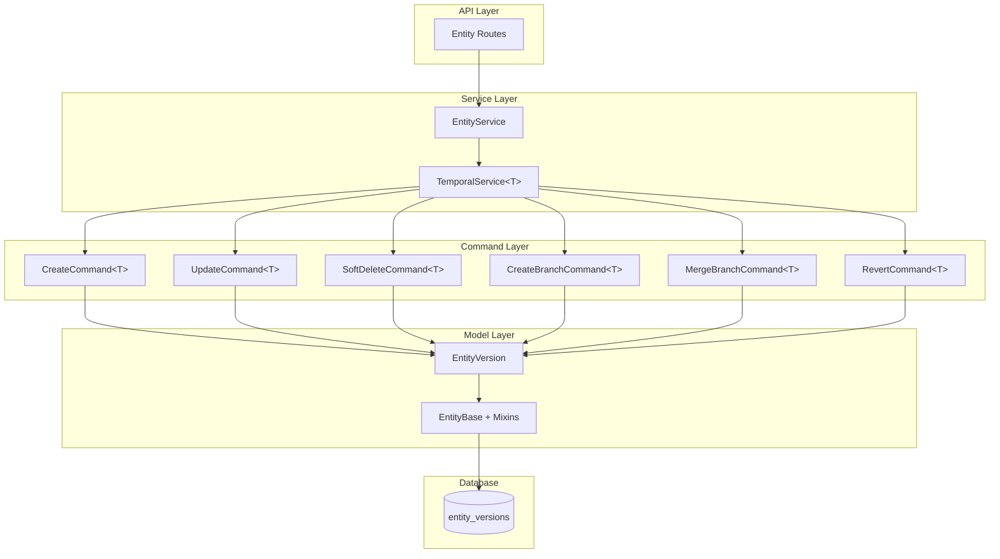
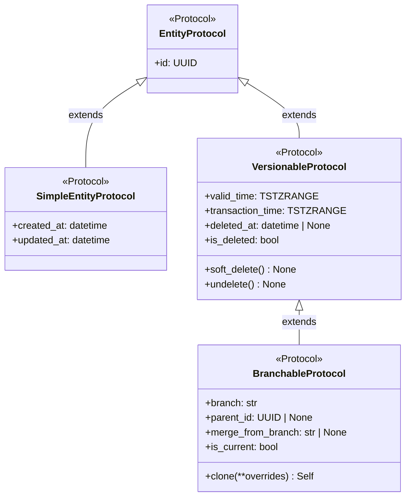
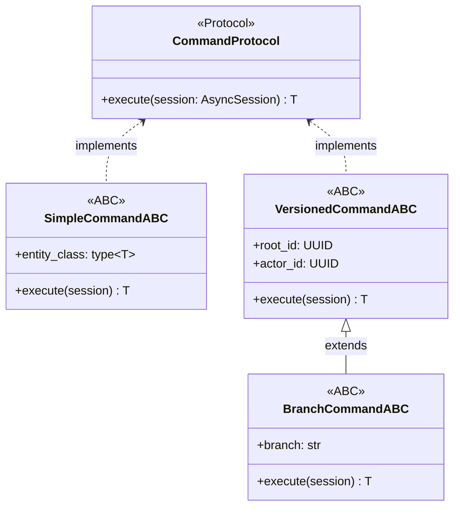

# EVCS Core Architecture

**Last Updated:** 2026-04-14  
**Owner:** Backend Team  
**ADR:** [ADR-005: Bitemporal Versioning](../../decisions/ADR-005-bitemporal-versioning.md)

---

## Responsibility

The Entity Versioning Control System (EVCS) Core provides Git-like versioning capabilities for all database entities. It enables:

- **Complete History:** Every change creates a new immutable version
- **Time Travel:** Query entity state at any past point in time
- **Branch Isolation:** Develop changes in isolation before merging
- **Bitemporal Tracking:** Track both valid time (business) and transaction time (system)
- **Soft Delete:** Reversible deletion with recovery capability

**Document Scope:**

This document covers the **conceptual architecture** of EVCS:
- Component overview and layer responsibilities
- Type system (protocols and ABCs)
- Command pattern hierarchy
- Service layer organization
- Data model and indexing strategy

**For implementation details and code examples:**
- Code patterns and service usage → [EVCS Implementation Guide](evcs-implementation-guide.md)
- Query semantics and time travel → [Temporal Query Reference](../../../cross-cutting/temporal-query-reference.md)
- Choosing entity types → [Entity Classification Guide](entity-classification.md)

---

## Architecture

### Component Overview

### Layer Responsibilities

| Layer        | Responsibility                            | Key Classes                                                      |
| ------------ | ----------------------------------------- | ---------------------------------------------------------------- |
| **API**      | HTTP endpoints, request/response handling | FastAPI routers                                                  |
| **Service**  | Business logic orchestration              | `TemporalService[TVersionable]`, entity-specific services        |
| **Command**  | Atomic versioning operations              | `CreateCommand[TBranchable]`, `UpdateCommand[TBranchable]`, etc. |
| **Model**    | Data structures, ORM mapping              | `EntityBase + VersionableMixin`, entity models                   |
| **Database** | Persistence, indexing, constraints        | PostgreSQL with GIST indexes                                     |

---

## Type System

EVCS uses **Python Protocols** for structural type checking and **Abstract Base Classes (ABCs)** for implementation. This enables compile-time verification via MyPy while maintaining flexibility.

### Protocol Hierarchy

Protocols define the **shape** of entities at different capability levels:

### Protocol Descriptions

| Protocol | Purpose | Key Fields | Use Cases |
|----------|---------|------------|-----------|
| **EntityProtocol** | Base for all entities | `id: UUID` | All database entities |
| **SimpleEntityProtocol** | Non-versioned entities | `created_at`, `updated_at` | User preferences, config, transient data |
| **VersionableProtocol** | Versioned without branching | `valid_time`, `transaction_time`, `deleted_at` | Audit logs, immutable records |
| **BranchableProtocol** | Full EVCS with branching | All versionable + `branch`, `parent_id` | Business entities (Projects, WBEs, Cost Elements) |

> **For implementation details and code examples, see [EVCS Implementation Guide](evcs-implementation-guide.md).**

---

## ABC Implementations

Abstract Base Classes provide default implementations for Protocols:

### Base Classes and Mixins

| ABC/Mixin | Purpose | Provides | Satisfies |
|-----------|---------|----------|-----------|
| **EntityBase** | Foundation for all entities | `id: UUID` with auto-generation | `EntityProtocol` |
| **SimpleEntityBase** | Non-versioned entities | `created_at`, `updated_at` with auto-updates | `SimpleEntityProtocol` |
| **VersionableMixin** | Temporal versioning | `valid_time`, `transaction_time`, `deleted_at`, soft delete/undelete methods | `VersionableProtocol` (when composed) |
| **BranchableMixin** | Branching capabilities | `branch`, `parent_id`, `merge_from_branch`, `is_current`, `clone()` | `BranchableProtocol` (when composed) |

### Entity Composition Patterns

| Entity Type | Composition | Protocol Satisfied | Timestamp Model |
|-------------|-------------|-------------------|-----------------|
| **Non-versioned** | `SimpleEntityBase` | `SimpleEntityProtocol` | `created_at`, `updated_at` (mutable) |
| **Versioned** | `EntityBase + VersionableMixin` | `VersionableProtocol` | `valid_time`, `transaction_time` (ranges) |
| **Branchable** | `EntityBase + VersionableMixin + BranchableMixin` | `BranchableProtocol` | `valid_time`, `transaction_time` (ranges) |

**Example Use Cases:**

- **Non-versioned:** User preferences, system configuration, transient data, reference data
- **Versioned (no branching):** Audit logs, immutable records, versioned reference data
- **Branchable:** Business entities requiring change orders, drafts, or parallel development

> **For implementation details and code examples, see [EVCS Implementation Guide](evcs-implementation-guide.md).**

---

## Command Pattern

Commands encapsulate atomic operations following the Command Pattern with Protocol-based type safety.

### Command Hierarchy

### Command Types by Entity

| Entity Type | Base ABC | Operations |
|-------------|----------|------------|
| **Non-versioned** | `SimpleCommandABC` | Create, Update (in-place), Hard Delete |
| **Versioned** | `VersionedCommandABC` | Create version, Update (close old + create new), Soft Delete |
| **Branchable** | `BranchCommandABC` | All versioned operations + Create Branch, Merge Branch, Revert |

### Key Operations

| Operation | Non-Versioned | Versioned | Branchable |
|-----------|--------------|-----------|------------|
| **Create** | INSERT new row | Create initial version with temporal ranges | Create initial version on branch |
| **Update** | UPDATE in place | Close current version, create new with changes | Close current on branch, create new |
| **Delete** | Hard DELETE | Set `deleted_at` timestamp | Set `deleted_at` on branch |
| **Branch** | N/A | N/A | Clone current to new branch |
| **Merge** | N/A | N/A | Overwrite target with source |
| **Revert** | N/A | N/A | Create new version from historical state |

> **For code examples and usage patterns, see [EVCS Implementation Guide](evcs-implementation-guide.md).**

---

## Service Layer

Services orchestrate business logic and coordinate commands for different entity types.

### Service Types

| Service | For Entity Type | Purpose |
|---------|----------------|---------|
| **SimpleService[TSimple]** | Non-versioned entities | Basic CRUD with in-place updates |
| **TemporalService[TVersionable]** | Versioned entities | CRUD with temporal versioning |
| **BranchableService[TBranchable]** | Branchable entities | All temporal operations + branching |

### Service Method Summary

| Operation | SimpleService | TemporalService | BranchableService |
|-----------|---------------|-----------------|-------------------|
| **Get by ID** | `get()` | `get_by_id()` | `get_by_id()` |
| **Get current** | N/A | `get_current()` | `get_current()` |
| **Get as of (time travel)** | N/A | `get_as_of()` | `get_as_of()` |
| **List** | `list_all()` | `get_all()` | `get_all()` |
| **Create** | `create()` | `create()` | `create_root()` |
| **Update** | `update()` (in-place) | `update()` (versioned) | `update()` (versioned) |
| **Delete** | `delete()` (hard) | `soft_delete()` | `soft_delete()` |
| **Branch** | N/A | N/A | `create_branch()`, `merge_branch()` |
| **History** | N/A | N/A | `get_history()`, `list_branches()`, `compare_branches()` |
| **Revert** | N/A | N/A | `revert()` |

> **For code examples and usage patterns, see [EVCS Implementation Guide](evcs-implementation-guide.md).**

---

## Data Model

### Version Table Structure

Each versioned entity has a single table with this structure:

| Column | Type | Description |
|--------|------|-------------|
| `id` | UUID (PK) | Unique version identifier |
| `{entity}_id` | UUID (Index) | Stable entity root ID |
| `valid_time` | TSTZRANGE | Business validity period |
| `transaction_time` | TSTZRANGE | System recording period |
| `deleted_at` | TIMESTAMPTZ | Soft delete timestamp |
| `branch` | VARCHAR(80) | Branch name (default: "main") |
| `parent_id` | UUID (FK, Index) | Previous version ID |
| `merge_from_branch` | VARCHAR(80) | Merge source branch |
| `...domain fields...` | various | Entity-specific data |

### Bitemporal Model

| Dimension | Purpose | Example |
|-----------|---------|---------|
| **valid_time** | When the fact was true in the real world | A project budget was valid from Jan 1 to Mar 31 |
| **transaction_time** | When the fact was recorded in the database | The budget was entered on Feb 15, then corrected on Feb 20 |

> **For query patterns and time travel semantics, see [Temporal Query Reference](../../../cross-cutting/temporal-query-reference.md).**

---

## Integration Points

### Used By

- All versioned entities (Project, WBE, CostElement, etc.)
- Change Order system (branch creation/merging)
- Time Machine feature (temporal queries)
- Audit reporting (history views)

### Provides

- **Protocols:** `EntityProtocol`, `SimpleEntityProtocol`, `VersionableProtocol`, `BranchableProtocol`
- **ABCs:** `EntityBase`, `SimpleEntityBase`, `VersionableMixin`, `BranchableMixin`
- **Commands:** All command ABCs and implementations
- **Services:** `SimpleService[TSimple]`, `TemporalService[TVersionable]`, `BranchableService[TBranchable]`

### Entity Type Comparison

| Aspect | Versioned | Non-Versioned |
|--------|-----------|---------------|
| **Temporal Fields** | `valid_time`, `transaction_time` | `created_at`, `updated_at` |
| **History** | Full version history | No history (in-place updates) |
| **Branching** | Supported | Not applicable |
| **Deletion** | Soft delete (`deleted_at`) | Hard delete |
| **Use Cases** | Business entities, audit-required | Config, preferences, transient |

---

## Code Locations

- **Protocols:** `app/models/protocols.py` - Protocol definitions for type checking
- **Base Models:** `app/models/domain/base.py` - `EntityBase`, `SimpleEntityBase`
- **Mixins:** `app/models/mixins.py` - `VersionableMixin`, `BranchableMixin`
- **Commands (Base):** `app/core/versioning/commands.py` - Base/Versioned command ABCs and implementations
- **Commands (Branching):** `app/core/branching/commands.py` - Branching command ABCs and implementations
- **Services (Base):** `app/core/versioning/service.py` - `SimpleService`, `TemporalService`
- **Services (Branching):** `app/core/branching/service.py` - `BranchableService`
- **UUID Utils:** `app/core/uuid_utils.py` - UUIDv5 namespace-based generation
- **Seed Context:** `app/db/seed_context.py` - Seed operation context manager
- **Entity Examples:** `app/models/domain/project.py`, `app/models/domain/wbe.py`

---

## See Also

### Related Guides

- [Entity Classification Guide](entity-classification.md) - How to choose Simple/Versionable/Branchable entity types
- [EVCS Implementation Guide](evcs-implementation-guide.md) - Code patterns, service usage, and implementation recipes
- [Temporal Query Reference](../../../cross-cutting/temporal-query-reference.md) - Query semantics, time travel patterns, and filter behavior

### Architecture Decisions

- [ADR-005: Bitemporal Versioning](../../decisions/ADR-005-bitemporal-versioning.md) - Bitemporal pattern decision record
- [ADR-006: Protocol-Based Type System](../../decisions/ADR-006-protocol-based-type-system.md) - Type system design decision

### Cross-Cutting

- [Database Strategy](../../cross-cutting/database-strategy.md) - TSTZRANGE usage and indexing strategies
- [Seed Data Strategy](../../seed-data-strategy.md) - Deterministic UUIDv5 seeding
