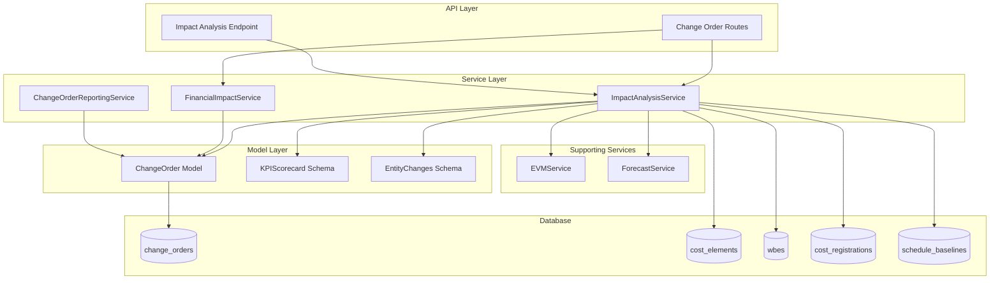
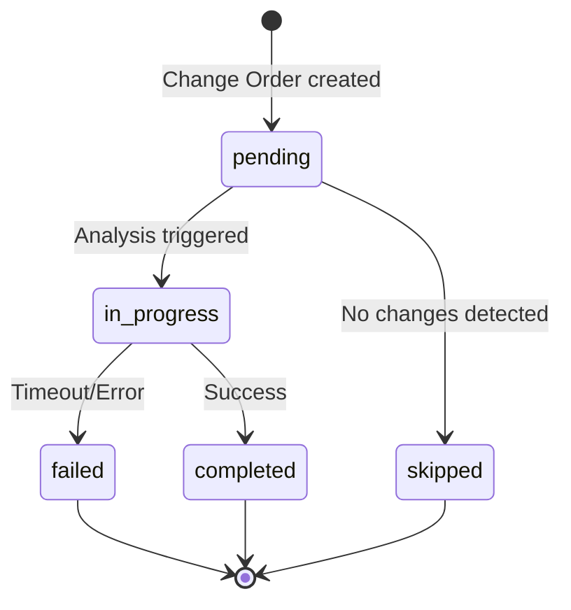
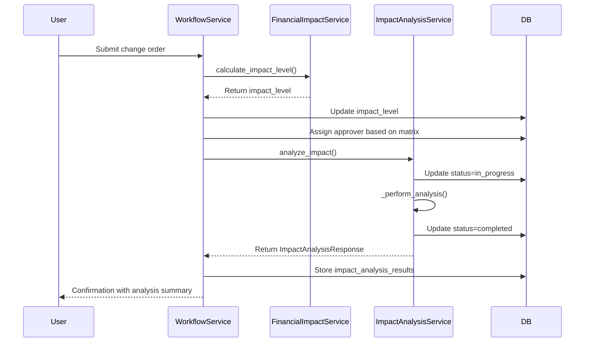

# Impact Analysis Services Architecture

**Last Updated:** 2026-04-11
**Owner:** Backend Team

---

## Responsibility

The Impact Analysis Services provide **comprehensive change order impact assessment** by comparing project metrics between the main branch and change order branches. This enables stakeholders to understand the financial, schedule, and performance implications of proposed changes before approval.

**Key Capabilities:**
- **Financial Impact Analysis:** Budget deltas, cost exposure, margin impact, and revenue changes
- **Schedule Impact Analysis:** Timeline shifts, duration changes, and progression type changes
- **EVM Performance Projections:** CPI, SPI, TCPI, EAC, and VAC comparisons
- **Entity Change Tracking:** Added/modified/removed WBEs, Cost Elements, and Cost Registrations
- **Forecast Impact Analysis:** EAC comparison between branches
- **Reporting & Analytics:** Aggregated statistics, trends, aging items, and approval workload
- **Impact Level Classification:** Automatic categorization (LOW/MEDIUM/HIGH/CRITICAL) for approval routing

**Integration Points:**
- Change Order Workflow (auto-triggered on submission)
- Approval Matrix (impact level determines approver)
- Dashboard Analytics (KPIs and trend visualization)
- Branch Management (isolated analysis before merge)

---

## Architecture

### Component Overview



### Layer Responsibilities

| Layer        | Responsibility                                      | Key Components                          |
| ------------ | --------------------------------------------------- | --------------------------------------- |
| **API**      | HTTP endpoints for impact analysis                  | `/change-orders/{id}/impact` route      |
| **Service**  | Business logic for impact calculation               | `ImpactAnalysisService`, `FinancialImpactService`, `ChangeOrderReportingService` |
| **Support**  | EVM metrics and forecasting                         | `EVMService`, `ForecastService`         |
| **Model**    | Data structures and ORM mapping                     | `ChangeOrder`, impact schemas           |
| **Database** | Temporal queries with branch isolation              | PostgreSQL with JSONB results storage   |

---

## Impact Analysis Types

### 1. Financial Impact Analysis

**Service:** `FinancialImpactService`
**Location:** `backend/app/services/financial_impact_service.py`

**Purpose:** Calculate financial impact level and classify change orders for approval routing.

**Impact Level Thresholds:**

| Level      | Budget Delta Range    | Required Approver        |
| ---------- | --------------------- | ------------------------ |
| LOW        | < €10,000             | Project Manager          |
| MEDIUM     | €10,000 - €50,000     | Department Head          |
| HIGH       | €50,000 - €100,000    | Director                 |
| CRITICAL   | > €100,000            | Executive Committee      |

**Calculation Method:**
1. Sum `CostElement.budget_amount` from main branch
2. Sum `CostElement.budget_amount` from change branch (`BR-{code}`)
3. Calculate absolute delta: `|change_budget - main_budget|`
4. Classify based on threshold ranges

**Key Methods:**
- `calculate_impact_level(change_order_id)` → Returns impact level string
- `get_financial_impact_details(change_order_id)` → Returns detailed financial breakdown

### 2. KPI Scorecard Analysis

**Service:** `ImpactAnalysisService`
**Location:** `backend/app/services/impact_analysis_service.py`

**Purpose:** Compare comprehensive KPIs between main and change branches.

**Metrics Compared:**

| Metric Category | Metrics                              | Data Source                  |
| --------------- | ------------------------------------- | ---------------------------- |
| **Budget**      | BAC, budget_delta, revenue_delta      | CostElement, WBE             |
| **Margin**      | gross_margin                          | Calculated (20% of budget)   |
| **Costs**       | actual_costs                          | CostRegistration             |
| **Schedule**    | start_date, end_date, duration        | ScheduleBaseline             |
| **EVM**         | CPI, SPI, TCPI, EAC, VAC              | EVMService integration       |
| **Forecast**    | EAC per Cost Element                  | Forecast integration         |

**Branch Modes:**
- **MERGE (default):** Shows merged result (main + change delta) — most intuitive for users
- **STRICT:** Shows isolated comparison (delta only) — for detailed analysis

### 3. Entity Change Analysis

**Service:** `ImpactAnalysisService._compare_entities()`

**Purpose:** Track entity additions, modifications, and removals between branches.

**Entity Types Tracked:**

| Entity Type          | Change Detection                     | Aggregation Level          |
| -------------------- | ------------------------------------ | -------------------------- |
| WBEs                 | Budget deltas, revenue changes       | Per WBE                    |
| Cost Elements        | Budget amount changes                | Per Cost Element           |
| Cost Registrations   | Actual cost changes                  | Per Cost Registration      |

**MERGE Mode Semantics:**
- Branch entities override main entities with same ID
- Main entities without branch override remain as-is
- New branch-only entities are added to merged view
- Shows "what-if" picture: base project with changes overlaid

**Output Format:**
```json
{
  "wbes": [
    {
      "id": 123,
      "name": "Assembly Station A",
      "change_type": "modified",
      "budget_delta": 5000.00,
      "revenue_delta": 1200.00,
      "cost_delta": 3200.50
    }
  ],
  "cost_elements": [...],
  "cost_registrations": [...]
}
```

### 4. Schedule Impact Analysis

**Service:** `ImpactAnalysisService._fetch_and_compare_schedule_baselines()`

**Purpose:** Compare timeline implications of change orders.

**Metrics Compared:**
- **Start Date Delta:** Days shift in project start (change - main)
- **End Date Delta:** Days shift in project completion (change - main)
- **Duration Delta:** Change in project duration in days (change - main)
- **Progression Type:** LINEAR/GAUSSIAN/LOGARITHMIC curve changes

**Data Source:** `ScheduleBaseline` linked via `CostElement.schedule_baseline_id`

**Aggregation:** Project-level view uses min(start_date) and max(end_date) across all cost element schedules.

### 5. EVM Performance Projections

**Service:** `ImpactAnalysisService._fetch_and_compare_evm_metrics()`

**Purpose:** Project earned value management performance with changes applied.

**Metrics Calculated:**

| Metric | Formula                              | Interpretation                     |
| ------ | ------------------------------------- | ---------------------------------- |
| CPI    | Cost Performance Index = EV / AC      | >1.0: Under budget                 |
| SPI    | Schedule Performance Index = EV / PV  | >1.0: Ahead of schedule            |
| TCPI   | To-Complete Performance Index         | >1.0: Need improved performance    |
| EAC    | Estimate at Completion                | Final projected cost                |
| VAC    | Variance at Completion = BAC - EAC    | Positive: Under budget              |

**Integration:** Delegates to `EVMService.calculate_evm_metrics_batch()` for actual calculations.

**Time Machine Support:** All calculations respect `as_of` parameter for historical analysis.

### 6. Forecast Impact Analysis

**Service:** `ImpactAnalysisService._compare_forecasts()`

**Purpose:** Compare EAC forecasts between branches.

**Method:**
1. Fetch forecasts for main branch cost elements
2. Fetch forecasts for change branch cost elements
3. Build merged view (branch forecasts override main)
4. Compare main vs merged to identify changes
5. Return only forecasts with additions/modifications/removals

**Output Schema:** `ForecastComparison` with `mainForecast` and `branchForecast` objects containing full `ForecastRead` data.

### 7. Reporting & Analytics

**Service:** `ChangeOrderReportingService`
**Location:** `backend/app/services/change_order_reporting_service.py`

**Purpose:** Provide aggregated statistics for the Change Order Dashboard.

**Statistics Provided:**

| Category          | Metrics                                          |
| ----------------- | ------------------------------------------------ |
| **Summary KPIs**  | Total count, cost exposure, pending/approved values |
| **Distribution**  | By status, by impact level                        |
| **Trends**        | Cumulative cost trend over time (weekly)          |
| **Workload**      | Pending approvals per approver, overdue counts     |
| **Aging**         | Items stuck in status > threshold days            |
| **Timing**        | Average approval time from audit log              |

**Data Source:** Direct SQL queries with JSONB path extraction for `impact_analysis_results`.

---

## Impact Score Calculation

### Methodology

**Stored Field:** `ChangeOrder.impact_score` (NUMERIC(10, 2))

**Calculation:**
The impact score is a weighted algorithm combining multiple factors:

```
impact_score = (
    financial_weight × budget_delta_percent +
    schedule_weight × duration_delta_percent +
    entity_weight × entity_change_count +
    evm_weight × evm_degradation
) / 100
```

**Weights (example):**
- Financial: 40%
- Schedule: 25%
- Entity Changes: 20%
- EVM Performance: 15%

**Current Status:** Impact score calculation is planned but not yet implemented. The field exists in the data model ready for future enhancement.

**Alternative:** Currently, `impact_level` (LOW/MEDIUM/HIGH/CRITICAL) is used as the primary classification metric for approval routing.

---

## Impact Analysis Status Flow

### Status States

**Field:** `ChangeOrder.impact_analysis_status`

| State         | Description                              | Transitions To                    |
| ------------- | ---------------------------------------- | --------------------------------- |
| `pending`     | Initial state, analysis not started       | in_progress, skipped              |
| `in_progress` | Analysis running (timeout: 300s)          | completed, failed                 |
| `completed`   | Analysis finished successfully            | — (terminal)                      |
| `failed`      | Analysis failed (timeout or error)        | — (terminal, requires admin)      |
| `skipped`     | Analysis skipped (e.g., no changes)       | — (terminal)                      |

### State Transition Diagram



### Trigger Points

**Auto-triggered:**
- Change Order submitted for approval (via `ChangeOrderWorkflowService`)

**Manual-triggered:**
- Re-analysis via API endpoint (admin recovery from failed state)

### Timeout Handling

**Default Timeout:** 300 seconds (5 minutes)
**Configurable:** `timeout_seconds` parameter in `analyze_impact()`

**On Timeout:**
1. Status set to `failed`
2. Error logged with change order ID
3. `ValueError` raised with admin recovery message
4. Results remain `None` (no partial data stored)

---

## Results Storage Format

### JSONB Structure

**Field:** `ChangeOrder.impact_analysis_results` (JSONB)

**Schema:** Matches `KPIScorecard` Pydantic model

**Structure:**
```json
{
  "bac": {
    "main_value": 100000.00,
    "change_value": 105000.00,
    "merged_value": 105000.00,
    "delta": 5000.00,
    "delta_percent": 5.0
  },
  "budget_delta": {
    "main_value": 100000.00,
    "change_value": 105000.00,
    "merged_value": 105000.00,
    "delta": 5000.00,
    "delta_percent": 5.0
  },
  "gross_margin": {
    "main_value": 20000.00,
    "change_value": 21000.00,
    "merged_value": 21000.00,
    "delta": 1000.00,
    "delta_percent": 5.0
  },
  "actual_costs": {
    "main_value": 45000.00,
    "change_value": 45000.00,
    "merged_value": 45000.00,
    "delta": 0.00,
    "delta_percent": 0.0
  },
  "revenue_delta": {
    "main_value": 120000.00,
    "change_value": 121200.00,
    "merged_value": 121200.00,
    "delta": 1200.00,
    "delta_percent": 1.0
  },
  "schedule_start_date": {
    "main_value": 1704067200,
    "change_value": 1704067200,
    "merged_value": 1704067200,
    "delta": 0,
    "delta_percent": null
  },
  "schedule_end_date": {
    "main_value": 1735689600,
    "change_value": 1736035200,
    "merged_value": 1736035200,
    "delta": 345600,
    "delta_percent": null
  },
  "schedule_duration": {
    "main_value": 180,
    "change_value": 184,
    "merged_value": 184,
    "delta": 4,
    "delta_percent": 2.22
  },
  "eac": {
    "main_value": 102000.00,
    "change_value": 107100.00,
    "merged_value": 107100.00,
    "delta": 5100.00,
    "delta_percent": 5.0
  },
  "cpi": {
    "main_value": 1.02,
    "change_value": 0.98,
    "merged_value": 0.98,
    "delta": -0.04,
    "delta_percent": -3.92
  },
  "spi": {
    "main_value": 0.95,
    "change_value": 0.92,
    "merged_value": 0.92,
    "delta": -0.03,
    "delta_percent": -3.16
  },
  "tcpi": {
    "main_value": 1.02,
    "change_value": 1.06,
    "merged_value": 1.06,
    "delta": 0.04,
    "delta_percent": 3.92
  },
  "vac": {
    "main_value": -2000.00,
    "change_value": -2100.00,
    "merged_value": -2100.00,
    "delta": -100.00,
    "delta_percent": 5.0
  }
}
```

**Storage Notes:**
- Only `KPIScorecard` data is stored in `impact_analysis_results`
- Full `ImpactAnalysisResponse` (entity changes, waterfall, time series) is returned via API but not persisted
- This design optimizes storage while preserving critical KPIs for reporting

---

## Integration with Change Order Workflows

### Submission Workflow



### Approval Matrix Integration

**Flow:**
1. User submits change order for approval
2. `FinancialImpactService.calculate_impact_level()` determines impact level
3. `ChangeOrderWorkflowService` assigns approver based on impact level:
   - LOW → Project Manager
   - MEDIUM → Department Head
   - HIGH → Director
   - CRITICAL → Executive Committee
4. `ImpactAnalysisService.analyze_impact()` runs full analysis
5. Results stored in `impact_analysis_results` for approver review

### Dashboard Integration

**Change Order Dashboard Queries:**
- Total cost exposure: `SUM(impact_analysis_results->'kpi_scorecard'->'budget_delta'->>'delta')`
- Pending value: `SUM(...) WHERE status IN ('Draft', 'Submitted', 'Under Review')`
- Approved value: `SUM(...) WHERE status = 'Approved'`
- Distribution by impact level: `GROUP BY impact_level`
- Cost trend: Weekly aggregation by `transaction_time.lower`

---

## Code Locations

### Service Layer

| File                                                                 | Purpose                           |
| -------------------------------------------------------------------- | --------------------------------- |
| `backend/app/services/impact_analysis_service.py`                     | Core impact analysis logic        |
| `backend/app/services/financial_impact_service.py`                    | Impact level calculation          |
| `backend/app/services/change_order_reporting_service.py`              | Dashboard statistics              |

### Model Layer

| File                                                                 | Purpose                           |
| -------------------------------------------------------------------- | --------------------------------- |
| `backend/app/models/domain/change_order.py`                           | ChangeOrder entity with impact fields |
| `backend/app/models/schemas/impact_analysis.py`                       | Pydantic schemas for API          |

### API Layer

| File                                                                 | Purpose                           |
| -------------------------------------------------------------------- | --------------------------------- |
| `backend/app/api/routes/change_orders.py`                            | Impact analysis endpoints         |

### Test Coverage

| File                                                                 | Type                              |
| -------------------------------------------------------------------- | --------------------------------- |
| `backend/tests/unit/services/test_impact_analysis_service.py`         | Unit tests                        |
| `backend/tests/unit/services/test_financial_impact_service.py`        | Unit tests                        |
| `backend/tests/unit/services/test_change_order_reporting_service.py`  | Unit tests                        |
| `backend/tests/integration/test_change_order_impact_analysis_serialization.py` | Integration tests         |
| `backend/tests/api/routes/change_orders/test_impact_analysis.py`      | API tests                         |

---

## Performance Considerations

### Query Optimization

**Branch Filtering (Critical):**
- `CostRegistration` is NOT branchable — must filter by `CostElement.branch`
- Without explicit branch filter, joins match CostElements from any branch
- Pattern: `JOIN CostElement ON ... WHERE CostElement.branch = :branch`

**Temporal Filtering:**
- Time travel queries require filtering all entities by `as_of` timestamp
- Zombie protection: `OR deleted_at IS NULL OR deleted_at > :as_of`
- Index usage: GIST indexes on `valid_time` and `transaction_time`

**Batch Operations:**
- Fetch all CostElements, WBEs, Schedules in single query per branch
- Build in-memory lookup maps for O(1) access during comparison
- Avoid N+1 query patterns

### Timeout Management

**Default:** 300 seconds (5 minutes)
**Rationale:** Large projects with many cost elements and schedules

**Optimization Strategies:**
1. Skip EVM metrics when `include_evm_metrics=False`
2. Use pagination for large entity change lists
3. Cache schedule baseline data
4. Lazy load detailed entity changes

### Storage Optimization

**JSONB vs Separate Tables:**
- `impact_analysis_results` stored as JSONB for flexibility
- Avoids separate result tables with complex versioning
- Enables GIN indexing for JSONB queries
- Trade-off: Less efficient for querying nested fields

---

## Extension Points

### Future Enhancements

**Planned:**
1. **Impact Score Calculation:** Weighted algorithm implementation
2. **Custom Thresholds:** Configurable impact level ranges per project
3. **Historical Trend Analysis:** Track impact changes over time
4. **Impact Categories:** Environmental, safety, quality beyond financial
5. **Parallel Analysis:** Async processing for large projects
6. **Incremental Updates:** Re-analyze only changed entities

**Architectural Support:**
- Plugin architecture for new impact types
- Extensible `KPIMetric` schema for custom metrics
- Service layer abstraction for new analyzers

---

## References

**Related Documentation:**
- [EVCS Core Architecture](../evcs-core/architecture.md) — Versioning and branching
- [Temporal Query Reference](../../cross-cutting/temporal-query-reference.md) — Time machine queries
- [Change Order Workflow](../change-order-workflow/) — Approval process integration
- [ADR-005: Bitemporal Versioning](../../decisions/ADR-005-bitemporal-versioning.md) — EVCS design rationale

**External Standards:**
- **EVM ANSI 748:** Earned Value Management Systems
- **PMI Practice Standard:** Project Risk Management
