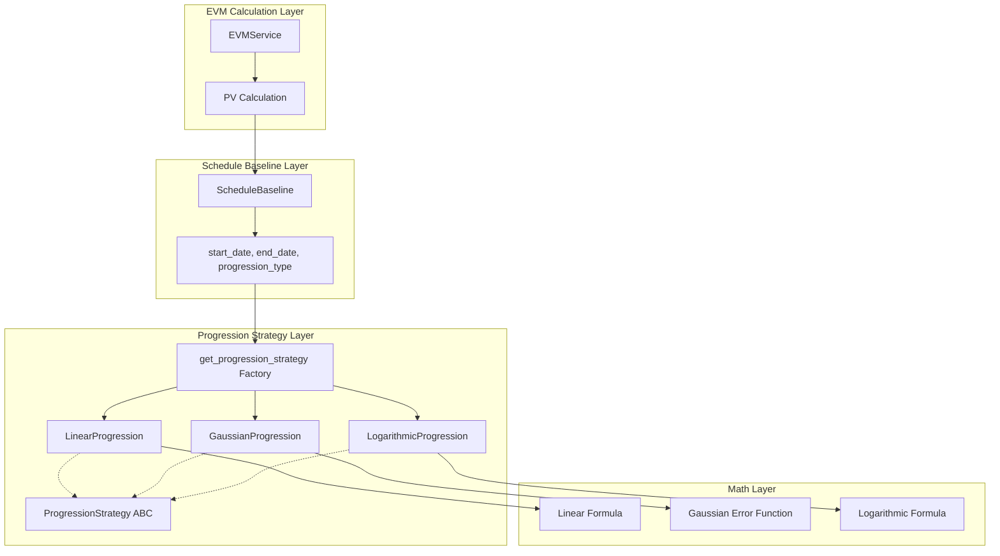

# Progression Calculation Module Architecture

**Last Updated:** 2026-04-11
**Owner:** Backend Team
**Related ADRs:**
- [ADR-009: Schedule Baseline 1:1 Relationship](../../decisions/ADR-009-schedule-baseline-1to1-relationship.md)

---

## Responsibility

The Progression Calculation Module provides pure mathematical functions for calculating planned progress over time for Earned Value Management (EVM) calculations. It enables:

- **Planned Value (PV) Calculation:** Determines the percentage of budget that should be earned at any point in time
- **Flexible Progression Models:** Supports different work patterns (linear, S-curve, front-loaded)
- **Time-Based Calculation:** Maps elapsed time to planned completion percentage
- **Strategy Pattern:** Extensible architecture for adding new progression types

**Document Scope:**

This document covers the **conceptual architecture** of progression calculations:
- Mathematical algorithms for each progression type
- Strategy pattern implementation
- Integration with EVM calculations
- Factory pattern for strategy selection
- Extensibility guidelines

---

## Architecture

### Component Overview



### Layer Responsibilities

| Layer | Responsibility | Key Classes |
|-------|---------------|-------------|
| **EVM Calculation** | Orchestrates EVM metrics, calls PV calculation | `EVMService` |
| **Schedule Baseline** | Stores schedule dates and progression type | `ScheduleBaseline` |
| **Progression Strategy** | Implements progression algorithms | `LinearProgression`, `GaussianProgression`, `LogarithmicProgression` |
| **Factory** | Maps progression_type string to strategy instance | `get_progression_strategy()` |
| **Math** | Pure mathematical calculations | Strategy implementations |

---

## Progression Types

### Overview

The module supports three progression types, each modeling different work patterns:

| Progression Type | Work Pattern | Use Case | Shape |
|-----------------|--------------|----------|-------|
| **LINEAR** | Uniform progress over time | Steady, predictable work | Straight line |
| **GAUSSIAN** | S-curve: slow start, rapid middle, tapering end | Realistic project progression | S-shaped curve |
| **LOGARITHMIC** | Front-loaded: rapid start, slow finish | Upfront planning/design work | Rapid rise, plateau |

### Algorithm Details

#### Linear Progression

**Formula:**
```
progress = (current_date - start_date) / (end_date - start_date)
```

**Characteristics:**
- At 50% of time: exactly 50% progress
- Uniform rate of progress
- Simplest and most predictable
- Works well for steady work

**Example:**
- Schedule: Jan 1 - Dec 31 (365 days)
- At Jul 2 (day 183): progress = 183/365 = 0.501 (50.1%)

**Use Cases:**
- Manufacturing processes with consistent output
- Construction projects with steady progress
- Any work with predictable, uniform completion rate

---

#### Gaussian Progression (S-Curve)

**Formula:**
```
normalized_t = (current_date - start_date) / (end_date - start_date)  # [0, 1]
scaled_t = SCALE_FACTOR × (normalized_t - 0.5)
progress = 0.5 × (1 + erf(scaled_t))
```

Where:
- `erf()` = Gaussian error function
- `SCALE_FACTOR` = 3.0 (controls sharpness of S-curve)

**Characteristics:**
- At 50% of time: exactly 50% progress (symmetric)
- At 25% of time: < 25% progress (slow start)
- At 75% of time: > 75% progress (accelerated middle)
- Models realistic project progression

**Example:**
- Schedule: Jan 1 - Dec 31 (365 days)
- At Apr 2 (day 91, ~25%): progress ≈ 0.075 (7.5%)
- At Jul 2 (day 183, ~50%): progress = 0.50 (50%)
- At Oct 1 (day 274, ~75%): progress ≈ 0.925 (92.5%)

**Use Cases:**
- Most real-world projects (ramp-up, execution, close-out)
- Projects with learning curves
- Work requiring coordination and setup

**Scale Factor:**
- Lower values (< 3.0): More gradual S-curve
- Higher values (> 3.0): Sharper S-curve
- Current default: 3.0 (balanced)

---

#### Logarithmic Progression (Front-Loaded)

**Formula:**
```
normalized_t = (current_date - start_date) / (end_date - start_date)  # [0, 1]
progress = ln(1 + normalized_t) / ln(2)
```

**Characteristics:**
- At 50% of time: > 50% progress (front-loaded)
- At 25% of time: significantly > 25% progress
- Rapid initial progress, slow finish
- Never reaches 100% mathematically (clamped to 1.0)

**Example:**
- Schedule: Jan 1 - Dec 31 (365 days)
- At Apr 2 (day 91, ~25%): progress ≈ 0.322 (32.2%)
- At Jul 2 (day 183, ~50%): progress ≈ 0.585 (58.5%)
- At Oct 1 (day 274, ~75%): progress ≈ 0.786 (78.6%)

**Use Cases:**
- Tasks with upfront planning and design
- Early-phase work (requirements, architecture)
- Projects where early progress is easier than final polish

---

## Integration with EVM

### Planned Value (PV) Calculation

Progression strategies are used to calculate Planned Value (PV), a fundamental EVM metric:

**Formula:**
```
PV = BAC × progress
```

Where:
- **BAC** = Budget at Completion (total planned budget)
- **progress** = Calculated from progression strategy (0.0 to 1.0)

**Example Calculation:**
```python
# Schedule baseline
start_date = datetime(2026, 1, 1)
end_date = datetime(2026, 12, 31)
progression_type = "GAUSSIAN"

# Calculate progress at July 2, 2026
control_date = datetime(2026, 7, 2)
strategy = get_progression_strategy(progression_type)
progress = strategy.calculate_progress(control_date, start_date, end_date)
# progress ≈ 0.50 (50%)

# Calculate PV
bac = Decimal("100000.00")  # $100,000 budget
pv = bac * Decimal(str(progress))
# pv = $50,000.00
```

### Time Travel Support

Progression calculations support time-travel queries via the `control_date` parameter:

- **Historical Analysis:** Calculate PV as of any past date
- **Forecasting:** Project future PV based on schedule
- **Audit Trail:** See what PV was expected at any point in time

### Branch Isolation

Progression respects EVCS branching:

- Each branch can have different schedule baselines
- Change orders can modify progression type
- What-if scenarios maintain separate progression calculations

---

## Strategy Pattern Implementation

### Abstract Base Class

```python
class ProgressionStrategy(ABC):
    """Abstract base class for progression strategies."""

    @abstractmethod
    def calculate_progress(
        self,
        current_date: datetime,
        start_date: datetime,
        end_date: datetime
    ) -> float:
        """Calculate progress (0.0 to 1.0) at current_date.

        Args:
            current_date: The date for which to calculate progress
            start_date: The start date of the schedule baseline
            end_date: The end date of the schedule baseline

        Returns:
            A float between 0.0 and 1.0 representing progress

        Raises:
            ValueError: If start_date >= end_date
        """
        ...
```

### Concrete Implementations

Each progression type implements the `ProgressionStrategy` interface:

1. **LinearProgression:** Simple linear interpolation
2. **GaussianProgression:** Error function-based S-curve
3. **LogarithmicProgression:** Natural logarithm-based front-loaded curve

### Factory Pattern

The `get_progression_strategy()` function maps progression type strings to strategy instances:

```python
def get_progression_strategy(progression_type: str) -> ProgressionStrategy:
    """Get the appropriate progression strategy based on type string.

    Args:
        progression_type: The type of progression ("LINEAR", "GAUSSIAN", "LOGARITHMIC")

    Returns:
        ProgressionStrategy instance

    Raises:
        ValueError: If progression_type is unknown
    """
    strategies = {
        "LINEAR": LinearProgression(),
        "GAUSSIAN": GaussianProgression(),
        "LOGARITHMIC": LogarithmicProgression(),
    }

    strategy = strategies.get(progression_type.upper())
    if strategy is None:
        raise ValueError(
            f"Unknown progression type: {progression_type}. "
            f"Must be one of: {', '.join(strategies.keys())}"
        )

    return strategy
```

---

## Extensibility

### Adding New Progression Types

To add a new progression type:

1. **Create Strategy Class:**
   ```python
   # backend/app/services/progression/exponential.py
   from app.services.progression.base import ProgressionStrategy

   class ExponentialProgression(ProgressionStrategy):
       """Exponential back-loaded progression strategy."""

       def calculate_progress(
           self,
           current_date: datetime,
           start_date: datetime,
           end_date: datetime
       ) -> float:
           # Implement exponential formula
           ...
   ```

2. **Update Database ENUM:**
   ```sql
   ALTER TYPE progression_type ADD VALUE 'EXPONENTIAL';
   ```

3. **Update Factory:**
   ```python
   # backend/app/services/progression/__init__.py
   from app.services.progression.exponential import ExponentialProgression

   def get_progression_strategy(progression_type: str) -> ProgressionStrategy:
       strategies = {
           "LINEAR": LinearProgression(),
           "GAUSSIAN": GaussianProgression(),
           "LOGARITHMIC": LogarithmicProgression(),
           "EXPONENTIAL": ExponentialProgression(),  # Add new type
       }
       ...
   ```

4. **Add Tests:**
   ```python
   # backend/tests/unit/domain/test_progression.py
   class TestExponentialProgression:
       def test_exponential_progression_start_point(self):
           ...

       def test_exponential_progression_end_point(self):
           ...
   ```

### Design Considerations

When adding new progression types:

- **Boundary Conditions:** Ensure progress = 0.0 at start, 1.0 at end
- **Monotonicity:** Progress must always increase over time
- **Clamping:** Handle edge cases (before start, after end)
- **Performance:** Calculations should be fast (called frequently)
- **Numerical Stability:** Avoid floating-point precision issues

---

## Code Locations

### Service Layer

- **Base Strategy:** `backend/app/services/progression/base.py` - Abstract base class
- **Linear Progression:** `backend/app/services/progression/linear.py` - Linear implementation
- **Gaussian Progression:** `backend/app/services/progression/gaussian.py` - S-curve implementation
- **Logarithmic Progression:** `backend/app/services/progression/logarithmic.py` - Front-loaded implementation
- **Factory:** `backend/app/services/progression/__init__.py` - Strategy factory and exports

### Model Layer

- **ScheduleBaseline:** `backend/app/models/domain/schedule_baseline.py` - Contains `progression_type` field (ENUM)

### Service Integration

- **EVMService:** `backend/app/services/evm_service.py` - Uses progression for PV calculations (lines 295, 500, 1398)
- **ScheduleBaselineService:** `backend/app/services/schedule_baseline_service.py` - Manages schedule baselines with progression types
- **ImpactAnalysisService:** `backend/app/services/impact_analysis_service.py` - Uses progression for what-if scenarios

### API Layer

- **Schedule Baseline Routes:** `backend/app/api/routes/schedule_baselines.py` - CRUD endpoints for schedule baselines
- **Cost Element Routes:** `backend/app/api/routes/cost_elements.py` - Nested schedule baseline endpoints

### Tests

- **Unit Tests:** `backend/tests/unit/domain/test_progression.py` - Pure mathematical tests
- **PV Calculation Tests:** `backend/tests/unit/services/test_pv_calculation.py` - EVM integration tests
- **Service Tests:** `backend/tests/unit/services/test_schedule_baseline_service.py` - Service layer tests
- **API Tests:** `backend/tests/api/routes/schedule_baselines/test_schedule_baselines.py` - Endpoint tests

---

## Data Model

### ScheduleBaseline.progression_type

| Field | Type | Constraints | Values |
|-------|------|-------------|--------|
| `progression_type` | ENUM | NOT NULL, DEFAULT "LINEAR" | "LINEAR", "GAUSSIAN", "LOGARITHMIC" |

**Database Definition:**
```sql
CREATE TYPE progression_type AS ENUM (
    'LINEAR',
    'GAUSSIAN',
    'LOGARITHMIC'
);

ALTER TABLE schedule_baselines
ADD COLUMN progression_type progression_type NOT NULL DEFAULT 'LINEAR';
```

---

## Performance Considerations

### Calculation Performance

Progression calculations are **pure mathematical functions** with no I/O:

- **Typical execution time:** < 1 microsecond per calculation
- **No database queries:** All data passed as parameters
- **No side effects:** Safe for concurrent use
- **Memory efficient:** No state maintained

### Optimization Strategies

1. **Caching:** Strategy instances are stateless and can be reused
2. **Batch Calculations:** Calculate PV for multiple cost elements in parallel
3. **Pre-computation:** For time-series, pre-calculate progression values

### Performance Targets

- **Single PV Calculation:** < 1ms (including database queries)
- **Time-Series PV (100 points):** < 100ms
- **Batch PV (100 cost elements):** < 500ms

---

## Testing Strategy

### Unit Tests

Pure mathematical tests verify algorithm correctness:

```python
# Test boundary conditions
def test_linear_progression_start_point(self):
    """At start (current = start_date), progress should be 0.0."""
    progress = LinearProgression().calculate_progress(start_date, start_date, end_date)
    assert progress == 0.0

def test_linear_progression_end_point(self):
    """At end (current = end_date), progress should be 1.0."""
    progress = LinearProgression().calculate_progress(end_date, start_date, end_date)
    assert progress == 1.0

# Test progression characteristics
def test_gaussian_progression_s_curve_slow_start(self):
    """At 25% time, progress should be LESS than 25% (slow start)."""
    progress = GaussianProgression().calculate_progress(quarter_date, start_date, end_date)
    assert progress < 0.25

def test_logarithmic_progression_front_loaded(self):
    """At 25% time, progress should be GREATER than 25% (front-loaded)."""
    progress = LogarithmicProgression().calculate_progress(quarter_date, start_date, end_date)
    assert progress > 0.25
```

### Integration Tests

Verify EVM integration:

```python
async def test_pv_calculation_with_progression(self):
    """PV should use correct progression strategy."""
    baseline = await create_schedule_baseline(progression_type="GAUSSIAN")
    pv = await evm_service.calculate_pv(
        cost_element_id=ce_id,
        control_date=datetime(2026, 7, 2),
        branch="main"
    )
    # Verify PV matches Gaussian S-curve calculation
```

### Test Coverage

- **Current Coverage:** 95%+ (exceeds 80% threshold)
- **Test Count:** 40+ tests across unit, integration, and API layers
- **Edge Cases:** Boundary conditions, clamping, invalid inputs

---

## See Also

### Related Architecture

- [EVCS Core Architecture](../evcs-core/architecture.md) - Bitemporal versioning and branching
- [Schedule Baseline ADR](../../decisions/ADR-009-schedule-baseline-1to1-relationship.md) - 1:1 relationship decision

### Related Services

- **EVMService:** `backend/app/services/evm_service.py` - EVM metrics orchestration
- **ScheduleBaselineService:** `backend/app/services/schedule_baseline_service.py` - Schedule baseline management
- **ImpactAnalysisService:** `backend/app/services/impact_analysis_service.py` - What-if scenario analysis

### Cross-Cutting

- [Database Strategy](../../cross-cutting/database-strategy.md) - PostgreSQL ENUM usage
- [API Conventions](../../cross-cutting/api-conventions.md) - Endpoint patterns

### Implementation Guides

- [EVCS Implementation Guide](../evcs-core/evcs-implementation-guide.md) - EVCS patterns and usage
- [Temporal Query Reference](../../cross-cutting/temporal-query-reference.md) - Time-travel query patterns
