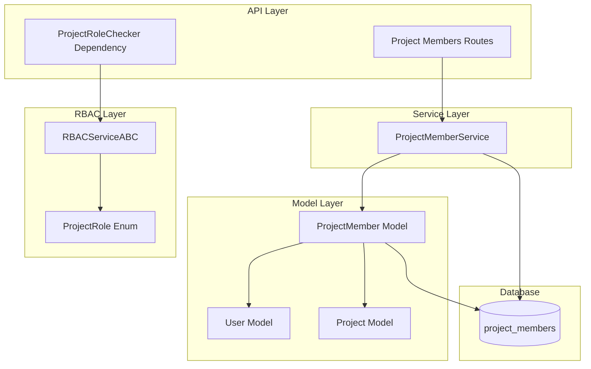
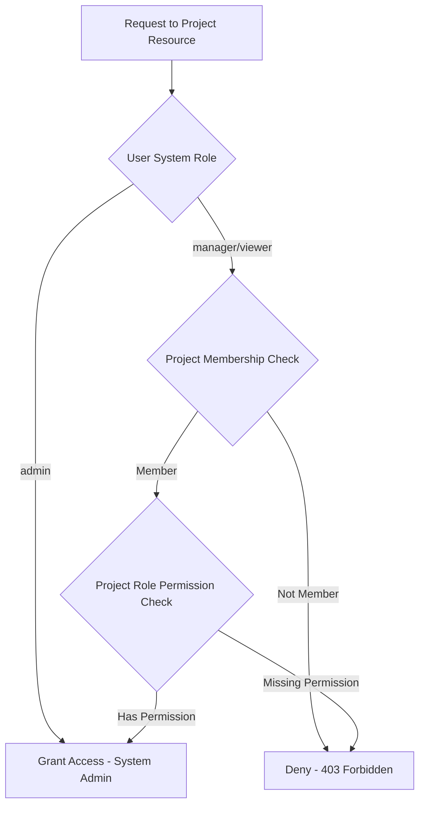

# Project Members Bounded Context

**Last Updated:** 2026-04-11
**Owner:** Backend Team

---

## Responsibility

The Project Members context manages **project-level role assignments** for users within the Backcast system. It provides a many-to-many relationship between Users and Projects with role-based access control (RBAC), enabling fine-grained permissions at the project level.

**Key Capabilities:**
- **Role Assignment:** Assign users to projects with specific roles (admin, manager, editor, viewer)
- **Membership Management:** Add, update, and remove project members
- **Access Control:** Project-scoped permissions via `ProjectRoleChecker` dependency
- **Audit Trail:** Track who assigned roles and when
- **Query Support:** List members by project, list projects by user, check membership

---

## Architecture

### Component Overview



### Layer Responsibilities

| Layer        | Responsibility                                  | Key Components                        |
| ------------ | ---------------------------------------------- | ------------------------------------- |
| **API**      | HTTP endpoints for membership CRUD             | `/projects/{id}/members` routes       |
| **Auth**     | Project-level authorization checks             | `ProjectRoleChecker` dependency       |
| **Service**  | Business logic for membership operations       | `ProjectMemberService`                |
| **Model**    | Data structures and ORM mapping                | `ProjectMember`, `ProjectRole` enum   |
| **RBAC**     | Permission validation for project access       | `RBACServiceABC.has_project_access()` |

---

## Data Model

### ProjectMember Entity

**Purpose:** Non-versioned entity managing user-to-project role assignments. Satisfies `SimpleEntityProtocol` via `SimpleEntityBase`.

| Field        | Type            | Constraints               | Description                                    |
| ------------ | --------------- | ------------------------- | ---------------------------------------------- |
| id           | UUID            | PK, auto-generated        | Primary key (version identifier)               |
| user_id      | UUID            | FK → users.user_id        | User being assigned (root ID)                  |
| project_id   | UUID            | FK → projects.project_id  | Project for assignment (root ID)               |
| role         | String(50)      | NOT NULL, indexed         | ProjectRole enum value                         |
| assigned_at  | DateTime TZ     | NOT NULL, default=now()   | When role was assigned                         |
| assigned_by  | UUID            | FK → users.user_id        | User who assigned the role (NULL if deleted)   |
| created_at   | DateTime TZ     | NOT NULL, default=now()   | Record creation timestamp                      |
| updated_at   | DateTime TZ     | NOT NULL, default=now()   | Record update timestamp                        |

**Constraints:**
- `uq_project_members_user_project`: Unique constraint on (user_id, project_id) — one role per user per project
- Foreign keys cascade on delete (user/project deletion removes memberships)

**Relationships:**
```python
user: Mapped["User"]        # Viewonly relationship to assigned user
project: Mapped["Project"]  # Viewonly relationship to project
assigner: Mapped["User"]    # Viewonly relationship to assigner
```

**Computed Properties:**
- `user_name`: Full name of assigned user (lazy-loaded)
- `user_email`: Email of assigned user (lazy-loaded)
- `assigned_by_name`: Name of user who assigned role (lazy-loaded)
- `project_name`: Name of project (lazy-loaded)

---

## Role System

### ProjectRole Enum

**Location:** `backend/app/core/enums.py`

| Role                | Permissions                                                                                                                                                 |
| ------------------- | ----------------------------------------------------------------------------------------------------------------------------------------------------------- |
| `PROJECT_ADMIN`     | `project-*`, `cost-element-*`, `wbe-*`, `progress-entry-*`, `change-order-*`, `forecast-*`                                                                 |
| `PROJECT_MANAGER`   | `project-read`, `project-update`, `cost-element-*`, `wbe-*`, `progress-entry-*`, `change-order-read/create`, `forecast-*`                                  |
| `PROJECT_EDITOR`    | `project-read`, `project-update`, `cost-element-create/read/update`, `wbe-read`, `progress-entry-create/read/update`, `change-order-read`, `forecast-*` |
| `PROJECT_VIEWER`    | `project-read`, `cost-element-read`, `wbe-read`, `progress-entry-read`, `change-order-read`, `forecast-read`                                             |

**UI Color Mapping:**
- `PROJECT_ADMIN`: error (red)
- `PROJECT_MANAGER`: warning (orange)
- `PROJECT_EDITOR`: processing (blue)
- `PROJECT_VIEWER`: default (gray)

### Permission Format

**Pattern:** `{resource}-{action}`

**Resources:**
- `project`, `cost-element`, `wbe`, `progress-entry`, `change-order`, `forecast`

**Actions:**
- `read`, `create`, `update`, `delete`, `admin`

**Wildcard:**
- `*` matches all actions for a resource

---

## API Endpoints

### Base Path
`/api/v1/projects/{project_id}/members`

### Operations

#### List Project Members
```
GET /api/v1/projects/{project_id}/members
Authorization: Bearer <token>
```

**Permission Required:** `project-read`

**Response:** `ProjectMemberPublic[]`

**Example Response:**
```json
[
  {
    "id": "123e4567-e89b-12d3-a456-426614174000",
    "user_id": "user-uuid",
    "project_id": "project-uuid",
    "role": "project_admin",
    "assigned_at": "2026-04-11T10:00:00Z",
    "assigned_by": "admin-uuid",
    "user_name": "John Doe",
    "user_email": "john@example.com",
    "assigned_by_name": "Admin User",
    "project_name": "Project Alpha",
    "created_at": "2026-04-11T10:00:00Z",
    "updated_at": "2026-04-11T10:00:00Z"
  }
]
```

#### Add Project Member
```
POST /api/v1/projects/{project_id}/members
Authorization: Bearer <token>
Content-Type: application/json
```

**Permission Required:** `project-admin`

**Request Body:** `ProjectMemberCreate`
```json
{
  "user_id": "user-uuid",
  "project_id": "project-uuid",
  "role": "project_editor"
}
```

**Response:** `201 Created` + `ProjectMemberPublic`

**Validation:**
- Path `project_id` must match body `project_id`
- User cannot be added if already a member (unique constraint)

#### Update Member Role
```
PATCH /api/v1/projects/{project_id}/members/{user_id}
Authorization: Bearer <token>
Content-Type: application/json
```

**Permission Required:** `project-admin`

**Request Body:** `ProjectMemberUpdate`
```json
{
  "role": "project_admin"
}
```

**Response:** `200 OK` + `ProjectMemberPublic`

**Behavior:** Updates role, sets `assigned_by` to current user

#### Remove Project Member
```
DELETE /api/v1/projects/{project_id}/members/{user_id}
Authorization: Bearer <token>
```

**Permission Required:** `project-admin`

**Response:** `204 No Content`

**Behavior:** Hard delete (removes membership record)

---

## Authorization Model

### System-Level vs Project-Level Access

The system implements **two-tier authorization**:

1. **System-Level:** User's global role (admin, manager, viewer) from `users.role`
2. **Project-Level:** User's role within a specific project from `project_members.role`

### Access Decision Flow



### ProjectRoleChecker Dependency

**Purpose:** FastAPI dependency for project-scoped authorization

**Usage:**
```python
from app.api.dependencies.auth import ProjectRoleChecker

@router.get("/projects/{project_id}/wbes")
async def list_project_wbes(
    project_id: UUID,
    current_user: User = Depends(
        ProjectRoleChecker(required_permission="project-read")
    ),
):
    # Only executes if user has project-read access
    ...
```

**Authorization Logic:**
1. System admins bypass all project-level checks (always grant)
2. For non-admins, queries `project_members` table for membership
3. Checks if user's project role has required permission
4. Returns 403 Forbidden if access denied

### RBAC Integration

**Methods in `RBACServiceABC`:**

- `async has_project_access(user_id, user_role, project_id, required_permission) -> bool`
- `async get_user_projects(user_id, user_role) -> list[UUID]`
- `async get_project_role(user_id, project_id) -> str | None`

**Implementation:**
- System admins: Returns all projects, grants all permissions
- Project members: Queries `project_members` table, checks role permissions

---

## Service Layer

### ProjectMemberService

**Location:** `backend/app/services/project_member.py`

**Methods:**

| Method                                      | Description                                                 |
| ------------------------------------------- | ----------------------------------------------------------- |
| `get(entity_id)`                            | Get member by ID                                            |
| `create(**fields)`                          | Create new membership                                       |
| `update(entity_id, **updates)`              | Update member fields                                        |
| `delete(entity_id)`                         | Hard delete membership                                      |
| `get_by_user_and_project(user_id, project_id)` | Get membership by user + project (unique lookup)        |
| `list_by_project(project_id, skip, limit)`  | Paginated list of project members                          |
| `list_by_user(user_id, skip, limit)`        | Paginated list of user's project memberships               |
| `get_with_details(member_id)`               | Get member with eager-loaded relationships                  |
| `list_by_project_with_details(project_id)`  | List members with eager-loaded relationships                |
| `check_membership(user_id, project_id)`     | Check if user is a member                                   |
| `remove_member(member_id)`                  | Alias for delete                                            |

**Query Patterns:**
- Uses `selectinload` for eager-loading related entities
- Supports pagination via `skip`/`limit` parameters
- Returns `None` for not-found scenarios (vs exceptions)

---

## Database Schema

### Table: project_members

**Migration:** `021bb7eeaa21_add_project_members_table.py`

**Indexes:**
- `ix_project_members_user_id`: Fast lookup by user
- `ix_project_members_project_id`: Fast lookup by project
- `ix_project_members_role`: Fast lookup by role (for admin queries)

**Foreign Keys:**
- `user_id` → `users.user_id` (CASCADE DELETE)
- `project_id` → `projects.project_id` (CASCADE DELETE)
- `assigned_by` → `users.user_id` (SET NULL)

**Constraints:**
- `uq_project_members_user_project`: Ensures one role per user per project

---

## Pydantic Schemas

**Location:** `backend/app/models/schemas/project_member.py`

### Schemas

| Schema                  | Purpose                                       |
| ----------------------- | --------------------------------------------- |
| `ProjectMemberBase`     | Base fields (role)                            |
| `ProjectMemberCreate`   | Input for creating membership                |
| `ProjectMemberUpdate`   | Input for updating role                       |
| `ProjectMemberRead`     | Output with computed fields (user_name, etc.) |
| `ProjectMemberPublic`   | Alias for ProjectMemberRead                   |

**Note:** `assigned_by` is optional in create (auto-set to current user)

---

## Integration Points

### Auth Context

- **Dependency:** `ProjectRoleChecker` uses `get_current_user` from auth context
- **RBAC:** Uses `RBACServiceABC` for permission validation
- **User Model:** References `User` entity for assigner information

### Project Context

- **Membership:** Projects use `project_members` for access control
- **Operations:** All project-scoped routes use `ProjectRoleChecker`
- **Deletion:** Cascade delete removes memberships when project deleted

### Future Integrations

- **Notifications:** Notify users when assigned to projects
- **Audit Logging:** Track role changes for compliance
- **Bulk Operations:** Batch add/remove members
- **Role Templates:** Pre-defined role sets for common scenarios

---

## Code Locations

### Backend Files

```
backend/app/
├── api/
│   ├── dependencies/
│   │   └── auth.py                      # ProjectRoleChecker dependency
│   └── routes/
│       └── project_members.py           # Project members API routes
├── core/
│   ├── enums.py                         # ProjectRole enum with permissions
│   └── rbac.py                          # RBACServiceABC with project access methods
├── models/
│   ├── domain/
│   │   └── project_member.py            # ProjectMember ORM model
│   └── schemas/
│       └── project_member.py            # Pydantic schemas
└── services/
    └── project_member.py                # ProjectMemberService
```

### Database

```
backend/alembic/versions/
└── 021bb7eeaa21_add_project_members_table.py  # Migration for project_members table
```

### Tests

```
backend/tests/
├── services/
│   └── test_project_member_service.py    # 16 service tests
└── api/
    └── routes/
        └── test_project_members.py       # API endpoint tests
```

### Configuration

```
backend/
└── config/
    └── rbac.json                        # System-level role permissions
```

---

## Important Patterns & Gotchas

### 1. One Role Per User Per Project

**Pattern:** Unique constraint on (user_id, project_id)

**Gotcha:** Cannot assign multiple roles to same user in same project. To change roles, update existing membership instead of creating new one.

### 2. System Admins Bypass Project Checks

**Pattern:** System admins (user.role = "admin") always have project access

**Gotcha:** System admins don't need `ProjectMember` entries. Don't auto-create memberships for admins.

### 3. Cascade Deletion

**Pattern:** Deleting a user or project cascades to memberships

**Gotcha:** `assigned_by` field uses `SET NULL` to preserve audit trail when assigner deleted

### 4. Lazy-Loaded Computed Properties

**Pattern:** `user_name`, `user_email`, etc. check relationship load status

**Gotcha:** These return `None` if relationships not eager-loaded. Use `get_with_details()` or `list_by_project_with_details()` for populated values.

### 5. Role vs Permission

**Pattern:** `project_members.role` stores role enum value

**Gotcha:** Permissions are derived from role, not stored. Check `ProjectRole.permissions` property for permission list.

### 6. Audit Trail

**Pattern:** `assigned_by` tracks who made role assignments

**Gotcha:** `assigned_by` not automatically updated on role changes. API routes must explicitly set it.

---

## Testing Strategy

### Unit Tests

**File:** `backend/tests/services/test_project_member_service.py`

**Coverage:**
- CRUD operations (create, read, update, delete)
- Unique constraint enforcement
- Pagination
- Membership checks
- Relationship loading

**Test Count:** 16 tests

### Integration Tests

**File:** `backend/tests/api/routes/test_project_members.py`

**Coverage:**
- Endpoint availability
- Permission checks
- Validation logic
- Response schemas

### RBAC Tests

**File:** `backend/tests/api/test_dependencies/test_project_role_checker.py`

**Coverage:**
- System admin bypass
- Project member access
- Permission validation
- Non-member denial

---

## Future Enhancements

- **Role Inheritance:** Hierarchical roles (e.g., manager inherits editor permissions)
- **Temporary Access:** Time-limited memberships with expiration dates
- **Membership Requests:** User-requested memberships with approval workflow
- **Role History:** Track role changes over time (temporal versioning)
- **Bulk Operations:** Batch import/export members via CSV
- **Notification Integration:** Email/in-app notifications for role changes
- **Delegation:** Allow project admins to delegate admin privileges

---

## Related Documentation

- [Auth & Authorization Context](../auth/architecture.md) — System-level RBAC
- [User Management Context](../user-management/architecture.md) — User entity
- [EVCS Core Architecture](../evcs-core/architecture.md) — Entity versioning patterns
- [ADR-007: RBAC Service Design](../../decisions/ADR-007-rbac-service.md) — RBAC architecture decision
- [Cross-Cutting: API Conventions](../../cross-cutting/api-conventions.md) — API standards

---

## Changelog

| Date       | Change                                    | Author       |
| ---------- | ----------------------------------------- | ------------ |
| 2026-04-11 | Initial project members context documentation | Backend Team |
