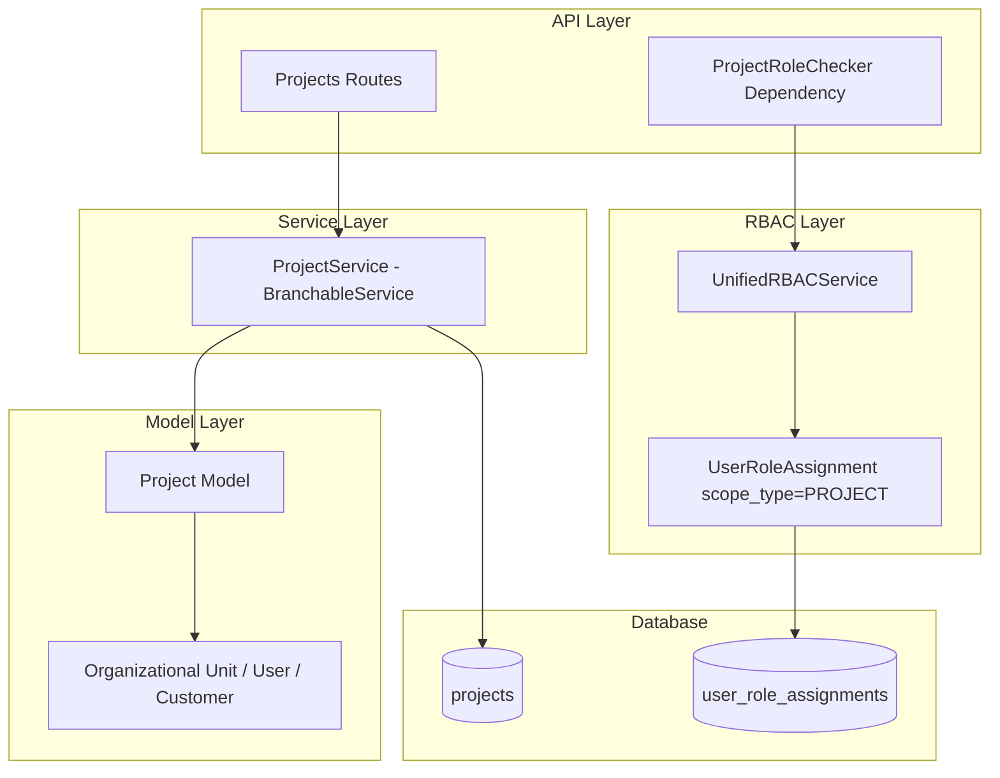
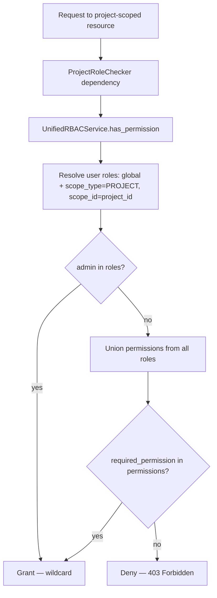

# Project Management Bounded Context

**Last Updated:** 2026-07-01
**Owner:** Backend Team

---

## Responsibility

The Project Management context owns the **Project** aggregate — the top-level entity that scopes Work Breakdown Structure elements (WBEs), cost elements, schedules, forecasts, change orders, documents, and AI conversations in Backcast.

A `Project` is a fully versioned and branchable EVCS entity: it supports bitemporal tracking (`valid_time`, `transaction_time`) and branch isolation for change-order workflows. It also carries the **portfolio attribution** links (organizational unit, project manager, customer) used by portfolio/functional dashboards.

**Key Capabilities:**
- **Versioned aggregate:** Project is the EVCS root that child entities reference via root ID.
- **Portfolio attribution:** nullable root-ID FKs to organizational unit, project manager, and customer.
- **Custom fields:** admin-defined JSONB `custom_fields` plus a captured definitions snapshot.
- **Project-scoped RBAC:** access governed by Unified RBAC (`UserRoleAssignment` with `scope_type=PROJECT`), not per-project membership rows.

---

## Architecture

### Component Overview



### Layer Responsibilities

| Layer        | Responsibility                                         | Key Components                          |
| ------------ | ------------------------------------------------------ | --------------------------------------- |
| **API**      | HTTP endpoints for project CRUD + history/branches     | `/api/v1/projects` routes               |
| **Auth**     | Project-scoped permission checks                       | `ProjectRoleChecker` dependency         |
| **Service**  | Business logic, budget computation, EVCS branching     | `ProjectService(BranchableService)`     |
| **Model**    | ORM mapping, EVCS mixins, attribution FKs, JSONB      | `Project(EntityBase, Versionable, Branchable)` |
| **RBAC**     | Scoped role/permission resolution (global + project)   | `UnifiedRBACService.has_permission()`   |

---

## Data Model

### Project Entity

**Location:** `backend/app/models/domain/project.py`

**Purpose:** Top-level versioned, branchable aggregate. Satisfies `BranchableProtocol` via structural subtyping (`EntityBase` + `VersionableMixin` + `BranchableMixin`).

| Field                              | Type              | Constraints                 | Description                                                        |
| ---------------------------------- | ----------------- | --------------------------- | ------------------------------------------------------------------ |
| `id`                               | UUID              | PK                          | Per-version primary key (not used in relationships)                |
| `project_id`                       | UUID              | NOT NULL, indexed           | **Root ID** — stable identity across versions/branches; used in FKs, URLs, endpoints |
| `name`                             | String(200)       | NOT NULL                    | Project name                                                       |
| `code`                             | String(50)        | NOT NULL, indexed           | Unique project code                                                |
| `budget`                           | Decimal           | computed (not stored)       | Sum of all cost-element budgets; populated on read by `ProjectService` |
| `contract_value`                   | Decimal(15,2)     | nullable                    | Contract value (if different from budget)                          |
| `currency`                         | String(3)         | NOT NULL, default `EUR`     | ISO currency code                                                  |
| `organizational_unit_id`           | UUID              | nullable, indexed           | Portfolio attribution FK (root ID) — app-level integrity           |
| `project_manager_id`               | UUID              | nullable, indexed           | Responsible PM (root ID) — app-level integrity                     |
| `customer_id`                      | UUID              | nullable, indexed           | Customer (root ID) — app-level integrity                           |
| `status`                           | String(50)        | NOT NULL, default `draft`   | Project lifecycle status                                           |
| `start_date` / `end_date`          | DateTime TZ       | nullable                    | Schedule window                                                    |
| `description`                      | Text              | nullable                    | Free-text description                                              |
| `custom_fields`                    | JSONB             | nullable                    | Admin-defined custom field values (per `CustomEntityTemplate`)     |
| `custom_entity_template_root_id`   | UUID              | nullable                    | Root ID of the template that defined the project's custom fields   |
| `custom_field_definitions_snapshot`| JSONB             | nullable                    | Captured definitions at time of edit (for historical rendering)    |

**Inherited from EVCS mixins** (`VersionableMixin`, `BranchableMixin`):
- `valid_time`, `transaction_time` — TSTZRANGE bitemporal columns
- `deleted_at` — soft-delete timestamp
- `branch` — branch name (default `main`)
- `parent_id`, `merge_from_branch` — branching lineage

**Constraints / Indexes:**
- `ix_projects_current_version` — unique partial index on `(project_id, branch) WHERE upper(valid_time) IS NULL AND deleted_at IS NULL`, guaranteeing exactly one current (open, non-deleted) version per `(root, branch)`. Mirrors the migration and the EVCS root-id convention (ADR-005).

> **Relationship convention:** Other versioned entities reference `Project.project_id` (the root ID), not `id`. There is no DB-level FK because root IDs are not unique across versions; integrity is enforced at the application level. See `docs/02-architecture/backend/contexts/evcs-core/`.

---

## Authorization Model

Project access is enforced by the **Unified RBAC** system. There is no `project_members` table and no `users.role` column — both were removed in the 2026-05 Unified RBAC cleanup (see [ADR-014](../../../decisions/ADR-014-unified-rbac.md)).

### Scoped Role Assignments

Roles are granted via `UserRoleAssignment` (`backend/app/models/domain/user_role_assignment.py`), a non-versioned `SimpleEntityBase` row in `user_role_assignments`:

| Field          | Type    | Description                                                        |
| -------------- | ------- | ------------------------------------------------------------------ |
| `user_id`      | UUID    | The user (root ID). App-level validation (no DB FK — business key).|
| `role_id`      | UUID    | FK → `rbac_roles.id` (CASCADE).                                    |
| `scope_type`   | String  | `global` \| `project` \| `change_order` (`ScopeType` enum).        |
| `scope_id`     | UUID    | The scoped entity's ID. **NULL for `global`**; the `project_id` root ID for project scope. |
| `granted_by`   | UUID    | Audit: who granted the role.                                       |
| `granted_at`   | DateTime| Audit: when granted.                                               |
| `expires_at`   | DateTime| Optional expiry.                                                   |
| `metadata_`    | JSONB   | e.g., authority level for change-order scope.                      |

### System Roles

Seed-managed roles are defined in `backend/app/db/seed_users_rbac.py` (`ROLE_PERMISSIONS`). Eight roles exist:

| Role             | Scope use                                         |
| ---------------- | ------------------------------------------------- |
| `admin`          | Global — unrestricted (`["*"]` wildcard)          |
| `manager`        | Global — most CRUD, portfolio access              |
| `cost-controller`| Global — cost-focused CRUD                        |
| `pmo-director`   | Global — PMO oversight                            |
| `viewer`         | Global — read-only                                |
| `ai-viewer`      | Global — AI read-only                             |
| `ai-manager`     | Global — AI CRUD                                  |
| `ai-admin`       | Global — AI full administrative                   |

Any role can also be assigned at `scope_type=PROJECT` to grant project-specific permissions independent of the user's global role.

### Permission Format

- **Pattern:** `{resource}-{action}` (e.g., `project-read`, `wbs-element-update`).
- **Resources:** `project`, `wbs-element`, `control-account`, `work-package`, `cost-element-type`, `organizational-unit`, `custom-entity-template`, `project-documents`, `role-assignment`, `user`, and more.
- **Actions:** `read`, `create`, `update`, `delete`.
- **Admin wildcard:** the `admin` role resolves to `["*"]`, granting every permission (`UnifiedRBACService.get_user_permissions`, `backend/app/core/rbac_unified.py`).

### Access Decision Flow



`ProjectRoleChecker` (`backend/app/api/dependencies/auth.py`) is a thin FastAPI dependency that injects the request DB session into the ContextVar used by `UnifiedRBACService` and calls `has_permission(user_id, required_permission, scope_type=PROJECT, scope_id=project_id)`.

> **See also:** [Unified RBAC Implementation](../auth/unified-rbac-implementation.md) and [ADR-014: Unified RBAC](../../../decisions/ADR-014-unified-rbac.md) for the full role/permission matrix, caching strategy, and change-order authority levels.

---

## Service Layer

### ProjectService

**Location:** `backend/app/services/project.py`

Extends `BranchableService[Project]` (the highest EVCS tier — versioning + branching), so it inherits temporal reads, branch clone/update/merge/revert, and history queries.

**Key methods:**

| Method                                  | Description                                                |
| --------------------------------------- | --------------------------------------------------------- |
| `get_as_of(...)`                        | Bitemporal read of a project as of a point in time         |
| `get_projects(...)`                     | Paginated list with branch mode (merged/isolated), filters, sort |
| `get_by_code(code, branch)`             | Lookup by unique code                                     |
| `create_project(...)`                   | Create new project (applies creation defaults)            |
| `update_project(...)`                   | Versioned update via `UpdateCommand`                      |
| `delete_project(...)`                   | Soft-delete the current version                           |
| `get_project_history(project_id)`       | Version history for a project                             |
| `get_project_as_of(...)`                | Historical point-in-time read (API-facing)                |
| `get_project_branches(...)`             | List branches for a project                               |
| `get_recently_updated(...)`             | Recent activity feed                                      |
| `_compute_project_budget(...)` / `_populate_computed_budgets(...)` | Sum cost-element budgets and attach to the read model |

Budget is **not stored** — `Project.budget` is a non-mapped attribute (`__allow_unmapped__ = True`) populated on read.

---

## API Endpoints

**Location:** `backend/app/api/routes/projects.py` (mounted under `/api/v1/projects`)

| Method   | Path                  | Permission              | Description                         |
| -------- | --------------------- | ----------------------- | ----------------------------------- |
| `GET`    | `/`                   | `project-read`          | Paginated project list (branch mode, filters, sort) |
| `POST`   | `/`                   | `project-create`        | Create project                      |
| `GET`    `/{project_id}`            | `project-read`  | Get a project (with computed budget) |
| `PATCH`  `/{project_id}`            | `project-update`| Versioned update           |
| `DELETE` `/{project_id}`            | `project-delete`| Soft-delete current version|
| `GET`    `/{project_id}/history`    | `project-read`  | Version history             |
| `GET`    `/{project_id}/branches`   | `project-read`  | List branches               |

Project-scoped routes use `ProjectRoleChecker(required_permission=...)`; list/create use `RoleChecker(required_permission=...)` (global permission). Sub-resources (`/wbs-elements`, `/cost-elements`, `/schedule`, `/change-orders`, `/documents`, `/forecast`, `/gantt`) are routed by their own routers, all gated by `ProjectRoleChecker` for the relevant resource permission.

---

## Integration Points

### EVCS Core
- Project is the **root aggregate** referenced by all child entities via `project_id` (root ID).
- Full branching support for change orders (clone, update, merge, revert).

### Portfolio Attribution
- `organizational_unit_id`, `project_manager_id`, `customer_id` drive portfolio/functional dashboards. These are nullable root-ID references (no DB FK — app-level integrity).

### Custom Fields
- `custom_fields` JSONB holds admin-defined values from `CustomEntityTemplate` (Phase 0/1, migration `c93e9767de59`). The snapshot columns preserve historical definitions for rendering past versions. See [Custom Fields Analysis](../../../../../03-project-plan/iterations/2026-06-24-custom-fields-analysis/).

### AI Chat
- Project scope (`set_project_context` tool, `AIConversationSession.project_id`) restricts AI tools to a single project's data; RBAC-gated.

---

## Code Locations

### Backend

```
backend/app/
├── api/
│   ├── dependencies/
│   │   └── auth.py                 # ProjectRoleChecker (delegates to UnifiedRBAC)
│   └── routes/
│       ├── projects.py             # Project CRUD/history/branches routes
│       ├── project_budget_settings.py
│       ├── gantt.py                # (gated by ProjectRoleChecker)
│       └── documents.py            # (gated by ProjectRoleChecker)
├── core/
│   ├── rbac_unified.py            # UnifiedRBACService — scoped role resolution + caching
│   └── enums.py                   # Legacy ProjectRole enum (kept for UI color mapping)
├── models/
│   └── domain/
│       ├── project.py             # Project ORM model
│       ├── user_role_assignment.py# UserRoleAssignment + ScopeType
│       └── rbac.py                # RBACRole, RBACRolePermission
├── services/
│   └── project.py                 # ProjectService(BranchableService[Project])
└── db/
    └── seed_users_rbac.py         # ROLE_PERMISSIONS — the 8 system roles
```

> **Note on `core/enums.py`:** the `ProjectRole` enum still exists for **UI color mapping only** (`PROJECT_ADMIN` → error/red, etc.). It is **not** used for authorization — that is exclusively the job of Unified RBAC via `rbac_roles` / `user_role_assignments`.

---

## Important Patterns & Gotchas

### 1. Root ID vs Version ID
Relationships and endpoints use `project_id` (root), never `id` (version PK). No DB-level FK exists on root IDs because they are not unique across versions; integrity is enforced in the service layer.

### 2. One Current Version Per (Root, Branch)
The partial unique index `ix_projects_current_version` enforces a single open, non-deleted version per `(project_id, branch)`. Creating a new current version supersedes the prior one.

### 3. Budget Is Computed, Not Stored
`Project.budget` is populated on read by `ProjectService._populate_computed_budgets`. Never write to it; it will not persist.

### 4. Authorization Is Unified RBAC, Not Membership
There is no per-project membership table. Grant access by assigning a role at `scope_type=PROJECT, scope_id=<project_id>` via `user_role_assignments`. The `admin` global role short-circuits all checks via the `["*"]` wildcard.

### 5. Attribution FKs Are Nullable and App-Level
`organizational_unit_id`/`project_manager_id`/`customer_id` are nullable to allow backfill; referential integrity is the application's responsibility, not the database's.

---

## Related Documentation

- [Unified RBAC Implementation](../auth/unified-rbac-implementation.md) — full scoped RBAC model
- [ADR-014: Unified RBAC](../../../decisions/ADR-014-unified-rbac.md) — replaces `ProjectMember` + `users.role`
- [EVCS Core Architecture](../evcs-core/architecture.md) — versioning and branching patterns
- [Cross-Cutting: API Conventions](../../cross-cutting/api-conventions.md) — API standards

---

## Changelog

| Date       | Change                                                                 | Author       |
| ---------- | --------------------------------------------------------------------- | ------------ |
| 2026-07-01 | Rewrote to reflect Unified RBAC cleanup; document Project EVCS model, portfolio attribution FKs, custom fields, and real service/route locations. Removed deleted `ProjectMember`/`ProjectRole`/`project_members` content. | Backend Team |
| 2026-04-11 | Initial project members context documentation (since-deleted system).   | Backend Team |
