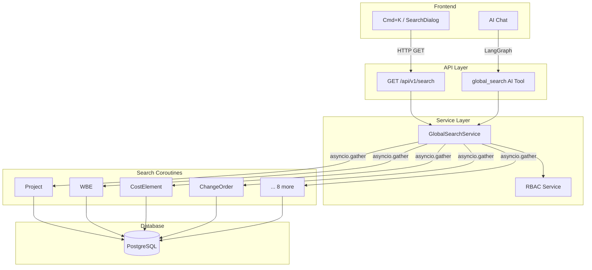
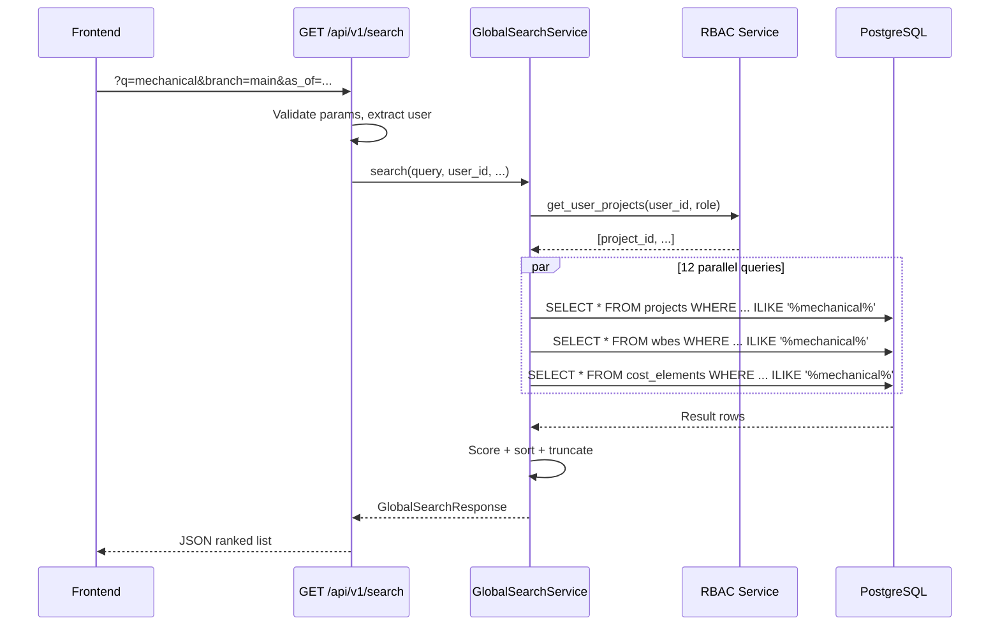
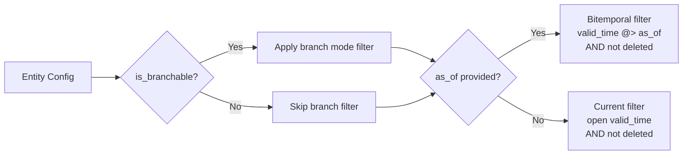
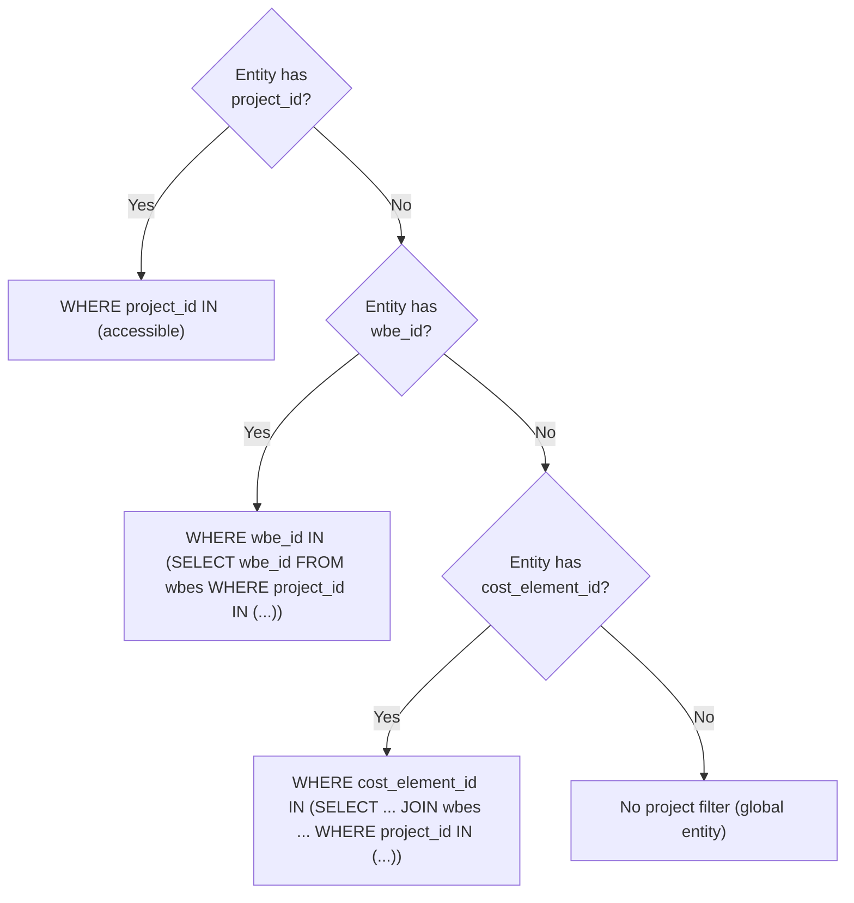
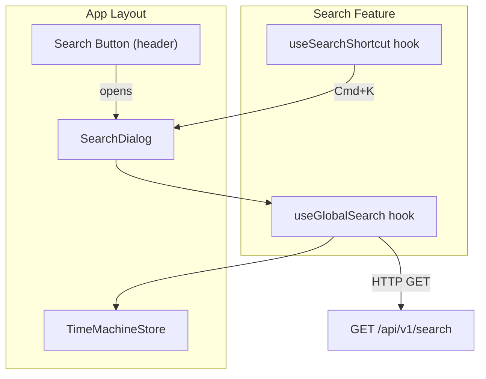

# Global Search Architecture

**Last Updated:** 2026-04-19  
**Owner:** Backend Team  
**Related:** [EVCS Core Architecture](../evcs-core/architecture.md) · [API Conventions](../../cross-cutting/api-conventions.md)

---

## Responsibility

The Global Search system provides a unified cross-entity search primitive that queries all 12 searchable entity types in parallel, applies tier-appropriate temporal/branch/permission filters, and returns a flat relevance-ranked result list.

- **Cross-Entity Search:** Single query across Projects, WBEs, Cost Elements, Change Orders, and 8 other entity types
- **RBAC-Aware:** Results filtered by user's accessible projects; global entities always visible
- **Temporal & Branch-Aware:** Respects `branch`, `mode`, and `as_of` parameters for EVCS consistency
- **Context-Scoped:** Dashboard scope (all projects) or page scope (single project / WBE tree)
- **Dual Interface:** REST endpoint for frontend Cmd+K search and AI tool for chat integration

**Document Scope:**

This document covers the **conceptual architecture** of Global Search:

- Component overview and data flow
- Entity search configuration
- Relevance scoring model
- Temporal and branch filter integration
- RBAC project scoping strategy
- Frontend integration

**For implementation details and code examples:**

- Entity type classification → [Entity Classification Guide](../evcs-core/entity-classification.md)
- API parameter conventions → [API Conventions](../../cross-cutting/api-conventions.md)
- EVCS temporal/branch filtering → [EVCS Core Architecture](../evcs-core/architecture.md)

---

## Architecture

### Component Overview



### Layer Responsibilities

| Layer | Responsibility | Key Components |
| --- | --- | --- |
| **Frontend** | Search dialog with debounced input, keyboard navigation, entity-to-route mapping | `SearchDialog`, `useGlobalSearch`, `useSearchShortcut` |
| **API** | Request validation, auth, parameter mapping | `GET /api/v1/search`, `global_search` AI tool |
| **Service** | Parallel entity queries, scoring, merging, RBAC scoping | `GlobalSearchService` |
| **Database** | ILIKE matching on text columns, temporal/branch filters | PostgreSQL per-entity queries |

### Data Flow



---

## Entity Search Configuration

The service queries 12 entity types defined in a static configuration table. Each entry specifies the entity's model class, root ID field, searchable text fields by weight tier, and behavioral flags.

### Configuration Table

| Entity | Model | Root Field | Primary Fields | Description Fields | Secondary Fields | Tier | Global |
| --- | --- | --- | --- | --- | --- | --- | --- |
| Project | `Project` | `project_id` | code, name | description | status | Branchable | No |
| WBE | `WBE` | `wbe_id` | code, name | description | — | Branchable | No |
| Cost Element | `CostElement` | `cost_element_id` | code, name | description | — | Branchable | No |
| Schedule Baseline | `ScheduleBaseline` | `schedule_baseline_id` | name | description | — | Branchable | No |
| Change Order | `ChangeOrder` | `change_order_id` | code, title | description, justification | status | Branchable | No |
| Forecast | `Forecast` | `forecast_id` | — | basis_of_estimate | — | Branchable | No |
| Cost Registration | `CostRegistration` | `cost_registration_id` | — | description | invoice_number, vendor_reference | Versionable | No |
| Quality Event | `QualityEvent` | `quality_event_id` | — | description | event_type, root_cause, resolution_notes | Versionable | No |
| Progress Entry | `ProgressEntry` | `progress_entry_id` | — | notes | — | Versionable | No |
| User | `User` | `user_id` | email, full_name | — | — | Versionable | Yes |
| Department | `Department` | `department_id` | code, name | description | — | Versionable | Yes |
| Cost Element Type | `CostElementType` | `cost_element_type_id` | code, name | description | — | Versionable | Yes |

### Tier Flags

- **Branchable** (`is_branchable=True`): Receives branch mode filter (MERGE/STRICT) and temporal filter
- **Versionable** (`is_branchable=False`): Receives temporal filter only (no branch column)
- **Global** (`is_global=True`): Skips RBAC project scoping — always visible to all authenticated users

---

## Relevance Scoring

Scoring is computed post-fetch in Python. Each result row is evaluated against three field tiers.

### Scoring Tiers

| Tier | Fields | Exact | Prefix | Substring |
| --- | --- | --- | --- | --- |
| **Primary** | code, name, title, email | 1.0 | 0.9 | 0.7 |
| **Description** | description, justification, notes, basis_of_estimate | — | — | 0.5 |
| **Secondary** | status, invoice_number, vendor_reference, event_type, root_cause, resolution_notes | — | — | 0.3 |

The best score across all fields wins. An exact match on a primary field (1.0) overrides any description or secondary match.

### Example

For query `"hello"`:

| Row | Code | Name | Description | Score |
| --- | --- | --- | --- | --- |
| Row A | `HELLO` | Some Project | — | **1.0** (exact on code) |
| Row B | `HELLO-WORLD` | Another | — | **0.9** (prefix on code) |
| Row C | `NOPE` | Nope | Say hello there | **0.5** (substring on description) |

Results are sorted by `relevance_score` descending, then truncated to the requested `limit`.

---

## Temporal & Branch Filtering

The search service inlines EVCS temporal and branch logic directly in SQL rather than delegating to `BranchableService` or `TemporalService`. This keeps the standalone service self-contained.

### Filter Application by Tier



| Filter | SQL Condition | Applied To |
| --- | --- | --- |
| **Current** | `upper(valid_time) IS NULL AND deleted_at IS NULL` | All versioned entities (default) |
| **Bitemporal** | `valid_time @> as_of AND lower(valid_time) <= as_of AND (deleted_at IS NULL OR deleted_at > as_of)` | All versioned entities when `as_of` provided |
| **Branch MERGE** | `branch IN (branch, 'main')` + DISTINCT ON with precedence | Branchable entities when mode="merged" |
| **Branch STRICT** | `branch = :branch` | Branchable entities when mode="isolated" |

> [!NOTE]
> Simple entities (no EVCS tier) are not included in the search scope. All 12 searchable entities are either Versionable or Branchable.

---

## RBAC Project Scoping

Non-admin users only see entities from projects they are members of. The scoping strategy varies by how each entity links to a project.

### Scoping Strategy



| Entity Link | Strategy | Entities |
| --- | --- | --- |
| Direct `project_id` | Filter column directly | Project, WBE, Change Order |
| `wbe_id` column | Subquery join to WBE | Cost Element |
| `cost_element_id` column | Subquery chain: CE → WBE → Project | Cost Registration, Forecast, Quality Event, Progress Entry, Schedule Baseline |
| No project link | No filter (global) | User, Department, Cost Element Type |

### WBE Tree Scoping

When `wbe_id` is provided, the service resolves all descendant WBE IDs via iterative BFS on `parent_wbe_id`, respecting temporal and branch filters. The resolved IDs are then used to scope entity searches:

- WBE entities: filtered to `wbe_id IN (descendant_ids)`
- Cost Element and below: filtered through CE → WBE chain using the resolved IDs

---

## API Endpoint

### REST Endpoint

```
GET /api/v1/search?q=mechanical&project_id=uuid&branch=main&mode=merged&as_of=2025-01-01&limit=50
```

| Parameter | Type | Default | Description |
| --- | --- | --- | --- |
| `q` | `string` (required) | — | Search query, 1–200 characters |
| `project_id` | `UUID` (optional) | — | Scope to a specific project |
| `wbe_id` | `UUID` (optional) | — | Scope to WBE tree (includes descendants) |
| `branch` | `string` | `"main"` | Branch name for branchable entities |
| `mode` | `"merged" \| "isolated"` | `"merged"` | Branch mode |
| `as_of` | `ISO 8601 datetime` (optional) | — | Time-travel timestamp |
| `limit` | `integer` | `50` | Max results (1–200) |

**Permission:** `project-read` (any authenticated user with at least one entity read permission)

### Response Schema

```json
{
  "results": [
    {
      "entity_type": "project",
      "id": "uuid (version PK)",
      "root_id": "uuid (stable root ID)",
      "code": "PRJ-001",
      "name": "Project Alpha",
      "description": "Mechanical engineering project",
      "status": "Active",
      "relevance_score": 0.9,
      "project_id": null,
      "wbe_id": null
    }
  ],
  "total": 42,
  "query": "mechanical"
}
```

### AI Tool

The `global_search` AI tool exposes the same search capability to the LangGraph agent. It inherits branch/mode/as_of from the session context and allows override via explicit parameters.

```python
@ai_tool(
    name="global_search",
    description="Search across all entity types...",
    permissions=["project-read"],
    risk_level=RiskLevel.LOW,
)
async def global_search(query, project_id=None, wbe_id=None, limit=20, context=None):
```

---

## Frontend Integration

### Component Architecture



| Component | Responsibility |
| --- | --- |
| `SearchDialog` | Modal with auto-focused input, 300ms debounce, keyboard navigation, entity type tags |
| `useGlobalSearch` | TanStack Query hook; reads branch/mode/as_of from TimeMachineStore |
| `useSearchShortcut` | Registers Cmd+K / Ctrl+K global keydown listener |
| `AppLayout` | Hosts search button and SearchDialog; manages open/close state |

### Entity-to-Route Mapping

Clicking a search result navigates to the entity's page:

| Entity Type | Route Pattern |
| --- | --- |
| Project | `/projects/:root_id` |
| WBE | `/projects/:project_id/wbes/:root_id` |
| Cost Element | `/projects/:project_id/wbes/:wbe_id` (parent WBE) |
| Change Order | `/projects/:project_id/change-orders/:root_id` |
| User / Department / CET | Admin pages |

### Search Scope by Page

| Page | Scope | Frontend Behavior |
| --- | --- | --- |
| Dashboard (`/`) | All accessible projects | No `project_id` or `wbe_id` |
| Project (`/projects/:id`) | Single project | Passes `project_id` |
| WBE (`/projects/:id/wbes/:wbeId`) | WBE tree + descendants | Passes `wbe_id` |

---

## Design Decisions

| Decision | Rationale |
| --- | --- |
| **ILIKE over PostgreSQL full-text search** | Simpler implementation, sufficient for current data scale. Can migrate to `tsvector`/GIN indexes without API contract changes if performance requires it. |
| **Standalone service (no EVCS inheritance)** | Search queries span all entity tiers with different filter combinations. Inlining SQL avoids multi-service dependency complexity. |
| **Post-fetch Python scoring** | Per-entity result sets are bounded by `limit` (max 200), making Python scoring fast and maintainable vs. complex SQL CASE expressions across 12 entity types. |
| **`asyncio.gather` parallelism** | 12 entity queries are independent. Parallel execution avoids sequential latency. |
| **Flat ranked list (not grouped)** | Single sorted list enables natural relevance ranking across entity types. Grouping can be added in the frontend without API changes. |
| **`project-read` minimum permission** | Every authenticated user with any entity read access should be able to search. Finer-grained RBAC is applied per-entity inside the service. |

---

## Code Locations

| Component | Path |
| --- | --- |
| Search schemas | `backend/app/models/schemas/search.py` |
| Search service | `backend/app/services/global_search_service.py` |
| Search route | `backend/app/api/routes/search.py` |
| AI tool | `backend/app/ai/tools/project_tools.py` (global_search function) |
| AI tool registration | `backend/app/ai/tools/__init__.py` |
| Frontend types | `frontend/src/features/search/types.ts` |
| Frontend API hook | `frontend/src/features/search/api/useGlobalSearch.ts` |
| Search dialog | `frontend/src/features/search/components/SearchDialog.tsx` |
| Keyboard shortcut hook | `frontend/src/features/search/hooks/useSearchShortcut.ts` |
| Query key | `frontend/src/api/queryKeys.ts` (search.global) |
| AppLayout integration | `frontend/src/layouts/AppLayout.tsx` |

---

## See Also

- [EVCS Core Architecture](../evcs-core/architecture.md) — Temporal versioning and branch system
- [Entity Classification Guide](../evcs-core/entity-classification.md) — Choosing entity tiers
- [API Conventions](../../cross-cutting/api-conventions.md) — Branch/context parameter conventions
- [Temporal Query Reference](../../cross-cutting/temporal-query-reference.md) — Time-travel query semantics
