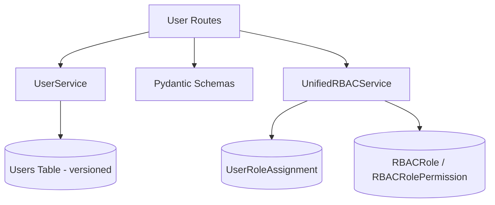

# User Management Context

**Last Updated:** 2026-07-01
**Owner:** Backend Team

## Responsibility

Manages user profiles and credentials. User data is a bitemporal versioned entity; authorization is delegated to the Unified RBAC service via scoped `UserRoleAssignment` rows (not a column on `User`).

> **Note:** `User` is a versioned entity (`EntityBase + VersionableMixin`, bitemporal). It carries no `role` column — roles are assigned through the separate `UserRoleAssignment` model. See [Unified RBAC](../auth/unified-rbac-implementation.md) and [ADR-014](../../../decisions/ADR-014-unified-rbac.md).

---

## Architecture

### Components

### Layers

**Routes** (`app/api/routes/users.py`)

- `GET /api/v1/users` - List users (admin only)
- `POST /api/v1/users` - Create user (admin only)
- `GET /api/v1/users/{id}` - Get user (self or admin)
- `PUT /api/v1/users/{id}` - Update user (self or admin)
- `DELETE /api/v1/users/{id}` - Soft delete (admin only)

**Service** (`app/services/user.py`)

- `get_all(skip, limit)` - Paginated user list
- `get_by_id(user_id)` - Single user retrieval
- `get_by_email(email)` - Retrieve by email
- `create(user_in)` - New user creation
- `update(id, user_in)` - In-place update
- `delete(id)` - Soft delete

**Models** (`app/models/domain/user.py`)

- `User` - Versioned entity (`EntityBase` + `VersionableMixin`); bitemporal, single-table
- No `Role` enum and no `role` column — roles live in `UserRoleAssignment`

**RBAC Models** (`app/models/domain/user_role_assignment.py`, `app/models/domain/rbac.py`)

- `UserRoleAssignment` - Scoped role grant (`SimpleEntityBase`)
- `RBACRole`, `RBACRolePermission` - Role definitions and their permission strings

---

## Data Model

### User (Versioned)

**Purpose:** Bitemporal versioned entity (`EntityBase + VersionableMixin`). User profile changes create history versions, tracked by `valid_time` and `transaction_time` ranges. Uses two identifiers like all EVCS versioned entities: `user_id` (stable root identity) and `id` (per-version primary key).

| Field               | Type        | Description                                              |
| ------------------- | ----------- | ------------------------------------------------------- |
| id                  | UUID        | Version primary key (per version)                        |
| user_id             | UUID        | Root identity across all versions (used in relationships)|
| email               | String(255) | Login email (indexed)                                    |
| hashed_password     | String(255) | Bcrypt-hashed password                                   |
| password_changed_at | TIMESTAMPTZ | Optional last password-change timestamp                  |
| full_name           | String(255) | Display name                                             |
| department          | String(100) | Optional department                                      |
| is_active           | Boolean     | Active flag (default true)                               |
| preferences         | JSONB       | Optional user preferences                                |
| valid_time          | TSTZRANGE   | Effective period (from `VersionableMixin`)               |
| transaction_time    | TSTZRANGE   | Recording period (from `VersionableMixin`)               |
| deleted_at          | TIMESTAMPTZ | Soft-delete marker (from `VersionableMixin`)             |

**Note:** `User` has **no `role` field**. Authorization is not stored on the user row; it is resolved at request time by the Unified RBAC service from `UserRoleAssignment` rows.

---

## Authorization Model

Authorization is **not** a 3-value role enum on `User`. It is delegated to the **Unified RBAC** service (`app/core/rbac_unified.py`). See [Unified RBAC implementation](../auth/unified-rbac-implementation.md) and [ADR-014](../../../decisions/ADR-014-unified-rbac.md).

### Roles

Roles are not a column on `User`. They are granted via `UserRoleAssignment` rows, each scoped to a context:

- `scope_type`: `GLOBAL`, `PROJECT`, or `CHANGE_ORDER` (`ScopeType` enum)
- `scope_id`: the scoped entity's UUID (`None` for `GLOBAL`)
- `role_id`: FK to `RBACRole.id`

A user may hold multiple roles per scope; effective permissions combine global and the requested scope's roles. `UserRoleAssignment` itself is a non-versioned `SimpleEntityBase` with audit fields (`granted_by`, `granted_at`, `expires_at`).

### Seeded roles

Eight roles are seeded (`app/db/seed_users_rbac.py`, `ROLE_PERMISSIONS`):

- **admin** — unrestricted; `get_user_permissions` returns the `["*"]` wildcard
- **manager** — broad CRUD (projects, WBS, costs, change orders, forecasts, EVM)
- **cost-controller** — read-heavy cost/EVM access plus forecast updates
- **pmo-director** — portfolio/schedule oversight plus change-order governance
- **viewer** — read-only across the system
- **ai-viewer** — read access with AI chat capability
- **ai-manager** — AI agent with read/write access
- **ai-admin** — AI agent with full administrative access

### Permission resolution

`UnifiedRBACService.get_user_permissions(user_id, scope_type, scope_id)`:

- Collects the user's roles from `GLOBAL` plus the requested scope.
- If `admin` is among them, returns `["*"]` (the wildcard that grants every permission).
- Otherwise returns the deduplicated set of permission strings (e.g. `project-read`, `change-order-approve`) drawn from each role's `RBACRolePermission` rows.

The service is cache-first with a two-tier in-memory cache (role-permission TTL 1h, plus an assignment cache) and fail-secure (deny on cache miss or system error).

### Endpoint enforcement

User-management routes are gated by RBAC permission strings (e.g. `user-read`, `user-create`, `user-update`, `user-delete`) rather than a hardcoded admin check; read/update of one's own profile remain self-allowed.

---

## Integration Points

### Auth Context

- Used by auth context for user retrieval
- Provides `User` entity for authentication

### Future Contexts

- Will provide actor_id for audit trails
- Authorization handled by Unified RBAC (`app/core/rbac_unified.py`) across Projects, WBEs, etc.

---

## Code Locations

- **Routes:** `app/api/routes/users.py` - User endpoints with RBAC permission enforcement
- **Service:** `app/services/user.py` - UserService with versioned CRUD operations
- **Models:** `app/models/domain/user.py` - `User` (versioned: `EntityBase + VersionableMixin`)
- **RBAC models:** `app/models/domain/user_role_assignment.py` (`UserRoleAssignment`, `ScopeType`), `app/models/domain/rbac.py` (`RBACRole`, `RBACRolePermission`)
- **RBAC service:** `app/core/rbac_unified.py` - `UnifiedRBACService`, `get_user_permissions`
- **Seeder:** `app/db/seed_users_rbac.py` - default users, roles, permissions, assignments
- **Schemas:** `app/models/schemas/user.py` - Pydantic schemas for validation
- **Tests:** `tests/api/test_users.py`, `tests/unit/services/test_user.py`

---

## Future Enhancements

- User profile photos
- Email verification flow
- Password reset capability
- User preferences/settings
- Activity log per user
- Department hierarchy
