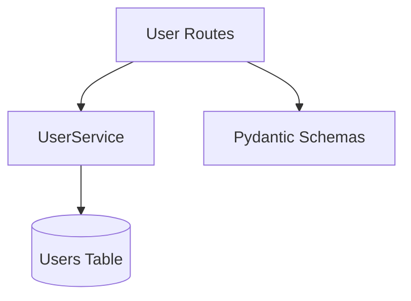

# User Management Context

**Last Updated:** 2026-04-14
**Owner:** Backend Team

## Responsibility

Manages user profiles, roles, and permissions. Implements non-versioned user data with standard CRUD operations and admin authorization.

> **Note:** Users are non-versioned entities using `SimpleEntityBase` (standard CRUD, no temporal tracking).

---

## Architecture

### Components

### Layers

**Routes** (`app/api/routes/users.py`)

- `GET /api/v1/users` - List users (admin only)
- `POST /api/v1/users` - Create user (admin only)
- `GET /api/v1/users/{id}` - Get user (self or admin)
- `PUT /api/v1/users/{id}` - Update user (self or admin)
- `DELETE /api/v1/users/{id}` - Soft delete (admin only)

**Service** (`app/services/user.py`)

- `get_all(skip, limit)` - Paginated user list
- `get_by_id(user_id)` - Single user retrieval
- `get_by_email(email)` - Retrieve by email
- `create(user_in)` - New user creation
- `update(id, user_in)` - In-place update
- `delete(id)` - Soft delete

**Models** (`app/models/domain/user.py`)

- `User` - Non-versioned entity with `SimpleEntityBase`
- `Role` - Enum: admin, viewer, editor

---

## Data Model

### User (Non-Versioned)

**Purpose:** Standard CRUD entity using `SimpleEntityBase`. Stores user profile data without temporal versioning.

| Field      | Type      | Description                      |
| ---------- | --------- | -------------------------------- |
| id         | UUID      | Primary Key (auto-generated)     |
| email      | String    | Login email (unique)             |
| full_name  | String    | Display name                     |
| role       | Role      | admin/viewer/editor              |
| is_active  | Boolean   | Soft delete flag                 |
| created_at | TIMESTAMPTZ | Creation timestamp             |
| updated_at | TIMESTAMPTZ | Last update timestamp           |

**Note:** Users are non-versioned. User profile changes do not create history versions. For audit trails of user actions, see the audit logging system.

---

## Authorization Rules

### List Users (`GET /users`)

- **Admin:** Can see all users
- **Non-admin:** 403 Forbidden

### Create User (`POST /users`)

- **Admin:** Can create any user
- **Non-admin:** 403 Forbidden

### Read User (`GET /users/{id}`)

- **Admin:** Can read any user
- **Self:** Can read own profile
- **Other:** 403 Forbidden

### Update User (`PUT /users/{id}`)

- **Admin:** Can update any user
- **Self:** Can update own profile
- **Other:** 403 Forbidden

### Delete User (`DELETE /users/{id}`)

- **Admin:** Can delete any user
- **Non-admin:** 403 Forbidden

---

## Integration Points

### Auth Context

- Used by auth context for user retrieval
- Provides `User` entity for authentication

### Future Contexts

- Will provide actor_id for audit trails
- Role used for authorization in Projects, WBEs, etc.

---

## Code Locations

- **Routes:** `app/api/routes/users.py` - User endpoints with RBAC enforcement
- **Service:** `app/services/user.py` - UserService with standard CRUD operations
- **Models:** `app/models/domain/user.py` - User model with SimpleEntityBase
- **Schemas:** `app/models/schemas/user.py` - Pydantic schemas for validation
- **Tests:** `tests/api/test_users.py`, `tests/unit/services/test_user.py`

---

## Future Enhancements

- User profile photos
- Email verification flow
- Password reset capability
- User preferences/settings
- Activity log per user
- Department hierarchy
