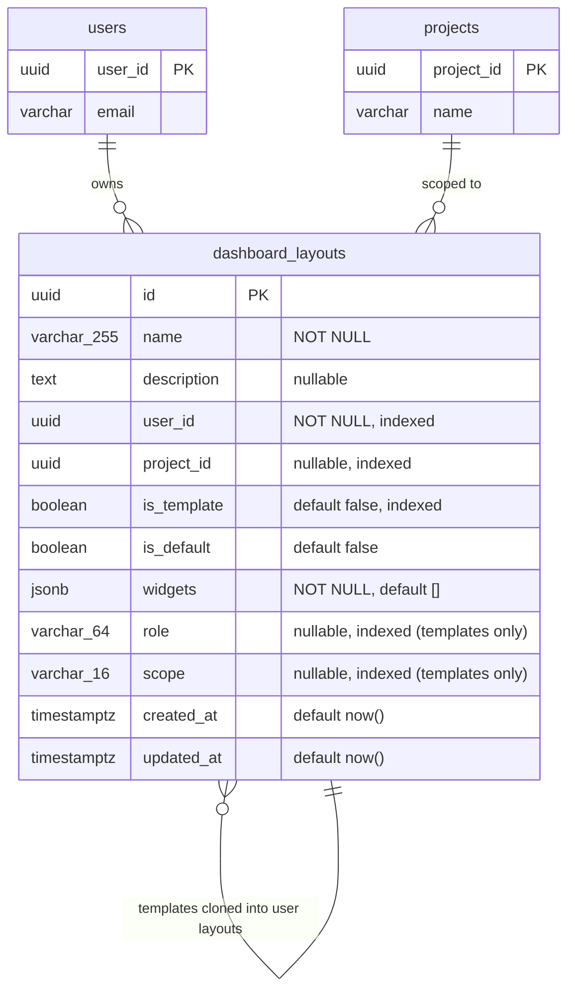
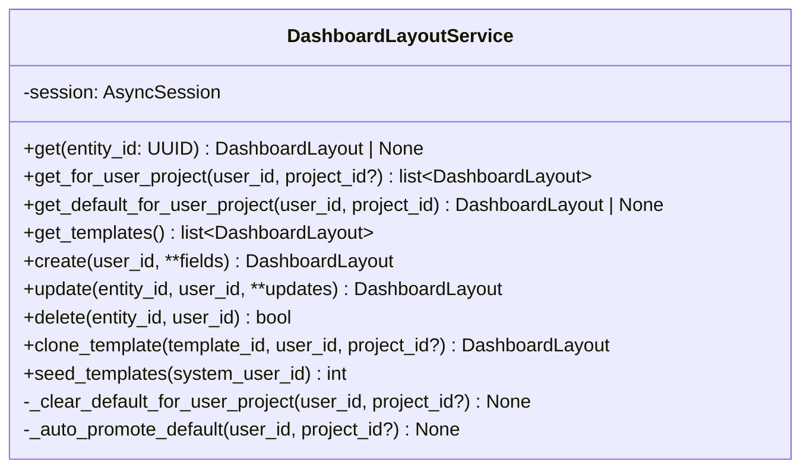
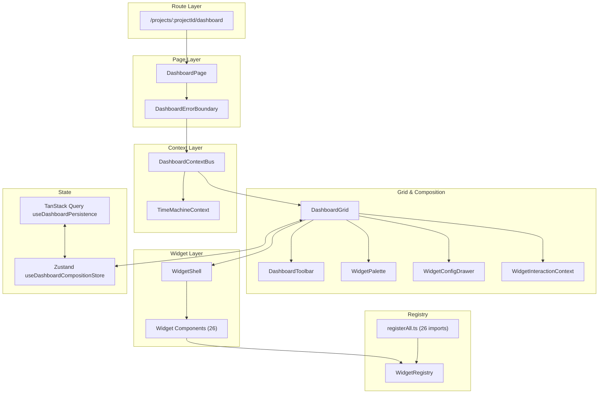
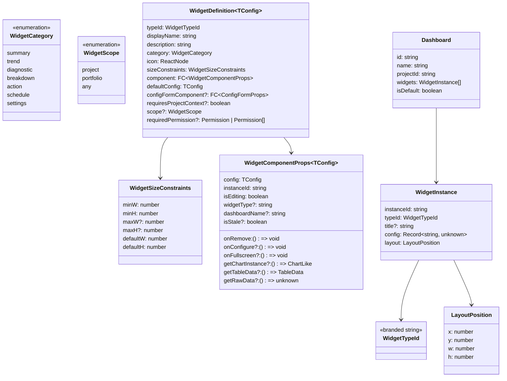

# Dashboard Developer Guide

**Last updated:** 2026-07-01

A comprehensive reference for developers working on the Backcast widget dashboard. Covers backend domain model, API, frontend architecture, runtime behavior, and implementation patterns.

**For end-user documentation**, see the companion document: `dashboard-user-guide.md`.

---

## Table of Contents

### Part I: Backend

- [1. Domain Model](#1-domain-model)
- [2. Widget JSON Schema](#2-widget-json-schema)
- [3. Database Schema](#3-database-schema)
- [4. Pydantic Schemas](#4-pydantic-schemas)
- [5. Service Layer](#5-service-layer)
- [6. API Endpoints](#6-api-endpoints)
- [7. Template Seeding](#7-template-seeding)

### Part II: Frontend Architecture

- [8. Global / Portfolio Dashboard](#8-global--portfolio-dashboard)
- [9. Architecture Overview](#9-architecture-overview)
- [10. Type System](#10-type-system)
- [11. Widget Registry](#11-widget-registry)
- [12. Component Hierarchy](#12-component-hierarchy)
- [13. State Management](#13-state-management)
- [14. Dashboard Context Bus](#14-dashboard-context-bus)
- [15. Widget Definitions Catalog](#15-widget-definitions-catalog)

### Part III: Runtime Behavior

- [16. Dashboard Modes](#16-dashboard-modes)
- [17. Widget Interaction States](#17-widget-interaction-states)
- [18. Widget Shell](#18-widget-shell)
- [19. Dashboard Toolbar](#19-dashboard-toolbar)
- [20. Data Flow](#20-data-flow)
- [21. CSS Architecture](#21-css-architecture)

### Part IV: Advanced Features

- [22. Key Implementation Details](#22-key-implementation-details)
  - [22.1 WidgetInteractionContext](#221-widgetinteractioncontext)
  - [22.2 baseLayouts vs layouts Memo Split](#212-baselayouts-vs-layouts-memo-split)
  - [22.3 Undo/Redo](#213-undoredo)
  - [22.4 Template System](#214-template-system)
  - [22.5 Widget Error Boundaries](#215-widget-error-boundaries)
- [23. Phase 6 Features](#23-phase-6-features)
  - [23.1 Widget Fullscreen Mode](#231-widget-fullscreen-mode)
  - [23.2 Widget Export](#232-widget-export)
  - [23.3 Motion & Animation](#233-motion--animation)
  - [23.4 Auto-Refresh](#234-auto-refresh)
  - [23.5 Responsive Mobile Layout](#235-responsive-mobile-layout)

### Part V: Reference

- [24. File Quick Reference](#24-file-quick-reference)

---

## Part I: Backend

### 1. Domain Model

**File:** `backend/app/models/domain/dashboard_layout.py`

```python
class DashboardLayout(SimpleEntityBase):
    __tablename__ = "dashboard_layouts"

    id: UUID                          # Primary key
    name: str(255)                    # Human-readable name
    description: str | None           # Optional description
    user_id: UUID                     # Owner (indexed, app-level FK to users)
    project_id: UUID | None           # Project scope (indexed, NULL = global)
    is_template: bool                 # Read-only template flag (indexed)
    is_default: bool                  # User's default for this scope
    widgets: list[dict] (JSONB)       # Widget instances array
    role: str | None                  # Template-only: target role (NULL = generic fallback)
    scope: str | None                 # Template-only: "project" | "portfolio" (NULL on user layouts)
    created_at: datetime(tz)          # Audit timestamp
    updated_at: datetime(tz)          # Audit timestamp
```

**Key characteristics:**
- Extends `SimpleEntityBase` (non-versioned, no EVCS tracking)
- `user_id` and `project_id` use application-level referential integrity (no FK constraints due to PostgreSQL partial unique index limitations)
- `is_template=True` layouts are system-owned, read-only starting configurations
- `is_default=True` is scoped per `(user_id, project_id)` pair -- only one default per scope
- `widgets` stores the complete widget arrangement as a JSONB array
- `role` and `scope` are **template-only** tagging columns. `scope` discriminates project-content templates (`"project"`) from portfolio templates (`"portfolio"`); `role` selects which role a portfolio template defaults to (NULL = generic fallback). Both are NULL on user layouts (those are distinguished by `project_id`, not `scope`)

### 2. Widget JSON Schema

Each element in the `widgets` JSONB array follows this structure:

```json
{
  "instanceId": "uuid-v4",
  "typeId": "evm-summary",
  "config": {
    "entityType": "PROJECT",
    "chartType": "bar"
  },
  "layout": {
    "x": 0,
    "y": 0,
    "w": 6,
    "h": 2
  }
}
```

| Field | Type | Description |
|-------|------|-------------|
| `instanceId` | `string` (UUID v4) | Unique per widget instance, generated at add-time |
| `typeId` | `string` | Widget type identifier, must match a registered `WidgetTypeId` |
| `config` | `object` | Widget-specific configuration (varies by `typeId`) |
| `layout.x` | `int` | Column position (0-based, 12-column grid) |
| `layout.y` | `int` | Row position (0-based) |
| `layout.w` | `int` | Width in grid columns |
| `layout.h` | `int` | Height in grid rows (1 row = 80px) |

### 3. Database Schema



**Indexes:**
- `ix_dashboard_layouts_user_id` on `user_id`
- `ix_dashboard_layouts_project_id` on `project_id`
- `ix_dashboard_layouts_is_template` on `is_template`
- `ix_dashboard_layouts_role` on `role`
- `ix_dashboard_layouts_scope` on `scope`
- **G8 structural fix — two NULL-safe split partial unique indexes** so a concurrent first-visit clone cannot leave two `is_default=True` non-template layouts in the same scope. PostgreSQL treats `NULL != NULL` in unique indexes, so a single `(user_id, project_id)` index would NOT prevent duplicate GLOBAL defaults (`project_id IS NULL`). Two partial indexes are required:
  - `uq_dashboard_layouts_default_global` on `user_id`, `WHERE is_template = false AND is_default = true AND project_id IS NULL` (global scope, keyed on `user_id` alone)
  - `uq_dashboard_layouts_default_project` on `(user_id, project_id)`, `WHERE is_template = false AND is_default = true AND project_id IS NOT NULL` (per-user-per-project scope)

**Migration:** `backend/alembic/versions/20260405_add_dashboard_layouts.py`

### 4. Pydantic Schemas

**File:** `backend/app/models/schemas/dashboard_layout.py`

```
DashboardLayoutCreate        # POST body: name, description?, project_id?, is_template, is_default, scope?, widgets
DashboardLayoutUpdate        # PUT body: all fields optional
DashboardLayoutRead          # Response: full entity with id, timestamps
CloneTemplateRequest         # POST body: project_id?, name?, is_default (first-visit clone marker)
```

```python
class DashboardLayoutRead(BaseModel):
    id: UUID
    name: str
    description: str | None
    user_id: UUID
    project_id: UUID | None
    is_template: bool
    is_default: bool
    widgets: list[dict[str, object]]
    # role/scope are seeder-only template attributes; exposed read-only so the
    # FE can resolve a user's role-tagged default template. Never on Create/Update.
    role: str | None = None
    scope: str | None = None
    created_at: datetime
    updated_at: datetime
```

### 5. Service Layer

**File:** `backend/app/services/dashboard_layout_service.py`



**Key service behaviors:**

| Method | Behavior |
|--------|----------|
| `create()` | Clears existing default for same scope if `is_default=True` |
| `update()` | Ownership validation, clears existing default if promoting to default |
| `delete()` | Ownership validation, auto-promotes most recently updated layout to default if the deleted one was default |
| `clone_template()` | Validates `is_template=True`, copies widgets array to new user-owned layout |
| `seed_templates()` | Idempotent -- queries existing names, only inserts missing templates |

### 6. API Endpoints

**File:** `backend/app/api/routes/dashboard_layouts.py`

Base path: `/api/v1/dashboard-layouts`

| Method | Path | Operation ID | Description |
|--------|------|-------------|-------------|
| `GET` | `/` | `list_dashboard_layouts` | List user's layouts, filterable by `?project_id=`. Uses `strict_scope=True` server-side: a project_id returns only that project's layouts; no project_id returns only global layouts (so a user's global personal layouts no longer pollute every project list — G5 fix). |
| `GET` | `/templates` | `list_dashboard_layout_templates` | List template layouts, optionally filtered by `?scope=project` or `?scope=portfolio`. Filter is on the `scope` column (not `project_id` — all templates are stored `project_id=NULL`); any other value or omitted returns all templates. |
| `GET` | `/{layout_id}` | `get_dashboard_layout` | Get single layout (ownership check for non-templates) |
| `POST` | `/` | `create_dashboard_layout` | Create new layout |
| `PUT` | `/{layout_id}` | `update_dashboard_layout` | Update layout (ownership required) |
| `PUT` | `/templates/{layout_id}` | `update_dashboard_layout_template` | Update a template (admin only, `dashboard-template-update` RBAC perm) |
| `DELETE` | `/{layout_id}` | `delete_dashboard_layout` | Delete layout (ownership required) |
| `POST` | `/{layout_id}/clone` | `clone_dashboard_layout_template` | Clone a template for current user (supports `is_default=true` for first-visit clone) |

**Authentication:** All endpoints are gated by an any-of read guard requiring `project-read` OR `portfolio-read` (so both project-scoped and portfolio-scoped users can use the same routes). Template updates additionally require `dashboard-template-update`.

**Authorization:**
- Users can only read/write their own layouts
- Templates are readable by all authenticated users
- Non-template layouts return 404 if accessed by non-owner

### 7. Template Seeding

On application startup, `seed_dashboard_templates()` is called. It uses the admin user (`admin@backcast.org`) as the template owner.

**Seven predefined templates** (4 project-scope, 3 portfolio-scope):

| Template | Scope | Role | Widgets | Purpose |
|----------|-------|------|---------|---------|
| **Project Overview** | project | -- | 8 | Standard dashboard: header, KPIs, budget, variance, WBE tree, cost registrations, health |
| **EVM Analysis** | project | -- | 7 | EVM-focused: summary, efficiency gauges, trend chart, variance, forecast, health |
| **Cost Controller** | project | -- | 6 | Financial tracking: budget, costs, change orders, analytics, forecast |
| **COQ Analysis** | project | -- | 5 | Cost of Quality: summary, trend, 4-category breakdown, work packages |
| **Portfolio Overview** | portfolio | `NULL` (generic fallback) | 4 | Cross-project: KPIs, CO pipeline, projects table, distress list |
| **Cost Controlling** | portfolio | `cost-controller` | 5 | Cost-slanted portfolio view (CPI distress + CO pipeline) |
| **PMO Schedule** | portfolio | `pmo-director` | 4 | Schedule-slanted portfolio view (SPI distress + projects table) |

The `scope`/`role` tags drive which template a portfolio user's first visit clones (see §8 Global / Portfolio Dashboard). Portfolio templates resolve by exact `role` match first, then fall back to the `role IS NULL` generic template for admin/manager/any unmatched `portfolio-read` role.

---

## Part II: Frontend Architecture

### 8. Global / Portfolio Dashboard

**File:** `frontend/src/features/widgets/pages/GlobalDashboardPage.tsx`

A second dashboard host exists alongside the project-scoped `DashboardPage`. It renders the same widget-grid stack but scoped cross-project.

**Route:** `/portfolio` (in `frontend/src/routes/index.tsx`), gated by `<Can permission="portfolio-read">`. This is the only route to a portfolio dashboard; the legacy fixed `PortfolioPage` was retired. The `FilterBar` + portfolio filter hooks/stores remain under `frontend/src/features/portfolio/` (imported by the host, deliberately not relocated).

**Global-scope sentinel:** The host calls `useDashboardPersistence(undefined, undefined, role)`. The first argument (`projectId`) is the **`undefined` sentinel** — never `""` (empty string). This matters in two places:
- **G6 cache-key split:** TanStack Query keys use `["dashboard-layouts","list",undefined]`, which is distinct from any project-scoped key. An empty string would collide.
- **G7 wire format:** `saveDashboard` sends `project_id: null` (JSON null), not `""`, which 422s against the `project_id: UUID | None` schema.

**Context bus:** `DashboardContextBus` is mounted with `scope="portfolio"` and a `portfolioFilter` (controlDate/status/rag read from `usePortfolioFilterStore`). Portfolio widgets read `ctx.portfolioFilter` to scope their queries.

**First-visit behavior:** When the global page loads with no saved global layout for the user, `useDashboardPersistence` clones the user's **role-tagged portfolio template** — resolved by exact `role` match, then the `role IS NULL` generic fallback, then the first portfolio template. The clone is created with `project_id: null` and `is_default: true` so a re-fire cannot leave two defaults (enforced server-side by the G8 split partial unique indexes).

The role comes from `useAuthStore((s) => s.user?.role)`. If the role has no matching template (e.g. admin/manager), the generic "Portfolio Overview" is used.

**Note:** The beforeunload + useBlocker navigation guard block in `GlobalDashboardPage.tsx` is duplicated verbatim from `DashboardPage.tsx` (it is scope-agnostic, keying on `isDirty`/`isEditing`). A shared `<DashboardHost>` extraction is deferred.

### 9. Architecture Overview



### 10. Type System

**File:** `frontend/src/features/widgets/types.ts`



**Scope + permission gating (D2):**
- `scope` controls which dashboard palette offers the widget. **An unset `scope` defaults to `"project"`** (legacy widgets stay project-only, hidden from the portfolio palette) — set `"any"` explicitly to appear on both dashboards. Portfolio widgets set `"portfolio"`.
- `requiredPermission` reuses existing domain read-permissions (e.g. `project-read`, `cost-registration-read`, `portfolio-read`). The palette hides a widget from users lacking the perm and the grid renders a locked placeholder. Array form requires ALL perms (gated via `hasAllPermissions`). Omit for any-authenticated-user baseline.

**Branded type pattern:** `WidgetTypeId` is a branded string type created via `widgetTypeId("my-widget")`. This prevents accidental string substitution at compile time.

### 11. Widget Registry

**File:** `frontend/src/features/widgets/registry.ts`

A global `Map<WidgetTypeId, WidgetDefinition>` with three operations:

| Function | Signature | Description |
|----------|-----------|-------------|
| `registerWidget` | `(definition) => void` | Register a widget definition (warns on duplicate) |
| `getWidgetDefinition` | `(typeId) => Definition \| undefined` | Lookup by type ID |
| `getWidgetsByCategory` | `(category) => Definition[]` | Filter by category |
| `getAllWidgetDefinitions` | `() => Definition[]` | Get all definitions |

**Registration pattern:** Each widget definition file calls `registerWidget()` at module level as a side effect. `registerAll.ts` imports all definition files, and `registerAllWidgets()` is called once in both `DashboardPage` and `GlobalDashboardPage`.

**Palette + grid gating:** A registered widget is not necessarily shown everywhere. Two independent filters (`utils/widgetPermissions.ts`) decide visibility:
- **Scope filter** (`isWidgetInScope`): the palette is passed the dashboard's `scope` ("project" or "portfolio") and only offers matching widgets. Unset `scope` is treated as `"project"`, so legacy widgets stay on the project palette and are hidden from the portfolio palette. Set `"any"` to appear on both.
- **Permission filter** (`isWidgetPermitted`): if `requiredPermission` is set, the palette hides the widget from users lacking the perm (single perm via `hasPermission`; array form requires all via `hasAllPermissions`). The grid additionally renders a locked placeholder for already-placed-but-unpermitted widgets.

A widget can therefore be intentionally hidden from a given dashboard scope or user role without being un-registered.

### 12. Component Hierarchy

```mermaid
graph TD
    DP[DashboardPage] --> DEB[DashboardErrorBoundary]
    DP --> DCB[DashboardContextBus]
    DP --> DP2["useDashboardPersistence hook"]

    DCB --> TM[TimeMachineContext]
    DCB --> DG[DashboardGrid]

    DG --> DT[DashboardToolbar]
    DG --> WP[WidgetPalette]
    DG --> WCD[WidgetConfigDrawer]
    DG --> WIC[WidgetInteractionContext]
    DG --> WFM[WidgetFullscreenModal]
    DG --> MWS[MobileWidgetSheet]
    DG --> RGL["react-grid-layout Responsive"]

    RGL --> WS1["WidgetShell (per instance)"]
    RGL --> WS2["WidgetShell (per instance)"]
    RGL --> WS3["WidgetShell (per instance)"]

    WS1 --> WC1["Widget Component A"]
    WS2 --> WC2["Widget Component B"]
    WS3 --> WC3["Widget Component C"]

    WCD --> CF["ConfigForm (per widget type)"]
    WCD --> RI["Refresh Interval Selector"]

    FWS["useFullscreenWidgetStore"] --> WFM
    URK["useUndoRedoKeyboard"] --> DG
    RLC["useResponsiveLayout"] --> DG```

**Component responsibilities:**

| Component | File | Responsibility |
|-----------|------|---------------|
| `DashboardPage` | `pages/DashboardPage.tsx` | Route host, nav guards, loading skeleton, context providers |
| `DashboardErrorBoundary` | `pages/DashboardErrorBoundary.tsx` | Catches rendering errors in the entire dashboard |
| `DashboardContextBus` | `context/DashboardContextBus.tsx` | Composes TimeMachine + entity selection context |
| `DashboardGrid` | `components/DashboardGrid.tsx` | react-grid-layout wrapper, edit/view rendering, empty state |
| `DashboardToolbar` | `components/DashboardToolbar.tsx` | Name editing, template selector, view/edit toggle, save |
| `WidgetPalette` | `components/WidgetPalette.tsx` | Modal catalog for adding widgets, grouped by category |
| `WidgetConfigDrawer` | `components/WidgetConfigDrawer.tsx` | Ant Design Drawer for editing selected widget's config |
| `WidgetShell` | `components/WidgetShell.tsx` | Universal widget wrapper: chrome, error boundary, toolbar, modes |
| `WidgetInteractionContext` | `components/WidgetInteractionContext.tsx` | Per-widget move/resize interaction mode tracking |
| `WidgetFullscreenModal` | `components/WidgetFullscreenModal.tsx` | Fullscreen modal rendering a single widget at viewport size |
| `WidgetExportMenu` | `components/WidgetExportMenu.tsx` | Dropdown menu for PNG/CSV/JSON export actions |
| `MobileWidgetSheet` | `components/MobileWidgetSheet.tsx` | Bottom sheet for mobile widget management (reorder, hide, remove) |
| `useFullscreenWidgetStore` | `stores/useFullscreenWidgetStore.ts` | Zustand store for fullscreen widget instance ID |
| `useUndoRedoKeyboard` | `hooks/useUndoRedoKeyboard.ts` | Keyboard listener for Ctrl+Z/Ctrl+Shift+Z in edit mode |
| `useWidgetAutoRefresh` | `hooks/useWidgetAutoRefresh.ts` | Auto-refresh orchestration with IntersectionObserver |
| `useWidgetVisibility` | `hooks/useWidgetVisibility.ts` | IntersectionObserver hook for widget viewport visibility |
| `useResponsiveLayout` | `hooks/useResponsiveLayout.ts` | Responsive grid configuration per breakpoint |

### 13. State Management

**File:** `frontend/src/stores/useDashboardCompositionStore.ts`

Zustand store with `immer` middleware for immutable updates.

```mermaid
stateDiagram-v2
    [*] --> EmptyState: mount (no backend data)
    [*] --> LoadedState: mount (backend data exists)

    state EmptyState {
        activeDashboard = null
        backendId = null
        isDirty = false
    }

    state LoadedState {
        activeDashboard = Dashboard
        backendId = UUID
        isDirty = false
    }

    state Editing {
        isEditing = true
        _lastSavedSnapshot = JSON
        isDirty = false
    }

    state DirtyEditing {
        isEditing = true
        isDirty = true
    }

    LoadedState --> Editing: setEditing(true)
    Editing --> DirtyEditing: addWidget / removeWidget / updateLayout
    DirtyEditing --> LoadedState: confirmChanges() (after save)
    DirtyEditing --> LoadedState: discardChanges() (restore snapshot)
    Editing --> LoadedState: confirmChanges() (no changes)
```

**Store state fields:**

| Field | Type | Description |
|-------|------|-------------|
| `isEditing` | `boolean` | Whether in edit mode |
| `activeDashboard` | `Dashboard \| null` | Current dashboard with widget instances |
| `isDirty` | `boolean` | Unsaved changes flag |
| `selectedWidgetId` | `string \| null` | Widget selected for config editing |
| `backendId` | `string \| null` | Backend layout UUID (null = not yet persisted) |
| `projectId` | `string` | Current project from route params |
| `paletteOpen` | `boolean` | Widget palette modal state |
| `_lastSavedSnapshot` | `string \| null` | JSON snapshot for edit-mode rollback |
| `_undoStack` | `string[]` | Undo stack of JSON dashboard snapshots (max 20) |
| `_redoStack` | `string[]` | Redo stack of JSON dashboard snapshots (max 20) |

**Key actions:**

| Action | Description |
|--------|-------------|
| `addWidget(typeId, position?)` | Creates instance from definition defaults, auto-computes Y position |
| `removeWidget(instanceId)` | Removes widget, deselects if selected |
| `updateWidgetLayout(instanceId, layout)` | Single widget position/size update |
| `updateDashboardLayout(layouts)` | Batch update from react-grid-layout `onLayoutChange` |
| `updateWidgetConfig(instanceId, config)` | Replace widget config (from config drawer) |
| `loadFromBackend(layout)` | Initialize store from API response |
| `setEditing(true)` | Take snapshot, enter edit mode |
| `discardChanges()` | Restore snapshot, exit edit mode |
| `confirmChanges()` | Clear snapshot, exit edit mode (after save) |
| `markSaved(backendId)` | Clear dirty flag, store backend ID |
| `undo()` | Pop undo stack, restore previous dashboard state |
| `redo()` | Pop redo stack, restore undone dashboard state |

### 14. Dashboard Context Bus

**File:** `frontend/src/features/widgets/context/DashboardContextBus.tsx`

React Context providing cross-widget shared state. Composes the existing `TimeMachineContext` with entity-level selection, the dashboard `scope`, and (portfolio only) the portfolio filter.

```typescript
type DashboardScope = "project" | "portfolio";

interface DashboardContextValue {
  // TimeMachine (delegated from TimeMachineContext)
  asOf: string | undefined;
  branch: string;
  mode: BranchMode;
  isHistorical: boolean;
  invalidateQueries: () => void;

  // Dashboard scope — drives whether widgets are project- or portfolio-oriented.
  scope: DashboardScope;

  // Entity selection (widget-driven, project scope)
  projectId: string;
  wbeId: string | undefined;
  costElementId: string | undefined;
  setWbeId: (id: string | undefined) => void;
  setCostElementId: (id: string | undefined) => void;

  // Portfolio filter (controlDate/status/rag); present only on portfolio scope.
  // The GlobalDashboardPage host reads these from usePortfolioFilterStore.
  portfolioFilter?: PortfolioFilterValue;
}
```

The `<DashboardContextBus>` props take `scope` (defaults to `"project"`) and optional `portfolioFilter`. The portfolio host mounts it as `<DashboardContextBus scope="portfolio" portfolioFilter={filter}>`. When `scope === "project"`, `projectId` is required; for portfolio scope it is omitted.

**Usage pattern:**
- Context-providing widgets (e.g., WBE Tree) call `setWbeId()` when user selects a node
- Context-consuming widgets (e.g., EVM Summary) read `wbeId` to scope their data queries
- TimeMachine changes (branch, date) propagate automatically via the composed context

**Consumer hook:** `useDashboardContext()` in `context/useDashboardContext.ts`

### 15. Widget Definitions Catalog

**26 registered widget types** across 7 categories. The original project-scoped widgets (15) remain; additions since are: 4 COQ widgets, 5 portfolio widgets, plus `budget-settings` and `cost-history`:

| Type ID | Category | Scope | Default Size | Description |
|---------|----------|-------|-------------|-------------|
| `project-header` | summary | project | 4x1 | Project name, status, dates |
| `quick-stats-bar` | summary | project | 4x1 | Entity count KPIs |
| `evm-summary` | summary | project | 4x2 | Core EVM metrics (CPI, SPI, etc.) |
| `budget-status` | summary | project | 4x2 | Budget bar/pie chart |
| `health-summary` | summary | project | 4x2 | Health indicators with thresholds |
| `budget-settings` | settings | project | 4x2 | Project budget settings editor |
| `evm-trend-chart` | trend | project | 6x3 | EVM metrics over time |
| `forecast` | trend | project | 4x2 | EAC, ETC, VAC projections |
| `cost-history` | trend | project | 6x3 | Cost progression over time |
| `variance-chart` | diagnostic | project | 4x2 | Cost/schedule variance |
| `evm-efficiency-gauges` | diagnostic | project | 4x2 | CPI/SPI gauge dials |
| `change-order-analytics` | diagnostic | project | 4x3 | Change order distribution charts |
| `coq-summary` | summary | project | 12x2 | Cost of Quality QPI summary |
| `coq-trend-chart` | trend | project | 6x3 | COQ trend over time |
| `coq-category-breakdown` | breakdown | project | 6x3 | 4-category COQ breakdown |
| `coq-work-packages` | action | project | 12x3 | COQ by work package |
| `wbe-tree` | breakdown | project | 4x3 | WBE hierarchy tree |
| `mini-gantt` | breakdown | project | 6x3 | Compact Gantt timeline |
| `cost-registrations` | action | project | 4x3 | Cost entry table |
| `progress-tracker` | action | project | 4x3 | Progress entry table |
| `change-orders-list` | action | project | 4x3 | Change order queue table |
| `portfolio-kpi` | summary | portfolio | 12x3 | Cross-project KPI strip (CPI/SPI/VAC/TCPI) |
| `portfolio-co-pipeline` | action | portfolio | 12x3 | Portfolio change-order pipeline (aging) |
| `portfolio-projects-table` | breakdown | portfolio | 12x6 | Portfolio projects table (sortable) |
| `portfolio-distress-list` | breakdown | portfolio | 6x5 | Distressed projects (cost/schedule mode) |
| `portfolio-gantt` | schedule | portfolio | 12x6 | Portfolio schedule Gantt |

**Scope semantics:** legacy project widgets that omit `scope` default to `"project"` (hidden from the portfolio palette). Portfolio widgets set `scope: "portfolio"`. Set `"any"` explicitly to appear on both dashboards. See §11 for the palette filter logic.

**Creating a new widget definition:**

1. Create file: `frontend/src/features/widgets/definitions/MyWidget.tsx`
2. Import and call `registerWidget()` with a `WidgetDefinition` object
3. Import the file in `frontend/src/features/widgets/definitions/registerAll.ts`
4. Optionally create a config form in `components/config-forms/`

```typescript
// Example widget definition
import { widgetTypeId, registerWidget } from "../registry";

const MY_WIDGET = widgetTypeId("my-widget");

registerWidget({
  typeId: MY_WIDGET,
  displayName: "My Widget",
  description: "Does something useful",
  category: "summary",
  icon: <StarOutlined />,
  sizeConstraints: { minW: 3, minH: 2, defaultW: 4, defaultH: 2 },
  component: MyWidgetComponent,
  defaultConfig: { showDetails: true },
});
```

**Configuration Forms**

**File pattern:** `frontend/src/features/widgets/components/config-forms/{Widget}ConfigForm.tsx`

Each form implements the `ConfigFormProps<TConfig>` interface:

```typescript
interface ConfigFormProps<TConfig = Record<string, unknown>> {
  config: TConfig;
  onChange: (config: Partial<TConfig>) => void;
}
```

Forms use Ant Design components. The `WidgetConfigDrawer` reads the selected widget's `configFormComponent` from its `WidgetDefinition` and renders it inside an Ant Design Drawer.

**Available config forms:** `EVMSummaryConfigForm`, `BudgetStatusConfigForm`, `VarianceChartConfigForm`, `CostRegistrationsConfigForm`, `ProgressTrackerConfigForm`, `WBETreeConfigForm`, `ForecastConfigForm`

---

## Part III: Runtime Behavior

### 16. Dashboard Modes

The dashboard operates in two mutually exclusive modes. The mode determines which toolbar buttons appear, what chrome each widget displays, and whether drag/resize are available.

The mode flag is `isEditing` in the Zustand store (`useDashboardCompositionStore`).

#### 15.1 View Mode

**`isEditing = false`**

The default state. The user views their dashboard. Widgets display data with minimal chrome.

**What is visible:**

| Element | Behavior |
|---------|----------|
| Dashboard toolbar | Editable name (read-only), Templates, Manage Templates (admin), Reset, Customize |
| Widget chrome | Subtle title label (top-left, 11px, tertiary color, pointer-events: none) |
| Trigger icon | Small circular button at top-right of each widget, 35% opacity until hover |
| Floating toolbar | Appears on trigger icon click, with title, collapse, fullscreen, export, refresh |

**What is NOT available:**

- No drag or resize on any widget
- No add-widget palette
- No undo/redo
- No delete or configure buttons on widgets

**How the trigger icon works** (`WidgetShell.tsx:408-437`):

A `<button>` positioned absolutely at `top: -12px, right: 8px`. On click it toggles `isToolbarOpen` local state, which reveals the floating toolbar. Click-outside dismisses it (`mousedown` listener on `document`). The trigger has `onPointerDown={(e) => e.stopPropagation()}` to prevent RGL from interpreting the click as a drag start.

**Toolbar buttons available** (`DashboardToolbar.tsx:314-373`):

1. **Templates** -- Dropdown of system and user templates, applies on selection
2. **Manage Templates** -- Opens TemplateManagementModal (admin-only, gated by `<Can permission="dashboard-template-update">`)
3. **Reset** -- Popconfirm ("Reset to Default Template?"), calls `resetDashboard()` on confirm
4. **Customize** -- Calls `setEditing(true)`, enters edit mode

#### 15.2 Edit Mode

**`isEditing = true`**

Transactional editing session. The user can add, remove, reposition, resize, configure, and delete widgets. Changes are not saved until "Done" is clicked.

**What changes on entry:**

1. `setEditing(true)` takes a JSON snapshot of `activeDashboard` into `_lastSavedSnapshot`
2. Grid background switches to a dot pattern (via `radial-gradient` CSS)
3. Each widget's border becomes dashed primary color
4. Widget chrome switches from trigger icon to a persistent action bar

**What is visible:**

| Element | Behavior |
|---------|----------|
| Dashboard toolbar | Editable name (Typography.Text with editable), Templates, Manage Templates (admin), Add Widget, Undo, Redo, Cancel, Done |
| Widget action bar | Persistent 28px bar at top: Move, Resize, Configure, Title, Delete |
| Grid background | Dot pattern (`radial-gradient` on the container div) |
| Widget border | Dashed primary color |

**Edit mode is transactional:** No changes are sent to the backend until the user clicks "Done". Auto-save is explicitly suppressed during edit mode (`useDashboardPersistence.ts:143`: `if (isEditing) return`).

#### 15.3 Mode Transitions

```
View Mode
  |
  |-- "Customize" button --> Edit Mode (snapshot taken)
  |
  |-- Template selected --> Edit Mode (template loaded, snapshot taken)
  |
  |-- "Get Started" (empty state) --> Edit Mode + palette opens
  |
Edit Mode
  |
  |-- "Done" --> save to backend --> confirmChanges() --> View Mode
  |
  |-- "Cancel" --> Popconfirm --> discardChanges() --> View Mode (snapshot restored)
```

**Entry paths** (`DashboardToolbar.tsx:76-78` and `DashboardToolbar.tsx:104-117`):

- "Customize" button calls `setEditing(true)`
- Template selection calls `loadFromBackend(template, true)` then `setEditing(true)`
- Empty state "Get Started" calls `setEditing(true)` then `setPaletteOpen(true)`

**Exit paths:**

- "Done" (`DashboardToolbar.tsx:81-85`): `onSave()` then `confirmChanges()`. The `onSave` callback is the persistence hook's `save()` function. `confirmChanges()` clears the snapshot, sets `isEditing=false`, clears undo/redo stacks.
- "Cancel" (`DashboardToolbar.tsx:286-301`): Wrapped in `<Popconfirm>` asking "Discard unsaved changes?". On confirm, calls `discardChanges()`, which restores from `_lastSavedSnapshot`, sets `isEditing=false`, clears stacks.

### 17. Widget Interaction States

#### 16.1 Interaction Model Overview

Within edit mode, widgets have an explicit interaction mode that controls whether drag or resize is active. Only **one widget at a time** can be in an active interaction state. This is a deliberate design choice to prevent accidental multi-widget moves and to give the user precise control.

The interaction state lives in `DashboardGrid.tsx:114-117` as local React state:

```typescript
const [activeInteraction, setActiveInteraction] = useState<{
  instanceId: string;
  mode: InteractionMode;
} | null>(null);
```

The three possible states are:

| State | `activeInteraction` | Effect |
|-------|-------------------|--------|
| **None** | `null` | No drag, no resize on any widget. Only toolbar buttons work. |
| **Move** | `{ instanceId, mode: "move" }` | One widget is draggable (cursor: grab) |
| **Resize** | `{ instanceId, mode: "resize" }` | One widget shows resize handle |

#### 16.2 None State

When `activeInteraction` is `null`, no widget has drag or resize enabled. This is the default state when entering edit mode. The user can:

- Click Move/Resize/Configure/Delete buttons on any widget's action bar
- Click Add Widget in the toolbar
- Apply templates
- Undo/redo composition changes

Clicking the same interaction button again (toggling off) returns to None state. This is handled in `WidgetShell.tsx:294-308`:

```typescript
onClick={() => {
  if (interactionMode === "move") {
    clear();    // Sets activeInteraction to null
  } else {
    setMode("move");  // Sets activeInteraction to this widget + "move"
  }
}}
```

#### 16.3 Move State

When `activeInteraction.mode === "move"` for a specific `instanceId`:

- That widget's grid item gets `isDraggable: true` in the RGL layout data
- The `.widget-drag-active` CSS class is applied to the widget's wrapper div
- CSS rule `.react-grid-item.widget-drag-active { cursor: grab !important }` provides visual feedback
- All other widgets have `isDraggable: false` and `cursor: default !important`
- `onLayoutChange` fires `updateDashboardLayout(items)` to persist the new positions (with position-change guard to avoid unnecessary undo snapshots)
- The interaction mode persists after drag completes (not auto-cleared), allowing continuous repositioning

**Activation:** Click the drag handle button (DragOutlined icon) on the widget's action bar.

**Deactivation:** Click the same button again (toggle), or activate a different interaction mode on any widget.

#### 16.4 Resize State

When `activeInteraction.mode === "resize"` for a specific `instanceId`:

- That widget's grid item gets `isResizable: true` in the RGL layout data
- The `.widget-resize-active` CSS class is applied to the widget's wrapper div
- CSS rule `.react-grid-item:not(.widget-resize-active) .react-resizable-handle { display: none !important }` hides all other resize handles
- `onLayoutChange` fires `updateDashboardLayout(items)` to persist the new size (with position-change guard)
- The interaction mode persists after resize completes (not auto-cleared), allowing continuous resizing

**Activation:** Click the resize button (ColumnWidthOutlined icon) on the widget's action bar.

**Deactivation:** Click the same button again (toggle), or activate a different interaction mode on any widget.

#### 16.5 How Single-Widget Interaction Works

The single-widget-at-a-time constraint is enforced through three coordinated mechanisms:

**1. React Context** (`WidgetInteractionContext.tsx`):

The context provides `getInteraction(instanceId)`, `setInteraction(instanceId, mode)`, and `clearInteraction()`. The `setInteraction` function replaces the previous `activeInteraction` entirely -- it does not add to a set. So calling `setInteraction("widget-B", "move")` when widget-A was in move mode silently clears widget-A.

```typescript
setInteraction: (instanceId, mode) => {
  setActiveInteraction((prev) => {
    // Toggle off if same widget + same mode
    if (prev?.instanceId === instanceId && prev.mode === mode) {
      return null;
    }
    // Otherwise, replace entirely (one widget at a time)
    return { instanceId, mode };
  });
},
```

**2. Per-item RGL flags** (`DashboardGrid.tsx:180-197`):

The `layouts` memo overlays `isDraggable` and `isResizable` onto each grid item based on `activeInteraction`. Only the widget matching `activeInteraction.instanceId` with the matching mode gets `true`. All others get `false`.

```typescript
const overlay = (items) =>
  items.map((l) => {
    const isActive = activeInteraction?.instanceId === l.i;
    return {
      ...l,
      isDraggable: isActive && activeInteraction?.mode === "move",
      isResizable: isActive && activeInteraction?.mode === "resize",
    };
  });
```

**3. CSS class selectors** (`DashboardGrid.tsx:326-339`):

Injected `<style>` targets `.react-grid-item` directly (not descendants), using the merged class names:

```css
.react-grid-item:not(.widget-drag-active) { cursor: default !important; }
.react-grid-item.widget-drag-active { cursor: grab !important; }
.react-grid-item:not(.widget-resize-active) .react-resizable-handle { display: none !important; }
```

### 18. Widget Shell

`WidgetShell` (`WidgetShell.tsx`) is the universal wrapper for every widget instance on the dashboard. It provides chrome (title, buttons), loading/error states, and mode-specific behavior.

Every widget definition's `component` renders a `<WidgetShell>` as its root, passing through props from `DashboardGrid`.

#### 17.1 View Mode Chrome

When `isEditing=false`, the shell renders a minimal UI:

**Title label** (`WidgetShell.tsx:385-406`):
- Absolutely positioned at `top: 2px, left: 8px`
- 11px font, tertiary text color, `pointer-events: none`
- Hidden when the floating toolbar is open (replaced by toolbar title)
- `maxWidth: calc(100% - 60px)` to avoid overlap with trigger icon

**Trigger icon** (`WidgetShell.tsx:408-437`):
- Circular 26x26 button at `top: -12px, right: 8px`
- 35% opacity, increases to 100% on shell hover or when toolbar is open
- `onPointerDown={stopPropagation}` prevents RGL interference
- Default icon: `EllipsisOutlined` (three dots), overridable via `icon` prop

**Floating toolbar** (`WidgetShell.tsx:440-518`):
- Appears below the trigger icon when clicked
- Animated in with `widget-toolbar-slide` keyframe (0.15s ease-out)
- Click-outside dismisses (mousedown listener on document)
- Contains, in order:
  1. **Title** with optional icon and stale indicator (amber pulsing dot)
  2. **Collapse/Expand** button (DownOutlined/RightOutlined)
  3. **Fullscreen** button (if `onFullscreen` provided)
  4. **Export menu** (if any export getter is provided)
  5. **Refresh** button (if `onRefresh` provided)

#### 17.2 Edit Mode Chrome

When `isEditing=true`, the shell renders a persistent action bar at the top of the widget:

**Action bar** (`WidgetShell.tsx:271-382`):
- 28px tall, absolutely positioned at top
- Gradient background from `colorPrimaryBg` to `colorBgElevated`
- Dashed bottom border in `colorPrimaryBorder`
- Contains, in order:
  1. **Move button** (DragOutlined) -- toggles move interaction for this widget. Highlighted background when active.
  2. **Resize button** (ColumnWidthOutlined) -- toggles resize interaction. Highlighted background when active.
  3. **Configure button** (SettingOutlined) -- opens WidgetConfigDrawer. Only shown if `onConfigure` is provided.
  4. **Title** -- truncated with ellipsis, primary color, semi-bold
  5. **Delete button** (DeleteOutlined, red) -- two-tap inline confirmation

**Two-tap delete** (`WidgetShell.tsx:225-232`):
First click sets `isConfirmingRemove=true` and shows "Sure?" text on the button. The button background turns `colorErrorBg`. Second click within 3 seconds calls `onRemove()`. Auto-resets after 3 seconds or on click-outside.

**Content area adjustment**: When in edit mode, the content area's `paddingTop` includes `EDIT_BAR_HEIGHT + paddingXS` to avoid overlap with the action bar.

#### 17.3 Content Area

The content area (`WidgetShell.tsx:521-561`) fills the remaining space below the chrome:

- When collapsed: `padding: 0`, no children rendered
- When loading: Ant Design `<Skeleton active paragraph={{ rows: 3 }} />`
- When error: Error message with retry button (if `onRefresh` provided)
- Otherwise: renders `children` inside an `ErrorBoundary` (react-error-boundary)

The area has `overflow: auto` and `display: flex; flexDirection: column` so widget content can use flex layout to fill the space.

### 19. Dashboard Toolbar

`DashboardToolbar` (`DashboardToolbar.tsx`) sits above the grid and provides all dashboard-level actions. Its button set changes completely between view and edit mode.

#### 18.1 View Mode Buttons

| Button | Icon | Component | Behavior |
|--------|------|-----------|----------|
| Templates | AppstoreOutlined | `<Dropdown>` | Lists system templates + user templates. On select: `loadFromBackend(template, true)` then `setEditing(true)`. |
| Manage Templates | SettingOutlined | `<Can permission="dashboard-template-update">` | Opens `TemplateManagementModal`. Admin-only. |
| Reset | UndoOutlined | `<Popconfirm>` | "Reset to Default Template?" -- calls `resetDashboard()` which nulls `activeDashboard`, clears `backendId`, exits edit mode. |
| Customize | EditOutlined | `<Button>` | Calls `setEditing(true)`. |

**Left side:** Editable dashboard name (read-only in view mode -- `editable={false}`).

#### 18.2 Edit Mode Buttons

| Button | Icon | Component | Behavior |
|--------|------|-----------|----------|
| Templates | AppstoreOutlined | `<Dropdown>` | Same as view mode. Applying a template during editing replaces widgets. |
| Manage Templates | SettingOutlined | `<Can>` | Same as view mode. Admin-only. |
| Add Widget | PlusOutlined | `<Button>` | Opens widget palette via `setPaletteOpen(true)`. |
| Undo | UndoOutlined | `<Button>` | Calls `undo()`. Disabled when `_undoStack` is empty. Tooltip: "Undo (Ctrl+Z)". |
| Redo | RedoOutlined | `<Button>` | Calls `redo()`. Disabled when `_redoStack` is empty. Tooltip: "Redo (Ctrl+Shift+Z)". |
| Cancel | CloseOutlined | `<Popconfirm>` | "Discard unsaved changes?" -- calls `discardChanges()`. |
| Done | CheckOutlined | `<Button type="primary">` | Calls `onSave()` then `confirmChanges()`. Shows success message. |

**Left side:** Editable dashboard name (active -- `editable={{ onChange: handleNameChange }}`).

### 20. Data Flow

#### 19.1 Zustand Composition Store

**File:** `frontend/src/stores/useDashboardCompositionStore.ts`

The store is the single source of truth for dashboard composition. Created with `zustand` + `immer` middleware.

**State fields:**

| Field | Type | Purpose |
|-------|------|---------|
| `isEditing` | `boolean` | Edit mode flag |
| `activeDashboard` | `Dashboard \| null` | Current dashboard with widgets |
| `isDirty` | `boolean` | Unsaved changes exist |
| `selectedWidgetId` | `string \| null` | Widget open in config drawer |
| `backendId` | `string \| null` | Backend layout UUID (null = new) |
| `projectId` | `string` | Current project from route |
| `paletteOpen` | `boolean` | Widget palette modal state |
| `_lastSavedSnapshot` | `string \| null` | JSON snapshot for rollback |
| `_undoStack` | `string[]` | Up to 20 JSON snapshots |
| `_redoStack` | `string[]` | Up to 20 JSON snapshots |

**Key actions and what they do:**

| Action | Side effects |
|--------|-------------|
| `setEditing(true)` | Takes snapshot into `_lastSavedSnapshot`, sets `isDirty=false` |
| `addWidget(typeId)` | Pushes current state to undo stack, clears redo stack, creates `WidgetInstance` from definition defaults |
| `removeWidget(instanceId)` | Pushes current state to undo stack, clears redo stack, deselects if selected |
| `updateWidgetConfig(id, config)` | Pushes current state to undo stack, clears redo stack |
| `updateDashboardLayout(layouts)` | Pushes to undo stack only during edit mode, updates all widget positions |
| `discardChanges()` | Restores from `_lastSavedSnapshot`, clears stacks, exits edit mode |
| `confirmChanges()` | Clears snapshot, clears stacks, exits edit mode |
| `loadFromBackend(layout, isTemplate?)` | Replaces `activeDashboard`, clears `backendId` if template, clears selection |
| `markSaved(backendId)` | Stores backend ID, sets `isDirty=false` |
| `resetDashboard()` | Nulls everything, exits edit mode |

#### 19.2 Persistence Hook

**File:** `frontend/src/features/widgets/api/useDashboardPersistence.ts`

This hook bridges the Zustand store to the backend API. It handles:

1. **Initial load on mount** (`useEffect` at line 99-129):
   - Calls `layoutApi.list(projectId)` via the generated API client
   - Prefers the layout with `is_default=true`, falls back to the first
   - Calls `loadFromBackend(layout)` to populate the store
   - Sets `loadDone=true` to gate auto-save

2. **Debounced auto-save** (`useEffect` at line 136-158):
   - Watches `isDirty` changes
   - Gates: must have `loadDone`, must have `activeDashboard`, must NOT be in `isEditing`
   - Debounces by 500ms (`SAVE_DEBOUNCE_MS`)
   - On fire: calls `saveDashboard()`

3. **Save function** (`saveDashboard` at line 58-94):
   - Reads current state from store (not from React closure -- uses `getState()`)
   - Serializes widgets to backend format
   - If `backendId` exists: `PUT /dashboard-layouts/{id}` (update)
   - If `backendId` is null: `POST /dashboard-layouts` (create)
   - On success: `markSaved(result.id)`
   - On failure: keeps `isDirty=true`, shows error message, retries on next debounce

#### 19.3 Save Cycle (Done)

When the user clicks "Done" in edit mode:

```
DashboardToolbar.handleDone()
  |
  |-- await onSave()                    // persistence hook's save()
  |     |-- saveDashboard()             // POST or PUT to backend
  |     |-- markSaved(backendId)        // clear dirty flag
  |
  |-- confirmChanges()                  // clear snapshot, exit edit mode
  |     |-- _lastSavedSnapshot = null
  |     |-- isEditing = false
  |     |-- selectedWidgetId = null
  |     |-- _undoStack = []
  |     |-- _redoStack = []
  |
  |-- message.success("Dashboard saved")
```

#### 19.4 Discard Cycle (Cancel)

When the user clicks "Cancel" and confirms the Popconfirm:

```
DashboardToolbar (Popconfirm onConfirm)
  |
  |-- discardChanges()
        |-- activeDashboard = JSON.parse(_lastSavedSnapshot)  // restore
        |-- _lastSavedSnapshot = null
        |-- isDirty = false
        |-- isEditing = false
        |-- selectedWidgetId = null
        |-- _undoStack = []
        |-- _redoStack = []
```

#### 19.5 Auto-Save Outside Edit Mode

After exiting edit mode, any change that sets `isDirty=true` triggers auto-save:

```
Some action sets isDirty=true (e.g., widget config change via context bus)
  |
  |-- useDashboardPersistence useEffect fires
  |     |-- Guard: loadDone? yes. activeDashboard? yes. isEditing? no.
  |     |-- Start 500ms debounce timer
  |     |-- Timer fires: saveDashboard()
  |           |-- POST or PUT
  |           |-- markSaved() -> isDirty = false
```

Note: Auto-save is explicitly suppressed during edit mode. The persistence hook checks `useDashboardCompositionStore.getState().isEditing` and returns early if true. This ensures the transactional semantics of edit mode are preserved.

### 21. CSS Architecture

#### 20.1 RGL Class Merging

`react-grid-layout` wraps each child element in a `<div class="react-grid-item">`. Critically, RGL merges the child's `className` prop onto this wrapper div. This means any class names you put on the child `<div>` inside `<Responsive>` end up directly on `.react-grid-item`.

`DashboardGrid.tsx:393-397` applies classes to each widget wrapper:

```typescript
<div
  key={widget.instanceId}
  className={[
    "widget-enter",                                              // mount animation
    activeInteraction?.mode === "move" && ... ? "widget-drag-active" : "",
    activeInteraction?.mode === "resize" && ... ? "widget-resize-active" : "",
  ].filter(Boolean).join(" ")}
>
```

After RGL merges, the DOM looks like:

```html
<div class="react-grid-item widget-enter widget-drag-active" style="...">
  <!-- WidgetShell -->
</div>
```

This is why direct class selectors on `.react-grid-item.widget-drag-active` work -- the class is right there on the grid item, not on a descendant.

#### 20.2 Direct Class Selectors

`DashboardGrid.tsx:326-339` injects a `<style>` tag with rules that leverage the merged classes:

```css
/* Hide resize handles except on the active widget */
.react-grid-item:not(.widget-resize-active) .react-resizable-handle {
  display: none !important;
}

/* Default cursor on non-draggable items */
.react-grid-item:not(.widget-drag-active) {
  cursor: default !important;
}

/* Active drag widget: show grab cursor */
.react-grid-item.widget-drag-active {
  cursor: grab !important;
}
```

These rules work because the `.widget-drag-active` / `.widget-resize-active` classes are on the `.react-grid-item` element itself (via RGL class merging), not on a child element.

#### 20.3 Per-Item Interaction Flags

Drag and resize are controlled per-item through the RGL layout data, not through CSS `pointer-events`. The global RGL props `isDraggable={isEditing}` and `isResizable={isEditing}` (`DashboardGrid.tsx:348-349`) enable the drag/resize system globally in edit mode. The per-item flags then restrict behavior to only the active widget. Each item in the `layouts` object has:

```typescript
{
  i: "widget-uuid",
  x: 0, y: 0, w: 4, h: 2,
  isDraggable: true/false,   // only true for the active widget in move mode
  isResizable: true/false,   // only true for the active widget in resize mode
}
```

This is computed in the `layouts` memo (`DashboardGrid.tsx:180-197`). RGL reads these per-item flags and applies drag/resize behavior only to items where they are `true`.

#### 20.4 Edit Mode Dot Grid

In edit mode, the grid container gets a dotted background pattern:

```typescript
background: isEditing
  ? `radial-gradient(circle, ${token.colorBorderSecondary} 1px, transparent 1px)`
  : undefined,
backgroundSize: isEditing ? "24px 24px" : undefined,
```

This provides a visual cue that the dashboard is in edit mode.

---

## Part IV: Advanced Features

### 22. Key Implementation Details

#### 22.1 WidgetInteractionContext

**File:** `frontend/src/features/widgets/components/WidgetInteractionContext.tsx`

A React Context that provides per-widget interaction state to child components. The context value is created in `DashboardGrid` and provided via `<WidgetInteractionContext.Provider>`.

**Context interface:**

| Method | Signature | Returns |
|--------|-----------|---------|
| `getInteraction` | `(instanceId: string)` | `InteractionMode \| null` -- `"move"`, `"resize"`, or `null` |
| `setInteraction` | `(instanceId, mode)` | `void` -- sets or toggles interaction for a widget |
| `clearInteraction` | `()` | `void` -- sets `activeInteraction` to `null` |
| `activeInteraction` | -- | The full `{ instanceId, mode } \| null` object |

**Consumer hook:** `useWidgetInteraction(instanceId)` returns `{ mode, setMode, clear }` for a specific widget. Used by `WidgetShell` to read and toggle the interaction mode for its widget.

**The `setInteraction` toggle logic:**
```typescript
setInteraction: (instanceId, mode) => {
  setActiveInteraction((prev) => {
    // Same widget, same mode -> toggle off (return null)
    if (prev?.instanceId === instanceId && prev.mode === mode) {
      return null;
    }
    // Otherwise, set new interaction (replaces any previous)
    return { instanceId, mode };
  });
},
```

This means clicking Move on widget-A, then Move on widget-B, clears widget-A and activates widget-B in a single state update.

#### 22.2 baseLayouts vs layouts Memo Split

`DashboardGrid` computes layouts in two stages to prevent RGL from resetting internal positions when interaction flags change, while still reacting to position updates after drag/resize.

**`positionKey`** (`DashboardGrid.tsx:141-143`):
A serialized string encoding all widget positions (`instanceId:x,y,w,h` joined by `|`). Changes whenever any widget's position changes in the store (after drag/resize). Without this, `baseLayouts` would return cached stale positions when `activeInteraction` changes, causing widgets to snap back to their pre-drag/pre-resize locations.

**`baseLayouts`** (`DashboardGrid.tsx:148-174`):
- Keyed on `[widgetListKey, positionKey, activeDashboard]`
- `widgetListKey` changes only when widgets are added/removed (structural changes)
- `positionKey` changes after any drag/resize updates the store
- Contains only position/size data plus min/max constraints from widget definitions (undefined constraints are omitted to prevent RGL's `calcGridItemWHPx` from breaking)
- Stable reference across interaction toggles (only `activeInteraction` changes, not positions)

**`layouts`** (`DashboardGrid.tsx:180-197`):
- Keyed on `baseLayouts` + `activeInteraction`
- Overlays `isDraggable` and `isResizable` flags from `activeInteraction`
- Only the interaction flags change between renders, not positions
- RGL detects that positions are unchanged and preserves its internal state

**`onLayoutChange` persistence** (`DashboardGrid.tsx`):
RGL fires `onLayoutChange` after drag/resize completions and when it internally recalculates positions. This handler persists layout changes to the store with a position-change guard: skips the store update if positions haven't actually changed (avoids unnecessary undo snapshots from interaction mode toggles or RGL-internal recalculations). The `positionKey` dependency on `baseLayouts` ensures RGL receives updated positions after store writes, and the `changed` guard prevents feedback loops without needing ref-based caching.

**Why this split matters:** Without it, changing `activeInteraction` would pass new position objects to RGL (because positions and interaction flags would be computed in a single memo), which would reset RGL's internal drag state and cause flickering. The two-memo split ensures that when only `activeInteraction` changes, the position data flows through unchanged from `baseLayouts`, and RGL preserves its internal positions.

**Responsive breakpoint layout constraints:**
The `sm`/`xs` breakpoint layouts clamp widget widths to at least `minW` (not a hardcoded `w: 1`). This prevents `react-resizable` from computing `minConstraints` that exceed the widget's actual width, which would make the resize handle non-functional. Layout items where `w < minW` cause `react-resizable`'s `runConstraints` to immediately clamp the drag delta to the constraint floor, blocking horizontal resize.

#### 22.3 Undo/Redo

**Store implementation:** `useDashboardCompositionStore.ts:105-113, 349-369`

- Maximum 20 entries per stack (oldest pruned via `pushToStack` helper)
- Each entry is a JSON-serialized `Dashboard` object
- New mutations clear the redo stack (standard undo/redo behavior)
- Both stacks are cleared on `confirmChanges()` and `discardChanges()`

**Snapshot triggers:**

| Action | When snapshot is taken |
|--------|----------------------|
| `addWidget` | Before adding the widget |
| `removeWidget` | Before removing the widget |
| `updateWidgetConfig` | Before updating config |
| `updateDashboardLayout` | Before updating positions, but only during edit mode |

**Keyboard hook:** `useUndoRedoKeyboard.ts`
- Registers global `keydown` listener
- Ctrl+Z / Cmd+Z = undo
- Ctrl+Shift+Z / Cmd+Shift+Z / Ctrl+Y = redo
- Only active when `isEditing` is true
- Calls `e.preventDefault()` to suppress browser native undo

**Toolbar integration:** Undo/Redo buttons in `DashboardToolbar` are disabled when their respective stacks are empty. They use `undoStack.length === 0` and `redoStack.length === 0` directly (note: these are the `_undoStack` and `_redoStack` private fields exposed for UI binding).

#### 22.4 Template System

**Template vs user layout distinction:**
- Templates have `is_template=true` in the backend and are system-owned
- User layouts have `is_template=false` and are owned by a specific user

**Applying a template** (`DashboardToolbar.tsx:104-117`):
```typescript
store.loadFromBackend(template, true);  // isTemplate=true
```

The `isTemplate=true` flag causes `loadFromBackend` to set `backendId = null`:
```typescript
state.backendId = isTemplate ? null : layout.id;
```

This means the next save will POST (create new) instead of PUT (update existing), preventing the template from being overwritten. The backend also enforces this: the regular `PUT /dashboard-layouts/{id}` endpoint rejects updates to template layouts.

**Admin template management:**
- Gated behind `<Can permission="dashboard-template-update">`
- Uses the dedicated `PUT /dashboard-layouts/templates/{id}` endpoint
- This endpoint is restricted to admin users via RBAC

#### 22.5 Widget Error Boundaries

Two levels of error protection:

**Per-widget boundary** (`DashboardGrid.tsx:35-74`):
A class component `WidgetErrorBoundary` wraps each widget. If a widget crashes:
- Displays an Ant Design `<Result status="warning">` with "Retry" and "Remove" buttons
- Logs the error to console with the widget's `instanceId`
- Other widgets continue rendering normally

**Shell-level boundary** (`WidgetShell.tsx:539`):
Uses `react-error-boundary`'s `<ErrorBoundary>` around the content area. If widget content throws:
- Displays a minimal error message with a "Retry" link
- The widget shell chrome (action bar, trigger icon) remains intact

### 23. Phase 6 Features

#### 23.1 Widget Fullscreen Mode

A fullscreen modal overlay for viewing a single widget at full viewport size.

**State:** `useFullscreenWidgetStore` (minimal Zustand store)
- `fullscreenInstanceId: string | null` — which widget is fullscreen
- `openFullscreen(id)` / `closeFullscreen()` — actions

**Flow:**
1. User clicks expand button in widget's floating toolbar (view mode)
2. `openFullscreen(instanceId)` sets the store
3. `DashboardGrid` renders `WidgetFullscreenModal` for the matching widget
4. Modal uses Ant Design Modal at `width="100vw"` with `destroyOnClose`
5. ECharts charts resize via `window.dispatchEvent(new Event("resize"))` after 100ms
6. Close with Escape key (built-in Modal behavior) or close button

**Files:**
- `stores/useFullscreenWidgetStore.ts` — Zustand store
- `features/widgets/components/WidgetFullscreenModal.tsx` — Modal component
- `features/widgets/components/WidgetShell.tsx` — Expand button in toolbar

#### 23.2 Widget Export

Export widget data as PNG, CSV, or JSON via a dropdown menu in the widget toolbar.

**Export utilities** (`features/widgets/utils/exportUtils.ts`):

| Function | Input | Output |
|----------|-------|--------|
| `exportChartAsPNG(chart, filename)` | ECharts instance | PNG via `getDataURL()` |
| `exportTableAsCSV(columns, rows, filename)` | String arrays | CSV Blob (RFC 4180) |
| `exportJSON(data, filename)` | Any serializable data | JSON Blob |
| `buildExportFilename(type, name, ext)` | Strings | `{type}-{name}-{timestamp}.{ext}` |

**PNG export pattern:** Reuses the proven `EChartsTimeSeries.tsx` approach — `chart.getDataURL({ type: "png", pixelRatio: 2, backgroundColor: "#fff" })` + programmatic `<a>` download.

**`WidgetExportMenu`** renders a Dropdown with three items, each disabled when the corresponding getter is not provided. Chart widgets register `getChartInstance`, table widgets register `getTableData`, all widgets can provide `getRawData`.

**Files:**
- `features/widgets/utils/exportUtils.ts` — Pure export functions
- `features/widgets/components/WidgetExportMenu.tsx` — Dropdown component

#### 23.3 Motion & Animation

CSS-based entrance animations for widgets, with staggered delays.

**Implementation:**
- `injectWidgetMotionStyles()` injects a `<style>` tag once at module load (follows `DashboardSkeleton.tsx` pattern)
- `@keyframes widget-mount`: fade-in + 4px upward translate, 200ms ease-out
- Stagger delay via CSS custom property `--widget-stagger-delay`, computed as `Math.min(index * 50, 400)ms`
- `.widget-enter` class applied to each widget wrapper in `DashboardGrid`
- Spring-like transform transition on WidgetShell: `cubic-bezier(0.34, 1.56, 0.64, 1)`
- `@media (prefers-reduced-motion: reduce)` disables animations

**Files:**
- `features/widgets/utils/animations.ts` — CSS keyframe injection

#### 23.4 Auto-Refresh

Per-widget configurable data refresh using TanStack Query's `refetchInterval`, paused when the widget is off-screen.

**Configuration:**
- `refreshInterval` field in widget config (in milliseconds)
- Options in WidgetConfigDrawer: Off / 30s / 1min / 5min (default: Off)
- Stored as `config.refreshInterval` in the widget instance

**Hooks:**

| Hook | Purpose |
|------|---------|
| `useWidgetVisibility(ref)` | IntersectionObserver (10% threshold) — returns `boolean` |
| `useWidgetAutoRefresh(queryKey, interval, isVisible)` | Refetch timer + stale detection |

**Stale indicator:** Amber pulsing dot next to widget title in the floating toolbar when `isStale` is true.

**`useWidgetEVMData` integration:** Accepts optional `options.refetchInterval` parameter, passed through to `useEVMMetrics` → `useQuery({ refetchInterval })`.

**Files:**
- `features/widgets/hooks/useWidgetVisibility.ts` — IntersectionObserver hook
- `features/widgets/hooks/useWidgetAutoRefresh.ts` — Refresh orchestration
- `features/widgets/definitions/shared/useWidgetEVMData.ts` — Updated with `refetchInterval` option

#### 23.5 Responsive Mobile Layout

Adaptive layout for desktop, tablet, and mobile viewports.

| Breakpoint | Grid | Behavior |
|------------|------|----------|
| Desktop (>=1200px) | 12-column `react-grid-layout` | Full drag/resize, stagger animations |
| Tablet (768-1199px) | 8-column grid | Larger touch handles, simplified composition |
| Mobile (<768px) | Single-column stacked | No drag/resize, "Manage Widgets" bottom sheet |

**`useResponsiveLayout` hook:** Returns `{ breakpoints, cols, rowHeight, margin, isMobile, isTablet }` based on `useBreakpoint`.

**Mobile layout:** When `isMobile`, widgets render in a simple stacked `<div>` layout (no `react-grid-layout`). A "Manage Widgets" button opens `MobileWidgetSheet` — an Ant Design `Drawer` with `placement="bottom"` and `height="70vh"` — supporting drag-to-reorder, hide/show toggles, and delete.

**Files:**
- `features/widgets/hooks/useResponsiveLayout.ts` — Responsive grid config hook
- `features/widgets/components/MobileWidgetSheet.tsx` — Mobile bottom sheet

---

## Part V: Reference

### 24. File Quick Reference

#### Backend Files

| File | Purpose |
|------|---------|
| `backend/app/models/domain/dashboard_layout.py` | SQLAlchemy model |
| `backend/app/models/schemas/dashboard_layout.py` | Pydantic schemas |
| `backend/app/services/dashboard_layout_service.py` | Business logic + template seeding |
| `backend/app/api/routes/dashboard_layouts.py` | REST endpoints |
| `backend/alembic/versions/20260405_add_dashboard_layouts.py` | Migration |
| `backend/tests/api/routes/test_dashboard_layouts.py` | API route tests |
| `backend/tests/unit/services/test_dashboard_layout_service.py` | Service unit tests |

#### Frontend Core Components

| File | Purpose |
|------|---------|
| `frontend/src/features/widgets/components/DashboardGrid.tsx` | Grid orchestrator: RGL wrapper, interaction state, mode switching |
| `frontend/src/features/widgets/components/DashboardToolbar.tsx` | Top toolbar: mode-specific buttons, template selector, save/discard |
| `frontend/src/features/widgets/components/WidgetShell.tsx` | Universal widget wrapper: chrome, toolbar, error states |
| `frontend/src/features/widgets/components/WidgetInteractionContext.tsx` | Per-widget move/resize interaction context |
| `frontend/src/features/widgets/components/WidgetPalette.tsx` | Add-widget catalog modal |
| `frontend/src/features/widgets/components/WidgetConfigDrawer.tsx` | Widget configuration editing drawer |
| `frontend/src/features/widgets/components/WidgetFullscreenModal.tsx` | Fullscreen widget overlay |
| `frontend/src/features/widgets/components/WidgetExportMenu.tsx` | PNG/CSV/JSON export dropdown |
| `frontend/src/features/widgets/components/MobileWidgetSheet.tsx` | Mobile widget management bottom sheet |
| `frontend/src/features/widgets/components/TemplateManagementModal.tsx` | Admin template CRUD modal |

#### Frontend State & Data

| File | Purpose |
|------|---------|
| `frontend/src/stores/useDashboardCompositionStore.ts` | Zustand store: widgets, layouts, edit state, undo/redo |
| `frontend/src/stores/useFullscreenWidgetStore.ts` | Zustand store: fullscreen widget ID |
| `frontend/src/features/widgets/api/useDashboardPersistence.ts` | Auto-save + load hook |
| `frontend/src/features/widgets/api/useDashboardLayouts.ts` | TanStack Query CRUD hooks for layouts |

#### Frontend Widget System

| File | Purpose |
|------|---------|
| `frontend/src/features/widgets/types.ts` | Type definitions (WidgetTypeId, WidgetInstance, WidgetScope, Dashboard, etc.) |
| `frontend/src/features/widgets/registry.ts` | Global widget registry (register, lookup, filter) |
| `frontend/src/features/widgets/definitions/registerAll.ts` | Barrel import triggering all widget registrations |
| `frontend/src/features/widgets/definitions/*.tsx` | 26 widget definition files |
| `frontend/src/features/widgets/utils/widgetPermissions.ts` | Scope + permission gate helpers (`isWidgetInScope`, `isWidgetPermitted`) |
| `frontend/src/features/widgets/components/config-forms/*.tsx` | Config form components |

#### Frontend Hooks

| File | Purpose |
|------|---------|
| `frontend/src/features/widgets/hooks/useUndoRedoKeyboard.ts` | Ctrl+Z / Ctrl+Shift+Z keyboard listener |
| `frontend/src/features/widgets/hooks/useResponsiveLayout.ts` | Breakpoint-aware grid config |
| `frontend/src/features/widgets/hooks/useWidgetVisibility.ts` | IntersectionObserver for off-screen detection |
| `frontend/src/features/widgets/hooks/useWidgetAutoRefresh.ts` | Auto-refresh with visibility awareness |

#### Frontend Utilities

| File | Purpose |
|------|---------|
| `frontend/src/features/widgets/utils/animations.ts` | CSS mount animation injection |
| `frontend/src/features/widgets/utils/exportUtils.ts` | PNG/CSV/JSON export utilities |
| `frontend/src/features/widgets/context/DashboardContextBus.tsx` | Cross-widget context (scope + portfolioFilter + TimeMachine) |
| `frontend/src/features/widgets/pages/DashboardPage.tsx` | Project-scoped route page host |
| `frontend/src/features/widgets/pages/GlobalDashboardPage.tsx` | Portfolio (`/portfolio`) route page host |
| `frontend/src/features/widgets/pages/DashboardErrorBoundary.tsx` | Error boundary |
