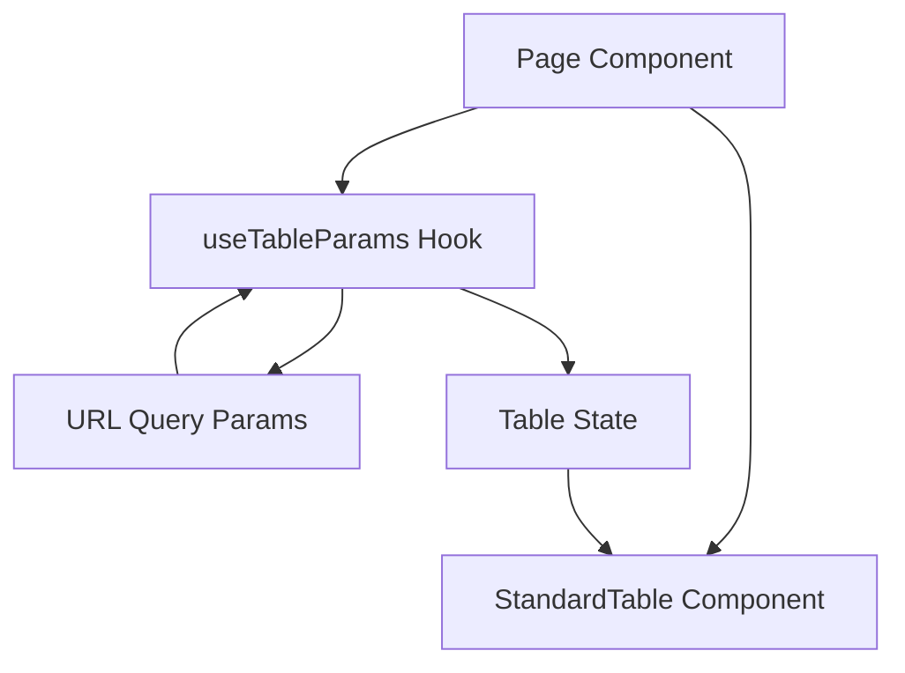

# Frontend UI Patterns

This document outlines the standard UI patterns and components used in the Backcast  frontend application. Adhering to these patterns ensures a consistent user experience and maintainable codebase.

## 1. List Views & Tables

All list views in the application should use the `StandardTable` component and the `useTableParams` hook. This combination provides a consistent interface for:

- **Pagination:** Managed automatically via Ant Design and URL parameters.
- **Sorting:** Client-side sorting with URL synchronization.
- **Filtering:** Per-column filters and global search, synced with URL.
- **Search:** Global search toolbar input.

### Architecture



### 1.1 `useTableParams` Hook

The `useTableParams` hook abstracts the logic for reading/writing table state (page, sort, filters, search) to the URL.

**Basic Usage:**

```typescript
import { useTableParams } from "@/hooks/useTableParams";

const MyListPage = () => {
  const { tableParams, handleTableChange, handleSearch } =
    useTableParams<MyDataType>();

  // Pass params to your data fetching hook (server-side filtering)
  const { data, isLoading } = useMyDataList(tableParams);
  const items = data?.items || [];
  const total = data?.total || 0;

  return (
    <StandardTable
      tableParams={{
        ...tableParams,
        pagination: { ...tableParams.pagination, total },
      }}
      onChange={handleTableChange}
      onSearch={handleSearch}
      loading={isLoading}
      dataSource={items}
      // ...
    />
  );
};
```

### 1.2 `StandardTable` Component

The `StandardTable` wraps the Ant Design `Table` component to provide a uniform toolbar and layout.

**Key Props:**

- `searchable`: Boolean. Enables the global search input in the toolbar.
- `searchPlaceholder`: String. Placeholder text for search input.
- `onSearch`: Function. Callback for search input change (debounced).
- `toolbar`: ReactNode. Additional toolbar items (e.g., "Add Button").

### 1.3 Per-Column Search (Text Filters)

For text columns that require specific filtering (e.g., finding a specific "Code"), use the `getColumnSearchProps` pattern. This renders a search input in the column header dropdown.

**Implementation:**

```typescript
const getColumnSearchProps = (dataIndex: keyof MyData): ColumnType<MyData> => ({
  filterDropdown: ({
    setSelectedKeys,
    selectedKeys,
    confirm,
    clearFilters,
  }) => (
    <div style={{ padding: 8 }}>
      <Input
        placeholder={`Search ${dataIndex}`}
        value={selectedKeys[0]}
        onChange={(e) =>
          setSelectedKeys(e.target.value ? [e.target.value] : [])
        }
        onPressEnter={() => confirm()}
        style={{ width: 188, marginBottom: 8, display: "block" }}
      />
      <Space>
        <Button
          type="primary"
          onClick={() => confirm()}
          icon={<SearchOutlined />}
          size="small"
          style={{ width: 90 }}
        >
          Search
        </Button>
        <Button
          onClick={() => clearFilters && clearFilters()}
          size="small"
          style={{ width: 90 }}
        >
          Reset
        </Button>
      </Space>
    </div>
  ),
  filterIcon: (filtered: boolean) => (
    <SearchOutlined style={{ color: filtered ? "#1890ff" : undefined }} />
  ),
  onFilter: (value, record) => {
    // REMOVED: Server-side filtering handles this.
    // Client-side 'onFilter' is not needed for StandardTable in server-side mode.
    return true;
  },
});
```

### 1.4 Categorical Filters

For columns with limited values (e.g., "Status", "Role"), use standard Ant Design filters.

```typescript
{
  title: "Role",
  dataIndex: "role",
  filters: [
    { text: "Admin", value: "admin" },
    { text: "User", value: "user" },
  ],
  // onFilter: (value, record) => ... // REMOVED: Server-side handles this
}
```

## 2. Search & Filtering Strategy

### Server-Side Filtering (Standard)

The application standardizes on **Server-Side Filtering** for all list views to ensure performance and consistency.

1.  **State:** `useTableParams` manages the state in the URL.
2.  **Fetch:** Pass `tableParams` directly to the API hook.
3.  **Display:** Pass `data.items` and `data.total` to `StandardTable`.

The API hooks are responsible for converting `tableParams` (Ant Design format) to the backend API parameters (using `getPaginationParams` helper) and returning a `PaginatedResponse`.
