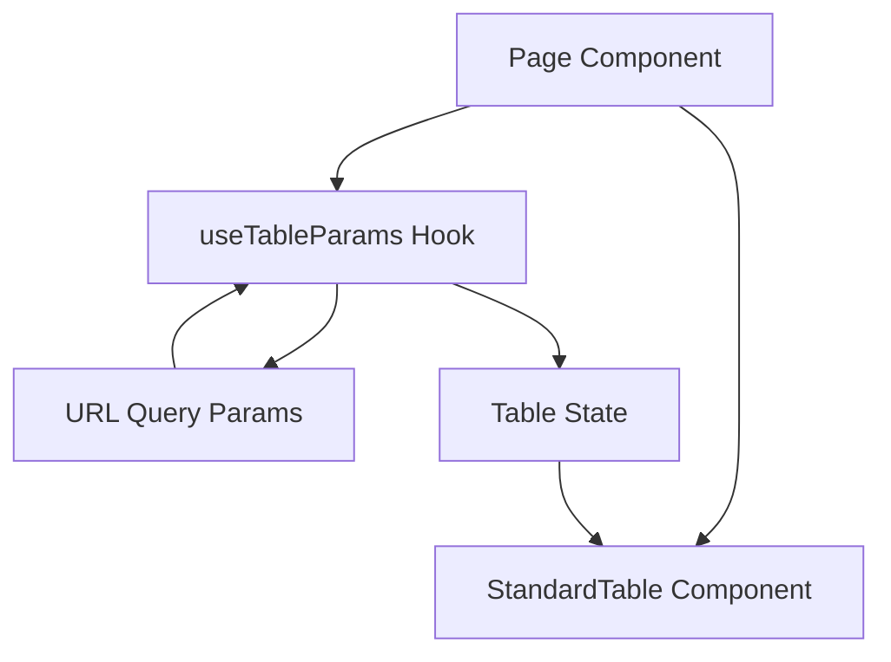

# Frontend UI Patterns

This document outlines the standard UI patterns and components used in the Backcast EVS frontend application. Adhering to these patterns ensures a consistent user experience and maintainable codebase.

## 1. List Views & Tables

All list views in the application should use the `StandardTable` component and the `useTableParams` hook. This combination provides a consistent interface for:

- **Pagination:** Managed automatically via Ant Design and URL parameters.
- **Sorting:** Client-side sorting with URL synchronization.
- **Filtering:** Per-column filters and global search, synced with URL.
- **Search:** Global search toolbar input.

### Architecture



### 1.1 `useTableParams` Hook

The `useTableParams` hook abstracts the logic for reading/writing table state (page, sort, filters, search) to the URL.

**Basic Usage:**

```typescript
import { useTableParams } from "@/hooks/useTableParams";

const MyListPage = () => {
  const { tableParams, handleTableChange, handleSearch } =
    useTableParams<MyDataType>();

  // Pass params to your data fetching hook (if server-side)
  // or use for client-side filtering
  const filteredData = useMemo(() => {
    // ... filter logic
  }, [data, tableParams]);

  return (
    <StandardTable
      tableParams={tableParams}
      onChange={handleTableChange}
      onSearch={handleSearch}
      // ...
    />
  );
};
```

### 1.2 `StandardTable` Component

The `StandardTable` wraps the Ant Design `Table` component to provide a uniform toolbar and layout.

**Key Props:**

- `searchable`: Boolean. Enables the global search input in the toolbar.
- `searchPlaceholder`: String. Placeholder text for search input.
- `onSearch`: Function. Callback for search input change (debounced).
- `toolbar`: ReactNode. Additional toolbar items (e.g., "Add Button").

### 1.3 Per-Column Search (Text Filters)

For text columns that require specific filtering (e.g., finding a specific "Code"), use the `getColumnSearchProps` pattern. This renders a search input in the column header dropdown.

**Implementation:**

```typescript
const getColumnSearchProps = (dataIndex: keyof MyData): ColumnType<MyData> => ({
  filterDropdown: ({
    setSelectedKeys,
    selectedKeys,
    confirm,
    clearFilters,
  }) => (
    <div style={{ padding: 8 }}>
      <Input
        placeholder={`Search ${dataIndex}`}
        value={selectedKeys[0]}
        onChange={(e) =>
          setSelectedKeys(e.target.value ? [e.target.value] : [])
        }
        onPressEnter={() => confirm()}
        style={{ width: 188, marginBottom: 8, display: "block" }}
      />
      <Space>
        <Button
          type="primary"
          onClick={() => confirm()}
          icon={<SearchOutlined />}
          size="small"
          style={{ width: 90 }}
        >
          Search
        </Button>
        <Button
          onClick={() => clearFilters && clearFilters()}
          size="small"
          style={{ width: 90 }}
        >
          Reset
        </Button>
      </Space>
    </div>
  ),
  filterIcon: (filtered: boolean) => (
    <SearchOutlined style={{ color: filtered ? "#1890ff" : undefined }} />
  ),
  onFilter: (value, record) => {
    // Client-side filter logic
    return record[dataIndex]
      ?.toString()
      .toLowerCase()
      .includes((value as string).toLowerCase());
  },
});
```

### 1.4 Categorical Filters

For columns with limited values (e.g., "Status", "Role"), use standard Ant Design filters.

```typescript
{
  title: "Role",
  dataIndex: "role",
  filters: [
    { text: "Admin", value: "admin" },
    { text: "User", value: "user" },
  ],
  onFilter: (value, record) => record.role === value,
}
```

## 2. Search & Filtering Strategy

### Hybrid Approach (Current Phase)

For moderate dataset sizes (< 1000 rows), we use a **Client-Side Filtering** approach for immediate feedback, whilst maintaining **URL synchronization** for shareability.

1.  **Fetch:** Load list data (page 1 or all) from API.
2.  **Filter:** Use `useMemo` in the component to filter the raw data based on `tableParams.search` and `tableParams.filters`.
3.  **Display:** Pass the _filtered_ data to `StandardTable`.

### Server-Side Filtering (Future)

For large datasets, the architecture supports switching to server-side filtering:

1.  Update API service to accept `search` and `filters` params.
2.  Pass `tableParams` to the API hook (e.g., `useList(tableParams)`).
3.  Remove client-side `useMemo` filtering.
4.  `useTableParams` remains unchanged as it purely manages the interface state.
