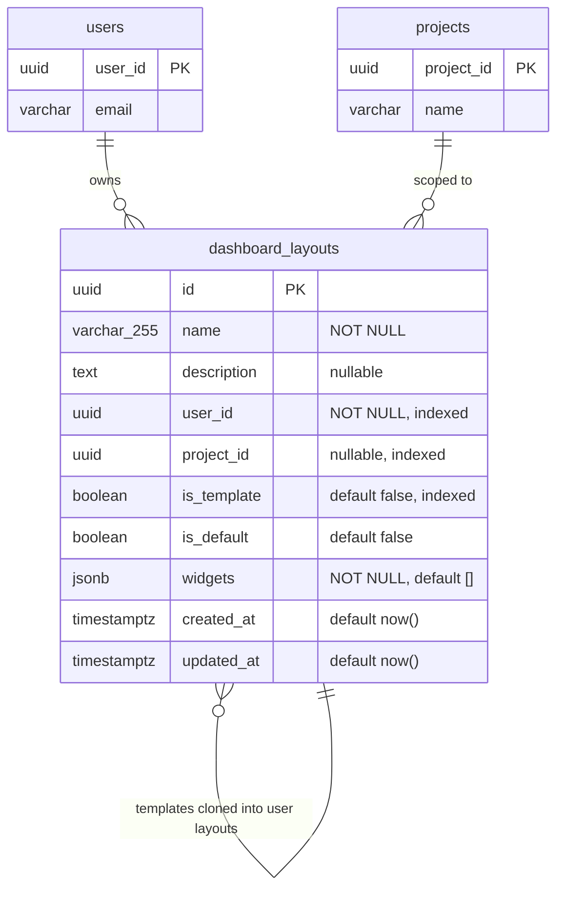
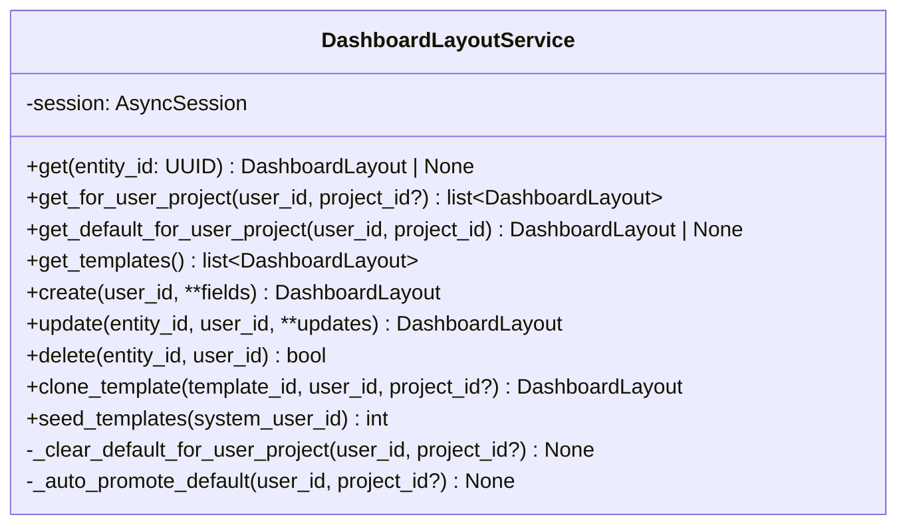
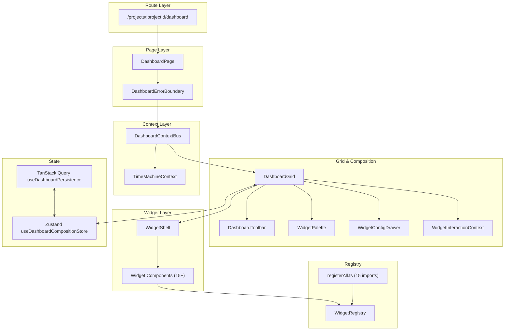
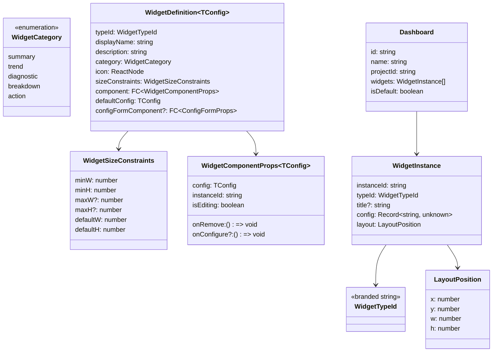
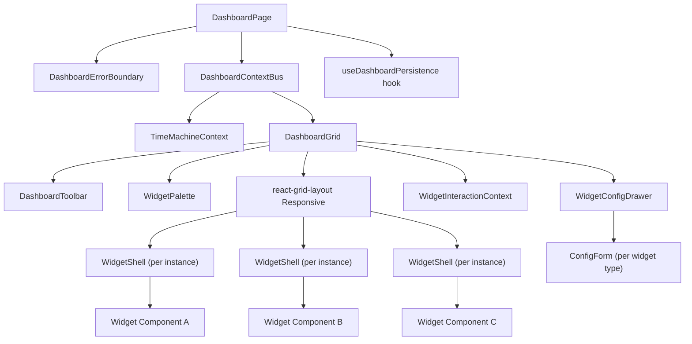
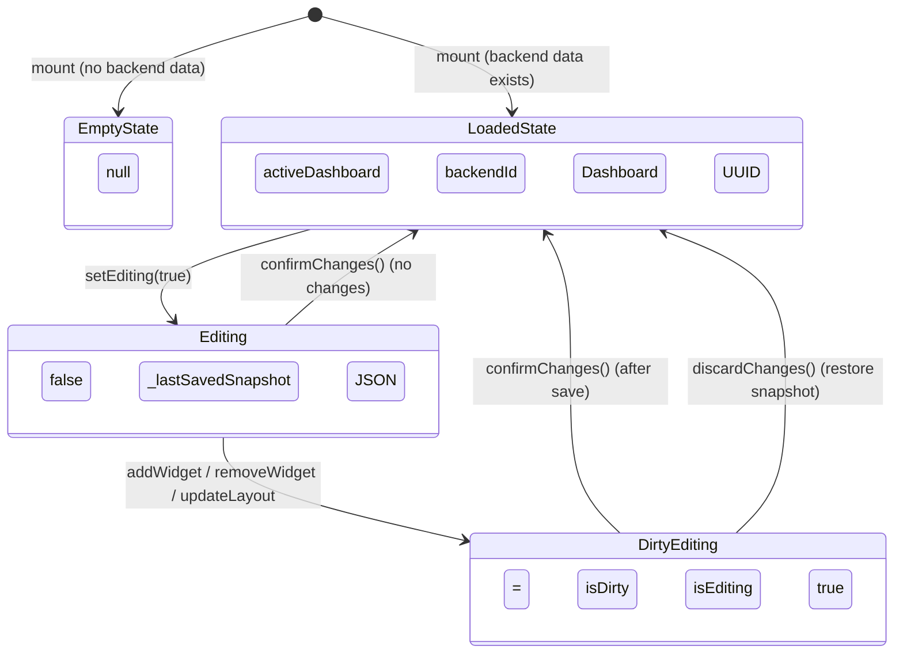
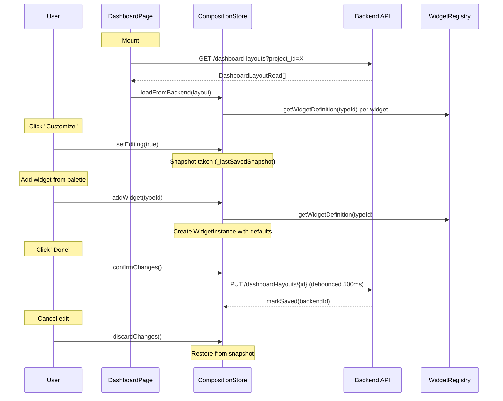

# Widget Dashboard Developer Guide

**Last updated:** 2026-04-06

A comprehensive reference for the project dashboard and widget system. Covers backend domain model, API, services, and frontend architecture.

---

## Table of Contents

- [Overview](#overview)
- [Backend](#backend)
  - [Domain Model](#domain-model)
  - [Widget JSON Schema](#widget-json-schema)
  - [Database Schema (ER Diagram)](#database-schema-er-diagram)
  - [Pydantic Schemas](#pydantic-schemas)
  - [Service Layer](#service-layer)
  - [API Endpoints](#api-endpoints)
  - [Template Seeding](#template-seeding)
- [Frontend](#frontend)
  - [Architecture Overview](#architecture-overview)
  - [Type System](#type-system)
  - [Widget Registry](#widget-registry)
  - [Component Hierarchy (Diagram)](#component-hierarchy-diagram)
  - [State Management](#state-management)
  - [Dashboard Context Bus](#dashboard-context-bus)
  - [Dashboard Grid Layout](#dashboard-grid-layout)
  - [Widget Lifecycle](#widget-lifecycle)
  - [Widget Definitions Catalog](#widget-definitions-catalog)
  - [Configuration Forms](#configuration-forms)
  - [Persistence & Auto-Save](#persistence--auto-save)
  - [Navigation Guards](#navigation-guards)

---

## Overview

The widget dashboard system provides **per-user, per-project customizable dashboards** composed of discrete widget instances arranged on a responsive grid. Key design decisions:

| Aspect | Decision |
|--------|----------|
| Entity type | Non-versioned (`SimpleEntityBase`) -- dashboard layouts are user-scoped, not temporally tracked |
| Widget storage | JSONB column -- flexible schema, avoids migration per widget type |
| Grid engine | `react-grid-layout` with 12-column responsive grid |
| State management | Zustand (composition UI) + TanStack Query (server state) |
| Registration pattern | Plugin-style: each widget self-registers on import |
| Cross-widget comms | React Context bus with entity selection + TimeMachine integration |

---

## Backend

### Domain Model

**File:** `backend/app/models/domain/dashboard_layout.py`

```python
class DashboardLayout(SimpleEntityBase):
    __tablename__ = "dashboard_layouts"

    id: UUID                          # Primary key
    name: str(255)                    # Human-readable name
    description: str | None           # Optional description
    user_id: UUID                     # Owner (indexed, app-level FK to users)
    project_id: UUID | None           # Project scope (indexed, NULL = global)
    is_template: bool                 # Read-only template flag (indexed)
    is_default: bool                  # User's default for this scope
    widgets: list[dict] (JSONB)       # Widget instances array
    created_at: datetime(tz)          # Audit timestamp
    updated_at: datetime(tz)          # Audit timestamp
```

**Key characteristics:**
- Extends `SimpleEntityBase` (non-versioned, no EVCS tracking)
- `user_id` and `project_id` use application-level referential integrity (no FK constraints due to PostgreSQL partial unique index limitations)
- `is_template=True` layouts are system-owned, read-only starting configurations
- `is_default=True` is scoped per `(user_id, project_id)` pair -- only one default per scope
- `widgets` stores the complete widget arrangement as a JSONB array

### Widget JSON Schema

Each element in the `widgets` JSONB array follows this structure:

```json
{
  "instanceId": "uuid-v4",
  "typeId": "evm-summary",
  "config": {
    "entityType": "PROJECT",
    "chartType": "bar"
  },
  "layout": {
    "x": 0,
    "y": 0,
    "w": 6,
    "h": 2
  }
}
```

| Field | Type | Description |
|-------|------|-------------|
| `instanceId` | `string` (UUID v4) | Unique per widget instance, generated at add-time |
| `typeId` | `string` | Widget type identifier, must match a registered `WidgetTypeId` |
| `config` | `object` | Widget-specific configuration (varies by `typeId`) |
| `layout.x` | `int` | Column position (0-based, 12-column grid) |
| `layout.y` | `int` | Row position (0-based) |
| `layout.w` | `int` | Width in grid columns |
| `layout.h` | `int` | Height in grid rows (1 row = 80px) |

### Database Schema (ER Diagram)



**Indexes:**
- `ix_dashboard_layouts_user_id` on `user_id`
- `ix_dashboard_layouts_project_id` on `project_id`
- `ix_dashboard_layouts_is_template` on `is_template`
- Partial unique index: one `is_default=True` per `(user_id, project_id)` scope

**Migration:** `backend/alembic/versions/20260405_add_dashboard_layouts.py`

### Pydantic Schemas

**File:** `backend/app/models/schemas/dashboard_layout.py`

```
DashboardLayoutCreate        # POST body: name, description?, project_id?, is_template, is_default, widgets
DashboardLayoutUpdate        # PUT body: all fields optional
DashboardLayoutRead          # Response: full entity with id, timestamps
CloneTemplateRequest         # POST body: project_id? for scoping the clone
```

```python
class DashboardLayoutRead(BaseModel):
    id: UUID
    name: str
    description: str | None
    user_id: UUID
    project_id: UUID | None
    is_template: bool
    is_default: bool
    widgets: list[dict[str, object]]
    created_at: datetime
    updated_at: datetime
```

### Service Layer

**File:** `backend/app/services/dashboard_layout_service.py`



**Key service behaviors:**

| Method | Behavior |
|--------|----------|
| `create()` | Clears existing default for same scope if `is_default=True` |
| `update()` | Ownership validation, clears existing default if promoting to default |
| `delete()` | Ownership validation, auto-promotes most recently updated layout to default if the deleted one was default |
| `clone_template()` | Validates `is_template=True`, copies widgets array to new user-owned layout |
| `seed_templates()` | Idempotent -- queries existing names, only inserts missing templates |

### API Endpoints

**File:** `backend/app/api/routes/dashboard_layouts.py`

Base path: `/api/v1/dashboard-layouts`

| Method | Path | Operation ID | Description |
|--------|------|-------------|-------------|
| `GET` | `/` | `list_dashboard_layouts` | List user's layouts, filterable by `?project_id=` |
| `GET` | `/templates` | `list_dashboard_layout_templates` | List all template layouts (readable by all users) |
| `GET` | `/{layout_id}` | `get_dashboard_layout` | Get single layout (ownership check for non-templates) |
| `POST` | `/` | `create_dashboard_layout` | Create new layout |
| `PUT` | `/{layout_id}` | `update_dashboard_layout` | Update layout (ownership required) |
| `DELETE` | `/{layout_id}` | `delete_dashboard_layout` | Delete layout (ownership required) |
| `POST` | `/{layout_id}/clone` | `clone_dashboard_layout_template` | Clone a template for current user |

**Authentication:** All endpoints require `get_current_active_user` dependency.

**Authorization:**
- Users can only read/write their own layouts
- Templates are readable by all authenticated users
- Non-template layouts return 404 if accessed by non-owner

### Template Seeding

On application startup, `seed_dashboard_templates()` is called. It uses the admin user (`admin@backcast.org`) as the template owner.

**Three predefined templates:**

| Template | Widgets | Purpose |
|----------|---------|---------|
| **Project Overview** | 8 widgets | Standard dashboard: header, KPIs, budget, variance, WBE tree, cost registrations, health |
| **EVM Analysis** | 7 widgets | EVM-focused: summary, efficiency gauges, trend chart, variance, forecast, health |
| **Cost Controller** | 6 widgets | Financial tracking: budget, costs, change orders, analytics, forecast |

---

## Frontend

### Architecture Overview



### Type System

**File:** `frontend/src/features/widgets/types.ts`



**Branded type pattern:** `WidgetTypeId` is a branded string type created via `widgetTypeId("my-widget")`. This prevents accidental string substitution at compile time.

### Widget Registry

**File:** `frontend/src/features/widgets/registry.ts`

A global `Map<WidgetTypeId, WidgetDefinition>` with three operations:

| Function | Signature | Description |
|----------|-----------|-------------|
| `registerWidget` | `(definition) => void` | Register a widget definition (warns on duplicate) |
| `getWidgetDefinition` | `(typeId) => Definition \| undefined` | Lookup by type ID |
| `getWidgetsByCategory` | `(category) => Definition[]` | Filter by category |
| `getAllWidgetDefinitions` | `() => Definition[]` | Get all definitions |

**Registration pattern:** Each widget definition file calls `registerWidget()` at module level as a side effect. `registerAll.ts` imports all definition files, and `registerAllWidgets()` is called once in `DashboardPage`.

### Component Hierarchy (Diagram)



**Component responsibilities:**

| Component | File | Responsibility |
|-----------|------|---------------|
| `DashboardPage` | `pages/DashboardPage.tsx` | Route host, nav guards, loading skeleton, context providers |
| `DashboardErrorBoundary` | `pages/DashboardErrorBoundary.tsx` | Catches rendering errors in the entire dashboard |
| `DashboardContextBus` | `context/DashboardContextBus.tsx` | Composes TimeMachine + entity selection context |
| `DashboardGrid` | `components/DashboardGrid.tsx` | react-grid-layout wrapper, edit/view rendering, empty state |
| `DashboardToolbar` | `components/DashboardToolbar.tsx` | Name editing, template selector, view/edit toggle, save |
| `WidgetPalette` | `components/WidgetPalette.tsx` | Modal catalog for adding widgets, grouped by category |
| `WidgetConfigDrawer` | `components/WidgetConfigDrawer.tsx` | Ant Design Drawer for editing selected widget's config |
| `WidgetShell` | `components/WidgetShell.tsx` | Universal widget wrapper: chrome, error boundary, toolbar, modes |
| `WidgetInteractionContext` | `components/WidgetInteractionContext.tsx` | Per-widget move/resize interaction mode tracking |

### State Management

**File:** `frontend/src/stores/useDashboardCompositionStore.ts`

Zustand store with `immer` middleware for immutable updates.



**Store state fields:**

| Field | Type | Description |
|-------|------|-------------|
| `isEditing` | `boolean` | Whether in edit mode |
| `activeDashboard` | `Dashboard \| null` | Current dashboard with widget instances |
| `isDirty` | `boolean` | Unsaved changes flag |
| `selectedWidgetId` | `string \| null` | Widget selected for config editing |
| `backendId` | `string \| null` | Backend layout UUID (null = not yet persisted) |
| `projectId` | `string` | Current project from route params |
| `paletteOpen` | `boolean` | Widget palette modal state |
| `_lastSavedSnapshot` | `string \| null` | JSON snapshot for edit-mode rollback |

**Key actions:**

| Action | Description |
|--------|-------------|
| `addWidget(typeId, position?)` | Creates instance from definition defaults, auto-computes Y position |
| `removeWidget(instanceId)` | Removes widget, deselects if selected |
| `updateWidgetLayout(instanceId, layout)` | Single widget position/size update |
| `updateDashboardLayout(layouts)` | Batch update from react-grid-layout `onLayoutChange` |
| `updateWidgetConfig(instanceId, config)` | Replace widget config (from config drawer) |
| `loadFromBackend(layout)` | Initialize store from API response |
| `setEditing(true)` | Take snapshot, enter edit mode |
| `discardChanges()` | Restore snapshot, exit edit mode |
| `confirmChanges()` | Clear snapshot, exit edit mode (after save) |
| `markSaved(backendId)` | Clear dirty flag, store backend ID |

### Dashboard Context Bus

**File:** `frontend/src/features/widgets/context/DashboardContextBus.tsx`

React Context providing cross-widget shared state. Composes the existing `TimeMachineContext` with entity-level selection.

```typescript
interface DashboardContextValue {
  // TimeMachine (delegated from TimeMachineContext)
  asOf: string | undefined;
  branch: string;
  mode: BranchMode;
  isHistorical: boolean;
  invalidateQueries: () => void;

  // Entity selection (widget-driven)
  projectId: string;
  wbeId: string | undefined;
  costElementId: string | undefined;
  setWbeId: (id: string | undefined) => void;
  setCostElementId: (id: string | undefined) => void;
}
```

**Usage pattern:**
- Context-providing widgets (e.g., WBE Tree) call `setWbeId()` when user selects a node
- Context-consuming widgets (e.g., EVM Summary) read `wbeId` to scope their data queries
- TimeMachine changes (branch, date) propagate automatically via the composed context

**Consumer hook:** `useDashboardContext()` in `context/useDashboardContext.ts`

### Dashboard Grid Layout

**File:** `frontend/src/features/widgets/components/DashboardGrid.tsx`

Uses `react-grid-layout` `Responsive` component.

| Parameter | Value | Notes |
|-----------|-------|-------|
| Breakpoints | `lg: 1200, md: 996, sm: 768, xs: 480` | Responsive breakpoints |
| Columns | `lg: 12, md: 10, sm: 6, xs: 4` | Column count per breakpoint |
| Row height | `80px` | Fixed row height |
| Margin | `12px x 12px` | Gap between widgets |
| Layout debounce | `150ms` | Prevents excessive store updates during drag |

**Interaction model:** Instead of always-on drag handles, widgets use an explicit interaction mode:
1. In edit mode, each widget shows Move/Resize/Settings/Delete buttons in its action bar
2. Clicking Move activates the drag handle (`.react-grid-drag-handle` class on the move button)
3. Clicking Resize enables the resize handle for that widget only
4. `WidgetInteractionContext` tracks which widget has the active mode

**Key behaviors:**
- `isDraggable` and `isResizable` are set per-widget based on `activeInteraction` state
- `onDragStop` / `onResizeStop` update the store and clear the interaction mode
- `onLayoutChange` fires debounced batch updates to the store
- Grid background shows dot pattern in edit mode via `radial-gradient` CSS

### Widget Lifecycle



### Widget Definitions Catalog

**15 registered widget types** across 5 categories:

| Type ID | Category | Default Size | Config Form | Description |
|---------|----------|-------------|-------------|-------------|
| `project-header` | summary | 4x1 | -- | Project name, status, dates |
| `quick-stats-bar` | summary | 4x1 | -- | Entity count KPIs |
| `evm-summary` | summary | 4x2 | EVMSummaryConfigForm | Core EVM metrics (CPI, SPI, etc.) |
| `budget-status` | summary | 4x2 | BudgetStatusConfigForm | Budget bar/pie chart |
| `health-summary` | summary | 4x2 | -- | Health indicators with thresholds |
| `evm-trend-chart` | trend | 6x3 | -- | EVM metrics over time |
| `forecast` | trend | 4x2 | ForecastConfigForm | EAC, ETC, VAC projections |
| `variance-chart` | diagnostic | 4x2 | VarianceChartConfigForm | Cost/schedule variance |
| `evm-efficiency-gauges` | diagnostic | 4x2 | -- | CPI/SPI gauge dials |
| `change-order-analytics` | diagnostic | 4x3 | -- | Change order distribution charts |
| `wbe-tree` | breakdown | 4x3 | WBETreeConfigForm | WBE hierarchy tree |
| `mini-gantt` | breakdown | 6x3 | -- | Compact Gantt timeline |
| `cost-registrations` | action | 4x3 | CostRegistrationsConfigForm | Cost entry table |
| `progress-tracker` | action | 4x3 | ProgressTrackerConfigForm | Progress entry table |
| `change-orders-list` | action | 4x3 | -- | Change order queue table |

**Creating a new widget definition:**

1. Create file: `frontend/src/features/widgets/definitions/MyWidget.tsx`
2. Import and call `registerWidget()` with a `WidgetDefinition` object
3. Import the file in `frontend/src/features/widgets/definitions/registerAll.ts`
4. Optionally create a config form in `components/config-forms/`

```typescript
// Example widget definition
import { widgetTypeId, registerWidget } from "../registry";

const MY_WIDGET = widgetTypeId("my-widget");

registerWidget({
  typeId: MY_WIDGET,
  displayName: "My Widget",
  description: "Does something useful",
  category: "summary",
  icon: <StarOutlined />,
  sizeConstraints: { minW: 3, minH: 2, defaultW: 4, defaultH: 2 },
  component: MyWidgetComponent,
  defaultConfig: { showDetails: true },
});
```

### Configuration Forms

**File pattern:** `frontend/src/features/widgets/components/config-forms/{Widget}ConfigForm.tsx`

Each form implements the `ConfigFormProps<TConfig>` interface:

```typescript
interface ConfigFormProps<TConfig = Record<string, unknown>> {
  config: TConfig;
  onChange: (config: Partial<TConfig>) => void;
}
```

Forms use Ant Design components. The `WidgetConfigDrawer` reads the selected widget's `configFormComponent` from its `WidgetDefinition` and renders it inside an Ant Design Drawer.

**Available config forms:** `EVMSummaryConfigForm`, `BudgetStatusConfigForm`, `VarianceChartConfigForm`, `CostRegistrationsConfigForm`, `ProgressTrackerConfigForm`, `WBETreeConfigForm`, `ForecastConfigForm`

### Persistence & Auto-Save

**File:** `frontend/src/features/widgets/api/useDashboardPersistence.ts`

| Behavior | Detail |
|----------|--------|
| Initial load | `GET /dashboard-layouts?project_id=X`, prefers default layout |
| Auto-save trigger | `isDirty` becomes `true` while NOT in edit mode |
| Auto-save debounce | 500ms |
| Create vs update | If `backendId` is null -> POST, otherwise PUT |
| Widget serialization | Maps `WidgetInstance[]` to `WidgetConfig[]` (structurally identical) |
| Save on error | Keeps `isDirty=true`, retries on next debounce cycle |

**Flow:**
1. On mount: fetch user layouts, call `loadFromBackend()` with default/first layout
2. On `isDirty` change (outside edit mode): debounce 500ms, then POST or PUT
3. On save success: call `markSaved(backendId)` to clear dirty flag
4. On save failure: keep dirty, show error toast, retry next cycle

### Navigation Guards

**File:** `frontend/src/features/widgets/pages/DashboardPage.tsx`

Two levels of protection:

| Guard | Trigger | Behavior |
|-------|---------|----------|
| `beforeunload` | Browser refresh/close/tab close | Prevents default when `isDirty \|\| isEditing` |
| `useBlocker` | React Router navigation (tab change) | Shows modal: "Discard and Leave" / "Stay and Save" |

**Edit mode handling:** When blocking during edit mode, `discardChanges()` is called before proceeding to restore the pre-edit snapshot.

---

## File Reference

### Backend Files

| File | Purpose |
|------|---------|
| `backend/app/models/domain/dashboard_layout.py` | SQLAlchemy model |
| `backend/app/models/schemas/dashboard_layout.py` | Pydantic schemas |
| `backend/app/services/dashboard_layout_service.py` | Business logic + template seeding |
| `backend/app/api/routes/dashboard_layouts.py` | REST endpoints |
| `backend/alembic/versions/20260405_add_dashboard_layouts.py` | Migration |
| `backend/tests/api/routes/test_dashboard_layouts.py` | API route tests |
| `backend/tests/unit/services/test_dashboard_layout_service.py` | Service unit tests |

### Frontend Files

| File | Purpose |
|------|---------|
| `frontend/src/features/widgets/types.ts` | Type definitions |
| `frontend/src/features/widgets/registry.ts` | Widget registration system |
| `frontend/src/features/widgets/definitions/registerAll.ts` | Barrel import for all widgets |
| `frontend/src/features/widgets/definitions/*.tsx` | 15 widget definition files |
| `frontend/src/features/widgets/components/DashboardGrid.tsx` | Grid layout orchestrator |
| `frontend/src/features/widgets/components/DashboardToolbar.tsx` | Toolbar with edit toggle |
| `frontend/src/features/widgets/components/WidgetShell.tsx` | Universal widget wrapper |
| `frontend/src/features/widgets/components/WidgetPalette.tsx` | Add-widget modal |
| `frontend/src/features/widgets/components/WidgetConfigDrawer.tsx` | Config editing drawer |
| `frontend/src/features/widgets/components/WidgetInteractionContext.tsx` | Move/resize mode context |
| `frontend/src/features/widgets/components/config-forms/` | 7 config form components |
| `frontend/src/features/widgets/pages/DashboardPage.tsx` | Route page component |
| `frontend/src/features/widgets/pages/DashboardErrorBoundary.tsx` | Error boundary |
| `frontend/src/features/widgets/context/DashboardContextBus.tsx` | Cross-widget context |
| `frontend/src/features/widgets/api/useDashboardPersistence.ts` | Auto-save + load hook |
| `frontend/src/features/widgets/api/useDashboardLayouts.ts` | TanStack Query CRUD hooks |
| `frontend/src/stores/useDashboardCompositionStore.ts` | Zustand composition state |
