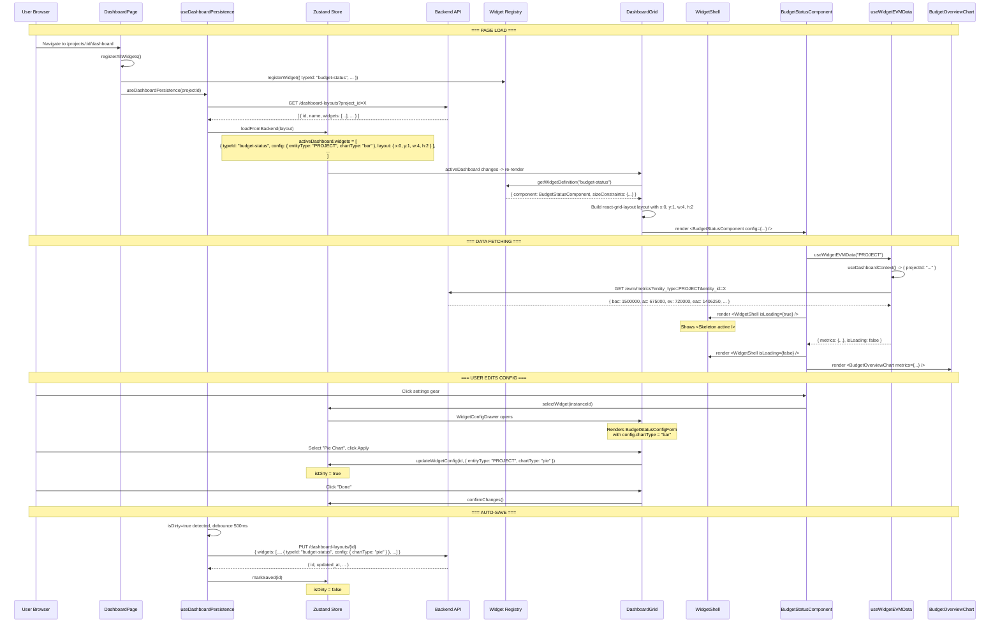

# Widget Lifecycle Walkthrough: Budget Status Widget

**Last updated:** 2026-04-06

This document traces the complete lifecycle of the **Budget Status** widget (`budget-status`) from its initial configuration in a backend template through to its rendering on the user's dashboard page. Every code snippet is taken directly from the codebase.

---

## Table of Contents

- [Step 1: Template Definition in the Backend](#step-1-template-definition-in-the-backend)
- [Step 2: Template Seeding on Startup](#step-2-template-seeding-on-startup)
- [Step 3: User Navigates to Dashboard](#step-3-user-navigates-to-dashboard)
- [Step 4: Frontend Loads Layout from Backend](#step-4-frontend-loads-layout-from-backend)
- [Step 5: Store Populates from Backend Response](#step-5-store-populates-from-backend-response)
- [Step 6: DashboardGrid Resolves Widget Definitions](#step-6-dashboardgrid-resolves-widget-definitions)
- [Step 7: Widget Registration (How the Widget Self-Registers)](#step-7-widget-registration-how-the-widget-self-registers)
- [Step 8: react-grid-layout Renders the Grid](#step-8-react-grid-layout-renders-the-grid)
- [Step 9: BudgetStatusComponent Renders Inside WidgetShell](#step-9-budgetstatuscomponent-renders-inside-widgetshell)
- [Step 10: EVM Data Fetching via useWidgetEVMData](#step-10-evm-data-fetching-via-usewidgetevmdata)
- [Step 11: BudgetOverviewChart Renders with Real Data](#step-11-budgetoverviewchart-renders-with-real-data)
- [Step 12: User Edits Widget Configuration](#step-12-user-edits-widget-configuration)
- [Step 13: Auto-Save Persists Changes](#step-13-auto-save-persists-changes)
- [Complete Request Flow Diagram](#complete-request-flow-diagram)

---

## Step 1: Template Definition in the Backend

The **Project Overview** template is defined as a Python dictionary in `backend/app/services/dashboard_layout_service.py`. The budget-status widget is one of 8 widgets in this template:

```python
# backend/app/services/dashboard_layout_service.py:26-87

_TEMPLATES: dict[str, dict[str, Any]] = {
    "Project Overview": {
        "description": "Standard project dashboard with header, KPIs, and budget overview",
        "widgets": [
            # ... other widgets ...
            {
                "instanceId": str(uuid.uuid4()),
                "typeId": "budget-status",                   # <-- matches WidgetTypeId
                "config": {
                    "entityType": "PROJECT",
                    "chartType": "bar",
                },
                "layout": {
                    "x": 0,  # column 0 (leftmost)
                    "y": 1,  # row 1 (below project-header)
                    "w": 4,  # 4 columns wide
                    "h": 2,  # 2 rows tall (160px)
                },
            },
            # ... more widgets ...
        ],
    },
}
```

**Sample data stored in `dashboard_layouts.widgets` JSONB column:**

```json
{
  "instanceId": "a1b2c3d4-e5f6-7890-abcd-ef1234567890",
  "typeId": "budget-status",
  "config": {
    "entityType": "PROJECT",
    "chartType": "bar"
  },
  "layout": {
    "x": 0,
    "y": 1,
    "w": 4,
    "h": 2
  }
}
```

---

## Step 2: Template Seeding on Startup

When the application starts, `seed_dashboard_templates()` is called from `main.py`. It creates template layouts owned by the admin user:

```python
# backend/app/services/dashboard_layout_service.py:526-549

async def seed_dashboard_templates() -> None:
    """Seed template layouts on application startup."""
    from sqlalchemy import select as sa_select
    from app.db.session import async_session_maker
    from app.models.domain.user import User

    async with async_session_maker() as db:
        result = await db.execute(
            sa_select(User).where(User.email == "admin@backcast.org").limit(1)
        )
        admin = result.scalar_one_or_none()
        if admin is None:
            logger.warning("Admin user not found; skipping dashboard template seeding")
            return

        service = DashboardLayoutService(db)
        await service.seed_templates(admin.user_id)
        await db.commit()
```

The `seed_templates()` method is **idempotent** -- it queries existing template names and only inserts missing ones:

```python
# backend/app/services/dashboard_layout_service.py:497-519

async def seed_templates(self, system_user_id: uuid.UUID) -> int:
    existing = await self.get_templates()
    existing_names = {t.name for t in existing}

    created = 0
    for name, tpl in _TEMPLATES.items():
        if name in existing_names:
            continue
        layout = DashboardLayout(
            name=name,
            description=tpl["description"],
            user_id=system_user_id,
            project_id=None,
            is_template=True,
            is_default=False,
            widgets=tpl["widgets"],
        )
        self.session.add(layout)
        created += 1

    if created:
        await self.session.flush()
    return created
```

After seeding, the database row looks like:

```
id: 550e8400-e29b-41d4-a716-446655440000
name: "Project Overview"
description: "Standard project dashboard with header, KPIs, and budget overview"
user_id: <admin_user_id>
project_id: NULL
is_template: true
is_default: false
widgets: [
  {"instanceId": "...", "typeId": "project-header", "config": {...}, "layout": {"x":0,"y":0,"w":4,"h":1}},
  {"instanceId": "...", "typeId": "quick-stats-bar", "config": {...}, "layout": {"x":4,"y":0,"w":4,"h":1}},
  {"instanceId": "a1b2c3d4-...", "typeId": "budget-status", "config": {"entityType":"PROJECT","chartType":"bar"}, "layout": {"x":0,"y":1,"w":4,"h":2}},
  ... 5 more widgets
]
```

---

## Step 3: User Navigates to Dashboard

The user navigates to `/projects/:projectId/dashboard`. React Router matches this to `DashboardPage`:

```typescript
// frontend/src/features/widgets/pages/DashboardPage.tsx:23-138

export function DashboardPage() {
  const { token } = theme.useToken();
  const { projectId } = useParams<{ projectId: string }>();
  const [modal, contextHolder] = Modal.useModal();

  // Composition store for dirty state and edit mode
  const isDirty = useDashboardCompositionStore((s) => s.isDirty);
  const isEditing = useDashboardCompositionStore((s) => s.isEditing);

  // Wire dashboard persistence -- load from backend, auto-save on changes
  const { save, isLoading } = useDashboardPersistence(projectId ?? "");

  // ... navigation guards ...

  return (
    <DashboardErrorBoundary>
      {contextHolder}
      <DashboardContextBus projectId={projectId}>
        <div style={{ height: "100%", overflow: "auto", padding: token.paddingMD }}>
          {isLoading ? (
            <Skeleton.Input active block style={{ height: 48 }} />
          ) : (
            <DashboardGrid onSave={save} />
          )}
        </div>
      </DashboardContextBus>
    </DashboardErrorBoundary>
  );
}
```

At the top of the file, all widget definitions are registered:

```typescript
// frontend/src/features/widgets/pages/DashboardPage.tsx:12

import { registerAllWidgets } from "../definitions/registerAll";
registerAllWidgets();
```

This triggers side-effect imports for all 15 widgets, including `BudgetStatusWidget`.

---

## Step 4: Frontend Loads Layout from Backend

The `useDashboardPersistence` hook fires a `GET` request on mount:

```typescript
// frontend/src/features/widgets/api/useDashboardPersistence.ts:98-129

useEffect(() => {
  let cancelled = false;

  async function load() {
    useDashboardCompositionStore.getState().setProjectId(projectId);

    try {
      const layouts = await layoutApi.list(projectId);
      if (cancelled) return;

      if (layouts.length > 0) {
        // Prefer the default layout, otherwise pick the first
        const defaultLayout = layouts.find((l) => l.is_default);
        const layout = defaultLayout ?? layouts[0];
        useDashboardCompositionStore.getState().loadFromBackend(layout);
      }
    } catch {
      // If load fails, the user starts with an empty dashboard.
    } finally {
      loadDoneRef.current = true;
    }
  }

  load();
  return () => { cancelled = true; };
}, [projectId]);
```

The `layoutApi.list()` call issues:

```
GET /api/v1/dashboard-layouts?project_id=550e8400-...
Authorization: Bearer <jwt_token>
```

The backend handler in `dashboard_layouts.py`:

```python
# backend/app/api/routes/dashboard_layouts.py:36-50

@router.get("", response_model=list[DashboardLayoutRead])
async def list_dashboard_layouts(
    project_id: UUID | None = Query(None),
    current_user: User = Depends(get_current_active_user),
    service: DashboardLayoutService = Depends(get_dashboard_layout_service),
):
    layouts = await service.get_for_user_project(current_user.user_id, project_id)
    return [DashboardLayoutRead.model_validate(layout) for layout in layouts]
```

**Sample API response:**

```json
[
  {
    "id": "f47ac10b-58cc-4372-a567-0e02b2c3d479",
    "name": "My Dashboard",
    "description": null,
    "user_id": "123e4567-e89b-12d3-a456-426614174000",
    "project_id": "550e8400-e29b-41d4-a716-446655440099",
    "is_template": false,
    "is_default": true,
    "widgets": [
      {
        "instanceId": "aaa11111-2222-3333-4444-555566667777",
        "typeId": "project-header",
        "config": {"showDates": true, "showStatus": true},
        "layout": {"x": 0, "y": 0, "w": 4, "h": 1}
      },
      {
        "instanceId": "a1b2c3d4-e5f6-7890-abcd-ef1234567890",
        "typeId": "budget-status",
        "config": {"entityType": "PROJECT", "chartType": "bar"},
        "layout": {"x": 0, "y": 1, "w": 4, "h": 2}
      }
    ],
    "created_at": "2026-04-06T10:30:00Z",
    "updated_at": "2026-04-06T14:22:00Z"
  }
]
```

---

## Step 5: Store Populates from Backend Response

The `loadFromBackend` action in the Zustand store converts the API response into the internal `Dashboard` shape:

```typescript
// frontend/src/stores/useDashboardCompositionStore.ts:262-275

loadFromBackend: (layout) =>
  set((state) => {
    state.activeDashboard = {
      id: uuid(),
      name: layout.name,
      projectId: layout.project_id ?? state.projectId,
      widgets: widgetConfigsToInstances(layout.widgets),  // direct cast
      isDefault: layout.is_default,
    };
    state.backendId = layout.id;
    state.isDirty = false;
    state.selectedWidgetId = null;
  }),
```

The `widgetConfigsToInstances` function is a structural cast since the backend `WidgetConfig` and frontend `WidgetInstance` shapes are identical:

```typescript
// frontend/src/stores/useDashboardCompositionStore.ts:112-116

function widgetConfigsToInstances(
  widgets: WidgetConfig[],
): WidgetInstance[] {
  return widgets as unknown as WidgetInstance[];
}
```

After this, the store state contains:

```typescript
{
  isEditing: false,
  activeDashboard: {
    id: "new-uuid",
    name: "My Dashboard",
    projectId: "550e8400-e29b-41d4-a716-446655440099",
    widgets: [
      { instanceId: "aaa11111-...", typeId: "project-header", config: {...}, layout: {x:0,y:0,w:4,h:1} },
      { instanceId: "a1b2c3d4-...", typeId: "budget-status", config: {entityType:"PROJECT",chartType:"bar"}, layout: {x:0,y:1,w:4,h:2} },
      // ... 6 more
    ],
    isDefault: true,
  },
  backendId: "f47ac10b-58cc-4372-a567-0e02b2c3d479",
  isDirty: false,
}
```

---

## Step 6: DashboardGrid Resolves Widget Definitions

`DashboardGrid` reads `activeDashboard.widgets` from the store and resolves each widget's `typeId` against the registry:

```typescript
// frontend/src/features/widgets/components/DashboardGrid.tsx:97-127

const widgetMeta = useMemo(() => {
  if (!activeDashboard) return new Map();

  const map = new Map();
  for (const w of activeDashboard.widgets) {
    const def = getWidgetDefinition(w.typeId);   // <-- registry lookup
    map.set(w.instanceId, {
      layout: {
        i: w.instanceId,
        x: w.layout.x,
        y: w.layout.y,
        w: w.layout.w,
        h: w.layout.h,
        minW: def?.sizeConstraints.minW,   // 2 for budget-status
        maxW: def?.sizeConstraints.maxW,
        minH: def?.sizeConstraints.minH,   // 2 for budget-status
        maxH: def?.sizeConstraints.maxH,
        isDraggable: !!(activeInteraction?.instanceId === w.instanceId && activeInteraction.mode === "move"),
        isResizable: !!(activeInteraction?.instanceId === w.instanceId && activeInteraction.mode === "resize"),
      },
      definition: def,
    });
  }
  return map;
}, [activeDashboard, activeInteraction]);
```

For the budget-status widget, `getWidgetDefinition("budget-status")` returns the `WidgetDefinition` object registered in Step 7.

The layout is passed to react-grid-layout:

```typescript
// frontend/src/features/widgets/components/DashboardGrid.tsx:129-131

const layouts = useMemo(() => ({
  lg: activeDashboard ? Array.from(widgetMeta.values()).map(m => m.layout) : [],
}), [widgetMeta, activeDashboard]);
```

---

## Step 7: Widget Registration (How the Widget Self-Registers)

When `registerAllWidgets()` is called, the import chain triggers `BudgetStatusWidget.tsx` module execution, which calls `registerWidget()`:

```typescript
// frontend/src/features/widgets/definitions/BudgetStatusWidget.tsx:63-81

registerWidget<BudgetStatusConfig>({
  typeId: widgetTypeId("budget-status"),
  displayName: "Budget Status",
  description: "Budget overview chart showing BAC, AC, EV, and EAC",
  category: "trend",
  icon: <PieChartOutlined />,
  sizeConstraints: {
    minW: 2,
    minH: 2,
    defaultW: 2,
    defaultH: 2,
  },
  component: BudgetStatusComponent,
  defaultConfig: {
    entityType: EntityType.PROJECT,
    chartType: "bar",
  },
  configFormComponent: BudgetStatusConfigForm,
});
```

This stores the definition in the global registry `Map`:

```typescript
// frontend/src/features/widgets/registry.ts:32-44

export function registerWidget<TConfig>(definition: WidgetDefinition<TConfig>): void {
  if (registry.has(definition.typeId)) {
    console.warn(`Widget "${definition.typeId}" is already registered. Overwriting.`);
  }
  registry.set(definition.typeId, definition as WidgetDefinition<Record<string, unknown>>);
}
```

After registration, `registry.get("budget-status")` returns the full definition including the `component` function reference and `defaultConfig`.

---

## Step 8: react-grid-layout Renders the Grid

`DashboardGrid` passes widget instances to the `Responsive` component. For each widget, it resolves the component from the registry and renders it:

```typescript
// frontend/src/features/widgets/components/DashboardGrid.tsx:247-281

{widgets.map((widget) => {
  const meta = widgetMeta.get(widget.instanceId);
  const definition = meta?.definition;

  if (!definition) {
    return (
      <div key={widget.instanceId}>
        Widget type "{widget.typeId}" not found in registry
      </div>
    );
  }

  const WidgetComponent = definition.component;

  return (
    <div key={widget.instanceId}>
      <WidgetComponent
        config={widget.config as Parameters<typeof WidgetComponent>[0]["config"]}
        instanceId={widget.instanceId}
        isEditing={isEditing}
        onRemove={() => removeWidget(widget.instanceId)}
        onConfigure={() => selectWidget(widget.instanceId)}
      />
    </div>
  );
})}
```

For the budget-status widget, `WidgetComponent` is `BudgetStatusComponent` and `widget.config` is `{ entityType: "PROJECT", chartType: "bar" }`.

---

## Step 9: BudgetStatusComponent Renders Inside WidgetShell

The component receives its props and wraps its content in `WidgetShell`:

```typescript
// frontend/src/features/widgets/definitions/BudgetStatusWidget.tsx:19-61

const BudgetStatusComponent: FC<WidgetComponentProps<BudgetStatusConfig>> = ({
  config,          // { entityType: "PROJECT", chartType: "bar" }
  instanceId,      // "a1b2c3d4-e5f6-7890-abcd-ef1234567890"
  isEditing,       // false (view mode)
  onRemove,        // () => removeWidget(instanceId)
  onConfigure,     // () => selectWidget(instanceId)
}) => {
  const { token } = theme.useToken();

  // Resolves entity from context, fetches EVM data
  const { metrics, isLoading, error, entityId, refetch } = useWidgetEVMData(
    config.entityType,   // "PROJECT"
  );

  return (
    <WidgetShell
      instanceId={instanceId}
      title="Budget Status"
      icon={<PieChartOutlined />}
      isEditing={isEditing}
      isLoading={isLoading}
      error={error}
      onRemove={onRemove}
      onRefresh={refetch}
      onConfigure={onConfigure}
    >
      {metrics ? (
        <BudgetOverviewChart metrics={metrics} />     // <-- actual chart
      ) : (
        !isLoading && !error && !entityId && (
          <div style={{ textAlign: "center", padding: token.paddingMD }}>
            <Text type="secondary">Select an entity to view budget status</Text>
          </div>
        )
      )}
    </WidgetShell>
  );
};
```

`WidgetShell` handles:
- **View mode:** subtle title label (top-left), floating trigger icon (top-right) that opens a toolbar with collapse/refresh
- **Edit mode:** persistent action bar with Move/Resize/Settings/Delete buttons
- **Loading:** Ant Design `<Skeleton active />`
- **Error:** error message with retry button, wrapped in `<ErrorBoundary>`

---

## Step 10: EVM Data Fetching via useWidgetEVMData

The shared hook resolves the entity scope from the `DashboardContextBus` and calls the existing `useEVMMetrics` hook:

```typescript
// frontend/src/features/widgets/definitions/shared/useWidgetEVMData.ts:1-43

export function useWidgetEVMData(entityType: EntityType): WidgetEVMDataResult {
  const context = useDashboardContext();
  //    ^-- from DashboardContextBus
  //    context = {
  //      projectId: "550e8400-e29b-41d4-a716-446655440099",
  //      wbeId: undefined,
  //      costElementId: undefined,
  //      branch: "main",
  //      asOf: undefined,
  //      mode: "merged",
  //      ...
  //    }

  const entityId =
    entityType === EntityType.PROJECT       // config.entityType = "PROJECT"
      ? context.projectId                   // "550e8400-e29b-41d4-a716-446655440099"
      : entityType === EntityType.WBE
        ? context.wbeId                     // undefined
        : context.costElementId;            // undefined

  const result = useEVMMetrics(entityType, entityId ?? "");
  //             ^-- issues GET /api/v1/evm/metrics?entity_type=PROJECT&entity_id=550e8400-...

  return {
    metrics: result.data,
    isLoading: result.isLoading,
    error: result.error,
    entityId,
    refetch: result.refetch,
  };
}
```

This results in an API call:

```
GET /api/v1/evm/metrics?entity_type=PROJECT&entity_id=550e8400-e29b-41d4-a716-446655440099
```

**Sample EVM metrics response:**

```json
{
  "bac": 1500000.00,
  "ac": 675000.00,
  "ev": 720000.00,
  "eac": 1406250.00,
  "cpi": 1.067,
  "spi": 1.034,
  "cv": 45000.00,
  "sv": 24000.00,
  "tcpi": 1.029,
  "vac": 93750.00
}
```

---

## Step 11: BudgetOverviewChart Renders with Real Data

Once `metrics` is available, `BudgetOverviewChart` renders the ECharts visualization:

```typescript
// frontend/src/components/explorer/charts/BudgetOverviewChart.tsx:13-46

export const BudgetOverviewChart: React.FC<BudgetOverviewChartProps> = ({
  metrics,
  height = 220,
}) => {
  const colors = useEChartsColors();

  const option = useMemo(
    () =>
      buildBudgetOverviewOptions(
        {
          metrics: {
            bac: metrics.bac,     // 1,500,000
            ac: metrics.ac,       //   675,000
            ev: metrics.ev,       //   720,000
            eac: metrics.eac,     // 1,406,250
          },
          currencyFormatter: (v: number) => formatCurrency(v),
        },
        colors,
      ),
    [metrics.bac, metrics.ac, metrics.ev, metrics.eac, colors],
  );

  return (
    <EChartsBaseChart
      option={option}
      loading={metrics.bac === 0}
      height={height}
      emptyDescription="No budget data available"
    />
  );
};
```

The chart shows a bar chart comparing BAC, AC, EV, and EAC as configured by `chartType: "bar"`.

---

## Step 12: User Edits Widget Configuration

When the user clicks the Settings button on the widget, the `onConfigure` callback fires:

```typescript
onConfigure={() => selectWidget(widget.instanceId)}
```

This sets `selectedWidgetId` in the store. `WidgetConfigDrawer` reads this and renders the config form:

```typescript
// frontend/src/features/widgets/components/WidgetConfigDrawer.tsx:41-62

const { widget, definition, ConfigFormComponent } = useMemo(() => {
  if (!selectedWidgetId || !activeDashboard) return { ... };

  const widget = activeDashboard.widgets.find(
    (w) => w.instanceId === selectedWidgetId,
  );
  const definition = getWidgetDefinition(widget.typeId);
  const ConfigFormComponent = definition.configFormComponent;

  return { widget, definition, ConfigFormComponent };
}, [selectedWidgetId, activeDashboard]);

// ...

{widget && definition && ConfigFormComponent && (
  <ConfigFormComponent
    config={currentConfig}
    onChange={handleConfigChange}
  />
)}
```

For budget-status, `ConfigFormComponent` is `BudgetStatusConfigForm`:

```typescript
// frontend/src/features/widgets/components/config-forms/BudgetStatusConfigForm.tsx:15-50

export function BudgetStatusConfigForm({
  config,
  onChange,
}: ConfigFormProps<BudgetStatusWidgetConfig>) {
  return (
    <Form layout="vertical">
      <Form.Item label="Chart Type">
        <Radio.Group
          value={config.chartType ?? "bar"}
          onChange={(e) => onChange({ chartType: e.target.value })}
        >
          <Space direction="vertical">
            <Radio value="bar">
              <Text>Bar Chart</Text>
              <Text type="secondary" style={{ fontSize: 12, marginLeft: 8 }}>
                Compare budget vs. actual side by side
              </Text>
            </Radio>
            <Radio value="pie">
              <Text>Pie Chart</Text>
              <Text type="secondary" style={{ fontSize: 12, marginLeft: 8 }}>
                Show budget allocation as proportions
              </Text>
            </Radio>
          </Space>
        </Radio.Group>
      </Form.Item>
    </Form>
  );
}
```

When the user selects "Pie Chart" and clicks Apply:

```typescript
// WidgetConfigDrawer handleApply:
handleApply = () => {
  if (selectedWidgetId && pendingConfig) {
    updateWidgetConfig(selectedWidgetId, pendingConfig);
    // pendingConfig = { entityType: "PROJECT", chartType: "pie" }
    handleClose();
  }
};
```

The store updates the widget config:

```typescript
// frontend/src/stores/useDashboardCompositionStore.ts:218-227

updateWidgetConfig: (instanceId, config) =>
  set((state) => {
    if (!state.activeDashboard) return;
    const widget = state.activeDashboard.widgets.find(
      (w) => w.instanceId === instanceId,
    );
    if (widget) {
      widget.config = { ...config };
      state.isDirty = true;          // <-- triggers auto-save
    }
  }),
```

---

## Step 13: Auto-Save Persists Changes

When `isDirty` becomes `true` (and the user exits edit mode via "Done"), the auto-save fires after a 500ms debounce:

```typescript
// frontend/src/features/widgets/api/useDashboardPersistence.ts:58-94

const saveDashboard = useCallback(async () => {
  const dashboard = useDashboardCompositionStore.getState().activeDashboard;
  const bid = useDashboardCompositionStore.getState().backendId;
  const pid = useDashboardCompositionStore.getState().projectId || projectId;

  if (!dashboard) return;

  // Serialize widgets for the backend
  const widgets = dashboard.widgets.map((w) => ({
    instanceId: w.instanceId,
    typeId: w.typeId as string,
    title: w.title,
    config: w.config,
    layout: w.layout,
  }));

  // backendId exists -> PUT (update)
  if (bid) {
    const result = await mutationsRef.current.updateMutation.mutateAsync({
      id: bid,
      data: { name: dashboard.name, widgets } as DashboardLayoutUpdate,
    });
    useDashboardCompositionStore.getState().markSaved(result.id);
  }
}, [projectId]);
```

This issues:

```
PUT /api/v1/dashboard-layouts/f47ac10b-58cc-4372-a567-0e02b2c3d479
Authorization: Bearer <jwt_token>

{
  "name": "My Dashboard",
  "widgets": [
    {
      "instanceId": "a1b2c3d4-e5f6-7890-abcd-ef1234567890",
      "typeId": "budget-status",
      "config": { "entityType": "PROJECT", "chartType": "pie" },
      "layout": { "x": 0, "y": 1, "w": 4, "h": 2 }
    },
    ... other widgets
  ]
}
```

The backend validates ownership and updates the JSONB column:

```python
# backend/app/api/routes/dashboard_layouts.py:115-137

@router.put("/{layout_id}", response_model=DashboardLayoutRead)
async def update_dashboard_layout(
    layout_id: UUID,
    layout_update: DashboardLayoutUpdate,
    current_user: User = Depends(get_current_active_user),
    service: DashboardLayoutService = Depends(get_dashboard_layout_service),
):
    layout = await service.update(
        layout_id,
        user_id=current_user.user_id,
        **layout_update.model_dump(exclude_unset=True),
    )
    return DashboardLayoutRead.model_validate(layout)
```

On success, `markSaved()` clears the dirty flag:

```typescript
// frontend/src/stores/useDashboardCompositionStore.ts:276-279

markSaved: (backendId) =>
  set((state) => {
    state.backendId = backendId;
    state.isDirty = false;
  }),
```

---

## Complete Request Flow Diagram



---

## Key Files Involved

| Layer | File | Role |
|-------|------|------|
| Backend model | `backend/app/models/domain/dashboard_layout.py` | SQLAlchemy table definition |
| Backend schema | `backend/app/models/schemas/dashboard_layout.py` | Pydantic validation |
| Backend service | `backend/app/services/dashboard_layout_service.py` | CRUD + template seeding |
| Backend route | `backend/app/api/routes/dashboard_layouts.py` | REST endpoints |
| Page | `frontend/src/features/widgets/pages/DashboardPage.tsx` | Route host, providers, guards |
| Context | `frontend/src/features/widgets/context/DashboardContextBus.tsx` | Cross-widget state |
| Store | `frontend/src/stores/useDashboardCompositionStore.ts` | Zustand composition state |
| API hooks | `frontend/src/features/widgets/api/useDashboardLayouts.ts` | TanStack Query CRUD |
| Persistence | `frontend/src/features/widgets/api/useDashboardPersistence.ts` | Auto-save + initial load |
| Grid | `frontend/src/features/widgets/components/DashboardGrid.tsx` | react-grid-layout wrapper |
| Shell | `frontend/src/features/widgets/components/WidgetShell.tsx` | Universal widget wrapper |
| Config drawer | `frontend/src/features/widgets/components/WidgetConfigDrawer.tsx` | Config editing UI |
| Widget def | `frontend/src/features/widgets/definitions/BudgetStatusWidget.tsx` | Registration + component |
| Config form | `frontend/src/features/widgets/components/config-forms/BudgetStatusConfigForm.tsx` | Chart type selector |
| Shared hook | `frontend/src/features/widgets/definitions/shared/useWidgetEVMData.ts` | Entity-scoped EVM fetch |
| Chart | `frontend/src/components/explorer/charts/BudgetOverviewChart.tsx` | ECharts bar/pie rendering |
