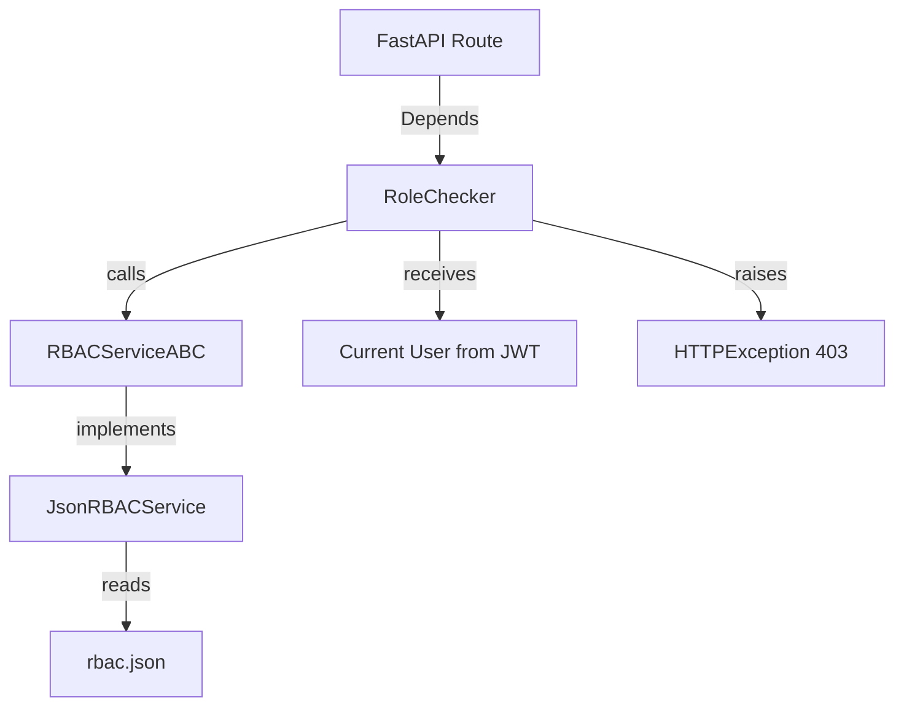

# PLAN Phase: RBAC Service Implementation

**Date:** 2026-01-04  
**Status:** Draft - Awaiting User Approval  
**Iteration:** 2026-01-04-rbac-implementation

## Phase 1: Context Analysis

### Documentation Review

- **Product Scope**: No explicit RBAC requirement in user stories, but authorization is a cross-cutting concern
- **Architecture**:
  - Protocol-based type system documented in [ADR-006](file:///home/nicola/dev/backcast_evs/docs/02-architecture/decisions/ADR-006-protocol-based-type-system.md)
  - Command pattern established in EVCS Core
  - Quality standards defined in architecture docs
- **Project Plan**: Recent iterations show strong focus on testing (80%+ coverage), type safety (MyPy strict), and maintainability

### Codebase Analysis

**Existing Auth Infrastructure:**

- [auth.py dependencies](file:///home/nicola/dev/backcast_evs/backend/app/api/dependencies/auth.py): JWT-based authentication with `get_current_user` and `get_current_active_user`
- [security.py](file:///home/nicola/dev/backcast_evs/backend/app/core/security.py): Password hashing and JWT token management
- [User model](file:///home/nicola/dev/backcast_evs/backend/app/models/domain/user.py): Has `role` field (String) but no authorization logic

**Current Authorization Gap:**

- User model has `role` field but no enforcement mechanism
- Routes have no role-based access control
- No permission system exists
- Manual role checks would need to be repeated across routes

---

## Phase 2: Problem Definition

### 1. Problem Statement

The application currently lacks a systematic authorization mechanism. While authentication is implemented via JWT tokens, there's no way to:

- Restrict routes based on user roles
- Define fine-grained permissions
- Enforce access control declaratively at the route level

**Why it's important:**

- Security: Unauthorized users could access sensitive operations
- Maintainability: Without a centralized system, authorization logic would be scattered
- Scalability: Hard to add new roles/permissions without repeating code

**Business value:**

- Enable role-based user management (admin, manager, viewer)
- Lay foundation for multi-tenant authorization if needed
- Reduce security risk through centralized, testable authorization

### 2. Success Criteria (Measurable)

**Functional Criteria:**

- ✅ Create RBAC service with role and permission checking
- ✅ Declarative route authorization via dependency injection
- ✅ JSON configuration for roles and permissions
- ✅ Support for role-only, permission-only, and combined checks

**Technical Criteria:**

- ✅ MyPy strict mode passes
- ✅ Test coverage ≥ 80% for RBAC components
- ✅ Pytest passes for all tests
- ✅ Proper HTTP 403 responses for unauthorized access

**Design Criteria:**

- ✅ Abstract interface to allow database-backed implementation later
- ✅ Type-safe with proper Protocol compliance
- ✅ Follows existing project patterns (dependency injection, type hints)

### 3. Scope Definition

**In Scope:**

- `RBACServiceABC` abstract base class
- `JsonRBACService` implementation
- `RoleChecker` FastAPI dependency
- `backend/config/rbac.json` configuration file
- Unit tests for RBAC service
- Integration tests for `RoleChecker`
- ADR-007 documentation

**Out of Scope:**

- Database-backed RBAC (future iteration)
- Applying RBAC to existing routes (separate iteration)
- UI for role management
- Row-level security / data isolation
- OAuth scopes integration

---

## Phase 3: Implementation Options

| Aspect                   | Option A: Abstract + JSON (Recommended)                    | Option B: JSON-Only             | Option C: Decorator-Based            |
| ------------------------ | ---------------------------------------------------------- | ------------------------------- | ------------------------------------ |
| **Approach Summary**     | Abstract `RBACServiceABC` + JSON impl + FastAPI dependency | Direct JSON reading in routes   | Python decorators for routes         |
| **Design Patterns**      | Dependency Injection, Abstract Factory, Strategy           | Direct implementation           | Decorator pattern                    |
| **Pros**                 | Extensible, testable, type-safe, follows project patterns  | Simpler, faster to implement    | Pythonic, familiar to FastAPI users  |
| **Cons**                 | More upfront code                                          | Hard to extend, tightly coupled | Hard to test, no runtime flexibility |
| **Test Strategy Impact** | Easy mocking via ABC                                       | Requires file I/O mocks         | Difficult to isolate                 |
| **Risk Level**           | Low                                                        | Medium (tech debt)              | Medium (testing complexity)          |
| **Estimated Complexity** | Moderate                                                   | Simple                          | Simple                               |

### Recommendation

**Option A (Abstract + JSON)** is recommended because:

1. **Alignment with codebase**: Project uses abstract protocols extensively (VersionableProtocol, BranchableProtocol)
2. **Extensibility**: Easy to add database-backed implementation later without changing route code
3. **Testability**: Can inject mock RBAC service in tests
4. **Type safety**: Full MyPy compliance with abstract contracts
5. **Maintainability**: Clear separation of concerns

> [!IMPORTANT] > **Human Decision Point**: Please review and approve Option A before proceeding to implementation.

---

## Phase 4: Technical Design

### Architecture Overview



### Component Breakdown

#### 1. RBACServiceABC (Abstract Interface)

```python
from abc import ABC, abstractmethod
from typing import Protocol

class RBACServiceABC(ABC):
    @abstractmethod
    def has_role(self, user_role: str, required_roles: list[str]) -> bool:
        """Check if user's role is in required roles."""
        pass

    @abstractmethod
    def has_permission(self, user_role: str, required_permission: str) -> bool:
        """Check if user's role has required permission."""
        pass

    @abstractmethod
    def get_user_permissions(self, user_role: str) -> list[str]:
        """Get all permissions for a role."""
        pass
```

#### 2. JsonRBACService (JSON Implementation)

- Loads configuration from `backend/config/rbac.json`
- Caches configuration in memory (reload on file change in dev)
- Implements all ABC methods

#### 3. RoleChecker (FastAPI Dependency)

```python
class RoleChecker:
    def __init__(
        self,
        allowed_roles: list[str] | None = None,
        required_permission: str | None = None
    ):
        self.allowed_roles = allowed_roles
        self.required_permission = required_permission

    async def __call__(
        self,
        current_user: User = Depends(get_current_user),
        rbac_service: RBACServiceABC = Depends(get_rbac_service)
    ) -> User:
        # Check role OR permission (combined logic)
        if self.allowed_roles and rbac_service.has_role(...):
            return current_user
        if self.required_permission and rbac_service.has_permission(...):
            return current_user
        raise HTTPException(status_code=403, detail="Insufficient permissions")
```

#### 4. JSON Configuration Format

```json
{
  "roles": {
    "admin": {
      "permissions": ["create", "read", "update", "delete", "manage_users"]
    },
    "manager": {
      "permissions": ["create", "read", "update"]
    },
    "viewer": {
      "permissions": ["read"]
    }
  }
}
```

---

### TDD Test Blueprint

```
Unit Tests (backend/tests/core/test_rbac.py)
├── test_json_rbac_service_has_role
│   ├── Happy: User role in allowed roles
│   ├── Edge: Empty allowed roles
│   └── Error: Invalid role name
├── test_json_rbac_service_has_permission
│   ├── Happy: Role has permission
│   ├── Edge: Role with no permissions
│   └── Error: Unknown role
├── test_json_rbac_service_get_user_permissions
│   ├── Happy: Return all permissions
│   └── Edge: Unknown role returns empty
└── test_json_rbac_service_file_loading
    ├── Happy: Valid JSON loads
    └── Error: Invalid JSON raises

Integration Tests (backend/tests/api/test_role_checker.py)
├── test_role_checker_with_allowed_role
│   ├── Happy: Admin accesses admin route
│   └── Error: Viewer tries admin route → 403
├── test_role_checker_with_permission
│   ├── Happy: User with 'delete' permission
│   └── Error: User without 'delete' permission → 403
└── test_role_checker_combined
    ├── Happy: Admin OR delete permission
    └── Edge: Neither role nor permission → 403
```

### First 5 Test Cases (Simplest → Complex)

1. **test_has_role_direct_match**: User role "admin" in ["admin", "manager"] → True
2. **test_has_role_no_match**: User role "viewer" in ["admin"] → False
3. **test_has_permission_direct**: Role "admin" has "delete" permission → True
4. **test_get_user_permissions**: Role "admin" returns ["create", "read", "update", "delete", "manage_users"]
5. **test_role_checker_integration_403**: Mock user with role "viewer" accessing admin-only route → HTTP 403

---

### Implementation Strategy

1. **Create abstract interface** (`rbac.py`)
2. **Implement JSON service** with file loading
3. **Add global singleton** `get_rbac_service()`
4. **Create RoleChecker** in `auth.py` dependencies
5. **Write unit tests** for service methods
6. **Write integration tests** for RoleChecker with mock routes
7. **Create JSON config** with initial roles

---

## Phase 5: Risk Assessment

| Risk Type   | Description                                            | Probability | Impact | Mitigation Strategy                                    |
| ----------- | ------------------------------------------------------ | ----------- | ------ | ------------------------------------------------------ |
| Technical   | JSON file I/O could fail at runtime                    | Low         | Medium | Add proper error handling, fallback to deny-all policy |
| Integration | Circular import with auth dependencies                 | Low         | Low    | Use TYPE_CHECKING pattern consistently                 |
| Testing     | Mocking FastAPI dependencies complex                   | Medium      | Low    | Use pytest fixtures with dependency overrides          |
| Security    | Incorrectly configured JSON allows unauthorized access | Medium      | High   | Default-deny logic, comprehensive tests, code review   |
| Performance | Loading JSON on every request                          | Low         | Low    | Cache configuration in memory, reload only on change   |

---

## Phase 6: Effort Estimation

### Time Breakdown

- **Development:** 3-4 hours
  - Core RBAC service: 1.5 hours
  - RoleChecker dependency: 1 hour
  - JSON configuration: 0.5 hours
- **Testing:** 2-3 hours
  - Unit tests: 1.5 hours
  - Integration tests: 1.5 hours
- **Documentation:** 1 hour
  - ADR-007: 0.5 hours
  - README updates: 0.5 hours
- **Review & Verification:** 0.5 hours

**Total Estimated Effort:** 1 day

### Prerequisites

- None (all dependencies already in place)

### Documentation Updates

- Create [ADR-007: RBAC Service Design](file:///home/nicola/dev/backcast_evs/docs/02-architecture/decisions/ADR-007-rbac-service.md)
- Update backend README with RBAC usage examples

---

## Verification Plan

### Automated Tests

#### Unit Tests

```bash
# Run RBAC service tests
cd /home/nicola/dev/backcast_evs/backend
pytest tests/core/test_rbac.py -v --cov=app/core/rbac --cov-report=term-missing
```

**Expected:**

- All tests pass
- Coverage ≥ 80% for `app/core/rbac.py`

#### Integration Tests

```bash
# Run RoleChecker integration tests
pytest tests/api/test_role_checker.py -v
```

**Expected:**

- All tests pass
- HTTP 403 responses for unauthorized access
- HTTP 200 for authorized access

#### Full Test Suite

```bash
# Run all tests to ensure no regressions
pytest tests/ -v
```

**Expected:**

- No existing tests break
- All new tests pass

### Type Safety

```bash
# MyPy strict mode
mypy backend/app/core/rbac.py
mypy backend/app/api/dependencies/auth.py
```

**Expected:**

- No type errors

### Code Quality

```bash
# Ruff linting
ruff check backend/app/core/rbac.py
ruff check backend/app/api/dependencies/auth.py
```

**Expected:**

- No linting errors

### Manual Verification (Optional)

If user wants to manually test:

1. Start the backend: `cd backend && uvicorn app.main:app --reload`
2. Use the API docs at `http://localhost:8000/docs`
3. Register a test user
4. Login to get JWT token
5. Try accessing a protected route with insufficient permissions → Should get 403

---

## Related Architecture Decisions

- [ADR-006: Protocol-based Type System](file:///home/nicola/dev/backcast_evs/docs/02-architecture/decisions/ADR-006-protocol-based-type-system.md)
- [ADR-001: FastAPI + SQLAlchemy 2.0](file:///home/nicola/dev/backcast_evs/docs/02-architecture/decisions/ADR-001-backend-stack.md) (assumed)

---

## Approval

- **Prepared by:** Antigravity AI
- **Reviewed by:** [Pending]
- **Approved:** ❌
- **Date Approved:** [Pending]
