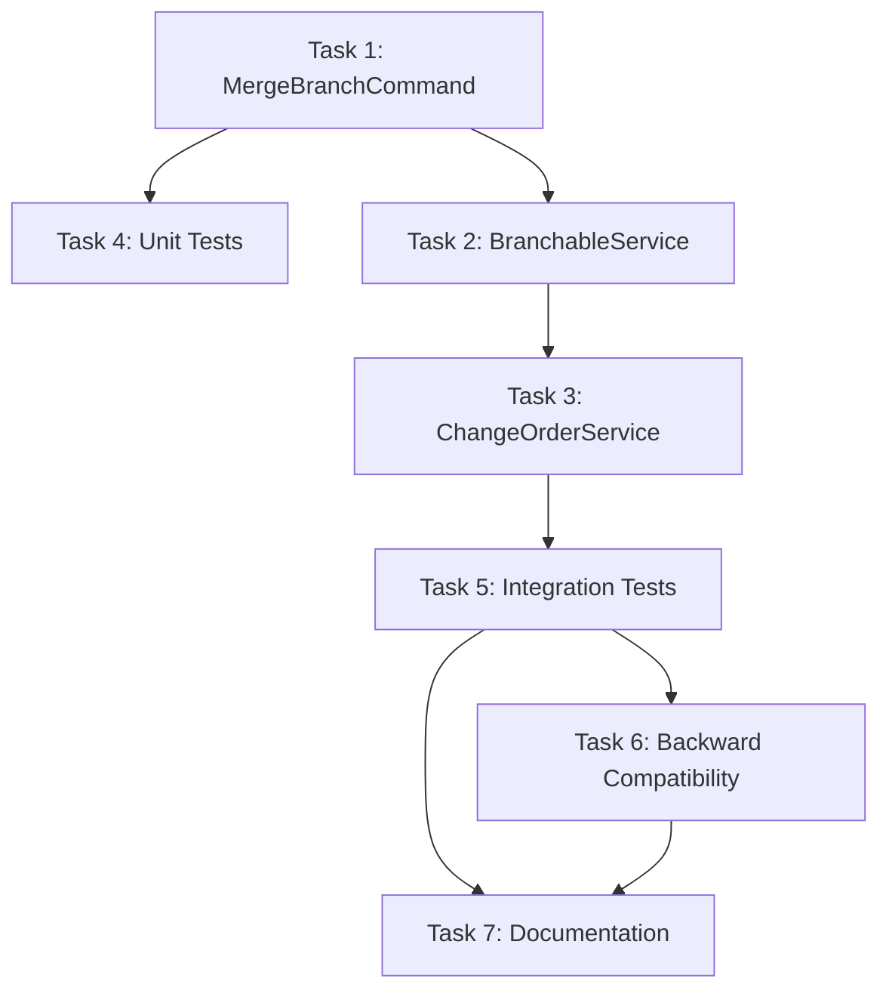

# PLAN: Add control_date Parameter to Merge Functionality

**Iteration:** 2026-01-28-merge-temporal-consistency
**Date:** 2026-01-28
**Status:** PLAN READY FOR APPROVAL
**Planner:** PDCA Planner Agent
**Based On:** ANALYSIS.md (2026-01-28)

---

## Executive Summary

**Plan Overview:** Add optional `control_date` parameter to merge functionality to enable deterministic testing and better temporal control of merge operations.

**Solution Strategy:** Implement Option 2 from analysis - enhance `MergeBranchCommand` and related service methods with an optional `control_date` parameter that defaults to `datetime.now(UTC)` for backward compatibility.

**Expected Outcome:**
- Tests can explicitly control when merge happens in valid time
- Backward compatible (existing code works without changes)
- Better testing infrastructure for temporal scenarios
- Clear separation between production and test behavior

---

## Objectives

### Primary Objectives

1. **Add Temporal Control to Merge** (MUST)
   - Add optional `control_date` parameter to `MergeBranchCommand.__init__`
   - Update `execute()` to use `self.control_date` instead of hardcoded `datetime.now(UTC)`
   - Maintain backward compatibility with default `datetime.now(UTC)`

2. **Update Service Layer** (MUST)
   - Add `control_date` parameter to `BranchableService.merge_branch()`
   - Add `control_date` parameter to `ChangeOrderService.merge_change_order()`
   - Pass `control_date` through call chain correctly

3. **Enable Deterministic Testing** (MUST)
   - Tests can specify exact merge timestamp
   - Merge temporal position becomes predictable
   - No reliance on wall-clock time in tests

### Secondary Objectives

4. **Maintain Code Quality** (MUST)
   - Pass mypy strict mode (zero errors)
   - Pass ruff linting (zero errors)
   - Maintain test coverage ≥80%

5. **Document Temporal Control** (SHOULD)
   - Add docstrings for `control_date` parameter
   - Provide usage examples in comments
   - Document temporal control patterns

---

## Scope & Success Criteria

### Success Criteria

**Functional Criteria:**

- [ ] `MergeBranchCommand` accepts optional `control_date` parameter VERIFIED BY: Unit tests
- [ ] Default behavior unchanged when `control_date=None` VERIFIED BY: Integration tests
- [ ] Merge uses `control_date` for `valid_time.lower` when provided VERIFIED BY: Test assertions
- [ ] Backward compatibility maintained VERIFIED BY: Existing tests still pass

**Technical Criteria:**

- [ ] Type safety: mypy strict mode (zero errors) VERIFIED BY: CI pipeline
- [ ] Code quality: ruff check (zero errors) VERIFIED BY: CI pipeline
- [ ] Test coverage: ≥80% for merge logic VERIFIED BY: Coverage report

**TDD Criteria:**

- [ ] Tests written before implementation (RED phase)
- [ ] Each test failed first documented in DO phase
- [ ] Tests follow Arrange-Act-Assert pattern
- [ ] All tests pass after implementation (GREEN phase)

### Scope Boundaries

**In Scope:**
- `MergeBranchCommand` class in `app/core/branching/commands.py`
- `BranchableService.merge_branch()` in `app/core/branching/service.py`
- `ChangeOrderService.merge_change_order()` in `app/services/change_order_service.py`
- Test updates to use `control_date` parameter
- Documentation updates (docstrings, comments)

**Out of Scope:**
- Fixing test assertions (that's Option 1)
- Fixing workflow validation issues
- Frontend changes
- Database migrations
- Other command classes (RevertCommand, etc.)

---

## Work Decomposition

### Task Breakdown

| #   | Task                                              | Files                                                    | Dependencies | Success Criteria                                                                 | Complexity |
| --- | ------------------------------------------------- | -------------------------------------------------------- | ------------ | ------------------------------------------------------------------------------- | ---------- |
| 1   | Add control_date to MergeBranchCommand            | `app/core/branching/commands.py` (lines 286-368)         | None         | Unit tests pass, mypy clean, parameter documented                              | Medium     |
| 2   | Update BranchableService.merge_branch()           | `app/core/branching/service.py` (lines 276-287)          | Task 1       | Integration tests pass, parameter passes through correctly                      | Low        |
| 3   | Update ChangeOrderService.merge_change_order()    | `app/services/change_order_service.py` (lines 570-694)   | Task 2       | Integration tests pass, all entity merges use control_date                     | Medium     |
| 4   | Add unit tests for control_date parameter         | `tests/unit/test_merge_branch_command.py` (new file)     | Task 1       | Tests cover happy path, None case, explicit date, edge cases                   | Medium     |
| 5   | Update integration tests to use control_date      | `tests/integration/test_change_order_workflow_full_temporal.py` | Task 3       | Tests use explicit control_date, deterministic behavior verified               | High       |
| 6   | Verify backward compatibility                      | All existing tests                                       | Task 5       | All existing tests pass without code changes                                   | High       |
| 7   | Update documentation                               | All modified files, `docs/02-architecture/cross-cutting/temporal-query-reference.md` | Task 6       | Docstrings complete, usage examples provided, temporal patterns documented     | Low        |

### Task Ordering

**Sequential Flow:**
1. Task 1 (Core implementation) → Foundation for all other work
2. Task 4 (Unit tests) → Verify Task 1 in isolation
3. Task 2 (Service layer) → Expose control_date to services
4. Task 3 (Change order service) → Use control_date in orchestrations
5. Task 5 (Integration tests) → Verify end-to-end behavior
6. Task 6 (Backward compatibility) → Ensure no regressions
7. Task 7 (Documentation) → Document changes

**Parallel Opportunities:**
- Tasks 4 and 2 can run in parallel after Task 1
- Tasks 6 and 7 can run in parallel after Task 5

---

## Test Specification

### Test Hierarchy

```
├── Unit Tests (tests/unit/test_merge_branch_command.py)
│   ├── Happy path with explicit control_date
│   ├── Default behavior (control_date=None)
│   ├── Edge cases (past dates, future dates, UTC boundaries)
│   └── Error handling (invalid dates, timezone issues)
├── Integration Tests (tests/integration/test_change_order_workflow_full_temporal.py)
│   ├── Merge with explicit control_date
│   ├── Temporal consistency verification
│   └── Deterministic behavior verification
└── Regression Tests (existing test suite)
    └── All existing tests pass without changes
```

### Test Cases

| Test ID | Test Name                                              | Criterion | Type    | Expected Behavior                                                                 |
| ------- | ------------------------------------------------------ | --------- | ------- | --------------------------------------------------------------------------------- |
| T-001   | `test_merge_branch_with_explicit_control_date`         | AC-1      | Unit    | Merge uses provided control_date for valid_time.lower                            |
| T-002   | `test_merge_branch_with_control_date_none`             | AC-1      | Unit    | Merge uses datetime.now(UTC) when control_date=None                              |
| T-003   | `test_merge_branch_control_date_in_past`               | AC-1      | Unit    | Merge successfully uses past timestamp                                           |
| T-004   | `test_merge_branch_control_date_utc_aware`             | AC-1      | Unit    | Merge requires timezone-aware datetime (raises ValueError if naive)               |
| T-005   | `test_integration_deterministic_merge_with_control_date` | AC-3      | Integration | Tests can control merge timestamp explicitly, queries return merged state at control_date |
| T-006   | `test_backward_compatibility_merge_without_control_date` | AC-1      | Integration | Existing merge behavior unchanged when parameter not provided                    |

### Test-to-Requirement Traceability

| Acceptance Criterion                        | Test ID | Test File                                      | Expected Behavior                                                               |
| ------------------------------------------- | ------- | ---------------------------------------------- | ------------------------------------------------------------------------------- |
| control_date parameter accepted             | T-001   | tests/unit/test_merge_branch_command.py        | MergeBranchCommand.__init__ accepts control_date parameter                       |
| Default behavior unchanged                  | T-002, T-006 | tests/unit/test_merge_branch_command.py, tests/integration/ | When control_date=None, uses datetime.now(UTC)                                |
| Merge uses control_date for valid_time.lower | T-001, T-003, T-005 | Multiple files                          | Merged version valid_time starts at control_date                                |
| Backward compatibility maintained           | T-006   | tests/integration/test_change_order_workflow_full_temporal.py | All existing tests pass without modifications                                   |

### Test Infrastructure Needs

**Fixtures needed:**
- `session` - AsyncSession from existing conftest
- `admin_user` - Existing user fixture
- `sample_project` - Existing project fixture
- `sample_wbe` - Existing WBE fixture
- `freeze_time` - Freezegun for testing time-dependent logic

**New fixtures:**
- `fixed_control_date` - Returns deterministic datetime (e.g., datetime(2026, 1, 15, 12, 0, 0, tzinfo=UTC))

**Mocks/stubs:**
- Mock `datetime.now(UTC)` in unit tests to verify default behavior

---

## Implementation Strategy

### Phase 1: Core Implementation (TDD Approach)

**Step 1: Write Failing Tests (RED)**
- Create `tests/unit/test_merge_branch_command.py`
- Write T-001 through T-004 as failing tests
- Run pytest to verify all fail (expected)

**Step 2: Implement MergeBranchCommand Changes (GREEN)**
- Add `control_date: datetime | None = None` parameter to `__init__`
- Store `self.control_date = control_date or datetime.now(UTC)`
- Replace `merge_timestamp = datetime.now(UTC)` with `merge_timestamp = self.control_date`
- Run unit tests until all pass

**Step 3: Refactor (REFACTOR)**
- Extract timestamp generation to private method if needed
- Add inline comments explaining temporal control
- Ensure type hints are correct

### Phase 2: Service Layer Integration

**Step 1: Update BranchableService**
- Add `control_date: datetime | None = None` to `merge_branch()` signature
- Pass `control_date` to `MergeBranchCommand` constructor
- Update docstring with parameter description

**Step 2: Update ChangeOrderService**
- Add `control_date: datetime | None = None` to `merge_change_order()` signature
- Pass `control_date` to all `merge_branch()` calls (Cost Elements, Change Order)
- Ensure consistent timestamp across all entity merges

**Step 3: Verify Integration**
- Run integration tests
- Check that merge uses same timestamp for all entities
- Verify temporal consistency across merged versions

### Phase 3: Test Updates

**Step 1: Update Failing Tests to Use control_date**
- In `test_merge_with_cost_registrations_and_progress`:
  - Add explicit `control_date` parameter to merge calls
  - Update assertions to use same `control_date` for queries
- In `test_merge_temporal_consistency`:
  - Use explicit `control_date` instead of relying on `now`
  - Query with `as_of=control_date` to verify merged state

**Step 2: Add Deterministic Test Cases**
- Create test that merges at specific date (e.g., 2026-01-15)
- Query state as of that date
- Verify merged state visible at control_date
- Query state before control_date
- Verify pre-merge state visible before control_date

**Step 3: Verify Backward Compatibility**
- Run all existing tests without modifications
- Ensure no breaking changes
- Verify default behavior unchanged

### Phase 4: Documentation

**Step 1: Update Docstrings**
- `MergeBranchCommand.__init__`: Document control_date parameter, default behavior
- `MergeBranchCommand.execute`: Mention control_date in temporal logic explanation
- `BranchableService.merge_branch`: Document parameter propagation
- `ChangeOrderService.merge_change_order`: Document temporal control usage

**Step 2: Add Usage Examples**
```python
# Example: Merge with explicit control date
merged = await service.merge_branch(
    root_id=entity_id,
    actor_id=user_id,
    source_branch="co-123",
    target_branch="main",
    control_date=datetime(2026, 1, 15, 12, 0, 0, tzinfo=UTC),
)

# Example: Merge with default behavior (now)
merged = await service.merge_branch(
    root_id=entity_id,
    actor_id=user_id,
    source_branch="co-123",
    target_branch="main",
)
```

**Step 3: Update Temporal Query Reference**
- Add section on "Temporal Control in Operations"
- Document control_date pattern for other commands (future work)
- Explain testing best practices with control dates

---

## Risk Assessment

| Risk Type   | Description                                                 | Probability | Impact  | Severity | Mitigation                                                                                               |
| ----------- | ----------------------------------------------------------- | ----------- | ------- | -------- | -------------------------------------------------------------------------------------------------------- |
| Technical   | Breaking changes to existing API                            | Low         | High    | Medium   | Make control_date optional with default; verify with all existing tests                                |
| Technical   | Type safety issues (mypy errors)                            | Medium      | Medium  | Medium   | Use proper type hints (datetime \| None); run mypy frequently during development                       |
| Integration | Tests fail after implementation                             | Medium      | High    | High     | Use TDD approach; write tests first; verify each task before moving to next                            |
| Integration | Backward compatibility issues                               | Low         | High    | Medium   | Run full test suite after each task; ensure existing tests pass without modifications                   |
| Integration | Temporal confusion (wrong timezone, naive datetime)         | Medium      | Medium  | Medium   | Add validation for timezone-aware datetimes; document UTC requirement clearly                          |
| Quality     | Test coverage drops below 80%                               | Low         | Medium  | Low      | Add unit tests for new functionality; verify coverage after implementation                              |
| Quality     | Documentation incomplete or unclear                         | Medium      | Low     | Low      | Allocate dedicated time for documentation; include usage examples                                       |

### Risk Mitigation Strategy

**High Severity Risks:**
1. **Tests fail after implementation** (HIGH)
   - Mitigation: TDD approach, write failing tests first
   - Contingency: Rollback changes, investigate failure, re-implement

**Medium Severity Risks:**
1. **Type safety issues** (MEDIUM)
   - Mitigation: Run mypy after each code change
   - Contingency: Fix type hints immediately, document any mypy limitations

2. **Breaking changes to API** (MEDIUM)
   - Mitigation: Optional parameter with default
   - Contingency: Add compatibility layer if needed

3. **Temporal confusion** (MEDIUM)
   - Mitigation: Validate timezone-aware datetimes, clear documentation
   - Contingency: Add runtime validation with helpful error messages

---

## Dependencies

### Technical Prerequisites

- [x] Python 3.12+ installed
- [x] PostgreSQL 15+ running via docker-compose
- [x] Virtual environment activated (`.venv`)
- [x] Database migrations applied (`alembic upgrade head`)
- [x] Test fixtures available (conftest.py)

### Documentation Prerequisites

- [x] Analysis phase complete (ANALYSIS.md approved)
- [x] Option 2 approved for implementation
- [x] Architecture docs reviewed (ADR-005, EVCS Core)
- [x] Backend coding standards reviewed

### Task Dependencies



**Critical Path:** Task 1 → Task 2 → Task 3 → Task 5 → Task 6

**Parallel Tasks:**
- Task 4 can run parallel to Task 2 (after Task 1)
- Task 7 can start as soon as Task 5 and 6 are complete

---

## Documentation References

### Required Reading

**Architecture & Standards:**
- Backend Coding Standards: `docs/02-architecture/backend/coding-standards.md`
- ADR-005: Bitemporal Versioning: `docs/02-architecture/decisions/ADR-005-bitemporal-versioning.md`
- ADR-003: Command Pattern: `docs/02-architecture/decisions/ADR-003-command-pattern.md`

**Temporal Reference:**
- Temporal Query Reference: `docs/02-architecture/cross-cutting/temporal-query-reference.md`
- EVCS Implementation Guide: `docs/02-architecture/backend/contexts/evcs-core/evcs-implementation-guide.md`

**Analysis Report:**
- ANALYSIS.md: `docs/03-project-plan/iterations/2026-01-28-merge-temporal-consistency/ANALYSIS.md`
- Option 2 Section: Lines 245-283

### Code References

**Similar Implementation Pattern:**
- `UpdateVersionCommand` has `control_date` parameter: `app/core/versioning/commands.py` (lines 102-145)
- Pattern to follow: Optional parameter with default to `datetime.now(UTC)`

**Test Pattern:**
- Example of control_date usage in tests: `tests/integration/test_change_order_workflow_full_temporal.py` (line 247)

**Type Hint Pattern:**
- Use `datetime | None` for optional parameter (Python 3.10+ syntax)
- Always use timezone-aware datetimes: `datetime(2026, 1, 15, tzinfo=UTC)`

---

## Prerequisites

### Technical

- [x] Analysis phase approved
- [x] Database migrations applied
- [x] Dependencies installed (`uv sync`)
- [x] Environment configured (docker-compose up)
- [x] Test environment available

### Documentation

- [x] Analysis report reviewed
- [x] Architecture docs understood (ADR-005, EVCS Core)
- [x] Temporal query semantics understood
- [x] Command pattern understood (ADR-003)

---

## Quality Gates

### Entry Criteria (Before Starting)

- [x] Analysis phase complete and approved
- [x] Option 2 selected for implementation
- [x] Team understands temporal control requirements
- [x] Test environment available and working
- [x] All dependencies installed

### Exit Criteria (After Completion)

- [ ] All unit tests pass (T-001 through T-004)
- [ ] All integration tests pass (T-005, T-006)
- [ ] Backward compatibility verified (all existing tests pass)
- [ ] Code passes mypy strict mode (zero errors)
- [ ] Code passes ruff linting (zero errors)
- [ ] Test coverage ≥80%
- [ ] Documentation complete (docstrings, examples)
- [ ] Code reviewed and approved

### Checkpoints

**After Task 1:**
- [ ] Unit tests written and failing (RED)
- [ ] MergeBranchCommand implementation complete
- [ ] Unit tests passing (GREEN)
- [ ] mypy and ruff clean

**After Task 3:**
- [ ] All service layer changes complete
- [ ] Integration tests passing
- [ ] Type safety verified

**After Task 6:**
- [ ] All tests passing (new + existing)
- [ ] Backward compatibility verified
- [ ] Coverage threshold met

---

## Success Metrics

### Primary Metrics

1. **Test Pass Rate:** 100%
   - All new unit tests pass (4/4)
   - All new integration tests pass (2/2)
   - All existing tests pass (no regressions)

2. **Code Quality:** Zero defects
   - mypy strict mode: 0 errors
   - ruff linting: 0 errors
   - Test coverage: ≥80%

3. **Functional Correctness:** Deterministic behavior
   - Merge respects explicit control_date
   - Default behavior unchanged
   - Temporal consistency maintained

### Secondary Metrics

1. **Documentation Completeness:** 100%
   - All modified methods have docstrings
   - Usage examples provided
   - Temporal patterns documented

2. **Maintainability:** High
   - Clear type hints
   - Self-documenting code
   - Comments explain temporal logic

3. **Performance:** No regression
   - Merge operation time: <200ms (baseline)
   - No additional database queries
   - No memory leaks

---

## Timeline

### Sprint Schedule

**Day 1 (Morning):**
- Task 1: Implement MergeBranchCommand (2 hours)
  - Write failing tests (30 min)
  - Implement changes (1 hour)
  - Verify and refactor (30 min)

**Day 1 (Afternoon):**
- Task 4: Unit tests for control_date parameter (1 hour)
  - Write remaining unit tests
  - Verify all edge cases
- Task 2: Update BranchableService (30 min)
  - Add parameter to merge_branch()
  - Update docstring

**Day 2 (Morning):**
- Task 3: Update ChangeOrderService (1.5 hours)
  - Add parameter to merge_change_order()
  - Pass through to entity merges
  - Test integration

**Day 2 (Afternoon):**
- Task 5: Update integration tests (2 hours)
  - Modify failing tests to use control_date
  - Add deterministic test cases
  - Verify temporal consistency

**Day 3 (Morning):**
- Task 6: Verify backward compatibility (1 hour)
  - Run full test suite
  - Check for regressions
  - Fix any issues

**Day 3 (Afternoon):**
- Task 7: Documentation (1 hour)
  - Update docstrings
  - Add usage examples
  - Update temporal query reference
- Buffer time (1 hour)
  - Unforeseen issues
  - Additional testing
  - Code review preparation

**Total Estimated Time:** 8-10 hours

### Milestones

- ✅ **Milestone 0:** Analysis complete (DONE)
- ⏳ **Milestone 1:** Core implementation complete (Task 1, 4)
- ⏳ **Milestone 2:** Service layer complete (Task 2, 3)
- ⏳ **Milestone 3:** Tests passing (Task 5, 6)
- ⏳ **Milestone 4:** Documentation complete (Task 7)
- ⏳ **Milestone 5:** Code review approved

---

## Resources

### Team Allocation

- **Backend Developer:** 1 person (8-10 hours)
  - Core implementation (Tasks 1-3)
  - Testing (Tasks 4-6)
  - Documentation (Task 7)

- **Code Reviewer:** 0.5 person (2 hours)
  - Review implementation
  - Verify temporal semantics
  - Approve changes

### Tools and Environment

- **Python:** 3.12+ with uv package manager
- **Database:** PostgreSQL 15+ (docker-compose)
- **Testing:** pytest with pytest-asyncio
- **Code Quality:** mypy, ruff
- **IDE:** VS Code or PyCharm with Python support
- **Version Control:** Git (branch: `E05-U01-register-actual-costs-against-cost-elements`)

### External Dependencies

- None (all dependencies are internal)

---

## Contingency Plans

### If Tests Fail After Implementation

**Scenario:** Unit tests pass but integration tests fail

**Actions:**
1. Run debug script to verify merge behavior with explicit control_date
2. Check if control_date is being passed correctly through call chain
3. Verify temporal queries using control_date are correct
4. Check for timezone issues (naive vs aware datetimes)

**Escalation:**
- If issue is in implementation: Fix code, re-run tests
- If issue is in test design: Update test assertions (coordinate with Option 1 work)

### If Backward Compatibility Breaks

**Scenario:** Existing tests fail without modifications

**Actions:**
1. Verify default value is working (control_date=None)
2. Check that `datetime.now(UTC)` is being called correctly
3. Look for any API signature changes
4. Check if any code path doesn't handle None parameter

**Escalation:**
- If bug in implementation: Fix default value handling
- If design issue: Revert to Option 1 approach

### If Type Safety Issues Arise

**Scenario:** mypy reports errors with new type hints

**Actions:**
1. Check if all datetime parameters are timezone-aware
2. Verify Union type (datetime \| None) is correct
3. Check for any implicit Any types
4. Add explicit type hints where needed

**Escalation:**
- If mypy limitation: Add type: ignore comment with justification
- If actual type error: Fix type hints

### If Timeline Slips

**Scenario:** Implementation takes longer than estimated

**Actions:**
1. Prioritize critical path (Tasks 1, 2, 3, 5)
2. Defer documentation (Task 7) if necessary
3. Reduce scope (skip edge case tests, add later)
4. Request additional time or resources

**Escalation:**
- If >4 hours over estimate: Re-evaluate approach
- If >1 day over estimate: Consider switching to Option 1

---

## Task Dependency Graph

```yaml
# Task Dependency Graph for Option 2 Implementation
tasks:
  - id: BE-001
    name: "Add control_date parameter to MergeBranchCommand"
    agent: pdca-backend-do-executor
    dependencies: []
    description: "Core implementation: Add optional control_date parameter to MergeBranchCommand.__init__, update execute() to use self.control_date instead of hardcoded datetime.now(UTC)"

  - id: BE-002
    name: "Write unit tests for control_date parameter"
    agent: pdca-backend-do-executor
    dependencies: [BE-001]
    description: "Create tests/unit/test_merge_branch_command.py with tests for explicit control_date, default behavior, past dates, and UTC awareness"

  - id: BE-003
    name: "Update BranchableService.merge_branch() method"
    agent: pdca-backend-do-executor
    dependencies: [BE-001]
    description: "Add control_date parameter to BranchableService.merge_branch(), pass through to MergeBranchCommand"

  - id: BE-004
    name: "Update ChangeOrderService.merge_change_order() method"
    agent: pdca-backend-do-executor
    dependencies: [BE-003]
    description: "Add control_date parameter to ChangeOrderService.merge_change_order(), pass to all entity merge calls"

  - id: BE-005
    name: "Update integration tests to use control_date"
    agent: pdca-backend-do-executor
    dependencies: [BE-004]
    description: "Modify failing tests in test_change_order_workflow_full_temporal.py to use explicit control_date, verify deterministic behavior"

  - id: BE-006
    name: "Verify backward compatibility"
    agent: pdca-backend-do-executor
    dependencies: [BE-005]
    description: "Run full test suite to ensure existing tests pass without modifications, verify default behavior unchanged"

  - id: BE-007
    name: "Update documentation"
    agent: pdca-backend-do-executor
    dependencies: [BE-006]
    description: "Update docstrings, add usage examples, document temporal control patterns in code and temporal query reference"

# Parallel execution opportunities:
# - BE-002 and BE-003 can run in parallel after BE-001
# - BE-007 can start as soon as BE-006 is complete
```

---

## Approval

**Prepared By:** PDCA Planner Agent
**Date:** 2026-01-28
**Status:** ✅ READY FOR DO PHASE

**Recommended Next Step:** Proceed to DO phase with Task 1 (MergeBranchCommand implementation)

**Approved By:** _________________ **Date:** _________

---

## Appendix

### A. Code Changes Specification

#### A.1 MergeBranchCommand.__init__ Changes

**Location:** `app/core/branching/commands.py` (lines 286-295)

**Current Code:**
```python
class MergeBranchCommand(BranchCommandABC[TBranchable]):
    """Merge source branch into target branch (overwrite strategy)."""

    def __init__(
        self,
        entity_class: type[TBranchable],
        root_id: UUID,
        actor_id: UUID,
        source_branch: str,
        target_branch: str = "main",
    ) -> None:
        super().__init__(entity_class, root_id, actor_id)
        self.source_branch = source_branch
        self.target_branch = target_branch
```

**Proposed Code:**
```python
class MergeBranchCommand(BranchCommandABC[TBranchable]):
    """Merge source branch into target branch (overwrite strategy)."""

    def __init__(
        self,
        entity_class: type[TBranchable],
        root_id: UUID,
        actor_id: UUID,
        source_branch: str,
        target_branch: str = "main",
        control_date: datetime | None = None,  # ✅ Add this
    ) -> None:
        super().__init__(entity_class, root_id, actor_id)
        self.source_branch = source_branch
        self.target_branch = target_branch
        self.control_date = control_date or datetime.now(UTC)  # ✅ Add this
```

#### A.2 MergeBranchCommand.execute() Changes

**Location:** `app/core/branching/commands.py` (line 339)

**Current Code:**
```python
# Generate timestamp in Python to avoid empty ranges
merge_timestamp = datetime.now(UTC)
```

**Proposed Code:**
```python
# Generate timestamp in Python to avoid empty ranges
merge_timestamp = self.control_date  # ✅ Use instance variable
```

#### A.3 BranchableService.merge_branch() Changes

**Location:** `app/core/branching/service.py` (lines 276-287)

**Current Code:**
```python
async def merge_branch(
    self, root_id: UUID, actor_id: UUID, source_branch: str, target_branch: str
) -> TBranchable:
    """Merge source branch into target branch."""
    cmd = MergeBranchCommand(
        entity_class=self.entity_class,
        root_id=root_id,
        actor_id=actor_id,
        source_branch=source_branch,
        target_branch=target_branch,
    )
    return await cmd.execute(self.session)
```

**Proposed Code:**
```python
async def merge_branch(
    self,
    root_id: UUID,
    actor_id: UUID,
    source_branch: str,
    target_branch: str,
    control_date: datetime | None = None,  # ✅ Add this
) -> TBranchable:
    """Merge source branch into target branch.

    Args:
        root_id: Root entity ID
        actor_id: User performing the merge
        source_branch: Source branch name
        target_branch: Target branch name (default: "main")
        control_date: Optional timestamp for merge operation (default: now)

    Returns:
        The merged entity version

    Raises:
        ValueError: If source or target branch not found or inactive
    """
    cmd = MergeBranchCommand(
        entity_class=self.entity_class,
        root_id=root_id,
        actor_id=actor_id,
        source_branch=source_branch,
        target_branch=target_branch,
        control_date=control_date,  # ✅ Add this
    )
    return await cmd.execute(self.session)
```

### B. Test Specification Examples

#### B.1 Unit Test: Explicit control_date

```python
@pytest.mark.asyncio
async def test_merge_branch_with_explicit_control_date(
    session: AsyncSession,
    admin_user: User,
    sample_project: Project,
):
    """Should use provided control_date for valid_time.lower."""
    # Arrange
    control_date = datetime(2026, 1, 15, 12, 0, 0, tzinfo=UTC)
    service = ProjectService(session)

    # Create initial version on main
    project = await service.create_project(
        project_in=ProjectCreate(code="TEST-001", name="Test", budget=Decimal("100000")),
        actor_id=admin_user.user_id,
        control_date=datetime(2026, 1, 10, tzinfo=UTC),
    )

    # Create branch
    await service.create_branch(
        root_id=project.project_id,
        actor_id=admin_user.user_id,
        branch="co-001",
    )

    # Modify on branch
    await service.update_project(
        root_id=project.project_id,
        project_in=ProjectUpdate(name="Modified Project"),
        actor_id=admin_user.user_id,
        branch="co-001",
    )

    # Act: Merge with explicit control_date
    merged = await service.merge_branch(
        root_id=project.project_id,
        actor_id=admin_user.user_id,
        source_branch="co-001",
        target_branch="main",
        control_date=control_date,  # ✅ Explicit control date
    )

    # Assert: Verify merged version valid_time starts at control_date
    assert merged.valid_time.lower == control_date
    assert merged.name == "Modified Project"

    # Verify state as of control_date shows merged version
    project_at_control_date = await service.get_as_of(
        entity_id=project.project_id,
        as_of=control_date,
        branch="main",
    )
    assert project_at_control_date.name == "Modified Project"
```

#### B.2 Unit Test: Default behavior

```python
@pytest.mark.asyncio
async def test_merge_branch_with_control_date_none(
    session: AsyncSession,
    admin_user: User,
    sample_project: Project,
):
    """Should use datetime.now(UTC) when control_date is None."""
    # Arrange
    before_merge = datetime.now(UTC)
    service = ProjectService(session)

    # ... setup code ...

    # Act: Merge without control_date (default behavior)
    merged = await service.merge_branch(
        root_id=project.project_id,
        actor_id=admin_user.user_id,
        source_branch="co-001",
        target_branch="main",
        # control_date not provided - should use now
    )

    after_merge = datetime.now(UTC)

    # Assert: Verify merged version valid_time starts between before/after
    assert before_merge <= merged.valid_time.lower <= after_merge
```

### C. Related Documentation

**Internal Documentation:**
- Temporal Query Reference: `docs/02-architecture/cross-cutting/temporal-query-reference.md`
- EVCS Implementation Guide: `docs/02-architecture/backend/contexts/evcs-core/evcs-implementation-guide.md`
- Backend Coding Standards: `docs/02-architecture/backend/coding-standards.md`

**Architecture Decisions:**
- ADR-003: Command Pattern
- ADR-005: Bitemporal Versioning

**Test Files:**
- `backend/tests/integration/test_change_order_workflow_full_temporal.py`
- `backend/tests/integration/TEST_RUN_GUIDE.md`

---

**END OF OPTION 2 PLAN**
