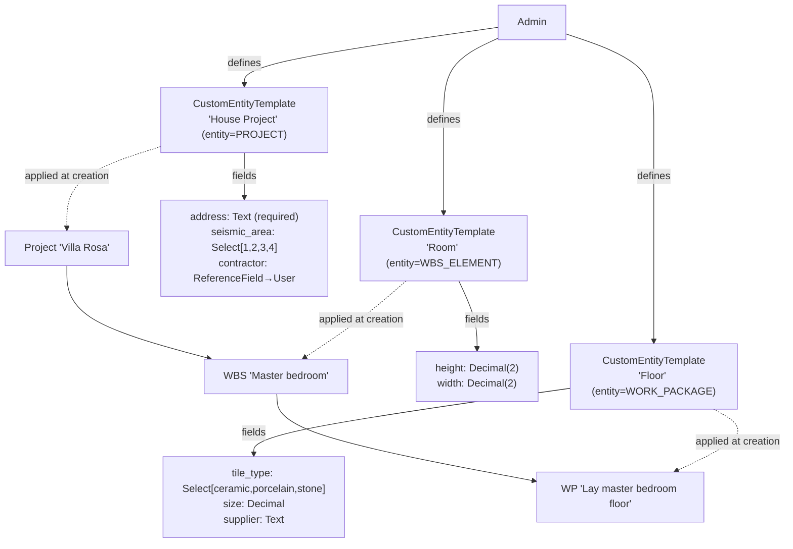
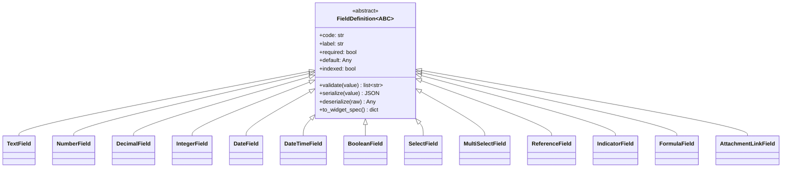

# Custom Fields — Functional Analysis

**Document status:** Decision-grade functional analysis (v2, revised against critique)
**Audience:** Tech lead, Product owner
**Author:** Architecture
**Date:** 2026-06-24

---

## 1. Executive Summary

Backcast needs admin-defined **custom fields** so the system can capture project-type-specific attributes (a house-build project's *address*, *seismic area*, *contractor*; a "room" WBS element's *height/width*; a "floor" work package's *tile type/supplier*) without a code change per customer. The decisive codebase fact is that EVCS uses **full-snapshot bitemporal versioning**: every state change clones the entire row via `VersionableMixin.clone()` (`backend/app/models/mixins.py:62-80`), which iterates `mapper.attrs` to copy all mapped columns. Persistence of that clone happens through **two distinct paths** — (A) a hand-built raw SQL INSERT that enumerates `mapper.columns` and applies a generic JSONB serialization guard (`UpdateCommand` at `backend/app/core/branching/commands.py:312-361`; `UpdateVersionCommand` at `backend/app/core/versioning/commands.py:264-374`), and (B) the ORM `session.add()` + `flush()` path, which relies on asyncpg's native JSONB codec (`CreateBranchCommand`, `MergeBranchCommand`, `RevertCommand`, `CreateVersionCommand`). This means a single **JSONB `custom_fields` column on each versioned entity table** propagates through Create/Update/Branch/Merge/Revert for free — and a dict-shaped version of this pattern is **already in production** on `ChangeOrder.custom_field_values` (`backend/app/models/domain/change_order.py:169`).

The recommended approach is: (1) an OO field-class hierarchy (`FieldDefinition` ABC + `Text/Number/Decimal/Date/Select/Reference/Formula` subclasses) owning validation/serialization; (2) a non-branching, **Versionable** `CustomEntityTemplate` registry scoped by entity type + org unit, modeled on `CostElementType`; (3) values stored as a `{code: value}` **dict** JSONB column on `Project`/`WBSElement`/`WorkPackage` version rows, validated at the service layer by the existing `CustomFieldService` (generalized); and (4) the template's `field_definitions` also stored as a **dict keyed by field code** (not a list), because the raw-INSERT JSONB guard is `isinstance(values[col], dict)` (dict-only — verified at `commands.py:352` and `versioning/commands.py:356`), so a list-typed JSONB column through the versioning path is **unproven and would fail on template Update**. **EAV is explicitly rejected** because its separate value table does not ride `clone()` and would require re-implementing versioning across 5+ commands.

The headline risks are: **(a) the AI tool layer uses hardcoded field whitelists** (the `list_projects`/`get_project` return dicts at `backend/app/ai/tools/project_tools.py:40+`/`:194+`) that silently drop custom fields today — not hypothetical, it already drops `ChangeOrder.custom_field_values`; **(b) merge-conflict detection compares values with whole-object `!=` and `str()`-ifies them** (`backend/app/core/branching/service.py:807-840`), so two branches editing *different* custom sub-fields surface as one opaque conflict; **(c) global search and filter use fixed field allowlists** (`backend/app/services/global_search_service.py:82-97` scoring, `:195` `_ENTITY_CONFIG`; `backend/app/services/project.py:295`) with **zero GIN/pg_trgm/jsonb_path_ops indexes anywhere in the codebase** (grep-confirmed across `backend/alembic/versions/` and `backend/app/models/`), so custom fields are invisible to search without new infrastructure; and **(d) write-amplification** — every version transition clones the entire JSONB blob, so any GIN index on it is rebuilt on every write. Overlap/temporal integrity is enforced **at the application layer** (`_check_overlap` at `commands.py:56-95`), not by DB exclusion constraints (none exist), so an additive JSONB column cannot conflict with temporal integrity.

---

## 2. Goals & Non-Goals

### Goals

- **Admin-defined field types and templates.** An administrator (RBAC-governed) can define a typed custom field once and group fields into a reusable **CustomEntityTemplate** scoped to an entity type (Project | WBSElement | WorkPackage).
- **Template applied at entity creation.** When a PM creates an entity, they pick a template; the template's field definitions drive the form and seed defaults.
- **Per-instance values.** Each entity instance carries its own custom-field values, versioned with the row (bitemporal fidelity, branch isolation, "as-of" reads).
- **Historical fidelity.** Reading an old version renders values against the field definition **effective at that version's creation time** (US-9) — see §6.6.
- **Queryability.** Custom fields can be filtered, sorted, and searched (with deliberate indexing for hot fields).
- **AI visibility.** The AI assistant can read, write, and discover custom fields (today it cannot — see §7.2).
- **Governance.** Field definitions are versioned separately from values, RBAC-gated, and deprecatable with a defined lifecycle (§6.7).

### Non-Goals

- **No dynamic schema/DDL per field.** Custom fields do not `ALTER TABLE` (Odoo-style). They live in JSONB. Real-column generation is explicitly out of scope.
- **No per-field / per-template-instance RBAC.** Permissions are template-level CRUD (read/create/update/delete), mirroring `CostElementType`. Field-level ACLs are a deferred non-goal (P6's experience shows the complexity rarely pays off).
- **No mobile-specific field rendering** in the first phase.
- **No replacement of the existing `ChangeOrder.custom_field_values`** in the MVP. The CO pattern is the *template* to generalize, not the thing to migrate on day one. The two definition models (project-scoped CO fields, org-scoped entity templates) **coexist** during transition (§7.9).
- **No formula/rollup engine in the MVP.** `FormulaField` is modeled as a type but is **computed on read only** (like `Project.budget`), never stored on the snapshot; a full expression engine is deferred. This also defers any coupling between custom fields and budget/cost-registration rules (§7.8).
- **No notifications on custom-field edits in the MVP.** Decided out-of-scope but stated explicitly (§7.7).

---

## 3. Requirements (Functional)

### 3.1 User Stories

| # | As a… | I want to… | So that… | Acceptance criterion |
|---|-------|-----------|----------|----------------------|
| US-1 | Admin | define a typed custom field scoped to an entity type | my organization captures consistent attributes per project type | Field persists; values of the wrong type are rejected on write |
| US-2 | Admin | group fields into a named CustomEntityTemplate with required-ness, defaults, options | PMs get the right form automatically when creating an entity | Creating an entity with the template renders exactly its fields with validation |
| US-3 | Admin | scope templates globally or to an org unit | each business unit can have its own field schema | Two BUs see different field sets; global template applies where no BU template exists |
| US-4 | PM | pick a template when creating an entity | the form renders only the relevant fields | Empty/invalid `template_id` rejected at create; selector disabled on edit |
| US-5 | PM | edit custom field values on a branch | the change is isolated and mergeable like any other field | Branch edit does not appear on `main` until merged |
| US-6 | Reviewer | see custom-field diffs in entity history | I understand what changed between versions | History endpoint returns per-version `custom_fields`; FE diffs sub-keys |
| US-7 | Analyst | filter/sort/search entities by custom field value | I can find "all projects in seismic area 2" | `?filters=seismic_area:2` returns matches sub-second at scale |
| US-8 | AI assistant | read a project's custom fields and discover a template's field manifest | it can reason about, surface, and fill custom data via chat | `get_project` returns `custom_fields`; AI can fill them via `custom_field_values` param |
| US-9 | Admin | deprecate or evolve a field definition without corrupting historical snapshots | old versions remain readable with their original values | Given field `seismic_area` is redefined from Select[1-4] to Select[1-5], a pre-redefinition Project version's value still validates against the field spec effective at that version's `valid_time.lower`, and the read-only UI renders the OLD label/options (§6.6) |

### 3.2 The House-Build Example (fully modeled)



Each template is a versioned row in `custom_entity_templates`; each entity instance binds to **one** template (D10) and stores its values in its `custom_fields` JSONB dict:

```json
// Project 'Villa Rosa' version row → custom_fields:
{"address": "Via Roma 12, Milano", "seismic_area": "2", "contractor": "<user_root_id>"}

// WBS 'Master bedroom' → custom_fields:
{"height": 2.7, "width": 4.2}

// WP 'Lay master bedroom floor' → custom_fields:
{"tile_type": "porcelain", "size": 0.6, "supplier": "Ceramica Sassuolo"}
```

### 3.3 Capabilities

- **OO field-class paradigm** (§8): each field type is a Python class owning `validate()`, `serialize()`, `deserialize()`, `to_widget_spec()`.
- **Type system:** Text, Number, Decimal, Integer, Date, DateTime, Boolean, Select, MultiSelect, ReferenceField→entity, Indicator/Enum, Formula/Computed (read-only), Attachment-link.
- **Queryability:** filter, sort, full-text search via JSONB operators + selective GIN/expression indexes.
- **AI visibility:** read tools surface values; write tools accept a `custom_fields` dict param; specialists discover the field manifest at runtime.
- **Governance:** templates are RBAC-governed, org-scoped, and evolve via new definition versions (never in-place type mutation); field lifecycle states are active/deprecated/retired (§6.7).

---

## 4. Requirements (Non-Functional)

| NFR | Requirement | Rationale / Evidence |
|-----|-------------|----------------------|
| **Versioning fidelity** | Custom-field values must be captured per-version and read correctly "as-of" any timestamp. | A mapped JSONB column on the versioned row is returned by the entity's base `select(entity_class)` (e.g. `get_as_of` at `branching/service.py:571,585,626`). `_apply_bitemporal_filter` (`:356-389`) only appends the temporal WHERE clause — it does not select columns and needs no JSONB awareness. An EAV side table would *not* ride either path (see §6.4). |
| **Branch isolation** | Editing a custom field on a change-order branch must not leak to `main` until merged. | `CreateBranchCommand` (`commands.py:132-141`) and `MergeBranchCommand` (`:434-442`) clone via `source.clone(...)` then `session.add(); flush()` (ORM/asyncpg path). `clone()` iterates `mapper.attrs`, so a mapped JSONB column is copied to the branch. |
| **Performance at scale** | List/search/filter by custom field must stay sub-second on the largest tenant. | JSONB is ~50,000× faster than EAV without indexes, ~1.3× faster with them (Coussej). Selective `jsonb_path_ops` GIN on hot fields; avoid blanket-GIN (write-amplification on every clone). **MVP default: zero custom-field indexes**; rely on seq scan until a hot field is measured (§6.4 trigger). |
| **Type-safety** | Invalid values must be rejected before persistence. | `CustomFieldService.validate_field_values` (`custom_field_service.py:11`) already does this for ChangeOrders; generalize per field class. |
| **Migration safety** | Adding custom fields must not break existing rows, branches, or history. | Columns are nullable; overlap/temporal integrity is enforced **at the app layer** (`_check_overlap` at `commands.py:56-95`), not by DB exclusion constraints (grep-confirmed: zero `ExcludeConstraint`/GIST in `backend/alembic/versions/` or `backend/app/models/`). The migration cannot interact with temporal integrity. |
| **RBAC** | Template CRUD and value read/write are permission-governed. | Follow `<entity>-<action>` convention (e.g. `custom-entity-template-create`). Reuse parent-entity permissions for value access where field-level RBAC is out of scope. |
| **Write amplification** | Indexes on `custom_fields` are rebuilt on every version write. | Prefer containment (`@>`) over path navigation; expression indexes only for hot fields; budget periodic `REINDEX CONCURRENTLY` (note: `CONCURRENTLY` cannot run inside Alembic's default transaction — see §7.6). |
| **Backward compatibility** | Existing ChangeOrder custom fields continue to work during transition. | Generalize, do not migrate, the CO path in the MVP. Two definition models coexist (§7.9). |
| **Read-path NULL safety** | Service/FE code must treat `custom_fields IS NULL` as `{}`. | Existing rows stay NULL until touched (the raw-INSERT path bypasses `server_default` — see §6.3/§7.6). Downstream dict-assuming code will `KeyError` if NULL is not normalized. |

---

## 5. ERP / Industry Research

### 5.1 How the major systems solve it

**Oracle Primavera P6 (UDFs)** — The canonical EAV split: `UDFTYPE` (one row per field *definition*: subject area + data type + scope) and `UDFVALUE` (one row per filled-in *value*, with polymorphic `fk_id` to the parent). Two flavors: **Global** UDFs (enterprise, no formula) and **Project** UDFs (project-scoped, support formulas + graphical indicators). Field types: Text, Start/Finish Date, Number, Integer, Cost, Indicator (closed enum: Red/Yellow/Green/Blue), Code (lookup). Subject area is **immutable after creation**. Security is coarse: one "edit UDFs" privilege + a Cost-view gate. `UDFVALUE` is routinely one of the largest tables in a P6 DB; Analytics caps at **100 UDFs per type × subject area** (anti-proliferation signal).

**SAP (classification)** — Large-scale EAV across `CABN` (attribute metadata), `CAWN` (allowed values), `KLAH`+`KSML` (class→characteristic), `KSSK` (object→class), `AUSP` (value table). S/4HANA Key-User tooling uses **real `ALTER TABLE` append structures** on transparent tables propagated via `E_*` CDS views (Public Cloud blocks custom fields from apps unless a released interface view exposes them — a deliberate governance chokepoint).

**MS Project** — Hybrid. Local fields occupy **fixed slots** (Text1–30, Number1–30, Flag1–20) — a capped column pool, renameable titles, no cross-project consistency. Enterprise fields are server-side with **formulas, graphical indicators, and hierarchical outline-code lookups**; heavy formula use degrades Project Server.

**Jira** — 3-table EAV (`customfield`, `customfieldoption`, `customfieldvalue` with typed generic columns). Its strongest contribution is the **3-layer separation**: Context (scope + options) / Field Configuration (required/hidden) / Screen (placement) — fully orthogonal. "Where's My Field?" exists because the combinatorics defeat humans. **No field-bundle/template** (explicitly requested, denied). EAV scaled poorly: ~3.2× slowdown at 700 fields (Exness benchmark).

**Odoo** — Real columns via `ALTER TABLE` (`x_studio_` prefix), native types, indexable. Notable pivot: `company_dependent` fields migrated **from EAV (`ir.property`) to jsonb-dict-on-row (v17+)** for performance — a direct EAV→JSONB precedent.

**ERPNext/Frappe** — Metadata tables (`tabCustom Field`, `tabProperty Setter`) merged at runtime; values as real columns. Upgrade-safe isolation of customizations.

### 5.2 Comparison table

| Dimension | P6 | SAP | MS Project | Jira | Odoo | ERPNext | **Backcast (proposed)** |
|-----------|----|-----|-----------|------|------|---------|------------------------|
| Storage | EAV (2 tables) | EAV (5-6 tables) / ALTER | Fixed slots + server-side | EAV (3 tables) | ALTER (real cols) | Metadata + cols | **JSONB dict on version row** |
| Bitemporal | No | No | No | No | No | No | **Yes (free)** |
| Branch isolation | No | No | No | No | No | No | **Yes (free)** |
| Scope axis | Global OR Project | Class groups chars | — | No bundle | Per-model | Per-DocType | **Org-unit (hybrid global)** — deliberate divergence from project-scoped CO precedent (§7.9) |
| Field-bundle template | No (Activity Codes ≠ UDFs) | Class groups chars | No | **No (requested, denied)** | Per-model | Per-DocType | **Yes (CustomEntityTemplate)** |
| Type-change safety | Mutable in place | Mutable | Mutable | Mutable | Mutable | Mutable | **Versioned (new def, no in-place mutation)** |
| Per-field RBAC | No (coarse) | No | No | No | No | No | Template-level only |
| Search perf at scale | Known pain (AUSP) | Known pain | N/A | ~3.2× slowdown | Good | Good | **Containment `@>` + selective GIN** |

### 5.3 Distilled lessons

1. **Separate definition from value.** Every mature system does. Backcast: `CustomEntityTemplate` (definition) vs `custom_fields` JSONB (value).
2. **Make entity-type binding first-class and immutable.** P6's `TABLE_NAME`/Subject Area is immutable post-create. A field belongs to exactly one entity type.
3. **Avoid unbounded proliferation.** P6 Analytics' 100-per-type cap and Emerald Associates' "struggling to manage them" piece show this is the #1 operational pain. Ship usage-backrefs (cached) and a soft cap.
4. **Jira's 3-layer separation is the gold standard** — decouple scope/validation/placement. Backcast should not couple scoping to storage.
5. **Odoo's EAV→JSONB pivot validates JSONB for per-scope values** (maps directly to Backcast's per-branch values).
6. **Type-change is a trap.** Salesforce blocks type changes outright. Model as a **new definition version**, never in-place mutation.
7. **EAV loses badly at scale for reads** unless the access pattern is a narrow filter — and even then JSONB `@>` containment wins for Backcast's read-heavy, full-snapshot model.

---

## 6. Proposed Data Model

### 6.1 Field-Class Hierarchy (the OO paradigm)



Per-type contract:

| Type | Validation rule | JSON serialization | Default | Indexed? |
|------|----------------|--------------------|---------|----------|
| **Text** | `isinstance(v, str)`, `len ≤ max_length` | string | `""` or None | optional (`->>` GIN) |
| **Number** | `isinstance(v, (int,float))` | number | None | optional (cast+expr) |
| **Decimal** | `Decimal`, precision/scale (match `DECIMAL(15,2)`) | string (preserve precision) | None | optional |
| **Integer** | `isinstance(v, int)` | number | None | optional |
| **Date** | ISO-8601 string, parseable | `"YYYY-MM-DD"` | None | optional (cast date) |
| **DateTime** | ISO-8601, tz-aware | ISO string | None | optional |
| **Boolean** | `isinstance(v, bool)` | bool | `false` | rarely |
| **Select** | value ∈ `options` | string | first option | yes (exact match) |
| **MultiSelect** | all values ∈ `options` | `list[str]` | `[]` | yes (`@>` containment) |
| **ReferenceField** | sync: UUID-shape only; async existence+RBAC in service | string (UUID) | None | rarely |
| **Indicator** | value ∈ enum (Red/Yellow/Green/Blue) | string | None | yes |
| **Formula** | computed on read only (never stored) | n/a (computed) | n/a | n/a |
| **AttachmentLink** | valid attachment root_id | string (UUID) | None | rarely |

> **Backward-compat note (§8.4):** the existing `CustomFieldDefinition` (`backend/app/models/schemas/custom_field.py:18`) keys values by `.name` and `CustomFieldService.validate_field_values` reads `field_def.name` (`custom_field_service.py:28`). The new `FieldDefinition` uses `.code`. To preserve the one existing call site (`change_order_service.py` CO path), `FieldDefinition` **exposes `.name` as a read alias of `.code`**. This is a non-breaking generalization.

### 6.2 CustomEntityTemplate

Modeled on the existing `CostElementType` (`backend/app/models/domain/cost_element_type.py`): a **Versionable** (TemporalService), **non-Branchable** reference entity owned by an org unit.

```python
class CustomEntityTemplate(EntityBase, VersionableMixin):
    __tablename__ = "custom_entity_templates"
    custom_entity_template_id: Mapped[UUID] = mapped_column(PG_UUID, nullable=False, index=True)  # root ID
    organizational_unit_id: Mapped[UUID | None] = mapped_column(PG_UUID, nullable=True, index=True)  # NULL = global
    target_entity_type: Mapped[str] = mapped_column(String(30), nullable=False)  # PROJECT|WBS_ELEMENT|WORK_PACKAGE  (immutable post-create)
    code: Mapped[str] = mapped_column(String(50), nullable=False, index=True)
    name: Mapped[str] = mapped_column(String(255), nullable=False)
    description: Mapped[str | None] = mapped_column(Text, nullable=True)
    field_definitions: Mapped[dict[str, Any]] = mapped_column(JSONB, nullable=False)  # {field_code: spec} — DICT, not list
    # valid_time / transaction_time inherited
```

**Why Versionable (not Branchable, not Simple):** gives a `/history` endpoint and bitemporal audit of template evolution (critical — admins must see who changed a field's type/required-ness and when), without the branch-isolation complexity that organizational reference data does not need. This mirrors `CostElementType`. The `target_entity_type` discriminator is **immutable post-create**, mirroring P6's Subject Area.

> **CRITICAL — `field_definitions` MUST be a DICT, not a list.** The raw-INSERT JSONB serialization guard in both versioning commands is `if isinstance(values[col_name], dict)` (`branching/commands.py:352`; `versioning/commands.py:356`). A `list`-typed JSONB column would **not** be serialized by this guard and asyncpg cannot bind a Python list to JSONB directly → **template Update would fail**. `CostElementType` has zero JSONB columns today, so list-typed JSONB-through-versioning has never run in production. The ChangeOrder precedent only proves **dict-typed** JSONB (`config_snapshot`, `impact_analysis_results`, `custom_field_values` are all dicts). Store `field_definitions` as `{field_code: spec}` (consistent with the value shape in §6.3). If a list is ever required, generalize the guard to `isinstance(values[col], (dict, list))` in both commands first.

> **Alternative considered — Simple (non-versioned) with an audit-log table** (the `co_config_audit_log` pattern). Lighter migration, but loses bitemporal "as-of" template resolution. The real cost of Versionable is the **as-of join** required at read time to resolve the template version active when an entity version was created (§6.6) — this is non-trivial but is the correct choice for historical fidelity.

### 6.3 CustomFieldValue representation

A flat `{field_code: value}` **dict** map on the entity version row — the established convention from `ChangeOrder.custom_field_values` (`change_order.py:169`).

```python
# On Project / WBSElement / WorkPackage:
custom_fields: Mapped[dict[str, Any] | None] = mapped_column(JSONB, nullable=True, default=dict)
```

**Do NOT add `server_default=text("'{}'::jsonb")`.** The raw-INSERT path exists specifically to bypass DB defaults so temporal ranges are set explicitly and server_defaults do not create phantom current versions (`versioning/commands.py:271-272` comment: "Uses raw SQL INSERT to bypass database DEFAULT values"). Because Update/UpdateVersion enumerate all `mapper.columns` and write explicit values, a `server_default` on `custom_fields` is harmless for writes but **misleading**: it implies the DB backfills `'{}'`, yet the raw path writes whatever Python value `clone()` produced. For a brand-new column on **existing** rows during migration, that value is `NULL`, not `'{}'` — `server_default` does not touch existing rows. **Match the actual ChangeOrder precedent** (`change_order.py:169` has neither `default` nor `server_default` — plain nullable). The migration must either backfill explicitly (`UPDATE projects SET custom_fields='{}'::jsonb WHERE custom_fields IS NULL`) **or** accept NULL and document that service/FE code must normalize `None → {}` (NFR: read-path NULL safety).

> **Alternative considered — `list[FieldValue]` (`[{code, value, display_value?}]`).** Adds `display_value` denormalization (stale on option-label rename), complicates JSONB queries (`jsonb_array_elements`), and complicates diff. The flat dict is simpler, matches the existing CO design, and is the recommendation. The list form is reserved for a future "per-value metadata" requirement.

### 6.4 STORAGE RECOMMENDATION: JSONB-on-entity (primary), EAV (rejected)

**Recommendation: single dict JSONB `custom_fields` column per entity-version table.**

#### Why JSONB wins for Backcast specifically

The decisive fact: `VersionableMixin.clone()` (`backend/app/models/mixins.py:62-80`) iterates `mapper.attrs` and copies all mapped column values, producing the in-memory clone object. That clone is then persisted through one of **two paths**:

- **Raw-INSERT path** (`UpdateCommand` at `branching/commands.py:312-361`; `UpdateVersionCommand` at `versioning/commands.py:307-374`): enumerates `mapper.columns`, builds `INSERT ... VALUES (:col, ...)`, and applies the dict-only `json.dumps` guard. A mapped JSONB **dict** column is serialized correctly here.
- **ORM flush path** (`CreateBranchCommand` at `branching/commands.py:140-141`; `MergeBranchCommand` at `:413-414,458-459`; `RevertCommand` at `:538-539`; `CreateVersionCommand` at `versioning/commands.py:226-227`): `session.add(clone); await session.flush()`, persisting via asyncpg's native JSONB codec, which handles dicts/lists/scalars/None uniformly.

So adding `custom_fields: Mapped[dict|None] = mapped_column(JSONB, ...)` to Project/WBSElement/WorkPackage requires **zero changes** to the EVCS machinery on either path. This is **proven in production** by `ChangeOrder.custom_field_values` (dict JSONB, `change_order.py:169`).

#### Why EAV is rejected

A classic EAV value table (`custom_field_value(type_id, root_entity_id, value_json, valid_time, transaction_time)`) does **not** ride `clone()` — it only copies entity columns. Every command would need an explicit EAV-row-cloning pass keyed by version id:

- `clone()` (`mixins.py:62`) misses it entirely
- `_detect_merge_conflicts` (`branching/service.py:807`) iterates `table.columns` and would miss EAV
- `get_as_of` (`branching/service.py:501`) would need a join + temporal filter on the EAV table
- Every read schema would need assembly
- The EAV table would need its own `valid_time`/`transaction_time` to remain bitemporally correct, plus a strategy for EAV rows when the parent version is closed/reverted/merged (orphan risk)

This is a **fundamental mismatch** with the full-snapshot model. Benchmarks reinforce this: JSONB is ~50,000× faster than EAV without indexes, ~1.3× faster with them, ~3× smaller in storage (Coussej). Odoo migrated `company_dependent` from EAV *to* JSONB for the same reasons.

#### The merge-conflict gap (and how to close it)

`_detect_merge_conflicts` (`branching/service.py:807-840`) iterates `table.columns`, compares with `getattr(source, field_name) != getattr(target, field_name)` (`:821-825`) — a **Python `!=` on the whole dict** — and `str()`-ifies values into the conflict payload (`:833-838`). If branch A edits `seismic_area` and main edits `priority`, both differ from the divergence point and surface as **one conflict on the whole `custom_fields` blob**, with opaque stringified values and no sub-field attribution. To close this gap, add a JSONB-aware branch:

```python
# pseudo (inside _detect_merge_conflicts, custom_fields case):
from sqlalchemy.dialects.postgresql import JSONB as SQLJSONB
if isinstance(column.type, SQLJSONB) and field_name == "custom_fields":
    src = source.custom_fields or {}
    tgt = target.custom_fields or {}
    div = divergence_point.custom_fields or {}
    for key in src.keys() | tgt.keys():
        if src.get(key) != div.get(key) and tgt.get(key) != div.get(key) and src.get(key) != tgt.get(key):
            conflicts.append({"field": f"custom_fields.{key}", "source_value": src.get(key), "target_value": tgt.get(key)})
    continue  # skip the whole-dict comparison
```

This is additive scope (Phase 3), not a blocker for the MVP.

#### Write-amplification trigger for the hybrid facet table (deferred)

The hybrid "typed facet table per hot field + JSONB for the long tail" is **deferred** with a concrete promotion trigger (not a vague "when needed"):

> **Trigger:** If any single custom field is filtered/sorted on in more than ~5% of list queries (measured via query log) **OR** write latency on the versioned table degrades beyond the p99 baseline (e.g. +20ms), promote that field to a denormalized typed facet table (`custom_field_facet(entity_id, field_code, value_typed)`) maintained by a service-layer write-through (trigger-free, to stay inside EVCS semantics). **MVP default: zero custom-field indexes; rely on seq scan until a hot field is measured.**

### 6.5 Template binding (D10: one template per entity)

**Decision D10 — ONE CustomEntityTemplate per entity instance.** The entity tables gain a `custom_entity_template_root_id UUID` column (also the resolution key for historical template resolution, §6.6). Rationale:

- **Simpler form/validation:** one field-definition set per entity.
- **Simpler orphan handling:** `template_root_id` is immutable post-create (D2); no reconciliation on reassignment.
- **Simpler AI manifest:** load exactly one template's definitions.

> **Multi-template (rejected for MVP):** a mechanical+electrical project wanting both "Mechanical Project" and "Safety Compliance" templates would require either a `custom_fields` metadata list of template ids or a separate `entity_template_bindings` join table, plus a set-union manifest load and per-template orphan handling. **Deferred.** If multi-template is later needed, the `template_root_id` column generalizes to a bindings table without migrating the value column.

### 6.6 Historical template resolution (US-9 acceptance criterion)

**The gap in v1:** a historical Project version row carries a `custom_fields` JSONB blob but (without design) no reference to *which* template *version* defined those fields. If an admin later redefines `seismic_area` from Select[1-4] to Select[1-5], reading a 2025 Project version must resolve the template-version whose `valid_time` contains the Project version's `valid_time.lower`.

**Recommended mechanism — snapshot the field definitions onto the entity version at write time (denormalized).** This matches Backcast's full-snapshot philosophy (the CO `config_snapshot` at `change_order.py:161` is the direct precedent) and is fully self-contained:

```python
# On Project / WBSElement / WorkPackage (in addition to custom_fields):
custom_field_definitions_snapshot: Mapped[dict[str, Any] | None] = mapped_column(JSONB, nullable=True)
# Captured at create/update: a copy of the bound template's field_definitions (the {code: spec} dict)
```

At create and at any update that rebinds or that the admin flags as "refresh snapshot," the service copies the **current** template version's `field_definitions` into `custom_field_definitions_snapshot`. The version row is then fully self-describing for validation and read-only rendering — no temporal join needed at read time.

> **Alternative (rejected for MVP) — temporal join resolution:** `SELECT field_definitions FROM custom_entity_templates WHERE custom_entity_template_id = project.template_root_id AND valid_time @> project.valid_time.lower ORDER BY transaction_time DESC LIMIT 1`. Correct but non-trivial (requires a transaction-time tiebreak for corrections, an extra join per read, and the entity must store `template_root_id`). The snapshot approach eliminates this entirely. The snapshot column rides `clone()` identically to `custom_fields`.

**US-9 acceptance criterion (concrete):** Given field `seismic_area` is redefined from Select[1,2,3,4] to Select[1,2,3,4,5] at time T₂, a Project version created at T₁ < T₂ with `seismic_area="2"` (a) still validates against the **snapshot's** spec (`[1,2,3,4]`) — not the new one — and (b) the read-only UI renders the OLD label/options from the snapshot. New Projects created after T₂ get the new spec in their snapshot.

### 6.7 Field lifecycle (active / deprecated / retired)

**States** (a per-field status inside `field_definitions[code].status`, default `active`):

| State | New-entity form | Existing-entity write | Existing-entity read |
|-------|-----------------|----------------------|----------------------|
| **active** | shown, validatable | accepted | rendered (editable) |
| **deprecated** | hidden | **rejected** with deprecation error | rendered read-only against the snapshot spec |
| **retired** | hidden | rejected | rendered read-only (historical only) |

**Phase 3 acceptance criterion:** An admin marks `seismic_area` deprecated; new Projects do not show it; existing Villa Rosa still renders it read-only against its snapshot; a write attempting to set it returns `{'error': 'field seismic_area is deprecated'}` (which the AI tool decorator rolls back at `decorator.py:161-173`).

**Usage backref** (the "count of versions using a field") is a **cached count**, not a live scan. Counting across all bitemporal versions of all entities is an expensive query; maintain it via an after-commit increment/decrement hook on entity create/update/deprecate, stored on the template row. Surface as "used by N entities" in the admin UI as a soft-cap warning signal.

### 6.8 Schema sketch

```sql
-- Migration: add custom_fields + binding + snapshot to versioned entities (additive, safe)
ALTER TABLE projects     ADD COLUMN custom_fields JSONB;                       -- nullable; NO server_default (see §6.3)
ALTER TABLE projects     ADD COLUMN custom_entity_template_root_id UUID;       -- nullable until a template is assigned
ALTER TABLE projects     ADD COLUMN custom_field_definitions_snapshot JSONB;   -- denormalized for US-9
-- (identical for wbs_elements, work_packages)

-- Backfill (CHOOSE ONE per §6.3): normalize NULL → {} in service code, OR:
-- UPDATE projects SET custom_fields = '{}'::jsonb WHERE custom_fields IS NULL;

-- New template registry (Versionable: root_id + valid_time + transaction_time)
CREATE TABLE custom_entity_templates (
    id UUID PRIMARY KEY,
    custom_entity_template_id UUID NOT NULL,            -- root ID
    organizational_unit_id UUID,                         -- NULL = global
    target_entity_type VARCHAR(30) NOT NULL,             -- immutable
    code VARCHAR(50) NOT NULL,
    name VARCHAR(255) NOT NULL,
    description TEXT,
    field_definitions JSONB NOT NULL,                    -- {field_code: spec}  DICT, not list (see §6.2)
    valid_time TSTZRANGE NOT NULL,
    transaction_time TSTZRANGE NOT NULL
);
CREATE INDEX ix_cet_root ON custom_entity_templates (custom_entity_template_id);
CREATE INDEX ix_cet_org  ON custom_entity_templates (organizational_unit_id);

-- Selective GIN — added LATER only when a hot field is measured (§6.4). MVP default: none.
-- CREATE INDEX ix_projects_cf ON projects USING GIN (custom_fields jsonb_path_ops);
```

ER snippet:

```
custom_entity_templates 1──* field_definitions (JSONB {code: spec})
        │  (root_id binding on entity version, immutable post-create)
        ▼
projects / wbs_elements / work_packages
        ├── custom_entity_template_root_id UUID
        ├── custom_fields JSONB  {field_code: value}
        └── custom_field_definitions_snapshot JSONB  {field_code: spec}  (US-9)
```

---

## 7. Impact Analysis by Subsystem

### 7.1 EVCS Versioning & Branching

**Required changes:** None for storage. Adding the mapped JSONB columns is sufficient for Create/Update/Branch/Merge/Revert/SoftDelete. Temporal correctness is automatic: the columns are returned by the entity's base `select(entity_class)` in `get_as_of` (`branching/service.py:571,585,626`) and `_apply_bitemporal_filter` (`:356-389`) only adds the temporal WHERE clause. Overlap integrity is enforced at the **app layer** by `_check_overlap` (`branching/commands.py:56-95`) and the equivalent in `CreateVersionCommand` (`versioning/commands.py:181-211`) — there are no DB exclusion constraints (grep-confirmed), so the migration cannot conflict with temporal integrity.

**Risks:**
- **Two persistence paths, one subtle guard:** the Update/UpdateVersion raw-INSERT paths depend on the dict-only `json.dumps` guard (`branching/commands.py:352`; `versioning/commands.py:356`); Merge/CreateBranch/Revert use the asyncpg native codec and are unaffected. *Mitigation:* keep `custom_fields` (and `field_definitions`, and the snapshot) **dict-typed**; audit any future command that bypasses mapper introspection (a hand-written explicit-column INSERT would silently drop `custom_fields`).
- **Whole-object merge conflicts** (`branching/service.py:807`): medium severity. *Mitigation:* JSONB-aware diff branch (§6.4), Phase 3.
- **Unbounded JSONB growth:** every version row duplicates the entire blob (and the snapshot). Acceptable for <50 small fields; monitor.
- **NULL vs `{}` read hazard:** existing rows are NULL after migration (the raw path bypasses `server_default`). Downstream dict-assuming code KeyErrors unless normalized. *Mitigation:* normalize `None → {}` at the service read boundary (NFR).

### 7.2 AI Tools & Assistants

**The hardcoded-whitelist problem.** Every entity read tool builds its return dict field-by-field:

```python
# backend/app/ai/tools/project_tools.py — list_projects (def at :40), get_project (def at :194)
"projects": [
    {
        "id": str(p.project_id), "code": p.code, "name": p.name,
        "description": p.description, "status": p.status,
        "budget": ..., "contract_value": ..., "currency": ...,
        "start_date": ..., "end_date": ...,
    }
    for p in accessible_projects
]
```

A custom field not literally named here **never reaches the LLM**. `find_wbs_elements`, `find_work_packages` are identical. This is **not hypothetical**: `find_change_orders` already silently drops `ChangeOrder.custom_field_values` today.

Create/update tools use **explicit typed parameters, not passthrough** — `update_project` accepts only the core typed fields. The LangChain schema is generated from the function signature, so the LLM literally cannot pass an unknown field.

**The fix:**
1. **Read tools:** add a `custom_fields` dict to the return whitelists, built dynamically by loading field definitions for the entity's bound template at runtime. Do **not** hardcode field names. Bound token cost: include custom fields only in detail tools (`get_project`), or behind `include_custom_fields=true` on lists (lists run over many rows).
2. **Write tools:** add an explicit `custom_fields: dict[str, Any] | None = None` parameter to `create_project`/`update_project`/`update_wbs_element`/WP tools. Validate via `CustomFieldService.validate_field_values` before persistence. Keep typed core params; custom fields are a single dict param to keep the LangChain schema small.
3. **Specialist discovery:** add a read-only `get_custom_field_definitions(project_id, entity_type)` tool that a specialist calls before creating an entity; or inject the manifest into the specialist assignment block. Do **not** bake field names into static system prompts.
4. **Fix the existing CO leak:** add `custom_field_values` to `find_change_orders` and create/update CO tools. Pre-existing bug.

**Constraint:** tool schemas are process-global singletons. Custom fields **must** be surfaced as values inside the return dict or as a generic dict parameter — **not** by mutating the tool's parameter schema per project (impossible under the cache). `invalidate_tool_cache` exists but per-request tool rebuilding is unsupported in the single-node design.

**Reference-field validation caveat (§8.2):** `ReferenceField.validate` is synchronous and can only check UUID-shape. Target existence + RBAC is a service-layer **post-check** (an async DB lookup), matching Backcast's other app-level FK conventions. The clean ABC does not hold for this one field type; document it rather than add an async hook to the ABC.

**Risks:** prompt-injection / arbitrary-key writes (mitigate: route every write through `CustomFieldService.validate_field_values`); validation silent-failure (the validator returns error strings, not raises — AI tools must convert to `{'error': ...}` dict, which the decorator rolls back); stale specialist knowledge (cache the field definitions + snapshot, reusing the TTL pattern in `db_loader.py`).

### 7.3 RBAC & Admin

**Required changes:**
- Add four permission strings to `ROLE_PERMISSIONS` (`backend/app/db/seed_users_rbac.py`; Admin + ai-admin get all four; manager read-only, mirroring `cost-element-type-read` at `:175`; ai-manager read or full at `:283-286`; viewer + ai-viewer read). The seed is idempotent and merges new perms on startup (`:640-667`).
- Guard each new route with `Depends(RoleChecker(required_permission='custom-entity-template-<action>'))` (`backend/app/api/dependencies/auth.py:131-206`).
- Register router in `main.py` (alongside `cost_element_types`) and `api/routes/__init__.py`.
- Frontend: add the topic to `permissions.ts` `PERMISSION_METADATA` + `TOPIC_ORDER` and a sidebar candidate in `adminNavItems.tsx` gated by `can('custom-entity-template-read')`.

**Decisions (see §11):**
- **Simple vs Versionable template:** recommend **Versionable** (TemporalService) for historical fidelity, mirroring `CostElementType`. The multi-word-root-field override pattern is directly reusable.
- **Org-unit scoping:** `organizational_unit_id` (nullable = global hybrid), validated at create time. Enables per-BU templates.
- **Field-level RBAC:** out of scope. Reuse parent-entity permission strings (`project-read`/`project-update`) for value access. RoleChecker is one-permission-per-route — granular per-field ACL would need a new authorization layer.

**Risks:** convention drift (`custom-field-template` vs `custom-entity-template` — recommend the latter for the grouping entity, keep `custom-field` for the definitions it contains, matching existing `custom_field.py`); seed idempotency must also update the reseed data file used by the reseed endpoint (`old/seed_data.json` at repo root, not under `backend/`) or reseeds drop the new perms; Versionable templates introduce root-id/version-id duality — references must use the root `custom_entity_template_id`.

### 7.4 Frontend Forms & Display

**Current state:** all three entity forms are **hand-written antd `<Form>` instances** with static JSX trees — no field-loop/render-from-definition anywhere:
- `ProjectModal.tsx`, plus a separate `ProjectEditModal.tsx` (**4th form, easy to miss**)
- `WBSElementModal.tsx`
- `WorkPackageModal.tsx`

Validation is antd declarative `rules` per `<Form.Item>`. Types are **generated** from OpenAPI (`openapi-typescript-codegen`, `package.json:19`) — `ProjectCreate.ts` is a frozen type with no extension point; `dict[str,Any]` serializes to `{ [key:string]: any } | null` (zero compile-time safety).

**Required changes:**
1. **New shared component `CustomFieldsRenderer`** (`src/components/common/`) mapping a template field-definition array to antd `Form.Item`s, namespaced under `custom_fields.<key>`, with a type→widget map (text→Input, number→InputNumber, decimal→InputNumber step=0.01 mirroring the currency formatter, date→DatePicker+dayjs, select→Select, reference→async Select, boolean→Switch, multiselect→Select mode=multiple) and a field-def→antd-rules translator.
2. **Template-selector `Form.Item`** in each CREATE branch (gated `!isEdit`). Fetch the template's field defs (new `useEntityTemplates` hook mirroring `useControlAccounts`).
3. **Lift `custom_fields` on submit** in each modal's `handleSubmit` and rehydrate from `initialValues` on open.
4. **Typing strategy:** preferably add `custom_fields` to backend schemas so codegen emits it (survives `npm run generate-client`). Else a non-generated ambient `.d.ts` augmentation — fragile, can be clobbered.
5. **Read-only display:** extend `EntityMetadataCard` with an optional `customFields?: {label,value}[]` prop, wired on the three overview pages.
6. **Admin template CRUD page:** `CustomEntityTemplateManagement.tsx` mirroring `CostElementTypeManagement.tsx` + `CostElementTypeModal.tsx`.

**Risks (Phase 1 verification must cover):**
- **CollapsibleCard `keepMounted` gotcha** (MEMORY note 15): any custom-field block inside a collapsible Details/section card **must** pass `keepMounted`, or antd `Form.Item`s unmount on collapse and `validateFields()` silently drops values.
- **`destroyOnClose` / `forceRender` gotcha (broader than stated in v1):** a parent antd `Modal`/`Drawer` with `destroyOnClose` unmounts the entire form tree on close, and `forceRender=false` delays mount until first open. Any custom-field block under such a container behaves like the `keepMounted` trap. **Phase 1 verification must confirm custom fields round-trip through ALL FOUR modals (ProjectModal, ProjectEditModal, WBSElementModal, WorkPackageModal) including when each is opened from a collapsed or conditionally-rendered container.** (`destroyOnClose`/`forceRender` already appear in the codebase — `SearchDialog.test.tsx`, `EVMAnalyzerModal.tsx`.)
- **Form triplication drift:** four hand-written forms with no shared form-body abstraction. The shared `CustomFieldsRenderer` mitigates but create-vs-edit inconsistency is likely.
- **Codegen clobber:** prefer a real backend `custom_fields` schema field over a `.d.ts` overlay.
- **Reference-field option loading:** generalize per-entity async loaders while preserving branch isolation + TimeMachine `asOf` + RBAC (mirror `useControlAccounts.ts` params).
- **Template reassignability:** `template_root_id` is immutable post-creation (D2); gate selector `disabled={isEdit}`.

### 7.5 Search, Filtering & Export

**Current state:**
- `GlobalSearchService` scoring reads fixed attributes via `getattr(row, field, None)` over `primary_fields + description_fields + secondary_fields` (`global_search_service.py:82-97`); the entity registry is the hardcoded `_ENTITY_CONFIG` list (`:195`).
- `FilterParser.build_sqlalchemy_filters()` (`backend/app/core/filtering.py:86-112`) validates each key with `hasattr(model, field_name)` (`:101`) AND a per-service allowlist (`:111`). Allowlists are hardcoded literals: `["status","code","name"]` (`project.py:295`), `["level","code","name"]` (`wbs_element_service.py:370`).
- Sort uses `hasattr(model, sort_field)` + `getattr` (`project.py:316`).
- **Zero GIN/pg_trgm/jsonb_path_ops indexes anywhere** (grep-confirmed across `backend/alembic/versions/` and `backend/app/models/`). The team already reaches for raw `->>` JSONB access in `change_order_reporting_service.py` but with no index.
- No CSV/Excel export feature exists.

**Required changes:**
1. **Dynamic search clauses:** accept the scoped project's custom-field definitions and add `WHERE EXISTS (SELECT 1 FROM jsonb_each_text(custom_fields) WHERE value ILIKE :term)` or exact-key `custom_fields->>'seismic_area' ILIKE :term`.
2. **JSONB filter branch** in `build_sqlalchemy_filters`: when a field is not an ORM column but is in a resolved custom-field allowlist, build `column.op('->>')(key) == value` (text/select) or `CAST(column->>'field' AS NUMERIC) == value` (number). **Keep SQLAlchemy bind params — never f-string keys into SQL** (injection risk).
3. **Replace static allowlists** with a resolver merging the base ORM allowlist + custom-field names from the active template.
4. **Sort branch** for custom fields: `ORDER BY custom_fields->>'key'` (text) or `CAST(... AS NUMERIC)` by type.
5. **Selective GIN/expression indexes** only where a real hot query emerges (per the §6.4 trigger).
6. **AI `global_search`:** surface matched key/value only — do **not** dump the whole `custom_fields` per result (token budget).

**AI vs UI search interaction (D8 clarification):** the search default is a per-entity-type config flag, but **AI tool search inherits the template's declared searchable fields regardless of the UI opt-in**. *Acceptance criterion (Phase 2):* an AI search for a custom-field value returns matches even when UI global-search has that entity's custom fields opted out. Rationale: the AI is answering a specific question, not browsing.

**Risks:** SQL injection if keys are interpolated (mitigate: resolve against config definitions, parameterize); performance regression on versioned tables (JSONB `->>` is a seq scan without index, worsened by temporal+branch+RBAC subqueries); scoring-tier choice for custom-field matches (recommend secondary 0.3); field-name collisions (a custom field named `status` would shadow the real column — the JSONB branch must only trigger for keys **not** already real columns); dynamic allowlist resolution adds a DB read per list/search unless cached.

### 7.6 Schemas, Migrations & Typing

**Required changes:**
- **Migration:** one additive migration adding `custom_fields`, `custom_entity_template_root_id`, and `custom_field_definitions_snapshot` to `projects`, `wbs_elements`, `work_packages`. **No `server_default`** (§6.3 — the raw-INSERT path bypasses DB defaults; `server_default` is misleading and does not backfill existing rows). Either backfill `NULL → '{}'::jsonb` explicitly in the migration OR normalize NULL in service code. No exclusion/GIST coordination (none exist).
- **ORM:** declare the three columns (JSONB dict, UUID, JSONB dict) on Project/WBSElement/WorkPackage. Import `JSONB` exactly as in `change_order.py:13`. **Do NOT use `__allow_unmapped__`** (see budget anti-pattern below).
- **Schemas:** add `custom_fields: dict[str, Any] | None = Field(None)` and the binding/snapshot fields to the Base/Update/Read schemas (mirror `change_order.py`). Confirm `from_attributes=True` carries them. Note Pydantic/OpenAPI interaction: a `Mapped[dict|None]` renders as an optional object in OpenAPI and codegen emits `{ [key:string]: any } | null` — acceptable; the schema's `model_config` should leave `extra` at its default (the custom-field dict is a value, not extra schema fields).
- **Validation (runtime, not schema):** call `CustomFieldService.validate_field_values` in each service's create+update path, mirroring the CO path. **Do not attempt Pydantic `model_validator`-based dynamic validation** — the template is data, not schema.
- **Codegen:** run `npm run generate-client` after backend changes.
- **History/diff:** the columns appear in every history row (stored + clone-propagated). Minimal path: frontend diffs consecutive `*.Read.custom_fields` dicts. Optional: a `_diff_custom_fields(old,new)` service helper.

**GIN index migration gotcha:** if/when a hot field demands a GIN index, `CREATE INDEX ... USING GIN (custom_fields jsonb_path_ops) CONCURRENTLY` **cannot run inside a transaction**, and Alembic migrations run inside a transaction block by default. The migration must use `op.execute('CREATE INDEX ... CONCURRENTLY')` wrapped in a `with op.get_context().autocommit_block():` (or a dedicated `transactional=False` migration). `pg_trgm` is only needed for ILIKE-on-text, **not** for `jsonb_path_ops` containment — do not create the extension unless trigram ILIKE is desired.

**Update semantics (D11):**
- `custom_fields: null` in an update → **unchanged**.
- `custom_fields` absent from the update → **unchanged**.
- `custom_fields: {}` → **clear all to empty map**.
- `custom_fields: {present dict}` → **replace the entire map** (full-snapshot semantics, consistent with `clone()`).

Per-field PATCH (merge-at-sub-key) is **out of scope for MVP**. This interacts with the whole-dict merge conflict (§6.4): because updates are whole-map-replace, two branches editing different sub-keys both "differ from divergence" on the whole dict — the JSONB-aware conflict branch is what attributes the conflict per sub-key.

**Critical anti-pattern to avoid:** choosing a **non-stored `__allow_unmapped__`** attr "for consistency with `budget`." `budget` (`domain/project.py`) and `budget_allocation` are **computed-from-children and re-populated on every read** — their loss is recoverable. `clone()` (`mixins.py:62-80`) iterates `mapper.attrs` only, so an unmapped attr is **not** copied. User-entered custom-field values are **not recomputable** — they **must** be a stored column.

**Risks:** autogenerate drift noise (the project documents this — migration headers note `schedule_dependencies` drift); hand-write only the `add_column` ops; the snapshot column adds write-cost (denormalization) — acceptable for US-9 fidelity.

### 7.7 Notifications (out of scope for MVP — stated)

The Unified Notification System (MEMORY note 30, `NotificationDispatcher` with domain emitters + `after_commit` delivery) currently produces **no event** for custom-field edits. A compliance-relevant change (e.g. `seismic_area` altered on an approved project) is plausibly a notification candidate. **Decision: out of scope for MVP.** Rationale: notification emitters are domain-specific and custom-field semantics are admin-defined (the system cannot know which field change is compliance-relevant). If needed, a Phase 4+ "emit-on-custom-field-change" rule (admin-configurable per field) would layer onto the existing dispatcher without architectural change. State this explicitly so it is not an undocumented gap.

### 7.8 Cost Registration / Budget Coupling (blocked by deferred FormulaField)

Custom fields like `seismic_area` or `contractor` are plausibly inputs to budget/compliance rules (e.g. a seismic-area surcharge). **This integration is blocked by the deferred `FormulaField`** (D5). In the MVP, custom fields are inert data — they do not feed `project_budget_settings` or any cost-registration path. A future "computed-from-custom-field" budget rule would require the deferred expression engine. No MVP work; state it so the coupling is not silently assumed.

### 7.9 Relationship to existing CO custom-field definitions

The existing custom-field **definitions** are **project-scoped**: `co_workflow_config.custom_fields` keyed by `project_id` with a global-default (NULL) OR per-project override, resolved via `get_active_config(project_id)` (`change_order_config_service.py:147-169`). The new `CustomEntityTemplate` is **org-unit-scoped** (D1 hybrid). "Generalize, do not migrate" means **two definition models coexist indefinitely**: project-scoped CO fields vs org-scoped entity templates.

**This is a deliberate divergence, reconciled as follows:**
- The CO path remains project-scoped because CO custom fields are config-driven (part of `co_workflow_config`), not entity-schema-driven. Migrating them to templates is a Phase 4+ task (Non-Goal).
- Org-unit scope is chosen for entity templates because the axis is "what kind of project is this" (a property of the business unit), not "which specific project" (a property of the instance). This maps P6's Global-vs-Project UDF distinction onto Backcast's org-unit-vs-project hierarchy: Global→org-unit-default, Project→entity-instance-binding.
- A PM reasons about the difference by surface: CO custom fields appear in the CO workflow config (approval matrix context); entity-template custom fields appear in the entity create/edit form (schema context). The two never share a form.

### 7.10 Widgets / Explorer / Gantt display (deferred read surfaces)

The explorer-card system (MEMORY note 06, `InfoPill`) and the EVM widget dashboard (MEMORY note 07) are the primary read surfaces for entity attributes; the Gantt (MEMORY note 38) renders labels. **Whether custom fields surface in InfoPills, explorer cards, or Gantt labels is deferred.** Rationale: these surfaces render curated, typed attributes; surfacing admin-defined custom fields requires a per-card-config ("which custom field shows as an InfoPill") that is itself admin configuration — a Phase 4+ concern. The MVP read surface is the `EntityMetadataCard` extension (§7.4). State this so the read-surface scope is explicit.

---

## 8. Object-Oriented Field-Class Paradigm

Each field type is a Python class owning its validation, serialization, and widget spec. A registry maps the stored type discriminator to a class. This mirrors Django model fields / marshmallow `Field` / Pydantic custom types and keeps type logic out of the storage layer.

### 8.1 Base ABC

```python
# backend/app/models/custom_fields/base.py
from abc import ABC, abstractmethod
from typing import Any

class FieldDefinition(ABC):
    """Base contract for a custom field type."""
    type_code: str = "base"

    def __init__(self, code: str, label: str, *, required: bool = False,
                 default: Any = None, indexed: bool = False, **config: Any) -> None:
        self.code, self.label = code, label
        self.required, self.default, self.indexed = required, default, indexed
        self.config = config

    @property
    def name(self) -> str:
        """Backward-compat alias: existing CustomFieldDefinition consumers key by .name."""
        return self.code

    @abstractmethod
    def validate(self, value: Any) -> list[str]:
        """Return error messages (empty if valid). SYNC shape only (see ReferenceField)."""

    @abstractmethod
    def serialize(self, value: Any) -> Any:
        """Coerce to a JSONB-safe value."""

    def deserialize(self, raw: Any) -> Any:
        return raw  # default: identity

    def to_widget_spec(self) -> dict[str, Any]:
        return {"code": self.code, "label": self.label, "type": self.type_code,
                "required": self.required, "default": self.default}
```

### 8.2 Concrete subclasses

```python
class TextField(FieldDefinition):
    type_code = "text"
    def validate(self, v):
        return [] if isinstance(v, str) and len(v) <= self.config.get("max_length", 255) \
            else [f"{self.label} must be a string <= {self.config.get('max_length',255)} chars"]
    def to_widget_spec(self):
        return {**super().to_widget_spec(), "widget": "input", "max_length": self.config.get("max_length", 255)}

class DecimalField(FieldDefinition):
    type_code = "decimal"
    def validate(self, v):
        from decimal import Decimal, InvalidOperation
        try: Decimal(str(v)); return []
        except InvalidOperation: return [f"{self.label} must be a decimal"]
    def serialize(self, v): return str(v)  # preserve precision as string

class SelectField(FieldDefinition):
    type_code = "select"
    def validate(self, v):
        return [] if v in self.config["options"] else [f"{self.label} must be one of {self.config['options']}"]
    def to_widget_spec(self):
        return {**super().to_widget_spec(), "widget": "select", "options": self.config["options"]}

class ReferenceField(FieldDefinition):
    type_code = "reference"
    # target_entity stored in config; stores ROOT id, no DB FK (Backcast convention).
    # NOTE: validate() is SYNC and checks UUID-shape ONLY.
    # Target existence + RBAC is an ASYNC service-layer post-check (CustomFieldService),
    # consistent with Backcast's other app-level FK conventions.
    def validate(self, v):
        import uuid
        try: uuid.UUID(str(v)); return []
        except (ValueError, AttributeError): return [f"{self.label} must be a UUID-shaped root id"]
    def to_widget_spec(self):
        return {**super().to_widget_spec(), "widget": "reference", "target": self.config["target_entity"]}

class FormulaField(FieldDefinition):
    type_code = "formula"
    # NEVER stored on the snapshot — computed on read (like Project.budget)
    def validate(self, v): return []  # not user-writable
    def serialize(self, v): raise NotImplementedError("Formula is computed on read")
```

### 8.3 Registry

```python
# backend/app/models/custom_fields/registry.py
FIELD_REGISTRY: dict[str, type[FieldDefinition]] = {
    cls.type_code: cls for cls in [
        TextField, NumberField, DecimalField, IntegerField, DateField,
        DateTimeField, BooleanField, SelectField, MultiSelectField,
        ReferenceField, IndicatorField, FormulaField, AttachmentLinkField,
    ]
}

def build_field(spec: dict) -> FieldDefinition:
    cls = FIELD_REGISTRY[spec["type"]]
    return cls(code=spec["code"], label=spec["label"], **{k: v for k, v in spec.items() if k not in ("code","label","type")})
```

### 8.4 Template composition

```python
# A CustomEntityTemplate.field_definitions JSONB stores a DICT keyed by field code:
field_definitions = {
    "address":      {"code": "address", "label": "Address", "type": "text", "required": True, "max_length": 255},
    "seismic_area": {"code": "seismic_area", "label": "Seismic Area", "type": "select", "options": ["1","2","3","4"]},
    "contractor":   {"code": "contractor", "label": "Contractor", "type": "reference", "target_entity": "user"},
}
# At validation time:
defs = {code: build_field(spec) for code, spec in template.field_definitions.items()}
errors = []
for code, d in defs.items():
    errors += d.validate(values.get(code))   # values also keyed by code (== .name alias)
```

This composes naturally with the existing `CustomFieldService.validate_field_values` (`custom_field_service.py:11`), generalizing its hardcoded TEXT/NUMBER/DATE/SELECT switch (`:40-63`) into the polymorphic hierarchy. The `.name` alias (§8.1) keeps the existing CO call site (`change_order_service.py`) working without a breaking rename.

---

## 9. End-to-End Worked Example (House-Build)

```mermaid
sequenceDiagram
    participant A as Admin
    participant FE as Frontend
    participant API as FastAPI
    participant SVC as ProjectService
    participant EVCS as BranchableService
    participant DB as PostgreSQL
    participant AI as AI Assistant

    A->>FE: Define "House Project" template (entity=PROJECT, fields: address/seismic_area/contractor)
    FE->>API: POST /custom-entity-templates (RBAC: custom-entity-template-create)
    API->>DB: INSERT custom_entity_templates (Versionable; field_definitions as DICT JSONB)
    Note over A,DB: Template is reference data, org-scoped

    A->>FE: Define "Room" (WBS) + "Floor" (WP) templates similarly

    Note over FE: PM creates Project 'Villa Rosa'
    FE->>FE: PM picks template "House Project" in ProjectModal
    FE->>FE: CustomFieldsRenderer renders address/seismic_area/contractor widgets
    FE->>API: POST /projects {name, code, custom_entity_template_root_id, custom_fields: {address:"Via Roma 12", seismic_area:"2", contractor:"<uuid>"}}
    API->>SVC: ProjectService.create_project(...)
    SVC->>SVC: validate_field_values(template_defs, values) — FieldDefinition.validate per field
    SVC->>SVC: capture custom_field_definitions_snapshot from template
    SVC->>EVCS: CreateVersionCommand (custom_fields + snapshot flow via mapper columns; ORM flush path)
    EVCS->>DB: INSERT projects row with custom_fields + snapshot JSONB
    Note over DB: Version row v1: custom_fields + snapshot valid in valid_time range

    Note over AI: PM asks assistant "What's the seismic area of Villa Rosa?"
    AI->>API: get_project("Villa Rosa") — return dict NOW includes custom_fields
    API->>SVC: get_project (service reads JSONB column, normalizes NULL→{}, no recompute)
    AI-->>FE: "Villa Rosa is in seismic area 2"

    Note over FE,AI: Change order: branch edit height of 'Master bedroom'
    FE->>API: CreateBranch on WBS 'Master bedroom'
    API->>EVCS: CreateBranchCommand.clone (copies custom_fields + snapshot; ORM flush path)
    FE->>API: Update WBS height to 3.0 on branch
    API->>EVCS: UpdateCommand -> raw INSERT path (json.dumps guard serializes dict custom_fields); new version v2 on branch

    Note over EVCS: Merge branch -> main
    EVCS->>EVCS: _detect_merge_conflicts iterates columns; custom_fields diffed (whole-dict unless JSONB-aware branch added)
    EVCS->>DB: MergeBranchCommand.clone source->target (ORM flush); v3 on main carries merged custom_fields + snapshot

    Note over FE: Search "seismic area 2"
    FE->>API: GET /projects?filters=seismic_area:2
    API->>SVC: resolve custom-field allowlist, build custom_fields->>'seismic_area' == '2'
    SVC->>DB: SELECT ... WHERE custom_fields->>'seismic_area' = '2' (GIN jsonb_path_ops IF hot field; else seq scan)
    DB-->>FE: Villa Rosa matches

    Note over FE: History diff (US-9)
    FE->>API: GET /projects/{id}/history
    API-->>FE: version rows incl. custom_fields + custom_field_definitions_snapshot per version
    FE->>FE: diff custom_fields dicts -> "height: 2.7 -> 3.0"; render OLD options from snapshot
```

**Key invariants demonstrated:** (1) the value and snapshot ride `clone()` through every transition with no special handling (dict-typed on both persistence paths); (2) `get_as_of` returns the correct custom-field state for any timestamp; (3) search/filter requires the new JSONB-aware filter branch + an index only if hot; (4) the AI reads custom fields only after the whitelist is extended; (5) US-9 historical rendering uses the per-version snapshot, not a live template join.

---

## 10. Phased Implementation Plan

### Phase 0 — Foundations (1–2 days)
- Add `custom_fields`, `custom_entity_template_root_id`, `custom_field_definitions_snapshot` columns to the three entity tables (one migration; **no `server_default`**; backfill NULL→`'{}'` OR normalize in service code).
- Add the three fields to the 9 Pydantic schemas (Base/Update/Read × 3).
- Generalize `CustomFieldService` + `FieldDefinition` hierarchy (§8) with `.name` alias.
- **Verify:** existing tests pass; a manual `UPDATE projects SET custom_fields='{"x":1}'` survives a branch + merge on BOTH the raw-INSERT path (Update) and the ORM-flush path (CreateBranch/Merge).

### Phase 1 — MVP: Templates + Forms + AI read (1–2 weeks)
- `CustomEntityTemplate` model + service (Versionable, org-scoped; `field_definitions` as **dict** JSONB) + routes + RBAC seed + admin UI page.
- `CustomFieldsRenderer` + template selector in the **4 entity modals** + submit lifting + read-only display (with `keepMounted`; audit `destroyOnClose`/`forceRender` on parent containers).
- Extend AI read tools (`get_project`, `find_*`) to surface `custom_fields`; fix the CO leak.
- **Verify (goal-driven):** Admin creates a "House Project" template → PM creates a project with it → custom fields persist, survive a branch edit + merge, and appear in `get_project` AI output. **Custom fields round-trip through ALL FOUR modals (ProjectModal, ProjectEditModal, WBSElementModal, WorkPackageModal) including when each is opened from a collapsed/conditionally-rendered container.**

### Phase 2 — Queryability + AI write (1–2 weeks)
- JSONB filter/sort branches in `FilterParser` + list services; dynamic allowlists.
- Selective GIN/expression indexes **only** for declared hot fields (default: none).
- Global-search JSONB clauses + scoring tier.
- AI write tools: `custom_fields` param on create/update tools; `get_custom_field_definitions` discovery tool.
- **Verify:** `GET /projects?filters=seismic_area:2` returns correct results sub-second; AI can fill custom fields via chat; search "seismic" matches. **AI search for a custom-field value returns matches even when UI global-search has that entity's custom fields opted out.**

### Phase 3 — Merge fidelity + Lifecycle (1 week)
- JSONB-aware merge-conflict diff (`_detect_merge_conflicts` sub-field branch).
- Field-definition versioning: snapshot already captured at write (§6.6); historical rows render against their snapshot.
- Field lifecycle (active/deprecated/retired) with write/read semantics (§6.7); cached usage backrefs + soft cap warning.
- **Verify:** two branches editing different custom sub-fields surface as two precise conflicts; an admin marks `seismic_area` deprecated → new Projects hide it, existing Villa Rosa renders it read-only against its snapshot, a write attempting to set it returns a deprecation error.

### Phase 4 — Deferred / Optional
- `FormulaField` engine (computed on read, like `Project.budget`); unblocks custom-field→budget coupling (§7.8).
- Rollup aggregation as a declared field property (MS Project-style Sum/Avg/Min/Max over the WBS tree).
- Hybrid facet table for high-cardinality searchable fields (per §6.4 trigger).
- Export/CSV pipeline.
- Custom-field surfaces in InfoPills/explorer cards/Gantt labels (§7.10).
- Notification emission on custom-field change (§7.7).
- Migration of `ChangeOrder.custom_field_values` to reference templates (§7.9).
- Multi-template binding per entity (D10 deferred branch).

---

## 11. Open Decisions & Trade-offs

| # | Decision | Options | Recommendation | Trade-off |
|---|----------|---------|----------------|-----------|
| D1 | **Template scope axis** | Global only / Org-scoped / Hybrid (nullable `org_unit_id`) | **Hybrid (org-unit)** | Deliberate divergence from project-scoped CO precedent (§7.9); doubles the filtering/testing surface |
| D2 | **Template binding immutability** | Immutable `template_root_id` / Reassignable | **Immutable** (gate selector `disabled={isEdit}`) | Reassignable needs value reconciliation + snapshot re-capture; simpler to forbid |
| D3 | **Simple vs Versionable template** | Simple + audit log / Versionable (TemporalService) | **Versionable** (mirror `CostElementType`) | Heavier migration + as-of read cost; gives `/history` + self-contained snapshot (§6.6) |
| D4 | **Field-level RBAC** | Template-level CRUD / Per-field ACL | **Template-level only** | Field-level needs a new authz layer; P6/Jira/SAP all show it rarely pays off |
| D5 | **Formula/rollup fields in-scope** | MVP / Deferred | **Deferred (Phase 4)** | Computed-on-read only; a real expression engine is a project unto itself; blocks budget coupling (§7.8) |
| D6 | **Reference-field integrity** | App-level (no FK) / DB FK | **App-level (root id, no FK)** | Matches Backcast relationship convention; DB FK impossible across versioned root ids |
| D7 | **Storage shape** | Flat `{code:value}` / `list[FieldValue]` | **Flat dict map** | Simpler, matches CO precedent; rides the dict-only json.dumps guard; list form only if per-value metadata needed |
| D8 | **Search default scope** | Custom fields always searched / Opt-in | **Opt-in per entity (UI); AI inherits template's searchable fields** | Avoids token bloat and false positives in UI global search; AI always sees searchable fields (§7.5) |
| D9 | **Naming convention** | `custom-field-template` / `custom-entity-template` | **`custom-entity-template`** (grouping entity) + keep `custom-field` (definitions) | Matches existing `custom_field.py`; avoids confusing the permission UI |
| D10 | **Templates per entity** | One / Many | **One** (`custom_entity_template_root_id` column) | Simpler form/validation/orphan handling/AI manifest; multi-template deferred (§6.5) |
| D11 | **Update semantics for `custom_fields`** | null/absent/{}/dict interpretations | **null=unchanged, absent=unchanged, {}=clear-all, present-dict=replace-entire-map** | Full-snapshot semantics consistent with `clone()`; per-field PATCH out of scope; interacts with whole-dict merge conflict (§6.4) |
| D12 | **Historical template resolution** | Snapshot-on-write / Temporal join | **Snapshot-on-write** (`custom_field_definitions_snapshot` column) | Self-contained, matches full-snapshot philosophy + CO `config_snapshot` precedent; temporal join rejected as non-trivial (§6.6) |
| D13 | **`server_default` on custom_fields** | `text("'{}'::jsonb")` / none | **None** (backfill or normalize NULL) | Raw-INSERT path bypasses DB defaults; `server_default` is misleading and does not backfill existing rows (§6.3) |

---

## 12. Risks & Mitigations

| Risk | Severity | Likelihood | Mitigation |
|------|----------|-----------|------------|
| AI whitelist silently drops custom fields (already happening for CO) | Critical | Certain | Extend read tools dynamically; fix CO leak in Phase 1 |
| List-typed JSONB through versioning fails (dict-only json.dumps guard) | High | Certain (if list chosen) | Store `field_definitions` as **dict** (§6.2); never list-typed through EVCS without generalizing the guard |
| Whole-object merge conflicts (no sub-field attribution) | Medium | Certain | JSONB-aware diff branch in `_detect_merge_conflicts` (Phase 3) |
| EAV mistakenly chosen (looks "normalized") | Critical | Low (this doc rejects it) | Reference §6.4; `clone()` does not carry EAV |
| `__allow_unmapped__` trap (custom fields lost on clone) | High | Medium | Store as real mapped `JSONB` column; document the budget anti-pattern |
| Write amplification (GIN rebuilt every version write) | Medium | Certain (if blanket GIN) | **MVP default: zero indexes**; selective `jsonb_path_ops` GIN only on measured hot field (§6.4 trigger); `REINDEX CONCURRENTLY` (transactional gotcha §7.6) |
| SQL injection in dynamic filter keys | High | Low | Resolve keys against config definitions; SQLAlchemy bind params only |
| CollapsibleCard / `destroyOnClose` drops form fields | Medium | Certain (without `keepMounted`) | Pass `keepMounted`; audit parent Modal/Drawer `destroyOnClose`/`forceRender`; verify all 4 modals (Phase 1) |
| Codegen clobbers hand-authored `.d.ts` | Medium | Medium | Add real backend schema field so types generate |
| Validation silent-failure (validator returns strings, not raises) | Medium | Medium | AI tools convert errors to `{'error': ...}` dict (decorator rolls back) |
| Field-name collision (custom field named `status`) | Medium | Low | JSONB branch only triggers for keys not already real columns |
| Unbounded JSONB growth inflates every version row (+ snapshot) | Medium | Low (at <50 fields) | Soft cap + cached usage backrefs + admin review |
| NULL vs `{}` read hazard (existing rows NULL after migration) | Medium | Certain | Normalize NULL→`{}` at service read boundary (NFR); backfill in migration OR service code |
| Org-scoped template references missing org unit | Low | Low | Validate `organizational_unit_id` at create |
| Seed idempotency drops new perms on reseed | Low | Low | Update `old/seed_data.json` used by reseed endpoint |
| Specialist stale knowledge (re-asks user) | Medium | Medium | Cache field definitions + snapshot (TTL pattern, `db_loader.py`) |
| `ProjectEditModal` (4th form) ships without custom fields | Medium | Medium | Phase 1 verification explicitly covers all 4 modals |

---

## 13. Appendix

### 13.1 Glossary

- **EVCS** — Entity Versioning Control System: Backcast's bitemporal, branch-isolated versioning (TSTZRANGE, app-layer overlap enforcement via `_check_overlap`).
- **EAV** — Entity-Attribute-Value: a value-row-per-attribute storage pattern. Rejected for Backcast (§6.4).
- **JSONB** — PostgreSQL's binary JSON; supports GIN indexing and `@>` containment queries.
- **Root ID** — the stable identifier of an entity across all versions (e.g. `project_id`); used in relationships, never the per-version `id`.
- **UDF** — User Defined Field (Primavera P6 terminology).
- **CustomEntityTemplate** — a named, RBAC-governed group of field definitions scoped to an entity type (Backcast's analog of P6's UDF + SAP Class + Jira Context).
- **FieldDefinition (OO)** — a Python class owning validation/serialization/widget-spec for one field type.
- **Snapshot (US-9)** — the `custom_field_definitions_snapshot` JSONB column on the entity version, capturing the field defs effective at write time.

### 13.2 Key file references (verified)

- `backend/app/models/mixins.py:62-80` — `VersionableMixin.clone()` (iterates `mapper.attrs`; the decisive chokepoint for column propagation)
- `backend/app/core/branching/commands.py:56-95` — `_check_overlap` (app-layer overlap enforcement; confirms no DB exclusion constraints)
- `backend/app/core/branching/commands.py:312-361` — `UpdateCommand` raw-INSERT path with the **dict-only** `json.dumps` guard (`:352`)
- `backend/app/core/branching/commands.py:132-141, 413-414, 458-459, 538-539` — CreateBranch/Merge/Revert **ORM-flush** path (asyncpg native codec)
- `backend/app/core/versioning/commands.py:264-374` — `UpdateVersionCommand` raw-INSERT path (guard at `:356`); bypasses DB defaults (`:271-272`)
- `backend/app/core/versioning/commands.py:181-211` — `CreateVersionCommand` overlap check
- `backend/app/core/branching/service.py:356-389` — `_apply_bitemporal_filter` (WHERE-only; does not select columns)
- `backend/app/core/branching/service.py:501-637` — `get_as_of` (base `select(entity_class)` returns mapped JSONB columns)
- `backend/app/core/branching/service.py:807-840` — `_detect_merge_conflicts` (whole-value `!=` + `str()`-ified payload)
- `backend/app/models/domain/change_order.py:161, 169` — production precedent (`config_snapshot`, `custom_field_values` — both **dict** JSONB, plain nullable, no `server_default`)
- `backend/app/models/domain/cost_element_type.py` — template structural analog (Versionable, non-Branchable)
- `backend/app/services/custom_field_service.py:11-67` — reusable validation engine (keys by `field_def.name`)
- `backend/app/models/schemas/custom_field.py:18-42` — existing `CustomFieldDefinition` (uses `.name`)
- `backend/app/services/change_order_config_service.py:147-169` — project-scoped `get_active_config` (the CO definition model this diverges from — §7.9)
- `backend/app/ai/tools/project_tools.py:40` (`list_projects`), `:194` (`get_project`) — the AI whitelist gap
- `backend/app/services/global_search_service.py:82-97, 195` — fixed ILIKE field lists + `_ENTITY_CONFIG`
- `backend/app/core/filtering.py:86-112` — `FilterParser` ORM-column assumption (`hasattr` + allowlist)
- `backend/app/services/project.py:295, 316` — hardcoded allowlist + sort `hasattr`
- `backend/app/services/wbs_element_service.py:370, 384` — WBS allowlist + sort
- `backend/app/db/seed_users_rbac.py:79-82, 175` — RBAC seed (`cost-element-type-*` template)
- `backend/app/api/dependencies/auth.py:131-206` — `RoleChecker`
- `old/seed_data.json` (repo root) — reseed data file
- `frontend/src/components/common/CollapsibleCard.tsx` — `keepMounted` gotcha (MEMORY note 15)
- `docs/02-architecture/backend/contexts/evcs-core/entity-classification.md` — entity tier guide

### 13.3 ERP / industry references

- Oracle Primavera P6 Help — "About User Defined Fields"; XER Import/Export Data Map v24 (UDFTYPE 97920, UDFVALUE 97921); "Configuring P6 EPPM UDFs for Primavera Data Warehouse" (100-per-type cap).
- SAP classification tables: CABN/CAWN/KLAH/KSML/KSSK/AUSP; S/4HANA Key-User "Custom Fields and Logic."
- MS Project: Custom Fields dialog (formula + rollup + graphical indicators); PWA Enterprise Custom Fields.
- Jira: Admin → Issues → Custom Fields; Contexts/Field Configuration/Screens; "Where's My Field?"; Exness 700-field benchmark (~3.2× slowdown).
- Odoo: `ir.model.fields`, Studio `x_studio_` columns, `company_dependent` EAV→jsonb pivot (v17+).
- ERPNext/Frappe: `tabCustom Field` + `tabProperty Setter`.
- Coussej benchmark: JSONB ~50,000× faster than EAV without indexes, ~1.3× with.
- Salesforce: Custom Metadata Type type-change restriction; IdeaExchange field-history-tracking request.