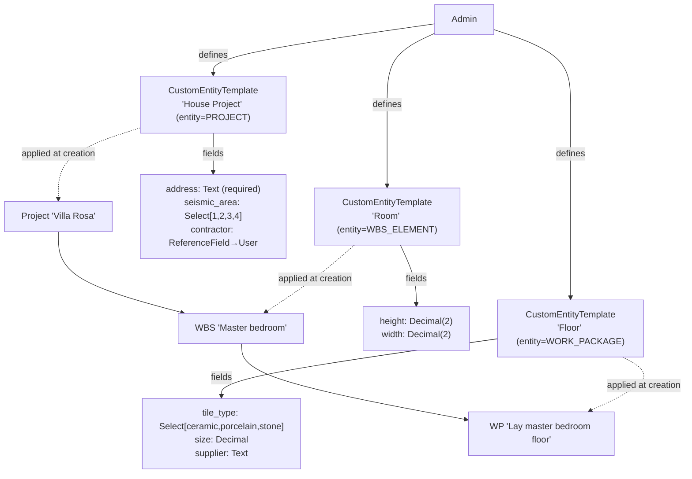
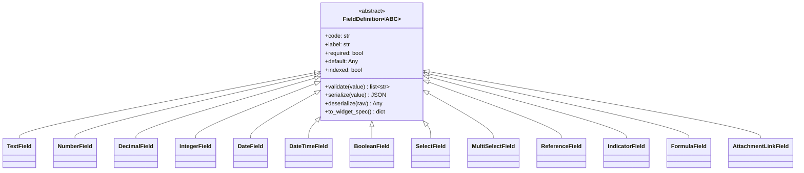

# Custom Fields — Functional Analysis

**Document status:** ✅ Approved / Frozen for Implementation (v4.2 — adversarial review incorporated; open decisions resolved 2026-06-26: dev/seed ⇒ **C2 deferred**, D1 NOT NULL+GLOBAL, M12 defer-all-others; `ai_visible` default OFF, ReferenceField→User only, single-org/GLOBAL UX deferred) · **v5 (2026-06-27): Phase 0 + Phase 1 IMPLEMENTED — D2 refined to allow first-time binding on edit for template-less entities (§11.3).** · **v6 (2026-06-27): Phase 2 (Queryability) IMPLEMENTED — JSONB filter/sort in FilterParser + global-search JSONB clauses, dual-gated by `searchable` (UI) / `ai_visible` (AI) via a `search_mode` param; hot-field indexes + FE filter-builder + WP list-filter deferred (§10, §11.3).** · **v7 (2026-06-27): Phase 3 (Merge fidelity + Field lifecycle) IMPLEMENTED — per-key JSONB merge diff + field status active/deprecated/retired (M2 change-based write-gate + create-hide/edit-readonly + AI retired-exclude/deprecated-flag); template-level retire + usage-backref deferred (§10, §11.3).**
**Sign-off:** 2026-06-26 — D1–D13 frozen; ChangeOrder refactoring directive (§7.9); critical implementation directives (§11.1)
**Revision history:** v1 analysis → v2 (critique) → v3 (sign-off: ChangeOrder unified, D1–D13 frozen) → **v4 (adversarial review: DB-serialized concurrency, backup/history preservation, unknown-key rejection, snapshot/live validation rule, D11 realignment, D8 confidentiality, current-version indexes, CO-migration safety)** → **v5 (2026-06-27): Phase 0+1 shipped; D2 first-time-binding refinement; false CO-AI-leak premise retracted (§11.3)** → **v6 (2026-06-27): Phase 2 queryability shipped — FilterParser JSONB filter/sort branch + global-search JSONB clauses + `search_mode` D8 dual-gate + `searchable` FE toggle; defensive-cast no-500 hardening; indexes, FE filter-builder, WP list-filter deferred (§10/§11.3)** → **v7 (2026-06-27): Phase 3 merge fidelity + field lifecycle shipped — per-key custom_fields merge diff; field status active/deprecated/retired with M2 live-status write-gate (change-based, not presence) + create-form hide + edit read-only (live overlay) + AI retired-excluded/deprecated-flagged; template-level retire + cached usage-backref deferred (§10/§11.3)**
**Audience:** Tech lead, Product owner, Dev team
**Author:** Architecture
**Date:** 2026-06-24 (analysis) · 2026-06-26 (sign-off + review revisions)

---

## Implementation Status

> **Live status — last updated 2026-06-27 (v7).** This chapter is the single source of truth for what is implemented vs deferred. Per-phase detail remains in §10; per-decision refinements in §11.3. All shipped work is on the `custom-fields` branch.

### Phase rollout

| Phase | Scope | Status | Commit(s) |
|---|---|---|---|
| **0 — Foundations** | `custom_fields` / `custom_entity_template_root_id` / `custom_field_definitions_snapshot` on Project/WBS/WP/**ChangeOrder**; C1 unique partial current-version index; FieldDefinition OO hierarchy; CO `custom_field_values`→`custom_fields` unification; global `IntegrityError`→409; seed. | ✅ Shipped | `3bd51af0` |
| **1 — MVP** | `CustomEntityTemplate` CRUD (Versionable, org-scoped); `CustomFieldService` chokepoint (create/update/snapshot); `CustomFieldsRenderer` + 5 entity modals; AI read (`include_custom_fields`, `ai_visible` gate); D2 first-time binding on edit. | ✅ Shipped | `3bd51af0`, `723a1bc8`, `0fe40424` |
| **2 — Queryability** | `FilterParser` JSONB filter/sort branch; global-search JSONB clauses; `search_mode` D8 dual-gate (`searchable` UI / `ai_visible` AI); `searchable` FE toggle; defensive-cast no-500 hardening; `list_current_field_codes` resolver. | ✅ Shipped | `31cb7479` |
| **3 — Merge + Lifecycle** | Per-key JSONB merge-conflict diff; field `status` active/deprecated/retired with the M2 status-authority split (live deprecation gate, snapshot value/type); **change-based** write-gate; create-hide/edit-readonly; AI retired-exclude/deprecated-flag. | ✅ Shipped | `8ee60a4d` |
| **4 — Deferred/Optional** | FormulaField engine + rollup; export/CSV; InfoPill/explorer/Gantt surfaces; AttachmentLinkField; custom fields on more entity types; multi-template binding. | 🔲 Not started | — |

### Implemented capabilities (what works today)

- **Admin-defined fields** — `CustomEntityTemplate` (Versionable, org-scoped) groups an OO field-class hierarchy: text/number/decimal/integer/date/datetime/boolean/select/multiselect/indicator/reference (formula deferred). Bound one-per-entity at create, or first-time on edit; immutable once bound (D2).
- **Bitemporal + branch-aware** — the JSONB `custom_fields` dict and `custom_field_definitions_snapshot` ride EVCS `clone()`/`UpdateCommand` for free; Create/Update/Branch/Merge/Revert all carry them per-version; as-of queryable, branch-isolated.
- **Write validation** (single chokepoint `CustomFieldService.validate_field_values`) — unknown-key rejection (M1), required-null rejection (D11), per-field type/range validation, `ReferenceField` existence, and the M2 lifecycle gate (change-based). Surfaces as `CustomFieldValidationError` → HTTP 400; C1 concurrency races → 409.
- **Queryability** — `?filters=code:value` (equality + IN) and sort by custom key on Project/WBS/ChangeOrder list endpoints; global Cmd+K search matches custom-field values; gated by `searchable` (UI) / `ai_visible` (AI).
- **Field lifecycle** — deprecated/retired fields hide in new-entity forms, render read-only on existing entities (live-status overlay), reject writes when *changed*; retired never reaches the AI.
- **Merge fidelity** — two branches editing *different* custom sub-fields merge cleanly; same-key edits surface as precise per-key conflicts (`field: "custom_fields.<key>"`).
- **AI** — read tools surface `custom_fields` behind `ai_visible`; write tools accept `custom_fields` + template binding; a discovery tool (`get_custom_field_definitions`) exposes the ai_visible-gated manifest.

### Where things live

| Concern | File(s) |
|---|---|
| Field type system | `backend/app/models/custom_fields/` (`base.py`, `fields.py`, `registry.py`) |
| Template model / service / routes | `backend/app/models/domain/custom_entity_template.py`, `app/services/custom_entity_template_service.py`, `app/api/routes/custom_entity_templates.py` |
| Write chokepoint + resolver | `backend/app/services/custom_field_service.py` |
| Filter/sort JSONB branch | `backend/app/core/filtering.py` |
| Merge-conflict diff | `backend/app/core/branching/service.py` (`_detect_merge_conflicts`) |
| Global search | `backend/app/services/global_search_service.py` |
| AI gates | `backend/app/ai/tools/custom_fields_helpers.py` |
| FE editor / renderer / hook | `frontend/src/features/custom-fields/` |
| Entity modals (5) | Project / WBSElement / WorkPackage / ChangeOrder modals (+ `ProjectEditModal`) |
| Migration | `backend/alembic/versions/c93e9767de59_custom_fields_phase0.py` |
| Tests | `backend/tests/services/test_custom_fields_phase{0,2,3}.py`, `tests/core/test_branching_core.py` |

### Deferred / not-yet-built

**In-phase deferrals (documented, not bugs):**
- **Indexes (M10)** — zero custom-field indexes shipped. Recipe when a hot query is measured: a partial functional expression index `CREATE INDEX … ON t ((custom_fields->>'key')) WHERE upper(valid_time) IS NULL AND deleted_at IS NULL CONCURRENTLY` (Alembic must wrap it in `op.get_context().autocommit_block()` — no `CONCURRENTLY` precedent exists yet).
- **FE dynamic filter-builder** + **WorkPackage list-filter infrastructure** — backend `?filters=` works on Project/WBS/ChangeOrder; the dynamic FE filter UI and WP list-filter wiring are fast-follows.
- **Template-level lifecycle (M17)** + **`retire()`** + **cached usage-backref** + **admin "used by N entities" UI** — the §6.7 acceptance criterion is field-level; template retire is the scale/admin extension. A live-count query at retire-time is the simpler MVP stand-in if/when added.

**Phase 4 — Deferred/Optional (take à la carte):**
- `FormulaField` engine (computed-on-read; unblocks custom-field→budget coupling, §7.8) + rollup aggregation (Sum/Avg/Min/Max over the WBS tree).
- Export/CSV pipeline.
- Custom-field surfaces in InfoPills / explorer cards / Gantt labels (§7.10).
- Notification emission on custom-field change (§7.7).
- `AttachmentLinkField`; custom fields on ControlAccount / CostElement / CostRegistration / Forecast / ScheduleBaseline / OrganizationalUnit / Document (M12 — discriminator is extensible); multi-template binding (D10 deferred branch).

### Review & verification posture

Each phase shipped with an adversarial review (multi-dimension find → refute-by-default verify): Phase 2 surfaced the no-500 cast gap (fixed); Phase 3 surfaced the whole-map-replace echo bug (fixed — the change-based write-gate). `ruff`/`mypy` clean across the diff (318 files); backend test batteries green. Two pre-existing typecheck errors in `useStreamingChat.projectContext.test.ts` (AI-chat territory, unrelated to custom fields) remain out of scope.

---

## 1. Executive Summary

Backcast needs admin-defined **custom fields** so the system can capture project-type-specific attributes (a house-build project's *address*, *seismic area*, *contractor*; a "room" WBS element's *height/width*; a "floor" work package's *tile type/supplier*) without a code change per customer. The decisive codebase fact is that EVCS uses **full-snapshot bitemporal versioning**: every state change clones the entire row via `VersionableMixin.clone()` (`backend/app/models/mixins.py:62-80`), which iterates `mapper.attrs` to copy all mapped columns. Persistence of that clone happens through **two distinct paths** — (A) a hand-built raw SQL INSERT that enumerates `mapper.columns` and applies a generic JSONB serialization guard (`UpdateCommand` at `backend/app/core/branching/commands.py:312-361`; `UpdateVersionCommand` at `backend/app/core/versioning/commands.py:264-374`), and (B) the ORM `session.add()` + `flush()` path, which relies on asyncpg's native JSONB codec (`CreateBranchCommand`, `MergeBranchCommand`, `RevertCommand`, `CreateVersionCommand`). This means a single **JSONB `custom_fields` column on each versioned entity table** propagates through Create/Update/Branch/Merge/Revert for free — and a dict-shaped version of this pattern is **already in production** on `ChangeOrder.custom_field_values` (`backend/app/models/domain/change_order.py:169`). Per the 2026-06-26 sign-off, that ChangeOrder path is **deprecated and unified** under the new model — `ChangeOrder` becomes a first-class target entity type (§7.9), eliminating the two-definition-model split that was v2's largest architectural risk.

The recommended approach is: (1) an OO field-class hierarchy (`FieldDefinition` ABC + `Text/Number/Decimal/Date/Select/Reference/Formula` subclasses) owning validation/serialization; (2) a non-branching, **Versionable** `CustomEntityTemplate` registry scoped by entity type + org unit, modeled on `CostElementType`; (3) values stored as a `{code: value}` **dict** JSONB column on `Project`/`WBSElement`/`WorkPackage`/**`ChangeOrder`** version rows, validated at the service layer by the existing `CustomFieldService` (generalized onto `.code`); and (4) the template's `field_definitions` also stored as a **dict keyed by field code** (not a list), because the raw-INSERT JSONB guard is `isinstance(values[col], dict)` (dict-only — verified at `commands.py:352` and `versioning/commands.py:356`), so a list-typed JSONB column through the versioning path is **unproven and would fail on template Update**. **EAV is explicitly rejected** because its separate value table does not ride `clone()` and would require re-implementing versioning across 5+ commands.

The headline risks are: **(a) the AI tool layer uses hardcoded field whitelists** (the `list_projects`/`get_project` return dicts at `backend/app/ai/tools/project_tools.py:40+`/`:194+`) that silently drop custom fields today — not hypothetical, it already drops `ChangeOrder.custom_field_values`; **(b) merge-conflict detection compares values with whole-object `!=` and `str()`-ifies them** (`backend/app/core/branching/service.py:807-840`), so two branches editing *different* custom sub-fields surface as one opaque conflict; **(c) global search and filter use fixed field allowlists** (`backend/app/services/global_search_service.py:82-97` scoring, `:195` `_ENTITY_CONFIG`; `backend/app/services/project.py:295`) with **zero GIN/pg_trgm/jsonb_path_ops indexes anywhere in the codebase** (grep-confirmed across `backend/alembic/versions/` and `backend/app/models/`), so custom fields are invisible to search without new infrastructure; and **(d) write-amplification** — every version transition clones the entire JSONB blob, so any GIN index on it is rebuilt on every write. Overlap/temporal integrity is enforced **at the application layer** (`_check_overlap` at `commands.py:56-95`), not by DB exclusion constraints (none exist), so an additive JSONB column cannot conflict with temporal integrity. **Two EVCS-wide defects the review surfaced (pre-existing, *not* caused by custom fields) are fixed in v4:** (i) EVCS has **no DB-level serialization** of the one-current-version-per-`(root_id, branch)` invariant — concurrent updates can produce two open-ended current versions (lost writes on *any* field); v4 closes this with a **unique partial index** (§6.4/§7.1), which also satisfies ADR-005 and removes a read-side correction divergence (M15); (ii) the `dump_database`/reseed path is **current-version-only** and drops `valid_time`/`transaction_time`, so it cannot preserve template `/history` across a restore — **accepted for the dev/seed deployment** (no irreplaceable production history today); revisit when production-bound (§7.6/C2). Entity-level US-9 rendering is unaffected (snapshot-on-write is self-contained per version row).

---

## 2. Goals & Non-Goals

### Goals

- **Admin-defined field types and templates.** An administrator (RBAC-governed) can define a typed custom field once and group fields into a reusable **CustomEntityTemplate** scoped to an entity type (Project | WBSElement | WorkPackage | ChangeOrder; ControlAccount + other versioned/branchable entities explicitly deferred — §7.1/M12).
- **Template applied at entity creation.** When a PM creates an entity, they pick a template; the template's field definitions drive the form and seed defaults.
- **Per-instance values.** Each entity instance carries its own custom-field values, versioned with the row (bitemporal fidelity, branch isolation, "as-of" reads).
- **Historical fidelity.** Reading an old version renders values against the field definition **effective at that version's creation time** (US-9) — see §6.6.
- **Queryability.** Custom fields can be filtered, sorted, and searched (with deliberate indexing for hot fields).
- **AI visibility.** The AI assistant can read, write, and discover custom fields (today it cannot — see §7.2).
- **Governance.** Field definitions are versioned separately from values, RBAC-gated, and deprecatable with a defined lifecycle (§6.7).
- **Unified ChangeOrder path.** The legacy project-scoped ChangeOrder custom-field config is deprecated; ChangeOrder becomes a first-class target entity type under the **same** `CustomEntityTemplate` model — one definition model, not two (§7.9).

### Non-Goals

- **No dynamic schema/DDL per field.** Custom fields do not `ALTER TABLE` (Odoo-style). They live in JSONB. Real-column generation is explicitly out of scope.
- **No per-field / per-template-instance RBAC.** Permissions are template-level CRUD (read/create/update/delete), mirroring `CostElementType`. Field-level ACLs are a deferred non-goal (P6's experience shows the complexity rarely pays off).
- **No mobile-specific field rendering** in the first phase.
- **No in-place / incremental migration of legacy ChangeOrder data.** The legacy `ChangeOrder.custom_field_values` + `co_workflow_config.custom_fields` definitions are **deprecated and unified** into `CustomEntityTemplate` (§7.9), but via a **clean database wipe + reseed** (D13) — not an in-place row-by-row migration. The parallel definition model is deleted, not preserved.
- **No formula/rollup engine in the MVP.** `FormulaField` is modeled as a type but is **computed on read only** (like `Project.budget`), never stored on the snapshot; a full expression engine is deferred. This also defers any coupling between custom fields and budget/cost-registration rules (§7.8).
- **No notifications on custom-field edits in the MVP.** Decided out-of-scope but stated explicitly (§7.7).
- **No custom fields on non-target entities in the MVP.** Only Project/WBE/WP/ChangeOrder are target entity types. ControlAccount, CostElement, CostRegistration, CostEvent, Forecast, ScheduleBaseline, OrganizationalUnit, Document are **explicitly deferred** (the discriminator is extensible) — see §7.1/M12.
- **No `AttachmentLinkField` in the MVP.** Modeled in the type list (§6.1) but **dropped from the Phase-1 registry** (§8.3) until its target entity and read/render contract are specified — deferred alongside FormulaField (M13).
- **No bulk import / seed of entities with custom fields.** The only programmatic write paths are REST create/update and AI tools. Any future bulk import must resolve the bound template, capture the snapshot per row, and run `validate_field_values` per row (m20).
- **No i18n of admin-authored labels/options.** `FieldDefinition.label` and `SelectField` options are display-only raw strings; no locale negotiation in the MVP (backend or `CustomFieldsRenderer`/`EntityMetadataCard`) (m18).
- **No "refresh snapshot" operation.** The snapshot is **immutable after create** (matching the `config_snapshot` precedent and US-9); the v3 "refresh snapshot" phrase is withdrawn. Label-only template edits propagate to *new* entities only; existing entities keep their captured snapshot (§6.6/M3).

---

## 3. Requirements (Functional)

### 3.1 User Stories

| # | As a… | I want to… | So that… | Acceptance criterion |
|---|-------|-----------|----------|----------------------|
| US-1 | Admin | define a typed custom field scoped to an entity type | my organization captures consistent attributes per project type | Field persists; values of the wrong type are rejected on write |
| US-2 | Admin | group fields into a named CustomEntityTemplate with required-ness, defaults, options | PMs get the right form automatically when creating an entity | Creating an entity with the template renders exactly its fields with validation |
| US-3 | Admin | scope templates globally or to an org unit | each business unit can have its own field schema | Two BUs see different field sets; global template applies where no BU template exists |
| US-4 | PM | pick a template when creating an entity | the form renders only the relevant fields | Empty/invalid `template_id` rejected at create; selector disabled on edit |
| US-5 | PM | edit custom field values on a branch | the change is isolated and mergeable like any other field | Branch edit does not appear on `main` until merged |
| US-6 | Reviewer | see custom-field diffs in entity history | I understand what changed between versions | History endpoint returns per-version `custom_fields`; FE diffs sub-keys |
| US-7 | Analyst | filter/sort/search entities by custom field value | I can find "all projects in seismic area 2" | `?filters=seismic_area:2` returns matches sub-second at scale |
| US-8 | AI assistant | read a project's custom fields and discover a template's field manifest | it can reason about, surface, and fill custom data via chat | `get_project` returns `custom_fields`; AI can fill them via `custom_field_values` param |
| US-9 | Admin | deprecate or evolve a field definition without corrupting historical snapshots | old versions remain readable with their original values | Given field `seismic_area` is redefined from Select[1-4] to Select[1-5], a pre-redefinition Project version's value still validates against the field spec effective at that version's `valid_time.lower`, and the read-only UI renders the OLD label/options (§6.6) |
| US-10 | Admin/PM | use the same template model for ChangeOrders as for projects | CO custom fields are no longer a parallel, project-scoped config | A ChangeOrder created against a `CHANGE_ORDER` template carries `custom_fields` through create/approve/merge exactly like a Project; the legacy `co_workflow_config.custom_fields` is retired (§7.9) |

### 3.2 The House-Build Example (fully modeled)



Each template is a versioned row in `custom_entity_templates`; each entity instance binds to **one** template (D10) and stores its values in its `custom_fields` JSONB dict:

```json
// Project 'Villa Rosa' version row → custom_fields:
{"address": "Via Roma 12, Milano", "seismic_area": "2", "contractor": "<user_root_id>"}

// WBS 'Master bedroom' → custom_fields:
{"height": 2.7, "width": 4.2}

// WP 'Lay master bedroom floor' → custom_fields:
{"tile_type": "porcelain", "size": 0.6, "supplier": "Ceramica Sassuolo"}
```

### 3.3 Capabilities

- **OO field-class paradigm** (§8): each field type is a Python class owning `validate()`, `serialize()`, `deserialize()`, `to_widget_spec()`.
- **Type system:** Text, Number, Decimal, Integer, Date, DateTime, Boolean, Select, MultiSelect, ReferenceField→entity, Indicator/Enum, Formula/Computed (read-only). *(AttachmentLinkField is modeled but deferred — §2 Non-Goals.)*
- **Queryability:** filter, sort, full-text search via JSONB operators + **partial functional expression indexes** for hot keys (not whole-column GIN — see §6.4/M10).
- **AI visibility:** read tools surface values; write tools accept a `custom_fields` dict param; specialists discover the field manifest at runtime.
- **Governance:** templates are RBAC-governed, org-scoped, and evolve via new definition versions (never in-place type mutation); field lifecycle states are active/deprecated/retired (§6.7).

---

## 4. Requirements (Non-Functional)

| NFR | Requirement | Rationale / Evidence |
|-----|-------------|----------------------|
| **Versioning fidelity** | Custom-field values must be captured per-version and read correctly "as-of" any timestamp. | A mapped JSONB column on the versioned row is returned by the entity's base `select(entity_class)` (e.g. `get_as_of` at `branching/service.py:571,585,626`). `_apply_bitemporal_filter` (`:356-389`) only appends the temporal WHERE clause — it does not select columns and needs no JSONB awareness. An EAV side table would *not* ride either path (see §6.4). |
| **Branch isolation** | Editing a custom field on a change-order branch must not leak to `main` until merged. | `CreateBranchCommand` (`commands.py:132-141`) and `MergeBranchCommand` (`:434-442`) clone via `source.clone(...)` then `session.add(); flush()` (ORM/asyncpg path). `clone()` iterates `mapper.attrs`, so a mapped JSONB column is copied to the branch. |
| **Performance at scale** | List/search/filter by custom field must stay sub-second on the largest tenant. | The 4 target tables have **no current-version index today** (grep-confirmed; ADR-005's mandated partial-unique + GIST indexes do not exist), so every list/read is a version-row seq scan — that is the inherited baseline, not a new trade-off. v4 adds a partial current-version index per table (§6.4) and resolves corrections with `DISTINCT ON` (§7.1). For custom fields: hot keys get a **partial functional expression index** `(custom_fields->>'key')` — *not* whole-column `jsonb_path_ops` GIN, which cannot serve `->>'key'=value` and amplifies every write (§6.4/M10). Target: 10k entities × 30 versions, p95 < 1s on a filtered list (Phase 1 benchmark). |
| **Concurrency / lost-update prevention** | Two simultaneous edits must not produce two open-ended current versions (lost writes). | EVCS has **no DB serialization** today (no `FOR UPDATE`, no exclusion constraint, no unique partial index — grep-confirmed). v4 enforces one-current-version-per-`(root_id, branch)` via a **unique partial index** `WHERE upper(valid_time) IS NULL AND deleted_at IS NULL` (§6.4/§7.1); `_check_overlap` is read-only and is **not** a lock (C1). |
| **Backup / history preservation** | *(Deferred — dev/seed deployment.)* Template-admin `/history` (the audit of field-definition edits) need not survive dump→restore today; entity-level US-9 rendering is unaffected (snapshot-on-write is self-contained per version row). | `SystemAdminService.dump_database` is current-version-only and drops `valid_time`/`transaction_time` (`system_admin_service.py:313-571`, `_EVCS_EXCLUDE` `:22-25`) — **accepted for now**. *Production-bound prerequisite:* extend the dump to all version rows of `custom_entity_templates` + a `reseed.py` handler, OR designate `pg_dump` as the only real-data backup (§7.6/C2). |
| **Correction read determinism** | A backdated/correction edit must not yield duplicate list rows. | ISOLATED/main list paths use `is_current_version` with **no `DISTINCT ON`/transaction_time tiebreak**; two open-ended versions for the same valid window return both (non-deterministic `custom_fields`). v4 adds `DISTINCT ON (root) … ORDER BY transaction_time DESC` for ISOLATED/main (§7.1/M15); structurally impossible once the unique partial index exists. |
| **Type-safety** | Invalid values must be rejected before persistence. | `CustomFieldService.validate_field_values` (`custom_field_service.py:11`) already does this for ChangeOrders; generalize per field class. **Reject unknown keys** at the single service-layer chokepoint (M1/§7.6). |
| **Migration safety** | Adding custom fields must not break existing rows, branches, or history. | Columns are nullable; overlap/temporal integrity is enforced **at the app layer** (`_check_overlap` at `commands.py:56-95`), not by DB exclusion constraints (grep-confirmed: zero `ExcludeConstraint`/GIST in `backend/alembic/versions/` or `backend/app/models/`). The migration cannot interact with temporal integrity. |
| **RBAC** | Template CRUD and value read/write are permission-governed. | Follow `<entity>-<action>` convention (e.g. `custom-entity-template-create`). Reuse parent-entity permissions for value access where field-level RBAC is out of scope. |
| **Write amplification** | Indexes on `custom_fields` are rebuilt on every version write. | Prefer containment (`@>`) over path navigation; expression indexes only for hot fields; budget periodic `REINDEX CONCURRENTLY` (note: `CONCURRENTLY` cannot run inside Alembic's default transaction — see §7.6). |
| **Backward compatibility** | Legacy ChangeOrder custom fields are unified, not preserved as-is. | A clean DB wipe + reseed rebuilds CO field definitions as a `CHANGE_ORDER` template re-keyed `.name → .code` (§7.9, D13). No in-place CO migration; the parallel definition model is deleted. |
| **Read-path NULL safety** | Service/FE code must treat `custom_fields IS NULL` as `{}`. | Existing rows stay NULL until touched (the raw-INSERT path bypasses `server_default` — see §6.3/§7.6). Downstream dict-assuming code will `KeyError` if NULL is not normalized. |

---

## 5. ERP / Industry Research

### 5.1 How the major systems solve it

**Oracle Primavera P6 (UDFs)** — The canonical EAV split: `UDFTYPE` (one row per field *definition*: subject area + data type + scope) and `UDFVALUE` (one row per filled-in *value*, with polymorphic `fk_id` to the parent). Two flavors: **Global** UDFs (enterprise, no formula) and **Project** UDFs (project-scoped, support formulas + graphical indicators). Field types: Text, Start/Finish Date, Number, Integer, Cost, Indicator (closed enum: Red/Yellow/Green/Blue), Code (lookup). Subject area is **immutable after creation**. Security is coarse: one "edit UDFs" privilege + a Cost-view gate. `UDFVALUE` is routinely one of the largest tables in a P6 DB; Analytics caps at **100 UDFs per type × subject area** (anti-proliferation signal).

**SAP (classification)** — Large-scale EAV across `CABN` (attribute metadata), `CAWN` (allowed values), `KLAH`+`KSML` (class→characteristic), `KSSK` (object→class), `AUSP` (value table). S/4HANA Key-User tooling uses **real `ALTER TABLE` append structures** on transparent tables propagated via `E_*` CDS views (Public Cloud blocks custom fields from apps unless a released interface view exposes them — a deliberate governance chokepoint).

**MS Project** — Hybrid. Local fields occupy **fixed slots** (Text1–30, Number1–30, Flag1–20) — a capped column pool, renameable titles, no cross-project consistency. Enterprise fields are server-side with **formulas, graphical indicators, and hierarchical outline-code lookups**; heavy formula use degrades Project Server.

**Jira** — 3-table EAV (`customfield`, `customfieldoption`, `customfieldvalue` with typed generic columns). Its strongest contribution is the **3-layer separation**: Context (scope + options) / Field Configuration (required/hidden) / Screen (placement) — fully orthogonal. "Where's My Field?" exists because the combinatorics defeat humans. **No field-bundle/template** (explicitly requested, denied). EAV scaled poorly: ~3.2× slowdown at 700 fields (Exness benchmark).

**Odoo** — Real columns via `ALTER TABLE` (`x_studio_` prefix), native types, indexable. Notable pivot: `company_dependent` fields migrated **from EAV (`ir.property`) to jsonb-dict-on-row (v17+)** for performance — a direct EAV→JSONB precedent.

**ERPNext/Frappe** — Metadata tables (`tabCustom Field`, `tabProperty Setter`) merged at runtime; values as real columns. Upgrade-safe isolation of customizations.

### 5.2 Comparison table

| Dimension | P6 | SAP | MS Project | Jira | Odoo | ERPNext | **Backcast (proposed)** |
|-----------|----|-----|-----------|------|------|---------|------------------------|
| Storage | EAV (2 tables) | EAV (5-6 tables) / ALTER | Fixed slots + server-side | EAV (3 tables) | ALTER (real cols) | Metadata + cols | **JSONB dict on version row** |
| Bitemporal | No | No | No | No | No | No | **Yes (free)** |
| Branch isolation | No | No | No | No | No | No | **Yes (free)** |
| Scope axis | Global OR Project | Class groups chars | — | No bundle | Per-model | Per-DocType | **Org-unit (hybrid global)** — now unified across all entity types incl. ChangeOrder (§7.9) |
| Field-bundle template | No (Activity Codes ≠ UDFs) | Class groups chars | No | **No (requested, denied)** | Per-model | Per-DocType | **Yes (CustomEntityTemplate)** |
| Type-change safety | Mutable in place | Mutable | Mutable | Mutable | Mutable | Mutable | **Versioned (new def, no in-place mutation)** |
| Per-field RBAC | No (coarse) | No | No | No | No | No | Template-level only |
| Search perf at scale | Known pain (AUSP) | Known pain | N/A | ~3.2× slowdown | Good | Good | **Containment `@>` + selective GIN** |

### 5.3 Distilled lessons

1. **Separate definition from value.** Every mature system does. Backcast: `CustomEntityTemplate` (definition) vs `custom_fields` JSONB (value).
2. **Make entity-type binding first-class and immutable.** P6's `TABLE_NAME`/Subject Area is immutable post-create. A field belongs to exactly one entity type.
3. **Avoid unbounded proliferation.** P6 Analytics' 100-per-type cap and Emerald Associates' "struggling to manage them" piece show this is the #1 operational pain. Ship usage-backrefs (cached) and a soft cap.
4. **Jira's 3-layer separation is the gold standard** — decouple scope/validation/placement. Backcast should not couple scoping to storage.
5. **Odoo's EAV→JSONB pivot validates JSONB for per-scope values** (maps directly to Backcast's per-branch values).
6. **Type-change is a trap.** Salesforce blocks type changes outright. Model as a **new definition version**, never in-place mutation.
7. **EAV loses badly at scale for reads** unless the access pattern is a narrow filter — and even then JSONB `@>` containment wins for Backcast's read-heavy, full-snapshot model.

---

## 6. Proposed Data Model

### 6.1 Field-Class Hierarchy (the OO paradigm)



Per-type contract:

| Type | Validation rule | JSON serialization | Default | Indexed? |
|------|----------------|--------------------|---------|----------|
| **Text** | `isinstance(v, str)`, `len ≤ max_length` | string | `""` or None | optional (`->>` GIN) |
| **Number** | `isinstance(v, (int,float))` | number | None | optional (cast+expr) |
| **Decimal** | `Decimal`, precision/scale (match `DECIMAL(15,2)`) | string (preserve precision) | None | optional |
| **Integer** | `isinstance(v, int)` | number | None | optional |
| **Date** | ISO-8601 string, parseable | `"YYYY-MM-DD"` | None | optional (cast date) |
| **DateTime** | ISO-8601, tz-aware | ISO string | None | optional |
| **Boolean** | `isinstance(v, bool)` | bool | `false` | rarely |
| **Select** | value ∈ `options` | string | first option | yes (exact match) |
| **MultiSelect** | all values ∈ `options` | `list[str]` | `[]` | yes (`@>` containment) |
| **ReferenceField** | sync: UUID-shape only; async existence+RBAC in service (**MVP: `User` target only** — §11.2) | string (UUID) | None | rarely |
| **Indicator** | value ∈ enum (Red/Yellow/Green/Blue) | string | None | yes |
| **Formula** | computed on read only (never stored) | n/a (computed) | n/a | n/a |
| **AttachmentLink** | valid attachment root_id | string (UUID) | None | rarely |

> **Canonical key — `.code` (sign-off):** the new `FieldDefinition` keys values by `.code`. The legacy `CustomFieldDefinition` (`backend/app/models/schemas/custom_field.py:18`) and `CustomFieldService.validate_field_values` (`custom_field_service.py:28`) keyed by `.name`; the ChangeOrder refactor re-keys these to `.code` during the wipe/reseed (§7.9). The `.name` read-alias proposed in v2 is **dropped** — `.code` is the sole canonical key, and the legacy `CustomFieldDefinition` schema is retired in favour of `FieldDefinition`.

### 6.2 CustomEntityTemplate

Modeled on the existing `CostElementType` (`backend/app/models/domain/cost_element_type.py`): a **Versionable** (TemporalService), **non-Branchable** reference entity owned by an org unit.

```python
class CustomEntityTemplate(EntityBase, VersionableMixin):
    __tablename__ = "custom_entity_templates"
    custom_entity_template_id: Mapped[UUID] = mapped_column(PG_UUID, nullable=False, index=True)  # root ID
    organizational_unit_id: Mapped[UUID] = mapped_column(PG_UUID, nullable=False, index=True)  # NOT NULL — matches CostElementType/ControlAccount convention; a seeded 'GLOBAL' org unit represents global templates (M16)
    target_entity_type: Mapped[str] = mapped_column(String(30), nullable=False)  # PROJECT|WBS_ELEMENT|WORK_PACKAGE|CHANGE_ORDER  (immutable post-create; CO added by sign-off §7.9)
    code: Mapped[str] = mapped_column(String(50), nullable=False, index=True)
    name: Mapped[str] = mapped_column(String(255), nullable=False)
    description: Mapped[str | None] = mapped_column(Text, nullable=True)
    field_definitions: Mapped[dict[str, Any]] = mapped_column(JSONB, nullable=False)  # {field_code: spec} — DICT, not list
    # valid_time / transaction_time inherited
```

**Why Versionable (not Branchable, not Simple):** gives a `/history` endpoint and bitemporal audit of template evolution (critical — admins must see who changed a field's type/required-ness and when), without the branch-isolation complexity that organizational reference data does not need. This mirrors `CostElementType`. The `target_entity_type` discriminator is **immutable post-create**, mirroring P6's Subject Area.

> **CRITICAL — `field_definitions` MUST be a DICT, not a list.** The raw-INSERT JSONB serialization guard in both versioning commands is `if isinstance(values[col_name], dict)` (`branching/commands.py:352`; `versioning/commands.py:356`). A `list`-typed JSONB column would **not** be serialized by this guard and asyncpg cannot bind a Python list to JSONB directly → **template Update would fail**. `CostElementType` has zero JSONB columns today, so list-typed JSONB-through-versioning has never run in production. The ChangeOrder precedent only proves **dict-typed** JSONB (`config_snapshot`, `impact_analysis_results`, `custom_field_values` are all dicts). Store `field_definitions` as `{field_code: spec}` (consistent with the value shape in §6.3). If a list is ever required, generalize the guard to `isinstance(values[col], (dict, list))` in both commands first.

> **Nested list *values* are safe (MultiSelect — m1).** The dict-only guard constrains only the **top-level column type**; a MultiSelect value nested inside the dict (`{"tiles": ["ceramic","porcelain"]}`) is serialized by `json.dumps` along with the rest of the dict. Only a *top-level list-typed* JSONB column breaks the raw-INSERT path. Do not avoid MultiSelect, and do not generalize the guard for nested values.

> **Alternative considered — Simple (non-versioned) with an audit-log table** (the `co_config_audit_log` pattern). Lighter migration, but loses bitemporal "as-of" template resolution. The real cost of Versionable is the **as-of join** required at read time to resolve the template version active when an entity version was created (§6.6) — this is non-trivial but is the correct choice for historical fidelity.

### 6.3 CustomFieldValue representation

A flat `{field_code: value}` **dict** map on the entity version row — the established convention from `ChangeOrder.custom_field_values` (`change_order.py:169`).

```python
# On Project / WBSElement / WorkPackage:
custom_fields: Mapped[dict[str, Any] | None] = mapped_column(JSONB, nullable=True, default=dict)
```

**Do NOT add `server_default=text("'{}'::jsonb")`.** The raw-INSERT path exists specifically to bypass DB defaults so temporal ranges are set explicitly and server_defaults do not create phantom current versions (`versioning/commands.py:271-272` comment: "Uses raw SQL INSERT to bypass database DEFAULT values"). Because Update/UpdateVersion enumerate all `mapper.columns` and write explicit values, a `server_default` on `custom_fields` is harmless for writes but **misleading**: it implies the DB backfills `'{}'`, yet the raw path writes whatever Python value `clone()` produced. For a brand-new column on **existing** rows during migration, that value is `NULL`, not `'{}'` — `server_default` does not touch existing rows. **Match the actual ChangeOrder precedent** (`change_order.py:169` has neither `default` nor `server_default` — plain nullable). The migration must either backfill explicitly (`UPDATE projects SET custom_fields='{}'::jsonb WHERE custom_fields IS NULL`) **or** accept NULL and document that service/FE code must normalize `None → {}` (NFR: read-path NULL safety).

> **Alternative considered — `list[FieldValue]` (`[{code, value, display_value?}]`).** Adds `display_value` denormalization (stale on option-label rename), complicates JSONB queries (`jsonb_array_elements`), and complicates diff. The flat dict is simpler, matches the existing CO design, and is the recommendation. The list form is reserved for a future "per-value metadata" requirement.

### 6.4 STORAGE RECOMMENDATION: JSONB-on-entity (primary), EAV (rejected)

**Recommendation: single dict JSONB `custom_fields` column per entity-version table.**

#### Why JSONB wins for Backcast specifically

The decisive fact: `VersionableMixin.clone()` (`backend/app/models/mixins.py:62-80`) iterates `mapper.attrs` and copies all mapped column values, producing the in-memory clone object. That clone is then persisted through one of **two paths**:

- **Raw-INSERT path** (`UpdateCommand` at `branching/commands.py:312-361`; `UpdateVersionCommand` at `versioning/commands.py:307-374`): enumerates `mapper.columns`, builds `INSERT ... VALUES (:col, ...)`, and applies the dict-only `json.dumps` guard. A mapped JSONB **dict** column is serialized correctly here.
- **ORM flush path** (`CreateBranchCommand` at `branching/commands.py:140-141`; `MergeBranchCommand` at `:413-414,458-459`; `RevertCommand` at `:538-539`; `CreateVersionCommand` at `versioning/commands.py:226-227`): `session.add(clone); await session.flush()`, persisting via asyncpg's native JSONB codec, which handles dicts/lists/scalars/None uniformly.

So adding `custom_fields: Mapped[dict|None] = mapped_column(JSONB, ...)` to Project/WBSElement/WorkPackage requires **zero changes** to the EVCS machinery on either path. This is **proven in production** by `ChangeOrder.custom_field_values` (dict JSONB, `change_order.py:169`).

#### Concurrency, current-version index & correction reads (C1 / M9 / M14 / M15)

The review surfaced a **pre-existing EVCS gap** (not caused by custom fields): there is **no DB-level serialization** of the one-current-version-per-`(root_id, branch)` invariant — no `FOR UPDATE`, no exclusion constraint, no unique partial index (grep-confirmed across `alembic/versions/` and `app/models/`). `_check_overlap` (`branching/commands.py:56-95`) is a read-only SELECT and **is not a lock**; two concurrent `UpdateCommand`s can both pass it and both INSERT an open-ended current version (lost writes on *any* field). Separately, ADR-005 mandates a partial unique index + GIST indexes that **do not exist**, and `temporal_queries.py:8-9,46-57` falsely documents a GIST index (`cost_element_types_valid_time_idx`, "332s→100ms") that exists nowhere in `alembic/models/__table_args__` (M14).

**Fix (Phase 0, per target table):** add a **unique partial index** enforcing exactly one open-ended, non-deleted current version per root+branch:

```sql
CREATE UNIQUE INDEX ix_projects_current_version
  ON projects (project_id, branch)
  WHERE upper(valid_time) IS NULL AND deleted_at IS NULL;
```

This single index: (a) makes the lost-update race structurally impossible — the second conflicting INSERT raises a unique-violation the service maps to a 409 — **replacing the v3 "optimistic lock" directive (C1)**; (b) satisfies ADR-005's current-version mandate; (c) removes the M15 correction-read divergence (two open-ended current versions can no longer coexist). **Read-side (M15):** ISOLATED/main list/get queries must still resolve corrections deterministically with `DISTINCT ON (root_field) … ORDER BY root_field, transaction_time DESC` (mirroring MERGED mode at `branching/service.py:486-494`) as defence-in-depth and for the backfill window. Phase-0 test: two open-ended versions with the same `valid_time` but different `custom_fields` return exactly one row.

> **Directives updated:** the v3 §11.1 "Optimistic-Lock Safeguard" directive is **withdrawn** and replaced by this DB-enforced unique partial index (see §11.1). The index also subsumes the M14 phantom-GIST-index cleanup — fix or delete the false `temporal_queries.py` docstring in Phase 0 so the perf reality is not hidden from the implementer.

#### Why EAV is rejected

A classic EAV value table (`custom_field_value(type_id, root_entity_id, value_json, valid_time, transaction_time)`) does **not** ride `clone()` — it only copies entity columns. Every command would need an explicit EAV-row-cloning pass keyed by version id:

- `clone()` (`mixins.py:62`) misses it entirely
- `_detect_merge_conflicts` (`branching/service.py:807`) iterates `table.columns` and would miss EAV
- `get_as_of` (`branching/service.py:501`) would need a join + temporal filter on the EAV table
- Every read schema would need assembly
- The EAV table would need its own `valid_time`/`transaction_time` to remain bitemporally correct, plus a strategy for EAV rows when the parent version is closed/reverted/merged (orphan risk)

This is a **fundamental mismatch** with the full-snapshot model. Benchmarks reinforce this: JSONB is ~50,000× faster than EAV without indexes, ~1.3× faster with them, ~3× smaller in storage (Coussej). Odoo migrated `company_dependent` from EAV *to* JSONB for the same reasons.

#### The merge-conflict gap (and how to close it)

`_detect_merge_conflicts` (`branching/service.py:807-840`) iterates `table.columns`, compares with `getattr(source, field_name) != getattr(target, field_name)` (`:821-825`) — a **Python `!=` on the whole dict** — and `str()`-ifies values into the conflict payload (`:833-838`). If branch A edits `seismic_area` and main edits `priority`, both differ from the divergence point and surface as **one conflict on the whole `custom_fields` blob**, with opaque stringified values and no sub-field attribution. To close this gap, add a JSONB-aware branch:

```python
# pseudo (inside _detect_merge_conflicts, custom_fields case):
from sqlalchemy.dialects.postgresql import JSONB as SQLJSONB
if isinstance(column.type, SQLJSONB) and field_name == "custom_fields":
    src = source.custom_fields or {}
    tgt = target.custom_fields or {}
    div = divergence_point.custom_fields or {}
    for key in src.keys() | tgt.keys():
        if src.get(key) != div.get(key) and tgt.get(key) != div.get(key) and src.get(key) != tgt.get(key):
            conflicts.append({"field": f"custom_fields.{key}", "source_value": src.get(key), "target_value": tgt.get(key)})
    continue  # skip the whole-dict comparison
```

This is additive scope (Phase 3), not a blocker for the MVP.

#### Write-amplification trigger for the hybrid facet table (deferred)

The hybrid "typed facet table per hot field + JSONB for the long tail" is **deferred** with a concrete promotion trigger (not a vague "when needed"):

> **Hot-field trigger (M10):** If any single custom field is filtered/sorted on in more than ~5% of list queries (measured via query log) **OR** write latency degrades beyond the p99 baseline (e.g. +20ms), add a **partial functional expression index** for that key: `CREATE INDEX … ON projects ((custom_fields->>'<hot_key>')) WHERE upper(valid_time) IS NULL AND deleted_at IS NULL`. Query with the fully-parameterized SQLAlchemy form `entity.custom_fields['hot_key'].astext == :value` (the key path is bound, not f-stringed). **Do NOT use whole-column `GIN (custom_fields jsonb_path_ops)`** — it cannot serve `->>'key'=value` (only `@>`/`?`) and is rebuilt on every version write. Reserve `jsonb_path_ops` GIN for true `@>` containment (MultiSelect array membership). **MVP default: zero custom-field indexes** beyond the C1 current-version unique index; rely on seq scan until a hot field is measured.

### 6.5 Template binding (D10: one template per entity)

**Decision D10 — ONE CustomEntityTemplate per entity instance.** The entity tables gain a `custom_entity_template_root_id UUID` column (also the resolution key for historical template resolution, §6.6). Rationale:

- **Simpler form/validation:** one field-definition set per entity.
- **Simpler orphan handling:** `template_root_id` is immutable post-create (D2); no reconciliation on reassignment.
- **Simpler AI manifest:** load exactly one template's definitions.

> **Multi-template (rejected for MVP):** a mechanical+electrical project wanting both "Mechanical Project" and "Safety Compliance" templates would require either a `custom_fields` metadata list of template ids or a separate `entity_template_bindings` join table, plus a set-union manifest load and per-template orphan handling. **Deferred.** If multi-template is later needed, the `template_root_id` column generalizes to a bindings table without migrating the value column.

> **No-cascade rule (sign-off directive):** template binding **does not cascade** down the Project → WBS → Control-Account → Work-Package hierarchy, and does not cascade to ChangeOrders either. A sub-element must specify its own `custom_entity_template_root_id` at creation; if none is assigned it defaults to a clean `{}` (no fields, no template). Parent and child frequently carry *different* templates — a "Building" WBE contains "Room" WBEs, a "Room" contains "Floor" WPs — so inheritance would be wrong more often than right. The UI template selector and the AI create-entity tools must enforce this explicitly: they must **not** auto-fill the parent's template on a child.

### 6.6 Historical template resolution (US-9 acceptance criterion)

**The gap in v1:** a historical Project version row carries a `custom_fields` JSONB blob but (without design) no reference to *which* template *version* defined those fields. If an admin later redefines `seismic_area` from Select[1-4] to Select[1-5], reading a 2025 Project version must resolve the template-version whose `valid_time` contains the Project version's `valid_time.lower`.

**Recommended mechanism — snapshot the field definitions onto the entity version at write time (denormalized).** This matches Backcast's full-snapshot philosophy (the CO `config_snapshot` at `change_order.py:161` is the direct precedent) and is fully self-contained:

```python
# On Project / WBSElement / WorkPackage (in addition to custom_fields):
custom_field_definitions_snapshot: Mapped[dict[str, Any] | None] = mapped_column(JSONB, nullable=True)
# Captured at create/update: a copy of the bound template's field_definitions (the {code: spec} dict)
```

At **create** (and only at create — see immutability below) the service copies the **current** template version's `field_definitions` into `custom_field_definitions_snapshot`. The version row is then fully self-describing for validation and read-only rendering — no temporal join needed at read time.

> **Immutability after create (M3 / m9).** The snapshot is **captured once at create and never refreshed** — matching the `config_snapshot` precedent (written once at `change_order_service.py:1217`, never read for validation, never refreshed) and preserving US-9. The v3 "refresh snapshot" phrase is **withdrawn** (§2 Non-Goals). Consequence: a benign label-only template edit propagates to *new* entities only; existing entities keep their captured snapshot. There is no D14 bulk-refresh operation in the MVP.

> **Alternative (rejected for MVP) — temporal join resolution:** `SELECT field_definitions FROM custom_entity_templates WHERE custom_entity_template_id = project.template_root_id AND valid_time @> project.valid_time.lower ORDER BY transaction_time DESC LIMIT 1`. Correct but non-trivial (requires a transaction-time tiebreak for corrections, an extra join per read, and the entity must store `template_root_id`). The snapshot approach eliminates this entirely. The snapshot column rides `clone()` identically to `custom_fields`.

**US-9 acceptance criterion (concrete):** Given field `seismic_area` is redefined from Select[1,2,3,4] to Select[1,2,3,4,5] at time T₂, a Project version created at T₁ < T₂ with `seismic_area="2"` (a) still validates against the **snapshot's** spec (`[1,2,3,4]`) — not the new one — and (b) the read-only UI renders the OLD label/options from the snapshot. New Projects created after T₂ get the new spec in their snapshot.

> **Write-validation authority (M2).** The snapshot (D12) and the deprecation rule (§6.7) are reconciled into one rule: at write time, **field-set membership is gated by the LIVE template** (a field must still exist to be writable), **value range/type is gated by the SNAPSHOT spec**, and **deprecation is enforced only when the deprecated field is present in the incoming payload** (reject a write that *sets* a deprecated field; allow a write that omits/unchanges it). This diverges from the current CO precedent, which validates against the *live* `get_active_config` and never reads `config_snapshot` — the CO path is migrated off live-config validation in Phase 0 (§7.9).

> **CREATE vs EDIT form source (M17).** The CREATE form has no snapshot yet, so it resolves the **live** template filtered by `deleted_at IS NULL AND valid_time contains now() AND status ≠ retired`, raising a defined 404/409 ("template X is retired/unavailable") if none matches. The EDIT form uses the bound snapshot (already captured). Creating an entity against a retired template fails with the specified error; an entity whose template is later retired still edits (snapshot-gated).

### 6.7 Field lifecycle (active / deprecated / retired)

**States** (a per-field status inside `field_definitions[code].status`, default `active`):

| State | New-entity form | Existing-entity write | Existing-entity read |
|-------|-----------------|----------------------|----------------------|
| **active** | shown, validatable | accepted | rendered (editable) |
| **deprecated** | hidden | **rejected only if present in the payload** (setting it); omitting/unchanging is allowed (M2) | rendered read-only against the snapshot spec |
| **retired** | hidden | rejected if present in the payload | rendered read-only (historical only); gate template retire on cached usage-backref = 0 (or explicit force) (m14) |

**Phase 3 acceptance criterion:** An admin marks `seismic_area` deprecated; new Projects do not show it; existing Villa Rosa still renders it read-only against its snapshot; a write attempting to set it returns `{'error': 'field seismic_area is deprecated'}` (which the AI tool decorator rolls back at `decorator.py:161-173`).

**Usage backref** (the "count of versions using a field") is a **cached count**, not a live scan. Counting across all bitemporal versions of all entities is an expensive query; maintain it via an after-commit increment/decrement hook on entity create/update/deprecate, stored on the template row. Surface as "used by N entities" in the admin UI as a soft-cap warning signal.

> **Narrowing grandfathering (m15).** If an admin narrows a Select's options, existing entities holding a now-removed value are **grandfathered**: the value reads fine against the snapshot; on write the field becomes *read-only for that entity* until corrected (a write that changes it must pick a valid option; a write that leaves it alone is accepted). Add an admin "remediate narrowed values" action.

> **FormulaField in the snapshot (m13).** A FormulaField is a `field_definitions` entry and will appear in the snapshot, but it has **no stored value**. `validate_field_values`, the FE renderer, and the diff MUST skip `type == 'formula'` fields when reading stored values; formula values are injected into the READ model only.

### 6.8 Schema sketch

```sql
-- Migration: add custom_fields + binding + snapshot to versioned entities (additive, safe)
ALTER TABLE projects     ADD COLUMN custom_fields JSONB;                       -- nullable; NO server_default (§6.3)
ALTER TABLE projects     ADD COLUMN custom_entity_template_root_id UUID;       -- nullable until a template is assigned
ALTER TABLE projects     ADD COLUMN custom_field_definitions_snapshot JSONB;   -- denormalized for US-9 (§6.6)
-- identical for wbs_elements, work_packages, AND change_orders (sign-off §7.9)

-- C2 (backup/history — DEFERRED, dev/seed deployment): dump_database stays current-version-only; template-admin
-- /history will NOT survive a restore (accepted today; entity US-9 rendering is unaffected — snapshot-on-write is
-- self-contained per version row). PRODUCTION-BOUND PREREQUISITE: extend dump to all version rows of
-- custom_entity_templates + a reseed.py handler, or designate pg_dump as the only real-data backup.
-- Reseed (dev/seed ONLY, D13/M8): CREATE default CustomEntityTemplate rows per (target_entity_type, org_unit)
-- incl. a CHANGE_ORDER template built FROM SCRATCH (the legacy co_workflow_config.custom_fields is LIST-typed
-- and the seed is null — nothing to re-key; build the dict-from-spec, not a .name->.code rename — m3).
-- PRESERVE ChangeOrderWorkflowConfig, get_active_config(), and all matrix consumers UNCHANGED (M7); retire
-- ONLY the .custom_fields sub-column and the CO validation call sites (change_order_service.py:150-152,346-348,1962-1990).

-- Backfill (CHOOSE ONE per §6.3): normalize NULL → {} in service code, OR:
-- UPDATE projects SET custom_fields = '{}'::jsonb WHERE custom_fields IS NULL;

-- New template registry (Versionable: root_id + valid_time + transaction_time)
CREATE TABLE custom_entity_templates (
    id UUID PRIMARY KEY,
    custom_entity_template_id UUID NOT NULL,            -- root ID
    organizational_unit_id UUID NOT NULL,                -- seeded 'GLOBAL' org unit = global (M16)
    target_entity_type VARCHAR(30) NOT NULL,             -- immutable
    code VARCHAR(50) NOT NULL,
    name VARCHAR(255) NOT NULL,
    description TEXT,
    field_definitions JSONB NOT NULL,                    -- {field_code: spec}  DICT, not list (see §6.2)
    valid_time TSTZRANGE NOT NULL,
    transaction_time TSTZRANGE NOT NULL
);
CREATE INDEX ix_cet_root ON custom_entity_templates (custom_entity_template_id);
CREATE INDEX ix_cet_org  ON custom_entity_templates (organizational_unit_id);
-- current-version partial index on the template registry (TemporalService history reads):
CREATE INDEX ix_cet_current ON custom_entity_templates (custom_entity_template_id)
  WHERE upper(valid_time) IS NULL AND deleted_at IS NULL;

-- C1/M9: enforce ONE current version per (root, branch) on every target table (also satisfies ADR-005,
-- closes M14 phantom-index + M15 correction divergence):
CREATE UNIQUE INDEX ix_projects_current_version
  ON projects (project_id, branch)
  WHERE upper(valid_time) IS NULL AND deleted_at IS NULL;
-- (identical UNIQUE partial index for wbs_elements, work_packages, change_orders)

-- Hot custom-key index — partial FUNCTIONAL EXPRESSION, added ONLY when a hot field is measured (§6.4/M10).
-- NOT whole-column GIN (jsonb_path_ops cannot serve ->>'key'=value and amplifies every write).
-- CREATE INDEX ix_projects_cf_hot ON projects ((custom_fields->>'seismic_area'))
--   WHERE upper(valid_time) IS NULL AND deleted_at IS NULL;
```

ER snippet:

```
custom_entity_templates 1──* field_definitions (JSONB {code: spec})
        │  (root_id binding on entity version, immutable post-create)
        ▼
projects / wbs_elements / work_packages
        ├── custom_entity_template_root_id UUID
        ├── custom_fields JSONB  {field_code: value}
        └── custom_field_definitions_snapshot JSONB  {field_code: spec}  (US-9)
```

---

## 7. Impact Analysis by Subsystem

### 7.1 EVCS Versioning & Branching

**Required changes:** None for storage. Adding the mapped JSONB columns is sufficient for Create/Update/Branch/Merge/Revert/SoftDelete. Temporal correctness is automatic: the columns are returned by the entity's base `select(entity_class)` in `get_as_of` (`branching/service.py:571,585,626`) and `_apply_bitemporal_filter` (`:356-389`) only adds the temporal WHERE clause. Overlap integrity is enforced at the **app layer** by `_check_overlap` (`branching/commands.py:56-95`) and the equivalent in `CreateVersionCommand` (`versioning/commands.py:181-211`) — there are no DB exclusion constraints (grep-confirmed), so the migration cannot conflict with temporal integrity.

**Risks:**
- **Two persistence paths, one subtle guard:** the Update/UpdateVersion raw-INSERT paths depend on the dict-only `json.dumps` guard (`branching/commands.py:352`; `versioning/commands.py:356`); Merge/CreateBranch/Revert use the asyncpg native codec and are unaffected. *Mitigation:* keep `custom_fields` (and `field_definitions`, and the snapshot) **dict-typed**; audit any future command that bypasses mapper introspection (a hand-written explicit-column INSERT would silently drop `custom_fields`).
- **Whole-object merge conflicts** (`branching/service.py:807`): medium severity. *Mitigation:* JSONB-aware diff branch (§6.4), Phase 3.
- **Unbounded JSONB growth:** every version row duplicates the entire blob (and the snapshot). Acceptable for <50 small fields; monitor.
- **NULL vs `{}` read hazard:** existing rows are NULL after migration (the raw path bypasses `server_default`). Downstream dict-assuming code KeyErrors unless normalized. *Mitigation:* normalize `None → {}` at the service read boundary (NFR).

> **Concurrency is DB-enforced, not application-layer (C1 — replaces the v3 "optimistic lock").** The v3 directive-2 `assert_not_superseded` precondition was a **non-serializing TOCTOU** (check-then-act): the SELECT and the subsequent raw INSERT are not atomic, so two concurrent updates both pass and both INSERT. v4 replaces it with a **unique partial index** per table — `ON (root_id, branch) WHERE upper(valid_time) IS NULL AND deleted_at IS NULL` (§6.4) — so the second conflicting INSERT raises a unique-violation the service maps to a 409. `_check_overlap` (`commands.py:56-95`) is read-only and **is not a lock**. This fixes a lost-update race on *any* field, not just custom fields.

> **Correction read determinism (M15).** ISOLATED/main list paths (`project.py:271-276`) use `is_current_version` with no `DISTINCT ON`/transaction_time tiebreak; backdated/correction edits (via `control_date` at `project.py:390,425`) can yield two open-ended versions → duplicate rows with divergent `custom_fields`. Add `DISTINCT ON (root_field) … ORDER BY root_field, transaction_time DESC` for ISOLATED/main (mirroring MERGED mode, `branching/service.py:486-494`). Phase-0 test: two open-ended versions, same `valid_time`, different `custom_fields` → exactly one row. The unique partial index makes the duplicate structurally impossible going forward.

> **`UpdateCommand` column-extraction hardening (m2).** `UpdateCommand` builds `values = {c: getattr(new_version, c) for c in columns}` keyed on `col.key` (`commands.py:348`), while `UpdateVersionCommand` resolves via `mapper.get_property_by_column(col).key` (`versioning/commands.py:331-337`). They agree today only because no JSONB column uses a `name=` override. Align `UpdateCommand`'s extraction with `UpdateVersionCommand` (one line) so a future `name=` override can't silently NULL `custom_fields` on a branch Update.

### 7.2 AI Tools & Assistants

**The hardcoded-whitelist problem.** Every entity read tool builds its return dict field-by-field:

```python
# backend/app/ai/tools/project_tools.py — list_projects (def at :40), get_project (def at :194)
"projects": [
    {
        "id": str(p.project_id), "code": p.code, "name": p.name,
        "description": p.description, "status": p.status,
        "budget": ..., "contract_value": ..., "currency": ...,
        "start_date": ..., "end_date": ...,
    }
    for p in accessible_projects
]
```

A custom field not literally named here **never reaches the LLM**. `find_wbs_elements`, `find_work_packages` are identical. This is **not hypothetical**: `find_change_orders` already silently drops `ChangeOrder.custom_field_values` today.

Create/update tools use **explicit typed parameters, not passthrough** — `update_project` accepts only the core typed fields. The LangChain schema is generated from the function signature, so the LLM literally cannot pass an unknown field.

**The fix:**
1. **Read tools:** add a `custom_fields` dict to the return whitelists, built dynamically by loading field definitions for the entity's bound template at runtime. Do **not** hardcode field names. Bound token cost: include custom fields only in detail tools (`get_project`), or behind `include_custom_fields=true` on lists (lists run over many rows).
2. **Write tools:** add an explicit `custom_fields: dict[str, Any] | None = None` parameter to `create_project`/`update_project`/`update_wbs_element`/WP tools. Validate via `CustomFieldService.validate_field_values` before persistence. Keep typed core params; custom fields are a single dict param to keep the LangChain schema small.
3. **Specialist discovery:** add a read-only `get_custom_field_definitions(project_id, entity_type)` tool that a specialist calls before creating an entity; or inject the manifest into the specialist assignment block. Do **not** bake field names into static system prompts.
4. **ChangeOrder unified (sign-off):** ChangeOrder is now a first-class target entity type (§7.9). `find_change_orders` / `get_change_order` surface `custom_fields` like any entity; CO create/update tools accept the `custom_fields` dict param; the legacy `.name`-keyed `custom_field_values` leak is fixed **by replacement** (the old whitelist path is deleted), not by extending it. CO specialists discover fields through the same `get_custom_field_definitions(entity_type=CHANGE_ORDER)` manifest.

**Constraint:** tool schemas are process-global singletons. Custom fields **must** be surfaced as values inside the return dict or as a generic dict parameter — **not** by mutating the tool's parameter schema per project (impossible under the cache). `invalidate_tool_cache` exists but per-request tool rebuilding is unsupported in the single-node design.

**Reference-field validation caveat (§8.2):** `ReferenceField.validate` is synchronous and can only check UUID-shape. Target existence + RBAC is a service-layer **post-check** (an async DB lookup), matching Backcast's other app-level FK conventions. The clean ABC does not hold for this one field type; document it rather than add an async hook to the ABC.

**Risks:** (a) **arbitrary-key writes** — mitigate by routing every write through `CustomFieldService.validate_field_values`, which **rejects unknown keys** (M1, §7.6); (b) **prompt-injection from custom-field VALUES (M6)** — values reach the LLM verbatim via `get_project`; a manager can set a value to an instruction. Mitigate: delimit values from instructions in tool output (marked JSON block, never inline prose), cap per-field max length in `FieldDefinition.validate_shape`, and consider confirmation-gating any destructive tool call in a turn that consumed custom-field values (`delete_project` is `risk_level=CRITICAL`); (c) **D8 confidentiality bypass (M5)** — the AI must NOT inherit UI-searchable fields blindly; respect an independent `ai_visible` flag (§7.5); (d) validation silent-failure (validator returns error strings — AI tools convert to `{'error': ...}`, decorator rolls back); (e) stale specialist knowledge (cache field definitions + snapshot, TTL pattern in `db_loader.py`).

> **`include_custom_fields` param must be created (coverage gap).** The param does not exist today (grep-confirmed across `backend/app/ai/tools`). Without it, `list_projects` either always includes custom fields (token bloat) or never (US-8 regression). **Phase 1 must add the param** before relying on it. *(RETRACTED v5: a grep during implementation found ZERO custom-field references in `change_order_template.py` — the cited "CO AI leak at :69,161-184" was a false premise; those lines are the find/list result-mapping. The file was not modified. CO custom-field AI surfacing was done additively in Phase 1E. See §11.3.)*

### 7.3 RBAC & Admin

**Required changes:**
- Add four permission strings to `ROLE_PERMISSIONS` (`backend/app/db/seed_users_rbac.py`; Admin + ai-admin get all four; manager read-only, mirroring `cost-element-type-read` at `:175`; ai-manager read or full at `:283-286`; viewer + ai-viewer read). The seed is idempotent and merges new perms on startup (`:640-667`).
- Guard each new route with `Depends(RoleChecker(required_permission='custom-entity-template-<action>'))` (`backend/app/api/dependencies/auth.py:131-206`).
- Register router in `main.py` (alongside `cost_element_types`) and `api/routes/__init__.py`.
- Frontend: add the topic to `permissions.ts` `PERMISSION_METADATA` + `TOPIC_ORDER` and a sidebar candidate in `adminNavItems.tsx` gated by `can('custom-entity-template-read')`.

**Decisions (see §11):**
- **Simple vs Versionable template:** recommend **Versionable** (TemporalService) for historical fidelity, mirroring `CostElementType`. The multi-word-root-field override pattern is directly reusable.
- **Org-unit scoping:** `organizational_unit_id` (nullable = global hybrid), validated at create time. Enables per-BU templates.
- **Field-level RBAC:** out of scope. Reuse parent-entity permission strings (`project-read`/`project-update`) for value access. RoleChecker is one-permission-per-route — granular per-field ACL would need a new authorization layer.

**Risks:** convention drift (`custom-field-template` vs `custom-entity-template` — recommend the latter for the grouping entity, keep `custom-field` for the definitions it contains, matching existing `custom_field.py`); seed idempotency must also update the reseed data file used by the reseed endpoint (`old/seed_data.json` at repo root, not under `backend/`) or reseeds drop the new perms; Versionable templates introduce root-id/version-id duality — references must use the root `custom_entity_template_id`.

### 7.4 Frontend Forms & Display

**Current state:** all three entity forms are **hand-written antd `<Form>` instances** with static JSX trees — no field-loop/render-from-definition anywhere:
- `ProjectModal.tsx`, plus a separate `ProjectEditModal.tsx` (**easy to miss**)
- `WBSElementModal.tsx`
- `WorkPackageModal.tsx`
- `ChangeOrderModal.tsx` (sign-off §7.9 — ChangeOrder now uses the same `CustomFieldsRenderer` + template selector)

Validation is antd declarative `rules` per `<Form.Item>`. Types are **generated** from OpenAPI (`openapi-typescript-codegen`, `package.json:19`) — `ProjectCreate.ts` is a frozen type with no extension point; `dict[str,Any]` serializes to `{ [key:string]: any } | null` (zero compile-time safety).

**Required changes:**
1. **New shared component `CustomFieldsRenderer`** (`src/components/common/`) mapping a template field-definition array to antd `Form.Item`s, namespaced under `custom_fields.<key>`, with a type→widget map (text→Input, number→InputNumber, decimal→InputNumber step=0.01 mirroring the currency formatter, date→DatePicker+dayjs, select→Select, reference→async Select, boolean→Switch, multiselect→Select mode=multiple) and a field-def→antd-rules translator.
2. **Template-selector `Form.Item`** in each CREATE branch (gated `!isEdit`). Fetch the template's field defs (new `useEntityTemplates` hook mirroring `useControlAccounts`).
3. **Lift `custom_fields` on submit** in each modal's `handleSubmit` and rehydrate from `initialValues` on open.
4. **Typing strategy:** preferably add `custom_fields` to backend schemas so codegen emits it (survives `npm run generate-client`). Else a non-generated ambient `.d.ts` augmentation — fragile, can be clobbered.
5. **Read-only display:** extend `EntityMetadataCard` with an optional `customFields?: {label,value}[]` prop, wired on the three overview pages.
6. **Admin template CRUD page:** `CustomEntityTemplateManagement.tsx` mirroring `CostElementTypeManagement.tsx` + `CostElementTypeModal.tsx`.

**Risks (Phase 1 verification must cover):**
- **CollapsibleCard `keepMounted` gotcha** (MEMORY note 15): any custom-field block inside a collapsible Details/section card **must** pass `keepMounted`, or antd `Form.Item`s unmount on collapse and `validateFields()` silently drops values.
- **`destroyOnClose` / `forceRender` gotcha (broader than stated in v1):** a parent antd `Modal`/`Drawer` with `destroyOnClose` unmounts the entire form tree on close, and `forceRender=false` delays mount until first open. Any custom-field block under such a container behaves like the `keepMounted` trap. **Phase 1 verification must confirm custom fields round-trip through ALL FIVE modals (ProjectModal, ProjectEditModal, WBSElementModal, WorkPackageModal, ChangeOrderModal) including when each is opened from a collapsed or conditionally-rendered container.** (`destroyOnClose`/`forceRender` already appear in the codebase — `SearchDialog.test.tsx`, `EVMAnalyzerModal.tsx`.)
- **Form triplication drift:** four hand-written forms with no shared form-body abstraction. The shared `CustomFieldsRenderer` mitigates but create-vs-edit inconsistency is likely.
- **Codegen clobber:** prefer a real backend `custom_fields` schema field over a `.d.ts` overlay.
- **Reference-field option loading:** generalize per-entity async loaders while preserving branch isolation + TimeMachine `asOf` + RBAC (mirror `useControlAccounts.ts` params).
- **Template reassignability:** `template_root_id` is immutable post-creation (D2); gate selector `disabled={isEdit}`.
- **No template inheritance (sign-off §6.5):** the child-entity template selector must **not** auto-fill from the parent — each WBS/WP/ChangeOrder picks its own template or defaults to `{}`. Auto-inheritance would silently attach a "Building" template to a "Room". Verify in Phase 1 that creating a child WBS/WP leaves the template unassigned unless explicitly chosen.

### 7.5 Search, Filtering & Export

**Current state:**
- `GlobalSearchService` scoring reads fixed attributes via `getattr(row, field, None)` over `primary_fields + description_fields + secondary_fields` (`global_search_service.py:82-97`); the entity registry is the hardcoded `_ENTITY_CONFIG` list (`:195`).
- `FilterParser.build_sqlalchemy_filters()` (`backend/app/core/filtering.py:86-112`) validates each key with `hasattr(model, field_name)` (`:101`) AND a per-service allowlist (`:111`). Allowlists are hardcoded literals: `["status","code","name"]` (`project.py:295`), `["level","code","name"]` (`wbs_element_service.py:370`).
- Sort uses `hasattr(model, sort_field)` + `getattr` (`project.py:316`).
- **Zero GIN/pg_trgm/jsonb_path_ops indexes anywhere** (grep-confirmed across `backend/alembic/versions/` and `backend/app/models/`). The team already reaches for raw `->>` JSONB access in `change_order_reporting_service.py` but with no index.
- No CSV/Excel export feature exists.

**Required changes:**
1. **Dynamic search clauses:** accept the scoped project's custom-field definitions and add `WHERE EXISTS (SELECT 1 FROM jsonb_each_text(custom_fields) WHERE value ILIKE :term)` or exact-key `custom_fields->>'seismic_area' ILIKE :term`.
2. **JSONB filter branch** in `build_sqlalchemy_filters`: route custom keys **before** the `hasattr` guard (`filtering.py:101` raises on non-attr keys today). Build the predicate with the fully-parameterized SQLAlchemy JSONB accessor `entity.custom_fields[key].astext == :value` (text/select) or `.as_float()`/`CAST(... AS NUMERIC)` (number) — the key path is bound, **never f-stringed**. Maintain an **exact-match allowlist** of custom keys resolved from the active template (m7).
3. **Replace static allowlists** with a resolver merging the base ORM allowlist + custom-field names from the active template.
4. **Sort branch** for custom fields: `ORDER BY custom_fields->>'key'` (text) or `CAST(... AS NUMERIC)` by type.
5. **Hot-key index** only where a real hot query emerges: a **partial functional expression index** `(custom_fields->>'key') WHERE upper(valid_time) IS NULL AND deleted_at IS NULL` — **not** whole-column `GIN jsonb_path_ops` (M10: cannot serve `->>'key'=value`, amplifies writes).
6. **AI `global_search`:** surface matched key/value only — do **not** dump the whole `custom_fields` per result (token budget).

**AI vs UI search interaction (D8 — revised for confidentiality, M5):** a field reaches the AI **only if flagged `ai_visible`** — an independent flag (not the UI `searchable` flag), **defaulting OFF for all fields** — the admin explicitly opts each field into AI visibility (§11.2). This closes a confidentiality regression: under v3 the AI inherited UI-searchable fields even when the admin opted them out of global search, with no field-level RBAC to catch it. *Acceptance criterion (Phase 2):* a field with `ai_visible=false` never reaches the LLM via read tools or search, regardless of its `searchable` flag.

**Risks:** SQL injection if keys are interpolated (mitigate: resolve against config definitions, parameterize); performance regression on versioned tables (JSONB `->>` is a seq scan without index, worsened by temporal+branch+RBAC subqueries); scoring-tier choice for custom-field matches (recommend secondary 0.3); field-name collisions (a custom field named `status` would shadow the real column — the JSONB branch must only trigger for keys **not** already real columns); dynamic allowlist resolution adds a DB read per list/search unless cached.

### 7.6 Schemas, Migrations & Typing

**Required changes:**
- **Migration:** one additive migration adding `custom_fields`, `custom_entity_template_root_id`, and `custom_field_definitions_snapshot` to `projects`, `wbs_elements`, `work_packages`, **and `change_orders`** (§7.9), **plus the C1 unique partial index per table** (§6.4) and the current-version partial indexes. **No `server_default`** (§6.3 — raw-INSERT bypasses DB defaults). Backfill `NULL → '{}'::jsonb` OR normalize NULL in service code. **Backup/history (C2 — DEFERRED, dev/seed deployment):** no Phase-0 backup work. `dump_database` stays current-version-only; template-admin `/history` will not survive a restore, which is accepted today (entity US-9 rendering is unaffected — snapshot-on-write is self-contained). *Production-bound prerequisite:* extend the dump to all version rows of `custom_entity_templates` + a `reseed.py` handler, or designate `pg_dump` as the only real-data backup.
- **ORM:** declare the three columns (JSONB dict, UUID, JSONB dict) on Project/WBSElement/WorkPackage. Import `JSONB` exactly as in `change_order.py:13`. **Do NOT use `__allow_unmapped__`** (see budget anti-pattern below).
- **Schemas:** add `custom_fields: dict[str, Any] | None = Field(None)` and the binding/snapshot fields to the Base/Update/Read schemas (mirror `change_order.py`). Confirm `from_attributes=True` carries them. Note Pydantic/OpenAPI interaction: a `Mapped[dict|None]` renders as an optional object in OpenAPI and codegen emits `{ [key:string]: any } | null` — acceptable; the schema's `model_config` should leave `extra` at its default (the custom-field dict is a value, not extra schema fields).
- **Validation (runtime, not schema):** call `CustomFieldService.validate_field_values` in **one service-layer chokepoint per entity** (ProjectService/WBSService/WPService/COService create+update), invoked on every write path including AI tools and branch edits. **Reject unknown keys (M1):** `unknown = set(values) - {d.code for d in defs}; if unknown: errors.append(...)` — otherwise whole-dict-replace (D11) persists arbitrary keys that bypass the admin schema and live in history forever. Do not use Pydantic `model_validator` for dynamic validation — the template is data, not schema. `CreateVersionCommand` receives the snapshot via the service-injected data dict (m23): `CustomFieldService` injects `custom_field_definitions_snapshot` **before** `create_root`.
- **Codegen:** run `npm run generate-client` after backend changes.
- **History/diff:** the columns appear in every history row (stored + clone-propagated). Minimal path: frontend diffs consecutive `*.Read.custom_fields` dicts. Optional: a `_diff_custom_fields(old,new)` service helper.

**CONCURRENTLY index-migration gotcha (M10):** a hot-field **partial functional expression index** (`CREATE INDEX … ON projects ((custom_fields->>'key')) WHERE upper(valid_time) IS NULL AND deleted_at IS NULL CONCURRENTLY`) **cannot run inside a transaction**, and Alembic migrations run inside a transaction block by default. The migration must use `op.execute('CREATE INDEX … CONCURRENTLY')` wrapped in a `with op.get_context().autocommit_block():` (or a dedicated `transactional=False` migration). Do **not** use whole-column `GIN (custom_fields jsonb_path_ops)` — it cannot serve `->>'key'=value` (M10). `pg_trgm` is only needed for ILIKE-on-text, not for expression indexes.

**Update semantics (D11 — relabeled, M4):** *not* JSON Merge-Patch (RFC 7396 defines `null` as DELETE — the opposite). Aligned with the existing CO convention (`model_dump(exclude_unset=True)`, `change_order_service.py:336`), applied **identically** to the rewritten CO path so the model is truly unified:
- `custom_fields` **absent** from the update → **unchanged** (skip).
- `custom_fields: {}` → **clear all** to empty map.
- `custom_fields: {present dict}` → **replace the entire map** (full-snapshot, consistent with `clone()`).
- `custom_fields: null` at the **top level** → **rejected at payload validation** (do not silently treat as unchanged). A `null` *value for a non-required key inside the dict* → **clear that key**. A `null`/missing for a `required:true` key → validation error (directive 3, §11.1).

Per-field PATCH (merge-at-sub-key) is **out of scope for MVP**. This interacts with the whole-dict merge conflict (§6.4): because updates are whole-map-replace, two branches editing different sub-keys both "differ from divergence" on the whole dict — the JSONB-aware conflict branch is what attributes the conflict per sub-key.

> **Required-field null rejection (sign-off directive):** because `{}` clears and a present dict replaces wholesale, the payload processor must **reject `null` (or a missing value) for any key flagged `required: true` in the bound snapshot's `field_definitions`**. A structural deletion attempt on a required field maps to a standard validation error (`{'error': 'field <code> is required'}`), which the AI tool decorator rolls back (`decorator.py:161-173`). Enforced in `CustomFieldService.validate_field_values` after the snapshot is resolved.

> **Concurrency (revised, C1):** the `null`/absent/unchanged semantics assume the client's read-state is current. Concurrency is enforced by the **unique partial index** (§6.4/§7.1), not an application-layer precondition — the v3 `assert_not_superseded` TOCTOU is withdrawn. A conflicting concurrent write raises a unique-violation mapped to 409.

**Critical anti-pattern to avoid:** choosing a **non-stored `__allow_unmapped__`** attr "for consistency with `budget`." `budget` (`domain/project.py`) and `budget_allocation` are **computed-from-children and re-populated on every read** — their loss is recoverable. `clone()` (`mixins.py:62-80`) iterates `mapper.attrs` only, so an unmapped attr is **not** copied. User-entered custom-field values are **not recomputable** — they **must** be a stored column.

**Risks:** autogenerate drift noise (hand-write only the `add_column` + index ops); **snapshot write-amplification (M11)** — `change_orders` would carry **5 JSONB columns** per version row (`config_snapshot` + `impact_analysis_results` + `custom_field_values` + `custom_fields` + `custom_field_definitions_snapshot`). The snapshot is O(field_count × per-spec-bytes) × version-row count. Mitigations: impose a **soft field-count cap** (e.g. ≤ 50/template — the P6 pain-point the doc cites but never enacted); store the snapshot body once per *template version* and reference it, or store only `template_version_lower` and re-derive, once read cost is measured. Re-grade this risk **Medium** (not Low).

### 7.7 Notifications (out of scope for MVP — stated)

The Unified Notification System (MEMORY note 30, `NotificationDispatcher` with domain emitters + `after_commit` delivery) currently produces **no event** for custom-field edits. A compliance-relevant change (e.g. `seismic_area` altered on an approved project) is plausibly a notification candidate. **Decision: out of scope for MVP.** Rationale: notification emitters are domain-specific and custom-field semantics are admin-defined (the system cannot know which field change is compliance-relevant). If needed, a Phase 4+ "emit-on-custom-field-change" rule (admin-configurable per field) would layer onto the existing dispatcher without architectural change. State this explicitly so it is not an undocumented gap.

### 7.8 Cost Registration / Budget Coupling (blocked by deferred FormulaField)

Custom fields like `seismic_area` or `contractor` are plausibly inputs to budget/compliance rules (e.g. a seismic-area surcharge). **This integration is blocked by the deferred `FormulaField`** (D5). In the MVP, custom fields are inert data — they do not feed `project_budget_settings` or any cost-registration path. A future "computed-from-custom-field" budget rule would require the deferred expression engine. No MVP work; state it so the coupling is not silently assumed.

### 7.9 ChangeOrder unification (sign-off directive)

**The pre-existing project-scoped ChangeOrder custom-field configuration is deprecated.** The legacy definitions lived in `co_workflow_config.custom_fields` (project-scoped, global-NULL-fallback, resolved via `get_active_config(project_id)` at `change_order_config_service.py:147-169`) with values on `ChangeOrder.custom_field_values` keyed by `.name`. Per the sign-off, **ChangeOrder is brought into scope as a first-class target entity type** (`target_entity_type = CHANGE_ORDER`) under the new org-unit-scoped `CustomEntityTemplate` model, and the legacy `.name` keying is **replaced by the `.code` convention during a clean database wipe + reseed**.

This **eliminates the two-model split** that was the single biggest architectural risk in v2 (project-scoped CO config vs org-scoped entity templates). There is now exactly **one** definition model and **one** value/validation path for every entity type.

**Migration mechanics (Phase 0, wipe & reseed — D13):**
- The `target_entity_type` discriminator gains `CHANGE_ORDER` alongside `PROJECT|WBS_ELEMENT|WORK_PACKAGE` (§6.2).
- `change_orders` receives the same three columns: `custom_fields` (dict JSONB), `custom_entity_template_root_id` (UUID), `custom_field_definitions_snapshot` (dict JSONB).
- The seed creates default `CustomEntityTemplate` rows per (entity type, org unit) — including a `CHANGE_ORDER` template **built from scratch** (the legacy `co_workflow_config.custom_fields` column is **list-typed** and the seed is `null` — there is nothing to re-key; build the dict-from-spec, not a `.name→.code` rename — m3).
- **Only** the `.custom_fields` sub-column and the CO validation call sites (`change_order_service.py:150-152, 346-348, 1962-1990`) are retired and re-pointed at the `CHANGE_ORDER` template + `FieldDefinition` hierarchy. **PRESERVE** `ChangeOrderWorkflowConfig`, `get_active_config()`, and all matrix consumers UNCHANGED (M7) — `get_active_config` resolves `financial_impact_service`, `sla_service`, `rbac_unified` authority mapping, workflow transitions, etc.; dropping the whole config row/model would break impact classification, SLA, and the approval matrix.
- The `.name` read-alias on `FieldDefinition` (proposed in v2, §6.1/§8.1) is **no longer required and is dropped** — `.code` is the sole canonical key.
- **Wipe+reseed is acceptable in this dev/seed deployment (M8, resolved).** The reseed endpoint "will DELETE ALL DATA" and the dump is current-version-only, so the wipe is non-recoverable for versioned history — accepted (§11.2). Keep reseed-idempotency: re-running produces exactly one current `CHANGE_ORDER` template version per org unit (exists-check-by-`root_id` + create-or-skip, mirroring `seed_users_rbac.py:640-667`). *Production-bound prerequisite:* switch to an additive-only path (seed the `CHANGE_ORDER` template as new rows, leave `co_workflow_config.custom_fields` nullable/ignored, repoint the validation call site without a wipe).

**Net effect:** the CO create/edit form, AI tools, search/filter, history/diff, and merge paths become the **same code** as Project/WBE/WP — ChangeOrder is no longer a special case. The sign-off classifies this refactor as **risk-reducing**: it deletes a parallel definition model and its bespoke service/validation/seed code, rather than maintaining two systems in parallel. The residual risk is regression in the business-critical CO approval flow; mitigation is the Phase 0/1 CO e2e verification (approval matrix + RBAC pass before and after).

### 7.10 Widgets / Explorer / Gantt display (deferred read surfaces)

The explorer-card system (MEMORY note 06, `InfoPill`) and the EVM widget dashboard (MEMORY note 07) are the primary read surfaces for entity attributes; the Gantt (MEMORY note 38) renders labels. **Whether custom fields surface in InfoPills, explorer cards, or Gantt labels is deferred.** Rationale: these surfaces render curated, typed attributes; surfacing admin-defined custom fields requires a per-card-config ("which custom field shows as an InfoPill") that is itself admin configuration — a Phase 4+ concern. The MVP read surface is the `EntityMetadataCard` extension (§7.4). State this so the read-surface scope is explicit.

---

## 8. Object-Oriented Field-Class Paradigm

Each field type is a Python class owning its validation, serialization, and widget spec. A registry maps the stored type discriminator to a class. This mirrors Django model fields / marshmallow `Field` / Pydantic custom types and keeps type logic out of the storage layer.

### 8.1 Base ABC

```python
# backend/app/models/custom_fields/base.py
from abc import ABC, abstractmethod
from typing import Any

class FieldDefinition(ABC):
    """Base contract for a custom field type."""
    type_code: str = "base"

    def __init__(self, code: str, label: str, *, required: bool = False,
                 default: Any = None, indexed: bool = False, **config: Any) -> None:
        self.code, self.label = code, label
        self.required, self.default, self.indexed = required, default, indexed
        self.config = config

    # NOTE (sign-off §7.9): the legacy .name alias is DROPPED — .code is the sole canonical key.
    # The CO path that keyed by .name is re-keyed to .code during the wipe/reseed.

    @abstractmethod
    def validate(self, value: Any) -> list[str]:
        """SYNC shape/type check. Return error messages (empty if valid)."""

    async def validate_async(self, value: Any, session: Any, actor_id: Any) -> list[str]:
        """Async post-checks (target existence + RBAC). Default no-op; ReferenceField overrides (m11)."""
        return []

    @abstractmethod
    def serialize(self, value: Any) -> Any:
        """Coerce to a JSONB-safe value."""

    def deserialize(self, raw: Any) -> Any:
        return raw  # default: identity

    def to_widget_spec(self) -> dict[str, Any]:
        return {"code": self.code, "label": self.label, "type": self.type_code,
                "required": self.required, "default": self.default}
```

### 8.2 Concrete subclasses

```python
class TextField(FieldDefinition):
    type_code = "text"
    def validate(self, v):
        return [] if isinstance(v, str) and len(v) <= self.config.get("max_length", 255) \
            else [f"{self.label} must be a string <= {self.config.get('max_length',255)} chars"]
    def to_widget_spec(self):
        return {**super().to_widget_spec(), "widget": "input", "max_length": self.config.get("max_length", 255)}

class DecimalField(FieldDefinition):
    type_code = "decimal"
    def validate(self, v):
        from decimal import Decimal, InvalidOperation
        try: Decimal(str(v)); return []
        except InvalidOperation: return [f"{self.label} must be a decimal"]
    def serialize(self, v): return str(v)  # preserve precision as string

class SelectField(FieldDefinition):
    type_code = "select"
    def validate(self, v):
        return [] if v in self.config["options"] else [f"{self.label} must be one of {self.config['options']}"]
    def to_widget_spec(self):
        return {**super().to_widget_spec(), "widget": "select", "options": self.config["options"]}

class ReferenceField(FieldDefinition):
    type_code = "reference"
    # target_entity stored in config; stores ROOT id, no DB FK (Backcast convention).
    # NOTE: validate() is SYNC and checks UUID-shape ONLY.
    # Target existence + RBAC is an ASYNC service-layer post-check (CustomFieldService),
    # consistent with Backcast's other app-level FK conventions.
    # MVP SCOPE: target_entity restricted to 'user' (User root id) — §11.2. Other targets deferred.
    def validate(self, v):
        import uuid
        try: uuid.UUID(str(v)); return []
        except (ValueError, AttributeError): return [f"{self.label} must be a UUID-shaped root id"]
    async def validate_async(self, v, session, actor_id):
        # existence + RBAC resolved here (app-level FK convention); returns [] on success
        ...
    def to_widget_spec(self):
        return {**super().to_widget_spec(), "widget": "reference", "target": self.config["target_entity"]}

class FormulaField(FieldDefinition):
    type_code = "formula"
    # NEVER stored on the snapshot — computed on read (like Project.budget)
    def validate(self, v): return []  # not user-writable
    def serialize(self, v): raise NotImplementedError("Formula is computed on read")
```

### 8.3 Registry

```python
# backend/app/models/custom_fields/registry.py
FIELD_REGISTRY: dict[str, type[FieldDefinition]] = {
    cls.type_code: cls for cls in [
        TextField, NumberField, DecimalField, IntegerField, DateField,
        DateTimeField, BooleanField, SelectField, MultiSelectField,
        ReferenceField, IndicatorField, FormulaField,
        # AttachmentLinkField: DEFERRED — target entity + read/render contract unspecified (M13, §2 Non-Goals)
    ]
}

def build_field(spec: dict) -> FieldDefinition:
    cls = FIELD_REGISTRY[spec["type"]]
    return cls(code=spec["code"], label=spec["label"], **{k: v for k, v in spec.items() if k not in ("code","label","type")})
```

### 8.4 Template composition

```python
# A CustomEntityTemplate.field_definitions JSONB stores a DICT keyed by field code:
field_definitions = {
    "address":      {"code": "address", "label": "Address", "type": "text", "required": True, "max_length": 255},
    "seismic_area": {"code": "seismic_area", "label": "Seismic Area", "type": "select", "options": ["1","2","3","4"]},
    "contractor":   {"code": "contractor", "label": "Contractor", "type": "reference", "target_entity": "user"},
}
# At validation time (M1 unknown-key rejection + m13 formula skip):
defs = {code: build_field(spec) for code, spec in template.field_definitions.items()}
errors = []
unknown = set(values) - set(defs)            # M1: reject keys not in the bound template
if unknown:
    errors += [f"unknown custom field: {k}" for k in unknown]
for code, d in defs.items():
    if d.type_code == "formula":            # m13: formula has no stored value
        continue
    errors += d.validate(values.get(code))   # sync shape check
    errors += await d.validate_async(values.get(code), session, actor_id)  # existence+RBAC (ReferenceField)
# values keyed by .code (sole canonical key, §7.9)
```

This composes naturally with `CustomFieldService.validate_field_values` (`custom_field_service.py:11`), generalizing its hardcoded TEXT/NUMBER/DATE/SELECT switch (`:40-63`) into the polymorphic hierarchy. The CO call site (`change_order_service.py`) is rewritten onto `.code` during the wipe/reseed (§7.9) — **no `.name` alias is retained**.

---

## 9. End-to-End Worked Example (House-Build)

```mermaid
sequenceDiagram
    participant A as Admin
    participant FE as Frontend
    participant API as FastAPI
    participant SVC as ProjectService
    participant EVCS as BranchableService
    participant DB as PostgreSQL
    participant AI as AI Assistant

    A->>FE: Define "House Project" template (entity=PROJECT, fields: address/seismic_area/contractor)
    FE->>API: POST /custom-entity-templates (RBAC: custom-entity-template-create)
    API->>DB: INSERT custom_entity_templates (Versionable; field_definitions as DICT JSONB)
    Note over A,DB: Template is reference data, org-scoped

    A->>FE: Define "Room" (WBS) + "Floor" (WP) templates similarly

    Note over FE: PM creates Project 'Villa Rosa'
    FE->>FE: PM picks template "House Project" in ProjectModal
    FE->>FE: CustomFieldsRenderer renders address/seismic_area/contractor widgets
    FE->>API: POST /projects {name, code, custom_entity_template_root_id, custom_fields: {address:"Via Roma 12", seismic_area:"2", contractor:"<uuid>"}}
    API->>SVC: ProjectService.create_project(...)
    SVC->>SVC: validate_field_values(template_defs, values) — FieldDefinition.validate per field
    SVC->>SVC: capture custom_field_definitions_snapshot from template
    SVC->>EVCS: CreateVersionCommand (custom_fields + snapshot flow via mapper columns; ORM flush path)
    EVCS->>DB: INSERT projects row with custom_fields + snapshot JSONB
    Note over DB: Version row v1: custom_fields + snapshot valid in valid_time range

    Note over AI: PM asks assistant "What's the seismic area of Villa Rosa?"
    AI->>API: get_project("Villa Rosa") — return dict NOW includes custom_fields
    API->>SVC: get_project (service reads JSONB column, normalizes NULL→{}, no recompute)
    AI-->>FE: "Villa Rosa is in seismic area 2"

    Note over FE,AI: Change order: branch edit height of 'Master bedroom'
    FE->>API: CreateBranch on WBS 'Master bedroom'
    API->>EVCS: CreateBranchCommand.clone (copies custom_fields + snapshot; ORM flush path)
    FE->>API: Update WBS height to 3.0 on branch
    API->>EVCS: UpdateCommand -> raw INSERT path (json.dumps guard serializes dict custom_fields); new version v2 on branch

    Note over EVCS: Merge branch -> main
    EVCS->>EVCS: _detect_merge_conflicts iterates columns; custom_fields diffed (whole-dict unless JSONB-aware branch added)
    EVCS->>DB: MergeBranchCommand.clone source->target (ORM flush); v3 on main carries merged custom_fields + snapshot

    Note over FE: Search "seismic area 2"
    FE->>API: GET /projects?filters=seismic_area:2
    API->>SVC: resolve custom-field allowlist, build custom_fields->>'seismic_area' == '2'
    SVC->>DB: SELECT ... WHERE custom_fields->>'seismic_area' = '2' (partial functional-expression index IF hot field; else seq scan — M10)
    DB-->>FE: Villa Rosa matches

    Note over FE: History diff (US-9)
    FE->>API: GET /projects/{id}/history
    API-->>FE: version rows incl. custom_fields + custom_field_definitions_snapshot per version
    FE->>FE: diff custom_fields dicts -> "height: 2.7 -> 3.0"; render OLD options from snapshot
```

**Key invariants demonstrated:** (1) the value and snapshot ride `clone()` through every transition with no special handling (dict-typed on both persistence paths); (2) `get_as_of` returns the correct custom-field state for any timestamp; (3) search/filter requires the new JSONB-aware filter branch + an index only if hot; (4) the AI reads custom fields only after the whitelist is extended; (5) US-9 historical rendering uses the per-version snapshot, not a live template join.

---

## 10. Phased Implementation Plan

### Phase 0 — Foundations (1–2 days)
- Add `custom_fields`, `custom_entity_template_root_id`, `custom_field_definitions_snapshot` columns to **four** entity tables — `projects`, `wbs_elements`, `work_packages`, **and `change_orders`** (§7.9; one migration; **no `server_default`**; backfill NULL→`'{}'` OR normalize in service code).
- **C1/M9/M14:** add the **unique partial current-version index** per table (`ON (root_id, branch) WHERE upper(valid_time) IS NULL AND deleted_at IS NULL`, §6.4) + current-version partial indexes; fix/delete the false `temporal_queries.py` GIST-index docstring.
- **C2 (deferred — dev/seed):** no backup-history work this phase (see §7.6). Filed as a production-bound prerequisite.
- Add the three fields to the Pydantic schemas (Base/Update/Read × Project/WBE/WP/CO).
- Generalize `CustomFieldService` + `FieldDefinition` hierarchy (§8); `.code` is the sole canonical key (**no `.name` alias**); **reject unknown keys** at the single service-layer chokepoint (M1).
- **ChangeOrder unification (dev/seed-only wipe; additive elsewhere — M7/M8/m3):** seed builds a `CHANGE_ORDER` template **from scratch**; retire **only** the `.custom_fields` sub-column + CO validation call sites; **preserve** `get_active_config()` + all matrix consumers unchanged.
- **Verify:** existing tests pass; `UPDATE projects SET custom_fields='{"x":1}'` survives a branch + merge on BOTH persistence paths; **concurrent updates to the same `(root, branch)` → one succeeds, the other 409 (C1)**; **two open-ended versions with the same valid_time return exactly one list row (M15)**; a dict JSONB column survives `CreateVersionCommand`+`UpdateVersionCommand` on a **Versionable** entity (M12 applicability); ChangeOrder create/update carries `custom_fields` with `.code` keying; CO approval-flow e2e (matrix + RBAC) passes before and after.

### Phase 1 — MVP: Templates + Forms + AI read (1–2 weeks)
- `CustomEntityTemplate` model + service (Versionable, org-scoped; `field_definitions` as **dict** JSONB) + routes + RBAC seed + admin UI page.
- `CustomFieldsRenderer` + template selector in the **5 entity modals** (Project ×2, WBS, WP, ChangeOrder) + submit lifting + read-only display (with `keepMounted`; audit `destroyOnClose`/`forceRender` on parent containers).
- **Create** the `include_custom_fields` param (it does not exist today — coverage gap), then extend AI read tools (`get_project`, `find_*`, `get_change_order`) to surface `custom_fields` behind it; ChangeOrder unified onto the same path.
- **Verify (goal-driven):** Admin creates a "House Project" template → PM creates a project with it → custom fields persist, survive a branch edit + merge, and appear in `get_project` AI output. **Custom fields round-trip through ALL FIVE modals (incl. ChangeOrder) including when each is opened from a collapsed/conditionally-rendered container. No-cascade: creating a child WBS/WP leaves its template unassigned (defaults `{}`) unless explicitly chosen. Creating an entity against a retired template fails with a defined 404/409 (M17). Generated widgets expose correct label/required/aria attributes (a11y).**

### Phase 2 — Queryability + AI write (1–2 weeks)

> **STATUS (2026-06-27, v6): IMPLEMENTED + adversarially reviewed.** The *AI-write* bullets (custom_fields param on create/update tools, `get_custom_field_definitions`, the `ai_visible` gate) were pulled forward into Phase 1E. The *queryability* axis shipped in Phase 2: a JSONB filter/sort branch in `FilterParser` (type-aware cast, real-column-wins key-collision guard, equality+IN only, multiselect rejected) wired into the Project/WBS/ChangeOrder list services; a `search_mode` ("ui"→`searchable`, "ai"→`ai_visible`) dual-gate threaded route→`GlobalSearchService`→AI tool, with JSONB `OR` clauses + a 0.3 secondary scoring tier and zero custom-field value leakage in result objects; a `searchable` toggle in the field editor; and the `CustomFieldService.list_current_field_codes` resolver (per-entity-type union of current templates' specs, deterministic by `valid_time.asc()`). Verified by 11 Phase 2 tests (filter/sort/IN/cross-template/date-sort/type-mismatch-no-500/D8-gate/no-leak) + ruff/mypy clean. **Deferred by decision:** hot-field expression indexes (none shipped; recipe below), the dynamic FE filter-builder (backend `?filters=key:value` works; global Cmd+K search is free), and WorkPackage list-filter infrastructure (WP has no FilterParser wiring today — it gets global-search coverage only). §11.3 records the refinements.

- JSONB filter/sort branches in `FilterParser` + list services; dynamic allowlists.
- **Partial functional expression indexes** for declared hot fields only (default: none — **not** whole-column `jsonb_path_ops` GIN, M10).
- Global-search JSONB clauses + scoring tier.
- AI write tools: `custom_fields` param on create/update tools; `get_custom_field_definitions` discovery tool; **`ai_visible` flag** gates AI read/search (D8/M5).
- **Verify:** `GET /projects?filters=seismic_area:2` returns correct results sub-second (10k×30-version benchmark); AI can fill custom fields via chat; search "seismic" matches. **A field with `ai_visible=false` never reaches the LLM via read tools or search (D8/M5).**

### Phase 3 — Merge fidelity + Lifecycle (1 week)

> **STATUS (2026-06-27, v7): IMPLEMENTED (3A + 3B-core) + adversarially reviewed.** **3A — Merge fidelity:** `_detect_merge_conflicts` (`branching/service.py`) now does a per-key 3-way diff on `custom_fields` against the divergence point (`sv != dv AND tv != dv AND sv != tv`), emitting one conflict per conflicting key as `field: "custom_fields.<key>"` (FE-compatible), skipping `custom_fields` in the generic column loop and keeping `custom_field_definitions_snapshot` excluded — so two branches editing *different* custom sub-fields no longer surface as one opaque blob conflict. **3B-core — Field lifecycle:** the per-field `status` (active/deprecated/retired, default active — already on the FieldDefinition base, NO migration) is enforced via the **M2 status-authority split** (deprecation/retirement checked against the **LIVE** template so a field deprecated today rejects writes on existing entities; value/type against the immutable **snapshot**) with a **change-based** write-gate (reject *changing* a deprecated/retired field; allow echoing it unchanged — the fix for the whole-map-replace echo bug), a create-form that hides deprecated/retired, an edit form that renders them read-only via a live-status overlay, an AI gate that excludes retired and flags deprecated, and an editor Status control. Verified: 11 merge tests + 11 lifecycle/AI tests + ruff/mypy clean. **Deferred by decision:** template-level lifecycle status (M17 retired-template-binding) + `retire()` method + cached usage-backref (after-commit hooks) + admin "used by N" UI — the §6.7 acceptance criterion is entirely field-level, so this is the scale/admin extension. §11.3 records the refinements.

- JSONB-aware merge-conflict diff (`_detect_merge_conflicts` sub-field branch).
- Field-definition versioning: snapshot already captured at write (§6.6); historical rows render against their snapshot.
- Field lifecycle (active/deprecated/retired) with write/read semantics (§6.7); cached usage backrefs + soft cap warning.
- **Verify:** two branches editing different custom sub-fields surface as two precise conflicts; an admin marks `seismic_area` deprecated → new Projects hide it, existing Villa Rosa renders it read-only against its snapshot, a write attempting to set it returns a deprecation error.

### Phase 4 — Deferred / Optional
- `FormulaField` engine (computed on read, like `Project.budget`); unblocks custom-field→budget coupling (§7.8).
- Rollup aggregation as a declared field property (MS Project-style Sum/Avg/Min/Max over the WBS tree).
- Hybrid facet table for high-cardinality searchable fields (per §6.4 trigger).
- Export/CSV pipeline.
- Custom-field surfaces in InfoPills/explorer cards/Gantt labels (§7.10).
- Notification emission on custom-field change (§7.7).
- ~~Migration of `ChangeOrder.custom_field_values` to templates~~ → **moved to Phase 0** per sign-off (§7.9).
- `AttachmentLinkField` once its target entity + read/render contract are specified (M13); custom fields on ControlAccount / CostElement / CostRegistration / Forecast / ScheduleBaseline / OrganizationalUnit / Document (M12 — discriminator is extensible).
- Multi-template binding per entity (D10 deferred branch).

---

## 11. Architectural Decisions (Frozen — sign-off 2026-06-26)

All decisions D1–D13 are **frozen** per the architectural sign-off. Subsequent changes require a new sign-off.

| # | Decision | Options | **Decision (frozen)** | Trade-off |
|---|----------|---------|----------------|-----------|
| D1 | **Template scope axis** | Global only / Org-scoped / Hybrid | **Org-unit `NOT NULL` + seeded 'GLOBAL' org unit** (M16) | Matches `CostElementType`/`ControlAccount` convention (all org-scoped models are `NOT NULL`); reuses the existing single-org filter. v3's nullable-NULL=global had no precedent and no resolution layer (US-3 was unimplementable). |
| D2 | **Template binding immutability** | Immutable `template_root_id` / Reassignable / First-time binding on edit | **Immutable once set; first-time binding allowed on edit for template-less entities** (selector shown on edit only when `custom_entity_template_root_id` is null; switching a bound template is rejected — §11.3) | Pure immutability (v4) stranded every entity that pre-dated its template — no path to custom fields without recreating it. First-time binding closes that gap without the value-reconciliation cost of full reassignment (still out of scope). |
| D3 | **Simple vs Versionable template** | Simple + audit log / Versionable (TemporalService) | **Versionable** (mirror `CostElementType`) | Heavier migration + as-of read cost; gives `/history` + self-contained snapshot (§6.6) |
| D4 | **Field-level RBAC** | Template-level CRUD / Per-field ACL | **Template-level only** | Field-level needs a new authz layer; P6/Jira/SAP all show it rarely pays off |
| D5 | **Formula/rollup fields in-scope** | MVP / Deferred | **Deferred (Phase 4)** | Computed-on-read only; a real expression engine is a project unto itself; blocks budget coupling (§7.8) |
| D6 | **Reference-field integrity** | App-level (no FK) / DB FK | **App-level (root id, no FK); existence + RBAC enforced by the service layer** | The field's sync `validate()` checks UUID-shape only; `CustomFieldService` performs the async target-existence + RBAC check at write time and resolves display on read. DB FK impossible across versioned root ids. |
| D7 | **Storage shape** | Flat `{code:value}` / `list[FieldValue]` | **Flat dict map** | Simpler, matches CO precedent; rides the dict-only json.dumps guard; list form only if per-value metadata needed |
| D8 | **Search default scope / AI visibility** | Custom fields always searched / Opt-in | **UI: `searchable` opt-in per field; AI: independent `ai_visible` flag, default OFF (opt in per field, §11.2)** | v3's "AI inherits searchable regardless of UI opt-out" was a confidentiality bypass (M5). `ai_visible` defaults OFF; a field with `ai_visible=false` never reaches the LLM (§7.5). |
| D9 | **Naming convention** | `custom-field-template` / `custom-entity-template` | **`custom-entity-template`** (grouping entity) + keep `custom-field` (definitions) | Matches existing `custom_field.py`; avoids confusing the permission UI |
| D10 | **Templates per entity** | One / Many | **One** (`custom_entity_template_root_id` column) | Simpler form/validation/orphan handling/AI manifest; multi-template deferred (§6.5) |
| D11 | **Update semantics for `custom_fields`** | null/absent/{}/dict interpretations | **absent=skip, {}=clear-all, present-dict=replace-entire-map; top-level `null` rejected; per-key `null`=clear; reject null/missing for `required:true`** | Aligned with the CO `exclude_unset` convention (NOT RFC-7396 merge-patch — M4); per-field PATCH out of scope; concurrency enforced by the **unique partial index** (C1/§6.4), not an app-layer lock; required-null rejection in `validate_field_values` (§7.6). |
| D12 | **Historical template resolution** | Snapshot-on-write / Temporal join | **Snapshot-on-write** (`custom_field_definitions_snapshot` column) | Self-contained, matches full-snapshot philosophy + CO `config_snapshot` precedent; temporal join rejected as non-trivial (§6.6) |
| D13 | **`server_default` on custom_fields** | `text("'{}'::jsonb")` / none | **None — wipe & reseed + backend null-safety** | Raw-INSERT path bypasses DB defaults; `server_default` is misleading and does not backfill. Legacy data is rebuilt by the wipe/reseed; backend normalizes `None → {}` (§6.3) |

### 11.1 Critical Implementation Directives (sign-off)

These three mandates are **binding** on the implementation, derived directly from the sign-off:

1. **WBS Template Isolation — No-Cascade Rule.** Template binding does **not** cascade to child elements. A newly created sub-WBS / Work-Package / ChangeOrder must specify its own `custom_entity_template_root_id`; if unassigned it defaults to `{}`. The UI template selector and the AI create-entity tools must **not** auto-inherit the parent's template (§6.5, §7.4).
2. **DB-enforced current-version uniqueness (replaces the v3 "optimistic lock" — C1).** Add a **unique partial index** `ON (root_id, branch) WHERE upper(valid_time) IS NULL AND deleted_at IS NULL` per target table (§6.4). The v3 `assert_not_superseded` precondition was a non-serializing TOCTOU and is **withdrawn**; `_check_overlap` is not a lock. A concurrent conflicting write now raises a unique-violation the service maps to 409. This also satisfies ADR-005 and closes M14 (phantom index) / M15 (correction divergence).
3. **Required-key null rejection (relabeled — not JSON Merge-Patch, M4).** The API payload processor must **reject `null`/missing for any key flagged `required: true`** in the bound snapshot's `field_definitions`, mapping the structural-deletion attempt to a standard validation error rather than silently nulling the field (§7.6). D11 follows the CO `exclude_unset` convention, not RFC 7396.

### 11.2 Open-decision resolutions (post-review, 2026-06-26)

Four review-reopened decisions were resolved with the sponsor:

| Decision | Resolution | Impact |
|---|---|---|
| **Deployment / data permanence** | **Dev/seed only for now** — data is seed-rebuildable; wipe+reseed acceptable in any environment. | **C2 downgraded from Critical → deferred.** No Phase-0 backup-history work. M8's dev-only-wipe constraint relaxed (wipe+reseed OK everywhere). Production-bound prerequisite logged in §7.6/§6.8. |
| **D1 — org-scope shape (M16)** | **NOT NULL + seeded 'GLOBAL' org unit** (matches `CostElementType`/`ControlAccount`). | Confirmed in §6.2/§6.8/D1. No `get_active_template` resolver needed; reuse the existing single-org filter. |
| **C2 — backup strategy** | **Do not preserve production history** (consistent with dev/seed). | `dump_database` stays current-version-only; template-admin `/history` is non-recoverable across restore — accepted. Entity-level US-9 is unaffected (snapshot-on-write). |
| **M12 — entity coverage** | **Defer all others** — Project/WBE/WP/CO only. | ControlAccount/CostElement/Forecast/etc. explicitly deferred (§2 Non-Goals, Phase 4); discriminator stays extensible. |
| **D8 — `ai_visible` default** | **Default OFF** — admin opts each field into AI visibility. | Tightest confidentiality (custom fields often hold sensitive data: contractor, client, price); PMs opt in the fields they want the assistant to reason about. |
| **D6 — ReferenceField target (MVP)** | **User only.** | Covers the house-build `contractor→User` case. `OrganizationalUnit`/cross-entity references deferred (heavier existence/RBAC/display work). |
| **Org-unit UX scope** | **Single-org today** — seed all templates under GLOBAL. | Build only the column + single-org filter now; defer per-BU template browsing/assignment UX until a second BU appears. |

> **US-9 is not weakened by the C2 deferral.** Historical *entity* rendering reads `custom_field_definitions_snapshot` captured on each version row (D12) — it does not depend on template `/history` surviving backup. Only the *template-admin audit trail* (`custom_entity_templates` `/history`) is lost on restore, which the dev/seed decision accepts.

### 11.3 Implementation refinements (post-implementation, 2026-06-27)

Phase 0 + Phase 1 shipped (commit on the `custom-fields` branch). Three refinements to the frozen decisions, made (and noted here) during implementation:

| Refinement | Change | Rationale |
|---|---|---|
| **D2 — first-time binding on edit** | A template is **immutable once set**, but the first binding may happen on EDIT for a template-less existing entity (select a template on edit → bind + capture the snapshot, exactly like create). Switching a *bound* template is still rejected (`CustomFieldValidationError`). | Pure immutability (v4) stranded every entity that pre-dated its template — no path to custom fields without recreating the entity. First-time binding closes that gap without the value-reconciliation cost of full reassignment (which remains out of scope). UI: the template selector is shown on edit ONLY when `custom_entity_template_root_id` is null. Enforced by `CustomFieldService.prepare_for_update` across all 4 entity update services. |
| **CO repurpose, not additive** | `change_orders.custom_field_values` was **renamed** to `custom_fields` (and gained the template-root + snapshot columns), not added-alongside as §6.8 line 578 literally specified. | The column was empty across all seed; rename avoids a 5th redundant JSONB column (M11 write-amplification) and dual code paths. Reversible; documented in migration `c93e9767de59`. |
| **§7.2 "CO AI leak" retracted** | The claim that `templates/change_order_template.py:69,161-184` leaked `custom_field_values` is **FALSE** — grep-confirmed zero custom-field references there. The file was not modified. | CO custom-field AI surfacing was done additively in Phase 1E (`include_custom_fields` + the `ai_visible` gate), not by fixing a non-existent leak. |
| **Phase 2 — `search_mode` D8 dual-gate** | UI search and AI search share one `GlobalSearchService.search()` but gate on *different* flags: a new `search_mode: Literal["ui","ai"]="ui"` param selects `flag="searchable"` (UI) vs `flag="ai_visible"` (AI). Route `/search` passes `"ui"`; the AI `global_search` tool passes `"ai"`. | D8 makes UI-searchability and AI-visibility independent. Threading one mode param through the shared service is the minimal way to satisfy "a field with `ai_visible=false` never reaches the LLM via search" (the resolver's strict `spec.get(flag) is True` keeps such codes out of the AI WHERE clause), while UI search still honors `searchable`. |
| **Phase 2 — defensive cast (no-500 hardening)** | The DB-side `CAST(... AS NUMERIC|TIMESTAMP)` on a stored value is guarded by a regex `case(...)` precondition (bound via `literal(regex)`, never interpolated): a stored value that fails the regex yields NULL → excluded from `=`/`IN` and sorts last, instead of raising a `DataError`. | Without this, one corrupt/legacy row (or an admin re-typing a field `text→number` after non-numeric values exist — spec drift, the only reachable path since the write chokepoint validates fresh writes) would raise `DataError` and **500 the entire list query** for every user. The guard localizes the failure to the single bad row. (Project's list was already shielded by `safe_db_execute`; WBS/ChangeOrder were not — the guard fixes all three at the source.) |
| **Phase 2 — `multiselect` filter rejected** | `_custom_field_expression` raises `ValueError` on a `multiselect` key, mirroring the pre-existing guard in `_custom_field_order_by`. | A multiselect stores a JSON array; `->>` yields the array's JSON text, so equality/IN can never match — filtering silently returned zero rows (indistinguishable from "no match"). Array-containment (`@>`) filtering is a separate, future feature. |
| **Phase 2 — resolver determinism** | `list_current_field_codes` adds `.order_by(CustomEntityTemplate.valid_time.asc())` so the cross-template `setdefault` union is deterministic (oldest current template's spec wins); the docstring no longer overclaims an unenforceable "first-definition wins." | Absent the `ORDER BY`, which spec survives a same-code collision across two current templates was executor-dependent, so the same code could resolve to a different JSONB cast across calls. |
| **Phase 2 — per-entity-type union (no per-row-template gating)** | Filtering/search resolves codes as the union of *all* current templates' specs for a `target_entity_type` (within org scope), then applies `custom_fields->>'code'` per row — it is **not** gated on each row's bound `custom_entity_template_root_id`. | The write chokepoint (`validate_field_values`) already rejects unknown keys against the row's snapshot, so a row can only hold keys its own template defines (barring direct-DB/legacy edits). Per-row-template gating at read time would add cost for no real protection; the union allowlist is the security guard (only resolved keys branch to JSONB). Pinned by `test_cross_template_union_filter`. |
| **Phase 2 — indexes deferred (M10 reaffirmed)** | **No** custom-field indexes shipped — not whole-column `GIN jsonb_path_ops` (cannot serve `->>'key'=value`, M10) and not the opt-in partial functional expression index. | Dev data is small and no measured hot query exists. When one emerges, the recipe is a partial functional expression index `CREATE INDEX … ON t ((custom_fields->>'key')) WHERE upper(valid_time) IS NULL AND deleted_at IS NULL CONCURRENTLY` — which **cannot run inside a transaction**, so the Alembic migration must wrap it in `with op.get_context().autocommit_block():` (no `CONCURRENTLY` precedent exists in `alembic/versions/` today). Documented here as the ready-to-apply recipe. |
| **Phase 2 — FE filter-builder + WP list-filter deferred** | The backend supports `?filters=key:value` on Project/WBS/ChangeOrder; the dynamic FE filter-builder (extending the type-coupled `filters.ts`, `useTableParams`, per-field-type widgets) is a fast-follow. WorkPackage has no list-filter infrastructure today, so it gets global-search coverage only; wiring WP into `FilterParser` is a separate enhancement. | Backend API filtering + free Cmd+K global search already satisfy the Phase 2 verify criteria (`GET /projects?filters=seismic_area:2`; search "seismic" matches; `ai_visible=false` never reaches the LLM). The builder and WP infra are sizable UX/infra work that don't change the queryability engine. |
| **Phase 2 — house idiom (correction)** | Runtime-keyed JSONB extraction uses `.op("->>")(key)` + `cast(..., Numeric|TIMESTAMP)`; the `.astext` idiom (e.g. `ai_config_service.py`) is for *fixed*-key access only. (Note: filtering.py's third `# type: ignore` is a bare ignore on a pre-existing `build_filter_expressions` line, not a `union-attr` — the `union-attr` ignores live in `custom_field_service.py`.) | Records the established pattern so future runtime-keyed JSONB work matches it; corrects a prose slip the Phase 2 review surfaced. |
| **Phase 3 — 3A JSONB merge diff** | `_detect_merge_conflicts` does a per-key 3-way diff on `custom_fields` against the divergence point (conflict iff `src!=div AND tgt!=div AND src!=tgt`); emits one FE-compatible conflict per key as `field: "custom_fields.<key>"`; skips `custom_fields` in the generic column loop; `custom_field_definitions_snapshot` is excluded (immutable metadata). | The old whole-dict `!=` flagged two branches editing *different* custom sub-fields as one opaque blob conflict (not auto-mergeable). Per-key attribution makes disjoint-key edits merge cleanly and pinpoints the conflicting key. |
| **Phase 3 — status authority (Model Y)** | Deprecation/retirement is checked against the **LIVE** template's status (the update write-path and the edit-form read-only overlay both resolve the live template); value/type/options stay gated by the **immutable snapshot** (US-9). The snapshot column is NEVER mutated — only the `status` key is live. | Pure snapshot-authority (Model X) would mean a field deprecated *after* an entity was created never affects that existing entity (snapshot says active) — violating the §6.7 "existing Villa Rosa" acceptance clause. M2 explicitly gates membership/deprecation on the live template. |
| **Phase 3 — change-based M2 write-gate (the echo bug fix)** | The deprecated/retired write-gate is **change-based**, not presence-based: `is_being_set = code in values AND (stored_values is None OR values[code] != stored[code])` (JSON-normalized compare). CREATE uses `stored_values=None` (presence). UPDATE threads the entity's stored `custom_fields` from all 4 services + CO. | The initial presence-based gate (`code in values`) broke under D11 whole-map-replace: the FE edit form echoes the *entire* `custom_fields` dict (including read-only deprecated fields at their stored value), so presence-based rejection blocked **any** edit on an entity whose template had **any** deprecated/retired field. Change-based gating allows the legitimate echo while still rejecting an actual change to the deprecated field. (Caught by the Phase 3 adversarial review.) |
| **Phase 3 — AI lifecycle gate** | `filter_ai_visible_custom_fields` and `ai_visible_field_manifest` **exclude retired** fields entirely (never reach the LLM as data or definitions); **deprecated** fields stay readable (existing entities need their data) and appear in the manifest with `status="deprecated"` so the LLM knows not to set them. The M2 write-gate covers AI writes via the shared `validate_field_values` path. | Deprecated ≠ retired: a deprecated field's existing values may still be relevant context; only retired fields are fully dead. The manifest flag is advisory; the write-gate is the enforcement. |
| **Phase 3 — FE create-hide / edit-readonly** | `CustomFieldsRenderer` takes `mode` ("create"\|"edit") + `liveStatuses`: CREATE (live template) hides deprecated/retired; EDIT (snapshot values/labels) renders all, forcing deprecated/retired read-only via the **live** status overlay (live wins → snapshot `status` → "active"). The 5 modals pass `mode={hasBoundTemplate ? "edit" : "create"}` + `liveStatuses` (fetched via `useLiveTemplateStatuses(rootId)` in edit mode). A Status control (Segmented) is added to `FieldDefinitionsEditor`. | Keeps the renderer dumb; centralizes the live-status fetch in one cached hook; the create-vs-edit split mirrors the Phase 1 `hasBoundTemplate` rule. |
| **Phase 3 — deferred (template-level retire + usage-backref)** | NOT shipped: a template-level lifecycle `status` column (M17 retired-template-binding rejection), a `retire()` method, the cached usage-backref (after-commit increment/decrement hooks across the 4 entity services + a `usage_count` column), the admin "used by N entities" soft-cap UI, and a `recalculate_usage_count` reconciliation. | The §6.7 acceptance criterion is field-level (deprecate `seismic_area`). Template-level retire + the cached usage-backref is scale/admin machinery that the criterion doesn't require; for a retire gate, a live-count query at retire-time is the simpler MVP stand-in if/when template retire is added. |

Also confirmed/finalized during implementation: the C1 unique partial indexes are declared in **both** the migration and the 4 branchable ORM `__table_args__` (the repo bootstraps fresh DBs via `Base.metadata.create_all`, so the model declaration is required); `CustomFieldValidationError(ValueError)` → HTTP 400 on all 4 update routes (a global `IntegrityError`→409 handler covers the C1 race); `ReferenceField.validate_async` does a User-existence check; and `ai_visible` is the sole AI-visibility gate (D8) — non-`ai_visible` field values AND labels never reach the LLM.

---

## 12. Risks & Mitigations

| Risk | Severity | Likelihood | Mitigation |
|------|----------|-----------|------------|
| AI whitelist silently drops custom fields (already happening for CO) | Critical | Certain | Extend read tools dynamically; CO leak fixed by the Phase 0/1 unification (§7.9), not by extending the old `.name` whitelist |
| Backup loses template-admin `/history` (C2) — **deferred** | Low (dev/seed) | Accepted | Dev/seed deployment: accepted (entity US-9 unaffected — snapshot-on-write). Production-bound prerequisite: extend dump or designate `pg_dump` (§7.6). |
| Unknown keys persist as rogue fields (M1) | High | High | Reject unknown keys in `validate_field_values` at the single service-layer chokepoint (§7.6/§8.4) |
| Custom-field VALUES prompt-injection (M6) / D8 confidentiality bypass (M5) | High | Medium | `ai_visible` independent flag (§7.5); delimit values in tool output; cap field length; confirmation-gate destructive calls in value-consuming turns |
| ChangeOrder refactor regresses the CO approval flow | High | Medium | CO is business-critical; reseed rebuilds CO definitions as a `CHANGE_ORDER` template; CO e2e (approval matrix + RBAC) must pass before and after (Phase 0/1 verify) |
| Lost-update race (no EVCS serialization — C1) | Critical | Medium (pre-existing) | Add the **unique partial current-version index** per table (§6.4); test concurrent-update → one 409. The v3 app-layer precondition was a non-serializing TOCTOU and is withdrawn. |
| Required-field deletion accepted silently | Medium | Medium | A full-replace dict omitting a required key would null it; enforce required-null rejection in `validate_field_values` against the snapshot (§7.6) |
| No-cascade assumption (child inherits parent template) | Medium | Medium | Children get wrong fields; enforce explicit template selection + default `{}`, Phase 1 no-cascade test (§6.5) |
| List-typed JSONB through versioning fails (dict-only json.dumps guard) | High | Certain (if list chosen) | Store `field_definitions` as **dict** (§6.2); never list-typed through EVCS without generalizing the guard |
| Whole-object merge conflicts (no sub-field attribution) | Medium | Certain | JSONB-aware diff branch in `_detect_merge_conflicts` (Phase 3) |
| EAV mistakenly chosen (looks "normalized") | Critical | Low (this doc rejects it) | Reference §6.4; `clone()` does not carry EAV |
| `__allow_unmapped__` trap (custom fields lost on clone) | High | Medium | Store as real mapped `JSONB` column; document the budget anti-pattern |
| Write amplification / wrong index type (M10) | Medium | Certain (if blanket GIN) | **MVP default: zero custom-field indexes** (beyond the C1 current-version index); hot keys get a **partial functional expression index**, NOT whole-column `jsonb_path_ops` GIN (cannot serve `->>'key'=value`); `REINDEX CONCURRENTLY` gotcha (§7.6) |
| SQL injection in dynamic filter keys | High | Low | Resolve keys against config definitions; SQLAlchemy bind params only |
| CollapsibleCard / `destroyOnClose` drops form fields | Medium | Certain (without `keepMounted`) | Pass `keepMounted`; audit parent Modal/Drawer `destroyOnClose`/`forceRender`; verify all 4 modals (Phase 1) |
| Codegen clobbers hand-authored `.d.ts` | Medium | Medium | Add real backend schema field so types generate |
| Validation silent-failure (validator returns strings, not raises) | Medium | Medium | AI tools convert errors to `{'error': ...}` dict (decorator rolls back) |
| Field-name collision (custom field named `status`) | Medium | Low | JSONB branch only triggers for keys not already real columns |
| Snapshot/value write-amplification (M11) | Medium | Medium | `change_orders` → 5 JSONB cols/version row; **soft field-count cap (≤50)**; consider a per-template-version snapshot side-table; re-graded from Low |
| NULL vs `{}` read hazard (existing rows NULL after migration) | Medium | Certain | Normalize NULL→`{}` at service read boundary (NFR); backfill in migration OR service code |
| Org-scope has no codebase precedent (M16) | Medium | Medium | Adopt `organizational_unit_id NOT NULL` + seeded 'GLOBAL' org unit (matches `CostElementType`); build `get_active_template` resolver if hybrid fallback is needed (D1) |
| Seed idempotency drops new perms on reseed | Low | Low | Update `old/seed_data.json` used by reseed endpoint |
| Specialist stale knowledge (re-asks user) | Medium | Medium | Cache field definitions + snapshot (TTL pattern, `db_loader.py`) |
| `ProjectEditModal` (4th form) ships without custom fields | Medium | Medium | Phase 1 verification explicitly covers all 4 modals |

---

## 13. Appendix

### 13.1 Glossary

- **EVCS** — Entity Versioning Control System: Backcast's bitemporal, branch-isolated versioning (TSTZRANGE, app-layer overlap enforcement via `_check_overlap`).
- **EAV** — Entity-Attribute-Value: a value-row-per-attribute storage pattern. Rejected for Backcast (§6.4).
- **JSONB** — PostgreSQL's binary JSON; supports GIN indexing and `@>` containment queries.
- **Root ID** — the stable identifier of an entity across all versions (e.g. `project_id`); used in relationships, never the per-version `id`.
- **UDF** — User Defined Field (Primavera P6 terminology).
- **CustomEntityTemplate** — a named, RBAC-governed group of field definitions scoped to an entity type (Backcast's analog of P6's UDF + SAP Class + Jira Context).
- **FieldDefinition (OO)** — a Python class owning validation/serialization/widget-spec for one field type.
- **Snapshot (US-9)** — the `custom_field_definitions_snapshot` JSONB column on the entity version, capturing the field defs effective at write time.

### 13.2 Key file references (verified)

- `backend/app/models/mixins.py:62-80` — `VersionableMixin.clone()` (iterates `mapper.attrs`; the decisive chokepoint for column propagation)
- `backend/app/core/branching/commands.py:56-95` — `_check_overlap` (app-layer overlap enforcement; confirms no DB exclusion constraints)
- `backend/app/core/branching/commands.py:312-361` — `UpdateCommand` raw-INSERT path with the **dict-only** `json.dumps` guard (`:352`)
- `backend/app/core/branching/commands.py:132-141, 413-414, 458-459, 538-539` — CreateBranch/Merge/Revert **ORM-flush** path (asyncpg native codec)
- `backend/app/core/versioning/commands.py:264-374` — `UpdateVersionCommand` raw-INSERT path (guard at `:356`); bypasses DB defaults (`:271-272`)
- `backend/app/core/versioning/commands.py:181-211` — `CreateVersionCommand` overlap check
- `backend/app/core/branching/service.py:356-389` — `_apply_bitemporal_filter` (WHERE-only; does not select columns)
- `backend/app/core/branching/service.py:501-637` — `get_as_of` (base `select(entity_class)` returns mapped JSONB columns)
- `backend/app/core/branching/service.py:807-840` — `_detect_merge_conflicts` (whole-value `!=` + `str()`-ified payload)
- `backend/app/models/domain/change_order.py:161, 169` — production precedent (`config_snapshot`, `custom_field_values` — both **dict** JSONB, plain nullable, no `server_default`)
- `backend/app/models/domain/cost_element_type.py` — template structural analog (Versionable, non-Branchable)
- `backend/app/services/custom_field_service.py:11-67` — reusable validation engine (keys by `field_def.name`)
- `backend/app/models/schemas/custom_field.py:18-42` — existing `CustomFieldDefinition` (uses `.name`)
- `backend/app/services/change_order_config_service.py:147-169` — project-scoped `get_active_config` (the CO definition model this diverges from — §7.9)
- `backend/app/ai/tools/project_tools.py:40` (`list_projects`), `:194` (`get_project`) — the AI whitelist gap
- `backend/app/services/global_search_service.py:82-97, 195` — fixed ILIKE field lists + `_ENTITY_CONFIG`
- `backend/app/core/filtering.py:86-112` — `FilterParser` ORM-column assumption (`hasattr` + allowlist)
- `backend/app/services/project.py:295, 316` — hardcoded allowlist + sort `hasattr`
- `backend/app/services/wbs_element_service.py:370, 384` — WBS allowlist + sort
- `backend/app/db/seed_users_rbac.py:79-82, 175` — RBAC seed (`cost-element-type-*` template)
- `backend/app/api/dependencies/auth.py:131-206` — `RoleChecker`
- `old/seed_data.json` (repo root) — reseed data file
- `frontend/src/components/common/CollapsibleCard.tsx` — `keepMounted` gotcha (MEMORY note 15)
- `docs/02-architecture/backend/contexts/evcs-core/entity-classification.md` — entity tier guide

### 13.3 ERP / industry references

- Oracle Primavera P6 Help — "About User Defined Fields"; XER Import/Export Data Map v24 (UDFTYPE 97920, UDFVALUE 97921); "Configuring P6 EPPM UDFs for Primavera Data Warehouse" (100-per-type cap).
- SAP classification tables: CABN/CAWN/KLAH/KSML/KSSK/AUSP; S/4HANA Key-User "Custom Fields and Logic."
- MS Project: Custom Fields dialog (formula + rollup + graphical indicators); PWA Enterprise Custom Fields.
- Jira: Admin → Issues → Custom Fields; Contexts/Field Configuration/Screens; "Where's My Field?"; Exness 700-field benchmark (~3.2× slowdown).
- Odoo: `ir.model.fields`, Studio `x_studio_` columns, `company_dependent` EAV→jsonb pivot (v17+).
- ERPNext/Frappe: `tabCustom Field` + `tabProperty Setter`.
- Coussej benchmark: JSONB ~50,000× faster than EAV without indexes, ~1.3× with.
- Salesforce: Custom Metadata Type type-change restriction; IdeaExchange field-history-tracking request.