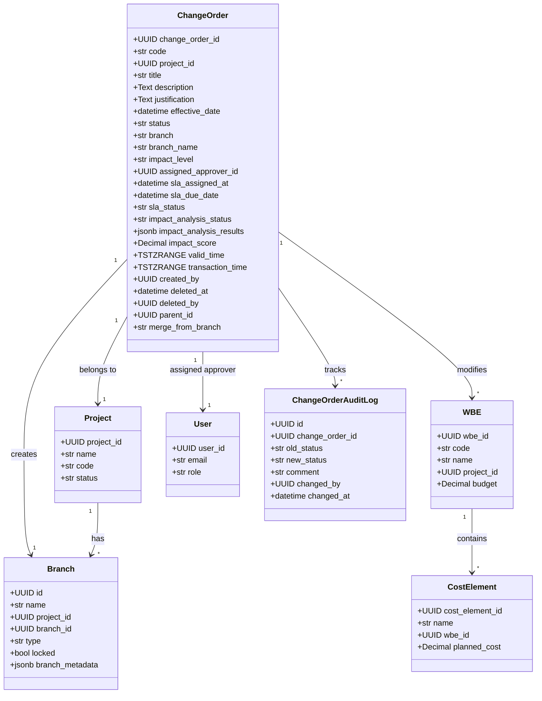
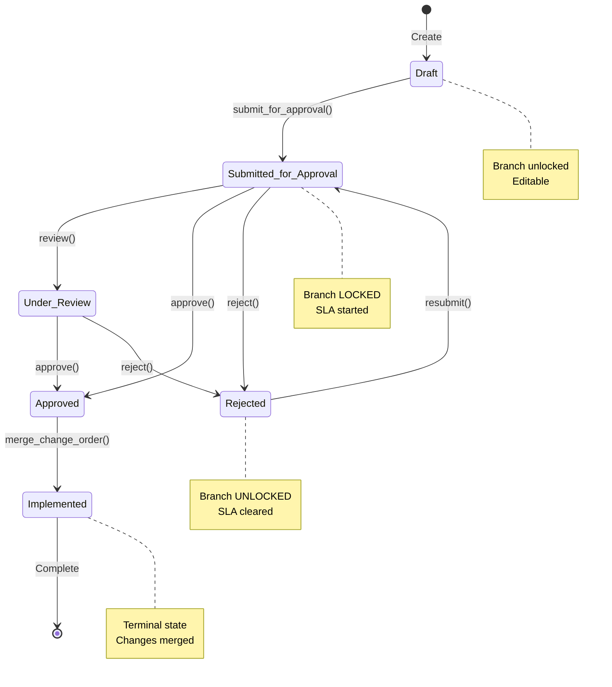
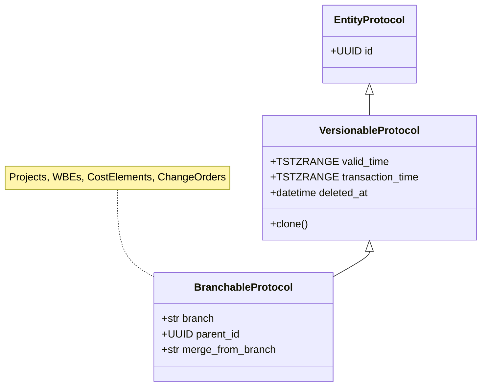
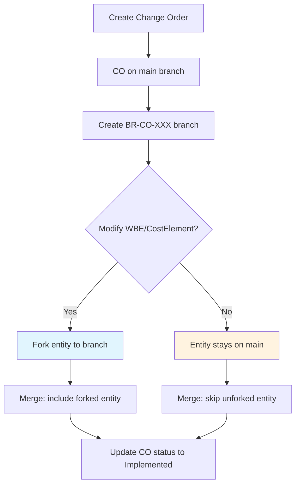
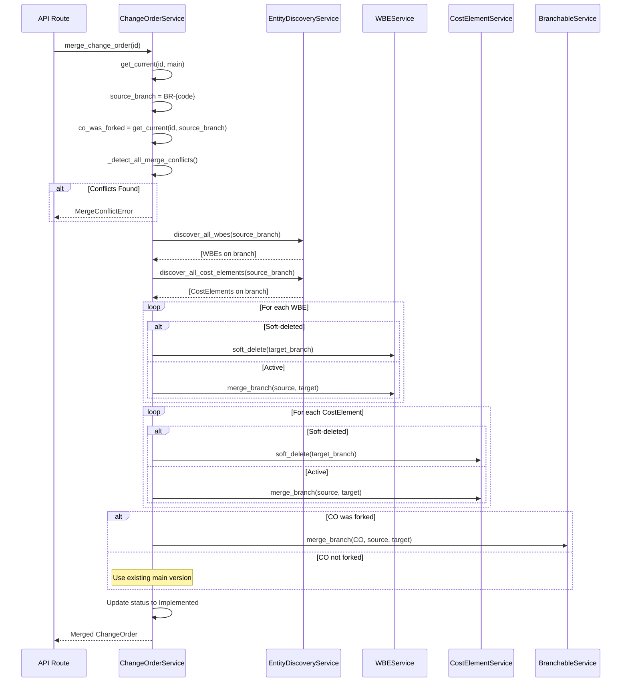

# Change Order Workflow & Architecture Guide

This document provides comprehensive documentation of the Change Order workflow and backend logic for the Backcast  project. It covers the entity model, state machine, workflow operations, EVCS architecture, and debugging guidance.

## 1. Overview

### Purpose of Change Orders

Change Orders (COs) in the Backcast  system manage modifications to project budgets, work breakdown elements (WBEs), and cost elements. They provide a structured approval workflow with impact analysis, SLA tracking, and complete audit trails.

### Key Concepts

- **EVCS (Entity Versioning Control System):** Git-style versioning with bitemporal tracking
- **Branch Isolation:** Each change order creates a dedicated branch (`BR-{code}`) for isolated modifications
- **Bitemporal Tracking:** Entities track both `valid_time` (business validity) and `transaction_time` (system record time)
- **Lazy Branching:** Entities are only forked to the change order branch when modified, not proactively

### Document Scope

This guide covers:
- Entity model and relationships
- Workflow state machine and transitions
- Branch isolation and merge operations
- Impact analysis and approval matrix
- API endpoints and usage examples
- Debugging common issues

**Intended Audience:** Developers, system administrators, and technical users working with the Change Order system.

---

## 2. Entity Model

### Class Diagram



### Field Reference

| Field | Type | Description |
|-------|------|-------------|
| `change_order_id` | UUID | Root identifier for EVCS versioning/branching |
| `code` | str(50) | Business identifier (e.g., "CO-2026-001") |
| `project_id` | UUID | Reference to the Project |
| `title` | str(200) | Brief title of the change |
| `description` | Text | Detailed description of what the change entails |
| `justification` | Text | Business justification for the change |
| `effective_date` | datetime | When the change should take effect (if approved) |
| `status` | str(50) | Workflow state (see State Machine) |
| `branch` | str | Branch name (default: 'main') |
| `branch_name` | str(80) | Change branch name (e.g., BR-CO-2026-001) |
| `impact_level` | str(20) | Financial impact (LOW/MEDIUM/HIGH/CRITICAL) |
| `assigned_approver_id` | UUID | User responsible for approval |
| `sla_assigned_at` | datetime | When approval SLA started |
| `sla_due_date` | datetime | SLA deadline for approval |
| `sla_status` | str(20) | SLA tracking (pending/approaching/overdue) |
| `impact_analysis_status` | str(20) | Analysis state (pending/in_progress/completed/failed/skipped) |
| `impact_analysis_results` | jsonb | KPI Scorecard results |
| `impact_score` | Decimal(10,2) | Weighted impact severity score |

---

## 3. Status State Machine

### State Diagram



### Valid Transitions

```python
_TRANSITIONS = {
    "Draft": ["Submitted for Approval"],
    "Submitted for Approval": ["Under Review", "Approved", "Rejected"],
    "Under Review": ["Approved", "Rejected"],
    "Rejected": ["Submitted for Approval"],
    "Approved": ["Implemented"],
    "Implemented": [],  # Terminal state
}
```

### Status Properties

| Status | Editable | Branch Lock | SLA Active |
|--------|----------|-------------|------------|
| Draft | Yes | No | No |
| Submitted for Approval | No | **Yes** | Yes |
| Under Review | No | Yes | Yes |
| Approved | No | Yes | Yes |
| Rejected | Yes | **No** | No |
| Implemented | No | No | No |

---

## 4. Workflow Methods

### Method Reference

| Method | From Status | To Status | Branch Lock | Side Effects |
|--------|-------------|-----------|-------------|--------------|
| `submit_for_approval()` | Draft | Submitted for Approval | **Lock** | Calculate impact, assign approver, set SLA |
| `approve_change_order()` | Submitted/Under Review | Approved | Stays locked | Audit log entry |
| `reject_change_order()` | Submitted/Under Review | Rejected | **Unlock** | Clear SLA fields |
| `merge_change_order()` | Approved | Implemented | Unlock | Merge entities, audit log |
| `archive_change_order_branch()` | Implemented/Rejected | - | - | Soft-delete branch |

### Method Signatures

#### submit_for_approval
```python
async def submit_for_approval(
    change_order_id: UUID,
    actor_id: UUID,
    branch: str = "main",
    comment: str | None = None,
) -> ChangeOrderPublic
```

**Validates:**
- Impact analysis must be completed
- Current status must be "Draft"
- Branch must not already be locked

**Side Effects:**
- Sets `status` to "Submitted for Approval"
- Locks branch via `BranchingService.lock_branch()`
- Assigns approver based on impact level
- Calculates SLA due date

#### approve_change_order
```python
async def approve_change_order(
    change_order_id: UUID,
    approver_id: UUID,
    actor_id: UUID,
    branch: str = "main",
    comments: str | None = None,
) -> ChangeOrderPublic
```

**Validates:**
- Approver has `change-order-approve` permission
- Current status is "Submitted for Approval" or "Under Review"

**Side Effects:**
- Sets `status` to "Approved"
- Creates audit log entry

#### reject_change_order
```python
async def reject_change_order(
    change_order_id: UUID,
    rejecter_id: UUID,
    actor_id: UUID,
    branch: str = "main",
    comments: str | None = None,
) -> ChangeOrderPublic
```

**Validates:**
- Rejecter has `change-order-approve` permission
- Current status is "Submitted for Approval" or "Under Review"

**Side Effects:**
- Sets `status` to "Rejected"
- **Unlocks branch** via `BranchingService.unlock_branch()`
- Clears SLA fields (`sla_assigned_at`, `sla_due_date`, `sla_status`)

#### merge_change_order
```python
async def merge_change_order(
    change_order_id: UUID,
    actor_id: UUID,
    target_branch: str = "main",
    control_date: datetime | None = None,
) -> ChangeOrderPublic
```

**Validates:**
- Current status must be "Approved"
- No merge conflicts exist

**Side Effects:**
- Merges all WBEs from source branch to target
- Merges all CostElements from source branch to target
- Merges ChangeOrder itself (if forked)
- Sets `status` to "Implemented"
- Creates audit log entry

---

## 5. EVCS Architecture

### 5.1 Protocol Hierarchy



### 5.2 Lazy Branching Pattern

The EVCS uses a "lazy branching" pattern where entities are only forked to a change order branch when they are actually modified, not proactively when the branch is created.



**Benefits:**
- Reduced storage overhead (only modified entities are duplicated)
- Faster branch creation
- Simpler merge for unmodified entities

### 5.3 Merge Flow



### 5.4 Branch Locking

Branches can be locked to prevent modifications during the approval process.

**Lock Conditions:**
- Status transition from "Draft" to "Submitted for Approval"
- Main branch is **never** locked

**Unlock Conditions:**
- Status transition to "Rejected"

**Implementation:**
```python
# Check in BranchableService
def _check_branch_lock(root_id: UUID, branch: str, entity_id: UUID | None = None) -> None:
    if branch == "main":
        return  # Main branch never locked

    branch_record = get_branch(branch)
    if branch_record and branch_record.locked:
        raise BranchLockedException(
            f"Branch '{branch}' is locked. Cannot modify entities.",
            branch=branch,
            entity_id=entity_id,
        )
```

---

## 6. Approval Matrix

### Impact Levels

| Impact Level | Budget Range | Required Authority | SLA (business days) |
|--------------|--------------|-------------------|---------------------|
| LOW | < €10,000 | Project Manager | 3 |
| MEDIUM | €10,000 - €50,000 | Department Head | 5 |
| HIGH | €50,000 - €100,000 | Director | 7 |
| CRITICAL | > €100,000 | Executive Committee | 10 |

### Impact Score Calculation

```
Score = (budget_delta_percent × 0.4) +
        (schedule_delta_percent × 0.3) +
        (revenue_delta_percent × 0.2) +
        (EVM_degradation × 0.1)

Impact Level Thresholds:
- Score < 10: LOW
- Score 10-30: MEDIUM
- Score 30-50: HIGH
- Score >= 50: CRITICAL
```

### SLA Status Tracking

| Status | Condition |
|--------|-----------|
| `pending` | More than 50% of SLA time remaining |
| `approaching` | Less than 50% of SLA time remaining |
| `overdue` | Past SLA due date |

---

## 7. Impact Analysis

### Overview

Impact analysis is automatically triggered when a Change Order is created and recalculated when entities are modified on the branch.

### Branch Modes

| Mode | Description | Use Case |
|------|-------------|----------|
| `MERGE` | Shows merged result (main + delta) | Default view, shows final state after merge |
| `STRICT` | Shows isolated comparison (delta only) | Understanding what changed without main context |

### Impact Components

The impact analysis includes:

1. **KPI Scorecard**
   - BAC (Budget at Completion)
   - Budget Delta (absolute and percentage)
   - Gross Margin (absolute and percentage)
   - Actual Costs

2. **Entity Changes**
   - Added WBEs/CostElements
   - Modified WBEs/CostElements
   - Removed WBEs/CostElements

3. **Waterfall Chart**
   - Cost bridge visualization showing flow from baseline to forecast

4. **Time Series**
   - Weekly S-curve data for cumulative costs

5. **EVM Metrics**
   - CPI (Cost Performance Index)
   - SPI (Schedule Performance Index)
   - TCPI (To-Complete Performance Index)
   - EAC (Estimate at Completion)
   - VAC (Variance at Completion)

---

## 8. Edge Cases

### 8.1 Unforked Change Order

**Scenario:** CO created but never modified on its branch.

**Behavior:**
- The ChangeOrder entity itself only exists on `main`
- During merge, the system checks if CO exists on source branch
- If not forked, the existing main version is used
- Only child entities (WBEs, CostElements) are merged
- Status still updates to "Implemented"

**Code Check:**
```python
co_on_branch = await self.get_current(change_order_id, source_branch)
co_was_forked = co_on_branch is not None

if co_was_forked:
    await self.merge_branch(change_order_id, source_branch, target_branch)
# else: use existing main version
```

### 8.2 Soft Delete Propagation

**Scenario:** Entity soft-deleted on source branch.

**Behavior:**
- `discover_all_*` methods include soft-deleted entities
- During merge, soft-deleted entities are identified
- Deletion is propagated to target branch via `soft_delete()` on target

**Code Flow:**
```python
all_wbes = await discovery.discover_all_wbes(source_branch)
for wbe in all_wbes:
    if wbe.deleted_at is not None:
        # Propagate soft delete
        await wbe_service.soft_delete(wbe.wbe_id, target_branch, actor_id)
    else:
        # Normal merge
        await wbe_service.merge_branch(wbe.wbe_id, source_branch, target_branch)
```

### 8.3 Branch Locking

**Scenario:** Attempt to modify entity on locked branch.

**Behavior:**
- `BranchLockedException` is raised
- Error includes branch name and entity ID
- Modification is blocked until branch is unlocked

**Error Response:**
```json
{
  "detail": "Branch 'BR-CO-2026-001' is locked. Cannot modify entities.",
  "branch": "BR-CO-2026-001",
  "entity_id": "uuid-here"
}
```

### 8.4 Merge Conflict

**Scenario:** Same entity modified on both source and target branches.

**Behavior:**
- Pre-merge conflict detection runs
- `MergeConflictError` raised with conflict details
- Merge is blocked until conflicts resolved

**Conflict Detection:**
```python
conflicts = await self._detect_all_merge_conflicts(source_branch, target_branch)
if conflicts:
    raise MergeConflictError(
        "Merge conflicts detected",
        conflicts=conflicts,
    )
```

**Conflict Structure:**
```json
{
  "entity_type": "WBE",
  "entity_id": "uuid-here",
  "field": "budget",
  "source_value": 50000,
  "target_value": 45000,
  "base_value": 40000
}
```

### 8.5 Historical Versions

**Scenario:** Entity modified multiple times on branch.

**Behavior:**
- Only the **current** version is merged (where `upper(valid_time) IS NULL`)
- Historical versions remain on source branch
- Target branch receives only the latest state

**Query Pattern:**
```sql
SELECT * FROM wbes
WHERE wbe_id = :id
  AND branch = :branch
  AND upper(valid_time) IS NULL  -- Current version only
  AND NOT isempty(valid_time)
  AND deleted_at IS NULL;
```

---

## 9. API Endpoints Summary

| Method | Endpoint | Purpose |
|--------|----------|---------|
| POST | `/change-orders` | Create CO |
| GET | `/change-orders` | List COs with pagination |
| GET | `/change-orders/{id}` | Get CO by UUID |
| GET | `/change-orders/by-code/{code}` | Get CO by business code |
| PUT | `/change-orders/{id}` | Update CO metadata |
| DELETE | `/change-orders/{id}` | Soft delete CO |
| GET | `/change-orders/{id}/history` | Version history |
| GET | `/change-orders/{id}/merge-conflicts` | Check merge conflicts |
| POST | `/change-orders/{id}/merge` | Merge to main |
| POST | `/change-orders/{id}/revert` | Revert to version |
| GET | `/change-orders/{id}/impact` | Impact analysis |
| PUT | `/change-orders/{id}/submit-for-approval` | Submit for approval |
| PUT | `/change-orders/{id}/approve` | Approve CO |
| PUT | `/change-orders/{id}/reject` | Reject CO |
| POST | `/change-orders/{id}/archive` | Archive branch |
| POST | `/change-orders/{id}/recover` | Admin recovery |
| GET | `/change-orders/{id}/approval-info` | Approval details |
| GET | `/change-orders/pending-approvals` | User's pending approvals |
| GET | `/change-orders/stats` | Aggregated statistics |
| GET | `/change-orders/next-code` | Next sequential code |

### RBAC Permissions

| Permission | Description |
|------------|-------------|
| `change-order-read` | View change orders |
| `change-order-create` | Create new change orders |
| `change-order-update` | Update change order metadata |
| `change-order-delete` | Soft delete change orders |
| `change-order-approve` | Approve/reject change orders |
| `change-order-recover` | Admin recovery operations |

---

## 10. Code Examples

### Create and Submit

```python
from uuid import UUID
from app.services.change_order_service import ChangeOrderService

# Initialize service
service = ChangeOrderService(session)

# Create change order
co = await service.create_change_order(
    project_id=UUID("..."),
    code="CO-2026-001",  # Or use get_next_code()
    title="Add emergency stop feature",
    description="Install emergency stop buttons at all workstations",
    justification="Safety requirement per ISO 13850",
    created_by=current_user.user_id,
)

# Submit for approval (triggers impact analysis, assigns approver, locks branch)
co = await service.submit_for_approval(
    change_order_id=co.change_order_id,
    actor_id=current_user.user_id,
    comment="Ready for review",
)

print(f"Status: {co.status}")  # "Submitted for Approval"
print(f"Branch: {co.branch_name}")  # "BR-CO-2026-001"
print(f"Impact Level: {co.impact_level}")  # e.g., "MEDIUM"
print(f"SLA Due: {co.sla_due_date}")
```

### Approve and Merge

```python
# Approve change order
co = await service.approve_change_order(
    change_order_id=co_id,
    approver_id=current_user.user_id,
    actor_id=current_user.user_id,
    comments="Approved - budget allocated for Q2",
)

# Merge to main branch
merged = await service.merge_change_order(
    change_order_id=co_id,
    actor_id=current_user.user_id,
    target_branch="main",
)

print(f"Status: {merged.status}")  # "Implemented"
```

### Merge with Conflict Handling

```python
from app.core.exceptions import MergeConflictError

try:
    merged = await service.merge_change_order(
        change_order_id=co_id,
        actor_id=user_id,
        target_branch="main",
    )
except MergeConflictError as e:
    print(f"Merge failed with {len(e.conflicts)} conflicts:")
    for conflict in e.conflicts:
        print(f"  {conflict['entity_type']} ({conflict['entity_id']})")
        print(f"    Field: {conflict['field']}")
        print(f"    Source: {conflict['source_value']}")
        print(f"    Target: {conflict['target_value']}")
        print(f"    Base: {conflict['base_value']}")
```

### Reject and Resubmit

```python
# Reject change order
co = await service.reject_change_order(
    change_order_id=co_id,
    rejecter_id=current_user.user_id,
    actor_id=current_user.user_id,
    comments="Budget not available this quarter",
)

print(f"Status: {co.status}")  # "Rejected"
print(f"Branch locked: False")  # Branch is now unlocked

# Make modifications on the unlocked branch...

# Resubmit
co = await service.submit_for_approval(
    change_order_id=co_id,
    actor_id=current_user.user_id,
    comment="Revised budget allocation",
)
```

### Check Merge Conflicts Before Merge

```python
# Pre-merge conflict check
conflicts = await service.get_merge_conflicts(
    change_order_id=co_id,
    source_branch="BR-CO-2026-001",
    target_branch="main",
)

if conflicts:
    print(f"Found {len(conflicts)} potential conflicts:")
    for c in conflicts:
        print(f"  - {c.entity_type}: {c.field}")
else:
    print("No conflicts detected - safe to merge")
```

### Get Impact Analysis

```python
from app.services.impact_analysis_service import ImpactAnalysisService

impact_service = ImpactAnalysisService(session)

# Get impact in MERGE mode (shows merged result)
impact = await impact_service.analyze_impact(
    change_order_id=co_id,
    branch_name="BR-CO-2026-001",
    branch_mode="MERGE",  # or "STRICT"
    include_evm_metrics=True,
)

print(f"Budget Delta: €{impact.kpi_scorecard.budget_delta:,.2f}")
print(f"Budget Delta %: {impact.kpi_scorecard.budget_delta_percent:.1f}%")
print(f"Impact Score: {impact.impact_score}")

# Entity changes
print(f"WBEs Added: {len(impact.entity_changes.wbes_added)}")
print(f"WBEs Modified: {len(impact.entity_changes.wbes_modified)}")
print(f"WBEs Removed: {len(impact.entity_changes.wbes_removed)}")
```

---

## 11. Debugging Guide

### Common Issues

#### 1. "No current version on source branch"

**Cause:** Lazy branching - the ChangeOrder entity was never forked to the source branch.

**Fix:** This is expected behavior. Check if entity exists on branch before merge:
```python
co_on_branch = await service.get_current(change_order_id, source_branch)
if co_on_branch is None:
    # Entity not forked - use main version
    pass
```

#### 2. BranchLockedException

**Cause:** Attempting to modify an entity on a locked branch (status is "Submitted for Approval" or "Under Review").

**Fix:**
- Wait for the change order to be approved or rejected
- Or reject the change order to unlock the branch

```python
# Check if branch is locked
branch = await branch_service.get_branch("BR-CO-2026-001")
if branch and branch.locked:
    print("Branch is locked - cannot modify")
```

#### 3. MergeConflictError

**Cause:** The same entity was modified on both the source and target branches.

**Fix:**
- Review conflict details to understand what changed
- Manually resolve by updating one side or the other
- Re-attempt merge after resolution

```python
# Pre-check for conflicts
conflicts = await service._detect_all_merge_conflicts(source_branch, target_branch)
for c in conflicts:
    # Log or display conflict details
    print(f"Conflict: {c}")
```

#### 4. "Insufficient authority"

**Cause:** User attempting to approve/reject lacks the `change-order-approve` permission.

**Fix:** Ensure user has appropriate role and permission:
```python
# Check user permissions
if not user.has_permission("change-order-approve"):
    raise HTTPException(403, "Insufficient authority to approve change orders")
```

#### 5. Impact Analysis Timeout

**Cause:** Large project with many entities causing analysis to exceed timeout.

**Fix:** Increase timeout or analyze in smaller batches:
```python
impact = await impact_service.analyze_impact(
    change_order_id=co_id,
    branch_name="BR-CO-2026-001",
    timeout_seconds=120,  # Increase from default 60
)
```

### Query Patterns

#### Current Version on Branch

```sql
SELECT * FROM change_orders
WHERE change_order_id = :id
  AND branch = :branch
  AND upper(valid_time) IS NULL
  AND NOT isempty(valid_time)
  AND deleted_at IS NULL;
```

#### Time Travel Query

```sql
SELECT * FROM change_orders
WHERE change_order_id = :id
  AND branch = :branch
  AND valid_time @> :as_of::timestamptz;
```

#### All Entities on Branch (Including Soft-Deleted)

```sql
-- WBEs
SELECT * FROM wbes
WHERE branch = :branch
  AND upper(valid_time) IS NULL
  AND NOT isempty(valid_time);

-- CostElements
SELECT * FROM cost_elements
WHERE branch = :branch
  AND upper(valid_time) IS NULL
  AND NOT isempty(valid_time);
```

#### Merge Conflict Detection

```sql
-- Find entities modified on both branches
SELECT
    s.wbe_id,
    s.budget as source_budget,
    t.budget as target_budget,
    b.budget as base_budget
FROM wbes s
JOIN wbes t ON s.wbe_id = t.wbe_id
JOIN wbes b ON s.wbe_id = b.wbe_id
WHERE s.branch = :source_branch
  AND t.branch = :target_branch
  AND b.branch = 'main'
  AND s.budget != t.budget;
```

#### SLA Status Check

```sql
SELECT
    change_order_id,
    code,
    status,
    sla_due_date,
    CASE
        WHEN sla_due_date < NOW() THEN 'overdue'
        WHEN sla_due_date < NOW() + INTERVAL '1 day' THEN 'approaching'
        ELSE 'pending'
    END as calculated_sla_status
FROM change_orders
WHERE status IN ('Submitted for Approval', 'Under Review', 'Approved')
  AND deleted_at IS NULL;
```

### Logging and Tracing

Enable debug logging for change order operations:

```python
import logging

# Enable debug logging for services
logging.getLogger("app.services.change_order_service").setLevel(logging.DEBUG)
logging.getLogger("app.services.impact_analysis_service").setLevel(logging.DEBUG)
logging.getLogger("app.core.branching").setLevel(logging.DEBUG)
```

---

## Appendix A: Status Constants

```python
class ChangeOrderStatus:
    DRAFT = "Draft"
    SUBMITTED_FOR_APPROVAL = "Submitted for Approval"
    UNDER_REVIEW = "Under Review"
    APPROVED = "Approved"
    REJECTED = "Rejected"
    IMPLEMENTED = "Implemented"

class ImpactLevel:
    LOW = "LOW"        # < €10,000
    MEDIUM = "MEDIUM"  # €10,000 - €50,000
    HIGH = "HIGH"      # €50,000 - €100,000
    CRITICAL = "CRITICAL"  # > €100,000

class SLAStatus:
    PENDING = "pending"
    APPROACHING = "approaching"
    OVERDUE = "overdue"

class ImpactAnalysisStatus:
    PENDING = "pending"
    IN_PROGRESS = "in_progress"
    COMPLETED = "completed"
    FAILED = "failed"
    SKIPPED = "skipped"
```

## Appendix B: SLA Configuration

```python
SLA_BUSINESS_DAYS = {
    "LOW": 3,
    "MEDIUM": 5,
    "HIGH": 7,
    "CRITICAL": 10,
}
```

## Appendix C: Related Files

| File | Description |
|------|-------------|
| `backend/app/models/domain/change_order.py` | Domain model |
| `backend/app/services/change_order_service.py` | Main service |
| `backend/app/services/change_order_workflow_service.py` | Workflow state machine |
| `backend/app/services/impact_analysis_service.py` | Impact analysis |
| `backend/app/services/entity_discovery_service.py` | Entity discovery for merge |
| `backend/app/core/branching/service.py` | Branch management |
| `backend/app/core/branching/exceptions.py` | Branch exceptions |
| `backend/app/api/routes/change_orders.py` | API endpoints |
