# EVCS User Guide: Working with Versioned Entities

**Version:** 1.0
**Last Updated:** 2026-01-11
**Target Audience:** Backend Developers, API Consumers, System Architects

---

## Table of Contents

1. [Introduction](#introduction)
2. [Understanding the EVCS Architecture](#understanding-the-evcs-architecture)
3. [Core Concepts](#core-concepts)
4. [Use Case 1: Basic CRUD Operations](#use-case-1-basic-crud-operations)
5. [Use Case 2: Version History & Time Travel](#use-case-2-version-history--time-travel)
6. [Use Case 3: Control Date Operations](#use-case-3-control-date-operations)
7. [Use Case 4: Branching for Change Orders](#use-case-4-branching-for-change-orders)
8. [Use Case 5: Hierarchical WBE Management](#use-case-5-hierarchical-wbe-management)
9. [Use Case 6: Revert Operations](#use-case-6-revert-operations)
10. [API Reference Summary](#api-reference-summary)
11. [Best Practices](#best-practices)
12. [Common Patterns & Recipes](#common-patterns--recipes)

---

## Introduction

### What is EVCS?

The **Entity Versioning Control System (EVCS)** is a core component of Backcast EVS that provides Git-like versioning capabilities for all database entities. Just as Git tracks every change to source code, EVCS tracks every change to business entities with complete audit trails and the ability to query historical states.

### Why EVCS Matters

In project budget management and EVM (Earned Value Management) systems, you need to:

- **Track every change** to budgets, WBE structures, and cost elements
- **View historical states** for audit reporting and variance analysis
- **Isolate changes** in branches for change order approval workflows
- **Correct errors** retroactively while maintaining data integrity
- **Recover deleted data** when mistakes are made

EVCS provides all of these capabilities through a unified, consistent API.

### The WBE Entity: Our Working Example

This guide uses the **WBE (Work Breakdown Element)** entity as the primary example because it demonstrates all EVCS capabilities:

- **Hierarchical structure** (parent-child relationships)
- **Version tracking** for budget changes
- **Branch isolation** for change orders
- **Time travel queries** for historical reporting

### EVCS Capabilities Overview

| Capability | Description | Use Case |
|------------|-------------|----------|
| **Complete History** | Every change creates a new immutable version | Audit trails, compliance |
| **Time Travel** | Query entity state at any past point in time | Historical reports, variance analysis |
| **Branch Isolation** | Develop changes in isolation before merging | Change order workflows |
| **Bitemporal Tracking** | Track both business time and system time | Correction of historical data |
| **Soft Delete** | Reversible deletion with recovery capability | Accidental deletion recovery |

---

## Understanding the EVCS Architecture

### Entity Lifecycle and Version Chain

Every versioned entity follows a predictable lifecycle where updates create new versions linked in a chain:

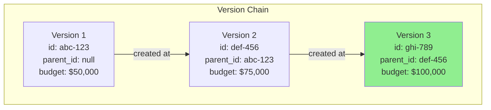

**Key Points:**

- Each version has a unique `id` (UUID)
- The `wbe_id` (root ID) stays constant across all versions
- `parent_id` links each version to its predecessor
- Only the latest version is "current" (highlighted in green)

### Bitemporal Tracking

EVCS uses two temporal dimensions to track when data is valid and when it was recorded:

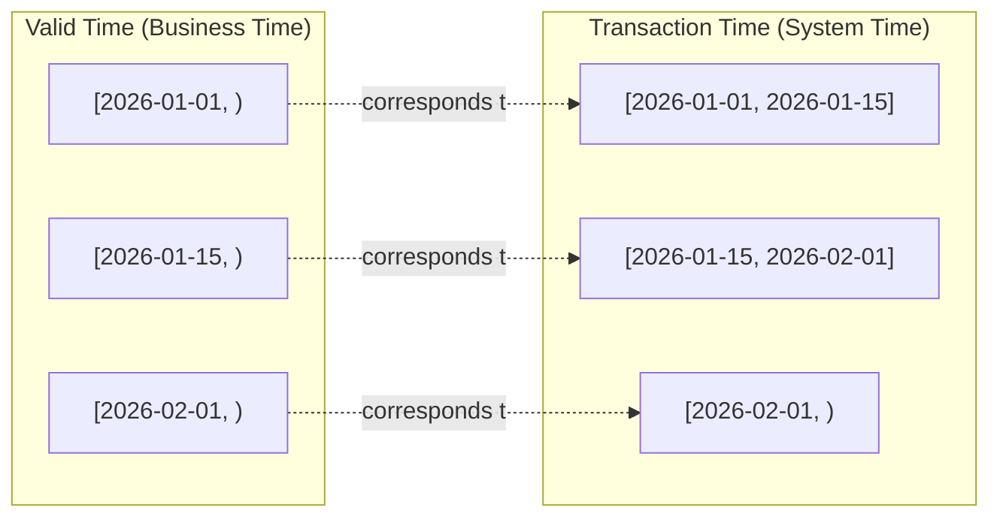

**Understanding the Two Time Dimensions:**

| Dimension | Meaning | Example |
|-----------|---------|---------|
| **Valid Time** | When the data is/was valid in the real world | "This budget was valid from Jan 1 to Feb 1" |
| **Transaction Time** | When the data was recorded in the system | "This record was entered on Jan 15" |

**Why Two Dimensions?**

- **Corrections**: You can record today that a budget change should have been effective last week
- **Audit Trails**: See both what was known when, and when corrections were made
- **Point-in-Time Queries**: Ask "What did we believe on March 1?" vs "What was true on March 1?"

### Branch Isolation and Merge Flow

Branches allow you to work on changes in isolation, similar to Git branches:

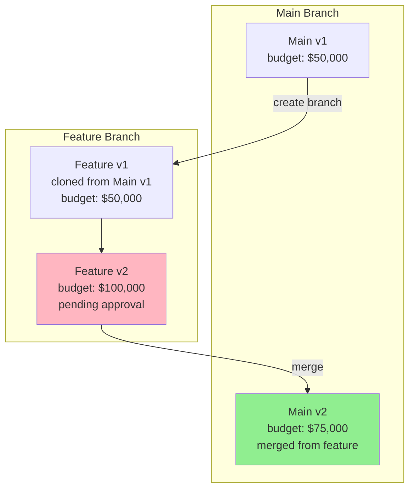

**Branch Use Cases:**

- **Change Orders**: Work on budget changes while main stays stable
- **What-If Scenarios**: Model changes without affecting production
- **Parallel Development**: Multiple changes on same entity

---

## Core Concepts

### Root ID vs Version ID

Every versioned entity has TWO important identifiers:

```python
# Version ID (id): Changes with each version
version_id = "abc-123-def-456"  # Unique to this specific version

# Root ID (wbe_id): Stable across all versions
wbe_id = "wbe-root-789"  # Same for all versions of this WBE
```

| Identifier | Purpose | Stability | Use When |
|------------|---------|-----------|----------|
| **Root ID** | Identifies the logical entity | Never changes | Fetching current state, updates, history |
| **Version ID** | Identifies a specific version | Changes each update | Referencing specific historical state, parent linking |

**Practical Example:**

```bash
# Get current state (uses root ID)
GET /api/v1/wbes/{wbe_id}

# Get specific version (uses version ID)
GET /api/v1/wbes/{version_id}?include_history=true
```

### Branches: Main vs Feature

Branches isolate changes to prevent interference:

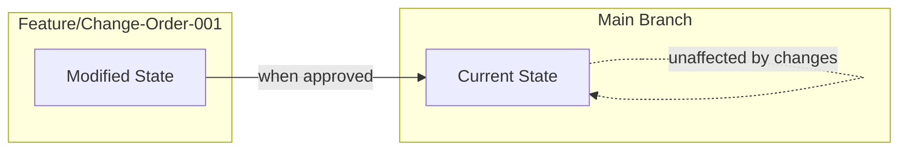

**Branch Naming Conventions:**

- `main` - Production state, always current
- `feature/{name}` - Feature development
- `change-order-{number}` - Formal change order workflow
- `sandbox/{user}` - Personal experimentation space

**Branch Isolation Rules:**

- Updates on `main` don't affect feature branches
- Updates on feature branches don't affect `main` until merged
- Multiple branches can exist simultaneously
- Merges are one-directional (typically feature → main)

### Temporal Ranges: Open-Ended vs Closed

Temporal ranges use PostgreSQL's `TSTZRANGE` type:

```python
# Open-ended range (current version)
valid_time = "[2026-01-01 10:00:00+00, )"  # No upper bound

# Closed range (historical version)
valid_time = "[2026-01-01 10:00:00+00, 2026-02-01 10:00:00+00)"
```

**Visual Representation:**

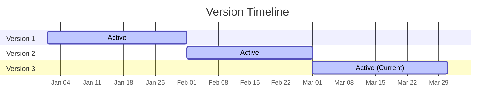

**Querying by Temporal State:**

```bash
# Get current version (default)
GET /api/v1/wbes/{wbe_id}

# Get state as of specific date (time travel)
GET /api/v1/wbes/{wbe_id}?as_of=2026-02-15T10:00:00+00
```

### Version DAG: Parent-Child Relationships

While versions form a chain within a branch, the overall structure is a Directed Acyclic Graph (DAG):

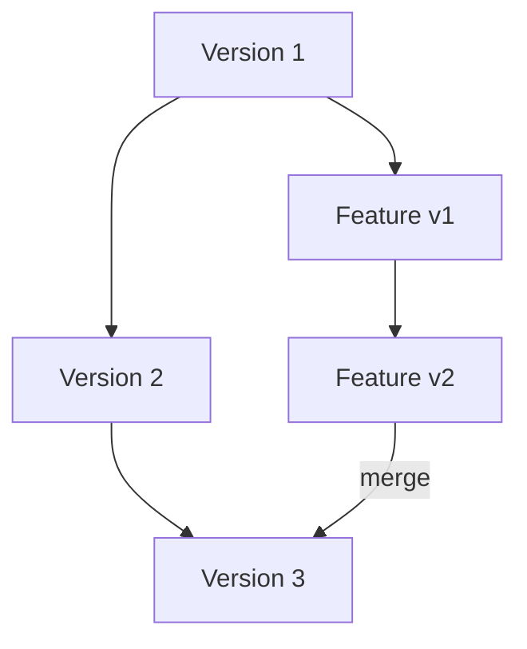

**DAG Properties:**

- Each version has exactly one `parent_id`
- A version can have multiple children (branching)
- No cycles (can't merge into an ancestor)
- Enables flexible workflow patterns

---

## Use Case 1: Basic CRUD Operations

### Scenario

You are setting up a new project and need to create the initial WBE (Work Breakdown Element) hierarchy. This includes creating parent WBEs, child WBEs, updating budget allocations, and querying WBEs by project.

### Step-by-Step Example

#### Step 1: Create a Parent WBE

First, create a top-level WBE for Phase 1 of the project:

```bash
POST /api/v1/wbes
Content-Type: application/json

{
  "project_id": "550e8400-e29b-41d4-a716-446655440000",
  "code": "1.0",
  "name": "Phase 1 - Foundation",
  "budget_allocation": 100000.00,
  "level": 1,
  "description": "Initial foundation work for the building"
}
```

**Response (201 Created):**

```json
{
  "id": "wbe-v1-abc-123",
  "wbe_id": "wbe-root-789",
  "project_id": "550e8400-e29b-41d4-a716-446655440000",
  "code": "1.0",
  "name": "Phase 1 - Foundation",
  "budget_allocation": "100000.00",
  "level": 1,
  "description": "Initial foundation work for the building",
  "branch": "main",
  "parent_id": null,
  "valid_time": "[2026-01-11T10:00:00+00,)",
  "transaction_time": "[2026-01-11T10:00:00+00,)",
  "deleted_at": null
}
```

**Key Points:**

- `id` is the version-specific UUID (changes on updates)
- `wbe_id` is the root UUID (stable across all versions)
- `valid_time` and `transaction_time` are open-ended (current version)
- `parent_id` is `null` (first version has no parent)

#### Step 2: Create Child WBEs

Now create child WBEs under the parent:

```bash
POST /api/v1/wbes
Content-Type: application/json

{
  "project_id": "550e8400-e29b-41d4-a716-446655440000",
  "parent_wbe_id": "wbe-root-789",
  "code": "1.1",
  "name": "Site Preparation",
  "budget_allocation": 30000.00,
  "level": 2
}
```

**Response (201 Created):**

```json
{
  "id": "wbe-child1-v1-def-456",
  "wbe_id": "wbe-child-root-456",
  "parent_wbe_id": "wbe-root-789",
  "code": "1.1",
  "name": "Site Preparation",
  "budget_allocation": "30000.00",
  "level": 2,
  "branch": "main",
  "parent_id": null
}
```

Create another child:

```bash
POST /api/v1/wbes
Content-Type: application/json

{
  "project_id": "550e8400-e29b-41d4-a716-446655440000",
  "parent_wbe_id": "wbe-root-789",
  "code": "1.2",
  "name": "Foundation Pouring",
  "budget_allocation": 70000.00,
  "level": 2
}
```

#### Step 3: Update WBE Budget Allocation

Increase the budget for the parent WBE:

```bash
PUT /api/v1/wbes/wbe-root-789
Content-Type: application/json

{
  "budget_allocation": 120000.00,
  "description": "Updated foundation scope including additional excavation"
}
```

**Response (200 OK):**

```json
{
  "id": "wbe-v2-ghi-789",
  "wbe_id": "wbe-root-789",
  "budget_allocation": "120000.00",
  "description": "Updated foundation scope including additional excavation",
  "branch": "main",
  "parent_id": "wbe-v1-abc-123",
  "valid_time": "[2026-01-11T11:00:00+00,)",
  "transaction_time": "[2026-01-11T11:00:00+00,)"
}
```

**Important Notes:**

- A NEW version was created (`id` changed)
- `parent_id` now points to the previous version
- The original version (v1) is still in the database for historical tracking
- `valid_time` and `transaction_time` have been updated

#### Step 4: Query WBEs by Project

Retrieve all WBEs for a specific project:

```bash
GET /api/v1/wbes?project_id=550e8400-e29b-41d4-a716-446655440000
```

**Response (200 OK):**

```json
[
  {
    "wbe_id": "wbe-root-789",
    "code": "1.0",
    "name": "Phase 1 - Foundation",
    "budget_allocation": "120000.00",
    "level": 1,
    "parent_name": null
  },
  {
    "wbe_id": "wbe-child-root-456",
    "code": "1.1",
    "name": "Site Preparation",
    "budget_allocation": "30000.00",
    "level": 2,
    "parent_name": "Phase 1 - Foundation"
  },
  {
    "wbe_id": "wbe-child-root-789",
    "code": "1.2",
    "name": "Foundation Pouring",
    "budget_allocation": "70000.00",
    "level": 2,
    "parent_name": "Phase 1 - Foundation"
  }
]
```

**Additional Query Options:**

```bash
# Filter by parent
GET /api/v1/wbes?parent_wbe_id=wbe-root-789

# Search by code or name
GET /api/v1/wbes?search=foundation

# Pagination
GET /api/v1/wbes?skip=0&limit=20

# Sort by field
GET /api/v1/wbes?sort_by=budget_allocation&order=desc
```

### Diagram: Basic CRUD Flow

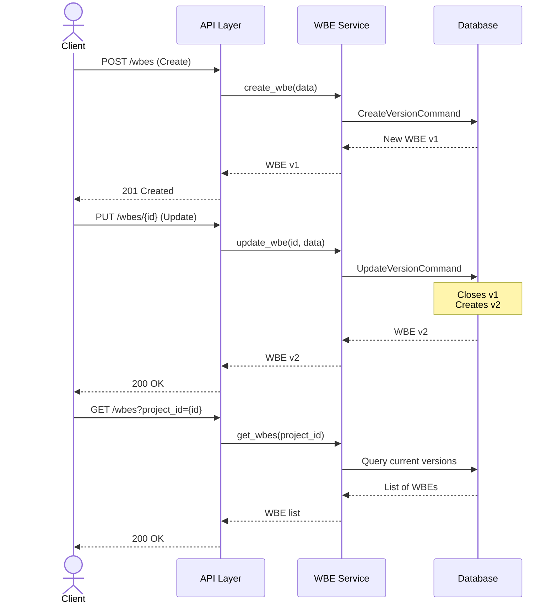

### Code Reference

This use case is based on test cases from:

- [`backend/tests/api/test_wbes.py`](../../backend/tests/api/test_wbes.py):
  - `test_create_wbe` - Lines 86-112
  - `test_update_wbe` - Lines 197-226
  - `test_get_wbes_by_project` - Lines 142-167
  - `test_wbe_hierarchical_structure` - Lines 294-327

---

## Use Case 2: Version History & Time Travel

### Scenario

You need to track budget changes over time for audit reporting and variance analysis. Stakeholders want to know:

- What was the budget at the beginning of the project?
- How has it changed over time?
- What was the budget on a specific date?

### Step-by-Step Example

#### Step 1: Create Initial WBE

```bash
POST /api/v1/wbes
Content-Type: application/json

{
  "project_id": "550e8400-e29b-41d4-a716-446655440000",
  "code": "2.0",
  "name": "Phase 2 - Structure",
  "budget_allocation": 50000.00,
  "level": 1
}
```

**Response:**

```json
{
  "id": "wbe-v1-jkl-012",
  "wbe_id": "wbe-root-012",
  "name": "Phase 2 - Structure",
  "budget_allocation": "50000.00",
  "valid_time": "[2026-01-01T10:00:00+00,)",
  "transaction_time": "[2026-01-01T10:00:00+00,)"
}
```

#### Step 2: First Budget Update

```bash
PUT /api/v1/wbes/wbe-root-012
Content-Type: application/json

{
  "budget_allocation": 75000.00
}
```

**Result:** Version 2 is created

```json
{
  "id": "wbe-v2-mno-345",
  "wbe_id": "wbe-root-012",
  "budget_allocation": "75000.00",
  "parent_id": "wbe-v1-jkl-012",
  "valid_time": "[2026-01-15T10:00:00+00,)"
}
```

**Behind the scenes:**

- Version 1's `valid_time` is closed: `[2026-01-01, 2026-01-15)`
- Version 2's `valid_time` starts: `[2026-01-15, )`

#### Step 3: Second Budget Update

```bash
PUT /api/v1/wbes/wbe-root-012
Content-Type: application/json

{
  "budget_allocation": 100000.00
}
```

**Result:** Version 3 is created

```json
{
  "id": "wbe-v3-pqr-678",
  "wbe_id": "wbe-root-012",
  "budget_allocation": "100000.00",
  "parent_id": "wbe-v2-mno-345",
  "valid_time": "[2026-02-01T10:00:00+00,)"
}
```

#### Step 4: Retrieve Version History

Get the complete history of the WBE:

```bash
GET /api/v1/wbes/wbe-root-012/history
```

**Response:**

```json
[
  {
    "id": "wbe-v1-jkl-012",
    "name": "Phase 2 - Structure",
    "budget_allocation": "50000.00",
    "valid_time": "[2026-01-01T10:00:00+00,2026-01-15T10:00:00+00)",
    "transaction_time": "[2026-01-01T10:00:00+00,2026-01-15T10:00:00+00)",
    "parent_id": null
  },
  {
    "id": "wbe-v2-mno-345",
    "name": "Phase 2 - Structure",
    "budget_allocation": "75000.00",
    "valid_time": "[2026-01-15T10:00:00+00,2026-02-01T10:00:00+00)",
    "transaction_time": "[2026-01-15T10:00:00+00,2026-02-01T10:00:00+00)",
    "parent_id": "wbe-v1-jkl-012"
  },
  {
    "id": "wbe-v3-pqr-678",
    "name": "Phase 2 - Structure",
    "budget_allocation": "100000.00",
    "valid_time": "[2026-02-01T10:00:00+00,)",
    "transaction_time": "[2026-02-01T10:00:00+00,)",
    "parent_id": "wbe-v2-mno-345"
  }
]
```

#### Step 5: Time Travel - Query Historical State

**Question:** What was the budget on January 20th?

```bash
GET /api/v1/wbes/wbe-root-012?as_of=2026-01-20T10:00:00+00
```

**Response:**

```json
{
  "id": "wbe-v2-mno-345",
  "wbe_id": "wbe-root-012",
  "name": "Phase 2 - Structure",
  "budget_allocation": "75000.00",
  "valid_time": "[2026-01-15T10:00:00+00,2026-02-01T10:00:00+00)",
  "transaction_time": "[2026-01-15T10:00:00+00,2026-02-01T10:00:00+00)"
}
```

**More Time Travel Examples:**

```bash
# Before the WBE existed (returns 404)
GET /api/v1/wbes/wbe-root-012?as_of=2025-12-01T10:00:00+00

# During version 1 (returns v1)
GET /api/v1/wbes/wbe-root-012?as_of=2026-01-10T10:00:00+00

# During version 2 (returns v2)
GET /api/v1/wbes/wbe-root-012?as_of=2026-01-20T10:00:00+00

# Current state (returns v3)
GET /api/v1/wbes/wbe-root-012
```

### Diagram: Version Chain with Temporal Ranges

```mermaid
gantt
    title WBE Budget Evolution Over Time
    dateFormat  YYYY-MM-DD
    axisFormat  %b %d

    section Version 1
    Budget: $50,000    :active, 2026-01-01, 14d
    section Version 2
    Budget: $75,000    :active, 2026-01-15, 17d
    section Version 3
    Budget: $100,000   :active, 2026-02-01, 30d
```

### Practical Applications

| Use Case | Query | Value |
|----------|-------|-------|
| Beginning budget | `as_of=2026-01-01` | $50,000 |
| Mid-project budget | `as_of=2026-01-20` | $75,000 |
| Current budget | (no as_of) | $100,000 |
| Complete audit trail | `/history` endpoint | All versions |

### Code Reference

This use case is based on test cases from:

- [`backend/tests/api/test_wbes.py`](../../backend/tests/api/test_wbes.py):
  - `test_get_wbe_history` - Lines 260-291
- [`backend/tests/api/test_time_machine.py`](../../backend/tests/api/test_time_machine.py):
  - `test_wbe_time_travel_basic` - Basic time travel queries
  - `test_wbe_time_travel_update` - Querying across updates

---

## Use Case 3: Control Date Operations

### Scenario

You discover that a budget change was recorded with the wrong date, or you need to enter a change that should have been effective in the past. Control dates allow you to specify exactly when a change should be effective, rather than using the current system time.

### Why Control Dates Matter

**Problem:** On February 1st, you realize a budget increase was approved on January 15th but never recorded. Without control dates, the change would be recorded with a February 1st date, making audit reports inaccurate.

**Solution:** Use `control_date` to specify when the change should have been effective.

### Step-by-Step Example

#### Step 1: Create WBE with Future Control Date

Create a WBE that becomes effective on a specific future date:

```bash
POST /api/v1/wbes
Content-Type: application/json

{
  "project_id": "550e8400-e29b-41d4-a716-446655440000",
  "code": "3.0",
  "name": "Phase 3 - Finishing",
  "budget_allocation": 100000.00,
  "level": 1,
  "control_date": "2026-03-01T10:00:00+00"
}
```

**Response:**

```json
{
  "id": "wbe-v1-stu-901",
  "wbe_id": "wbe-root-901",
  "name": "Phase 3 - Finishing",
  "budget_allocation": "100000.00",
  "valid_time": "[2026-03-01T10:00:00+00,)",
  "transaction_time": "[2026-01-11T10:00:00+00,)"
}
```

**Key Observations:**

- `valid_time` starts at the `control_date` (March 1)
- `transaction_time` starts at the actual time of creation (January 11)
- The WBE won't appear in queries until March 1 unless you use time travel

#### Step 2: Update with Past Control Date (Correction)

You discover that a budget should have been increased on January 15th, but it's now February 1st:

```bash
PUT /api/v1/wbes/wbe-root-901
Content-Type: application/json

{
  "budget_allocation": 120000.00,
  "control_date": "2026-01-15T10:00:00+00"
}
```

**Response:**

```json
{
  "id": "wbe-v2-vwx-234",
  "wbe_id": "wbe-root-901",
  "budget_allocation": "120000.00",
  "parent_id": "wbe-v1-stu-901",
  "valid_time": "[2026-01-15T10:00:00+00,)",
  "transaction_time": "[2026-02-01T10:00:00+00,)"
}
```

**What Happened:**

1. Version 1's `valid_time` is closed at January 15th (not February 1st!)
2. Version 2's `valid_time` starts at January 15th
3. Version 2's `transaction_time` starts at February 1st (when actually recorded)
4. Time travel queries before January 15th show no WBE
5. Time travel queries on January 20th show the $120,000 budget

#### Step 3: Delete with Control Date

A WBE that was deleted should have been deleted earlier:

```bash
DELETE /api/v1/wbes/wbe-root-901?control_date=2026-02-15T10:00:00+00
```

**Response:** 204 No Content

**Verification:**

```bash
# Query BEFORE control date - WBE still exists
GET /api/v1/wbes/wbe-root-901?as_of=2026-02-14T10:00:00+00
# Response: 200 OK with WBE data

# Query AFTER control date - WBE is deleted
GET /api/v1/wbes/wbe-root-901?as_of=2026-02-16T10:00:00+00
# Response: 404 Not Found
```

### Diagram: Control Date Temporal Positioning

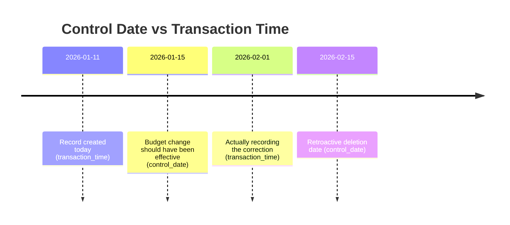

**Visual Representation of Valid vs Transaction Time:**

| Version | Valid Time | Transaction Time | Notes |
|---------|------------|------------------|-------|
| v1 | `[2026-03-01, )` | `[2026-01-11, 2026-02-01)` | Created for future |
| v2 | `[2026-01-15, )` | `[2026-02-01, 2026-02-15)` | Retroactive update |
| v3 (deleted) | - | `[2026-02-15, )` | Retroactive deletion |

### When to Use Control Dates

| Scenario | Control Date | Transaction Time |
|----------|--------------|------------------|
| Future effective change | Future date | Now |
| Correcting past errors | Past date | Now |
| Regular operations | Omit (defaults to now) | Now |
| Bulk data import | Various dates | Now |

### Code Reference

This use case is based on test cases from:

- [`backend/tests/api/test_wbes.py`](../../backend/tests/api/test_wbes.py):
  - `test_create_wbe_with_control_date` - Lines 329-354
  - `test_update_wbe_with_control_date` - Lines 357-387
  - `test_delete_wbe_with_control_date` - Lines 390-425

---

## Use Case 4: Branching for Change Orders

### Scenario

A change order is requested to increase the budget for a WBE. Before approval, the changes need to be isolated from the main production state. Once approved, the changes are merged into main. If rejected, the branch is discarded.

### Business Context

**Change Order Workflow:**

1. Request: Stakeholder requests budget increase
2. Branch: Create isolated branch for the change
3. Modify: Make changes on the branch
4. Review: Stakeholders review changes
5. Decision: Approve (merge) or Reject (discard branch)
6. Audit: Complete history of the change order process

### Step-by-Step Example

#### Step 1: Initial State on Main Branch

Start with a WBE on the main branch:

```bash
GET /api/v1/wbes/wbe-root-co1
```

**Response (Main Branch):**

```json
{
  "id": "wbe-main-v1-abc",
  "wbe_id": "wbe-root-co1",
  "code": "4.0",
  "name": "Phase 4 - MEP Systems",
  "budget_allocation": "80000.00",
  "branch": "main",
  "valid_time": "[2026-01-01T10:00:00+00,)"
}
```

#### Step 2: Create Change Order Branch

Create a new branch for the change order:

```bash
POST /api/v1/wbes/wbe-root-co1/branches
Content-Type: application/json

{
  "new_branch": "change-order-001",
  "from_branch": "main"
}
```

**Response:**

```json
{
  "id": "wbe-BR-v1-def",
  "wbe_id": "wbe-root-co1",
  "code": "4.0",
  "name": "Phase 4 - MEP Systems",
  "budget_allocation": "80000.00",
  "branch": "change-order-001",
  "parent_id": "wbe-main-v1-abc",
  "valid_time": "[2026-01-11T10:00:00+00,)",
  "merge_from_branch": null
}
```

**What Happened:**

- A new version was created on the `change-order-001` branch
- It's a clone of the main branch version
- `parent_id` links to the main version
- Both branches now have current versions

#### Step 3: Modify Budget on Change Order Branch

Update the budget on the change order branch:

```bash
PUT /api/v1/wbes/wbe-root-co1
Content-Type: application/json

{
  "budget_allocation": "120000.00",
  "branch": "change-order-001"
}
```

**Response:**

```json
{
  "id": "wbe-BR-v2-ghi",
  "wbe_id": "wbe-root-co1",
  "budget_allocation": "120000.00",
  "branch": "change-order-001",
  "parent_id": "wbe-BR-v1-def",
  "valid_time": "[2026-01-11T11:00:00+00,)"
}
```

**Verification - Main is Unaffected:**

```bash
GET /api/v1/wbes/wbe-root-co1?branch=main
```

**Still shows:** `budget_allocation: "80000.00"`

**Verification - Change Order Shows New Value:**

```bash
GET /api/v1/wbes/wbe-root-co1?branch=change-order-001
```

**Now shows:** `budget_allocation: "120000.00"`

#### Step 4: Review Changes (Before Merge)

Compare the branches:

```bash
GET /api/v1/wbes/wbe-root-co1/compare?from_branch=main&to_branch=change-order-001
```

**Response:**

```json
{
  "main": {
    "budget_allocation": "80000.00",
    "version_id": "wbe-main-v1-abc"
  },
  "change-order-001": {
    "budget_allocation": "120000.00",
    "version_id": "wbe-BR-v2-ghi"
  },
  "differences": [
    {
      "field": "budget_allocation",
      "from": "80000.00",
      "to": "120000.00",
      "change": "+40000.00 (+50%)"
    }
  ]
}
```

#### Step 5: Approve and Merge to Main

Stakeholders approve the change order. Merge to main:

```bash
POST /api/v1/wbes/wbe-root-co1/branches/merge
Content-Type: application/json

{
  "source_branch": "change-order-001",
  "target_branch": "main"
}
```

**Response:**

```json
{
  "id": "wbe-main-v2-jkl",
  "wbe_id": "wbe-root-co1",
  "budget_allocation": "120000.00",
  "branch": "main",
  "parent_id": "wbe-main-v1-abc",
  "merge_from_branch": "change-order-001",
  "valid_time": "[2026-01-11T12:00:00+00,)"
}
```

**What Happened:**

- A new version was created on main
- It has the budget from the change order branch ($120,000)
- `merge_from_branch` tracks the source of the merge
- `parent_id` maintains the linear history on main
- The change order branch still exists (for audit)

#### Alternative Step 5: Reject and Discard

If the change order is rejected:

```bash
DELETE /api/v1/wbes/wbe-root-co1/branches/change-order-001
```

**Result:**

- Change order branch is deleted
- Main branch remains unchanged
- No audit trail of the rejected change (unless explicitly tracked)

### Diagram: Branch Creation, Isolation, and Merge

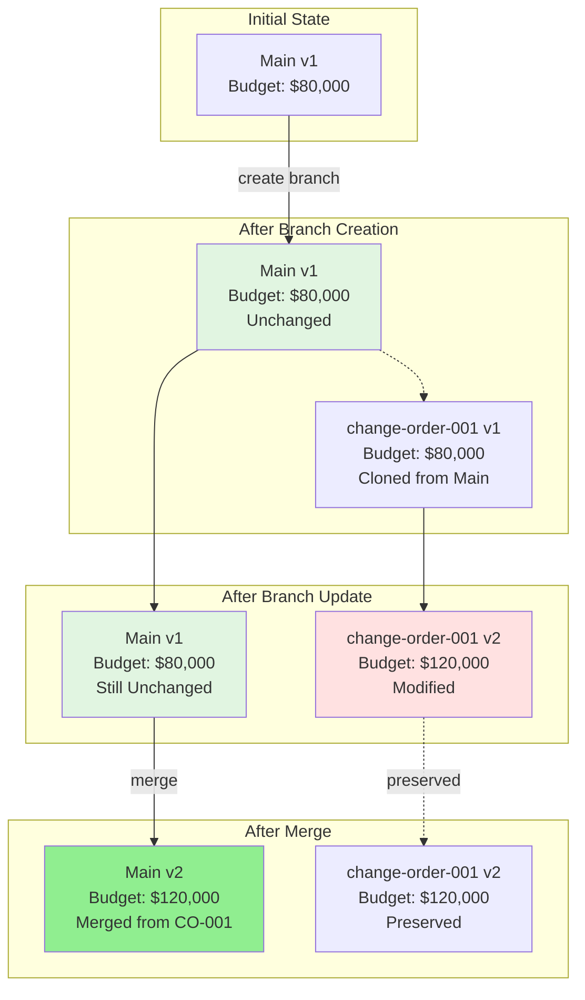

### Branch Isolation Rules

| Operation | Main Branch | Feature Branch |
|-----------|-------------|----------------|
| Read main | ✅ Current state | ✅ Sees snapshot from branch point |
| Read feature | ❌ Not visible | ✅ Current state |
| Update main | ✅ Creates new version on main | ❌ No effect |
| Update feature | ❌ No effect | ✅ Creates new version on feature |
| Merge to main | ✅ Creates new version from feature | ❌ No effect |

### Code Reference

This use case is based on test cases from:

- [`backend/tests/unit/core/versioning/test_branch_commands.py`](../../backend/tests/unit/core/versioning/test_branch_commands.py):
  - `test_create_branch_command` - Lines 21-63
  - `test_update_command_on_branch` - Lines 65-102
  - `test_merge_branch_command` - Lines 104-161
- [`backend/tests/integration/test_integration_branch_service.py`](../../backend/tests/integration/test_integration_branch_service.py):
  - `test_branch_service_lifecycle` - Complete branch workflow

---

## Use Case 5: Hierarchical WBE Management

### Scenario

You need to manage a multi-level Work Breakdown Structure (WBS) with parent-child relationships. This includes:

- Creating three-level hierarchies
- Navigating the hierarchy with breadcrumbs
- Querying by level or parent
- Cascading soft deletes

### Business Context

**Typical WBS Hierarchy:**

```
1.0 Construction (Level 1)
├── 1.1 Site Preparation (Level 2)
│   ├── 1.1.1 Grading (Level 3)
│   └── 1.1.2 Utilities (Level 3)
└── 1.2 Building Structure (Level 2)
    ├── 1.2.1 Foundation (Level 3)
    └── 1.2.2 Framing (Level 3)
```

### Step-by-Step Example

#### Step 1: Create Level 1 Parent WBE

```bash
POST /api/v1/wbes
Content-Type: application/json

{
  "project_id": "550e8400-e29b-41d4-a716-446655440000",
  "code": "1.0",
  "name": "Construction",
  "budget_allocation": 500000.00,
  "level": 1,
  "description": "Main construction phase"
}
```

**Response:**

```json
{
  "id": "wbe-l1-v1",
  "wbe_id": "wbe-root-l1",
  "code": "1.0",
  "name": "Construction",
  "budget_allocation": "500000.00",
  "level": 1,
  "parent_wbe_id": null
}
```

#### Step 2: Create Level 2 Child WBEs

```bash
# Create 1.1 Site Preparation
POST /api/v1/wbes
{
  "project_id": "550e8400-e29b-41d4-a716-446655440000",
  "parent_wbe_id": "wbe-root-l1",
  "code": "1.1",
  "name": "Site Preparation",
  "budget_allocation": 100000.00,
  "level": 2
}

# Create 1.2 Building Structure
POST /api/v1/wbes
{
  "project_id": "550e8400-e29b-41d4-a716-446655440000",
  "parent_wbe_id": "wbe-root-l1",
  "code": "1.2",
  "name": "Building Structure",
  "budget_allocation": 400000.00,
  "level": 2
}
```

#### Step 3: Create Level 3 Grandchild WBEs

```bash
# Create 1.1.1 Grading
POST /api/v1/wbes
{
  "project_id": "550e8400-e29b-41d4-a716-446655440000",
  "parent_wbe_id": "wbe-root-l1-1",  # WBE ID for 1.1
  "code": "1.1.1",
  "name": "Grading",
  "budget_allocation": 30000.00,
  "level": 3
}

# Create 1.1.2 Utilities
POST /api/v1/wbes
{
  "project_id": "550e8400-e29b-41d4-a716-446655440000",
  "parent_wbe_id": "wbe-root-l1-1",
  "code": "1.1.2",
  "name": "Utilities",
  "budget_allocation": 70000.00,
  "level": 3
}

# Create 1.2.1 Foundation
POST /api/v1/wbes
{
  "project_id": "550e8400-e29b-41d4-a716-446655440000",
  "parent_wbe_id": "wbe-root-l1-2",
  "code": "1.2.1",
  "name": "Foundation",
  "budget_allocation": 150000.00,
  "level": 3
}

# Create 1.2.2 Framing
POST /api/v1/wbes
{
  "project_id": "550e8400-e29b-41d4-a716-446655440000",
  "parent_wbe_id": "wbe-root-l1-2",
  "code": "1.2.2",
  "name": "Framing",
  "budget_allocation": 250000.00,
  "level": 3
}
```

#### Step 4: Navigate with Breadcrumb

Get the breadcrumb trail for a deep WBE:

```bash
GET /api/v1/wbes/wbe-root-l1-1-1/breadcrumb
```

**Response for 1.1.1 Grading:**

```json
[
  {
    "wbe_id": "wbe-root-l1",
    "code": "1.0",
    "name": "Construction",
    "level": 1
  },
  {
    "wbe_id": "wbe-root-l1-1",
    "code": "1.1",
    "name": "Site Preparation",
    "level": 2
  },
  {
    "wbe_id": "wbe-root-l1-1-1",
    "code": "1.1.1",
    "name": "Grading",
    "level": 3
  }
]
```

#### Step 5: Query by Parent

Get all direct children of a WBE:

```bash
GET /api/v1/wbes?parent_wbe_id=wbe-root-l1
```

**Response:**

```json
[
  {
    "wbe_id": "wbe-root-l1-1",
    "code": "1.1",
    "name": "Site Preparation",
    "level": 2,
    "parent_name": "Construction"
  },
  {
    "wbe_id": "wbe-root-l1-2",
    "code": "1.2",
    "name": "Building Structure",
    "level": 2,
    "parent_name": "Construction"
  }
]
```

#### Step 6: Cascading Soft Delete

Delete a parent WBE - all descendants are also soft deleted:

```bash
DELETE /api/v1/wbes/wbe-root-l1-1
```

**Result:** WBE 1.1 (Site Preparation) is deleted, AND:

- 1.1.1 (Grading) is also deleted
- 1.1.2 (Utilities) is also deleted

**Verification:**

```bash
GET /api/v1/wbes?parent_wbe_id=wbe-root-l1-1
# Response: [] (empty, all children deleted)

GET /api/v1/wbes?parent_wbe_id=wbe-root-l1
# Response: Only 1.2 remains
```

**Note:** The descendants are still in the database (soft delete), but marked with `deleted_at` timestamps. They won't appear in normal queries.

### Diagram: Hierarchical Tree with Version Chains

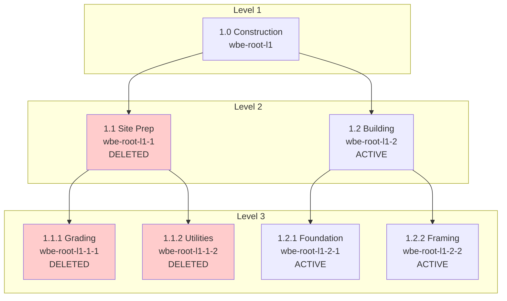

### Hierarchy Query Patterns

| Query Pattern | Endpoint | Use Case |
|---------------|----------|----------|
| Get root level | `GET /wbes?level=1` | Top-level WBEs |
| Get children | `GET /wbes?parent_wbe_id={id}` | Direct descendants |
| Get subtree | `GET /wbes?ancestor_wbe_id={id}` | All descendants (recursive) |
| Get breadcrumb | `GET /wbes/{id}/breadcrumb` | Navigation path |
| Get leaf nodes | `GET /wbes?is_leaf=true` | WBEs with no children |

### Code Reference

This use case is based on test cases from:

- [`backend/tests/api/test_wbes.py`](../../backend/tests/api/test_wbes.py):
  - `test_wbe_hierarchical_structure` - Lines 294-327

---

## Use Case 6: Revert Operations

### Scenario

An incorrect update was made to a WBE (e.g., budget entered as $200,000 instead of $50,000). You need to revert to the previous state. EVCS creates a new version with the old state, preserving the complete history.

### Business Context

**Revert Use Cases:**

- Data entry errors (typo in budget)
- Incorrect change order merged to main
- Need to undo multiple changes at once
- Experimental changes that didn't work out

### Step-by-Step Example

#### Step 1: Create Initial WBE

```bash
POST /api/v1/wbes
Content-Type: application/json

{
  "project_id": "550e8400-e29b-41d4-a716-446655440000",
  "code": "5.0",
  "name": "Phase 5 - Commissioning",
  "budget_allocation": 50000.00,
  "level": 1
}
```

**Response (v1):**

```json
{
  "id": "wbe-v1-xyz",
  "wbe_id": "wbe-root-revert",
  "budget_allocation": "50000.00",
  "parent_id": null
}
```

#### Step 2: Make Incorrect Update

```bash
PUT /api/v1/wbes/wbe-root-revert
Content-Type: application/json

{
  "budget_allocation": 200000.00
}
```

**Response (v2 - ERROR!):**

```json
{
  "id": "wbe-v2-xyz",
  "wbe_id": "wbe-root-revert",
  "budget_allocation": "200000.00",
  "parent_id": "wbe-v1-xyz"
}
```

#### Step 3: Make Another Update

```bash
PUT /api/v1/wbes/wbe-root-revert
Content-Type: application/json

{
  "budget_allocation": 180000.00
}
```

**Response (v3):**

```json
{
  "id": "wbe-v3-xyz",
  "wbe_id": "wbe-root-revert",
  "budget_allocation": "180000.00",
  "parent_id": "wbe-v2-xyz"
}
```

#### Step 4: Revert to Previous Version (Implicit)

Revert to the immediate parent (v2 → v1):

```bash
POST /api/v1/wbes/wbe-root-revert/revert
Content-Type: application/json

{
  "branch": "main"
}
```

**Response (v4 - Reverted to v1 state):**

```json
{
  "id": "wbe-v4-xyz",
  "wbe_id": "wbe-root-revert",
  "budget_allocation": "50000.00",
  "branch": "main",
  "parent_id": "wbe-v3-xyz"
}
```

**What Happened:**

- A NEW version (v4) was created
- v4 has the same data as v1 (budget: $50,000)
- `parent_id` points to v3 (maintains linear history)
- v2 and v3 are preserved in history

#### Step 5: Revert to Specific Version (Explicit)

Alternatively, revert directly to a specific version:

```bash
POST /api/v1/wbes/wbe-root-revert/revert
Content-Type: application/json

{
  "branch": "main",
  "to_version_id": "wbe-v1-xyz"
}
```

**Same Result:** Creates v4 with v1's data

#### Step 6: Verify History

```bash
GET /api/v1/wbes/wbe-root-revert/history
```

**Response:**

```json
[
  {
    "id": "wbe-v1-xyz",
    "budget_allocation": "50000.00",
    "parent_id": null
  },
  {
    "id": "wbe-v2-xyz",
    "budget_allocation": "200000.00",
    "parent_id": "wbe-v1-xyz"
  },
  {
    "id": "wbe-v3-xyz",
    "budget_allocation": "180000.00",
    "parent_id": "wbe-v2-xyz"
  },
  {
    "id": "wbe-v4-xyz",
    "budget_allocation": "50000.00",
    "parent_id": "wbe-v3-xyz"
  }
]
```

### Diagram: Revert Flow Creating New Version from Old State

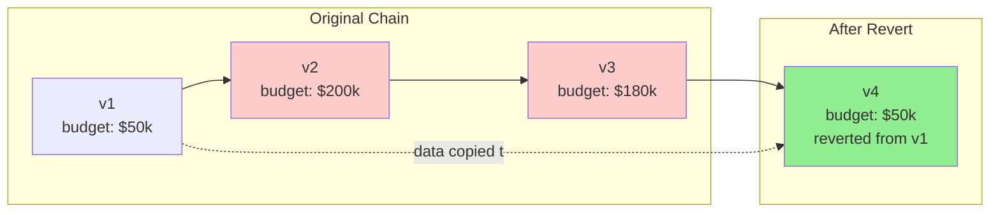

### Revert vs Delete vs Undo

| Operation | What Happens | When to Use |
|-----------|--------------|-------------|
| **Revert** | Creates new version with old state | Fix mistakes, undo changes |
| **Soft Delete** | Marks version(s) as deleted | Entity no longer needed |
| **Undo** | Not directly supported | Use revert instead |
| **Time Travel Query** | Reads old state without changing | Reference only |

### Revert on Branches

Reverts work on any branch:

```bash
# Revert on main
POST /api/v1/wbes/{wbe_id}/revert
{ "branch": "main" }

# Revert on feature branch
POST /api/v1/wbes/{wbe_id}/revert
{ "branch": "change-order-001" }
```

Each branch maintains its own version chain and can be reverted independently.

### Code Reference

This use case is based on test cases from:

- [`backend/tests/unit/core/versioning/test_branch_commands.py`](../../backend/tests/unit/core/versioning/test_branch_commands.py):
  - `test_revert_command` - Lines 163-200
  - `test_revert_to_specific_version` - Lines 202-252

---

## API Reference Summary

### WBE Endpoints

| Method | Endpoint | Description | Branch Support |
|--------|----------|-------------|----------------|
| `POST` | `/api/v1/wbes` | Create new WBE | Optional `branch` field |
| `GET` | `/api/v1/wbes` | List WBEs with filters | `?branch=` parameter |
| `GET` | `/api/v1/wbes/{wbe_id}` | Get current WBE | `?branch=` parameter |
| `GET` | `/api/v1/wbes/{wbe_id}?as_of={date}` | Time travel query | `?branch=` + `?as_of=` |
| `PUT` | `/api/v1/wbes/{wbe_id}` | Update WBE | Body: `branch` field |
| `DELETE` | `/api/v1/wbes/{wbe_id}` | Soft delete WBE | `?branch=` parameter |
| `GET` | `/api/v1/wbes/{wbe_id}/history` | Get version history | `?branch=` parameter |
| `GET` | `/api/v1/wbes/{wbe_id}/breadcrumb` | Get hierarchy path | N/A |
| `POST` | `/api/v1/wbes/{wbe_id}/branches` | Create branch | Body: `new_branch`, `from_branch` |
| `POST` | `/api/v1/wbes/{wbe_id}/branches/merge` | Merge branches | Body: `source_branch`, `target_branch` |
| `DELETE` | `/api/v1/wbes/{wbe_id}/branches/{branch}` | Delete branch | N/A |
| `POST` | `/api/v1/wbes/{wbe_id}/revert` | Revert to previous | Body: `branch`, `to_version_id` |

### Query Parameters for List Endpoint

```
GET /api/v1/wbes?
    project_id={uuid}              # Filter by project
    &parent_wbe_id={uuid}          # Filter by parent
    &level={int}                   # Filter by level
    &branch={string}               # Filter by branch
    &search={string}               # Search code/name
    &skip={int}                    # Pagination offset
    &limit={int}                   # Pagination limit
    &sort_by={field}               # Sort field
    &order={asc|desc}              # Sort order
```

### Request/Response Examples

#### Create WBE

**Request:**

```http
POST /api/v1/wbes HTTP/1.1
Content-Type: application/json

{
  "project_id": "550e8400-e29b-41d4-a716-446655440000",
  "parent_wbe_id": null,
  "code": "1.0",
  "name": "Phase 1",
  "budget_allocation": 100000.00,
  "level": 1,
  "description": "Initial phase",
  "control_date": "2026-01-01T10:00:00+00"
}
```

**Response (201 Created):**

```json
{
  "id": "wbe-version-id",
  "wbe_id": "wbe-root-id",
  "project_id": "550e8400-e29b-41d4-a716-446655440000",
  "parent_wbe_id": null,
  "code": "1.0",
  "name": "Phase 1",
  "budget_allocation": "100000.00",
  "level": 1,
  "description": "Initial phase",
  "branch": "main",
  "parent_id": null,
  "merge_from_branch": null,
  "valid_time": "[2026-01-01T10:00:00+00,)",
  "transaction_time": "[2026-01-11T10:00:00+00,)",
  "deleted_at": null
}
```

#### Update WBE

**Request:**

```http
PUT /api/v1/wbes/wbe-root-id HTTP/1.1
Content-Type: application/json

{
  "budget_allocation": 120000.00,
  "description": "Updated scope",
  "branch": "main",
  "control_date": "2026-02-01T10:00:00+00"
}
```

**Response (200 OK):**

```json
{
  "id": "wbe-new-version-id",
  "wbe_id": "wbe-root-id",
  "budget_allocation": "120000.00",
  "description": "Updated scope",
  "branch": "main",
  "parent_id": "wbe-version-id",
  "valid_time": "[2026-02-01T10:00:00+00,)",
  "transaction_time": "[2026-01-11T11:00:00+00,)"
}
```

#### Time Travel Query

**Request:**

```http
GET /api/v1/wbes/wbe-root-id?as_of=2026-01-15T10:00:00+00 HTTP/1.1
```

**Response (200 OK):**

```json
{
  "id": "wbe-version-id",
  "wbe_id": "wbe-root-id",
  "budget_allocation": "100000.00",
  "valid_time": "[2026-01-01T10:00:00+00,2026-02-01T10:00:00+00)",
  "transaction_time": "[2026-01-01T10:00:00+00,2026-02-01T10:00:00+00)"
}
```

---

## Best Practices

### When to Use Branches vs Direct Updates

| Scenario | Approach | Rationale |
|----------|----------|-----------|
| **Routine data entry** | Direct update on main | Simple, no approval needed |
| **Change order workflow** | Create branch, then merge | Isolation, approval process |
| **What-if analysis** | Create branch | Non-destructive exploration |
| **Emergency fix** | Direct update on main | Speed, immediate effect |
| **Collaborative editing** | Create branch per user | Avoid conflicts |

**Decision Tree:**

```
Does the change need approval?
├── Yes → Use branch
└── No
    ├── Is it a routine update?
    │   ├── Yes → Direct update on main
    │   └── No → Could it break something?
    │       ├── Yes → Use branch for safety
    │       └── No → Direct update on main
```

### Control Date Guidelines

| Scenario | Control Date Value | Example |
|----------|-------------------|---------|
| **Regular operation** | Omit (defaults to now) | Update today's data |
| **Future effective** | Future timestamp | Change starts next month |
| **Backdated correction** | Past timestamp | Fix last week's error |
| **Bulk import** | Actual business date | Import with correct dates |
| **Never use** | Invalid timezone | Always include timezone offset |

**Control Date Rules:**

1. Always include timezone: `2026-01-01T10:00:00+00`
2. Use UTC for consistency: `+00` offset
3. Be precise with time: Don't omit time component
4. Document retroactive changes in audit log

### Soft Delete vs Hard Delete

| Aspect | Soft Delete | Hard Delete |
|--------|-------------|-------------|
| **Data Recovery** | Possible via undelete | Impossible |
| **History** | Preserved in history | Preserved in history |
| **Query Visibility** | Hidden unless `include_deleted=true` | Hidden completely |
| **Storage** | Records remain in DB | Records remain in DB |
| **Use When** | Mistakes, temporary removal | Compliance (GDPR, etc.) |

**Soft Delete Best Practices:**

- Always prefer soft delete for business entities
- Use `include_deleted=true` for audit queries
- Implement undelete workflow for recovery
- Consider retention policies for old deleted records

### Query Optimization for Temporal Data

#### Use Appropriate Indexes

The system automatically creates GIST indexes for temporal queries:

```sql
-- Automatic indexes (created by migrations)
CREATE INDEX ix_wbes_valid_gist ON wbes USING GIST (valid_time);
CREATE INDEX ix_wbes_tx_gist ON wbes USING GIST (transaction_time);
```

#### Query Patterns

**Good:**

```sql
-- Uses GIST index efficiently
WHERE valid_time @> NOW()
WHERE transaction_time @> '2026-01-01'::timestamptz
```

**Avoid:**

```sql
-- Doesn't use GIST index
WHERE LOWER(valid_time) > '2026-01-01'
WHERE valid_time IS NOT NULL
```

#### Pagination Strategy

For large result sets, always use cursor-based pagination:

```bash
# First page
GET /api/v1/wbes?limit=100

# Next page (using last seen ID)
GET /api/v1/wbes?limit=100&after={last_id}
```

Avoid offset-based pagination for large offsets:

```bash
# Avoid for large offsets
GET /api/v1/wbes?skip=10000  # Scans 10,000 rows
```

### Bitemporal Query Patterns

#### "What did we believe at time T?"

Use `transaction_time` to see what the system knew at a point in time:

```sql
WHERE transaction_time @> '2026-01-15T10:00:00+00'::timestamptz
```

**Use Case:** Audit investigation - "What data did we have when we generated this report?"

#### "What was true at time T?"

Use `valid_time` to see what was effective at a point in time:

```sql
WHERE valid_time @> '2026-01-15T10:00:00+00'::timestamptz
```

**Use Case:** Historical analysis - "What was the budget on January 15th?"

#### "What do we believe now about time T?"

Combine both:

```sql
WHERE transaction_time @> NOW()
  AND valid_time @> '2026-01-15T10:00:00+00'::timestamptz
```

**Use Case:** Corrected historical data - "What do we now know about January 15th?"

---

## Common Patterns & Recipes

### Pattern 1: Bulk Updates with Single Control Date

**Scenario:** You need to update multiple WBEs with the same effective date.

```bash
# Update multiple WBEs with same control date
for wbe_id in "${wbe_list[@]}"; do
  curl -X PUT "http://api/wbes/$wbe_id" \
    -H "Content-Type: application/json" \
    -d "{
      \"budget_allocation\": $new_budget,
      \"control_date\": \"2026-01-01T10:00:00+00\"
    }"
done
```

**Key Points:**

- All updates get same `valid_time` start
- Each update creates new version
- `transaction_time` reflects actual update time
- Useful for periodic budget adjustments

### Pattern 2: Audit Trail Reconstruction

**Scenario:** Generate a complete audit trail for a WBE.

```python
async def get_audit_trail(wbe_id: str, session: AsyncSession) -> list[dict]:
    """Get complete audit trail for a WBE."""
    wbe = await wbe_service.get_wbe_history(session, wbe_id)

    trail = []
    for version in wbe:
        trail.append({
            "version_id": version.id,
            "effective_at": version.valid_time.lower,
            "recorded_at": version.transaction_time.lower,
            "ended_at": version.valid_time.upper,
            "actor_id": version.actor_id,
            "changes": {
                "budget": version.budget_allocation,
                "name": version.name,
                "branch": version.branch,
            }
        })

    return trail
```

**Output Format:**

```json
[
  {
    "version_id": "abc-123",
    "effective_at": "2026-01-01T10:00:00+00",
    "recorded_at": "2026-01-01T10:00:00+00",
    "ended_at": "2026-01-15T10:00:00+00",
    "actor_id": "user-456",
    "changes": {
      "budget": 50000.00,
      "name": "Original Name",
      "branch": "main"
    }
  },
  {
    "version_id": "def-789",
    "effective_at": "2026-01-15T10:00:00+00",
    "recorded_at": "2026-01-15T10:00:00+00",
    "ended_at": null,
    "actor_id": "user-789",
    "changes": {
      "budget": 75000.00,
      "name": "Updated Name",
      "branch": "main"
    }
  }
]
```

### Pattern 3: Difference Detection Between Versions

**Scenario:** Compare two versions to show exactly what changed.

```python
def diff_versions(v1: WBE, v2: WBE) -> dict:
    """Calculate differences between two WBE versions."""
    fields_to_compare = [
        "name", "code", "budget_allocation",
        "description", "level"
    ]

    changes = {}
    for field in fields_to_compare:
        val1 = getattr(v1, field)
        val2 = getattr(v2, field)
        if val1 != val2:
            changes[field] = {
                "from": val1,
                "to": val2,
                "changed": True
            }

    return {
        "version_from": v1.id,
        "version_to": v2.id,
        "changes": changes,
        "change_count": len(changes)
    }
```

**Usage:**

```python
v1 = await get_version_at(wbe_id, as_of=date1)
v2 = await get_version_at(wbe_id, as_of=date2)
diff = diff_versions(v1, v2)
```

### Pattern 4: Branch-per-Change-Order Workflow

**Scenario:** Formal change order process with numbered branches.

```python
async def create_change_order(
    wbe_id: str,
    change_order_number: int,
    proposed_changes: dict,
    session: AsyncSession
) -> dict:
    """Create a change order branch with proposed changes."""

    # 1. Create branch for change order
    branch_name = f"change-order-{change_order_number:04d}"
    branch_cmd = CreateBranchCommand(
        entity_class=WBE,
        root_id=wbe_id,
        actor_id=current_user.id,
        new_branch=branch_name,
        from_branch="main"
    )
    await branch_cmd.execute(session)

    # 2. Apply changes on branch
    update_cmd = UpdateCommand(
        entity_class=WBE,
        root_id=wbe_id,
        actor_id=current_user.id,
        updates=proposed_changes,
        branch=branch_name
    )
    updated = await update_cmd.execute(session)

    # 3. Return comparison for review
    main_version = await wbe_service.get_current(session, wbe_id, branch="main")
    comparison = diff_versions(main_version, updated)

    return {
        "branch_name": branch_name,
        "proposed_changes": comparison,
        "status": "pending_approval"
    }
```

**Workflow:**

1. Create change order branch
2. Make changes on branch
3. Generate comparison report
4. Stakeholders review
5. Approve → Merge to main
6. Reject → Delete branch

### Pattern 5: Time Travel for Reporting

**Scenario:** Generate a report as it would have looked at a past date.

```python
async def generate_historical_report(
    project_id: str,
    as_of_date: datetime,
    session: AsyncSession
) -> dict:
    """Generate report for a specific point in time."""

    # Get all WBEs as of the specified date
    wbes = await wbe_service.get_wbes(
        session,
        project_id=project_id,
        as_of=as_of_date
    )

    total_budget = sum(w.budget_allocation for w in wbes)

    return {
        "report_date": as_of_date,
        "as_of_date": as_of_date,
        "wbe_count": len(wbes),
        "total_budget": total_budget,
        "wbes": [
            {
                "code": w.code,
                "name": w.name,
                "budget": w.budget_allocation,
                "valid_at": w.valid_time,
            }
            for w in wbes
        ]
    }
```

### Pattern 6: Undelete Workflow

**Scenario:** Recover a soft-deleted WBE.

```python
async def undelete_wbe(
    wbe_id: str,
    session: AsyncSession,
    actor_id: str
) -> WBE:
    """Undelete a soft-deleted WBE."""

    # Get the deleted version
    wbe = await wbe_service.get_wbe(
        session,
        wbe_id,
        include_deleted=True
    )

    if not wbe:
        raise NotFoundError(f"WBE {wbe_id} not found")

    if not wbe.deleted_at:
        raise ValueError(f"WBE {wbe_id} is not deleted")

    # Undelete
    wbe.undelete()

    # Record undelete action
    wbe.actor_id = actor_id

    await session.flush()
    return wbe
```

---

## Additional Resources

### Architecture Documentation

- [EVCS Core Architecture](../02-architecture/backend/contexts/evcs-core/architecture.md) - System architecture and patterns
- [Entity Classification Guide](../02-architecture/backend/contexts/evcs-core/entity-classification.md) - Choosing entity types
- [Temporal Patterns Reference](../02-architecture/backend/contexts/evcs-core/evcs-implementation-guide.md) - Query patterns and recipes
- [ADR-005: Bitemporal Versioning](../02-architecture/decisions/ADR-005-bitemporal-versioning.md) - Design decision record
- [ADR-006: Protocol-Based Type System](../02-architecture/decisions/ADR-006-protocol-based-type-system.md) - Type system design

### Code References

- **WBE Model:** [`backend/app/models/domain/wbe.py`](../../backend/app/models/domain/wbe.py)
- **WBE Service:** [`backend/app/services/wbe.py`](../../backend/app/services/wbe.py)
- **WBE API:** [`backend/app/api/routes/wbes.py`](../../backend/app/api/routes/wbes.py)
- **Branch Commands:** [`backend/app/core/branching/commands.py`](../../backend/app/core/branching/commands.py)
- **Versioning Commands:** [`backend/app/core/versioning/commands.py`](../../backend/app/core/versioning/commands.py)

### Test Examples

- **WBE API Tests:** [`backend/tests/api/test_wbes.py`](../../backend/tests/api/test_wbes.py)
- **Branch Command Tests:** [`backend/tests/unit/core/versioning/test_branch_commands.py`](../../backend/tests/unit/core/versioning/test_branch_commands.py)
- **Time Travel Tests:** [`backend/tests/api/test_time_machine.py`](../../backend/tests/api/test_time_machine.py)
- **Control Date Tests:** [`backend/tests/core/versioning/test_control_date.py`](../../backend/tests/core/versioning/test_control_date.py)

---

## Appendix: WBE Data Model

### WBE Table Structure

| Column | Type | Description |
|--------|------|-------------|
| `id` | UUID (PK) | Unique version identifier |
| `wbe_id` | UUID (Index) | Stable WBE root identifier |
| `project_id` | UUID (FK, Index) | Parent project |
| `parent_wbe_id` | UUID (FK, Index) | Parent WBE in hierarchy |
| `code` | VARCHAR(50) | WBS code (e.g., "1.2.3") |
| `name` | VARCHAR(200) | WBE name |
| `budget_allocation` | NUMERIC(15,2) | Budget allocated |
| `level` | INTEGER | Hierarchy level |
| `description` | TEXT | Optional description |
| `valid_time` | TSTZRANGE | Business validity period |
| `transaction_time` | TSTZRANGE | System recording period |
| `deleted_at` | TIMESTAMPTZ | Soft delete timestamp |
| `branch` | VARCHAR(80) | Branch name |
| `parent_id` | UUID (FK, Index) | Previous version |
| `merge_from_branch` | VARCHAR(80) | Merge source branch |
| `actor_id` | UUID | User who made change |

### Indexes

```sql
-- GIST indexes for temporal queries
CREATE INDEX ix_wbes_valid_gist ON wbes USING GIST (valid_time);
CREATE INDEX ix_wbes_tx_gist ON wbes USING GIST (transaction_time);

-- B-tree indexes for lookups
CREATE INDEX ix_wbes_wbe_id ON wbes (wbe_id);
CREATE INDEX ix_wbes_project_id ON wbes (project_id);
CREATE INDEX ix_wbes_parent_wbe_id ON wbes (parent_wbe_id);
CREATE INDEX ix_wbes_branch ON wbes (branch);
CREATE INDEX ix_wbes_parent_id ON wbes (parent_id);

-- Partial unique index: one current version per WBE per branch
CREATE UNIQUE INDEX uq_wbes_current_branch
ON wbes (wbe_id, branch)
WHERE upper(valid_time) IS NULL
  AND upper(transaction_time) IS NULL
  AND deleted_at IS NULL;
```

---

**Document Version:** 1.0
**Last Updated:** 2026-01-11
**Maintained By:** Backend Team

For questions or contributions to this guide, please refer to the [Documentation Guide](../00-meta/README.md).
