# EVCS User Guide: Working with Versioned Entities

**Version:** 1.1
**Last Updated:** 2026-05-30
**Target Audience:** Backend Developers, API Consumers, System Architects

---

## Table of Contents

1. [Introduction](#introduction)
2. [Understanding the EVCS Architecture](#understanding-the-evcs-architecture)
3. [Core Concepts](#core-concepts)
4. [Use Case 1: Basic CRUD Operations](#use-case-1-basic-crud-operations)
5. [Use Case 2: Version History & Time Travel](#use-case-2-version-history--time-travel)
6. [Use Case 3: Control Date Operations](#use-case-3-control-date-operations)
7. [Use Case 4: Branching for Change Orders](#use-case-4-branching-for-change-orders)
8. [Use Case 5: Hierarchical WBSElement Management](#use-case-5-hierarchical-wbselement-management)
9. [Use Case 6: Revert Operations](#use-case-6-revert-operations)
10. [API Reference Summary](#api-reference-summary)
11. [Best Practices](#best-practices)
12. [Common Patterns & Recipes](#common-patterns--recipes)

---

## Introduction

### What is EVCS?

The **Entity Versioning Control System (EVCS)** is a core component of Backcast  that provides Git-like versioning capabilities for all database entities. Just as Git tracks every change to source code, EVCS tracks every change to business entities with complete audit trails and the ability to query historical states.

### Why EVCS Matters

In project budget management and EVM (Earned Value Management) systems, you need to:

- **Track every change** to budgets, WBS structures, and cost elements
- **View historical states** for audit reporting and variance analysis
- **Isolate changes** in branches for change order approval workflows
- **Correct errors** retroactively while maintaining data integrity
- **Recover deleted data** when mistakes are made

EVCS provides all of these capabilities through a unified, consistent API.

### The WBSElement Entity: Our Working Example

This guide uses the **WBSElement (Work Breakdown Structure Element)** entity as the primary example because it demonstrates all EVCS capabilities:

- **Hierarchical structure** (parent-child relationships)
- **Version tracking** for budget and revenue changes
- **Branch isolation** for change orders
- **Time travel queries** for historical reporting

### EVCS Capabilities Overview

| Capability | Description | Use Case |
|------------|-------------|----------|
| **Complete History** | Every change creates a new immutable version | Audit trails, compliance |
| **Time Travel** | Query entity state at any past point in time | Historical reports, variance analysis |
| **Branch Isolation** | Develop changes in isolation before merging | Change order workflows |
| **Bitemporal Tracking** | Track both business time and system time | Correction of historical data |
| **Soft Delete** | Reversible deletion with recovery capability | Accidental deletion recovery |

---

## Understanding the EVCS Architecture

### Entity Lifecycle and Version Chain

Every versioned entity follows a predictable lifecycle where updates create new versions linked in a chain:

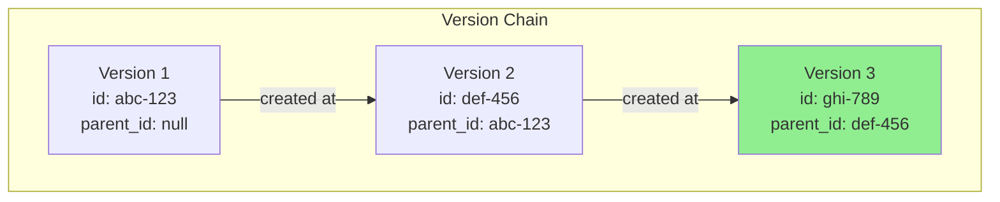

**Key Points:**

- Each version has a unique `id` (UUID)
- The `wbs_element_id` (root ID) stays constant across all versions
- `parent_id` links each version to its predecessor
- Only the latest version is "current" (highlighted in green)

### Bitemporal Tracking

EVCS uses two temporal dimensions to track when data is valid and when it was recorded:

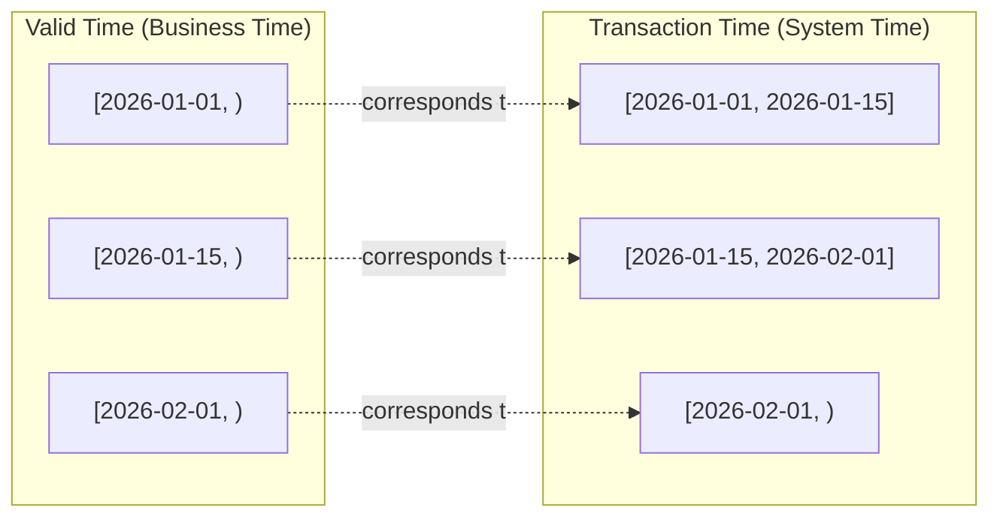

**Understanding the Two Time Dimensions:**

| Dimension | Meaning | Example |
|-----------|---------|---------|
| **Valid Time** | When the data is/was valid in the real world | "This budget was valid from Jan 1 to Feb 1" |
| **Transaction Time** | When the data was recorded in the system | "This record was entered on Jan 15" |

**Why Two Dimensions?**

- **Corrections**: You can record today that a budget change should have been effective last week
- **Audit Trails**: See both what was known when, and when corrections were made
- **Point-in-Time Queries**: Ask "What did we believe on March 1?" vs "What was true on March 1?"

### Branch Isolation and Merge Flow

Branches allow you to work on changes in isolation, similar to Git branches:

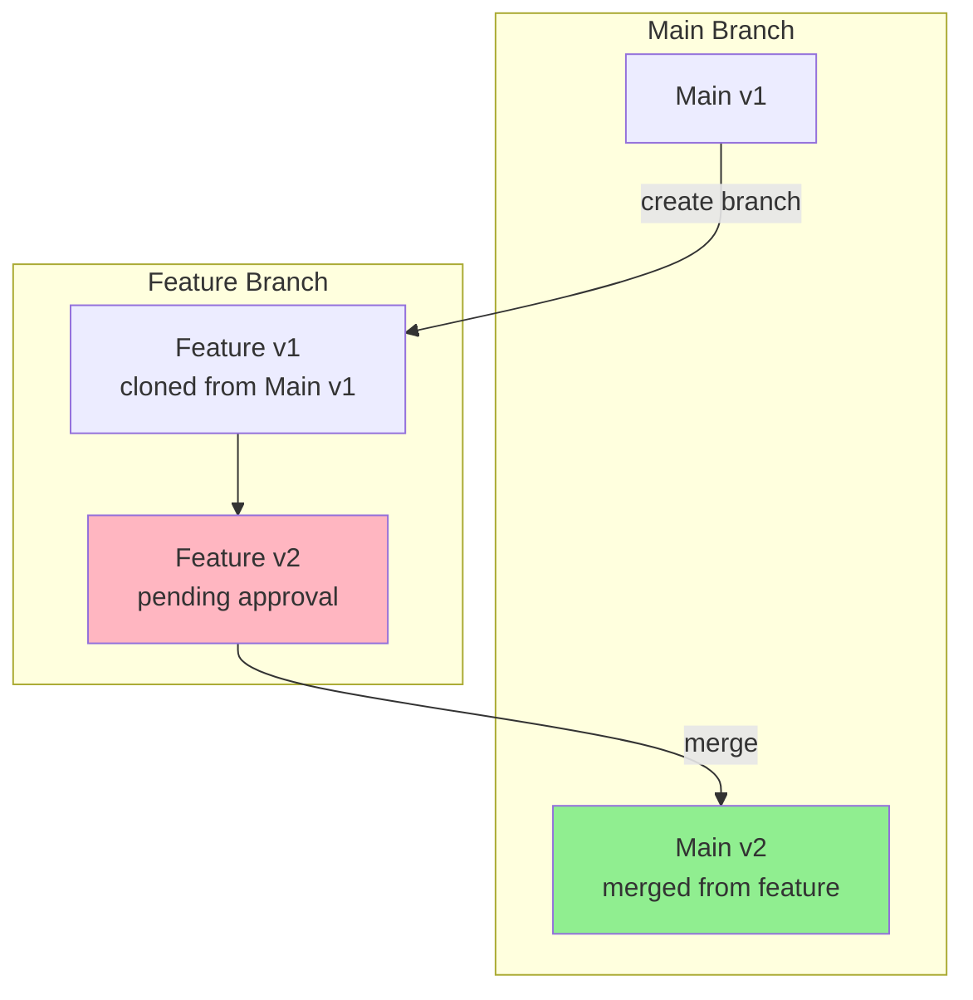

**Branch Use Cases:**

- **Change Orders**: Work on budget changes while main stays stable
- **What-If Scenarios**: Model changes without affecting production
- **Parallel Development**: Multiple changes on same entity

---

## Core Concepts

### User Identifiers: user_id vs id

The User entity follows EVCS patterns and has TWO important identifiers. Note that User is Versionable but NOT Branchable -- it does not support branch isolation, merge, or revert operations.

#### user_id (EVCS Root ID)

- **Purpose:** Canonical identifier for the user across all versions
- **Stability:** Never changes
- **Use When:** Fetching current active version, updates, history
- **Method:** `UserService.get_user(user_id)` or `TemporalService.get_as_of(user_id)`
- **Example:** API requests, RBAC lookups, change order assignments

```python
# Get current active user (uses EVCS root ID)
user = await user_service.get_user(user_id)

# Change order assignment uses user_id (EVCS root ID)
co.assigned_approver_id = user.user_id  # ✅ CORRECT
```

#### id (Database Primary Key)

- **Purpose:** Identifies a specific version in the version chain
- **Stability:** Changes with each update
- **Use When:** Referencing specific historical state, parent linking
- **Method:** `UserService.get_by_id(id)` or `session.get(User, id)`
- **Example:** Audit trails, version history queries

```python
# Get specific version (uses database PK)
user = await user_service.get_by_id(version_id)

# Version parent linking uses id (database PK)
new_version.parent_id = old_version.id  # ✅ CORRECT
```

#### Common Pitfalls

```python
# ❌ WRONG: Using PK for current state
user = await user_service.get_by_id(user_id)  # user_id is not PK!

# ❌ WRONG: Using root ID for specific version
user = await user_service.get_user(version_id)  # version_id is not root ID!

# ✅ CORRECT: Use root ID for current state
user = await user_service.get_user(user_id)

# ✅ CORRECT: Use PK for specific version
user = await user_service.get_by_id(version_id)
```

#### When to Use Each Method

| Scenario | Identifier | Method | Example |
|----------|------------|--------|---------|
| API request contains user_id | user_id (root ID) | `get_user(user_id)` | `GET /api/v1/users/{user_id}` |
| Change order assignment | user_id (root ID) | `get_user(user_id)` | `co.assigned_approver_id = user.user_id` |
| Audit trail of specific version | id (PK) | `get_by_id(id)` | `parent_id = version.id` |
| Version history query | user_id (root ID) | `get_user_history(user_id)` | `history = service.get_user_history(user_id)` |
| Time travel query | user_id (root ID) | `get_user_as_of(user_id, as_of)` | `user = await service.get_user_as_of(user_id, date)` |

### Root ID vs Version ID

Every versioned entity has TWO important identifiers:

```python
# Version ID (id): Changes with each version
version_id = "abc-123-def-456"  # Unique to this specific version

# Root ID (wbs_element_id): Stable across all versions
wbs_element_id = "wbs-root-789"  # Same for all versions of this WBSElement
```

| Identifier | Purpose | Stability | Use When |
|------------|---------|-----------|----------|
| **Root ID** | Identifies the logical entity | Never changes | Fetching current state, updates, history |
| **Version ID** | Identifies a specific version | Changes each update | Referencing specific historical state, parent linking |

**Practical Example:**

```bash
# Get current state (uses root ID)
GET /api/v1/wbs-elements/{wbs_element_id}

# Get version history (uses root ID)
GET /api/v1/wbs-elements/{wbs_element_id}/history
```

Note: The API only supports root-ID based access. Version IDs are used internally in the version chain (parent_id) but are not exposed as API path parameters.

### Branches: Main vs Feature

Branches isolate changes to prevent interference:

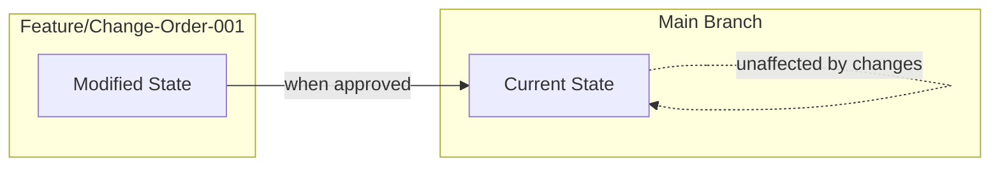

**Branch Naming Conventions:**

- `main` - Production state, always current
- `feature/{name}` - Feature development
- `change-order-{number}` - Formal change order workflow
- `sandbox/{user}` - Personal experimentation space

**Branch Isolation Rules:**

- Updates on `main` don't affect feature branches
- Updates on feature branches don't affect `main` until merged
- Multiple branches can exist simultaneously
- Merges are one-directional (typically feature -> main)

### Temporal Ranges: Open-Ended vs Closed

Temporal ranges use PostgreSQL's `TSTZRANGE` type:

```python
# Open-ended range (current version)
valid_time = "[2026-01-01 10:00:00+00, )"  # No upper bound

# Closed range (historical version)
valid_time = "[2026-01-01 10:00:00+00, 2026-02-01 10:00:00+00)"
```

**Visual Representation:**

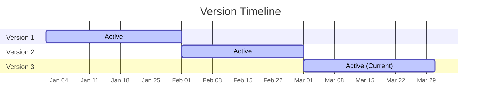

**Querying by Temporal State:**

```bash
# Get current version (default)
GET /api/v1/wbs-elements/{wbs_element_id}

# Get state as of specific date (time travel)
GET /api/v1/wbs-elements/{wbs_element_id}?as_of=2026-02-15T10:00:00+00
```

### Version DAG: Parent-Child Relationships

While versions form a chain within a branch, the overall structure is a Directed Acyclic Graph (DAG):

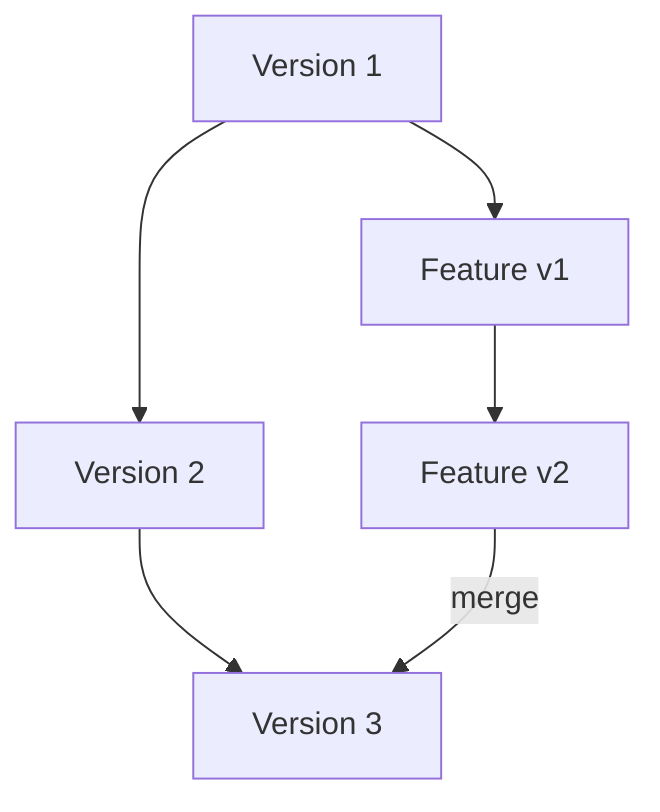

**DAG Properties:**

- Each version has exactly one `parent_id`
- A version can have multiple children (branching)
- No cycles (can't merge into an ancestor)
- Enables flexible workflow patterns

---

## Use Case 1: Basic CRUD Operations

### Scenario

You are setting up a new project and need to create the initial WBSElement hierarchy. This includes creating parent WBSElements, child WBSElements, and querying WBSElements by project.

**Note:** Budget allocation is not stored directly on WBSElements. Instead, budgets are allocated at the Cost Element level, and WBSElement `budget_allocation` is computed on-the-fly as the sum of child cost element budgets. To allocate revenue from the project contract value, use the `revenue_allocation` field.

### Step-by-Step Example

#### Step 1: Create a Parent WBSElement

First, create a top-level WBSElement for Phase 1 of the project:

```bash
POST /api/v1/wbs-elements
Content-Type: application/json

{
  "project_id": "550e8400-e29b-41d4-a716-446655440000",
  "code": "1.0",
  "name": "Phase 1 - Foundation",
  "level": 1,
  "description": "Initial foundation work for the building"
}
```

**Response (201 Created):**

```json
{
  "id": "wbs-v1-abc-123",
  "wbs_element_id": "wbs-root-789",
  "project_id": "550e8400-e29b-41d4-a716-446655440000",
  "code": "1.0",
  "name": "Phase 1 - Foundation",
  "budget_allocation": null,
  "revenue_allocation": null,
  "level": 1,
  "description": "Initial foundation work for the building",
  "branch": "main",
  "parent_id": null,
  "valid_time": "[2026-01-11T10:00:00+00,)",
  "transaction_time": "[2026-01-11T10:00:00+00,)",
  "deleted_at": null
}
```

**Key Points:**

- `id` is the version-specific UUID (changes on updates)
- `wbs_element_id` is the root UUID (stable across all versions)
- `budget_allocation` is computed from child cost elements (null until cost elements are added)
- `revenue_allocation` is an optional writable field for allocating revenue from the project contract value
- `valid_time` and `transaction_time` are open-ended (current version)
- `parent_id` is `null` (first version has no parent)

#### Step 2: Create Child WBSElements

Now create child WBSElements under the parent:

```bash
POST /api/v1/wbs-elements
Content-Type: application/json

{
  "project_id": "550e8400-e29b-41d4-a716-446655440000",
  "parent_wbs_element_id": "wbs-root-789",
  "code": "1.1",
  "name": "Site Preparation",
  "level": 2
}
```

**Response (201 Created):**

```json
{
  "id": "wbs-child1-v1-def-456",
  "wbs_element_id": "wbs-child-root-456",
  "parent_wbs_element_id": "wbs-root-789",
  "code": "1.1",
  "name": "Site Preparation",
  "budget_allocation": null,
  "revenue_allocation": null,
  "level": 2,
  "branch": "main",
  "parent_id": null
}
```

Create another child:

```bash
POST /api/v1/wbs-elements
Content-Type: application/json

{
  "project_id": "550e8400-e29b-41d4-a716-446655440000",
  "parent_wbs_element_id": "wbs-root-789",
  "code": "1.2",
  "name": "Foundation Pouring",
  "level": 2
}
```

#### Step 3: Update WBSElement Description

Update the description for the parent WBSElement:

```bash
PUT /api/v1/wbs-elements/wbs-root-789
Content-Type: application/json

{
  "description": "Updated foundation scope including additional excavation"
}
```

**Response (200 OK):**

```json
{
  "id": "wbs-v2-ghi-789",
  "wbs_element_id": "wbs-root-789",
  "budget_allocation": null,
  "revenue_allocation": null,
  "description": "Updated foundation scope including additional excavation",
  "branch": "main",
  "parent_id": "wbs-v1-abc-123",
  "valid_time": "[2026-01-11T11:00:00+00,)",
  "transaction_time": "[2026-01-11T11:00:00+00,)"
}
```

**Important Notes:**

- A NEW version was created (`id` changed)
- `parent_id` now points to the previous version
- The original version (v1) is still in the database for historical tracking
- `valid_time` and `transaction_time` have been updated
- `budget_allocation` is computed from child cost elements (add cost elements to set budget)
- `budget_allocation` cannot be set directly via create or update requests

#### Step 4: Query WBSElements by Project

Retrieve all WBSElements for a specific project:

```bash
GET /api/v1/wbs-elements?project_id=550e8400-e29b-41d4-a716-446655440000
```

**Response (200 OK):**

```json
[
  {
    "wbs_element_id": "wbs-root-789",
    "code": "1.0",
    "name": "Phase 1 - Foundation",
    "budget_allocation": "120000.00",
    "level": 1,
    "parent_name": null
  },
  {
    "wbs_element_id": "wbs-child-root-456",
    "code": "1.1",
    "name": "Site Preparation",
    "budget_allocation": "30000.00",
    "level": 2,
    "parent_name": "Phase 1 - Foundation"
  },
  {
    "wbs_element_id": "wbs-child-root-789",
    "code": "1.2",
    "name": "Foundation Pouring",
    "budget_allocation": "70000.00",
    "level": 2,
    "parent_name": "Phase 1 - Foundation"
  }
]
```

**Additional Query Options:**

```bash
# Filter by parent
GET /api/v1/wbs-elements?parent_id=wbs-root-789

# Search by code or name
GET /api/v1/wbs-elements?search=foundation

# Pagination
GET /api/v1/wbs-elements?page=1&per_page=20

# Sort by field
GET /api/v1/wbs-elements?sort_field=code&sort_order=asc
```

### Diagram: Basic CRUD Flow

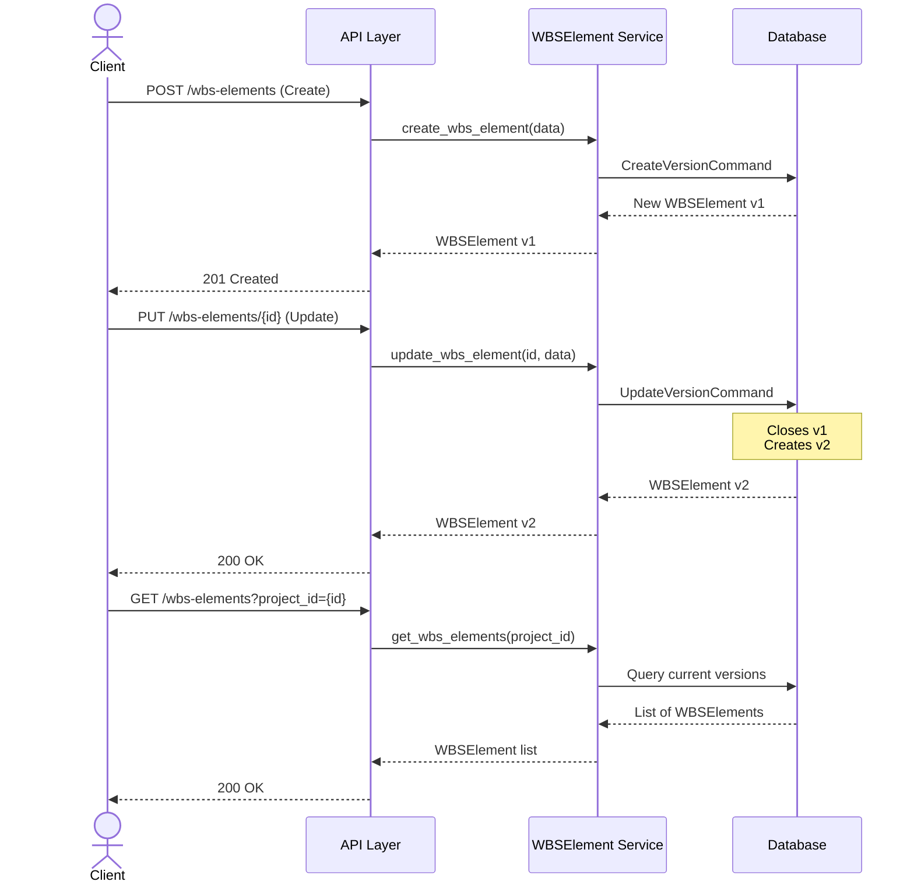

### Code Reference

This use case is based on test cases from:

- [`backend/tests/api/routes/test_wbs_elements.py`](../../backend/tests/api/routes/test_wbs_elements.py):
  - `test_create_wbs_element` - Create endpoint tests
  - `test_update_wbs_element` - Update endpoint tests
  - `test_get_wbs_elements_by_project` - List by project tests
  - `test_wbs_element_hierarchical_structure` - Hierarchy tests

---

## Use Case 2: Version History & Time Travel

### Scenario

You need to track budget changes over time for audit reporting and variance analysis. Stakeholders want to know:

- What was the budget at the beginning of the project?
- How has it changed over time?
- What was the budget on a specific date?

### Step-by-Step Example

#### Step 1: Create Initial WBSElement

```bash
POST /api/v1/wbs-elements
Content-Type: application/json

{
  "project_id": "550e8400-e29b-41d4-a716-446655440000",
  "code": "2.0",
  "name": "Phase 2 - Structure",
  "level": 1
}
```

**Response:**

```json
{
  "id": "wbs-v1-jkl-012",
  "wbs_element_id": "wbs-root-012",
  "name": "Phase 2 - Structure",
  "budget_allocation": null,
  "valid_time": "[2026-01-01T10:00:00+00,)",
  "transaction_time": "[2026-01-01T10:00:00+00,)"
}
```

#### Step 2: First Update

```bash
PUT /api/v1/wbs-elements/wbs-root-012
Content-Type: application/json

{
  "name": "Phase 2 - Structural Work"
}
```

**Result:** Version 2 is created

```json
{
  "id": "wbs-v2-mno-345",
  "wbs_element_id": "wbs-root-012",
  "name": "Phase 2 - Structural Work",
  "parent_id": "wbs-v1-jkl-012",
  "valid_time": "[2026-01-15T10:00:00+00,)"
}
```

**Behind the scenes:**

- Version 1's `valid_time` is closed: `[2026-01-01, 2026-01-15)`
- Version 2's `valid_time` starts: `[2026-01-15, )`

#### Step 3: Second Update

```bash
PUT /api/v1/wbs-elements/wbs-root-012
Content-Type: application/json

{
  "description": "Updated scope for structural phase"
}
```

**Result:** Version 3 is created

```json
{
  "id": "wbs-v3-pqr-678",
  "wbs_element_id": "wbs-root-012",
  "description": "Updated scope for structural phase",
  "parent_id": "wbs-v2-mno-345",
  "valid_time": "[2026-02-01T10:00:00+00,)"
}
```

#### Step 4: Retrieve Version History

Get the complete history of the WBSElement:

```bash
GET /api/v1/wbs-elements/wbs-root-012/history
```

**Response:**

```json
[
  {
    "id": "wbs-v1-jkl-012",
    "name": "Phase 2 - Structure",
    "valid_time": "[2026-01-01T10:00:00+00,2026-01-15T10:00:00+00)",
    "transaction_time": "[2026-01-01T10:00:00+00,2026-01-15T10:00:00+00)",
    "parent_id": null
  },
  {
    "id": "wbs-v2-mno-345",
    "name": "Phase 2 - Structural Work",
    "valid_time": "[2026-01-15T10:00:00+00,2026-02-01T10:00:00+00)",
    "transaction_time": "[2026-01-15T10:00:00+00,2026-02-01T10:00:00+00)",
    "parent_id": "wbs-v1-jkl-012"
  },
  {
    "id": "wbs-v3-pqr-678",
    "name": "Phase 2 - Structural Work",
    "description": "Updated scope for structural phase",
    "valid_time": "[2026-02-01T10:00:00+00,)",
    "transaction_time": "[2026-02-01T10:00:00+00,)",
    "parent_id": "wbs-v2-mno-345"
  }
]
```

#### Step 5: Time Travel - Query Historical State

**Question:** What was the state on January 20th?

```bash
GET /api/v1/wbs-elements/wbs-root-012?as_of=2026-01-20T10:00:00+00
```

**Response:**

```json
{
  "id": "wbs-v2-mno-345",
  "wbs_element_id": "wbs-root-012",
  "name": "Phase 2 - Structural Work",
  "valid_time": "[2026-01-15T10:00:00+00,2026-02-01T10:00:00+00)",
  "transaction_time": "[2026-01-15T10:00:00+00,2026-02-01T10:00:00+00)"
}
```

**More Time Travel Examples:**

```bash
# Before the WBSElement existed (returns 404)
GET /api/v1/wbs-elements/wbs-root-012?as_of=2025-12-01T10:00:00+00

# During version 1 (returns v1)
GET /api/v1/wbs-elements/wbs-root-012?as_of=2026-01-10T10:00:00+00

# During version 2 (returns v2)
GET /api/v1/wbs-elements/wbs-root-012?as_of=2026-01-20T10:00:00+00

# Current state (returns v3)
GET /api/v1/wbs-elements/wbs-root-012
```

### Diagram: Version Chain with Temporal Ranges

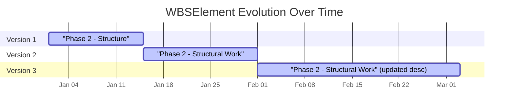

### Practical Applications

| Use Case | Query | Value |
|----------|-------|-------|
| Beginning state | `as_of=2026-01-01` | Original name |
| Mid-project state | `as_of=2026-01-20` | Updated name |
| Current state | (no as_of) | Latest version |
| Complete audit trail | `/history` endpoint | All versions |

### Code Reference

This use case is based on test cases from:

- [`backend/tests/api/routes/test_wbs_elements.py`](../../backend/tests/api/routes/test_wbs_elements.py):
  - History and time travel endpoint tests

---

## Use Case 3: Control Date Operations

### Scenario

You discover that a change was recorded with the wrong date, or you need to enter a change that should have been effective in the past. Control dates allow you to specify exactly when a change should be effective, rather than using the current system time.

### Why Control Dates Matter

**Problem:** On February 1st, you realize a change was approved on January 15th but never recorded. Without control dates, the change would be recorded with a February 1st date, making audit reports inaccurate.

**Solution:** Use `control_date` to specify when the change should have been effective.

### Step-by-Step Example

#### Step 1: Create WBSElement with Future Control Date

Create a WBSElement that becomes effective on a specific future date:

```bash
POST /api/v1/wbs-elements
Content-Type: application/json

{
  "project_id": "550e8400-e29b-41d4-a716-446655440000",
  "code": "3.0",
  "name": "Phase 3 - Finishing",
  "level": 1,
  "control_date": "2026-03-01T10:00:00+00"
}
```

**Response:**

```json
{
  "id": "wbs-v1-stu-901",
  "wbs_element_id": "wbs-root-901",
  "name": "Phase 3 - Finishing",
  "valid_time": "[2026-03-01T10:00:00+00,)",
  "transaction_time": "[2026-01-11T10:00:00+00,)"
}
```

**Key Observations:**

- `valid_time` starts at the `control_date` (March 1)
- `transaction_time` starts at the actual time of creation (January 11)
- The WBSElement won't appear in queries until March 1 unless you use time travel

#### Step 2: Update with Past Control Date (Correction)

You discover that a change should have been recorded on January 15th, but it's now February 1st:

```bash
PUT /api/v1/wbs-elements/wbs-root-901
Content-Type: application/json

{
  "description": "Updated finishing scope",
  "control_date": "2026-01-15T10:00:00+00"
}
```

**Response:**

```json
{
  "id": "wbs-v2-vwx-234",
  "wbs_element_id": "wbs-root-901",
  "description": "Updated finishing scope",
  "parent_id": "wbs-v1-stu-901",
  "valid_time": "[2026-01-15T10:00:00+00,)",
  "transaction_time": "[2026-02-01T10:00:00+00,)"
}
```

**What Happened:**

1. Version 1's `valid_time` is closed at January 15th (not February 1st!)
2. Version 2's `valid_time` starts at January 15th
3. Version 2's `transaction_time` starts at February 1st (when actually recorded)
4. Time travel queries before January 15th show no WBSElement
5. Time travel queries on January 20th show the updated state

#### Step 3: Delete with Control Date

A WBSElement that was deleted should have been deleted earlier:

```bash
DELETE /api/v1/wbs-elements/wbs-root-901?control_date=2026-02-15T10:00:00+00
```

**Response:** 204 No Content

**Verification:**

```bash
# Query BEFORE control date - WBSElement still exists
GET /api/v1/wbs-elements/wbs-root-901?as_of=2026-02-14T10:00:00+00
# Response: 200 OK with WBSElement data

# Query AFTER control date - WBSElement is deleted
GET /api/v1/wbs-elements/wbs-root-901?as_of=2026-02-16T10:00:00+00
# Response: 404 Not Found
```

### Diagram: Control Date Temporal Positioning

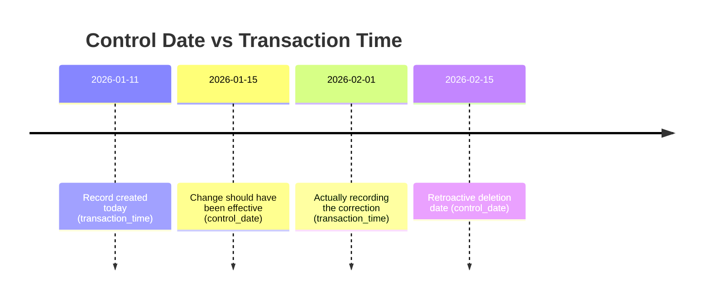

**Visual Representation of Valid vs Transaction Time:**

| Version | Valid Time | Transaction Time | Notes |
|---------|------------|------------------|-------|
| v1 | `[2026-03-01, )` | `[2026-01-11, 2026-02-01)` | Created for future |
| v2 | `[2026-01-15, )` | `[2026-02-01, 2026-02-15)` | Retroactive update |
| v3 (deleted) | - | `[2026-02-15, )` | Retroactive deletion |

### When to Use Control Dates

| Scenario | Control Date | Transaction Time |
|----------|--------------|------------------|
| Future effective change | Future date | Now |
| Correcting past errors | Past date | Now |
| Regular operations | Omit (defaults to now) | Now |
| Bulk data import | Various dates | Now |

### Code Reference

This use case is based on test cases from:

- [`backend/tests/api/routes/test_wbs_elements.py`](../../backend/tests/api/routes/test_wbs_elements.py):
  - Control date endpoint tests

---

## Use Case 4: Branching for Change Orders

### Scenario

A change order is requested to modify a WBSElement. Before approval, the changes need to be isolated from the main production state. Once approved, the changes are merged into main. If rejected, the branch is discarded.

### Business Context

**Change Order Workflow:**

1. Request: Stakeholder requests a change
2. Branch: Create isolated branch for the change
3. Modify: Make changes on the branch
4. Review: Stakeholders review changes
5. Decision: Approve (merge) or Reject (discard branch)
6. Audit: Complete history of the change order process

> **Note:** Branching operations (create branch, merge, revert) are managed through the ChangeOrder API (`/api/v1/change-orders`), not through dedicated WBS Element sub-endpoints. The ChangeOrder workflow automatically handles branch creation and merging via service-layer commands (`CreateBranchCommand`, `MergeBranchCommand`, `RevertCommand`).

### Step-by-Step Example

#### Step 1: Initial State on Main Branch

Start with a WBSElement on the main branch:

```bash
GET /api/v1/wbs-elements/wbs-root-co1
```

**Response (Main Branch):**

```json
{
  "id": "wbs-main-v1-abc",
  "wbs_element_id": "wbs-root-co1",
  "code": "4.0",
  "name": "Phase 4 - MEP Systems",
  "budget_allocation": "80000.00",
  "branch": "main",
  "valid_time": "[2026-01-01T10:00:00+00,)"
}
```

#### Step 2: Create Change Order

Create a change order which automatically creates an isolated branch:

```bash
POST /api/v1/change-orders
Content-Type: application/json

{
  "project_id": "550e8400-e29b-41d4-a716-446655440000",
  "code": "CO-2026-001",
  "title": "Increase MEP budget",
  "description": "Budget increase for MEP systems"
}
```

**What Happened:**

- A new branch (e.g., `change-order-001`) is created automatically
- WBSElements on this branch are cloned from the main branch
- Both branches now have current versions

#### Step 3: Modify on Change Order Branch

Update the WBSElement on the change order branch:

```bash
PUT /api/v1/wbs-elements/wbs-root-co1
Content-Type: application/json

{
  "revenue_allocation": 120000.00,
  "branch": "change-order-001"
}
```

**Response:**

```json
{
  "id": "wbs-BR-v2-ghi",
  "wbs_element_id": "wbs-root-co1",
  "revenue_allocation": "120000.00",
  "branch": "change-order-001",
  "parent_id": "wbs-BR-v1-def",
  "valid_time": "[2026-01-11T11:00:00+00,)"
}
```

**Verification - Main is Unaffected:**

```bash
GET /api/v1/wbs-elements/wbs-root-co1?branch=main
```

**Still shows:** `revenue_allocation: null` (original value)

**Verification - Change Order Shows New Value:**

```bash
GET /api/v1/wbs-elements/wbs-root-co1?branch=change-order-001
```

**Now shows:** `revenue_allocation: "120000.00"`

#### Step 4: Review Changes (Before Merge)

Check merge conflicts for the change order:

```bash
GET /api/v1/change-orders/{change_order_id}/merge-conflicts
```

**Response:**

```json
{
  "has_conflicts": false,
  "conflicts": []
}
```

#### Step 5: Approve and Merge to Main

Stakeholders approve the change order. Merge via the ChangeOrder API:

```bash
POST /api/v1/change-orders/{change_order_id}/merge
Content-Type: application/json

{}
```

**Response:**

```json
{
  "id": "wbs-main-v2-jkl",
  "wbs_element_id": "wbs-root-co1",
  "revenue_allocation": "120000.00",
  "branch": "main",
  "parent_id": "wbs-main-v1-abc",
  "merge_from_branch": "change-order-001",
  "valid_time": "[2026-01-11T12:00:00+00,)"
}
```

**What Happened:**

- A new version was created on main
- It has the revenue_allocation from the change order branch
- `merge_from_branch` tracks the source of the merge
- `parent_id` maintains the linear history on main
- The change order branch still exists (for audit)

#### Alternative Step 5: Reject

If the change order is rejected:

```bash
PUT /api/v1/change-orders/{change_order_id}/reject
Content-Type: application/json

{
  "comment": "Budget increase not justified"
}
```

**Result:**

- Change order is marked as rejected
- Main branch remains unchanged
- Branch data is preserved for audit trail

### Diagram: Branch Creation, Isolation, and Merge

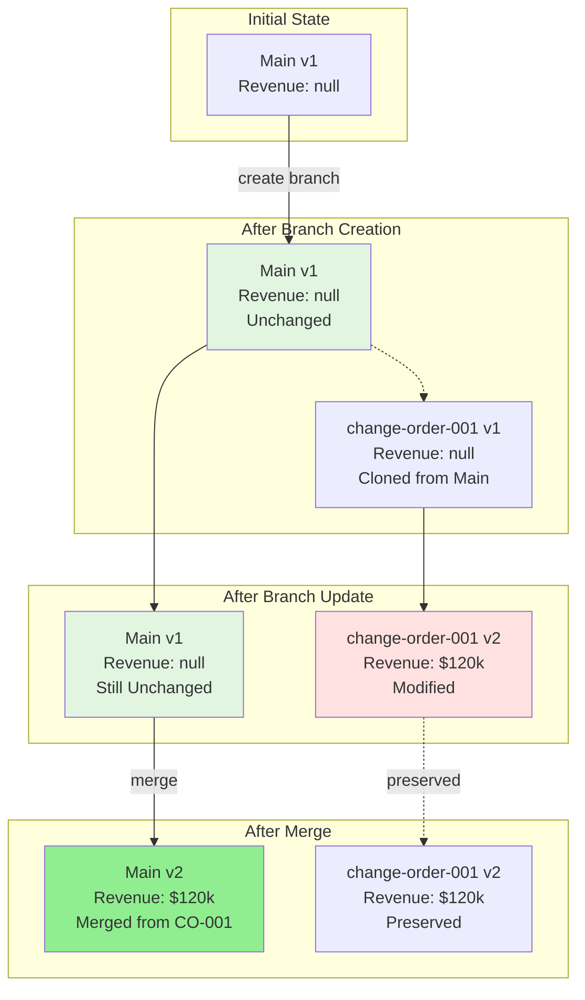

### Branch Isolation Rules

| Operation | Main Branch | Feature Branch |
|-----------|-------------|----------------|
| Read main | ✅ Current state | ✅ Sees snapshot from branch point |
| Read feature | ❌ Not visible | ✅ Current state |
| Update main | ✅ Creates new version on main | ❌ No effect |
| Update feature | ❌ No effect | ✅ Creates new version on feature |
| Merge to main | ✅ Creates new version from feature | ❌ No effect |

### Code Reference

This use case is based on test cases from:

- [`backend/tests/core/test_branching_core.py`](../../backend/tests/core/test_branching_core.py):
  - Branch creation, update, and merge command tests
- [`backend/tests/api/routes/test_wbs_elements.py`](../../backend/tests/api/routes/test_wbs_elements.py):
  - WBSElement endpoint tests with branch filtering

---

## Use Case 5: Hierarchical WBSElement Management

### Scenario

You need to manage a multi-level Work Breakdown Structure (WBS) with parent-child relationships. This includes:

- Creating three-level hierarchies
- Navigating the hierarchy with breadcrumbs
- Querying by level or parent
- Cascading soft deletes

### Business Context

**Typical WBS Hierarchy:**

```
1.0 Construction (Level 1)
├── 1.1 Site Preparation (Level 2)
│   ├── 1.1.1 Grading (Level 3)
│   └── 1.1.2 Utilities (Level 3)
└── 1.2 Building Structure (Level 2)
    ├── 1.2.1 Foundation (Level 3)
    └── 1.2.2 Framing (Level 3)
```

### Step-by-Step Example

#### Step 1: Create Level 1 Parent WBSElement

```bash
POST /api/v1/wbs-elements
Content-Type: application/json

{
  "project_id": "550e8400-e29b-41d4-a716-446655440000",
  "code": "1.0",
  "name": "Construction",
  "level": 1,
  "description": "Main construction phase"
}
```

**Response:**

```json
{
  "id": "wbs-l1-v1",
  "wbs_element_id": "wbs-root-l1",
  "code": "1.0",
  "name": "Construction",
  "budget_allocation": null,
  "revenue_allocation": null,
  "level": 1,
  "parent_wbs_element_id": null
}
```

#### Step 2: Create Level 2 Child WBSElements

```bash
# Create 1.1 Site Preparation
POST /api/v1/wbs-elements
{
  "project_id": "550e8400-e29b-41d4-a716-446655440000",
  "parent_wbs_element_id": "wbs-root-l1",
  "code": "1.1",
  "name": "Site Preparation",
  "level": 2
}

# Create 1.2 Building Structure
POST /api/v1/wbs-elements
{
  "project_id": "550e8400-e29b-41d4-a716-446655440000",
  "parent_wbs_element_id": "wbs-root-l1",
  "code": "1.2",
  "name": "Building Structure",
  "level": 2
}
```

#### Step 3: Create Level 3 Grandchild WBSElements

```bash
# Create 1.1.1 Grading
POST /api/v1/wbs-elements
{
  "project_id": "550e8400-e29b-41d4-a716-446655440000",
  "parent_wbs_element_id": "wbs-root-l1-1",
  "code": "1.1.1",
  "name": "Grading",
  "level": 3
}

# Create 1.1.2 Utilities
POST /api/v1/wbs-elements
{
  "project_id": "550e8400-e29b-41d4-a716-446655440000",
  "parent_wbs_element_id": "wbs-root-l1-1",
  "code": "1.1.2",
  "name": "Utilities",
  "level": 3
}

# Create 1.2.1 Foundation
POST /api/v1/wbs-elements
{
  "project_id": "550e8400-e29b-41d4-a716-446655440000",
  "parent_wbs_element_id": "wbs-root-l1-2",
  "code": "1.2.1",
  "name": "Foundation",
  "level": 3
}

# Create 1.2.2 Framing
POST /api/v1/wbs-elements
{
  "project_id": "550e8400-e29b-41d4-a716-446655440000",
  "parent_wbs_element_id": "wbs-root-l1-2",
  "code": "1.2.2",
  "name": "Framing",
  "level": 3
}
```

#### Step 4: Get Full Tree

Retrieve the complete WBS tree for a project:

```bash
GET /api/v1/wbs-elements/project/{project_id}/tree
```

**Response:**

```json
{
  "id": "wbs-root-l1",
  "wbs_element_id": "wbs-root-l1",
  "code": "1.0",
  "name": "Construction",
  "children": [
    {
      "id": "wbs-root-l1-1",
      "wbs_element_id": "wbs-root-l1-1",
      "code": "1.1",
      "name": "Site Preparation",
      "children": [
        {
          "id": "wbs-root-l1-1-1",
          "wbs_element_id": "wbs-root-l1-1-1",
          "code": "1.1.1",
          "name": "Grading",
          "children": []
        },
        {
          "id": "wbs-root-l1-1-2",
          "wbs_element_id": "wbs-root-l1-1-2",
          "code": "1.1.2",
          "name": "Utilities",
          "children": []
        }
      ]
    },
    {
      "id": "wbs-root-l1-2",
      "wbs_element_id": "wbs-root-l1-2",
      "code": "1.2",
      "name": "Building Structure",
      "children": [
        {
          "id": "wbs-root-l1-2-1",
          "wbs_element_id": "wbs-root-l1-2-1",
          "code": "1.2.1",
          "name": "Foundation",
          "children": []
        },
        {
          "id": "wbs-root-l1-2-2",
          "wbs_element_id": "wbs-root-l1-2-2",
          "code": "1.2.2",
          "name": "Framing",
          "children": []
        }
      ]
    }
  ]
}
```

#### Step 5: Navigate with Breadcrumb

Get the breadcrumb trail for a deep WBSElement:

```bash
GET /api/v1/wbs-elements/wbs-root-l1-1-1/breadcrumb
```

**Response for 1.1.1 Grading:**

```json
{
  "project": {
    "id": "proj-version-abc",
    "project_id": "550e8400-e29b-41d4-a716-446655440000",
    "code": "PRJ-001",
    "name": "Building Project"
  },
  "wbe_path": [
    {
      "id": "wbs-l1-v1",
      "wbs_element_id": "wbs-root-l1",
      "code": "1.0",
      "name": "Construction"
    },
    {
      "id": "wbs-l1-1-v1",
      "wbs_element_id": "wbs-root-l1-1",
      "code": "1.1",
      "name": "Site Preparation"
    },
    {
      "id": "wbs-l1-1-1-v1",
      "wbs_element_id": "wbs-root-l1-1-1",
      "code": "1.1.1",
      "name": "Grading"
    }
  ]
}
```

#### Step 6: Query by Parent

Get all direct children of a WBSElement:

```bash
GET /api/v1/wbs-elements?parent_id=wbs-root-l1
```

**Response:**

```json
[
  {
    "wbs_element_id": "wbs-root-l1-1",
    "code": "1.1",
    "name": "Site Preparation",
    "level": 2,
    "parent_name": "Construction"
  },
  {
    "wbs_element_id": "wbs-root-l1-2",
    "code": "1.2",
    "name": "Building Structure",
    "level": 2,
    "parent_name": "Construction"
  }
]
```

#### Step 7: Cascading Soft Delete

Delete a parent WBSElement -- all descendants are also soft deleted:

```bash
DELETE /api/v1/wbs-elements/wbs-root-l1-1
```

**Result:** WBSElement 1.1 (Site Preparation) is deleted, AND:

- 1.1.1 (Grading) is also deleted
- 1.1.2 (Utilities) is also deleted

**Verification:**

```bash
GET /api/v1/wbs-elements?parent_id=wbs-root-l1-1
# Response: [] (empty, all children deleted)

GET /api/v1/wbs-elements?parent_id=wbs-root-l1
# Response: Only 1.2 remains
```

**Note:** The descendants are still in the database (soft delete), but marked with `deleted_at` timestamps. They won't appear in normal queries.

### Diagram: Hierarchical Tree with Version Chains

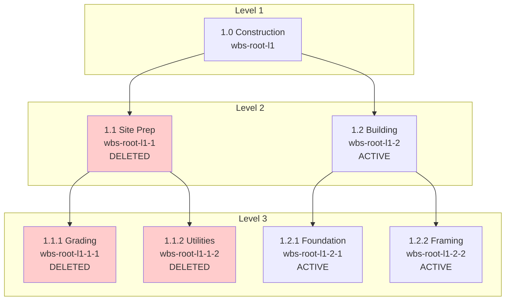

### Hierarchy Query Patterns

| Query Pattern | Endpoint | Use Case |
|---------------|----------|----------|
| Get root level | `GET /wbs-elements?root_only=true` | Top-level WBSElements |
| Get children | `GET /wbs-elements?parent_id={id}` | Direct descendants |
| Get full tree | `GET /wbs-elements/project/{project_id}/tree` | Complete WBS tree |
| Get breadcrumb | `GET /wbs-elements/{id}/breadcrumb` | Navigation path |

### Code Reference

This use case is based on test cases from:

- [`backend/tests/api/routes/test_wbs_elements.py`](../../backend/tests/api/routes/test_wbs_elements.py):
  - `test_wbs_element_hierarchical_structure` - Hierarchy tests

---

## Use Case 6: Revert Operations

### Scenario

An incorrect update was made to a WBSElement. You need to revert to the previous state. EVCS creates a new version with the old state, preserving the complete history.

> **Note:** Revert operations for change orders are performed via the ChangeOrder API: `POST /api/v1/change-orders/{change_order_id}/revert`

### Business Context

**Revert Use Cases:**

- Data entry errors
- Incorrect change order merged to main
- Need to undo multiple changes at once
- Experimental changes that didn't work out

### Step-by-Step Example

#### Step 1: Create Initial WBSElement

```bash
POST /api/v1/wbs-elements
Content-Type: application/json

{
  "project_id": "550e8400-e29b-41d4-a716-446655440000",
  "code": "5.0",
  "name": "Phase 5 - Commissioning",
  "level": 1
}
```

**Response (v1):**

```json
{
  "id": "wbs-v1-xyz",
  "wbs_element_id": "wbs-root-revert",
  "parent_id": null
}
```

#### Step 2: Make Incorrect Update

```bash
PUT /api/v1/wbs-elements/wbs-root-revert
Content-Type: application/json

{
  "name": "Phase 5 - WRONG NAME"
}
```

**Response (v2 - ERROR!):**

```json
{
  "id": "wbs-v2-xyz",
  "wbs_element_id": "wbs-root-revert",
  "name": "Phase 5 - WRONG NAME",
  "parent_id": "wbs-v1-xyz"
}
```

#### Step 3: Make Another Update

```bash
PUT /api/v1/wbs-elements/wbs-root-revert
Content-Type: application/json

{
  "name": "Phase 5 - ANOTHER WRONG NAME"
}
```

**Response (v3):**

```json
{
  "id": "wbs-v3-xyz",
  "wbs_element_id": "wbs-root-revert",
  "name": "Phase 5 - ANOTHER WRONG NAME",
  "parent_id": "wbs-v2-xyz"
}
```

#### Step 4: Revert via Change Order

For change orders, revert through the ChangeOrder API:

```bash
POST /api/v1/change-orders/{change_order_id}/revert
Content-Type: application/json

{}
```

**What Happened:**

- A NEW version (v4) is created
- v4 has the same data as v1 (original name)
- `parent_id` points to v3 (maintains linear history)
- v2 and v3 are preserved in history

#### Step 5: Verify History

```bash
GET /api/v1/wbs-elements/wbs-root-revert/history
```

**Response:**

```json
[
  {
    "id": "wbs-v1-xyz",
    "name": "Phase 5 - Commissioning",
    "parent_id": null
  },
  {
    "id": "wbs-v2-xyz",
    "name": "Phase 5 - WRONG NAME",
    "parent_id": "wbs-v1-xyz"
  },
  {
    "id": "wbs-v3-xyz",
    "name": "Phase 5 - ANOTHER WRONG NAME",
    "parent_id": "wbs-v2-xyz"
  },
  {
    "id": "wbs-v4-xyz",
    "name": "Phase 5 - Commissioning",
    "parent_id": "wbs-v3-xyz"
  }
]
```

### Diagram: Revert Flow Creating New Version from Old State

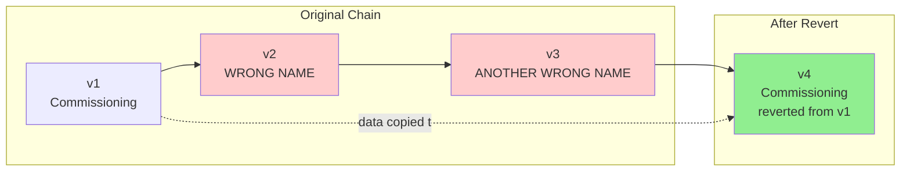

### Revert vs Delete vs Undo

| Operation | What Happens | When to Use |
|-----------|--------------|-------------|
| **Revert** | Creates new version with old state | Fix mistakes, undo changes |
| **Soft Delete** | Marks version(s) as deleted | Entity no longer needed |
| **Undo** | Not directly supported | Use revert instead |
| **Time Travel Query** | Reads old state without changing | Reference only |

### Code Reference

This use case is based on test cases from:

- [`backend/tests/core/test_branching_core.py`](../../backend/tests/core/test_branching_core.py):
  - Revert command tests

---

## API Reference Summary

### WBSElement Endpoints

| Method | Endpoint | Description | Branch Support |
|--------|----------|-------------|----------------|
| `POST` | `/api/v1/wbs-elements` | Create new WBSElement | Optional `branch` field |
| `GET` | `/api/v1/wbs-elements` | List WBSElements with filters | `?branch=` parameter |
| `GET` | `/api/v1/wbs-elements/{wbs_element_id}` | Get current WBSElement | `?branch=` parameter |
| `GET` | `/api/v1/wbs-elements/{wbs_element_id}?as_of={date}` | Time travel query | `?branch=` + `?as_of=` |
| `PUT` | `/api/v1/wbs-elements/{wbs_element_id}` | Update WBSElement | Body: `branch` field |
| `DELETE` | `/api/v1/wbs-elements/{wbs_element_id}` | Soft delete WBSElement | `?branch=` parameter |
| `GET` | `/api/v1/wbs-elements/{wbs_element_id}/history` | Get version history | `?branch=` parameter |
| `GET` | `/api/v1/wbs-elements/{wbs_element_id}/breadcrumb` | Get hierarchy path | N/A |
| `GET` | `/api/v1/wbs-elements/project/{project_id}/tree` | Get full WBS tree | N/A |

> **Note:** Branch creation, merging, and reverting are handled through the ChangeOrder API (`/api/v1/change-orders`), not through WBSElement sub-endpoints. See the ChangeOrder API for merge, revert, and approval workflows.

### Query Parameters for List Endpoint

```
GET /api/v1/wbs-elements?
    project_id={uuid}              # Filter by project
    &parent_id={uuid}              # Filter by parent
    &root_only={bool}              # Return only root-level elements
    &level={int}                   # Filter by level
    &branch={string}               # Filter by branch
    &search={string}               # Search code/name
    &page={int}                    # Page number (default 1)
    &per_page={int}                # Items per page (default 20)
    &sort_field={field}            # Sort field
    &sort_order={asc|desc}         # Sort order
```

### Request/Response Examples

#### Create WBSElement

**Request:**

```http
POST /api/v1/wbs-elements HTTP/1.1
Content-Type: application/json

{
  "project_id": "550e8400-e29b-41d4-a716-446655440000",
  "parent_wbs_element_id": null,
  "code": "1.0",
  "name": "Phase 1",
  "revenue_allocation": 100000.00,
  "level": 1,
  "description": "Initial phase",
  "control_date": "2026-01-01T10:00:00+00"
}
```

**Response (201 Created):**

```json
{
  "id": "wbs-version-id",
  "wbs_element_id": "wbs-root-id",
  "project_id": "550e8400-e29b-41d4-a716-446655440000",
  "parent_wbs_element_id": null,
  "code": "1.0",
  "name": "Phase 1",
  "budget_allocation": null,
  "revenue_allocation": "100000.00",
  "level": 1,
  "description": "Initial phase",
  "branch": "main",
  "parent_id": null,
  "merge_from_branch": null,
  "valid_time": "[2026-01-01T10:00:00+00,)",
  "transaction_time": "[2026-01-11T10:00:00+00,)",
  "deleted_at": null
}
```

#### Update WBSElement

**Request:**

```http
PUT /api/v1/wbs-elements/wbs-root-id HTTP/1.1
Content-Type: application/json

{
  "description": "Updated scope",
  "revenue_allocation": 120000.00,
  "branch": "main",
  "control_date": "2026-02-01T10:00:00+00"
}
```

**Response (200 OK):**

```json
{
  "id": "wbs-new-version-id",
  "wbs_element_id": "wbs-root-id",
  "description": "Updated scope",
  "revenue_allocation": "120000.00",
  "branch": "main",
  "parent_id": "wbs-version-id",
  "valid_time": "[2026-02-01T10:00:00+00,)",
  "transaction_time": "[2026-01-11T11:00:00+00,)"
}
```

#### Time Travel Query

**Request:**

```http
GET /api/v1/wbs-elements/wbs-root-id?as_of=2026-01-15T10:00:00+00 HTTP/1.1
```

**Response (200 OK):**

```json
{
  "id": "wbs-version-id",
  "wbs_element_id": "wbs-root-id",
  "valid_time": "[2026-01-01T10:00:00+00,2026-02-01T10:00:00+00)",
  "transaction_time": "[2026-01-01T10:00:00+00,2026-02-01T10:00:00+00)"
}
```

---

## Best Practices

### When to Use Branches vs Direct Updates

| Scenario | Approach | Rationale |
|----------|----------|-----------|
| **Routine data entry** | Direct update on main | Simple, no approval needed |
| **Change order workflow** | Create branch, then merge | Isolation, approval process |
| **What-if analysis** | Create branch | Non-destructive exploration |
| **Emergency fix** | Direct update on main | Speed, immediate effect |
| **Collaborative editing** | Create branch per user | Avoid conflicts |

**Decision Tree:**

```
Does the change need approval?
├── Yes → Use branch
└── No
    ├── Is it a routine update?
    │   ├── Yes → Direct update on main
    │   └── No → Could it break something?
    │       ├── Yes → Use branch for safety
    │       └── No → Direct update on main
```

### Control Date Guidelines

| Scenario | Control Date Value | Example |
|----------|-------------------|---------|
| **Regular operation** | Omit (defaults to now) | Update today's data |
| **Future effective** | Future timestamp | Change starts next month |
| **Backdated correction** | Past timestamp | Fix last week's error |
| **Bulk import** | Actual business date | Import with correct dates |
| **Never use** | Invalid timezone | Always include timezone offset |

**Control Date Rules:**

1. Always include timezone: `2026-01-01T10:00:00+00`
2. Use UTC for consistency: `+00` offset
3. Be precise with time: Don't omit time component
4. Document retroactive changes in audit log

### Soft Delete vs Hard Delete

| Aspect | Soft Delete | Hard Delete |
|--------|-------------|-------------|
| **Data Recovery** | Possible via undelete | Impossible |
| **History** | Preserved in history | Preserved in history |
| **Query Visibility** | Hidden in normal queries | Hidden completely |
| **Storage** | Records remain in DB | Records remain in DB |
| **Use When** | Mistakes, temporary removal | Compliance (GDPR, etc.) |

**Soft Delete Best Practices:**

- Always prefer soft delete for business entities
- Implement undelete workflow for recovery
- Consider retention policies for old deleted records

### Query Optimization for Temporal Data

#### Use Appropriate Indexes

The system automatically creates GIST indexes for temporal queries:

```sql
-- Automatic indexes (created by migrations)
CREATE INDEX ix_wbs_elements_valid_gist ON wbs_elements USING GIST (valid_time);
CREATE INDEX ix_wbs_elements_tx_gist ON wbs_elements USING GIST (transaction_time);
```

#### Query Patterns

**Good:**

```sql
-- Uses GIST index efficiently
WHERE valid_time @> NOW()
WHERE transaction_time @> '2026-01-01'::timestamptz
```

**Avoid:**

```sql
-- Doesn't use GIST index
WHERE LOWER(valid_time) > '2026-01-01'
WHERE valid_time IS NOT NULL
```

#### Pagination Strategy

For large result sets, use page-based pagination:

```bash
# First page
GET /api/v1/wbs-elements?page=1&per_page=100

# Second page
GET /api/v1/wbs-elements?page=2&per_page=100
```

### Bitemporal Query Patterns

#### "What did we believe at time T?"

Use `transaction_time` to see what the system knew at a point in time:

```sql
WHERE transaction_time @> '2026-01-15T10:00:00+00'::timestamptz
```

**Use Case:** Audit investigation - "What data did we have when we generated this report?"

#### "What was true at time T?"

Use `valid_time` to see what was effective at a point in time:

```sql
WHERE valid_time @> '2026-01-15T10:00:00+00'::timestamptz
```

**Use Case:** Historical analysis - "What was the budget on January 15th?"

#### "What do we believe now about time T?"

Combine both:

```sql
WHERE transaction_time @> NOW()
  AND valid_time @> '2026-01-15T10:00:00+00'::timestamptz
```

**Use Case:** Corrected historical data - "What do we now know about January 15th?"

---

## Common Patterns & Recipes

### Pattern 1: Bulk Updates with Single Control Date

**Scenario:** You need to update multiple WBSElements with the same effective date.

```bash
# Update multiple WBSElements with same control date
for wbs_element_id in "${wbs_list[@]}"; do
  curl -X PUT "http://api/wbs-elements/$wbs_element_id" \
    -H "Content-Type: application/json" \
    -d "{
      \"description\": \"$new_description\",
      \"control_date\": \"2026-01-01T10:00:00+00\"
    }"
done
```

**Key Points:**

- All updates get same `valid_time` start
- Each update creates new version
- `transaction_time` reflects actual update time
- Useful for periodic adjustments

### Pattern 2: Audit Trail Reconstruction

**Scenario:** Generate a complete audit trail for a WBSElement.

```python
async def get_audit_trail(wbs_element_id: str, session: AsyncSession) -> list[dict]:
    """Get complete audit trail for a WBSElement."""
    history = await wbs_element_service.get_history(session, wbs_element_id)

    trail = []
    for version in history:
        trail.append({
            "version_id": version.id,
            "effective_at": version.valid_time.lower,
            "recorded_at": version.transaction_time.lower,
            "ended_at": version.valid_time.upper,
            "created_by": version.created_by,
            "changes": {
                "name": version.name,
                "code": version.code,
                "branch": version.branch,
            }
        })

    return trail
```

**Output Format:**

```json
[
  {
    "version_id": "abc-123",
    "effective_at": "2026-01-01T10:00:00+00",
    "recorded_at": "2026-01-01T10:00:00+00",
    "ended_at": "2026-01-15T10:00:00+00",
    "created_by": "user-456",
    "changes": {
      "name": "Original Name",
      "code": "1.0",
      "branch": "main"
    }
  },
  {
    "version_id": "def-789",
    "effective_at": "2026-01-15T10:00:00+00",
    "recorded_at": "2026-01-15T10:00:00+00",
    "ended_at": null,
    "created_by": "user-789",
    "changes": {
      "name": "Updated Name",
      "code": "1.0",
      "branch": "main"
    }
  }
]
```

### Pattern 3: Difference Detection Between Versions

**Scenario:** Compare two versions to show exactly what changed.

```python
def diff_versions(v1: WBSElement, v2: WBSElement) -> dict:
    """Calculate differences between two WBSElement versions."""
    fields_to_compare = [
        "name", "code", "description", "level",
        "revenue_allocation"
    ]

    changes = {}
    for field in fields_to_compare:
        val1 = getattr(v1, field)
        val2 = getattr(v2, field)
        if val1 != val2:
            changes[field] = {
                "from": val1,
                "to": val2,
                "changed": True
            }

    return {
        "version_from": v1.id,
        "version_to": v2.id,
        "changes": changes,
        "change_count": len(changes)
    }
```

**Usage:**

```python
v1 = await get_version_at(wbs_element_id, as_of=date1)
v2 = await get_version_at(wbs_element_id, as_of=date2)
diff = diff_versions(v1, v2)
```

### Pattern 4: Branch-per-Change-Order Workflow

**Scenario:** Formal change order process with numbered branches.

```python
async def create_change_order(
    wbs_element_id: str,
    change_order_number: int,
    proposed_changes: dict,
    session: AsyncSession
) -> dict:
    """Create a change order branch with proposed changes."""

    # 1. Create branch for change order
    branch_name = f"change-order-{change_order_number:04d}"
    branch_cmd = CreateBranchCommand(
        entity_class=WBSElement,
        root_id=wbs_element_id,
        actor_id=current_user.id,
        new_branch=branch_name,
        from_branch="main"
    )
    await branch_cmd.execute(session)

    # 2. Apply changes on branch
    update_cmd = UpdateCommand(
        entity_class=WBSElement,
        root_id=wbs_element_id,
        actor_id=current_user.id,
        updates=proposed_changes,
        branch=branch_name
    )
    updated = await update_cmd.execute(session)

    # 3. Return comparison for review
    main_version = await wbs_element_service.get_current(session, wbs_element_id, branch="main")
    comparison = diff_versions(main_version, updated)

    return {
        "branch_name": branch_name,
        "proposed_changes": comparison,
        "status": "pending_approval"
    }
```

**Workflow:**

1. Create change order branch
2. Make changes on branch
3. Generate comparison report
4. Stakeholders review
5. Approve → Merge to main (via ChangeOrder API)
6. Reject → Reject change order (via ChangeOrder API)

### Pattern 5: Time Travel for Reporting

**Scenario:** Generate a report as it would have looked at a past date.

```python
async def generate_historical_report(
    project_id: str,
    as_of_date: datetime,
    session: AsyncSession
) -> dict:
    """Generate report for a specific point in time."""

    # Get all WBSElements as of the specified date
    wbs_elements = await wbs_element_service.get_wbs_elements(
        session,
        project_id=project_id,
        as_of=as_of_date
    )

    return {
        "report_date": as_of_date,
        "as_of_date": as_of_date,
        "wbs_element_count": len(wbs_elements),
        "wbs_elements": [
            {
                "code": w.code,
                "name": w.name,
                "budget_allocation": w.budget_allocation,
                "revenue_allocation": w.revenue_allocation,
                "valid_at": w.valid_time,
            }
            for w in wbs_elements
        ]
    }
```

### Pattern 6: Undelete Workflow

**Scenario:** Recover a soft-deleted WBSElement.

```python
async def undelete_wbs_element(
    wbs_element_id: str,
    session: AsyncSession,
    current_user_id: str
) -> WBSElement:
    """Undelete a soft-deleted WBSElement via the service layer."""

    # Undelete through the service layer
    wbs_element = await wbs_element_service.undelete(
        session,
        wbs_element_id=wbs_element_id,
        actor_id=current_user_id
    )

    return wbs_element
```

---

## Additional Resources

### Architecture Documentation

- [EVCS Core Architecture](../02-architecture/backend/contexts/evcs-core/architecture.md) - System architecture and patterns
- [Entity Classification Guide](../02-architecture/backend/contexts/evcs-core/entity-classification.md) - Choosing entity types
- [Temporal Patterns Reference](../02-architecture/backend/contexts/evcs-core/evcs-implementation-guide.md) - Query patterns and recipes
- [ADR-005: Bitemporal Versioning](../02-architecture/decisions/ADR-005-bitemporal-versioning.md) - Versioning design decisions
- [ADR-006: Protocol-Based Type System](../02-architecture/decisions/ADR-006-protocol-based-type-system.md) - Type-safe entity tier system

### Code References

- **WBSElement Model:** [`backend/app/models/domain/wbs_element.py`](../../backend/app/models/domain/wbs_element.py)
- **WBSElement Service:** [`backend/app/services/wbs_element_service.py`](../../backend/app/services/wbs_element_service.py)
- **WBSElement API:** [`backend/app/api/routes/wbs_elements.py`](../../backend/app/api/routes/wbs_elements.py)
- **Branch Commands:** [`backend/app/core/branching/commands.py`](../../backend/app/core/branching/commands.py)
- **Versioning Commands:** [`backend/app/core/versioning/commands.py`](../../backend/app/core/versioning/commands.py)

### Test Examples

- **WBSElement API Tests:** [`backend/tests/api/routes/test_wbs_elements.py`](../../backend/tests/api/routes/test_wbs_elements.py)
- **Branching Core Tests:** [`backend/tests/core/test_branching_core.py`](../../backend/tests/core/test_branching_core.py)
- **Versioning Core Tests:** [`backend/tests/core/test_versioning_core.py`](../../backend/tests/core/test_versioning_core.py)
- **Temporal Query Tests:** [`backend/tests/core/test_temporal_queries.py`](../../backend/tests/core/test_temporal_queries.py)

---

## Appendix: WBSElement Data Model

### WBSElement Table Structure

| Column | Type | Description |
|--------|------|-------------|
| `id` | UUID (PK) | Unique version identifier |
| `wbs_element_id` | UUID (Index) | Stable WBSElement root identifier |
| `project_id` | UUID (Index) | Parent project root ID |
| `parent_wbs_element_id` | UUID (Index, nullable) | Parent WBSElement root ID for hierarchy |
| `code` | VARCHAR(50) | WBS code (e.g., "1.2.3") |
| `name` | VARCHAR(255) | WBSElement name |
| `revenue_allocation` | DECIMAL(15,2), nullable | Revenue allocated from project contract value |
| `level` | INTEGER | Hierarchy level |
| `description` | TEXT, nullable | Optional description |
| `valid_time` | TSTZRANGE | Business validity period |
| `transaction_time` | TSTZRANGE | System recording period |
| `deleted_at` | TIMESTAMPTZ, nullable | Soft delete timestamp |
| `created_by` | UUID | User who created this version |
| `deleted_by` | UUID, nullable | User who deleted this version |
| `branch` | VARCHAR(80) | Branch name |
| `parent_id` | UUID (Index, nullable) | Previous version in DAG |
| `merge_from_branch` | VARCHAR(80), nullable | Merge source branch |

**Note:** `budget_allocation` is NOT a stored column. It is a computed attribute, calculated on-the-fly as the sum of Cost Element amounts in the full hierarchy. It appears in GET responses but cannot be set via POST or PUT requests.

### Indexes

```sql
-- GIST indexes for temporal queries
CREATE INDEX ix_wbs_elements_valid_gist ON wbs_elements USING GIST (valid_time);
CREATE INDEX ix_wbs_elements_tx_gist ON wbs_elements USING GIST (transaction_time);

-- B-tree indexes for lookups
CREATE INDEX ix_wbs_elements_wbs_element_id ON wbs_elements (wbs_element_id);
CREATE INDEX ix_wbs_elements_project_id ON wbs_elements (project_id);
CREATE INDEX ix_wbs_elements_parent_wbs_element_id ON wbs_elements (parent_wbs_element_id);
CREATE INDEX ix_wbs_elements_branch ON wbs_elements (branch);
CREATE INDEX ix_wbs_elements_parent_id ON wbs_elements (parent_id);

-- Partial unique index: one current version per WBSElement per branch
CREATE UNIQUE INDEX uq_wbs_elements_current_branch
ON wbs_elements (wbs_element_id, branch)
WHERE upper(valid_time) IS NULL
  AND upper(transaction_time) IS NULL
  AND deleted_at IS NULL;
```

---

**Document Version:** 1.1
**Last Updated:** 2026-05-30
**Maintained By:** Backend Team

For questions or contributions to this guide, please refer to the [Documentation Guide](../00-meta/README.md).
