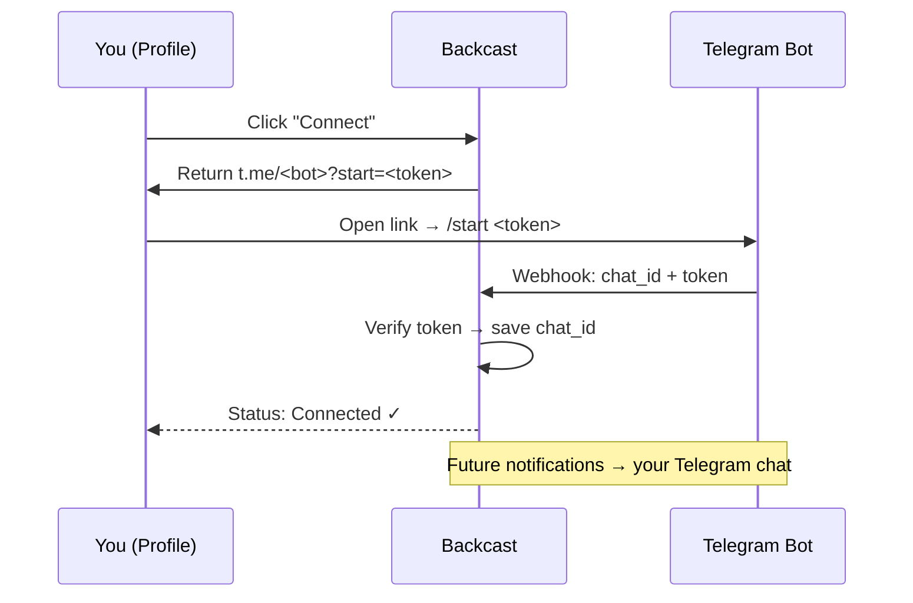
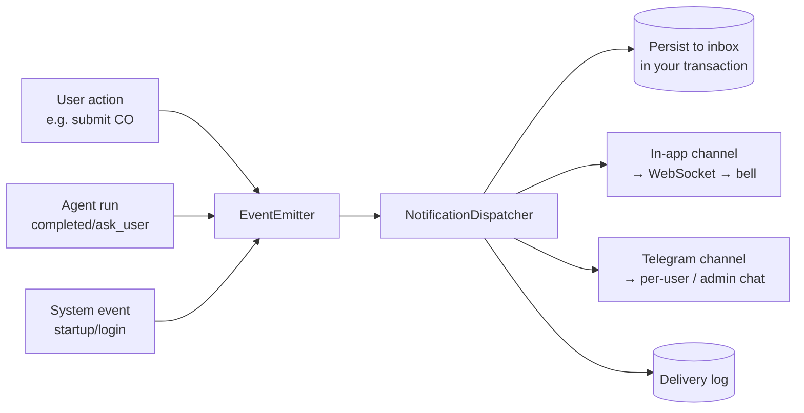

# Notification System User Guide

## Overview

The Backcast Notification System is a **unified, real-time notification center** that keeps every project participant informed about the events that matter to them — change-order approvals, AI agent activity, and system alerts — in one place.

Instead of checking different screens for different events, you now have a single **notification bell** in the top bar that:

- Shows a live, unread count (**no manual refresh needed**).
- Lets you read, filter, and act on notifications from every domain.
- Can **push notifications to Telegram** so you are alerted even when you are not looking at Backcast.
- Lets each user choose **what** they receive and **where** (in-app, Telegram, etc.).

Notifications can be triggered by **people** (e.g. a colleague submitting a change order for your approval) or by **AI agents** (e.g. a background agent finishing a report and notifying its owner). This guide explains how to use the system from an end-user perspective, with concrete use cases.

**Target audience:** all Backcast users (project managers, approvers, cost engineers, change managers, anyone running AI agents), plus administrators who want to enable Telegram delivery.

---

## Key concepts

| Concept | Meaning |
|---|---|
| **Notification** | A single message about one event, addressed to you. Lives in your inbox until you read it. |
| **Category** | The domain the event belongs to: *Change Orders*, *Agents*, *Project*, *Documents*, *Branches*, *System*. Used to group and filter. |
| **Severity** | How urgent it is: `info`, `notice`, `warning`, `urgent`. Drives the icon/color and whether it surfaces as a toast. |
| **Channel** | Where the notification is delivered: **In-app** (bell + Notification Center) and **Telegram** (more channels can be added). |
| **Actor** | Who triggered it: a **user**, an **agent**, or the **system**. Shown on each notification. |
| **Preferences** | Your per-category, per-channel opt-in/out settings (managed in your Profile). |

---

## Quick start

### 1. Read your notifications

1. Click the **bell icon** 🔔 in the top-right of the top bar. The badge number shows your unread count.
2. The popover lists your latest notifications, grouped by **category tabs** (All · Change Orders · Agents · System).
3. Each item shows a **severity icon** (ℹ info, 🔵 notice, ⚠ warning, 🚨 urgent), the title, a short message, the actor, and a relative timestamp.

### 2. Act on a notification

- **Open the related item:** click a notification to jump straight to the relevant change order, project, document, or agent run.
- **Mark as read:** click the *mark read* action on a single item, or use **Mark all as read** at the bottom of the popover.
- **See everything:** click **View all** to open the full **Notification Center** page.

### 3. Get notified in real time

You do not need to refresh. When a new notification arrives while you have Backcast open, you will see:

- A **toast** in the top-right corner (styled by severity).
- The **bell badge** update instantly.
- The new item appear at the top of the popover / Notification Center.

> If you were offline or logged out, the notifications are stored in your inbox and waiting when you return — nothing is lost.

---

## The Notification Center (`/notifications`)

The full-page Notification Center gives you a complete, filterable view of all your notifications.

**What you can do here:**

- **Filter** by *category*, *severity*, and *unread-only*.
- **Paginate** through your full history.
- **Mark read** individual rows or **mark all read**.
- **Click a row** to navigate to the related resource (change order, agent run, project, document).

This is the place to go when you have been away for a while and want to catch up on everything at once.

---

## Notification categories & types

### Change Orders

| Event | Severity | Who is notified | When |
|---|---|---|---|
| **Change order submitted for approval** | notice | The assigned **approver** | Someone submits a change order that needs your sign-off |
| **Change order approved** | notice | The **submitter/creator** | Your change order was approved |
| **Change order rejected** | notice | The **submitter/creator** | Your change order was rejected |

### Agents (AI)

| Event | Severity | Who is notified | When |
|---|---|---|---|
| **Agent completed** | notice | The **owner** of the run | A background agent finished its task successfully |
| **Agent failed** | urgent | The **owner** of the run | A run ended in error |
| **Agent needs your input** | notice | The **owner** of the run | An agent asked a clarifying question (`ask_user`) |
| **Agent requests approval** | urgent | The **owner** of the run | An agent hit an approval gate and needs your decision |
| **Agent stopped** | info | The **owner** of the run | A run was stopped (by you or the system) |

> Agent notifications are especially useful for **background executions**: start an agent, close the chat, and still get pinged the moment it finishes — or the moment it needs you.

### System alerts (administrators)

These go to the **administrator Telegram chat** only (not the in-app inbox):

| Event | When |
|---|---|
| **Server startup** | Backcast backend started successfully |
| **Unhandled exception** | An unexpected error occurred server-side |
| **User login** | A user signed in (includes IP and user-agent) |

> *Additional categories — Project (e.g. budget thresholds), Documents (e.g. lock events), and Branches (e.g. merge conflicts) — are part of the system's event registry and will be activated as those domains are wired in.*

---

## Use cases

### Use case 1 — Approving a change order

**Scenario:** A cost engineer submits a change order that needs the project manager's approval.

1. The cost engineer submits **CO-104** for approval and assigns the project manager as approver.
2. The project manager's bell badge increments **instantly** with a *notice* notification: *"Change Order CO-104 requires your approval."*
3. If the PM has Telegram enabled, the same message is also pushed to their Telegram.
4. The PM clicks the notification → lands directly on **CO-104** → approves it.
5. The cost engineer now receives an *"Change Order Approved"* notification (and the badge drops as each user reads their item).

**Why it matters:** approvers no longer have to poll a queue; submitters know the moment a decision is made.

### Use case 2 — Running an agent in the background

**Scenario:** A project manager kicks off a long-running analysis agent and moves on to other work.

1. The PM starts the agent and lets it run **in the background** (closes the chat tab).
2. The agent works for several minutes. The PM works on something else.
3. When the agent **finishes**, the PM gets an *"Agent completed"* notification (bell + toast, and Telegram if enabled) — without having kept the chat open.
4. Clicking it re-opens the run to read the result.

**Variant — the agent needs you:** if the agent hits a point where it must ask a question or request approval, you receive an *"Agent needs your input"* / *"Agent requests approval"* (urgent) notification so you can return and unblock it immediately.

**Why it matters:** agents become genuinely asynchronous — you can fire off work and trust you will be notified at the exact moment it is done or needs you.

### Use case 3 — Being notified on Telegram while away

**Scenario:** An approver is in meetings all day and not looking at Backcast.

1. The approver connects their Telegram account once (see [Connecting Telegram](#connecting-telegram)).
2. They keep their *Change Orders* and *Agents* Telegram channels enabled in Preferences.
3. While they are away, a change order is submitted for their approval and an agent finishes — both arrive as **Telegram messages** on their phone.
4. They tap a message, open Backcast, and act on it.

**Why it matters:** time-sensitive events reach you on the channel you actually watch, without forcing you to sit in the app.

### Use case 4 — Catching up after being away

**Scenario:** A user returns from a week off.

1. They open Backcast; the bell shows, say, **7** unread.
2. They open the **Notification Center** (`/notifications`), filter by *Change Orders* to triage approvals first, mark them read as they handle them, then switch to the *Agents* tab.
3. Everything is archived in their inbox history — nothing was lost while offline.

### Use case 5 — An agent surfacing work to its owner

**Scenario:** A supervisor agent delegates to a specialist and then completes.

1. The agent run emits an *"Agent completed"* notification addressed to the **owner** (the user who started it).
2. The owner is notified in-app and (optionally) on Telegram, regardless of whether the chat is open.
3. The notification links back to the specific run via its resource id.

> Today, agents notify their **owner user**. (Agents are first-class *senders* of notifications; an "agent → another agent" message routes to that agent's owning user.)

---

## Managing your preferences

Open **Profile → Notification Preferences**. You will see a matrix of **categories × channels**.

- Each row is an event type; toggle **In-app** and/or **Telegram** on or off.
- Defaults come from the system (e.g. Change Orders and Agents default to both In-app and Telegram; System alerts default to Telegram).
- Changes save automatically and take effect for the next notification.

**Examples:**

- "I want agent completions in-app but **not** on Telegram" → turn off the Agents → Telegram toggle.
- "I only care about urgent change-order events" → disable the lower-severity change-order rows.

> Preferences only affect **your** delivery. Other users' preferences are independent.

---

## Connecting Telegram

Telegram delivery is **per-user** and **opt-in**. Connect once and choose what to receive.

### Prerequisites

An administrator must have configured the Backcast Telegram bot (see [For administrators](#for-administrators)). If Telegram is not configured, the *Connect Telegram* option will tell you.

### Steps

1. Go to **Profile → Connect Telegram**.
2. Click **Connect**. Backcast generates a one-time secure link, e.g. `https://t.me/<bot>?start=<token>`.
3. Open that link (or scan it) — it opens a chat with the Backcast bot.
4. Send `/start <token>` to the bot (the link pre-fills this). The bot verifies the token and links your Backcast account to your Telegram chat.
5. The Profile panel polls automatically and switches to **"Connected ✓"** once verified, showing your Telegram chat id.
6. Use **Disconnect** any time to unlink.

> **Security:** linking uses a single-use token, so only *you* can connect *your* account. Never share your `/start` token.

### How messages appear

Telegram messages include a severity emoji, the title, the message body, the related resource, the actor, and (for system alerts) extra details such as IP/user-agent. Rate-limiting and retries are handled automatically (e.g. Telegram `429 Retry-After`).

---

## For administrators

### Enabling Telegram

Set these environment variables (see `deploy/.env.production.example`):

| Variable | Purpose |
|---|---|
| `TELEGRAM_ENABLED` | Master switch (`true`/`false`). |
| `TELEGRAM_BOT_TOKEN` | The bot token from [@BotFather](https://t.me/BotFather). |
| `TELEGRAM_BOT_USERNAME` | The bot's username (without `@`) — used to build the `t.me/<bot>?start=<token>` link. |
| `TELEGRAM_CHAT_ID` | The **administrator chat id** — receives *system alerts* (startup, exceptions, logins). |
| `TELEGRAM_WEBHOOK_SECRET` | Optional shared secret; Telegram must send it in the `X-Telegram-Bot-Api-Secret-Token` header. |
| `TELEGRAM_USE_POLLING` | `true` for **development** (long-polling) when you have no public webhook URL. |
| `NOTIFICATION_DELIVERY_RETENTION_DAYS` | How long delivery log rows are kept (default 30). |

### Receiving inbound messages

The bot can receive the `/start <token>` linking command in two ways:

- **Webhook (production):** register the webhook with Telegram pointing at `POST /api/v1/notifications/telegram/webhook`. Set `TELEGRAM_WEBHOOK_SECRET` and configure the same secret on the Telegram side.
- **Long-polling (development):** set `TELEGRAM_USE_POLLING=true`; Backcast polls `getUpdates` itself — no public URL required.

### Two distinct Telegram audiences

- **Per-user messages** (change orders, agents): routed to each user's linked chat (`telegram_accounts`). Users opt in via Preferences.
- **System alerts** (startup, exceptions, logins): sent to the single `TELEGRAM_CHAT_ID` admin chat, fire-and-forget, no inbox row.

### Data model (reference)

Notifications and their supporting tables (all non-versioned):

| Table | Purpose |
|---|---|
| `notifications` | Per-user inbox rows (event type, severity, actor, resource link, read state, idempotency key). |
| `user_notification_preferences` | Per-user, per-event-type, per-channel opt-in/out. |
| `notification_deliveries` | Delivery audit log per channel (sent/failed/skipped). |
| `telegram_accounts` | Per-user Telegram linking (chat id, verification token, verified flag). |

---

## Troubleshooting

| Symptom | Likely cause / fix |
|---|---|
| Bell count doesn't update | You may have dropped the WebSocket connection; it reconnects automatically. A page refresh re-syncs from the server. |
| No toast on new notifications | Toasts only show while the app is open. The item is still in your inbox. |
| Telegram messages not arriving | (1) Is `TELEGRAM_ENABLED=true` and a valid bot token set? (2) Did you complete the `/start <token>` step and see *Connected ✓*? (3) Is the event type's Telegram channel enabled in your Preferences? (4) For webhook mode, is the webhook registered and the secret matching? |
| *Connect Telegram* shows "not configured" | An admin has not set `TELEGRAM_BOT_TOKEN` / `TELEGRAM_BOT_USERNAME`. |
| Same notification appears twice | The system deduplicates by an idempotency key per user; if you genuinely triggered the same business action twice, you may get two distinct notifications. |
| I disconnected but still got one message | A message already in flight at the moment of disconnect may still arrive; subsequent events will not. |
| Agent events not appearing | Agent notifications fire on **terminal** events (completed/failed/stopped) and **human-input** events (ask_user/approval) — not on every token or step. Start/run events are not notified by design. |

---

## How it works (under the hood)

For developers extending the system, every notification flows through one funnel:

- **Emit** via `user_emitter` / `agent_emitter` / `system_emitter`.
- **Persist** inside the caller's transaction; **deliver** to channels *after commit* (so a rolled-back change never produces a notification, and channel fan-out can't break the business operation).
- **Channels** are pluggable (In-app and Telegram today; email/Slack/webhook can be added by implementing the channel interface).

See the architecture notes in [`02-architecture/`](../02-architecture/) for the full design, and the in-code module `backend/app/core/notifications/`.

---

## Summary

- **One bell, every domain** — change orders, agents, and system events in a single inbox.
- **Real-time** — live badge, toasts, and a WebSocket push channel; no manual refresh.
- **Telegram** — opt-in per-user delivery for when you are away, plus an admin channel for system alerts.
- **You're in control** — per-category, per-channel preferences in your Profile.
- **Agents and people** — both can trigger notifications to other users, making asynchronous work practical.
